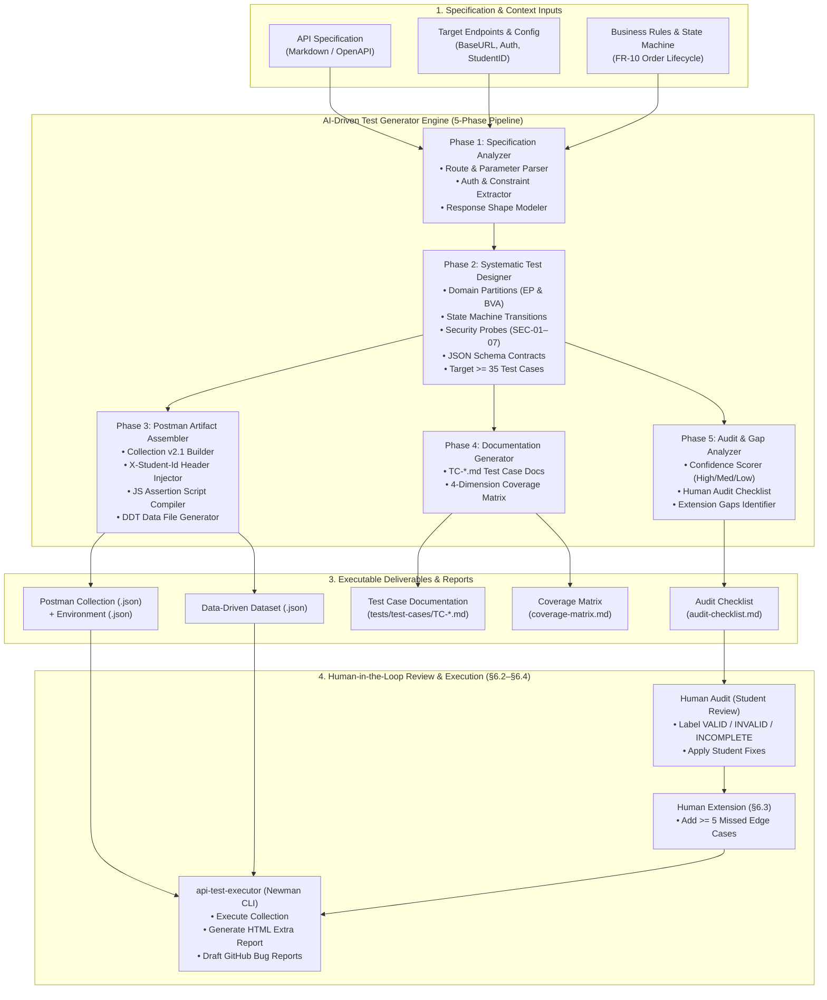

# Architecture Specification: AI-Driven API Test Generator (HW06 §7 / Bloom-AI G9.5)

This document specifies the architectural design, component interactions, and data-flow pipeline of the **AI-Driven API Test Generator**. 

> [!IMPORTANT]
> **Anti-AI-Cheat Constraint (HW06 §11):**  
> The diagram included in the final report must be **self-drawn by the student** (using any diagramming tool such as Draw.io, Excalidraw, Lucidchart, or hand-drawn). Use the Mermaid diagram and component breakdown below as your **design blueprint** to draw your own diagram.

---

## 1. System Architecture Diagram (Blueprint)

---

## 2. Component Breakdown

| Component | Responsibility | Inputs | Outputs |
|---|---|---|---|
| **1. Specification Analyzer** | Ingests and normalizes raw API specs (Markdown, OpenAPI, or plain text). Resolves types, parameters, HTTP verbs, security requirements, and response structures. | `api_specification.md`, config | Parsed Endpoint Metadata Object |
| **2. Systematic Test Designer** | Applies ISTQB and course test design techniques across 4 mandatory dimensions: Domain Partitioning (EP/BVA), State Transitions (FSM), OWASP Security (SEC-01–07), and JSON Schema Validation. | Endpoint Metadata, State Rules | Complete Abstract Test Suite ($\ge 35$ cases) |
| **3. Postman Artifact Assembler** | Compiles abstract test cases into valid Postman v2.1 Collection JSON. Embeds anti-cheat `X-Student-Id` pre-request scripts, JS assertion scripts (`pm.test`), and formats Data-Driven JSON files. | Abstract Test Suite, Student ID, Env Config | `<api>.postman_collection.json`, `eshop.postman_environment.json`, `<api>-data-driven.json` |
| **4. Documentation Generator** | Outputs formal Markdown test case specifications according to course templates (`TC-<API>-<NNN>.md`) and builds a multidimensional Coverage Matrix. | Abstract Test Suite | `TC-*.md` files, `coverage-matrix.md` |
| **5. Audit & Gap Analyzer** | Scores AI confidence for each test case, builds the audit checklist for student evaluation (`VALID`/`INVALID`/`INCOMPLETE`), and highlights domain gaps for manual test extension ($\ge 5$ cases). | Abstract Test Suite, Spec Ambiguities | `audit-checklist.md`, Gap Analysis Report |

---

## 3. Guide for Self-Drawing Your Diagram (HW06 §11)

To ensure full credit for the "Self-drawn diagram" requirement:

1. **Open your favorite diagramming tool:**
   - [Excalidraw](https://excalidraw.com) (Clean hand-drawn aesthetic, highly recommended)
   - [Draw.io / diagrams.net](https://app.diagrams.net) (Structured flowchart boxes)
2. **Draw the 4 main tiers:**
   - **Tier 1 (Top/Left):** Input Sources (`API Spec`, `Config`, `Business Rules`).
   - **Tier 2 (Center):** The 5 Generator Pipeline Phases (`Analyze` $\to$ `Design` $\to$ `Assemble` $\to$ `Document` $\to$ `Audit Prep`).
   - **Tier 3 (Right):** Generated Output Artifacts (`Postman Collection`, `Data File`, `TC-*.md`, `Coverage Matrix`, `Audit Checklist`).
   - **Tier 4 (Bottom):** Student Review & Newman Execution Loop (`Human Audit`, `Extension`, `Newman Execution`).
3. **Export:** Export as a high-resolution PNG image (`api_test_generator_architecture.png`) and include it in your main report and submission `.zip`.
