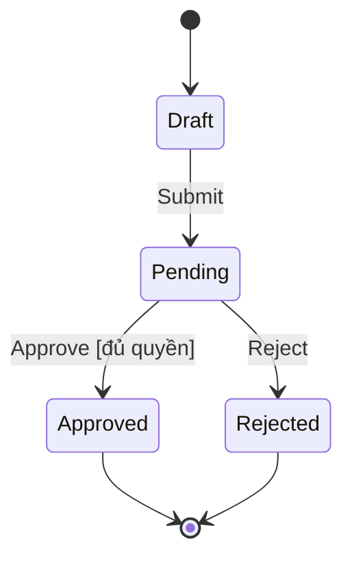

# Agent Skill: State Transition Testing — Test Case Writer

## Metadata

| Field      | Value                                                    |
| ---------- | -------------------------------------------------------- |
| Skill ID   | `state-transition-testing-writer`                        |
| Version    | 2.4                                                      |
| Author     | AI Agent                                                 |
| Created    | 2026-07-06                                               |
| Reusable   | Yes — works for any feature of EShop SUT or similar apps |
| Techniques | State Transition Testing                                 |

## Purpose

This skill guides an AI agent to systematically design test cases for a given feature using the **State Transition Testing** technique.
The AI must act as a **disciplined assistant** — NOT a black box. Every step must be explicit, traceable, and reviewable by the human tester.

---

## Prerequisites

Before invoking this skill, ensure:

1. **SRS document** is available at: `README.md` (root of the repository)
2. **API specification** is available at: `api_specification.md` (if applicable)
3. The target **Feature ID** or **Business Rule** is explicitly specified (e.g., `FR-08`)

---

## Input Parameters

| Parameter      | Required | Description                                         | Example                        |
| -------------- | -------- | --------------------------------------------------- | ------------------------------ |
| `FEATURE_ID`   | Yes      | The Functional Requirement ID from SRS              | `FR-08`                        |
| `FEATURE_NAME` | Yes      | Human-readable feature name                         | `Quản lý đơn hàng (Order SUT)` |
| `OUTPUT_DIR`   | No       | Output directory for test cases (default: `tests/`) | `tests/`                       |

---

## Execution Workflow

### PHASE 1: STATE TRANSITION TESTING

The AI MUST follow these 4 steps in order. Do NOT skip any step.

#### Step 1: Phân tích yêu cầu (States, Events, Guards & Actions)

**Objective**: Đọc kỹ spec và trích xuất các thành phần của máy trạng thái (state machine).

**Instructions for AI**:

1. Đọc kỹ spec của `{FEATURE_ID}`.
2. Trích xuất **States (trạng thái)**: Các trạng thái rời rạc mà đối tượng/hệ thống có thể ở tại một thời điểm (ví dụ: `Draft`, `Pending`, `Approved`, `Rejected`, `Cancelled`).
   - Xác định **trạng thái khởi tạo (initial state)** và **trạng thái kết thúc (final/terminal state)**.
3. Trích xuất **Events (sự kiện/hành động)**: Tác nhân gây ra sự chuyển đổi trạng thái (ví dụ: `Submit`, `Approve`, `Reject`, `Cancel`).
4. Trích xuất **Guard conditions (điều kiện đi kèm, nếu có)**: Điều kiện bổ sung phải thỏa mãn để transition xảy ra.
5. Trích xuất **Actions/Side-effects (nếu có)**: Hành động hệ thống thực hiện khi transition xảy ra (gửi email, ghi log, cập nhật DB...).

---

#### Step 2: Xây dựng State Transition Table

**Objective**: Xây dựng Bảng Chuyển Trạng Thái liệt kê mọi cặp (Trạng thái hiện tại, Sự kiện), kể cả các cặp không hợp lệ.

**Instructions for AI**:

1. Liệt kê toàn bộ mọi cặp (trạng thái hiện tại, sự kiện).
2. Bảng Chuyển Trạng Thái chỉ có **chính xác 4 cột**: **Trạng thái hiện tại**, **Sự kiện**, **Trạng thái tiếp theo**, **Hợp lệ?**.
3. Định dạng bảng Markdown:

| Trạng thái hiện tại | Sự kiện | Trạng thái tiếp theo | Hợp lệ?     |
| ------------------- | ------- | -------------------- | ----------- |
| Draft               | Submit  | Pending              | Y           |
| Draft               | Cancel  | Cancelled            | Y           |
| Draft               | Approve | -                    | N (invalid) |

4. Giải thích ký hiệu:
   - `Y`: Transition hợp lệ, hệ thống chuyển sang trạng thái mới.
   - `N (invalid)`: Sự kiện không được phép ở trạng thái này → hệ thống từ chối/báo lỗi, trạng thái không đổi.
   - `N (terminal state)`: Trạng thái kết thúc, không có transition tiếp theo.
   - `-`: Không áp dụng.

---

#### Step 3: Vẽ sơ đồ chuyển trạng thái (State Diagram)

**Objective**: Trực quan hóa máy trạng thái bằng sơ đồ Mermaid `stateDiagram-v2`.

**Instructions for AI**:

1. Sử dụng cú pháp Mermaid `stateDiagram-v2` để biểu diễn toàn bộ luồng chuyển trạng thái hợp lệ.
2. Đánh dấu rõ trạng thái khởi tạo `[*]` và trạng thái kết thúc `[*]`.



---

#### Step 4: Convert to Test Cases

**Objective**: Chuyển đổi các transition và chuỗi transition thành các test case chi tiết.

**Instructions for AI**:

1. Áp dụng đủ các nhóm bao phủ (coverage) theo thứ tự ưu tiên:
   - **Valid transitions (0-switch coverage)**: Mỗi transition hợp lệ trong bảng → ít nhất 1 test case.
   - **Invalid transitions**: Mỗi cặp (trạng thái, sự kiện) không hợp lệ → 1 test case kiểm tra hệ thống từ chối đúng cách và trạng thái không đổi.
   - **N-switch coverage (tùy chọn, cho hệ thống phức tạp)**: Chuỗi 2-3 transition liên tiếp (ví dụ: Draft → Pending → Approved) để kiểm tra luồng thực tế end-to-end.
2. Lưu các file test case vào thư mục `tests/test-cases/{MODULE}/` (ví dụ: `tests/test-cases/order/`). Nếu thư mục module chưa tồn tại, hãy tự động tạo nó.
3. Định dạng tên file: `TC-{MODULE}-STT-{ID}.md` (ví dụ: `TC-ORDER-STT-01.md`).
4. Sử dụng template sau cho mỗi file test case:

```markdown
# TC-{MODULE}-STT-{ID}: {Tên ngắn gọn}

## Requirement ID

{FEATURE_ID}

## Module / Test type / Technique

{MODULE} / Functional / State Transition Testing

## Preconditions

- Trạng thái ban đầu của hệ thống: {Trạng thái ban đầu}

## Test data

| Field         | Value                |
| ------------- | -------------------- |
| Initial State | {Trạng thái ban đầu} |
| Trigger Event | {Sự kiện tác động}   |

## Test steps

1. Đưa đối tượng/hệ thống về trạng thái ban đầu: `{Trạng thái ban đầu}`.
2. Thực hiện hành động/sự kiện: `{Sự kiện tác động}`.
3. Kiểm tra trạng thái và phản hồi của hệ thống.

## Expected result

- **Trạng thái mong đợi**: {Trạng thái tiếp theo hoặc "Không đổi"}
- **Phản hồi/Hành vi hệ thống**: {Mô tả thông báo, side-effect, log, lỗi nếu invalid transition}

## Status / Related bugs

Not Run / None
```

---

### Quy tắc phân tích & Lưu ý quan trọng (từ SKILL.md gốc)

1. **Bao phủ đầy đủ (full coverage) vs rút gọn**:
   - Hệ thống có ≤ 6 trạng thái: Liệt kê đầy đủ mọi cặp (state, event) kể cả invalid.
   - Hệ thống lớn hơn: Ưu tiên bao phủ 100% valid transitions + các invalid transition có rủi ro cao (ví dụ: bỏ qua bước duyệt, hủy sau khi đã hoàn tất).
2. **Phát hiện trạng thái/sự kiện "mồ côi"**:
   - Trạng thái không có transition nào dẫn vào → có thể là lỗi thiết kế, cần hỏi lại người dùng.
   - Trạng thái không có transition nào đi ra và không phải terminal state → cần làm rõ.
3. **Guard condition**:
   - Nếu một sự kiện có nhiều nhánh guard khác nhau (ví dụ: `Approve` với "đủ quyền" và "không đủ quyền" dẫn đến 2 kết quả khác nhau), tách thành 2 dòng riêng trong bảng và 2 test case riêng.
4. **Nhận diện missing spec**:
   - Nếu spec không nói rõ điều gì xảy ra khi một sự kiện xảy ra ở một trạng thái không mong đợi, chú thích **"? – Chưa được định nghĩa"** và đề xuất người dùng làm rõ.

---

### PHASE 2: GENERATE REPORTS, TEST RUNS & REST SCRIPTS

**Objective**: Lưu toàn bộ thiết kế ở Phase 1 vào file test design, bắt buộc khởi tạo/cập nhật bảng Test Run và sinh file REST Client (.rest) cho từng Test Case.

**Instructions for AI**:

1. **Tạo/Cập nhật file Test Design**:
   Ghi toàn bộ nội dung của **Step 1, Step 2 (với bảng đúng 4 cột), Step 3 và danh sách Test Cases tổng hợp** vào file:
   `tests/test-design/State_Transition_Testing.md` (Append dưới header của `{FEATURE_ID}`).

2. **Bắt buộc Tạo/Cập nhật file Test Run**:
   Tạo hoặc cập nhật bảng Test Run chứa tất cả các test case mới tạo với trạng thái ban đầu là `Not Run`.
   - Đường dẫn file: `tests/test-runs/{MODULE}-test-run.md` (ví dụ: `tests/test-runs/AUTH-test-run.md`).
   - Định dạng bảng Markdown:

   ```markdown
   # {MODULE} Test Run — State Transition Testing ({FEATURE_ID})

   - **Ngày kiểm thử (Test Date):** {YYYY-MM-DD}

   | Test Case ID       | Module   | Tester   | Result  | Related Bug | Note |
   | :----------------- | :------- | :------- | :------ | :---------- | :--- |
   | TC-{MODULE}-STT-01 | {MODULE} | AI Agent | Not Run |             |      |
   | TC-{MODULE}-STT-02 | {MODULE} | AI Agent | Not Run |             |      |
   ```

3. **Bắt buộc Sinh REST Client Scripts (.rest)**:
   Với mỗi Test Case sinh ra, tạo file script tương ứng trong thư mục `tests/test-runs/script/{MODULE}/`:
   - Đường dẫn file: `tests/test-runs/script/{MODULE}/TC-{MODULE}-STT-{ID}.rest`

---

### PHASE 3: LINT & FORMAT

**Objective**: Đảm bảo chất lượng định dạng Markdown.

**Instructions for AI**:

1. Tự kiểm tra cú pháp Markdown của các file vừa tạo.
2. Chạy lệnh prettier để format (nếu có sẵn prettier trong project):
   ```bash
   npx prettier --write "tests/**/*.md" "tests/test-design/*.md"
   ```

---

### PHASE 4: AI AUDIT LOGGING

**CRITICAL**: After completing ALL phases, the AI MUST append an audit entry to `report/AI_Audit_Report.md`. (Tạo file nếu chưa tồn tại).

**Entry format**:

```markdown
### Entry {N} — State Transition Testing cho {FEATURE_NAME}

| Field                      | Value                                                                                        |
| -------------------------- | -------------------------------------------------------------------------------------------- |
| **AI Tool**                | {Tool name}                                                                                  |
| **Date/Time**              | {ISO 8601 timestamp}                                                                         |
| **Task**                   | State Transition test case design for {FEATURE_ID}                                           |
| **Output Summary**         | Generated {N} STT TCs ({K} valid transitions, {L} invalid), Test Run table, and REST scripts |
| **Human Review Required**  | Yes — review all TCs for correctness and completeness                                        |
| **Files Created/Modified** | {List of files}                                                                              |
```

---

## Output format cuối cùng trong Chat

Luôn phản hồi theo thứ tự:

1. Thông báo đã cập nhật `State_Transition_Testing.md`, file Test Run (`{MODULE}-test-run.md`), các file REST script (`tests/test-runs/script/{MODULE}/*.rest`), và `AI_Audit_Report.md`.
2. Hiển thị lại **State Transition Table** (bảng đúng 4 cột) và **State Diagram** trong chat để người dùng review nhanh.
3. Liệt kê danh sách các file test case, test run và REST scripts đã tạo/cập nhật.
4. Nêu các điểm cần làm rõ (nếu spec có chỗ mơ hồ hoặc thiếu).

---

## Tips for Human Reviewer

- [DO] Kiểm tra xem AI đã xác định ĐÚNG và ĐỦ tất cả các States, Events chưa.
- [DO] Kiểm tra Bảng Chuyển Trạng Thái có đúng 4 cột (`Trạng thái hiện tại`, `Sự kiện`, `Trạng thái tiếp theo`, `Hợp lệ?`) không.
- [DO] Kiểm tra xem các file script REST Client (.rest) trong `tests/test-runs/script/{MODULE}/` có thể chạy trực tiếp với REST Client Extension hay không.
- [DO NOT] Submit raw AI output without review.
