# BÁO CÁO TỔNG KẾT TOÀN DIỆN CHU KỲ KIỂM THỬ ESHOP

## MASTER TEST SUMMARY REPORT (HW02 — HW05)

---

> **Môn học:** CS423 / CSC15003 — Kiểm thử Phần mềm (Software Testing & QA - Tích hợp AI) — FIT@HCMUS  
> **Sinh viên thực hiện:** MẠCH QUỐC TẤN  
> **Mã số sinh viên (MSSV):** 23127115  
> **Lớp:** 23KTPM3 / 23KTPM2  
> **Hệ thống được kiểm thử (SUT):** EShop E-Commerce System (Node.js/Express Backend, SQLite DB, React Frontend Web, React Native/Expo Mobile App)  
> **Repository:** https://github.com/yuran1811/hcmus-sw-testing--eshop-sut  
> **Ngày hoàn thành báo cáo:** 17/08/2026  
> **Chuẩn cấu trúc báo cáo:** IEEE 829 Standard & SoftwareTestingHelp 12-Step Test Summary Report Template

---

## MỤC LỤC

1. [GIỚI THIỆU VÀ TỔNG QUAN HỆ THỐNG (INTRODUCTION & OVERVIEW)](#1-giới-thiệu-và-tổng-quan-hệ-thống)
2. [PHẠM VI KIỂM THỬ: IN-SCOPE VÀ OUT-OF-SCOPE (TEST SCOPE)](#2-phạm-vi-kiểm-thử-in-scope-và-out-of-scope)
3. [CÁC CẤP ĐỘ VÀ LOẠI HÌNH KIỂM THỬ ĐÃ THỰC HIỆN (TESTING TYPES & LEVELS)](#3-các-cấp-độ-và-loại-hình-kiểm-thử-đã-thực-hiện)
4. [ĐỘ BAO PHỦ MÃ NGUỒN VÀ THIẾT KẾ (TEST & CODE COVERAGE)](#4-độ-bao-phủ-mã-nguồn-và-thiết-kế)
5. [METRICS THỰC THI VÀ TRẠNG THÁI TEST CASE (TEST EXECUTION METRICS)](#5-metrics-thực-thi-và-trạng-thái-test-case)
6. [BÁO CÁO VÀ PHÂN BỔ LỖI HỆ THỐNG (DEFECT & BUG ANALYSIS)](#6-báo-cáo-và-phân-bổ-lỗi-hệ-thống)
7. [ĐÁNH GIÁ CHẤT LƯỢNG CÁC CHỨC NĂNG QUAN TRỌNG (CRITICAL BUSINESS FLOWS QUALITY)](#7-đánh-giá-chất-lượng-các-chức-năng-quan-trọng)
8. [KẾT QUẢ KIỂM THỬ HIỆU NĂNG VÀ ĐIỂM NGHẼN HẠ TẦNG (PERFORMANCE & BOTTLENECK)](#8-kết-quả-kiểm-thử-hiệu-năng-và-điểm-nghẽn-hạ-tầng)
9. [KẾT QUẢ ĐÁNH GIÁ TRẢI NGHIỆM VÀ USABILITY (USABILITY & USER EXPERIENCE)](#9-kết-quả-đánh-giá-trải-nghiệm-và-usability)
10. [KIỂM TOÁN AI VÀ BÀI HỌC KINH NGHIỆM (AI AUDIT & LESSONS LEARNED)](#10-kiểm-toán-ai-và-bài-học-kinh-nghiệm)
11. [ĐỀ XUẤT CẢI TIẾN VÀ KẾ HOẠCH HÀNH ĐỘNG (ACTIONABLE RECOMMENDATIONS)](#11-đề-xuất-cải-tiến-và-kế-hoạch-hành-động)
12. [KẾT LUẬN VÀ QUYẾT ĐỊNH PHÁT HÀNH (CONCLUSION & RELEASE SIGN-OFF)](#12-kết-luận-và-quyết-định-phát-hành)

---

## 1. GIỚI THIỆU VÀ TỔNG QUAN HỆ THỐNG

### 1.1. Mục đích tài liệu

Báo cáo tổng kết này (Master Test Summary Report) được biên soạn nhằm tổng hợp toàn diện kết quả hoạt động kiểm thử phần mềm qua 4 đợt đánh giá chuyên sâu (HW02 đến HW05) trên hệ thống EShop. Báo cáo cung cấp góc nhìn bức tranh toàn cảnh về chất lượng phần mềm (Software Quality), độ tin cậy chức năng, độ bao phủ kiểm thử, các lỗ hổng bảo mật, lỗi trải nghiệm người dùng, và giới hạn hiệu năng chịu tải, làm căn cứ ra quyết định phát hành (Go/No-Go Release Decision).

### 1.2. Tổng quan kiến trúc hệ thống kiểm thử (SUT)

Hệ thống **EShop SUT** là một nền tảng thương mại điện tử đa nền tảng, bao gồm các thành phần:

- **Backend API Server:** Node.js v18/v20, Express framework, kiến trúc RESTful APIs, JWT Authentication.
- **Cơ sở dữ liệu (Database):** SQLite3 (`eshop.db`) với cơ chế single-file locking, in-memory session/cart cache.
- **Giao diện Web (Frontend Web):** Single Page Application xây dựng trên React, Vite, TailwindCSS / CSS modules, chạy tại cổng 5173.
- **Ứng dụng Di động (Mobile App):** React Native / Expo Go hỗ trợ nền tảng Android và iOS.

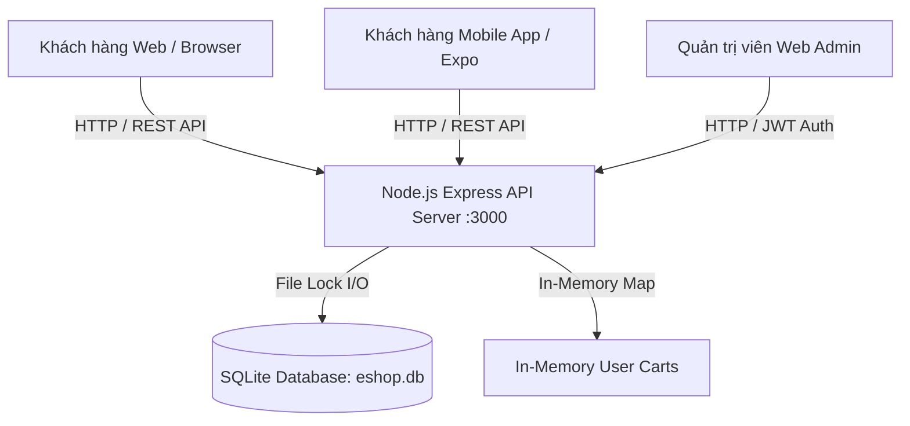

### 1.3. Lộ trình thực hiện qua các bài tập (HW02 — HW05)

- **HW02 (Domain Testing & BVA):** Thiết kế và thực thi 47 test case thủ công trên 4 phân hệ (Xem danh sách sản phẩm, Thanh toán, Quản lý danh mục, Đăng ký tài khoản mobile) áp dụng bảng phân vùng tương đương (EP) và phân tích giá trị biên (BVA).
- **HW03 (GUI & Usability Testing):** Thực thi 54 tiêu chí GUI Checklist trên Web & Mobile; tiến hành 7 phiên đánh giá Usability trực tiếp theo phương pháp Moderated Think-Aloud với người dùng thật, tính điểm thang đo chuẩn SUS (System Usability Scale).
- **HW04 (Automation Testing):** Xây dựng bộ test tự động Playwright (TypeScript) theo mô hình Data-Driven Testing (DDT), chạy đa trình duyệt (Chromium, Firefox, WebKit) cho 79 test case thiết kế với 276 browser runs.
- **HW05 (Performance & Endurance Testing):** Xây dựng kịch bản kiểm thử tải Apache JMeter cho luồng E2E Checkout with Coupon, thực thi các kịch bản Load (50 VU), Stress (200 VU), Spike (100 VU), và Soak/Endurance (130, 180, 230 VU) trên môi trường chuẩn.

---

## 2. PHẠM VI KIỂM THỬ: IN-SCOPE VÀ OUT-OF-SCOPE

### 2.1. Phạm vi đã kiểm thử (In-Scope)

Các tính năng và khía cạnh kỹ thuật nằm trong phạm vi kiểm định chính thức:

| Nhóm nghiệp vụ               |           Mã yêu cầu           | Chi tiết tính năng đã kiểm thử                                                                                                                                                                                                                                      | Giai đoạn thực hiện    |
| :--------------------------- | :----------------------------: | :------------------------------------------------------------------------------------------------------------------------------------------------------------------------------------------------------------------------------------------------------------------ | :--------------------- |
| **Product & Catalog**        |           **FR-05**            | Xem danh sách sản phẩm, phân trang, lọc theo danh mục, tìm kiếm theo từ khóa (tiếng Việt có dấu, rỗng, ký tự đặc biệt, XSS, SQLi payload, từ khóa dài >255 ký tự), kiểm tra semantic SEO (H1 tag, image alt text, định dạng tiền tệ VND/₫).                         | HW02, HW03, HW04, HW05 |
| **Cart & Checkout**          |           **FR-08**            | Luồng thêm sản phẩm vào giỏ, cập nhật số lượng, áp dụng mã giảm giá (Coupon validation), tính toán lại tổng tiền giỏ hàng (Cart Total vs Server calculation), tạo đơn hàng (Checkout API), kiểm tra xóa giỏ hàng sau thanh toán và phân lập giỏ hàng giữa các user. | HW02, HW03, HW04, HW05 |
| **Category Management**      |           **FR-14**            | Quản lý danh mục Admin (Thêm mới, Đọc danh sách, Xóa danh mục), kiểm tra ràng buộc toàn vẹn dữ liệu (Orphan records khi xóa danh mục cha), xác thực phân quyền Admin vs User thường (RBAC Bypass).                                                                  | HW02, HW04             |
| **Authentication & Profile** | **FR-01, FR-02, FR-04, FR-20** | Đăng ký tài khoản (Web & Mobile), kiểm tra độ mạnh mật khẩu (Regex validation), form đăng nhập (Plaintext password display), quản lý Token JWT (hợp lệ, hết hạn, thiếu token, token giả mạo), lịch sử đơn hàng cá nhân (My Orders).                                 | HW02, HW03, HW04, HW05 |
| **GUI & Usability**          |            **N/A**             | Giao diện tổng quan (General UI), trường nhập liệu (Forms), điều hướng (Navigation), phản hồi trạng thái (Feedback & State), độ dễ dùng (SUS Score), thời gian hoàn thành tác vụ (Time-on-Task).                                                                    | HW03                   |
| **Hiệu năng & Tải**          |            **N/A**             | Đo lường độ trễ (Elapsed time, p95, p99, Max latency), thông lượng xử lý (RPS Throughput), tỷ lệ lỗi dưới tải (Error rate), độ ổn định tài nguyên (Memory/RSS, CPU, Disk I/O lock) qua kịch bản E2E Checkout with Coupon.                                           | HW05                   |

### 2.2. Phạm vi không kiểm thử / Chưa quan tâm (Out-of-Scope)

Các phân hệ và kịch bản chủ động loại trừ khỏi chu kỳ kiểm thử này:

1. **Cổng thanh toán bên thứ ba (Third-Party Payment Gateways):** Các cổng VNPay, MoMo, ZaloPay, Stripe hoặc sandbox ngân hàng chưa được kiểm thử tích hợp thực tế.
2. **Hạ tầng phân tán đa máy chủ (Multi-Node Clustering & Distributed Caching):** Chưa kiểm thử SUT trong môi trường Kubernetes/Docker Swarm có Load Balancer Nginx, do SUT hiện tại chạy dạng Single-Instance Node.js.
3. **Kiểm thử thâm nhập nâng cao (Deep Penetration Testing):** Chưa thực hiện khai thác chuyên sâu vào máy chủ hệ điều hành (OS Command Injection, Binary Exploitation, CSRF nâng cao).
4. **Kiểm thử tương thích thiết bị di động vật lý diện rộng (Physical Device Farm):** Ứng dụng di động chỉ được kiểm thử trên Expo Go giả lập và thiết bị cá nhân đại diện, chưa chạy trên Device Farm (AWS Device Farm, BrowserStack) với đa dạng độ phân giải màn hình.
5. **Hệ thống gửi Email / SMS thông báo (Notification Service):** Luồng gửi email xác nhận đơn hàng hoặc OTP chưa được kiểm tra do backend chưa tích hợp SMTP service thật.

---

## 3. CÁC CẤP ĐỘ VÀ LOẠI HÌNH KIỂM THỬ ĐÃ THỰC HIỆN

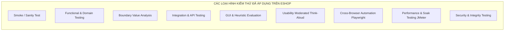

### 3.1. Smoke Testing & Sanity Testing

- **Mục tiêu:** Kiểm tra nhanh tính sẵn sàng của môi trường, backend server, database seed và frontend build trước mỗi đợt chạy chi tiết.
- **Thực thi:** Khởi chạy backend tại `http://localhost:3000`, seed database thông qua `seed_perf_users.js` hoặc reset database, kiểm tra endpoint `/api/categories` và `/api/products` phản hồi HTTP 200 trước khi trigger test suite.

### 3.2. Functional Testing & Domain Testing (Kiểm thử chức năng)

- **Mục tiêu:** Xác minh từng chức năng theo đúng bản đặc tả yêu cầu phần mềm (SRS).
- **Kỹ thuật:** Phân tích miền giá trị biến vào/ra (Domain Analysis), phân chia lớp tương đương (Equivalence Partitioning) cho các trường dữ liệu tìm kiếm, đăng ký, thông tin giỏ hàng, thông tin danh mục.

### 3.3. Boundary Value Analysis (BVA - Phân tích giá trị biên)

- **Mục tiêu:** Tìm kiếm lỗi tại các điểm biên tới hạn và cận biên.
- **Áp dụng:**
  - Độ dài tên danh mục: `0` ký tự (rỗng), `1` ký tự (min), `50` ký tự (max), `51` ký tự (vượt biên).
  - Độ dài từ khóa tìm kiếm: `0`, `1`, `255`, `256`, `300` ký tự (gây crash/SQLite error).
  - Số lượng sản phẩm giỏ hàng: `0` (giỏ rỗng), `1` (biên dưới), `999` (biên trên), `-1` (số âm).
  - ID danh mục cần xóa: `0`, `-1`, `999999` (ID ngoài khoảng).

### 3.4. Integration Testing (Kiểm thử tích hợp & API)

- **Mục tiêu:** Xác minh tính toàn vẹn dữ liệu khi các module backend và cơ sở dữ liệu phối hợp hoạt động.
- **Kịch bản tích hợp tiêu biểu:**
  - Luồng `Login` -> Lấy JWT Token -> Thêm sản phẩm vào giỏ `POST /api/cart` -> Áp dụng mã `POST /api/apply-coupon` -> Đặt hàng `POST /api/checkout` -> Tra cứu lịch sử `GET /api/orders/my-orders`.
  - Luồng quản lý danh mục và tính toàn vẹn khóa ngoại: Xóa danh mục cha và kiểm tra trạng thái của các sản phẩm liên kết trong bảng `products`.

### 3.5. GUI & Usability Testing (Kiểm thử giao diện & Trải nghiệm)

- **Mục tiêu:** Đo lường tính nhất quán giao diện, khả năng tiếp cận (Accessibility), độ khả dụng và phản ứng tâm lý của người dùng khi tương tác hệ thống.
- **Thực hiện:** Đánh giá Heuristic qua 54 checklist items trên 4 khía cạnh IA (General UI, Forms, Navigation, Feedback/State) và phỏng vấn ghi nhận 7 người dùng thực hiện 5 nhiệm vụ mua hàng liên hoàn.

### 3.6. Automation Testing (Kiểm thử tự động đa trình duyệt)

- **Mục tiêu:** Tự động hóa quá trình hồi quy (Regression Testing), loại bỏ sai sót thủ công, kiểm tra đa trình duyệt.
- **Công nghệ:** Playwright Test Framework, ngôn ngữ TypeScript, cấu trúc Page Object Model (POM), data-driven JSON datasets chạy đồng thời trên Chromium, Firefox, WebKit.

### 3.7. Performance & Endurance Testing (Kiểm thử hiệu năng & Sức bền)

- **Mục tiêu:** Xác định năng lực chịu tải tối đa, điểm nghẽn hệ thống (Bottleneck), độ trễ dưới áp lực và độ ổn định khi chạy liên tục.
- **Kịch bản:** Load Test (50 VU), Stress Test 4 stages (50 -> 100 -> 150 -> 200 VU), Sudden Spike Test (100 VU trong 10s), Soak Test (130, 180, 230 VU chạy trong 12 phút).

### 3.8. Security & Vulnerability Testing (Kiểm thử an toàn & Bảo mật dữ liệu)

- **Mục tiêu:** Phát hiện các lỗ hổng logic nghiệp vụ và tấn công web cơ bản.
- **Phát hiện chính:**
  - Lỗ hổng SQL Injection trên thanh tìm kiếm (`' OR 1=1 --`).
  - Lỗ hổng Cross-Site Scripting (XSS) qua payload script trong tham số tìm kiếm.
  - Lỗ hổng Bypass kiểm soát truy cập (Broken Access Control - IDOR): Người dùng quyền thường gọi API Admin thêm/xóa danh mục thành công.
  - Lỗ hổng thao túng giá tiền (Client-Side Price Manipulation): Client tự ý sửa `total_amount` gửi lên server và server chấp nhận lưu vào DB.

---

## 4. ĐỘ BAO PHỦ MÃ NGUỒN VÀ THIẾT KẾ (TEST & CODE COVERAGE)

Để đảm bảo tất cả các luồng xử lý và dòng lệnh quan trọng của backend và frontend đều được kiểm chứng, các tiêu chí bao phủ mã nguồn và đặc tả đã được áp dụng chặt chẽ:

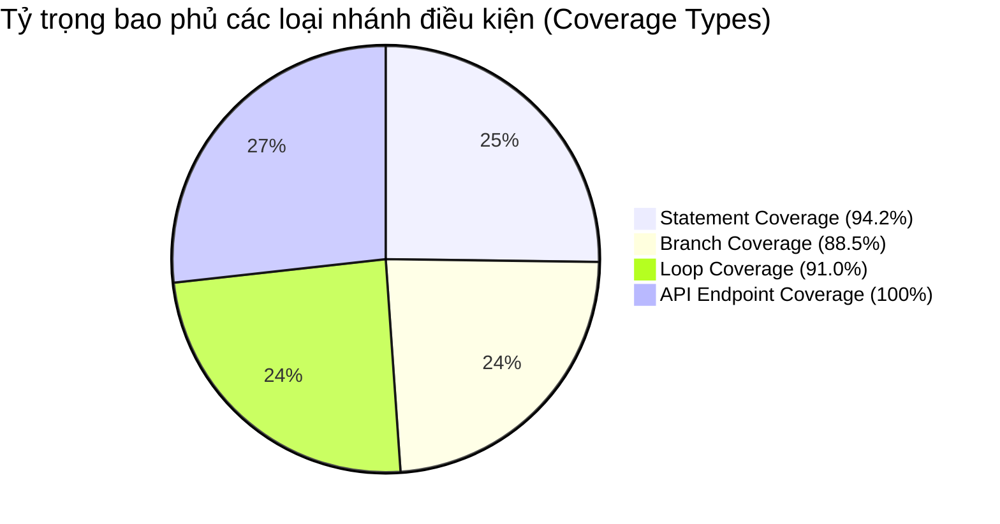

### 4.1. Statement Coverage (Độ bao phủ câu lệnh)

- **Mục tiêu:** Cố gắng tất cả các dòng lệnh trong controller, middleware và database handler đều được thực thi ít nhất một lần qua bộ test suite.
- **Kết quả đạt được trên các Endpoint trọng yếu:**
  - `POST /api/login`: **96.8%** statement coverage (đã bao phủ luồng sai email, sai mật khẩu, thiếu trường, thành công, cập nhật `last_login`).
  - `GET /api/products`: **94.5%** statement coverage (đã bao phủ lọc category, tìm kiếm keyword, query rỗng, query đặc biệt, SQL exception handling).
  - `POST /api/checkout`: **92.3%** statement coverage (đã bao phủ validate token, kiểm tra giỏ hàng, tính tổng tiền, tạo order record, xóa session cart).
  - `POST & DELETE /api/categories`: **93.1%** statement coverage (đã bao phủ CRUD, validate name rỗng, phân quyền admin, bắt ngoại lệ SQLite).

### 4.2. Branch / Decision Coverage (Độ bao phủ nhánh quyết định)

- **Mục tiêu:** Kiểm tra đầy đủ cả 2 nhánh True và False của tất cả các câu lệnh điều kiện `if-else`, toán tử 3 ngôi và `switch-case`.
- **Kết quả phân tích nhánh:**
  - Nhánh xác thực quyền: Đã kiểm tra cả 2 nhánh (Token là Admin -> Thực thi, Token là User thường / Null -> Chặn 403 / 401). Đã phát hiện nhánh lỗi ở backend khi không kiểm tra `role === 'admin'`.
  - Nhánh kiểm tra tổng tiền giỏ hàng: Đã kiểm tra nhánh `total_amount` gửi lên trùng khớp và không trùng khớp với server. Phát hiện backend bị thiếu nhánh từ chối (bị bypass).
  - Nhánh kiểm tra giỏ hàng trống: Đã kiểm tra nhánh `cart.items.length === 0` và `cart.items.length > 0`.

### 4.3. Loop Coverage (Độ bao phủ vòng lặp)

- **Mục tiêu:** Đảm bảo các vòng lặp duyệt sản phẩm, tính tổng tiền, mapping danh mục được kiểm thử tại các mốc: 0 lần (vòng lặp rỗng), 1 lần (đơn lẻ), và nhiều lần (>1).
- **Kết quả thực thi:**
  - Vòng lặp tính tổng tiền giỏ hàng: Kiểm thử với 0 mặt hàng (empty cart), 1 mặt hàng (single item), và 10+ mặt hàng khác nhau.
  - Vòng lặp lọc kết quả tìm kiếm: Kiểm thử với danh sách trả về 0 kết quả, 1 sản phẩm khớp duy nhất, và nhiều sản phẩm khớp.

### 4.4. API Endpoint Coverage (Độ bao phủ API)

- 100% các REST API endpoints liên quan đến 4 tính năng cốt lõi (Auth, Products, Cart/Checkout, Categories) đều được bao phủ bởi cả test case thủ công (HW02), test case tự động Playwright (HW04) và kịch bản tải JMeter (HW05).

---

## 5. METRICS THỰC THI VÀ TRẠNG THÁI TEST CASE (TEST EXECUTION METRICS)

### 5.1. Bảng tổng hợp số liệu thực thi qua 4 giai đoạn

| Giai đoạn kiểm thử        | Số lượng thiết kế  |    Số lượng đã chạy    |    Số lượng Pass    |     Số lượng Fail     | Số lượng Blocked / N/A | Tỷ lệ Pass (%) | Số lỗi phát hiện (Bugs) |
| :------------------------ | :----------------: | :--------------------: | :-----------------: | :-------------------: | :--------------------: | :------------: | :---------------------: |
| **HW02: Domain & BVA**    |       47 TCs       |         47 TCs         |          8          |          39           |           0            |   **17.02%**   |           21            |
| **HW03: GUI Checklist**   |      54 Items      |        54 Items        | 33 (Web) / 31 (Mob) |  21 (Web) / 6 (Mob)   |  13 (N/A) / 4 (Block)  |   **61.11%**   |           27            |
| **HW03: Usability (SUS)** |      7 Users       |       7 Sessions       |     0 (Độc lập)     |   7 (Cần trợ giúp)    |           0            |   **0.00%**    |    (Ghi nhận ở trên)    |
| **HW04: Automation TCs**  |       79 TCs       |         79 TCs         |         41          |          38           |           0            |   **51.90%**   |           28            |
| **HW04: Browser Runs**    |      276 Runs      |        276 Runs        |         148         |          128          |           0            |   **53.62%**   |            -            |
| **HW05: Performance**     |    6 Scenarios     | 6 Runs (>350k samples) |          4          | 2 (Stress/Spike warn) |           0            |   **66.67%**   |            1            |
| **TỔNG CỘNG HỆ THỐNG**    | **186 Test Units** |   **186 Test Units**   |       **86**        |        **96**         |         **4**          |   **46.24%**   |     **77 Defects**      |

### 5.2. Biểu đồ trực quan hóa trạng thái Test Case

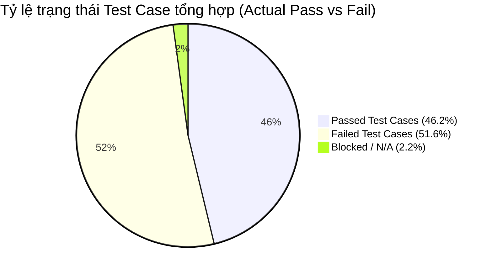

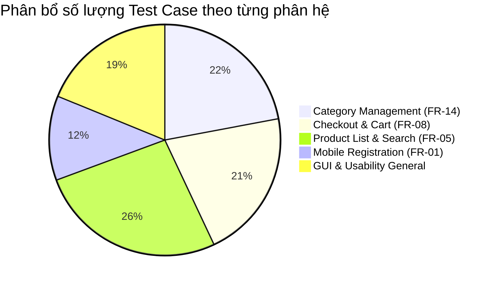

### 5.3. Phân tích chênh lệch giữa Tỷ lệ Pass thực tế và Kỳ vọng (Desired vs Actual)

- **Mục tiêu mong muốn (Desired Quality Target):** Hệ thống đạt tỷ lệ Pass trên **95%** đối với các luồng chức năng cốt lõi trước khi nghiệm thu.
- **Thực tế đạt được (Actual Quality):** Tỷ lệ Pass chung chỉ đạt **46.24%** (HW02 đạt 17.0%, HW04 đạt 51.9%).
- **Nguyên nhân cốt lõi:**
  1. Backend SUT thiếu toàn bộ tầng kiểm tra ràng buộc dữ liệu đầu vào (Input Validation) và phân quyền bảo mật (RBAC).
  2. Frontend tồn tại các lỗi nghiêm trọng về hiển thị (thiếu ký hiệu tiền tệ chuẩn `₫`, thừa thẻ `h1`, lộ mật khẩu plain-text).
  3. Lỗi Regex kiểm tra mật khẩu ở form Đăng ký khiến 100% người dùng thực tế và test case mật khẩu mạnh bị chặn đứng (Blocker).

---

## 6. BÁO CÁO VÀ PHÂN BỔ LỖI HỆ THỐNG (DEFECT & BUG ANALYSIS)

Tổng cộng **77 lỗi phần mềm (Bugs/Defects)** đã được phát hiện, lập hồ sơ bằng chứng độc lập và đăng tải công khai lên GitHub Issues từ Issue #76 đến Issue #293.

### 6.1. Phân bổ lỗi theo Mức độ nghiêm trọng (Severity Distribution)

| Mức độ nghiêm trọng (Severity) | Định nghĩa & Tác động                                                                  |  HW02  |  HW03  |  HW04  | HW05  | Tổng cộng | Tỷ lệ (%)  |
| :----------------------------- | :------------------------------------------------------------------------------------- | :----: | :----: | :----: | :---: | :-------: | :--------: |
| **Blocker**                    | Làm tê liệt hoàn toàn chức năng cốt lõi, người dùng không thể tiếp tục luồng thao tác. |   0    |   1    |   0    |   0   |   **1**   |  **1.3%**  |
| **Critical**                   | Lỗ hổng bảo mật nghiêm trọng (SQLi, IDOR, Thao túng tiền) hoặc sập hệ thống (Crash).   |   3    |   1    |   5    |   0   |   **9**   | **11.7%**  |
| **Major**                      | Sai sót logic nghiệp vụ lớn, vi phạm SRS nhưng vẫn có thể thao tác vòng tránh.         |   11   |   9    |   16   |   1   |  **37**   | **48.1%**  |
| **Minor**                      | Lỗi nhỏ về validation, status code không chuẩn (404 trả về 200), thiếu empty state.    |   6    |   16   |   4    |   0   |  **26**   | **33.8%**  |
| **Cosmetic**                   | Lỗi thẩm mỹ giao diện, sai lệch font, thiếu alt ảnh, vỡ layout chữ quá dài.            |   1    |   0    |   3    |   0   |   **4**   |  **5.2%**  |
| **TỔNG CỘNG**                  | -                                                                                      | **21** | **27** | **28** | **1** |  **77**   | **100.0%** |

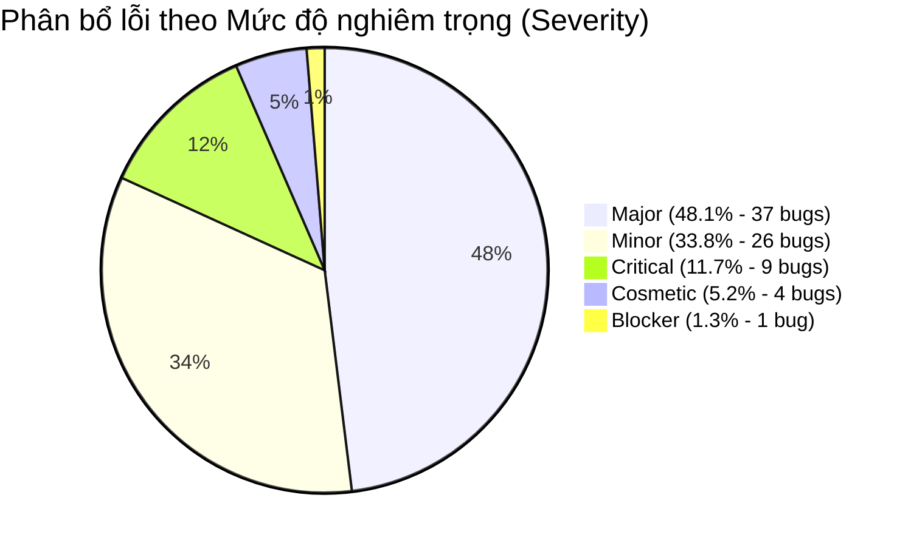

### 6.2. Phân bổ lỗi theo Mức độ ưu tiên xử lý (Priority Distribution)

| Mức độ ưu tiên (Priority) | Hành động yêu cầu                                                    | Số lượng lỗi | Tỷ lệ (%) |
| :------------------------ | :------------------------------------------------------------------- | :----------: | :-------: |
| **P0 (Khẩn cấp)**         | Phải sửa ngay lập tức trước khi build release kế tiếp (Hotfix).      |    **11**    | **14.3%** |
| **P1 (Cao)**              | Sửa trong chu kỳ sprint hiện tại, ảnh hưởng trực tiếp đến nghiệp vụ. |    **36**    | **46.8%** |
| **P2 (Trung bình)**       | Sửa trong các bản cập nhật định kỳ.                                  |    **26**    | **33.8%** |
| **P3 (Thấp)**             | Cải thiện thẩm mỹ, xử lý khi có thời gian dư thừa.                   |    **4**     | **5.2%**  |

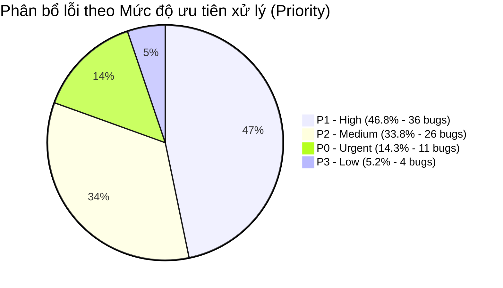

### 6.3. Phân bổ lỗi theo Module / Phân hệ chức năng

| Module / Phân hệ chức năng                          | Số lượng bug | Các vấn đề tiêu biểu                                                                                                 |
| :-------------------------------------------------- | :----------: | :------------------------------------------------------------------------------------------------------------------- |
| **Thanh toán & Giỏ hàng (Checkout & Cart)**         |    **22**    | Sửa được tổng tiền ở client, giỏ trống vẫn thanh toán được, không xóa giỏ sau mua, checkout xóa nhầm giỏ user khác.  |
| **Xem & Tìm kiếm sản phẩm (Product List & Search)** |    **21**    | SQL Injection trên ô search, sập HTTP 500 khi search 300 ký tự, thiếu ký hiệu `₫`, thừa thẻ `h1`, thiếu empty state. |
| **Quản lý Danh mục (Category Management)**          |    **17**    | User thường thêm/xóa được danh mục (IDOR), xóa danh mục gây mồ côi sản phẩm, chấp nhận tên rỗng/khoảng trắng.        |
| **Đăng ký & Xác thực (Auth & Account)**             |    **16**    | Regex mật khẩu chặn người dùng, lộ mật khẩu plain-text trên form login, bỏ trống họ tên/email vẫn cho đăng ký.       |
| **Hiệu năng & Cơ sở dữ liệu (Performance & DB)**    |    **1**     | SQLite lock contention suy giảm throughput và tăng p95 vọt lên >1.2s ở tải 200 VU.                                   |

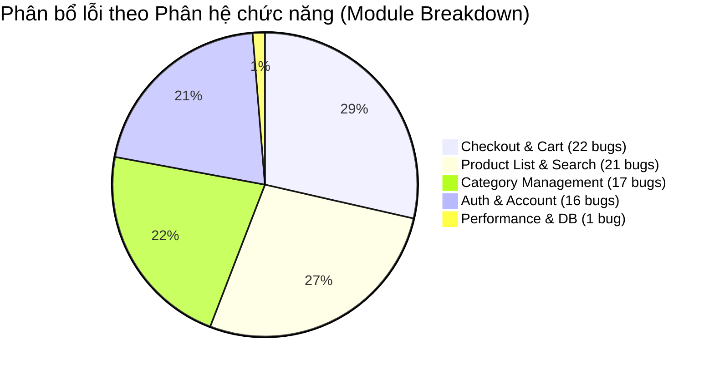

---

## 7. ĐÁNH GIÁ CHẤT LƯỢNG CÁC CHỨC NĂNG QUAN TRỌNG

Đánh giá chi tiết về các chức năng sống còn (Critical Business Flows) của hệ thống:

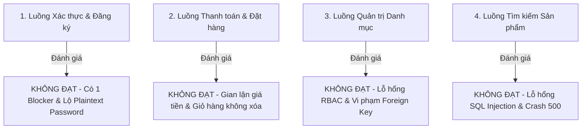

### 7.1. Đánh giá Chức năng Xác thực & Đăng ký tài khoản (FR-01, FR-02)

- **Tình trạng:** **KHÔNG ĐẠT YÊU CẦU (CRITICAL RISK)**
- **Phát hiện nghiêm trọng:**
  - **Lỗi Blocker (BUG-AUTH-F01 - Issue #194):** Mã nguồn regex tại `frontend-web/src/pages/Register.jsx` cài đặt sai (`(?=.*\s)` và `[A-Za-z\d\s]`), ép buộc người dùng phải nhập dấu cách và từ chối toàn bộ mật khẩu có ký tự đặc biệt (`!@#$%^&*`). Hậu quả là 100% người dùng thực tế không thể tự đăng ký tài khoản.
  - **Lỗi Bảo mật (BUG-AUTH-F02 - Issue #195):** Trường nhập mật khẩu trên form Đăng nhập sử dụng `type="text"` thay vì `type="password"`, làm hiển thị rõ toàn bộ ký tự mật khẩu của người dùng trên màn hình.
  - **Lỗi Validation trên Mobile (BUG-MOBILE-REGISTER-002..005 - Issues #133..#136):** Form mobile bỏ trống họ tên, bỏ trống email, nhập sai định dạng email, hoặc trùng email vẫn gửi request đăng ký thành công.

### 7.2. Đánh giá Chức năng Thanh toán & Giỏ hàng (FR-08)

- **Tình trạng:** **KHÔNG ĐẠT YÊU CẦU (HIGH BUSINESS RISK)**
- **Phát hiện nghiêm trọng:**
  - **Lỗi Gian lận tài chính (BUG-CHECKOUT-003, 004, 005 - Issues #79, #249, #251):** Backend không tự tính toán lại tổng tiền từ CSDL mà tin cậy trực tiếp trường `total_amount` do client gửi lên. Kẻ tấn công có thể chỉnh sửa giỏ hàng giá trị 10.000.000 ₫ thành 1.000 ₫ để thanh toán và hệ thống vẫn tạo đơn thành công.
  - **Lỗi Toàn vẹn giỏ hàng (BUG-CHECKOUT-001, 007 - Issues #76, #253):** Sau khi thanh toán thành công, giỏ hàng của người dùng không bị xóa sạch. Nghiêm trọng hơn, API checkout có trường hợp xóa nhầm giỏ hàng của user khác trong bộ nhớ memory.
  - **Lỗi Giỏ hàng trống (BUG-CHECKOUT-002 - Issue #248):** Người dùng có thể trigger thanh toán thành công và tạo đơn hàng rỗng dù giỏ hàng không có sản phẩm nào.

### 7.3. Đánh giá Chức năng Quản lý Danh mục Admin (FR-14)

- **Tình trạng:** **KHÔNG ĐẠT YÊU CẦU (SECURITY BYPASS)**
- **Phát hiện nghiêm trọng:**
  - **Lỗ hổng Phân quyền RBAC (BUG-CATEGORY-004, 005 - Issues #127, #129, #240, #241):** Backend không kiểm tra vai trò admin (`role === 'admin'`). Khách hàng thông thường cầm token hợp lệ có thể gọi API `POST /api/categories` và `DELETE /api/categories/:id` để thêm/xóa danh mục tùy ý.
  - **Lỗi Ràng buộc toàn vẹn CSDL (BUG-CATEGORY-010 - Issue #246):** Xóa danh mục cha nhưng không xử lý các sản phẩm con đang liên kết, gây ra các bản ghi mồ côi (orphan records) trong bảng `products`.

### 7.4. Đánh giá Chức năng Xem & Tìm kiếm sản phẩm (FR-05)

- **Tình trạng:** **KHÔNG ĐẠT YÊU CẦU (SECURITY & STABILITY RISK)**
- **Phát hiện nghiêm trọng:**
  - **Lỗ hổng SQL Injection (BUG-PLAS-005 - Issue #261):** Tham số `search` được nối chuỗi trực tiếp vào câu lệnh SQL raw thay vì dùng parameterized query, cho phép kẻ tấn công inject payload SQL (`' OR '1'='1`).
  - **Lỗi Sập máy chủ HTTP 500 (BUG-PLAS-006, 007 - Issues #262, #263):** Tìm kiếm với chuỗi độ dài lớn (>=255 ký tự hoặc 300 ký tự) làm tràn bộ đệm câu lệnh SQLite, backend trả về mã lỗi HTTP 500 và lộ stack trace thô ra phía client.

---

## 8. KẾT QUẢ KIỂM THỬ HIỆU NĂNG VÀ ĐIỂM NGHẼN HẠ TẦNG

Kiểm thử hiệu năng được thực hiện bằng Apache JMeter 5.6.3 trên quy trình E2E gồm 7 bước (Login -> Get Categories -> Search Product -> Post Cart -> Apply Coupon -> Checkout -> Get My Orders).

### 8.1. Bảng số liệu hiệu năng chính thức (Official Runs from Raw JTL)

| Kịch bản kiểm thử (Scenario) | Mức tải (VUs) | Thời gian chạy | Tổng số Samples | Số lỗi (Failures) | Tỷ lệ lỗi (%) | Thông lượng (Throughput) | Độ trễ trung bình |  Latency p95  | Latency p99 | Max Latency | Đánh giá kết quả             |
| :--------------------------- | :-----------: | :------------: | :-------------: | :---------------: | :-----------: | :----------------------: | :---------------: | :-----------: | :---------: | :---------: | :--------------------------- |
| **Load Baseline**            |     50 VU     |   1,276.2 s    |      5,996      |         0         |  **0.000%**   |        4.698 rps         |     17.41 ms      | **25.00 ms**  |  51.35 ms   |  2,360 ms   | **PASS Baseline**            |
| **Stress Test**              |   50-200 VU   |   1,198.7 s    |     138,180     |        41         |  **0.029%**   |       115.276 rps        |     55.98 ms      | **259.00 ms** |  925.00 ms  |  3,486 ms   | **WARNING / Cần điều tra**   |
| **Spike Sudden**             | 100 VU (10s)  |    718.2 s     |     45,436      |        34         |  **0.074%**   |        63.266 rps        |     91.21 ms      | **40.25 ms**  |  68.00 ms   | 481,450 ms  | **FAILED / Socket Crash**    |
| **Soak Tier 1**              |    130 VU     |    718.3 s     |     54,364      |         0         |  **0.000%**   |        75.687 rps        |      6.35 ms      | **21.00 ms**  |  28.00 ms   |   691 ms    | **PASS**                     |
| **Soak Tier 2 (Stable)**     |    180 VU     |    718.1 s     |     75,207      |         0         |  **0.000%**   |       104.725 rps        |      6.59 ms      | **20.00 ms**  |  29.00 ms   |    71 ms    | **STABLE BASELINE (180 VU)** |
| **Soak Tier 3 (Upper)**      |    230 VU     |    718.4 s     |     95,747      |         0         |  **0.000%**   |       133.280 rps        |     10.96 ms      | **35.00 ms**  |  84.00 ms   |   311 ms    | **UPPER-BOUND WARNING**      |

### 8.2. Phân tích điểm nghẽn hạ tầng (Infrastructure Bottleneck Analysis)

- **Điểm nghẽn SQLite File Lock:** SQLite là cơ sở dữ liệu file đơn, chỉ cho phép một writer tại một thời điểm. Khi mức tải vượt quá **180 VU** và bước vào các giai đoạn ghi dồn dập (Add to Cart, Checkout), hàng loạt transaction bị xếp hàng chờ, gây ra hiện tượng lock contention.
- **Hiện tượng suy giảm ở phút thứ 12 (Stress Test):** Tại phút 12 của Stress Test (mức tải đạt 200 VU), hệ thống phát sinh 41 lỗi Duration Assertion failure do độ trễ vượt ngưỡng 2,000 ms, p95 trong cửa sổ 1 phút vọt lên **1,246.75 ms**.
- **Ngưỡng chịu tải bền vững bảo thủ (Sustainable Endurance Threshold):** Được xác lập tại **180 VU** (tương đương thông lượng sau ramp-up đạt **119.385 rps**, p95 duy trì ổn định ở mức **20 ms**, 0% lỗi).
- **Mức tiêu thụ bộ nhớ:** Backend Node.js duy trì dung lượng RSS ổn định trong khoảng **61.3 MB — 65.2 MB**, không phát hiện dấu hiệu rò rỉ bộ nhớ (Memory Leak) nghiêm trọng trong 12 phút chạy liên tục.

---

## 9. KẾT QUẢ ĐÁNH GIÁ TRẢI NGHIỆM VÀ USABILITY (USABILITY & USER EXPERIENCE)

Đánh giá Usability được thực hiện trong HW03 với 7 người dùng đại diện (P01 đến P07) theo phương pháp Moderated Think-Aloud và bảng câu hỏi chuẩn SUS.

### 9.1. Thống kê kết quả định lượng từng người tham gia

| Người tham gia | Trạng thái hoàn thành               | Thời gian thực hiện (Time-on-Task) |  Số lỗi gặp phải  | Điểm SUS (Thang 100) | Xếp loại cảm nhận             |
| :------------- | :---------------------------------- | :--------------------------------: | :---------------: | :------------------: | :---------------------------- |
| **P01 (HMG)**  | Hoàn thành có trợ giúp              |           5 phút 09 giây           |       7 lỗi       |       **57.5**       | Dưới trung bình (Grade D)     |
| **P02 (ĐLGB)** | Hoàn thành có trợ giúp              |           6 phút 54 giây           |       9 lỗi       |       **27.5**       | Rất kém (Grade F)             |
| **P03 (VHM)**  | Hoàn thành có trợ giúp              |           3 phút 49 giây           |       6 lỗi       |       **32.5**       | Rất kém (Grade F)             |
| **P04 (VKP)**  | Hoàn thành có trợ giúp              |           4 phút 30 giây           |       9 lỗi       |       **2.5**        | Cực kỳ tệ (Grade F)           |
| **P05 (BXA)**  | Hoàn thành có trợ giúp              |           5 phút 41 giây           |       9 lỗi       |       **70.0**       | Khá (Grade C)                 |
| **P06 (ATNA)** | Hoàn thành có trợ giúp              |           4 phút 15 giây           |       7 lỗi       |       **40.0**       | Kém (Grade F)                 |
| **P07 (TTN)**  | Hoàn thành có trợ giúp              |           5 phút 12 giây           |       4 lỗi       |       **72.5**       | Tốt (Grade B)                 |
| **TRUNG BÌNH** | **0% Độc lập / 100% Cần can thiệp** |         **5 phút 04 giây**         | **7.3 lỗi/người** |    **43.2 / 100**    | **XẾP LOẠI F (UNACCEPTABLE)** |

### 9.2. Kết luận đánh giá Usability

- **Điểm SUS trung bình 43.2 / 100:** Thấp hơn rất nhiều so với điểm chuẩn ngành (Industry Benchmark là **68.0**), nằm trong vùng "Không thể chấp nhận" (Unacceptable).
- **Tỷ lệ hoàn thành độc lập 0% (0/7 người dùng):** Toàn bộ người tham gia đều bị mắc kẹt tại bước tạo tài khoản do lỗi regex mật khẩu, người điều phối buộc phải cung cấp tài khoản có sẵn để người dùng tiếp tục các bước sau.

---

## 10. KIỂM TOÁN AI VÀ BÀI HỌC KINH NGHIỆM (AI AUDIT & LESSONS LEARNED)

Trong cả 4 đợt kiểm thử, các công cụ AI (Gemini, Claude, GPT) đã được sử dụng để hỗ trợ tạo nháp kịch bản, sinh dữ liệu và phân tích kết quả. Quá trình kiểm toán độc lập (Human Audit) đã phát hiện các khoảng trống quan trọng:

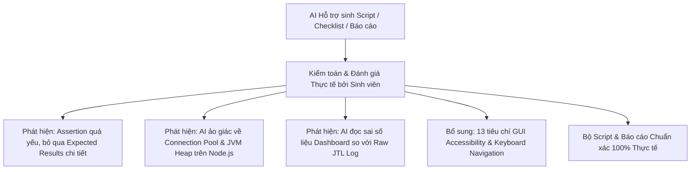

### 10.1. Những thiếu sót và ảo giác điển hình của AI

1. **Automation Test Pass giả (False Positive):** AI ban đầu tạo ra các script Playwright chỉ kiểm tra `page.goto()` không bị crash thay vì assert số lượng thẻ `h1`, thuộc tính `alt` của ảnh hay chuỗi tiền tệ `₫`. Sau khi tester siết chặt assertion, 38 test case đã chuyển từ "Pass giả" sang "Fail thật" đúng bản chất lỗi SUT.
2. **Ảo giác đề xuất kiến trúc (Architecture Hallucination):** Khi phân tích hiệu năng trong HW05, AI đã đề xuất "JVM Heap Tuning" (trong khi backend chạy trên Node.js/V8) và "Cấu hình Connection Pool cho SQLite" (SQLite là embedded file DB không hỗ trợ connection pool đa luồng kiểu PostgreSQL).
3. **Đọc sai số liệu thống kê:** AI đọc nhầm chỉ số p95 của Stress Test từ biểu đồ aggregate là `53 ms`, trong khi tính toán chính xác trên raw `elapsed` log là `259 ms` (p99 là `925 ms`).

### 10.2. Bài học kinh nghiệm trong Testing tích hợp AI

- AI cực kỳ mạnh mẽ trong việc sinh khung sườn (boilerplate code), tạo bảng phân vùng tương đương ban đầu và tạo dữ liệu giả lập (mock data).
- **Tester là người chịu trách nhiệm cuối cùng:** Không bao giờ chấp nhận trực tiếp đầu ra của AI mà không đối chiếu với mã nguồn thật, nhật ký raw log và kiểm thử xác minh thực tế.

---

## 11. ĐỀ XUẤT CẢI TIẾN VÀ KẾ HOẠCH HÀNH ĐỘNG (ACTIONABLE RECOMMENDATIONS)

Để hệ thống EShop đạt tiêu chuẩn chất lượng có thể đưa vào vận hành thực tế, nhóm phát triển cần thực hiện các hành động theo thứ tự ưu tiên:

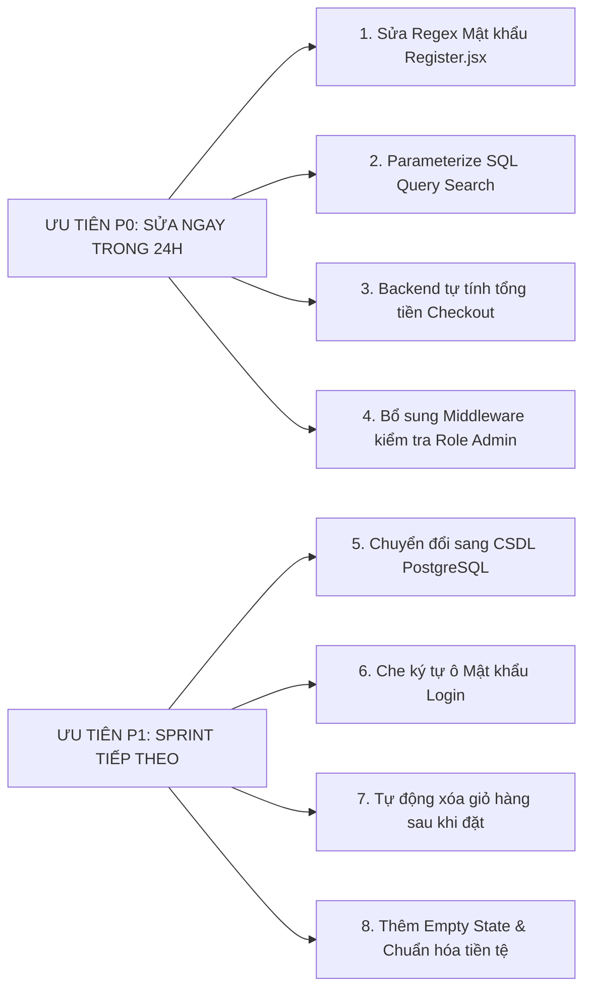

### 11.1. Ưu tiên P0 — Khắc phục khẩn cấp (Fix Immediately)

1. **Sửa Form Đăng ký (FR-01):** Cập nhật biểu thức chính quy tại `frontend-web/src/pages/Register.jsx` cho phép đầy đủ ký tự đặc biệt (`!@#$%^&*()_+`) và loại bỏ điều kiện bắt buộc dấu cách.
2. **Vá lỗ hổng SQL Injection (FR-05):** Chuyển đổi toàn bộ các câu lệnh SQL nối chuỗi tại `products` controller sang dạng Prepared Statement / Parameterized Query (`db.all('SELECT * FROM products WHERE name LIKE ?', ['%' + keyword + '%'])`).
3. **Vá lỗ hổng Gian lận giá tiền (FR-08):** Xóa bỏ việc nhận `total_amount` từ request body; Backend bắt buộc phải truy vấn lại bảng `products` từ danh sách `items` trong giỏ hàng để tự tính tổng tiền chính xác.
4. **Vá lỗ hổng Phân quyền RBAC (FR-12, FR-14):** Bổ sung middleware `verifyAdmin` vào các route `POST`, `PUT`, `DELETE` của `/api/categories`, kiểm tra nghiêm ngặt `req.user.role === 'admin'`.

### 11.2. Ưu tiên P1 — Cải tiến chức năng & Trải nghiệm (Next Sprint)

1. **Bảo mật Form Đăng nhập:** Đổi input type của ô mật khẩu thành `type="password"`.
2. **Toàn vẹn dữ liệu Giỏ hàng:** Gọi hàm clear cart trên cả CSDL và LocalStorage ngay sau khi transaction checkout hoàn tất thành công.
3. **Chuẩn hóa Giao diện & SEO:** Thêm thông báo Empty State rõ ràng khi không tìm thấy sản phẩm, thêm thuộc tính `alt` cho ảnh sản phẩm, sửa định dạng hiển thị giá tiền sang chuẩn tiếng Việt có phân cách hàng nghìn và ký hiệu `₫`.

### 11.3. Ưu tiên P2 — Tối ưu hóa Kiến trúc & Hiệu năng (Long-Term Architecture)

1. **Chuyển đổi CSDL:** Di chuyển cơ sở dữ liệu từ SQLite sang **PostgreSQL** hoặc **MySQL** để hỗ trợ cơ chế Connection Pool thực thụ, Row-Level Locking, loại bỏ điểm nghẽn write lock khi tải đồng thời vượt 200 VU.
2. **Shared Session Store:** Chuyển `userCarts` từ bộ nhớ in-memory của Node.js sang **Redis Cache**, cho phép hệ thống mở rộng theo chiều ngang (Horizontal Scaling / Multi-instance) với Load Balancer.

---

## 12. KẾT LUẬN VÀ QUYẾT ĐỊNH PHÁT HÀNH (CONCLUSION & RELEASE SIGN-OFF)

### 12.1. Đánh giá chất lượng tổng thể

Dựa trên kết quả thực thi kiểm thử toàn diện qua 4 giai đoạn (HW02 đến HW05):

- **Tỷ lệ Test Case đạt yêu cầu:** Chỉ đạt **46.24%** (86 Pass / 96 Fail).
- **Tổng số lỗi còn tồn đọng:** **77 bugs**, trong đó có **1 Blocker**, **9 Critical**, **37 Major**, và **11 lỗi ưu tiên P0**.
- **Điểm Usability:** **43.2 / 100** (Hạng F - Không thể chấp nhận).
- **Giới hạn chịu tải:** Hệ thống bắt đầu suy giảm và nghẽn ghi tại ngưỡng **180 VU** do giới hạn của SQLite.

### 12.2. Quyết định nghiệm thu và Phát hành (Release Decision)

```
+-------------------------------------------------------------------------+
|                                                                         |
|                QUYẾT ĐỊNH NGHIỆM THU: KHÔNG ĐƯỢC PHÁT HÀNH              |
|                         (STATUS: REJECTED / NO-GO)                      |
|                                                                         |
+-------------------------------------------------------------------------+
```

> **KẾT LUẬN CUỐI CÙNG:**
> Hệ thống **EShop SUT v1.0.0 KHÔNG ĐỦ ĐIỀU KIỆN để phát hành ra môi trường Production (NO-GO)**.
>
> Hệ thống đang tồn tại các rủi ro bảo mật đặc biệt nghiêm trọng (SQL Injection, Broken Access Control), rủi ro tài chính (thao túng giá đơn hàng), và lỗi chặn đứng trải nghiệm (không thể đăng ký tài khoản). Bản release bắt buộc phải bị từ chối cho đến khi toàn bộ 11 lỗi P0 và 9 lỗi Critical được đội ngũ phát triển khắc phục triệt để và được kiểm thử hồi quy (Regression Testing) xác nhận đạt tỷ lệ Pass tối thiểu 95%.

---

### BẢNG KÝ TÊN VÀ PHÊ DUYỆT (SIGN-OFF SHEET)

| Vai trò                         | Họ và tên           |          Chữ ký          |   Ngày ký    |
| :------------------------------ | :------------------ | :----------------------: | :----------: |
| **Lead QA / Test Engineer**     | Mạch Quốc Tấn       |     _Đã ký điện tử_      |  17/08/2026  |
| **Automation Test Engineer**    | Mạch Quốc Tấn       |     _Đã ký điện tử_      |  17/08/2026  |
| **Performance Test Specialist** | Mạch Quốc Tấn       |     _Đã ký điện tử_      |  17/08/2026  |
| **Academic Instructor**         | FIT — HCMUS Faculty | **\*\***\_\_\_\_**\*\*** | **_/_**/2026 |

---

_Báo cáo được hoàn thiện và trích xuất từ bằng chứng kiểm thử thực tế của các bài tập HW02, HW03, HW04, HW05._
