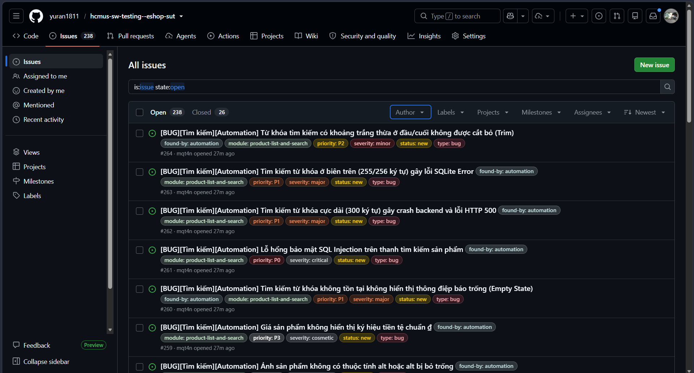
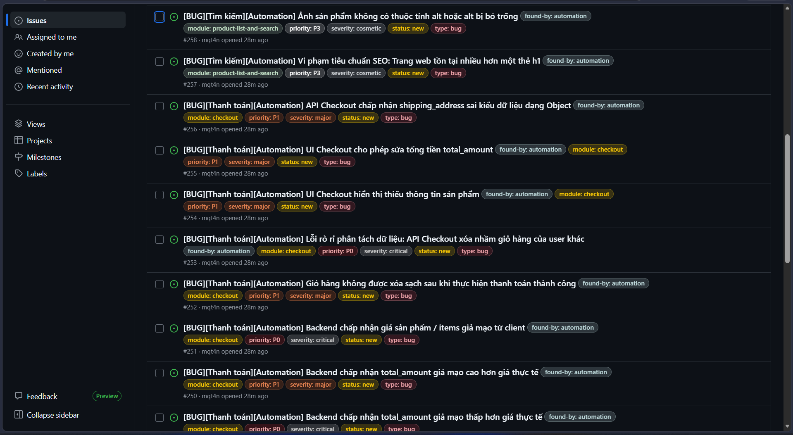
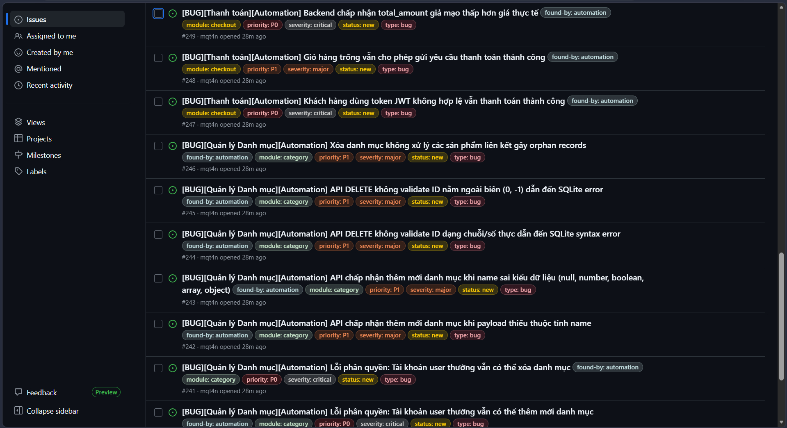
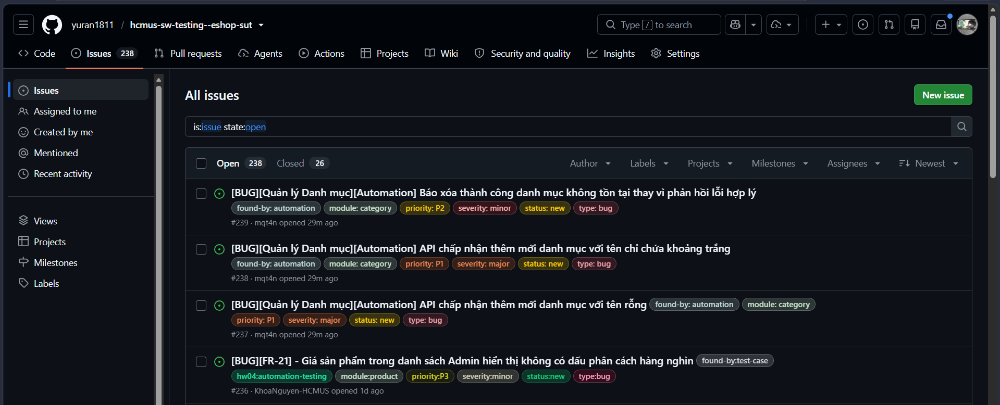

# Bug Report - Automation Testing

Tài liệu này tổng hợp các lỗi được phát hiện bằng bộ kiểm thử tự động Playwright trong HW04. Mỗi lỗi đã có file Markdown chi tiết trong `tests/bug-reports/automation` và GitHub Issue tương ứng.

## Tổng quan

| Module                                          | Số bug | GitHub Issue                                                                                                                                              |
| ----------------------------------------------- | -----: | --------------------------------------------------------------------------------------------------------------------------------------------------------- |
| Quản lý Danh mục (Category)                     |     10 | [#237](https://github.com/yuran1811/hcmus-sw-testing--eshop-sut/issues/237) - [#246](https://github.com/yuran1811/hcmus-sw-testing--eshop-sut/issues/246) |
| Thanh toán (Checkout)                           |     10 | [#247](https://github.com/yuran1811/hcmus-sw-testing--eshop-sut/issues/247) - [#256](https://github.com/yuran1811/hcmus-sw-testing--eshop-sut/issues/256) |
| Xem & Tìm kiếm sản phẩm (Product List & Search) |      8 | [#257](https://github.com/yuran1811/hcmus-sw-testing--eshop-sut/issues/257) - [#264](https://github.com/yuran1811/hcmus-sw-testing--eshop-sut/issues/264) |
| **Tổng cộng**                                   | **28** | **#237 - #264**                                                                                                                                           |

## Danh sách bug report automation

| ID                                                                                         | Tiêu đề                                                                     | Module                | Requirement  | Severity | Priority | Test case liên quan                                                                     | GitHub Issue                                                                |
| ------------------------------------------------------------------------------------------ | --------------------------------------------------------------------------- | --------------------- | ------------ | -------- | -------- | --------------------------------------------------------------------------------------- | --------------------------------------------------------------------------- |
| [BUG-CATEGORY-001](../../tests/bug-reports/automation/category/BUG-CATEGORY-001.md)        | API chấp nhận thêm mới danh mục với tên rỗng                                | Category              | FR-14        | Major    | P1       | TC-CATEGORY-002                                                                         | [#237](https://github.com/yuran1811/hcmus-sw-testing--eshop-sut/issues/237) |
| [BUG-CATEGORY-002](../../tests/bug-reports/automation/category/BUG-CATEGORY-002.md)        | API chấp nhận thêm mới danh mục với tên chỉ chứa khoảng trắng               | Category              | FR-14        | Major    | P1       | TC-CATEGORY-003                                                                         | [#238](https://github.com/yuran1811/hcmus-sw-testing--eshop-sut/issues/238) |
| [BUG-CATEGORY-003](../../tests/bug-reports/automation/category/BUG-CATEGORY-003.md)        | Báo xóa thành công danh mục không tồn tại thay vì phản hồi lỗi hợp lý       | Category              | FR-14        | Minor    | P2       | TC-CATEGORY-006                                                                         | [#239](https://github.com/yuran1811/hcmus-sw-testing--eshop-sut/issues/239) |
| [BUG-CATEGORY-004](../../tests/bug-reports/automation/category/BUG-CATEGORY-004.md)        | Tài khoản user thường vẫn có thể thêm mới danh mục                          | Category              | FR-14        | Critical | P0       | TC-CATEGORY-008                                                                         | [#240](https://github.com/yuran1811/hcmus-sw-testing--eshop-sut/issues/240) |
| [BUG-CATEGORY-005](../../tests/bug-reports/automation/category/BUG-CATEGORY-005.md)        | Tài khoản user thường vẫn có thể xóa danh mục                               | Category              | FR-14        | Critical | P0       | TC-CATEGORY-011                                                                         | [#241](https://github.com/yuran1811/hcmus-sw-testing--eshop-sut/issues/241) |
| [BUG-CATEGORY-006](../../tests/bug-reports/automation/category/BUG-CATEGORY-006.md)        | API chấp nhận thêm mới danh mục khi payload thiếu thuộc tính `name`         | Category              | FR-14        | Major    | P1       | TC-CATEGORY-012                                                                         | [#242](https://github.com/yuran1811/hcmus-sw-testing--eshop-sut/issues/242) |
| [BUG-CATEGORY-007](../../tests/bug-reports/automation/category/BUG-CATEGORY-007.md)        | API chấp nhận thêm mới danh mục khi `name` sai kiểu dữ liệu                 | Category              | FR-14        | Major    | P1       | TC-CATEGORY-013                                                                         | [#243](https://github.com/yuran1811/hcmus-sw-testing--eshop-sut/issues/243) |
| [BUG-CATEGORY-008](../../tests/bug-reports/automation/category/BUG-CATEGORY-008.md)        | API DELETE không validate ID dạng chuỗi/số thực dẫn đến SQLite syntax error | Category              | FR-14        | Major    | P1       | TC-CATEGORY-019                                                                         | [#244](https://github.com/yuran1811/hcmus-sw-testing--eshop-sut/issues/244) |
| [BUG-CATEGORY-009](../../tests/bug-reports/automation/category/BUG-CATEGORY-009.md)        | API DELETE không validate ID ngoài biên `(0, -1)` dẫn đến SQLite error      | Category              | FR-14        | Major    | P1       | TC-CATEGORY-BVA-003                                                                     | [#245](https://github.com/yuran1811/hcmus-sw-testing--eshop-sut/issues/245) |
| [BUG-CATEGORY-010](../../tests/bug-reports/automation/category/BUG-CATEGORY-010.md)        | Xóa danh mục không xử lý các sản phẩm liên kết gây orphan records           | Category              | FR-14, FR-15 | Major    | P1       | TC-CATEGORY-009                                                                         | [#246](https://github.com/yuran1811/hcmus-sw-testing--eshop-sut/issues/246) |
| [BUG-CHECKOUT-001](../../tests/bug-reports/automation/checkout/BUG-CHECKOUT-001.md)        | Khách hàng dùng token JWT không hợp lệ vẫn thanh toán thành công            | Checkout              | FR-08        | Critical | P0       | TC-CHECKOUT-002                                                                         | [#247](https://github.com/yuran1811/hcmus-sw-testing--eshop-sut/issues/247) |
| [BUG-CHECKOUT-002](../../tests/bug-reports/automation/checkout/BUG-CHECKOUT-002.md)        | Giỏ hàng trống vẫn cho phép gửi yêu cầu thanh toán thành công               | Checkout              | FR-08        | Major    | P1       | TC-CHECKOUT-003                                                                         | [#248](https://github.com/yuran1811/hcmus-sw-testing--eshop-sut/issues/248) |
| [BUG-CHECKOUT-003](../../tests/bug-reports/automation/checkout/BUG-CHECKOUT-003.md)        | Backend chấp nhận `total_amount` giả mạo thấp hơn giá thực tế               | Checkout              | FR-08        | Critical | P0       | TC-CHECKOUT-004, TC-CHECKOUT-BVA-002                                                    | [#249](https://github.com/yuran1811/hcmus-sw-testing--eshop-sut/issues/249) |
| [BUG-CHECKOUT-004](../../tests/bug-reports/automation/checkout/BUG-CHECKOUT-004.md)        | Backend không đảm bảo `total_amount` được tính từ dữ liệu server            | Checkout              | FR-08        | Major    | P1       | TC-CHECKOUT-013, TC-CHECKOUT-BVA-003                                                    | [#250](https://github.com/yuran1811/hcmus-sw-testing--eshop-sut/issues/250) |
| [BUG-CHECKOUT-005](../../tests/bug-reports/automation/checkout/BUG-CHECKOUT-005.md)        | Backend chấp nhận giá sản phẩm/items giả mạo từ client                      | Checkout              | FR-08        | Critical | P0       | TC-CHECKOUT-014                                                                         | [#251](https://github.com/yuran1811/hcmus-sw-testing--eshop-sut/issues/251) |
| [BUG-CHECKOUT-006](../../tests/bug-reports/automation/checkout/BUG-CHECKOUT-006.md)        | Giỏ hàng không được xóa sạch sau khi thanh toán thành công                  | Checkout              | FR-08        | Major    | P1       | TC-CHECKOUT-001, TC-CHECKOUT-005, TC-CHECKOUT-BVA-001                                  | [#252](https://github.com/yuran1811/hcmus-sw-testing--eshop-sut/issues/252) |
| [BUG-CHECKOUT-007](../../tests/bug-reports/automation/checkout/BUG-CHECKOUT-007.md)        | API Checkout xóa nhầm giỏ hàng của user khác                                | Checkout              | FR-08        | Critical | P0       | TC-CHECKOUT-015                                                                         | [#253](https://github.com/yuran1811/hcmus-sw-testing--eshop-sut/issues/253) |
| [BUG-CHECKOUT-008](../../tests/bug-reports/automation/checkout/BUG-CHECKOUT-008.md)        | UI Checkout hiển thị thiếu thông tin sản phẩm                               | Checkout              | FR-08        | Major    | P1       | TC-CHECKOUT-011                                                                         | [#254](https://github.com/yuran1811/hcmus-sw-testing--eshop-sut/issues/254) |
| [BUG-CHECKOUT-009](../../tests/bug-reports/automation/checkout/BUG-CHECKOUT-009.md)        | UI Checkout cho phép sửa tổng tiền `total_amount`                           | Checkout              | FR-08        | Major    | P1       | TC-CHECKOUT-012                                                                         | [#255](https://github.com/yuran1811/hcmus-sw-testing--eshop-sut/issues/255) |
| [BUG-CHECKOUT-010](../../tests/bug-reports/automation/checkout/BUG-CHECKOUT-010.md)        | API Checkout chấp nhận `shipping_address` sai kiểu dữ liệu dạng object      | Checkout              | FR-08        | Major    | P1       | TC-CHECKOUT-010                                                                         | [#256](https://github.com/yuran1811/hcmus-sw-testing--eshop-sut/issues/256) |
| [BUG-PLAS-001](../../tests/bug-reports/automation/product-list-and-search/BUG-PLAS-001.md) | Trang web tồn tại nhiều hơn một thẻ `h1`                                    | Product List & Search | FR-05        | Cosmetic | P3       | TC-PLAS-001, TC-PLAS-002, TC-PLAS-004, TC-PLAS-005, TC-PLAS-BVA-001, TC-PLAS-BVA-005    | [#257](https://github.com/yuran1811/hcmus-sw-testing--eshop-sut/issues/257) |
| [BUG-PLAS-002](../../tests/bug-reports/automation/product-list-and-search/BUG-PLAS-002.md) | Ảnh sản phẩm không có thuộc tính `alt` hoặc `alt` bị bỏ trống               | Product List & Search | FR-05        | Cosmetic | P3       | TC-PLAS-007                                                                             | [#258](https://github.com/yuran1811/hcmus-sw-testing--eshop-sut/issues/258) |
| [BUG-PLAS-003](../../tests/bug-reports/automation/product-list-and-search/BUG-PLAS-003.md) | Giá sản phẩm không hiển thị ký hiệu tiền tệ chuẩn `₫`                       | Product List & Search | FR-05        | Cosmetic | P3       | TC-PLAS-007                                                                             | [#259](https://github.com/yuran1811/hcmus-sw-testing--eshop-sut/issues/259) |
| [BUG-PLAS-004](../../tests/bug-reports/automation/product-list-and-search/BUG-PLAS-004.md) | Tìm kiếm từ khóa không tồn tại không hiển thị empty state                   | Product List & Search | FR-05        | Major    | P1       | TC-PLAS-003                                                                             | [#260](https://github.com/yuran1811/hcmus-sw-testing--eshop-sut/issues/260) |
| [BUG-PLAS-005](../../tests/bug-reports/automation/product-list-and-search/BUG-PLAS-005.md) | Lỗ hổng SQL Injection trên thanh tìm kiếm sản phẩm                          | Product List & Search | FR-05        | Critical | P0       | TC-PLAS-BVA-004                                                                          | [#261](https://github.com/yuran1811/hcmus-sw-testing--eshop-sut/issues/261) |
| [BUG-PLAS-006](../../tests/bug-reports/automation/product-list-and-search/BUG-PLAS-006.md) | Tìm kiếm từ khóa 300 ký tự gây crash backend và lỗi HTTP 500                | Product List & Search | FR-05        | Major    | P1       | TC-PLAS-006                                                                             | [#262](https://github.com/yuran1811/hcmus-sw-testing--eshop-sut/issues/262) |
| [BUG-PLAS-007](../../tests/bug-reports/automation/product-list-and-search/BUG-PLAS-007.md) | Tìm kiếm từ khóa ở biên 255/256 ký tự gây lỗi SQLite                        | Product List & Search | FR-05        | Major    | P1       | TC-PLAS-BVA-002, TC-PLAS-BVA-003, TC-PLAS-BVA-008                                       | [#263](https://github.com/yuran1811/hcmus-sw-testing--eshop-sut/issues/263) |
| [BUG-PLAS-008](../../tests/bug-reports/automation/product-list-and-search/BUG-PLAS-008.md) | Từ khóa tìm kiếm có khoảng trắng thừa đầu/cuối không được trim              | Product List & Search | FR-05        | Minor    | P2       | TC-PLAS-010                                                                             | [#264](https://github.com/yuran1811/hcmus-sw-testing--eshop-sut/issues/264) |

## Tài liệu liên quan

- [Bug reports automation](../../tests/bug-reports/automation)
- [Test summary automation](../../tests/test-summary/automation/test-summary-report.md)
- [Traceability matrix automation](../../tests/test-summary/automation/traceability-matrix.md)
- [Automation scripts và HTML reports](../../tests/test-runs/automation/scripts)

## Hình ảnh minh họa GitHub Issues

Các ảnh dưới đây minh họa danh sách và nội dung GitHub Issues đã tạo cho bug report automation.

