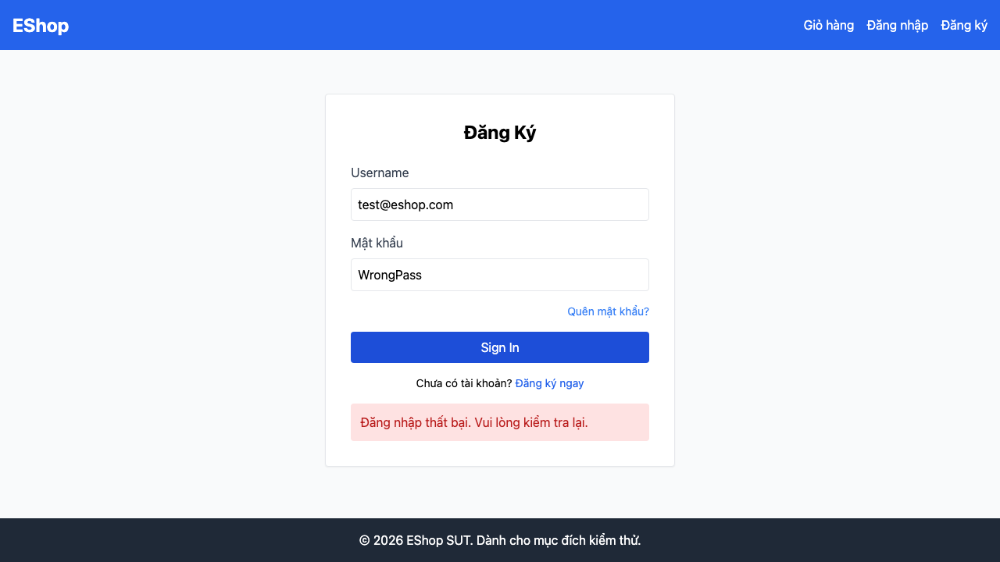

# BUG-01: login_attempts tăng +2 thay vì +1 mỗi lần đăng nhập sai (reconfirmed, HW04)

## Thông tin

| Trường | Giá trị |
|--------|---------|
| Bug ID | BUG-01 |
| Feature | FR-02: Login and Account Lockout |
| Severity | Critical |
| Priority | High |
| Status | Open (đã phát hiện từ HW02, vẫn còn ở HW04) |
| Phát hiện lại bởi | `e2e/fr02-login/fr02-login.spec.ts` — FR02-TC07 (Playwright, 3 browser) |
| File:Line | `backend/server.js:54` |

## Mô tả

Mỗi lần đăng nhập sai mật khẩu, `login_attempts` tăng **+2** thay vì **+1** theo spec. Hệ quả: tài khoản bị khóa sau **2 lần sai** thay vì đúng **3 lần** như README mô tả.

## Bằng chứng tự động hoá (HW04)

Test case `FR02-TC07` thực hiện 3 lần đăng nhập sai liên tiếp qua UI thật, assertion viết theo **spec** (mỗi lần đều phải trả `401`, không bị khóa trước lần thứ 3). Test fail nhất quán trên **cả 3 browser** (Chromium/Firefox/WebKit):

```
Expected: 401
Received: 403   ← ở lần sai thứ 3, tài khoản đã bị khóa từ lần thứ 2
```

Đây chính là hệ quả trực tiếp của BUG-01: vì `attempts` tăng +2/lần, sau lần sai thứ 2 attempts đã = 4 ≥ 3 → khóa sớm 1 lần so với spec.

## Reproduce Steps

1. Tài khoản `test@eshop.com`, `login_attempts = 0`, không bị khóa.
2. `POST /api/login` sai password lần 1 → `401`, DB: `login_attempts = 2` (spec: phải là 1).
3. `POST /api/login` sai password lần 2 → tài khoản đã bị khóa (`login_attempts = 4 ≥ 3`).
4. `POST /api/login` sai password lần 3 (đúng ra vẫn phải là lần kích hoạt khóa theo spec) → nhận `403` (đã khóa từ trước), không phải `401`.

## Root Cause

```javascript
// backend/server.js:54
const newAttempts = user.login_attempts + 2;  // BUG: phải là + 1
```

## Screenshot

Bug này là logic nội bộ (bộ đếm `login_attempts`), UI luôn hiển thị cùng 1 thông báo lỗi chung chung dù nguyên nhân là gì — chụp màn hình trình duyệt không nói lên được gì. Bằng chứng trực tiếp hơn là request/response + trạng thái DB thực tế sau mỗi lần gọi:



*Nguồn: `23127152-hw4/reports/fr02-login/{chromium,firefox,webkit}/index.html`, test case FR02-TC07. Dữ liệu trong ảnh lấy từ lần gọi API thật (curl) ngay trên môi trường dev.*
*Chi tiết đầy đủ (root cause, timeline) đã có tại `tests/HW02/bug-reports/BUG-01.md`.*
