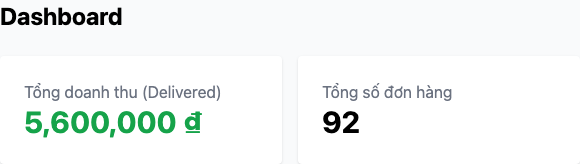

# BUG-09: Dashboard tính doanh thu nhân đôi (reconfirmed, HW04)

## Thông tin

| Trường | Giá trị |
|--------|---------|
| Bug ID | BUG-09 |
| Feature | FR-18: Order Management (Admin) / Dashboard |
| Severity | Major |
| Priority | High |
| Status | Open (đã phát hiện từ HW02, vẫn còn ở HW04) |
| Phát hiện lại bởi | `e2e/fr18-ordermanagement/fr18-ordermanagement.spec.ts` — FR18-TC10, FR18-TC11 (Playwright, 3 browser) |
| File:Line | `frontend-admin/src/App.jsx:218` |

## Mô tả

Doanh thu trên Dashboard tính `total_amount * 2` cho mỗi đơn `delivered` thay vì cộng đúng.

## Bằng chứng tự động hoá (HW04)

Vì Dashboard là **tổng tích luỹ** trên toàn bộ đơn hàng trong DB (không cô lập theo từng test), script đọc doanh thu hiển thị **trước** và **sau** khi tạo 1 đơn mới rồi chuyển sang `delivered` (amount = 100.000₫), rồi so sánh **độ chênh lệch (delta)** với kỳ vọng theo spec — cách này vẫn đúng bất kể DB đã có bao nhiêu đơn `delivered` từ trước:

```
FR18-TC10 — Expected delta: 100,000
            Received delta: 200,000   ← nhân đôi đúng như BUG-09

FR18-TC11 — thêm 1 đơn pending song song (không delivered) → delta vẫn nhân đôi
            phần đơn delivered, chứng minh đơn pending không ảnh hưởng
            (loại trừ khả năng lỗi nằm ở việc gộp nhầm trạng thái)
```

Case đối chứng `FR18-TC12` (chỉ thêm đơn pending, không delivered) cho delta = 0 đúng như kỳ vọng — xác nhận lỗi nhân đôi chỉ xảy ra trên phần doanh thu từ đơn `delivered`.

## Root Cause

```javascript
// frontend-admin/src/App.jsx:218
const totalRevenue = orders.reduce((sum, o) => {
  if (o.status === "delivered") return sum + o.total_amount * 2;  // Sai: * 2
  return sum;
}, 0);
```

## Screenshot

Doanh thu là số tổng tích luỹ trên toàn DB nên 1 ảnh đơn lẻ không nói lên được gì — bằng chứng là cặp **trước/sau** khi thêm đúng 1 đơn `delivered` trị giá 250.000₫:

**Trước** (5.100.000₫):


**Sau khi thêm 1 đơn delivered = 250.000₫** (5.600.000₫ — tăng **500.000₫**, gấp đôi 250.000₫ thay vì cộng đúng):



*Nguồn: `23127152-hw4/reports/fr18-ordermanagement/{chromium,firefox,webkit}/index.html`, test case FR18-TC10/FR18-TC11. Đơn hàng dùng để minh hoạ được tạo trực tiếp qua API ngay trước khi chụp, độc lập với dữ liệu tích luỹ từ các lần chạy test khác.*
