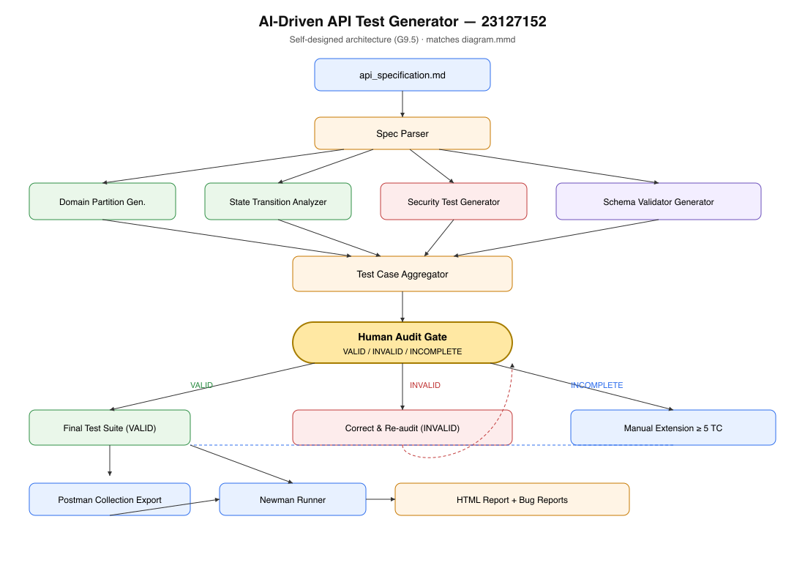

# AI-Driven API Test Generator — Design

**Student ID:** 23127152  
**Bloom-AI Level:** G9.5 (Create)  
**Diagram tool:** Mermaid (hand-authored `diagram.mmd` → exported PNG) — design decisions by student; not an AI image.

> Anti-cheat: diagram is **self-designed**. PNG exported from authored Mermaid source.

---

## 1. Overview

**Input:** `api_specification.md` (+ SEC-01…07 from course README)  
**Output:** Markdown/Excel test suites + Postman collection + Newman-ready assertions  

Generator mirrors the HW06 human pipeline: domain → state → security → schema → **human audit gate** → manual extend (≥5) → export/execute.

---

## 2. Architecture Diagram



Source: [`diagram.mmd`](diagram.mmd)

**Data flow (summary):** Spec Parser fans out to four generators → Aggregator → Human Audit (VALID / INVALID→correct / INCOMPLETE→extend) → Final suite → Postman export + Newman + bug reports.

---

## 3. Components

| Component | Responsibility | Maps to skill |
|-----------|----------------|---------------|
| Spec Parser | Parse endpoints, params, auth, response shapes | `api-test-generate` prep |
| Domain Partition Generator | Valid/invalid/boundary/charset per parameter | Step A |
| State Machine Analyzer | FR-10-style transitions **or** compensating idempotent cases if N/A | Step B |
| Security Test Generator | Map SEC-01…07 → concrete HTTP + **oracles** | Step C |
| Schema Validator Generator | Status, Content-Type, fields/types, error ≠ HTML | Step D |
| Test Case Aggregator | Merge + IDs (`TC-{pool}-{nnn}`) | — |
| Human Review Gate | VALID / INVALID / INCOMPLETE | `api-test-audit` |
| Manual Extension Hook | ≥5 TCs AI missed + taxonomy | `api-test-extend` |
| Postman Exporter | Collection JSON + env + pre-request `X-Student-Id` | `api-test-execute` |
| Newman Runner | CLI + htmlextra; CI Smoke subset | `api-test-execute` / `api-test-cicd` |

---

## 4. Pseudocode

```
FUNCTION generate_api_tests(api_spec, sec_requirements):
    endpoints ← PARSE(api_spec)
    suite ← []

    FOR EACH endpoint IN endpoints:
        suite ← suite + GENERATE_DOMAIN_PARTITIONS(endpoint.params)
        suite ← suite + GENERATE_SCHEMA_TESTS(endpoint.response_schema)

        IF endpoint.has_state_machine:
            suite ← suite + GENERATE_STATE_TRANSITIONS(endpoint.states)
        ELSE:
            suite ← suite + GENERATE_IDEMPOTENT_READ_CASES(endpoint)

        suite ← suite + GENERATE_SECURITY_TESTS(endpoint, sec_requirements)
            // each case MUST include observable oracle
            // (row-count, forbidden field, Content-Type, status 401/403)

    labeled ← HUMAN_AUDIT(suite)
        // VALID | INVALID (correct then re-queue) | INCOMPLETE

    suite ← APPLY_CORRECTIONS(labeled)
    suite ← suite + MANUAL_EXTEND(suite, min_count=5, focus=security)

    collection ← EXPORT_POSTMAN(suite,
        pre_request="upsert X-Student-Id from studentId")
    reports ← RUN_NEWMAN(collection, baseUrl=localhost:3000)

    IF reports.has_spec_vs_sut_failures:
        FILE_BUG_REPORTS(reports)

    RETURN suite, collection, reports
```

---

## 5. Agent Skill Integration

Implemented as repo skills under `.agents/skills/` (orchestrator `hw06-api-testing`):

1. `api-test-generate` — Steps A–D  
2. `api-test-audit` — human-owned labels  
3. `api-test-extend` — ≥5 manual + why AI missed  
4. `api-test-execute` — Postman/Newman + header evidence  
5. `api-test-cicd` — GitHub Actions CI Smoke  
6. `api-test-generator-design` — this G9.5 artifact  

**Demo video (optional):** not recorded for this submission.

**Validation on EShop:** used end-to-end for FR-05, FR-11, FR-15 (120 AI + 18 extended TCs, 6 GitHub bugs).
