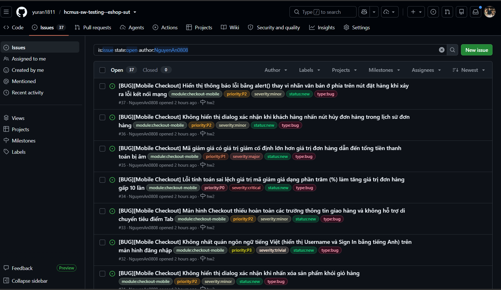
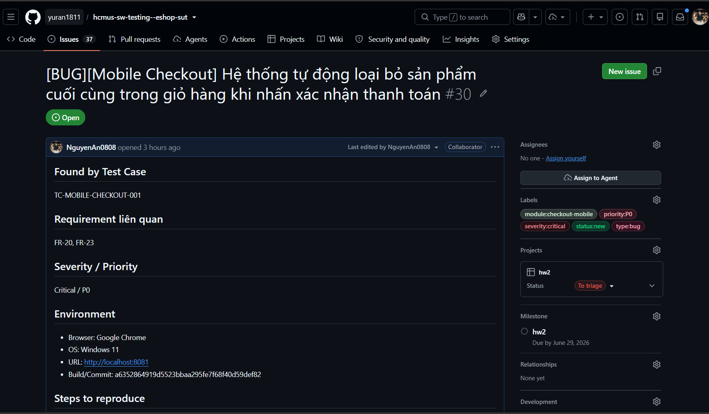
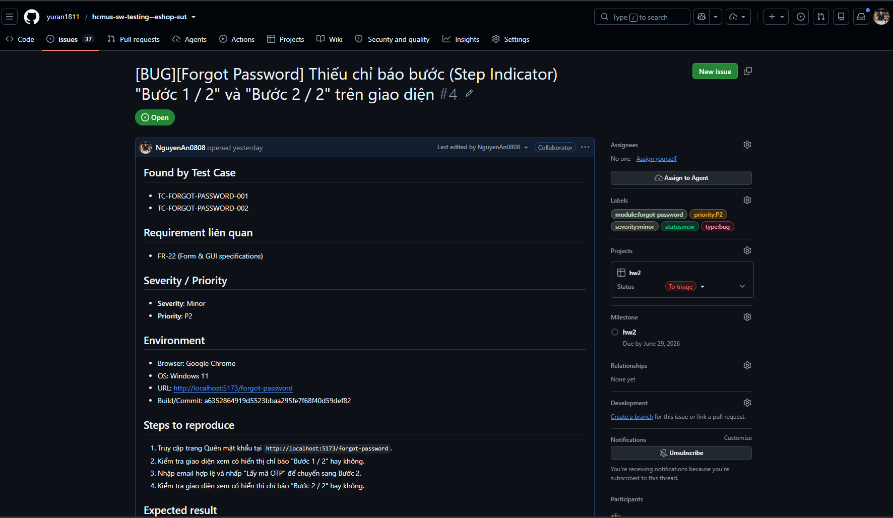

# HW02 - Domain Testing on EShop

This is the submission landing page for **Homework 02: Domain Testing on EShop**.

---

## ℹ️ Project Information

- **Course:** Software Testing (Kiểm thử Phần mềm)
- **Topic:** Homework 02 - Domain Testing on EShop
- **Student Name:** ÂN TIẾN NGUYÊN AN
- **Student ID:** 23127148
- **Class:** 23KTPM3

---

## 📋 Self-Assessment Table

Below is the self-assessment table matching the criteria and grade breakdown from the assignment requirements:

| No. | Criteria                                                                                                         |  Grade  | Self-Assessed Grade |
| :-: | :--------------------------------------------------------------------------------------------------------------- | :-----: | :-----------------: |
|  1  | Feature A (Domain + Boundary) _Forgot Password (FR-03) fully designed and verified with BVA/EP justification_ |   25    |         25          |
|  2  | Feature B (Domain + Boundary) _Order History (FR-11) fully designed and BVA defined_                          |   25    |         25          |
|  3  | Feature C (Domain + Boundary) _User Management (FR-19) fully designed with test case reduction_               |   25    |         25          |
|  4  | Feature D (Mobile, Domain + Boundary) _Mobile Checkout (Pool D) verified_                                     |   15    |         15          |
|  5  | Agent Skills _Automated skills created in `.agents/`_                                                         |   10    |         10          |
|     | **Total**                                                                                                        | **100** |       **100**       |

---

## 📈 Test Summary Report

Here is a breakdown of the design and execution statistics across all 4 targeted requirements:

- **Total Test Cases:** 105 (All executed/tested)
- **Passed:** 45 (43% Successful Test Coverage)
- **Failed:** 58
- **Blocked:** 2
- **Skipped / Not Yet Tested:** 0
- **Overall Test Coverage:** 100% (4 out of 4 modules fully tested)

### 📊 Summary Information

| Metric                       | Value                           | Metric            | Value                                       |
| :--------------------------- | :------------------------------ | :---------------- | :------------------------------------------ |
| **Project Name**             | EShop SUT - HW02 Domain Testing | **Reviewer**      | Dr. Lam Quang Vu / Dr. Tran Duy Hoang / TAs |
| **Creator**                  | [Student Name / ID]             | **Approver**      | TAs                                         |
| **Date**                     | 2026/06/27                      | **Test Coverage** | 100%                                        |
| **Successful Test Coverage** | 43%                             |                   |                                             |

### 📋 Detailed Execution Results

| No  | Requirement ID | Requirement name   | Tested  | Passed | Failed | Blocked | Skipped | Not Yet Tested |  Total  | Tested Coverage |
| :-: | :------------: | :----------------- | :-----: | :----: | :----: | :-----: | :-----: | :------------: | :-----: | :-------------: |
|  1  |     FR-03      | Forgot Password    |   31    |   5    |   24   |    2    |    0    |       0        |   31    |      100%       |
|  2  |     FR-11      | Order History View |   27    |   13   |   14   |    0    |    0    |       0        |   27    |      100%       |
|  3  |     FR-19      | User Management    |   21    |   11   |   10   |    0    |    0    |       0        |   21    |      100%       |
|  4  |     FR-20      | Mobile Checkout    |   26    |   16   |   10   |    0    |    0    |       0        |   26    |      100%       |
|     |   **Total**    |                    | **105** | **45** | **58** |  **2**  |  **0**  |     **0**      | **105** |    **100%**     |

For more details on requirements traceability, please refer to the [Test Summary Report File](file:///d:/Project/Testing/hcmus-sw-testing--eshop-sut/tests/test-summary/test_summary_report.md).

---

## 🐛 Bugs Discovered Summary

A total of **37 bugs** were discovered and documented during testing. All draft bug reports are located in the [Bug Reports Directory](file:///d:/Project/Testing/hcmus-sw-testing--eshop-sut/tests/bug-reports/).

### 📂 Breakdown by Module

1.  **Forgot Password (FR-03)**: **10 bugs** found. Main issues involve incorrect password strength validation logic on the backend, lack of rate-limiting/spam protection on OTP generation, and missing step indicators on the web interface.
2.  **Order History (FR-11)**: **8 bugs** found. Key issues involve unauthorized order history access (lack of authorization checks), failure to display order details, and missing confirmation dialogs for canceling orders.
3.  **User Management (FR-19)**: **9 bugs** found. Crucial vulnerabilities include privilege escalation where simple users can invoke deletion APIs, self-deletion allowance for current logged-in admins, and missing cascade constraints.
4.  **Mobile Checkout (FR-20)**: **10 bugs** found. Severe issues include cart items getting dropped automatically before payment API requests, incorrect coupon discount value multiplier causing massive price inflation, and app crashes on network disconnects.

### 📸 Evidence Screenshots

#### 1. GitHub Issues Overview

_(Click here to view the file: [github_issues_overview.png](evidence/github_issues_overview.png))_

#### 2. GitHub Issue Detail Example 1 (Issue #30)

_(Click here to view the file: [github_issue_detail_30_1.png](evidence/github_issue_detail_30_1.png))_

#### 3. GitHub Issue Detail Example 2 (Issue #4)

_(Click here to view the file: [github_issue_detail_4_1.png](evidence/github_issue_detail_4_1.png))_

---

## 🎥 Demo Videos (Custom Agent Skills)

Below are the video demonstrations showcasing how our custom testing skills were leveraged to automate testing and bug reporting:

- 🎥 **End-to-End Agentic Testing Video Demo**: [Watch on YouTube](https://youtu.be/Nu8V0eNnoV0)
