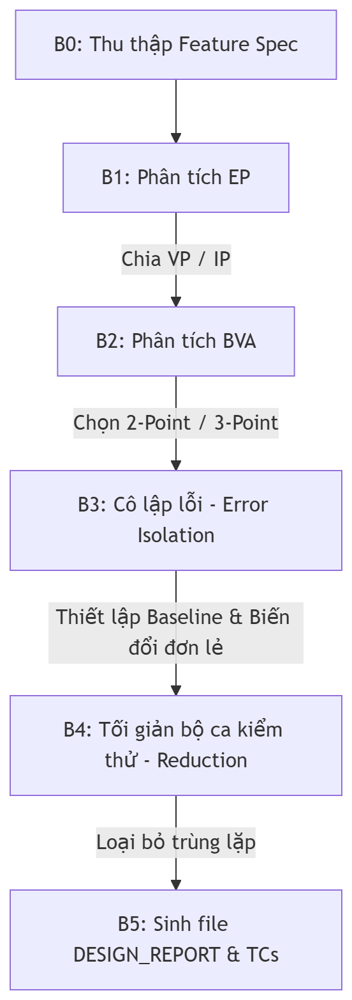
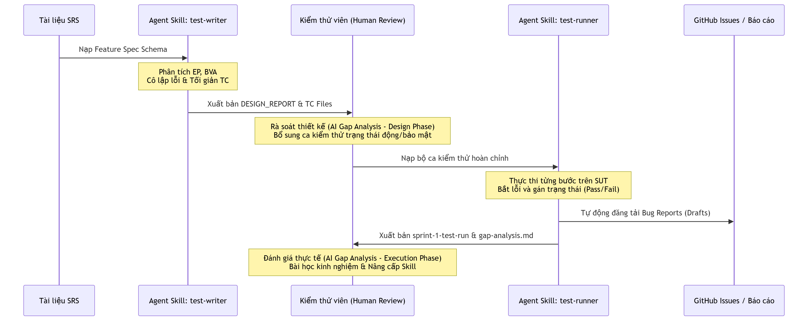

# BÁO CÁO CHÍNH - HW02

**Môn học**: Kiểm thử phần mềm (KTPM)  
**Hệ thống kiểm thử (SUT)**: EShop  
**Sinh viên thực hiện**: ÂN TIẾN NGUYÊN AN  
**Mã số sinh viên**: 23127148  
**Lớp**: 23KTPM3

---

## Mục lục

1. [Feature 1: Quên mật khẩu & Đặt lại mật khẩu (FR-03)](#feature-1)
   - 1.1 [Domain Testing (EP)](#fr03-ep)
   - 1.2 [Boundary Value Analysis (BVA)](#fr03-bva)
   - 1.3 [AI Gap Analysis — Design Phase](#fr03-gap-design)
   - 1.4 [Bug Report & AI Gap Analysis — Execution Phase](#fr03-bug)
2. [Feature 2: Xem lịch sử đơn hàng (FR-11)](#feature-2)
   - 2.1 [Domain Testing (EP)](#fr11-ep)
   - 2.2 [Boundary Value Analysis (BVA)](#fr11-bva)
   - 2.3 [AI Gap Analysis — Design Phase](#fr11-gap-design)
   - 2.4 [Bug Report & AI Gap Analysis — Execution Phase](#fr11-bug)
3. [Feature 3: Quản lý người dùng - Admin (FR-19)](#feature-3)
   - 3.1 [Domain Testing (EP)](#fr19-ep)
   - 3.2 [Boundary Value Analysis (BVA)](#fr19-bva)
   - 3.3 [AI Gap Analysis — Design Phase](#fr19-gap-design)
   - 3.4 [Bug Report & AI Gap Analysis — Execution Phase](#fr19-bug)
4. [Feature 4: Thanh toán trên Mobile (FR-20)](#feature-4)
   - 4.1 [Domain Testing (EP)](#fr20-ep)
   - 4.2 [Boundary Value Analysis (BVA)](#fr20-bva)
   - 4.3 [AI Gap Analysis — Design Phase](#fr20-gap-design)
   - 4.4 [Bug Report & AI Gap Analysis — Execution Phase](#fr20-bug)
5. [Agent Skills](#agent-skills)

---

## Feature 1: Quên mật khẩu & Đặt lại mật khẩu (FR-03) 

### 1. Domain Testing (Equivalence Partitioning) 

- **Tóm tắt các biến input đã xác định**:
  - `email` (Bước 1): Địa chỉ email yêu cầu OTP.
  - `otp` (Bước 2): Mã xác thực OTP do hệ thống gửi.
  - `newPassword` (Bước 2): Mật khẩu mới thiết lập.
  - `confirmNewPassword` (Bước 2): Xác nhận mật khẩu mới.
  - `sessionState` (Implicit): Trạng thái phiên làm việc (Đã/Chưa qua Bước 1).
  - `failedOTPAttempts` (Implicit): Số lần nhập sai mã OTP liên tiếp.
  - `sessionValidity` (Implicit): Trạng thái phiên làm việc sau khi reset thành công.

#### Quy trình áp dụng Domain Testing (EP) từng bước:

**Bước 1 — Xác định Input & Output**

- **Input**: Gồm 7 biến là `email`, `otp`, `newPassword`, `confirmNewPassword`, và 3 biến trạng thái ẩn (`sessionState`, `failedOTPAttempts`, `sessionValidity`).
- **Output**: Mật khẩu mới được lưu thành công trên hệ thống và chuyển hướng người dùng về trang đăng nhập, hiển thị thông báo thành công hoặc thông báo lỗi tương ứng.

**Bước 2 — Phân chia miền giá trị (Equivalence Partitioning)**  
Với mỗi biến input, chia thành Valid Partitions (VP) và Invalid Partitions (IP) dựa trên business rules của `FR-03` và `FR-22`.  
Tổng số partitions: 7 valid + 22 invalid = 29 partitions.

**Bước 3 — Chọn giá trị đại diện (Representative Values)**  
Mỗi partition chọn 1 giá trị điển hình nhất (không phải biên — biên dành cho BVA):

- `email`: `test@eshop.com` (VP), `unregistered@eshop.com` (IP), `invalid-email` (IP).
- `otp`: `123456` (VP), `999999` (IP), `123a56` (IP).
- `newPassword`: `Reset123!` (VP), `reset123!` (IP), `RESET123!` (IP), `Resetxyz!` (IP).
- `confirmNewPassword`: `Reset123!` (VP), `Different123!` (IP).
- `sessionState`: `session active` (VP), `session empty` (IP).
- `failedOTPAttempts`: `4 lần` (VP), `5 lần` (IP).
- `sessionValidity`: `active` (VP), `invalidated` (IP).

**Bước 4 — Thiết kế TC theo nguyên tắc Error Isolation**  
Thiết lập Valid Baseline. Tại mỗi TC, chỉ thay đổi 1 biến sang partition cần test, các biến còn lại giữ giá trị baseline hợp lệ.  
Số TC ban đầu: 31 TCs.

**Bước 5 — Rút gọn TC (Test Case Reduction)**  
Không có TC trùng lặp sau khi review.  
Số TC sau rút gọn: 31 TCs.

**Tổng kết EP:**

- TC từ Domain Testing (EP): 19 TCs
- TC từ BVA (sẽ thiết kế ở Section 2): 12 TCs
- Tổng sau Test Case Reduction: 31 TCs

* **Bảng EP partition**:

| Tham số nhập liệu                                | Phân vùng hợp lệ (Valid Partitions)                                                                                                                             | Phân vùng không hợp lệ (Invalid Partitions)                                                                                                                                                                                                                                                                                                                                                                                                                                                                                                                                                                                                                                |
| ------------------------------------------------ | --------------------------------------------------------------------------------------------------------------------------------------------------------------- | -------------------------------------------------------------------------------------------------------------------------------------------------------------------------------------------------------------------------------------------------------------------------------------------------------------------------------------------------------------------------------------------------------------------------------------------------------------------------------------------------------------------------------------------------------------------------------------------------------------------------------------------------------------------------- |
| **Email**                                        | **EP-IN-EMAIL-1**: Email đã đăng ký trong hệ thống. _Giá trị đại diện: test@eshop.com_                                                                       | **EP-IN-EMAIL-2-INV**: Để trống trường Email. _Giá trị đại diện: ""_  **EP-IN-EMAIL-3-INV**: Email chưa đăng ký trong hệ thống. _Giá trị đại diện: unregistered@eshop.com_  **EP-IN-EMAIL-4-INV**: Email sai định dạng cú pháp. _Giá trị đại diện: invalid-email_                                                                                                                                                                                                                                                                                                                                                                                     |
| **OTP**                                          | **EP-IN-OTP-1**: Mã OTP đúng 6 chữ số sinh ra cho email hiện tại. _Giá trị đại diện: 123456_                                                                 | **EP-IN-OTP-2-INV**: Để trống trường OTP. _Giá trị đại diện: ""_  **EP-IN-OTP-3-INV**: Độ dài OTP không đúng 6 chữ số. _Giá trị đại diện: 12345, 1234567_  **EP-IN-OTP-4-INV**: OTP chứa ký tự phi số. _Giá trị đại diện: 123a56_  **EP-IN-OTP-5-INV**: OTP 6 chữ số nhưng sai giá trị. _Giá trị đại diện: 999999_  **EP-IN-OTP-6-INV**: OTP hợp lệ của email khác. _Giá trị đại diện: 123456 (cho other@eshop.com)_  **EP-IN-OTP-7-INV**: Mã OTP đã hết hạn. _Giá trị đại diện: 123456 (hết hạn)_  **EP-IN-OTP-8-INV**: Mã OTP đã được sử dụng trước đó (Replay Attack). _Giá trị đại diện: 123456 (đã sử dụng)_ |
| **Mật khẩu mới**                                 | **EP-IN-PASS-1**: Mật khẩu mạnh từ 8 ký tự trở lên, chứa ít nhất 1 chữ hoa, 1 chữ thường, 1 chữ số, 1 ký tự đặc biệt cho phép. _Giá trị đại diện: Reset123!_ | **EP-IN-PASS-2-INV**: Để trống trường mật khẩu mới. _Giá trị đại diện: ""_  **EP-IN-PASS-3-INV**: Độ dài mật khẩu quá ngắn (< 8 ký tự). _Giá trị đại diện: Res123!_  **EP-IN-PASS-4-INV**: Mật khẩu thiếu chữ hoa. _Giá trị đại diện: reset123!_  **EP-IN-PASS-5-INV**: Mật khẩu thiếu chữ thường. _Giá trị đại diện: RESET123!_  **EP-IN-PASS-6-INV**: Mật khẩu thiếu chữ số. _Giá trị đại diện: Resetxyz!_  **EP-IN-PASS-7-INV**: Mật khẩu thiếu ký tự đặc biệt. _Giá trị đại diện: Reset1234_  **EP-IN-PASS-8-INV**: Mật khẩu chứa ký tự đặc biệt không được phép. _Giá trị đại diện: Reset123#_               |
| **Xác nhận mật khẩu**                            | **EP-IN-CONFIRM-1**: Trùng khớp hoàn toàn với mật khẩu mới. _Giá trị đại diện: Reset123!_                                                                    | **EP-IN-CONFIRM-2-INV**: Để trống trường xác nhận. _Giá trị đại diện: ""_  **EP-IN-CONFIRM-3-INV**: Không trùng khớp mật khẩu mới. _Giá trị đại diện: Different123!_                                                                                                                                                                                                                                                                                                                                                                                                                                                                                           |
| **Phiên làm việc** (`sessionState`)              | **EP-IN-SESSION-1**: Đã hoàn thành Bước 1 (Có phiên làm việc hợp lệ). _Giá trị đại diện: session active_                                                     | **EP-IN-SESSION-2-INV**: Chưa hoàn thành Bước 1 (Truy cập trực tiếp URL Bước 2). _Giá trị đại diện: session empty_                                                                                                                                                                                                                                                                                                                                                                                                                                                                                                                                                      |
| **Số lần thử OTP** (`failedOTPAttempts`)         | **EP-IN-ATTEMPTS-1**: Số lần nhập sai mã OTP dưới giới hạn (< 5 lần). _Giá trị đại diện: 4 lần_                                                              | **EP-IN-ATTEMPTS-2-INV**: Số lần nhập sai mã OTP đạt hoặc vượt giới hạn (>= 5 lần). _Giá trị đại diện: 5 lần_                                                                                                                                                                                                                                                                                                                                                                                                                                                                                                                                                           |
| **Hiệu lực phiên sau reset** (`sessionValidity`) | **EP-IN-VALIDITY-1**: Phiên làm việc còn hiệu lực trước khi reset. _Giá trị đại diện: active_                                                                | **EP-IN-VALIDITY-2-INV**: Phiên làm việc bị hủy bỏ sau khi reset thành công. _Giá trị đại diện: invalidated_                                                                                                                                                                                                                                                                                                                                                                                                                                                                                                                                                            |

- **Valid Baseline cho Error Isolation**:
  - `email = test@eshop.com`
  - `otp = 123456`
  - `newPassword = Reset123!`
  - `confirmNewPassword = Reset123!`
  - `sessionState = session active`
  - `failedOTPAttempts = 0`
  - `sessionValidity = active`

---

### 2. Boundary Value Analysis (BVA) 

- **Các boundary đã xác định**:
  - Độ dài mã OTP: Ngưỡng cố định nghiêm ngặt bằng 6 chữ số.
  - Độ dài mật khẩu mới: Ngưỡng tối thiểu bằng 8 ký tự.
  - Số lần nhập sai OTP: Ngưỡng brute-force tối đa bằng 5 lần.
  - Trạng thái để trống của các trường (`email`, `otp`, `newPassword`, `confirmNewPassword`).

#### Quy trình áp dụng BVA từng bước:

**Bước 1 — Xác định các boundary từ kết quả EP**  
Dựa vào các partition đã chia ở Section 1, xác định 4 boundary points quan trọng cần kiểm thử gồm ranh giới độ dài OTP (6), ranh giới độ dài tối thiểu mật khẩu mới (8), ranh giới số lần thử sai OTP (5), và ranh giới trống của 4 trường đầu vào.

**Bước 2 — Chọn chiến lược BVA cho từng boundary**

- **3-Point BVA** cho độ dài OTP (5, 6, 7 chữ số) và độ dài mật khẩu mới (7, 8, 9 ký tự) cùng giới hạn số lần thử sai OTP (4, 5, 6 lần) do đây là các giá trị biên số lượng, cần cô lập logic ranh giới dưới biên, tại biên và trên biên.
- **2-Point BVA** cho các trạng thái để trống của các trường đầu vào do đây là ranh giới nhị phân (có dữ liệu vs không có dữ liệu).

**Bước 3 — Thiết kế BVA TC theo Error Isolation**  
Giữ nguyên Valid Baseline từ Section 1. Chỉ thay đổi giá trị của biến đang test boundary, các biến còn lại giữ baseline.  
Số BVA TC: 12 TCs.

- **Bảng biện luận chọn 2-Point vs 3-Point cho từng boundary**:
  - _Độ dài OTP_: Chọn **3-Point BVA** (giá trị 5, 6, 7). Vì OTP yêu cầu độ dài chính xác bằng 6. Thiết kế 3-Point giúp xác nhận hành vi hệ thống tại ranh giới dưới (5 - Invalid), ranh giới danh nghĩa (6 - Valid) và ranh giới trên (7 - Invalid) để cô lập logic kiểm tra độ dài.
  - _Độ dài mật khẩu mới_: Chọn **3-Point BVA** (giá trị 7, 8, 9). Vì 8 ký tự là ngưỡng tối thiểu để mật khẩu hợp lệ (ranh giới một chiều). 3-Point BVA giúp kiểm tra giá trị không đạt biên (7 - Invalid), giá trị chính xác tại biên (8 - Valid), và giá trị vượt biên (9 - Valid).
  - _Giới hạn số lần nhập sai OTP_: Chọn **3-Point BVA** (giá trị 4, 5, 6 lần thử sai). Nhằm xác minh cơ chế bảo mật khóa tài khoản kích hoạt chính xác tại lần thứ 5 (4 lần vẫn hoạt động, 5 và 6 bị khóa).
  - _Trạng thái để trống_: Chọn **2-Point BVA** (Để trống `""` vs Có dữ liệu) vì đây là ranh giới nhị phân đơn giản giữa sự tồn tại và vắng mặt của dữ liệu.

- **Bảng BVA TC**:

| BVA ID                  | Giá trị test          | Expected Output                                          |
| ----------------------- | --------------------- | -------------------------------------------------------- |
| **BVA-EMAIL-EMPTY**     | `""`                  | Báo lỗi bắt buộc nhập Email phía trên nút submit.        |
| **BVA-EMAIL-NOT-EMPTY** | `test@eshop.com`      | Chấp nhận Email, gửi OTP thành công.                     |
| **BVA-OTP-EMPTY**       | `""`                  | Báo lỗi bắt buộc nhập OTP phía trên nút submit.          |
| **BVA-OTP-LEN-1**       | `12345` (5 chữ số)    | Báo lỗi độ dài OTP không hợp lệ phía trên nút submit.    |
| **BVA-OTP-LEN-2**       | `123456` (6 chữ số)   | Chấp nhận OTP hợp lệ.                                    |
| **BVA-OTP-LEN-3**       | `1234567` (7 chữ số)  | Báo lỗi độ dài OTP không hợp lệ phía trên nút submit.    |
| **BVA-PASS-EMPTY**      | `""`                  | Báo lỗi bắt buộc nhập mật khẩu mới phía trên nút submit. |
| **BVA-PASS-LEN-1**      | `Res123!` (7 ký tự)   | Báo lỗi mật khẩu quá ngắn phía trên nút submit.          |
| **BVA-PASS-LEN-2**      | `Reset12!` (8 ký tự)  | Chấp nhận mật khẩu hợp lệ.                               |
| **BVA-PASS-LEN-3**      | `Reset123!` (9 ký tự) | Chấp nhận mật khẩu hợp lệ.                               |
| **BVA-CONFIRM-EMPTY**   | `""`                  | Báo lỗi bắt buộc nhập xác nhận mật khẩu.                 |
| **BVA-OTP-ATTEMPTS-1**  | 4 lần nhập sai        | Cho phép tiếp tục thử.                                   |
| **BVA-OTP-ATTEMPTS-2**  | 5 lần nhập sai        | Khóa tài khoản/chặn yêu cầu đặt lại mật khẩu.            |
| **BVA-OTP-ATTEMPTS-3**  | 6 lần nhập sai        | Duy trì trạng thái khóa/chặn yêu cầu.                    |

---

### 3. AI Gap Analysis — Giai đoạn Thiết kế (Design Phase) 

- **Các TC bị bỏ sót phát hiện qua Human Review**:
  - `TC-FORGOT-PASSWORD-026`: Kiểm thử mã OTP hết hạn.
  - `TC-FORGOT-PASSWORD-027`: Kiểm thử tấn công phát lại (Replay Attack) bằng cách sử dụng lại mã OTP đã được xác nhận thành công trước đó.
  - `TC-FORGOT-PASSWORD-028`: Ngăn chặn truy cập trực tiếp vào giao diện đặt lại mật khẩu ở Bước 2 khi chưa hoàn thành Bước 1.
  - `TC-FORGOT-PASSWORD-029`: Kiểm tra tính ngẫu nhiên của mã OTP khi gửi yêu cầu liên tiếp.
  - `TC-FORGOT-PASSWORD-030`: Kiểm tra cơ chế chặn Brute Force khóa yêu cầu sau 5 lần nhập sai liên tiếp.
  - `TC-FORGOT-PASSWORD-031`: Kiểm tra nút Back trình duyệt và vô hiệu hóa phiên OTP sau khi reset mật khẩu thành công.
- **Root cause của từng gap (Phân tích nguyên nhân)**:
  - **Nguyên nhân 1 — Chất lượng prompt (Prompt quality)**: Prompt ban đầu chỉ tham chiếu đến chức năng giao diện của FR-03 và FR-22 mà không yêu cầu AI cross-check với Security Requirements (SEC-01 đến SEC-07). AI không tự động đọc toàn bộ tài liệu nếu không được chỉ định rõ phạm vi (scope).
  - **Nguyên nhân 2 — Giới hạn của AI (AI limitation)**: AI thiết kế các ca kiểm thử dựa trên luồng chức năng (functional flow) tuyến tính tĩnh (Bước 1 → Bước 2). Các trạng thái động như OTP hết hạn (expiry) và sử dụng một lần (one-time-use) đòi hỏi nhận thức thời gian thực (temporal awareness) — điều mà AI thiếu khả năng tự mô hình hóa nếu không được hướng dẫn.
  - **Nguyên nhân 3 — Độ phức tạp của tính năng (Feature complexity)**: Quên mật khẩu là một luồng gồm 2 bước (2-step flow) với các ràng buộc bảo mật (security constraints) được đặt ẩn trong phần bảo mật riêng (SEC-07). AI xử lý tốt các EP/BVA hiển thị rõ ràng (explicit) trong FR giao diện nhưng bỏ sót các ràng buộc ẩn (implicit constraints) từ phần bảo mật.
- **Student fix đã áp dụng**:
  - Bổ sung 2 ca kiểm thử bảo mật: `TC-FORGOT-PASSWORD-026` và `TC-FORGOT-PASSWORD-027`.
  - Điều chỉnh lại ánh xạ BVA bị sai của `TC-002` thành `BVA-PASS-LEN-3` (9 ký tự) và dữ liệu của `TC-024` thành `Reset12!` (8 ký tự).
  - Bổ sung 4 ca kiểm thử kiểm soát trạng thái động: `TC-FORGOT-PASSWORD-028` đến `TC-FORGOT-PASSWORD-031`.

---

### 4. Bug Report & AI Gap Analysis — Giai đoạn Thực thi (Execution Phase) 

- **Tổng số bug tìm được**: **10 bugs**
- **Bảng tổng hợp Bug**:

| Bug ID         | Tiêu đề                                                                                  | Found by TC                                                                                    | Severity | Priority | GitHub Issue # |
| -------------- | ---------------------------------------------------------------------------------------- | ---------------------------------------------------------------------------------------------- | -------- | -------- | -------------- |
| **BUG-FP-001** | Thiếu trường nhập liệu "Xác nhận mật khẩu mới" tại Bước 2                                | TC-FORGOT-PASSWORD-002, TC-FORGOT-PASSWORD-020, TC-FORGOT-PASSWORD-021                         | Critical | P0       | Draft-FP-001   |
| **BUG-FP-002** | Regex kiểm tra mật khẩu bị lỗi - bắt buộc khoảng trắng và chặn ký tự đặc biệt            | TC-FORGOT-PASSWORD-002, TC-FORGOT-PASSWORD-014 đến -019, TC-FORGOT-PASSWORD-024                | Major    | P1       | Draft-FP-002   |
| **BUG-FP-003** | Hệ thống sinh mã OTP 4 chữ số thay vì 6 chữ số theo đặc tả yêu cầu                       | TC-FORGOT-PASSWORD-001, TC-FORGOT-PASSWORD-002, TC-FORGOT-PASSWORD-008, TC-FORGOT-PASSWORD-009 | Major    | P1       | Draft-FP-003   |
| **BUG-FP-004** | Thiếu chỉ báo bước (Step Indicator) "Bước 1 / 2" và "Bước 2 / 2" trên giao diện          | TC-FORGOT-PASSWORD-001, TC-FORGOT-PASSWORD-002                                                 | Minor    | P2       | Draft-FP-004   |
| **BUG-FP-005** | Thiếu nhãn dấu sao đỏ (\*) biểu thị trường bắt buộc nhập                                 | TC-FORGOT-PASSWORD-023                                                                         | Minor    | P2       | Draft-FP-005   |
| **BUG-FP-006** | Thông báo lỗi hiển thị bằng hộp thoại alert() thay vì nhãn văn bản phía trên nút submit  | TC-FORGOT-PASSWORD-003 đến -005, TC-FORGOT-PASSWORD-007 đến -019, TC-FORGOT-PASSWORD-023       | Minor    | P2       | Draft-FP-006   |
| **BUG-FP-007** | API Quên mật khẩu phân biệt chữ hoa/chữ thường đối với Email đăng ký                     | TC-FORGOT-PASSWORD-025                                                                         | Major    | P1       | Draft-FP-007   |
| **BUG-FP-008** | Mã OTP không có cơ chế hết hạn (hết hiệu lực) theo thời gian                             | TC-FORGOT-PASSWORD-026                                                                         | Major    | P1       | Draft-FP-008   |
| **BUG-FP-009** | Thiếu cơ chế khóa tài khoản sau 5 lần nhập sai mã OTP liên tiếp (Brute Force Protection) | TC-FORGOT-PASSWORD-030                                                                         | Critical | P0       | Draft-FP-009   |
| **BUG-FP-010** | Thiếu nút hoặc liên kết "Quay lại đăng nhập" tại giao diện Bước 1                        | TC-FORGOT-PASSWORD-006                                                                         | Minor    | P2       | Draft-FP-010   |

**Bugs AI không predict được khi thiết kế:**

| Bug ID         | Lý do AI không predict                                                                          | Root cause                                                                              |
| -------------- | ----------------------------------------------------------------------------------------------- | --------------------------------------------------------------------------------------- |
| **BUG-FP-002** | Chỉ phát hiện khi chạy thực tế với mật khẩu hợp lệ và bị Regex chặn                             | AI giả định Regex được viết đúng tiêu chuẩn trong tài liệu thiết kế.                    |
| **BUG-FP-003** | Chỉ phát hiện khi thực hiện Bước 1 và quan sát độ dài mã OTP thực tế hiển thị trên giao diện    | AI giả định backend trả về đúng 6 chữ số theo SRS.                                      |
| **BUG-FP-007** | Chỉ phát hiện khi gửi request API hoặc nhập email chứa chữ viết hoa và nhận phản hồi lỗi 404    | AI giả định hệ thống tự động chuẩn hóa email về dạng chữ thường trước khi đối chiếu DB. |
| **BUG-FP-008** | Chỉ phát hiện khi chờ qua thời gian hết hạn OTP và thực thi thành công                          | AI giả định backend có cơ chế kiểm tra thời gian hết hạn (temporal validation) của OTP. |
| **BUG-FP-009** | Chỉ phát hiện khi thực tế nhập sai mã OTP liên tục 5 lần mà tài khoản vẫn hoạt động bình thường | AI giả định backend có cấu hình brute-force protection mặc định.                        |

---

---

## Feature 2: Xem lịch sử đơn hàng (FR-11) 

### 1. Domain Testing (Equivalence Partitioning) 

- **Tóm tắt các biến input đã xác định**:
  - `userSession`: Trạng thái đăng nhập của người dùng.
  - `ordersInDB`: Số lượng đơn hàng trong cơ sở dữ liệu.
  - `orderStatus`: Trạng thái của đơn hàng (`pending`, `confirmed`, `shipping`, `delivered`, `canceled`).
  - `orderOwnership`: Quyền sở hữu đơn hàng.
  - `financialDetails`: Đầy đủ thông tin phí ship, coupon và tổng tiền trong chi tiết đơn hàng.
  - `tabFocusOrder` (Accessibility): Thứ tự di chuyển tiêu điểm phím Tab.
  - `totalAmount` (VND): Số tiền đơn hàng hiển thị.
  - `h1Tags` (SEO/GUI): Số lượng thẻ tiêu đề H1.
  - `language`: Ngôn ngữ hiển thị (tiếng Việt).
  - `orderDate`: Định dạng hiển thị ngày đặt hàng.

#### Quy trình áp dụng Domain Testing (EP) từng bước:

**Bước 1 — Xác định Input & Output**

- **Input**: Gồm 10 biến/trạng thái là `userSession`, `ordersInDB`, `orderStatus`, `orderOwnership`, `financialDetails`, `tabFocusOrder`, `totalAmount`, `h1Tags`, `language`, và `orderDate`.
- **Output**: Hiển thị bảng danh sách đơn hàng được Việt hóa và định dạng tiền VND, chuyển hướng xem chi tiết đơn hàng chứa phí ship, coupon, hoặc hiển thị Empty State nếu có 0 đơn hàng, chặn truy cập IDOR của người dùng khác.

**Bước 2 — Phân chia miền giá trị (Equivalence Partitioning)**  
Với mỗi biến input, chia thành Valid Partitions (VP) và Invalid Partitions (IP) dựa trên business rules của `FR-11` và `FR-21`.  
Tổng số partitions: 10 valid + 10 invalid = 20 partitions.

**Bước 3 — Chọn giá trị đại diện (Representative Values)**  
Mỗi partition chọn 1 giá trị điển hình nhất (không phải biên):

- `userSession`: `logged in as test@eshop.com` (VP), `anonymous` (IP), `test@eshop.com xem ORD999 của other@eshop.com` (IP).
- `ordersInDB`: `5 orders` (VP), `0 orders` (VP).
- `orderStatus`: `pending` (VP), `confirmed` (VP), `shipping` (VP), `delivered` (VP), `canceled` (VP), `processing` (IP).
- `orderOwnership`: `test@eshop.com` (VP), `user_b@eshop.com` (IP).
- `financialDetails`: `Có đủ phí ship 30k và coupon 50k` (VP).
- `tabFocusOrder`: `Focus tuần tự` (VP), `Focus lộn xộn` (IP).
- `totalAmount`: `150.000 ₫` (VP), `150000` (IP).
- `h1Tags`: `1 thẻ <h1>` (VP), `0 thẻ` (IP), `2 thẻ` (IP).
- `language`: `Toàn bộ tiếng Việt` (VP), `Lẫn lộn tiếng Anh` (IP).
- `orderDate`: `26/06/2026` (VP), `2026-06-26T07:39:15.000Z` (IP).

**Bước 4 — Thiết kế TC theo nguyên tắc Error Isolation**  
Thiết lập Valid Baseline. Tại mỗi TC, chỉ thay đổi 1 biến sang partition cần test, các biến còn lại giữ giá trị baseline hợp lệ.  
Số TC ban đầu: 27 TCs.

**Bước 5 — Rút gọn TC (Test Case Reduction)**  
Không có TC trùng lặp sau khi review.  
Số TC sau rút gọn: 27 TCs.

**Tổng kết EP:**

- TC từ Domain Testing (EP): 15 TCs
- TC từ BVA (sẽ thiết kế ở Section 2): 12 TCs
- Tổng sau Test Case Reduction: 27 TCs

* **Bảng EP partition**:

| Tham số nhập liệu / Trạng thái          | Phân vùng hợp lệ (Valid Partitions)                                                                                                                                                                                       | Phân vùng không hợp lệ (Invalid Partitions)                                                                                                                                                                                                                   |
| --------------------------------------- | ------------------------------------------------------------------------------------------------------------------------------------------------------------------------------------------------------------------------- | ------------------------------------------------------------------------------------------------------------------------------------------------------------------------------------------------------------------------------------------------------------- |
| **Phiên đăng nhập** (`userSession`)     | **EP-IN-SESSION-1**: Phiên đăng nhập hợp lệ của chính chủ. _Giá trị đại diện: test@eshop.com_                                                                                                                          | **EP-IN-SESSION-2-INV**: Chưa đăng nhập (khách vãng lai). _Giá trị đại diện: anonymous_  **EP-IN-SESSION-3-INV**: Đăng nhập tài khoản A nhưng cố truy cập đơn hàng tài khoản B. _Giá trị đại diện: test@eshop.com xem ORD999 của other@eshop.com_ |
| **Số lượng đơn hàng** (`ordersInDB`)    | **EP-IN-COUNT-1**: Có 0 đơn hàng (trạng thái trang trống). _Giá trị đại diện: 0_  **EP-IN-COUNT-2**: Có từ 1 đơn hàng trở lên (hiển thị danh sách). _Giá trị đại diện: 1, 5, 100_                             | N/A                                                                                                                                                                                                                                                           |
| **Trạng thái đơn hàng** (`orderStatus`) | **EP-IN-STATUS-1**: Chờ xác nhận (pending) **EP-IN-STATUS-2**: Đã xác nhận (confirmed) **EP-IN-STATUS-3**: Đang giao (shipping) **EP-IN-STATUS-4**: Đã giao (delivered) **EP-IN-STATUS-5**: Đã hủy (canceled) | **EP-IN-STATUS-6-INV**: Trạng thái không hợp lệ / không được hỗ trợ bởi hệ thống. _Giá trị đại diện: unknown, processing_                                                                                                                                  |
| **Quyền sở hữu đơn hàng**               | **EP-IN-OWNERSHIP-1**: Đơn hàng thuộc sở hữu của tài khoản hiện tại. _Giá trị đại diện: test@eshop.com xem đơn hàng của test@eshop.com_                                                                                | **EP-IN-OWNERSHIP-2-INV**: Đơn hàng thuộc sở hữu của người khác (IDOR qua URL/API). _Giá trị đại diện: user_a xem đơn của user_b_                                                                                                                          |
| **Thông tin tài chính**                 | **EP-IN-FINANCIAL-1**: Chi tiết hiển thị đầy đủ: Giá gốc, Phí ship, Coupon, Tổng tiền, Phương thức chi trả.                                                                                                               | N/A (Thiếu trường hiển thị tài chính là lỗi)                                                                                                                                                                                                                  |
| **Thứ tự focus bàn phím**               | **EP-IN-FOCUS-1**: Tiêu điểm di chuyển tuần tự đúng quy chuẩn di động/web (Sidebar -> Bộ lọc -> Bảng -> Phân trang -> Footer).                                                                                            | **EP-IN-FOCUS-2-INV**: Tiêu điểm di chuyển lộn xộn hoặc bỏ qua các liên kết, nút bấm hành động.                                                                                                                                                               |
| **Đơn vị tiền tệ**                      | **EP-IN-CURR-1**: Số tiền đơn hàng hợp lệ hiển thị bằng VND. _Giá trị đại diện: 150.000 ₫_                                                                                                                             | **EP-IN-CURR-2-INV**: Số tiền hiển thị dạng số thô hoặc sai đơn vị. _Giá trị đại diện: 150000, $150, 150.000 VND_                                                                                                                                          |
| **Tiêu đề trang**                       | **EP-IN-H1-1**: Có chính xác duy nhất 1 tiêu đề trang thẻ H1. _Giá trị đại diện: 1 thẻ <h1>_                                                                                                                           | **EP-IN-H1-2-INV**: Không có thẻ H1 nào hoặc có nhiều hơn 1 thẻ H1 trên trang. _Giá trị đại diện: 0 thẻ, 2 thẻ H1_                                                                                                                                         |
| **Ngôn ngữ**                            | **EP-IN-LANG-1**: Giao diện hiển thị nhất quán 100% bằng tiếng Việt. _Giá trị đại diện: Toàn bộ tiếng Việt_                                                                                                            | **EP-IN-LANG-2-INV**: Giao diện hiển thị lẫn lộn tiếng Anh chưa dịch. _Giá trị đại diện: "Order Date", "Status", "Total"_                                                                                                                                  |
| **Ngày đặt** (`orderDate`)              | **EP-IN-DATE-1**: Định dạng ngày hiển thị thân thiện tiếng Việt. _Giá trị đại diện: 26/06/2026_                                                                                                                        | **EP-IN-DATE-2-INV**: Định dạng ngày dạng chuỗi ISO thô hoặc định dạng nước ngoài gây khó hiểu. _Giá trị đại diện: 2026-06-26T07:39:15.000Z_                                                                                                               |

- **Valid Baseline cho Error Isolation**:
  - `userSession = logged in as test@eshop.com`
  - `ordersInDB = 5`
  - `filterStatus = None`
  - `orderOwnership = EP-IN-OWNERSHIP-1`
  - `financialDetails = EP-IN-FINANCIAL-1`
  - `tabFocusOrder = EP-IN-FOCUS-1`
  - `guiCompliance = Valid`

---

### 2. Boundary Value Analysis (BVA) 

- **Các boundary đã xác định**:
  - Số lượng đơn hàng hiển thị: Mốc ranh giới giữa trang trống (0 đơn hàng) và bắt đầu hiển thị bảng (1 đơn hàng).
  - Quyền sở hữu đơn hàng: Mốc nhị phân giữa ID người dùng đăng nhập khớp và không khớp với ID chủ đơn hàng.
  - Số lượng thẻ H1 mô tả trang: Mốc yêu cầu bằng chính xác 1 thẻ H1.
  - Định dạng hiển thị tiền tệ: Ranh giới bắt đầu xuất hiện dấu chấm phân cách hàng nghìn (1.000 ₫).
  - Kích thước trang phân trang: Ranh giới kích hoạt điều khiển phân trang (kích thước trang = 5 đơn hàng).

#### Quy trình áp dụng BVA từng bước:

**Bước 1 — Xác định các boundary từ kết quả EP**  
Dựa vào các partition đã chia ở Section 1, xác định 5 boundary points gồm: số lượng đơn hàng 0 vs 1, quyền sở hữu khớp vs không khớp, số lượng thẻ H1 bằng 1, định dạng phân cách tiền tệ từ mốc 1.000 ₫, ranh giới phân trang ở mốc 5 vs 6 đơn hàng.

**Bước 2 — Chọn chiến lược BVA cho từng boundary**

- **2-Point BVA** cho số lượng đơn hàng (0 vs 1), quyền sở hữu đơn hàng (Trùng khớp vs Không khớp), và ngưỡng phân trang (5 vs 6) vì đây là các ranh giới nhị phân đơn giản giữa các trạng thái hoặc điều kiện kích hoạt.
- **3-Point BVA** cho số lượng thẻ H1 (0, 1, 2) và định dạng tiền tệ VND (999 ₫, 1.000 ₫, 1.001 ₫) nhằm kiểm soát chặt chẽ cấu trúc và kiểm thử thuật toán định dạng.

**Bước 3 — Thiết kế BVA TC theo Error Isolation**  
Giữ nguyên Valid Baseline từ Section 1. Chỉ thay đổi giá trị của biến đang test boundary, các biến còn lại giữ baseline.  
Số BVA TC: 12 TCs.

- **Bảng biện luận chọn 2-Point vs 3-Point cho từng boundary**:
  - _Số lượng đơn hàng_: Chọn **2-Point BVA** (giá trị 0 và 1 đơn hàng). Vì đây là sự chuyển dịch giao diện nhị phân hoàn toàn giữa màn hình Empty State (0) và màn hình có dữ liệu bảng (1).
  - _Quyền sở hữu đơn hàng_: Chọn **2-Point BVA** (Trùng khớp - Valid vs Không trùng khớp - Invalid) để xác minh cơ chế kiểm soát truy cập IDOR.
  - _Số lượng thẻ H1_: Chọn **3-Point BVA** (giá trị 0, 1, 2). Nhằm kiểm soát chặt chẽ cấu trúc trang HTML (0 thẻ H1 - Invalid, 1 thẻ H1 - Valid, 2 thẻ H1 - Invalid).
  - _Định dạng tiền tệ_: Chọn **3-Point BVA** (giá trị 999 ₫, 1.000 ₫, 1.001 ₫). Vì dấu chấm phân cách hàng nghìn bắt đầu xuất hiện từ mốc 1.000 trở lên. 3-point BVA giúp cô lập logic định dạng của thuật toán.
  - _Phân trang_: Chọn **2-Point BVA** (giá trị 5 và 6 đơn hàng). Nhằm xác nhận khi số đơn hàng bằng trang tối đa (5) thì không xuất hiện nút phân trang, và vượt biên 1 đơn vị (6 đơn hàng) thì lập tức kích hoạt điều khiển phân trang.

- **Bảng BVA TC**:

| BVA ID                      | Giá trị test       | Expected Output                                                           |
| --------------------------- | ------------------ | ------------------------------------------------------------------------- |
| **BVA-HISTORY-COUNT-1**     | 0 đơn hàng         | Ẩn bảng, hiển thị giao diện Empty State (hình minh họa, nút CTA).         |
| **BVA-HISTORY-COUNT-2**     | 1 đơn hàng         | Hiển thị bảng danh sách đơn hàng có 1 dòng dữ liệu.                       |
| **BVA-HISTORY-OWNERSHIP-1** | Khớp User ID       | Cho phép xem chi tiết đơn hàng thành công.                                |
| **BVA-HISTORY-OWNERSHIP-2** | Không khớp User ID | Backend chặn truy cập, trả về lỗi `403 Forbidden` / `404 Not Found`.      |
| **BVA-H1-COUNT-1**          | 0 thẻ `<h1>`       | Lỗi cấu trúc trang HTML (không đạt chuẩn SEO/GUI).                        |
| **BVA-H1-COUNT-2**          | 1 thẻ `<h1>`       | Trang hợp lệ, hiển thị đúng tiêu đề mô tả trang.                          |
| **BVA-H1-COUNT-3**          | 2 thẻ `<h1>`       | Lỗi cấu trúc trang HTML (thừa tiêu đề).                                   |
| **BVA-CURR-BORDER-1**       | 999 ₫              | Hiển thị: `999 ₫` (không có dấu chấm).                                    |
| **BVA-CURR-BORDER-2**       | 1.000 ₫            | Hiển thị: `1.000 ₫` (bắt đầu có dấu chấm).                                |
| **BVA-CURR-BORDER-3**       | 1.001 ₫            | Hiển thị: `1.001 ₫` (có dấu chấm).                                        |
| **BVA-PAGE-COUNT-1**        | 5 đơn hàng         | Bảng hiển thị 5 dòng, không hiển thị phân trang.                          |
| **BVA-PAGE-COUNT-2**        | 6 đơn hàng         | Bảng hiển thị 5 dòng trên trang 1, kích hoạt nút phân trang sang trang 2. |

---

### 3. AI Gap Analysis — Giai đoạn Thiết kế (Design Phase) 

- **Các TC bị bỏ sót phát hiện qua Human Review**:
  - `TC-ORDER-HISTORY-024`: Kiểm tra điều hướng nhấp mã đơn hàng chuyển sang trang Chi tiết đơn hàng.
  - `TC-ORDER-HISTORY-025`: Xác thực thông tin phí vận chuyển và mã coupon giảm giá trên giao diện chi tiết.
  - `TC-ORDER-HISTORY-026`: Chặn truy cập IDOR trái phép qua việc sửa trực tiếp URL hoặc request API để xem đơn người khác.
  - `TC-ORDER-HISTORY-027`: Kiểm tra thứ tự chuyển tiêu điểm phím Tab (Tab Order) trên giao diện.
- **Root cause của từng gap**:
  - _AI chỉ phân tích giao diện danh sách tĩnh_: AI tập trung vào logic hiển thị bảng lịch sử thô sơ, bỏ qua các luồng điều hướng trang (Order Detail Transition) và trạng thái hiển thị phí phụ trợ (Ship, Coupon).
  - _Bỏ qua bảo mật API_: AI kiểm thử dựa trên giao diện người dùng tuyến tính nên bỏ sót kịch bản người dùng vượt qua UI để gửi request API trực tiếp (API Bypass).
- **Student fix đã áp dụng**:
  - Bổ sung các biên phân trang `BVA-PAGE-COUNT-1` và `BVA-PAGE-COUNT-2` bị thiếu trong tài liệu thiết kế.
  - Sửa đổi dữ liệu kiểm thử của `TC-ORDER-HISTORY-011` từ `0 ₫` (bất khả thi vì giá sản phẩm bắt buộc dương) thành mức tối thiểu hợp lệ `1 ₫`.
  - Tạo mới `TC-ORDER-HISTORY-023` để kiểm thử định dạng ngày hiển thị thân thiện tiếng Việt.
  - Bổ sung 4 ca kiểm thử trạng thái động: `TC-ORDER-HISTORY-024` đến `TC-ORDER-HISTORY-027`.

---

### 4. Bug Report & AI Gap Analysis — Giai đoạn Thực thi (Execution Phase) 

- **Tổng số bug tìm được**: **8 bugs**
- **Bảng tổng hợp Bug**:

| Bug ID         | Tiêu đề                                                                         | Found by TC                                                                            | Severity | Priority | GitHub Issue # |
| -------------- | ------------------------------------------------------------------------------- | -------------------------------------------------------------------------------------- | -------- | -------- | -------------- |
| **BUG-OH-001** | Lỗ hổng bảo mật nghiêm trọng IDOR tại API lấy chi tiết đơn hàng                 | TC-ORDER-HISTORY-003, TC-ORDER-HISTORY-026                                             | Critical | P0       | Draft-OH-001   |
| **BUG-OH-002** | Thiếu giao diện Chi tiết đơn hàng và các liên kết Mã đơn hàng không thể nhấp    | TC-ORDER-HISTORY-001, -005, -024, -025                                                 | Critical | P0       | Draft-OH-002   |
| **BUG-OH-003** | Thiếu hoàn toàn bộ lọc đơn hàng theo Trạng thái (Filter UI)                     | TC-ORDER-HISTORY-001, TC-ORDER-HISTORY-005, TC-ORDER-HISTORY-020                       | Major    | P1       | Draft-OH-003   |
| **BUG-OH-004** | Thiếu chức năng và giao diện Phân trang đơn hàng (Pagination)                   | TC-ORDER-HISTORY-001, TC-ORDER-HISTORY-005, TC-ORDER-HISTORY-021, TC-ORDER-HISTORY-022 | Major    | P1       | Draft-OH-004   |
| **BUG-OH-005** | Trang Hồ sơ không tự động điều hướng người dùng chưa đăng nhập về trang Login   | TC-ORDER-HISTORY-002                                                                   | Major    | P1       | Draft-OH-005   |
| **BUG-OH-006** | Trang Hồ sơ & Lịch sử đơn hàng hoàn toàn thiếu thẻ tiêu đề trang H1             | TC-ORDER-HISTORY-016, TC-ORDER-HISTORY-017                                             | Minor    | P2       | Draft-OH-006   |
| **BUG-OH-007** | Giao diện Lịch sử trống hiển thị văn bản thô sơ thay vì Empty State chuẩn FR-24 | TC-ORDER-HISTORY-004                                                                   | Minor    | P2       | Draft-OH-007   |
| **BUG-OH-008** | Thao tác "Hủy đơn" lập tức thực hiện mà không hiển thị hộp thoại xác nhận       | TC-ORDER-HISTORY-027                                                                   | Minor    | P2       | Draft-OH-008   |

**Bugs AI không predict được khi thiết kế:**

| Bug ID         | Lý do AI không predict                                                                     | Root cause                                                                                               |
| -------------- | ------------------------------------------------------------------------------------------ | -------------------------------------------------------------------------------------------------------- |
| **BUG-OH-001** | Chỉ phát hiện khi gọi API xem chi tiết đơn hàng của người dùng khác và được chấp nhận      | AI thiếu security context và giả định backend có middleware kiểm soát quyền sở hữu.                      |
| **BUG-OH-005** | Chỉ phát hiện khi thực hiện truy cập trực tiếp URL trang cá nhân mà không bị redirect      | AI giả định logic router của frontend được cấu hình chuyển hướng tự động khi chưa đăng nhập.             |
| **BUG-OH-008** | Chỉ phát hiện khi click nút hủy đơn trên danh sách thực tế và đơn hàng bị hủy ngay lập tức | AI giả định giao diện tuân thủ nguyên lý feedback an toàn (FR-24), bắt buộc hiển thị hộp thoại xác nhận. |

---

---

## Feature 3: Quản lý người dùng - Admin (FR-19) 

### 1. Domain Testing (Equivalence Partitioning) 

- **Tóm tắt các biến input đã xác định**:
  - `userSession`: Phiên đăng nhập (Admin hợp lệ, User thường, Khách chưa đăng nhập).
  - `userList`: Số lượng người dùng khác trong hệ thống.
  - `targetUserToDelete`: Tài khoản bị xóa (tài khoản khác hay chính bản thân Admin đang đăng nhập).
  - `targetUserOrders`: Số lượng đơn hàng hoạt động của tài khoản bị xóa (Ràng buộc khóa ngoại).
  - `concurrencyState`: Trạng thái tranh chấp đồng thời khi hai Admin cùng xóa một tài khoản.
  - `deleteAction`: Hành động xác nhận trên Dialog (Xác nhận hay Hủy bỏ).
  - `guiCompliance`: Các tiêu chuẩn giao diện.

#### Quy trình áp dụng Domain Testing (EP) từng bước:

**Bước 1 — Xác định Input & Output**

- **Input**: Gồm 7 biến/trạng thái là `userSession`, `userList`, `targetUserToDelete`, `targetUserOrders`, `concurrencyState`, `deleteAction`, và `guiCompliance`.
- **Output**: Hiển thị danh sách tất cả người dùng (không lộ mật khẩu), xóa người dùng khác thành công sau khi xác nhận qua dialog, chặn admin tự xóa chính mình, hiển thị Empty State nếu không có người dùng khác, chặn các truy cập trái phép.

**Bước 2 — Phân chia miền giá trị (Equivalence Partitioning)**  
Với mỗi biến input, chia thành Valid Partitions (VP) và Invalid Partitions (IP) dựa trên business rules của `FR-19` và `FR-12`.  
Tổng số partitions: 7 valid + 11 invalid = 18 partitions.

**Bước 3 — Chọn giá trị đại diện (Representative Values)**  
Mỗi partition chọn 1 giá trị điển hình nhất (không phải biên):

- `userSession`: `admin@eshop.com` (VP), `test@eshop.com` (IP), `anonymous` (IP).
- `userList`: `4 other users` (VP), `0 other users` (VP).
- `targetUserToDelete`: `test@eshop.com` (VP), `admin@eshop.com` (IP).
- `targetUserOrders`: `0 đơn hàng hoạt động` (VP), `1 đơn hàng hoạt động` (IP).
- `concurrencyState`: `Xóa đơn lẻ` (VP), `Xóa đồng thời` (IP).
- `deleteAction`: `Click Confirm` (VP), `Click Cancel` (VP).
- `guiCompliance`: `Giao diện chuẩn` (VP), `2 thẻ H1` (IP), `Chữ "Delete"` (IP), `Nút xóa màu xanh` (IP), `Mật khẩu plain text` (IP).

**Bước 4 — Thiết kế TC theo nguyên tắc Error Isolation**  
Thiết lập Valid Baseline. Tại mỗi TC, chỉ thay đổi 1 biến sang partition cần test, các biến còn lại giữ giá trị baseline hợp lệ.  
Số TC ban đầu: 24 TCs.

**Bước 5 — Rút gọn TC (Test Case Reduction)**  
Trong quá trình review, AI đã tự ý thiết kế thừa 3 ca kiểm thử phân trang (TC-018, TC-019) và tìm kiếm người dùng (TC-020) không có trong đặc tả SRS. Các ca kiểm thử này đã bị loại bỏ.  
Số TC sau rút gọn: 21 TCs.

**Tổng kết EP:**

- TC từ Domain Testing (EP): 13 TCs
- TC từ BVA (sẽ thiết kế ở Section 2): 8 TCs
- Tổng sau Test Case Reduction: 21 TCs

* **Bảng EP partition**:

| Tham số nhập liệu / Trạng thái                    | Phân vùng hợp lệ (Valid Partitions)                                                                                                                                                                                                                                                     | Phân vùng không hợp lệ (Invalid Partitions)                                                                                                                                                                                                                                                                                                                                                                                                                                                                                             |
| ------------------------------------------------- | --------------------------------------------------------------------------------------------------------------------------------------------------------------------------------------------------------------------------------------------------------------------------------------- | --------------------------------------------------------------------------------------------------------------------------------------------------------------------------------------------------------------------------------------------------------------------------------------------------------------------------------------------------------------------------------------------------------------------------------------------------------------------------------------------------------------------------------------- |
| **Phiên đăng nhập** (`userSession`)               | **EP-IN-USER-MGT-SESSION-1**: Phiên đăng nhập hợp lệ của Admin. _Giá trị đại diện: admin@eshop.com (role = admin)_                                                                                                                                                                   | **EP-IN-USER-MGT-SESSION-2-INV**: Đăng nhập tài khoản thường nhưng cố truy cập danh sách hoặc gọi API xóa. _Giá trị đại diện: test@eshop.com (role = user)_  **EP-IN-USER-MGT-SESSION-3-INV**: Chưa đăng nhập (khách vãng lai). _Giá trị đại diện: anonymous_                                                                                                                                                                                                                                                               |
| **Danh sách người dùng** (`userList`)             | **EP-IN-USER-MGT-COUNT-1**: Chỉ có tài khoản Admin đang hoạt động (0 người dùng khác -> trang trống). _Giá trị đại diện: 0 other users_  **EP-IN-USER-MGT-COUNT-2**: Có từ 1 người dùng khác trở lên đăng ký trên hệ thống. _Giá trị đại diện: 1 other user, 4 other users_ | N/A                                                                                                                                                                                                                                                                                                                                                                                                                                                                                                                                     |
| **Tài khoản mục tiêu xóa** (`targetUserToDelete`) | **EP-IN-USER-MGT-TARGET-1**: Một tài khoản người dùng thường khác hoặc admin khác (không phải chính mình). _Giá trị đại diện: test@eshop.com_                                                                                                                                        | **EP-IN-USER-MGT-TARGET-2-INV**: Chính tài khoản admin đang đăng nhập hiện tại (cả trên UI và API bypass). _Giá trị đại diện: admin@eshop.com (chính mình)_                                                                                                                                                                                                                                                                                                                                                                          |
| **Đơn hàng liên kết** (`targetUserOrders`)        | **EP-IN-USER-MGT-ORDER-1**: Người dùng bị xóa không có đơn hàng hoạt động nào trong hệ thống. _Giá trị đại diện: 0 đơn hàng hoạt động_                                                                                                                                               | **EP-IN-USER-MGT-ORDER-2-INV**: Người dùng bị xóa đang có ít nhất một đơn hàng hoạt động (`pending`, `confirmed`, `shipping`). _Giá trị đại diện: 1 đơn hàng hoạt động_                                                                                                                                                                                                                                                                                                                                                              |
| **Tranh chấp đồng thời** (`concurrencyState`)     | **EP-IN-USER-MGT-CONC-1**: Yêu cầu xóa được gửi tuần tự và độc lập. _Giá trị đại diện: Xóa đơn lẻ_                                                                                                                                                                                   | **EP-IN-USER-MGT-CONC-2-INV**: Hai Admin cùng gửi yêu cầu xóa một người dùng tại cùng một thời điểm. _Giá trị đại diện: Xóa đồng thời_                                                                                                                                                                                                                                                                                                                                                                                               |
| **Hành động xóa** (`deleteAction`)                | **EP-IN-USER-MGT-ACTION-1**: Nhấn xác nhận xóa trong dialog. _Giá trị đại diện: Click Confirm_  **EP-IN-USER-MGT-ACTION-2**: Nhấn hủy xóa trong dialog. _Giá trị đại diện: Click Cancel_                                                                                    | N/A                                                                                                                                                                                                                                                                                                                                                                                                                                                                                                                                     |
| **Tiêu chuẩn giao diện** (`guiCompliance`)        | **EP-IN-USER-MGT-GUI-1**: Đầy đủ 1 thẻ H1, tiếng Việt nhất quán, nút xóa màu đỏ, password che giấu hoàn toàn, hiển thị an toàn chống XSS, Tab Order phím di chuyển chuẩn (FR-21). _Giá trị đại diện: Giao diện chuẩn_                                                                | **EP-IN-USER-MGT-GUI-2-INV**: 0 hoặc nhiều hơn 1 thẻ H1. _Giá trị đại diện: 0 thẻ H1, 2 thẻ H1_  **EP-IN-USER-MGT-GUI-3-INV**: Ngôn ngữ pha trộn tiếng Anh chưa dịch. _Giá trị đại diện: Hiển thị chữ "Delete", "Actions"_  **EP-IN-USER-MGT-GUI-4-INV**: Nút xóa không màu đỏ. _Giá trị đại diện: Nút xóa màu xám hoặc xanh dương_  **EP-IN-USER-MGT-GUI-5-INV**: Mật khẩu hiển thị hoặc xuất hiện trong cây DOM dưới dạng văn bản thô. _Giá trị đại diện: password hash hoặc plain text bị lộ ở client_ |

- **Valid Baseline cho Error Isolation**:
  - `userSession = admin@eshop.com (role = admin)`
  - `usersInDB = 5`
  - `targetUserToDelete = test@eshop.com`
  - `deleteAction = Confirmed`
  - `concurrencyState = Sequence`
  - `guiCompliance = Valid`

---

### 2. Boundary Value Analysis (BVA) 

- **Các boundary đã xác định**:
  - Số lượng người dùng khác hiển thị: Mốc ranh giới giữa trang trống (0 user khác) và bắt đầu hiển thị bảng (1 user khác).
  - Đơn hàng hoạt động của người dùng bị xóa: Biên ranh giới giữa 0 đơn hàng hoạt động (cho phép xóa) và 1 đơn hàng hoạt động (chặn xóa).
  - Số lượng thẻ H1 trên trang: Yêu cầu chính xác bằng 1 thẻ H1.
  - Lựa chọn trên Dialog xác nhận xóa: Nhánh nhị phân lựa chọn giữa Xác nhận và Hủy.

#### Quy trình áp dụng BVA từng bước:

**Bước 1 — Xác định các boundary từ kết quả EP**  
Dựa vào các partition đã chia ở Section 1, xác định 4 boundary points quan trọng gồm ranh giới số lượng người dùng khác 0 vs 1, ranh giới số đơn hàng hoạt động 0 vs 1, ranh giới số lượng thẻ H1 bằng 1, và lựa chọn xác nhận vs hủy trên dialog.

**Bước 2 — Chọn chiến lược BVA cho từng boundary**

- **2-Point BVA** cho số lượng người dùng khác (0 vs 1), đơn hàng hoạt động của người dùng bị xóa (0 vs 1), và lựa chọn xác nhận/hủy vì đây là các ranh giới chuyển dịch trạng thái nhị phân.
- **3-Point BVA** cho số lượng thẻ H1 (0, 1, 2) nhằm kiểm soát chặt chẽ cấu trúc trang HTML.

**Bước 3 — Thiết kế BVA TC theo Error Isolation**  
Giữ nguyên Valid Baseline từ Section 1. Chỉ thay đổi giá trị của biến đang test boundary, các biến còn lại giữ baseline.  
Số BVA TC: 8 TCs.

- **Bảng biện luận chọn 2-Point vs 3-Point cho từng boundary**:
  - _Số lượng người dùng khác_: Chọn **2-Point BVA** (giá trị 0 và 1). Chuyển dịch nhị phân giữa Empty State giao diện và hiển thị bảng.
  - _Đơn hàng hoạt động của người dùng bị xóa_: Chọn **2-Point BVA** (giá trị 0 và 1 đơn hàng hoạt động). Thiết lập ranh giới khóa ngoại giữa cho phép xóa hoàn toàn (0) và chặn xóa để bảo toàn dữ liệu (1).
  - _Số lượng thẻ H1_: Chọn **3-Point BVA** (giá trị 0, 1, 2). Xác minh cấu trúc HTML đạt chuẩn (0 thẻ - Invalid, 1 thẻ - Valid, 2 thẻ - Invalid).
  - _Lựa chọn xác nhận xóa_: Chọn **2-Point BVA** (Hủy bỏ vs Xác nhận) để kiểm thử đầy đủ hai nhánh logic của hộp thoại xác nhận.

- **Bảng BVA TC**:

| BVA ID                 | Giá trị test         | Expected Output                                               |
| ---------------------- | -------------------- | ------------------------------------------------------------- |
| **BVA-USER-COUNT-1**   | 0 người dùng khác    | Hiển thị Empty State (icon minh họa, message thân thiện).     |
| **BVA-USER-COUNT-2**   | 1 người dùng khác    | Ẩn Empty State, hiển thị bảng danh sách (admin + 1 user).     |
| **BVA-USER-ORDER-1**   | 0 đơn hàng hoạt động | Thực hiện xóa người dùng thành công khỏi hệ thống.            |
| **BVA-USER-ORDER-2**   | 1 đơn hàng hoạt động | Hệ thống từ chối xóa, báo lỗi tiếng Việt bảo toàn khóa ngoại. |
| **BVA-USER-H1-1**      | 0 thẻ `<h1>`         | Thất bại (Lỗi cấu trúc trang HTML).                           |
| **BVA-USER-H1-2**      | 1 thẻ `<h1>`         | Hợp lệ (Đạt chuẩn giao diện).                                 |
| **BVA-USER-H1-3**      | 2 thẻ `<h1>`         | Thất bại (Lỗi cấu trúc trang HTML).                           |
| **BVA-USER-CONFIRM-1** | Chọn nút "Hủy"       | Đóng dialog, giữ nguyên người dùng trong danh sách.           |
| **BVA-USER-CONFIRM-2** | Chọn nút "Xác nhận"  | Thực hiện xóa, cập nhật bảng, hiển thị toast thành công.      |

---

### 3. AI Gap Analysis — Giai đoạn Thiết kế (Design Phase) 

- **Các TC bị bỏ sót phát hiện qua Human Review**:
  - `TC-USER-MANAGEMENT-018`: Chặn xóa người dùng đang có đơn hàng hoạt động trong hệ thống.
  - `TC-USER-MANAGEMENT-019`: Chặn API gửi yêu cầu tự xóa chính tài khoản Admin đang đăng nhập.
  - `TC-USER-MANAGEMENT-020`: Tranh chấp đồng thời khi hai Admin cùng gửi request xóa một người dùng.
  - `TC-USER-MANAGEMENT-021`: Kiểm tra di chuyển tiêu điểm phím Tab (Tab Order) trên trang Admin Portal.
- **Root cause của từng gap**:
  - _AI chỉ phân tích thực thể Người dùng đơn lẻ_: AI bỏ qua mối quan hệ ràng buộc cơ sở dữ liệu (khóa ngoại) giữa bảng `users` và `orders`.
  - _Thiếu mô phỏng bất đồng bộ_: AI chỉ thiết kế luồng kiểm thử tuần tự đơn luồng (single-thread), bỏ qua kịch bản hai người dùng thao tác đồng thời (Concurrency) và kịch bản bypass qua API.
- **Student fix đã áp dụng**:
  - Đổi tiền tố tên file của các ca kiểm thử từ `TC-014` đến `TC-017` từ `TC-ORDER-HISTORY-*` thành `TC-USER-MANAGEMENT-*`.
  - Cắt bỏ 3 ca kiểm thử thừa do AI tự ý vẽ thêm (phân trang và tìm kiếm người dùng) để bám sát đặc tả đơn giản của hệ thống.
  - Bổ sung 4 ca kiểm thử trạng thái động từ `TC-USER-MANAGEMENT-018` đến `TC-USER-MANAGEMENT-021`.

---

### 4. Bug Report & AI Gap Analysis — Giai đoạn Thực thi (Execution Phase) 

- **Tổng số bug tìm được**: **9 bugs**
- **Bảng tổng hợp Bug**:

| Bug ID         | Tiêu đề                                                                     | Found by TC                                    | Severity | Priority | GitHub Issue # |
| -------------- | --------------------------------------------------------------------------- | ---------------------------------------------- | -------- | -------- | -------------- |
| **BUG-UM-001** | Thiếu giao diện Empty State khi không có người dùng khác                    | TC-USER-MANAGEMENT-004                         | Minor    | P2       | Draft-UM-001   |
| **BUG-UM-002** | Thiếu hộp thoại xác nhận khi thực hiện hành động xóa người dùng             | TC-USER-MANAGEMENT-006, TC-USER-MANAGEMENT-007 | Major    | P1       | Draft-UM-002   |
| **BUG-UM-003** | Cho phép Admin tự click nút xóa chính tài khoản đang đăng nhập trên UI      | TC-USER-MANAGEMENT-008                         | Major    | P1       | Draft-UM-003   |
| **BUG-UM-004** | Lỗ hổng phân quyền - User thường có thể gửi API request xóa tài khoản       | TC-USER-MANAGEMENT-009                         | Critical | P0       | Draft-UM-004   |
| **BUG-UM-005** | Ngôn ngữ không nhất quán, pha trộn tiếng Anh trên Admin Portal              | TC-USER-MANAGEMENT-012                         | Minor    | P2       | Draft-UM-005   |
| **BUG-UM-006** | Bỏ qua ràng buộc khóa ngoại - Cho phép xóa người dùng có đơn hàng hoạt động | TC-USER-MANAGEMENT-018                         | Critical | P1       | Draft-UM-006   |
| **BUG-UM-007** | API Backend cho phép Admin gửi request tự xóa chính mình thành công         | TC-USER-MANAGEMENT-019                         | Critical | P1       | Draft-UM-007   |
| **BUG-UM-008** | Cả 2 request xóa cùng 1 user gửi đồng thời đều trả về 200 OK                | TC-USER-MANAGEMENT-020                         | Major    | P2       | Draft-UM-008   |
| **BUG-UM-009** | Phím Tab bỏ qua các menu thanh bên (Sidebar) do thiếu tabindex              | TC-USER-MANAGEMENT-021                         | Minor    | P2       | Draft-UM-009   |

**Bugs AI không predict được khi thiết kế:**

| Bug ID         | Lý do AI không predict                                                         | Root cause                                                                                           |
| -------------- | ------------------------------------------------------------------------------ | ---------------------------------------------------------------------------------------------------- |
| **BUG-UM-004** | Chỉ phát hiện khi gửi request DELETE trực tiếp từ tài khoản thường đến API     | AI giả định backend tự động chặn route bằng middleware phân quyền.                                   |
| **BUG-UM-006** | Chỉ phát hiện khi thực hiện xóa người dùng đang có đơn hàng hoạt động trong DB | AI giả định database đã được thiết lập ràng buộc khóa ngoại (referential integrity).                 |
| **BUG-UM-007** | Chỉ phát hiện khi gửi request DELETE với ID của chính admin đang đăng nhập     | AI giả định backend đồng bộ logic chặn tự xóa giống như trên UI.                                     |
| **BUG-UM-008** | Chỉ phát hiện khi giả lập hai request xóa gửi đồng thời bất đồng bộ            | AI phân tích thiết kế đơn luồng tĩnh, không predict được lỗi tranh chấp tài nguyên (race condition). |
| **BUG-UM-009** | Chỉ phát hiện khi dùng phím Tab di chuyển trên màn hình Admin thực tế          | AI giả định giao diện sử dụng các thẻ điều hướng chuẩn có sẵn Tab Index.                             |

---

---

## Feature 4: Thanh toán trên Mobile (FR-20) 

### 1. Domain Testing (Equivalence Partitioning) 

- **Tóm tắt các biến input đã xác định**:
  - `userSession`: Trạng thái đăng nhập trên thiết bị di động.
  - `cartState`: Trạng thái giỏ hàng di động (Có sản phẩm hay giỏ trống).
  - `couponCode`: Mã giảm giá áp dụng (`SAVE10`, `VIP100`, mã hết hạn, mã không tồn tại, v.v.).
  - `totalAmountEditable`: Tính toàn vẹn của tổng tiền gửi từ client.
  - `networkState`: Trạng thái kết nối mạng di động (Mạng tốt, mất mạng, trễ mạng cao).
  - `guiCompliance`: Tiêu chuẩn hiển thị di động.
  - `orderCancelStatus`: Trạng thái đơn hàng cho phép hủy trên di động (`pending`/`confirmed` vs `shipping`).

#### Quy trình áp dụng Domain Testing (EP) từng bước:

**Bước 1 — Xác định Input & Output**

- **Input**: Gồm 7 biến/trạng thái là `userSession`, `cartState`, `couponCode`, `totalAmountEditable`, `networkState`, `guiCompliance`, và `orderCancelStatus`.
- **Output**: Thanh toán thành công đơn hàng trên di động, áp dụng mã giảm giá và tính toán số tiền thanh toán cuối cùng (tối thiểu là 0 ₫), hiển thị Empty State nếu giỏ trống, chặn thay đổi giá tiền từ client, xử lý mất mạng hoặc độ trễ mạng, hủy đơn hàng thành công khi ở trạng thái chờ/đã xác nhận và chặn hủy khi đang giao.

**Bước 2 — Phân chia miền giá trị (Equivalence Partitioning)**  
Với mỗi biến input, chia thành Valid Partitions (VP) và Invalid Partitions (IP) dựa trên business rules của `FR-20` và `FR-09`.  
Tổng số partitions: 7 valid + 11 invalid = 18 partitions.

**Bước 3 — Chọn giá trị đại diện (Representative Values)**  
Mỗi partition chọn 1 giá trị điển hình nhất (không phải biên):

- `userSession`: `test@eshop.com` (VP), `anonymous` (IP).
- `cartState`: `3 sản phẩm` (VP), `0 sản phẩm` (IP).
- `couponCode`: `SAVE10` (VP), `EXPIRED` (IP), `SAVE10 với đơn < 300k` (IP), `VIP100 (đã dùng 2 lần)` (IP), `FAKECOUPON` (IP).
- `totalAmountEditable`: `Client không chỉnh sửa` (VP), `Thay đổi tổng tiền qua proxy` (IP).
- `networkState`: `Mạng tốt` (VP), `Mất mạng đột ngột` (IP), `Mạng trễ cao` (IP).
- `guiCompliance`: `Giao diện di động chuẩn` (VP), `Trộn lẫn tiếng Anh` (IP), `Định dạng tiền tệ sai` (IP).
- `orderCancelStatus`: `pending` (VP), `shipping` (IP).

**Bước 4 — Thiết kế TC theo nguyên tắc Error Isolation**  
Thiết lập Valid Baseline. Tại mỗi TC, chỉ thay đổi 1 biến sang partition cần test, các biến còn lại giữ giá trị baseline hợp lệ.  
Số TC ban đầu: 26 TCs.

**Bước 5 — Rút gọn TC (Test Case Reduction)**  
Không có TC trùng lặp sau khi review.  
Số TC sau rút gọn: 26 TCs.

**Tổng kết EP:**

- TC từ Domain Testing (EP): 13 TCs
- TC từ BVA (sẽ thiết kế ở Section 2): 13 TCs
- Tổng sau Test Case Reduction: 26 TCs

* **Bảng EP partition**:

| Tham số nhập liệu / Trạng thái                | Phân vùng hợp lệ (Valid Partitions)                                                                                                                                                                                             | Phân vùng không hợp lệ (Invalid Partitions)                                                                                                                                                                                                                                                                                                                                                                        |
| --------------------------------------------- | ------------------------------------------------------------------------------------------------------------------------------------------------------------------------------------------------------------------------------- | ------------------------------------------------------------------------------------------------------------------------------------------------------------------------------------------------------------------------------------------------------------------------------------------------------------------------------------------------------------------------------------------------------------------ |
| **Phiên đăng nhập** (`userSession`)           | **EP-IN-MOB-SESSION-1**: Phiên đăng nhập hợp lệ có token JWT. _Giá trị đại diện: test@eshop.com_                                                                                                                             | **EP-IN-MOB-SESSION-2-INV**: Chưa đăng nhập (khách vãng lai). _Giá trị đại diện: anonymous_                                                                                                                                                                                                                                                                                                                     |
| **Giỏ hàng di động** (`cartState`)            | **EP-IN-MOB-CART-1**: Giỏ hàng có từ 1 sản phẩm trở lên (cho phép thanh toán). _Giá trị đại diện: 1 sản phẩm, 3 sản phẩm_                                                                                                    | **EP-IN-MOB-CART-2-INV**: Giỏ hàng trống (0 sản phẩm). _Giá trị đại diện: 0 sản phẩm_                                                                                                                                                                                                                                                                                                                           |
| **Mã giảm giá** (`couponCode`)                | **EP-IN-MOB-COUPON-1**: Mã giảm giá tồn tại, đang hoạt động, còn hạn dùng, đủ ngưỡng đơn hàng và chưa dùng hết lượt. _Giá trị đại diện: SAVE10 (đơn hàng >= 300.000 ₫)_                                                      | **EP-IN-MOB-COUPON-2-INV**: Mã đã hết hạn. _Giá trị đại diện: EXPIRED_  **EP-IN-MOB-COUPON-3-INV**: Đơn hàng không đạt ngưỡng tối thiểu. _Giá trị đại diện: SAVE10 (đơn hàng < 300.000 ₫)_  **EP-IN-MOB-COUPON-4-INV**: Đã dùng hết lượt cho phép. _Giá trị đại diện: SAVE10 (đã dùng 1 lần trước đó)_  **EP-IN-MOB-COUPON-5-INV**: Mã không tồn tại. _Giá trị đại diện: FAKECOUPON_ |
| **Số tiền từ Client** (`totalAmountEditable`) | **EP-IN-MOB-TOTAL-1**: Số tiền tính toán bởi hệ thống, không bị chỉnh sửa. _Giá trị đại diện: 450.000 ₫_                                                                                                                     | **EP-IN-MOB-TOTAL-2-INV**: Số tiền gửi lên từ client bị chỉnh sửa bất thường qua công cụ proxy. _Giá trị đại diện: Sửa từ 450.000 ₫ thành 10.000 ₫_                                                                                                                                                                                                                                                             |
| **Trạng thái mạng** (`networkState`)          | **EP-IN-MOB-NET-1**: Mạng hoạt động ổn định trong suốt giao dịch. _Giá trị đại diện: Connected_                                                                                                                              | **EP-IN-MOB-NET-2-INV**: Mất mạng đột ngột khi đang gửi yêu cầu đặt hàng. _Giá trị đại diện: Network Lost_  **EP-IN-MOB-NET-3-INV**: Mạng có độ trễ cao (High Latency) dễ xảy ra double submit. _Giá trị đại diện: 3000ms delay_                                                                                                                                                                       |
| **Tiêu chuẩn giao diện** (`guiCompliance`)    | **EP-IN-MOB-GUI-1**: Ngôn ngữ tiếng Việt nhất quán, hiển thị đúng ký hiệu `₫` và dấu chấm phân cách hàng nghìn, empty state minh họa đầy đủ, Breadcrumb đầy đủ, Tab Order chuẩn. _Giá trị đại diện: Giao diện di động chuẩn_ | **EP-IN-MOB-GUI-2-INV**: Trộn lẫn tiếng Anh chưa dịch. _Giá trị đại diện: Hiển thị chữ "Checkout", "Total"_  **EP-IN-MOB-GUI-3-INV**: Định dạng tiền tệ sai chuẩn. _Giá trị đại diện: 150000, $150, 150.000 VND_                                                                                                                                                                                       |
| **Trạng thái hủy đơn** (`orderCancelStatus`)  | **EP-IN-MOB-CANCEL-1**: Đơn hàng ở trạng thái cho phép hủy. _Giá trị đại diện: pending, confirmed_                                                                                                                           | **EP-IN-MOB-CANCEL-2-INV**: Đơn hàng ở trạng thái không cho phép hủy. _Giá trị đại diện: shipping_                                                                                                                                                                                                                                                                                                              |

- **Valid Baseline cho Error Isolation**:
  - `userSession = test@eshop.com`
  - `cartState = 3 items (450.000 ₫)`
  - `couponCode = None`
  - `totalAmountEditable = Read-Only`
  - `networkState = Connected`
  - `guiCompliance = Valid`
  - `orderCancelStatus = EP-IN-MOB-CANCEL-1`

---

### 2. Boundary Value Analysis (BVA) 

- **Các boundary đã xác định**:
  - Số sản phẩm trong giỏ để đặt hàng: Ranh giới kích hoạt checkout (0 sản phẩm - giỏ trống vs 1 sản phẩm - hợp lệ).
  - Ngưỡng đơn tối thiểu áp dụng Coupon `SAVE10`: Ngưỡng đơn đạt trị giá tối thiểu 300.000 ₫.
  - Giới hạn số lần sử dụng tối đa của Coupon `VIP100`: Ngưỡng giới hạn 2 lần sử dụng.
  - Định dạng tiền tệ trên di động: Ngưỡng bắt đầu xuất hiện dấu chấm phân cách hàng nghìn (1.000 ₫).
  - Ranh giới tính toán giảm giá vượt quá tổng đơn hàng: Tổng tiền giỏ hàng nhỏ hơn giá trị coupon cố định (90.000 ₫ vs coupon 100.000 ₫).
  - Ranh giới State Machine của trạng thái Hủy đơn: ranh giới chuyển trạng thái giữa `confirmed` (hủy được) và `shipping` (bị chặn hủy).

#### Quy trình áp dụng BVA từng bước:

**Bước 1 — Xác định các boundary từ kết quả EP**  
Dựa vào các partition đã chia ở Section 1, xác định 7 boundary points quan trọng gồm giỏ hàng trống vs 1 sản phẩm, ngưỡng đơn tối thiểu của SAVE10 ở mốc 300.000 ₫, giới hạn dùng VIP100 ở mốc 2 lần, định dạng tiền tệ bắt đầu từ 1.000 ₫, ranh giới coupon vượt giá trị giỏ hàng, và ranh giới hủy đơn hàng shipping vs confirmed.

**Bước 2 — Chọn chiến lược BVA cho từng boundary**

- **2-Point BVA** cho số lượng sản phẩm giỏ hàng (0 vs 1 sản phẩm) và trạng thái hủy đơn hàng (shipping vs confirmed) vì đây là các ranh giới nhị phân.
- **3-Point BVA** cho ngưỡng đơn tối thiểu coupon (299.999 ₫, 300.000 ₫, 300.001 ₫), giới hạn sử dụng (1, 2, 3 lần), định dạng tiền tệ VND (999 ₫, 1.000 ₫, 1.001 ₫), và coupon capped value (90.000 ₫, 100.000 ₫, 101.000 ₫) để xác định chính xác hành vi logic của thuật toán backend.

**Bước 3 — Thiết kế BVA TC theo Error Isolation**  
Giữ nguyên Valid Baseline từ Section 1. Chỉ thay đổi giá trị của biến đang test boundary, các biến còn lại giữ baseline.  
Số BVA TC: 13 TCs.

- **Bảng biện luận chọn 2-Point vs 3-Point cho từng boundary**:
  - _Số sản phẩm trong giỏ_: Chọn **2-Point BVA** (giá trị 0 và 1 sản phẩm). Giỏ trống (0) thì khóa nút thanh toán và hiển thị Empty State di động, giỏ có 1 sản phẩm thì mở khóa checkout thành công.
  - _Ngưỡng đơn tối thiểu áp dụng Coupon_: Chọn **3-Point BVA** (giá trị 299.999 ₫, 300.000 ₫, 300.001 ₫). Nhằm kiểm chứng thuật toán so sánh backend thực thi đúng luật `>=` (lớn hơn hoặc bằng) hay dùng sai luật `>` (lớn hơn).
  - _Giới hạn sử dụng Coupon_: Chọn **3-Point BVA** (giá trị đã dùng 1 lần, 2 lần, 3 lần). Thiết lập 3 điểm biên quanh mốc giới hạn 2 lần sử dụng để kiểm soát thuật toán đếm số lần dùng.
  - _Định dạng tiền tệ_: Chọn **3-Point BVA** (giá trị 999 ₫, 1.000 ₫, 1.001 ₫). Cô lập thuật toán định dạng hiển thị tiền tệ di động tại mốc xuất hiện dấu chấm.
  - _Capped Discount (Giảm tối đa)_: Chọn **3-Point BVA** (giá trị 90.000 ₫, 100.000 ₫, 101.000 ₫ với coupon giảm 100.000 ₫). Đảm bảo số tiền thanh toán cuối cùng không bị tính ra số tiền âm (cận dưới phải bị chặn ở mức tối thiểu `0 ₫`).
  - _State Machine hủy đơn_: Chọn **2-Point BVA** (trạng thái `confirmed` vs `shipping`). Để xác minh ranh giới cuối cùng của quy trình xử lý đơn hàng.

- **Bảng BVA TC**:

| BVA ID                      | Giá trị test                         | Expected Output                                              |
| --------------------------- | ------------------------------------ | ------------------------------------------------------------ |
| **BVA-MOB-CART-1**          | 0 sản phẩm                           | Khóa nút Thanh toán, hiển thị Empty State giỏ hàng di động.  |
| **BVA-MOB-CART-2**          | 1 sản phẩm                           | Đặt hàng thành công với đúng 1 dòng sản phẩm.                |
| **BVA-MOB-COUPON-MIN-1**    | Đơn hàng 299.999 ₫                   | Từ chối áp dụng mã giảm giá, báo lỗi phía trên nút Đặt hàng. |
| **BVA-MOB-COUPON-MIN-2**    | Đơn hàng 300.000 ₫                   | Áp dụng thành công mã giảm giá, giảm 30.000 ₫ (10%).         |
| **BVA-MOB-COUPON-MIN-3**    | Đơn hàng 300.001 ₫                   | Áp dụng thành công mã giảm giá, giảm 30.000 ₫.               |
| **BVA-MOB-COUPON-USES-1**   | Đã dùng 1 lần                        | Áp dụng thành công mã giảm giá.                              |
| **BVA-MOB-COUPON-USES-2**   | Đã dùng 2 lần                        | Từ chối áp dụng mã giảm giá, báo lỗi hết lượt sử dụng.       |
| **BVA-MOB-COUPON-USES-3**   | Đã dùng 3 lần                        | Từ chối áp dụng mã giảm giá, báo lỗi hết lượt sử dụng.       |
| **BVA-MOB-CURR-BORDER-1**   | Đơn hàng 999 ₫                       | Hiển thị: `999 ₫` (không có dấu chấm).                       |
| **BVA-MOB-CURR-BORDER-2**   | Đơn hàng 1.000 ₫                     | Hiển thị: `1.000 ₫` (có dấu chấm).                           |
| **BVA-MOB-CURR-BORDER-3**   | Đơn hàng 1.001 ₫                     | Hiển thị: `1.001 ₫` (có dấu chấm).                           |
| **BVA-MOB-COUPON-VAL-1**    | Giỏ hàng 90.000 ₫ (Coupon giảm 100k) | Áp dụng thành công, tổng thanh toán khống chế ở mức `0 ₫`.   |
| **BVA-MOB-CANCEL-BORDER-1** | Trạng thái `confirmed`               | Nút hủy đơn hàng hoạt động, cho phép hủy đơn thành công.     |
| **BVA-MOB-CANCEL-BORDER-2** | Trạng thái `shipping`                | Nút hủy đơn hàng bị ẩn/vô hiệu hóa hoàn toàn.                |

---

### 3. AI Gap Analysis — Giai đoạn Thiết kế (Design Phase) 

- **Các TC bị bỏ sót phát hiện qua Human Review**:
  - `TC-MOBILE-CHECKOUT-022`: Hủy đơn hàng thành công trên Mobile khi đơn ở trạng thái Chờ xác nhận/Đã xác nhận.
  - `TC-MOBILE-CHECKOUT-023`: Chặn không cho phép Hủy đơn hàng trên Mobile khi đơn đã chuyển sang giao hàng.
  - `TC-MOBILE-CHECKOUT-024`: Kiểm tra Tab Order di động và di chuyển tuần tự của keyboard trên giao diện form.
  - `TC-MOBILE-CHECKOUT-025`: Đặt hàng thành công kèm cơ chế khóa nút bấm ngăn Double Submit khi mạng trễ.
  - `TC-MOBILE-CHECKOUT-026`: Áp dụng mã coupon có giá trị giảm vượt quá tổng tiền giỏ hàng (Capped discount).
- **Root cause của từng gap**:
  - _AI chỉ tập trung vào luồng checkout đơn lẻ_: AI bỏ qua sự tương tác giữa Mobile Checkout và State Machine của đơn hàng (FR-10).
  - _Bỏ qua yếu tố môi trường vật lý_: AI giả lập trong điều kiện mạng lý tưởng, bỏ qua hành vi nhấp đúp (Double click/submit) của người dùng khi mạng bị trễ. AI cũng thiếu nhận thức về các thuộc tính giao diện di động như thứ tự phím di chuyển tiêu điểm (Tab Order) và Breadcrumb.
- **Student fix đã áp dụng**:
  - Tạo mới 5 ca kiểm thử từ `TC-MOBILE-CHECKOUT-022` đến `TC-MOBILE-CHECKOUT-026`.
  - Bổ sung các bước xác thực sự hiện diện của Breadcrumb, khóa trường tổng tiền ở dạng read-only trên UI, và cập nhật badge giỏ hàng thời gian thực.

---

### 4. Bug Report & AI Gap Analysis — Giai đoạn Thực thi (Execution Phase) 

- **Tổng số bug tìm được**: **10 bugs**
- **Bảng tổng hợp Bug**:

| Bug ID         | Tiêu đề                                                                          | Found by TC                                    | Severity | Priority | GitHub Issue # |
| -------------- | -------------------------------------------------------------------------------- | ---------------------------------------------- | -------- | -------- | -------------- |
| **BUG-MC-001** | Mã giảm giá SAVE10 từ chối đơn hàng có giá trị đúng bằng ngưỡng 300.000 ₫        | TC-MOBILE-CHECKOUT-005                         | Major    | P1       | Draft-MC-001   |
| **BUG-MC-002** | Lỗ hổng Price Parameter Tampering cho phép client sửa giá trị thanh toán gửi lên | TC-MOBILE-CHECKOUT-013                         | Critical | P0       | Draft-MC-002   |
| **BUG-MC-003** | Hệ thống tự động cắt bỏ phần tử cuối cùng của giỏ hàng trước khi thanh toán      | TC-MOBILE-CHECKOUT-001                         | Critical | P0       | Draft-MC-003   |
| **BUG-MC-004** | Xóa sản phẩm khỏi giỏ hàng lập tức không hiển thị hộp thoại xác nhận             | TC-MOBILE-CHECKOUT-019, TC-MOBILE-CHECKOUT-020 | Minor    | P2       | Draft-MC-004   |
| **BUG-MC-005** | Ngôn ngữ không nhất quán (hiển thị Username/Sign In bằng tiếng Anh) ở login      | TC-MOBILE-CHECKOUT-017                         | Trivial  | P3       | Draft-MC-005   |
| **BUG-MC-006** | Màn hình Checkout thiếu hoàn toàn các trường thông tin giao hàng và Tab Order    | TC-MOBILE-CHECKOUT-024                         | Minor    | P2       | Draft-MC-006   |
| **BUG-MC-007** | Lỗi toán học tính mã giảm giá phần trăm (%) làm tăng giá trị đơn hàng gấp 10 lần | TC-MOBILE-CHECKOUT-007                         | Critical | P0       | Draft-MC-007   |
| **BUG-MC-008** | Áp dụng giảm giá lớn hơn tổng đơn hàng sinh ra tổng thanh toán bị âm             | TC-MOBILE-CHECKOUT-026                         | Major    | P1       | Draft-MC-008   |
| **BUG-MC-009** | Thao tác hủy đơn trên di động không hiển thị hộp thoại xác nhận                  | TC-MOBILE-CHECKOUT-022                         | Minor    | P2       | Draft-MC-009   |
| **BUG-MC-010** | Hiển thị thông báo lỗi mạng bằng alert() thay vì nhãn văn bản phía trên submit   | TC-MOBILE-CHECKOUT-018                         | Minor    | P2       | Draft-MC-010   |

**Bugs AI không predict được khi thiết kế:**

| Bug ID         | Lý do AI không predict                                                                     | Root cause                                                                                        |
| -------------- | ------------------------------------------------------------------------------------------ | ------------------------------------------------------------------------------------------------- |
| **BUG-MC-001** | Chỉ phát hiện khi thực tế áp dụng mã giảm giá cho đơn hàng đúng bằng 300.000 ₫             | AI giả định backend sử dụng đúng toán tử so sánh `>=` thay vì `>`.                                |
| **BUG-MC-002** | Chỉ phát hiện khi dùng công cụ proxy sửa đổi giá trị thanh toán gửi lên backend thành công | AI thiếu security context và giả định backend tính toán lại tổng tiền dựa trên sản phẩm trong DB. |
| **BUG-MC-003** | Chỉ phát hiện khi đặt hàng thực tế và kiểm tra phần tử sản phẩm cuối cùng bị biến mất      | AI giả định cấu trúc mảng giỏ hàng (`cart`) được giữ nguyên vẹn khi chuyển giao diện.             |
| **BUG-MC-007** | Chỉ phát hiện khi áp dụng mã giảm giá và tổng tiền thanh toán tăng lên gấp 10 lần          | AI giả định nhà phát triển sử dụng công thức toán học nhân phần trăm chính xác.                   |
| **BUG-MC-008** | Chỉ phát hiện khi dùng coupon có mệnh giá lớn hơn tổng giá trị giỏ hàng                    | AI giả định backend có cấu hình chặn dưới giá tiền thanh toán bằng `0 ₫` mặc định.                |
| **BUG-MC-010** | Chỉ phát hiện khi thực tế ngắt kết nối mạng và hệ thống báo lỗi bằng hộp thoại alert       | AI giả định logic xử lý lỗi mạng đồng bộ với các trường lỗi văn bản trên form.                    |

## Agent Skills 

Hệ thống kiểm thử này sử dụng hai **Agent Skills** (Kỹ năng Đại lý) tự động hóa tùy chỉnh, được tích hợp trực tiếp trong cấu hình `.agents/skills/` của workspace nhằm đồng bộ hóa quy trình thiết kế và thực thi kiểm thử theo tiêu chuẩn ISTQB và KCPM.

### 1. test-writer (Thiết kế ca kiểm thử tự động) 

- **Mô tả**: Tự động phân tích tài liệu đặc tả chức năng (SRS) để thiết kế các ca kiểm thử bằng kỹ thuật Phân vùng tương đương (EP) và Phân tích giá trị biên (BVA) một cách hoàn chỉnh và tối ưu nhất, tuân thủ nguyên tắc Cô lập lỗi (Error Isolation) và Rút gọn ca kiểm thử (Test Case Reduction).
- **Input Schema**:
  Cấu trúc đầu vào yêu cầu một lược đồ đặc tả tính năng (`Feature Specification Schema`) bao gồm:
  - **Feature Name**: Tên của tính năng cần kiểm thử.
  - **Inputs**: Danh sách tham số đầu vào kèm kiểu dữ liệu, miền giá trị hợp lệ, các ràng buộc điều kiện (Constraints), và giá trị mặc định (Default).
  - **Outputs**: Danh sách kết quả đầu ra mong đợi và logic/công thức tính toán liên quan.
  - **Business Rules**: Các quy tắc nghiệp vụ, phân cấp quyền truy cập, các ràng buộc khóa ngoại cơ sở dữ liệu và điều kiện tiên quyết (Preconditions).
- **Quy trình thực thi**:

  
  - _Bước 1 (EP)_: Chia miền dữ liệu thành các phân vùng hợp lệ (Valid Partitions) và không hợp lệ (Invalid Partitions), gán ID duy nhất và chọn giá trị đại diện.
  - _Bước 2 (BVA)_: Xác định ranh giới chuyển đổi logic của các phân vùng. Áp dụng **2-Point BVA** cho biên nhị phân và **3-Point BVA** ($B-1, B, B+1$) cho các biên số lượng, chiều dài, giới hạn số lần.
  - _Bước 3 (Error Isolation)_: Xây dựng cấu hình Baseline hợp lệ. Mỗi ca kiểm thử phát sinh chỉ được phép thay đổi duy nhất một tham số để đảm bảo tính cô lập nguồn gốc lỗi.
  - _Bước 4 (Test Case Reduction)_: Rà soát và loại bỏ/merge các ca kiểm thử trùng lặp về mặt dữ liệu nhập và kết quả mong đợi để tiết kiệm tài nguyên chạy thử.

- **Output**:
  - `DESIGN_REPORT.md`: Báo cáo thiết kế kiểm thử chi tiết (chứa EP, BVA, Baseline, ma trận truy vết).
  - `TC-[MODULE]-[NUMBER].md`: Các file ca kiểm thử đơn lẻ lưu tại `tests/test-cases/[module]/`.
  - `Ambiguity Notes`: Tài liệu ghi chú các điểm mơ hồ trong SRS và các giả định thiết kế đã chọn.
  - `AI Audit Log`: Nhật ký kiểm toán AI ghi nhận thời gian, prompt sử dụng và thống kê kết quả.

### 2. test-runner (Thực thi và báo cáo lỗi tự động) 

- **Mô tả**: Tự động hóa quá trình chạy thử nghiệm, bắt lỗi, ghi nhận trạng thái thực tế của hệ thống SUT, và tạo báo cáo lỗi chất lượng cao kèm theo liên kết truy vết hai chiều.
- **Input Schema**:
  - **TC Directory**: Đường dẫn thư mục chứa các ca kiểm thử cần chạy.
  - **Môi trường thực thi**: Hệ điều hành (OS), trình duyệt (Browser), URL và mã commit hash (`Build/Commit`) của SUT.
  - **Tester Name**: Tên của kiểm thử viên/agent chạy thử.
  - **Test Data**: Dữ liệu tài khoản, sản phẩm mẫu phục vụ kiểm thử thực tế.
- **Quy trình thực thi**:
  1.  _Pre-Execution Verification_: Kiểm tra trạng thái hoạt động của ứng dụng SUT, tải và xác thực tính hợp chuẩn của thư mục chứa TC.
  2.  _Step-by-Step Execution_: Từng bước tương tác với giao diện SUT (hoặc giả lập API) theo đúng `Test steps` trong ca kiểm thử.
  3.  _Status Determination_: Đánh giá kết quả thực tế và gán nhãn trạng thái: `Passed` (Đạt), `Failed` (Lỗi), `Blocked` (Bị chặn bởi lỗi trước đó), hoặc `Not Run` (Chưa chạy).
  4.  _Automatic Bug Reporting_: Nếu trạng thái là `Failed` hoặc `Blocked`, tự động sinh file dự thảo báo cáo lỗi `DRAFT-BUG-[FEATURE]-[NUMBER].md` theo mẫu chuẩn của dự án (gồm các nhãn bắt buộc `type: bug`, `module`, `severity`, `priority`, `status: new`, `found-by: test-case`).
  5.  _Traceability Matrix & Gap Analysis_: Cập nhật kết quả vào ma trận truy vết và phân tích khoảng trống kiểm thử sau quá trình chạy thực tế.
- **Output**:
  - `sprint-1-test-run.md`: Nhật ký thực thi kiểm thử chi tiết.
  - `traceability-matrix.md`: Ma trận truy vết cập nhật kết quả và liên kết bug.
  - `gap-analysis.md`: Báo cáo phân tích khoảng trống kiểm thử (Missed TCs, Missed Bugs, Lessons Learned).
  - `DRAFT-BUG` files: Các bản thảo báo cáo lỗi lưu tại `tests/bug-reports/`.
  - `AI Audit Log`: Nhật ký ghi nhận lịch trình chạy thử.

### 3. Cách hai kỹ thuật phối hợp vận hành (Joint Workflow) 

Quy trình phối hợp khép kín giữa thiết kế, rà soát và thực thi được thể hiện qua sơ đồ dưới đây:

### 4. Link video Demo thực tế 

Dưới đây là các video ghi hình ghi nhận phiên làm việc tự động của Agent trong việc thiết kế và thực thi kiểm thử thực tế trên hệ thống SUT:

- 🎥 **Video Demo Kiểm thử End-to-End**: [https://youtu.be/Nu8V0eNnoV0](https://youtu.be/Nu8V0eNnoV0)
