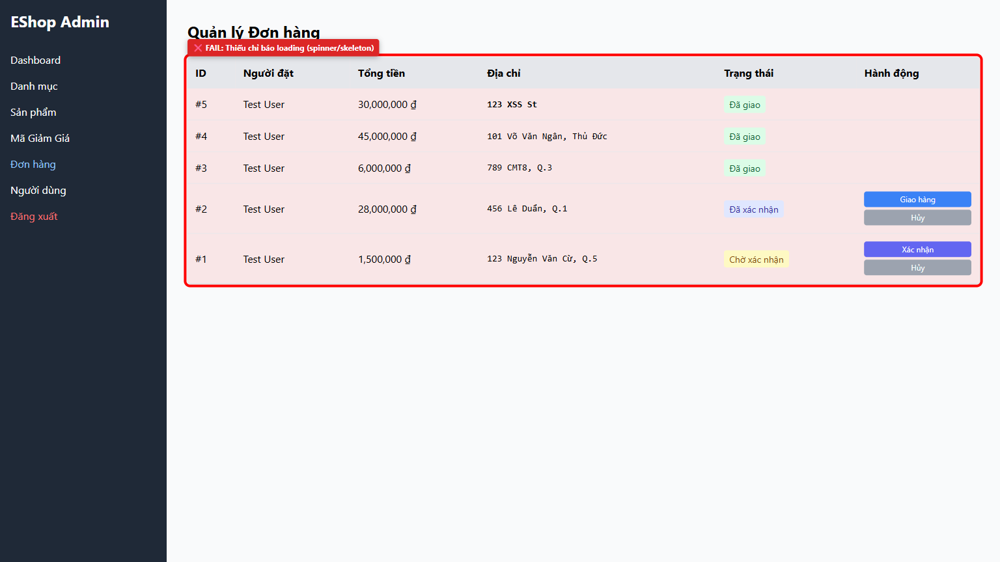
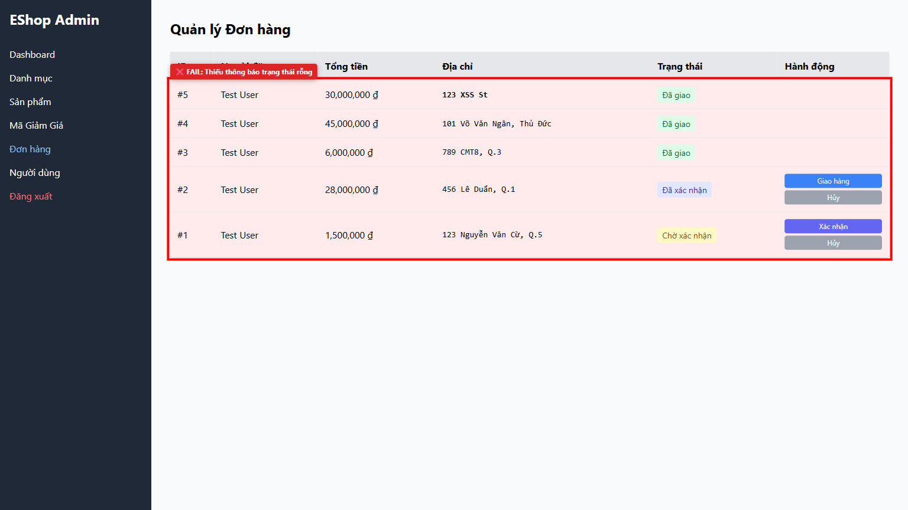

# [BUG][Admin Orders] Missing asynchronous loading indicator and empty state message for orders table

## Found by Test Case

- GUI-ORDERS-IA04-01
- GUI-ORDERS-IA04-02

## Requirement liên quan

- FR-24

## Severity / Priority

- **Severity**: Minor
- **Priority**: P2

## Environment

- Browser: Google Chrome (Playwright Chromium)
- OS: Windows 11
- URL: http://localhost:5174 (Tab: Orders)
- Build/Commit: be2f195

## Steps to reproduce

1. Đăng nhập vào Admin Portal tại http://localhost:5174 và mở tab Đơn hàng.
2. Quan sát giao diện trong khi dữ liệu đơn hàng đang được tải từ backend API.
3. Quan sát giao diện khi cơ sở dữ liệu không có đơn hàng nào.

## Expected result

- Trong khi tải dữ liệu, hệ thống hiển thị loading spinner hoặc skeleton table để thông báo cho người dùng.
- Khi không có đơn hàng, hệ thống hiển thị thông báo trạng thái rỗng (ví dụ: "Chưa có đơn hàng nào") thay vì chỉ hiển thị phần tiêu đề của bảng.

## Actual result

- Không hiển thị bất kỳ loading indicator nào trong thời gian chờ phản hồi từ API, khiến bảng xuất hiện đột ngột sau khi tải xong.
- Khi không có dữ liệu, hệ thống chỉ hiển thị phần tiêu đề của bảng (<table>) mà không có thông báo nào cho người dùng.

## Evidence

- Screenshot: 
- Screenshot: 
