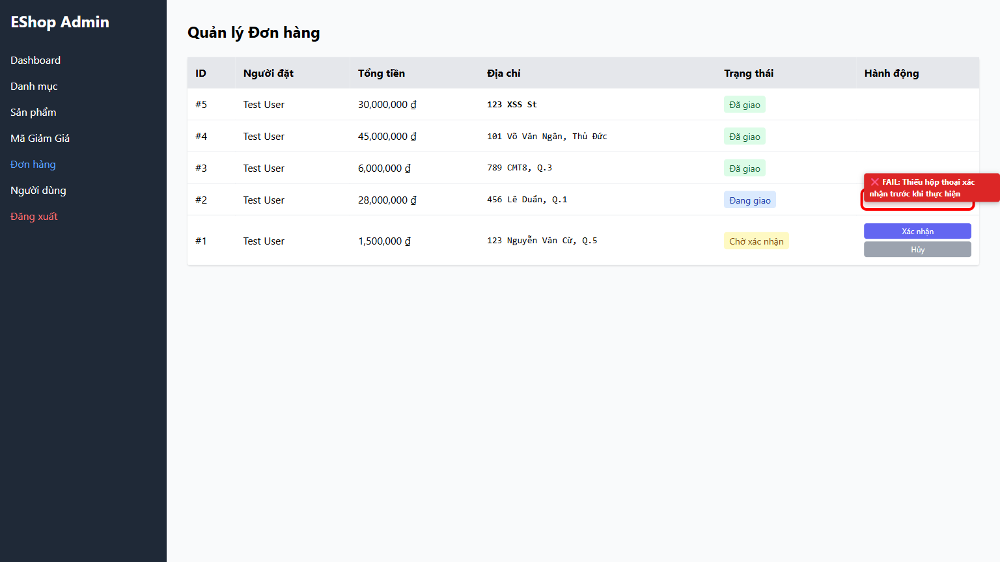
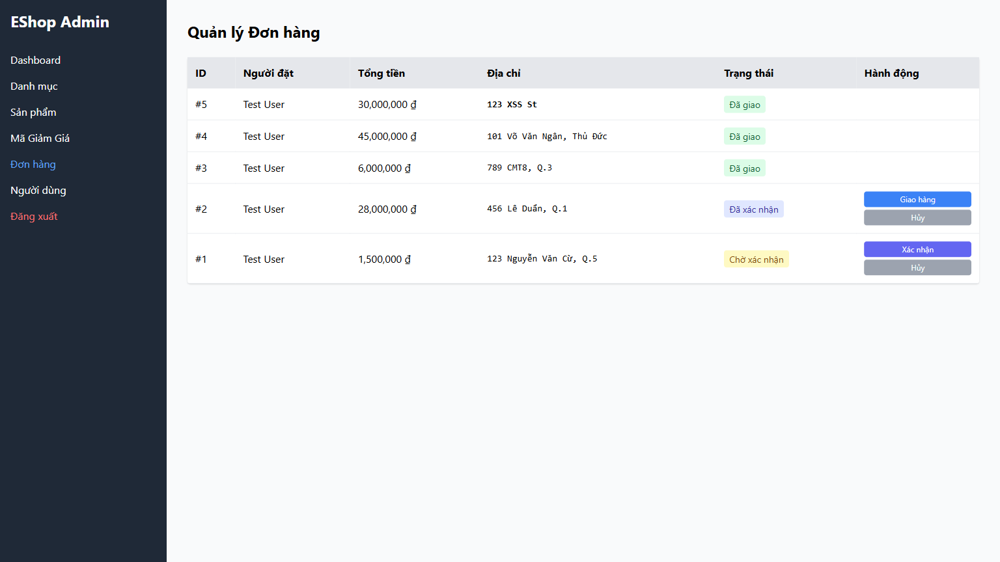

# [BUG][Admin Orders] Order status change missing user confirmation modal and using native window.alert() for error feedback

## Found by Test Case

- GUI-ORDERS-IA04-05
- GUI-ORDERS-IA04-07

## Requirement liên quan

- FR-10, FR-24

## Severity / Priority

- **Severity**: Major
- **Priority**: P1

## Environment

- Browser: Google Chrome (Playwright Chromium)
- OS: Windows 11
- URL: http://localhost:5174 (Tab: Orders)
- Build/Commit: be2f195

## Steps to reproduce

1. Đăng nhập vào Admin Portal tại http://localhost:5174 và mở tab Đơn hàng.
2. Nhấn vào bất kỳ nút thay đổi trạng thái đơn hàng nào (ví dụ: Xác nhận, Hủy, Giao hàng, Hoàn thành).

## Expected result

Hiển thị hộp thoại xác nhận để quản trị viên xác nhận việc thay đổi trạng thái đơn hàng trước khi gửi yêu cầu API.

## Actual result

Khi nhấn nút, hệ thống ngay lập tức gửi yêu cầu API để thay đổi trạng thái đơn hàng mà không hiển thị hộp thoại xác nhận. Ngoài ra, nếu API trả về lỗi, hệ thống sử dụng window.alert() để hiển thị thông báo lỗi.

## Evidence

- Screenshot: 
- Screenshot: 
