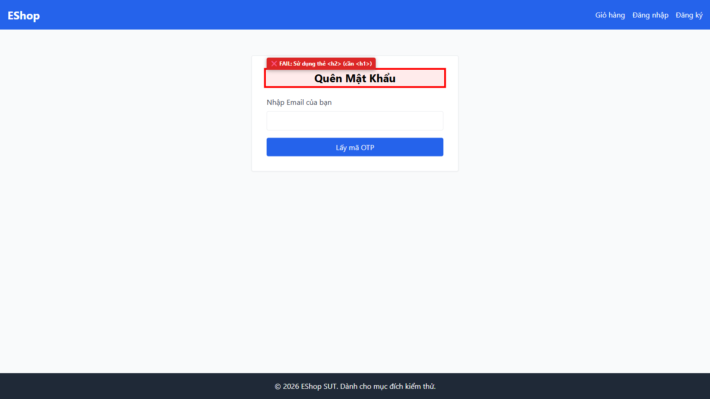

# [BUG][Forgot Password] Thẻ tiêu đề trang dùng h2 thay vì h1

## Found by Test Case

- GUI-FORGOT-IA01-01

## Requirement liên quan

- FR-21

## Severity / Priority

- **Severity**: Minor
- **Priority**: P2

## Environment

- Browser: Google Chrome
- OS: Windows 11
- URL: http://localhost:5173/forgot-password
- Build/Commit: 9b1ecea

## Steps to reproduce

1. Truy cập trang Quên Mật Khẩu tại http://localhost:5173/forgot-password
2. Mở Developer Tools (F12) và kiểm tra thẻ tiêu đề chính của trang

## Expected result

- Trang chỉ chứa duy nhất một thẻ <h1> tiêu đề chính với nội dung "Quên Mật Khẩu"

## Actual result

- Tiêu đề trang "Quên Mật Khẩu" được khai báo bằng thẻ <h2>, DOM không có thẻ <h1> nào

## Evidence

- Screenshot: 
