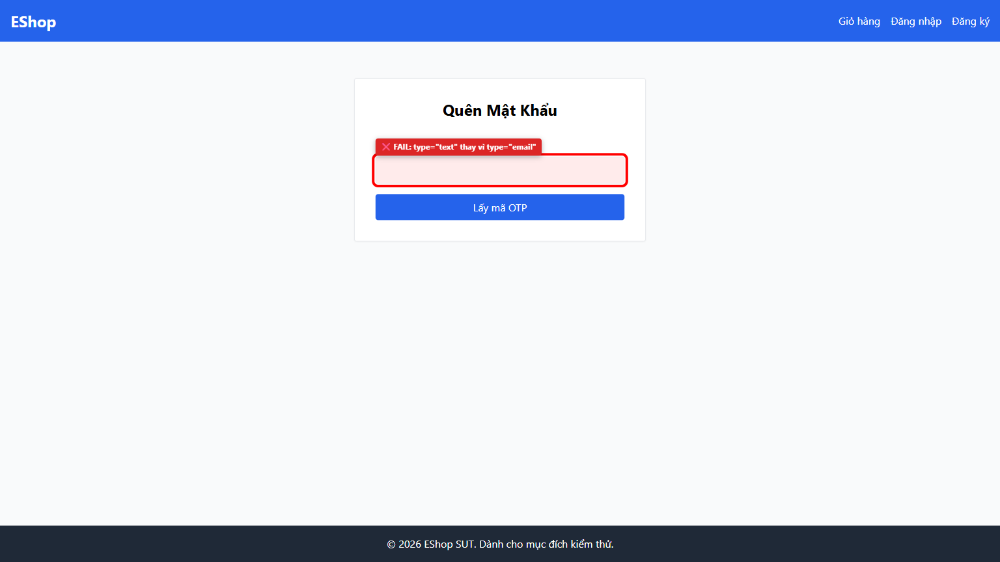

# [BUG][Forgot Password] Trường email dùng type="text" và thiếu dấu hoa thị * chỉ định bắt buộc

## Found by Test Case

- GUI-FORGOT-IA02-01, GUI-FORGOT-IA02-02

## Requirement liên quan

- FR-02, FR-22

## Severity / Priority

- **Severity**: Major
- **Priority**: P1

## Environment

- Browser: Google Chrome
- OS: Windows 11
- URL: http://localhost:5173/forgot-password
- Build/Commit: 9b1ecea

## Steps to reproduce

1. Truy cập trang Quên Mật Khẩu tại http://localhost:5173/forgot-password
2. Quan sát nhãn trường nhập Email và kiểm tra attribute type của ô input

## Expected result

- Nhãn hiển thị dấu hoa thị bắt buộc "*" (ví dụ: "Nhập Email của bạn *") và thẻ input khai báo type="email" để trình duyệt xác thực định dạng HTML5

## Actual result

- Nhãn ghi "Nhập Email của bạn" thiếu dấu "*" và thẻ input sử dụng type="text"

## Evidence

- Screenshot: 
