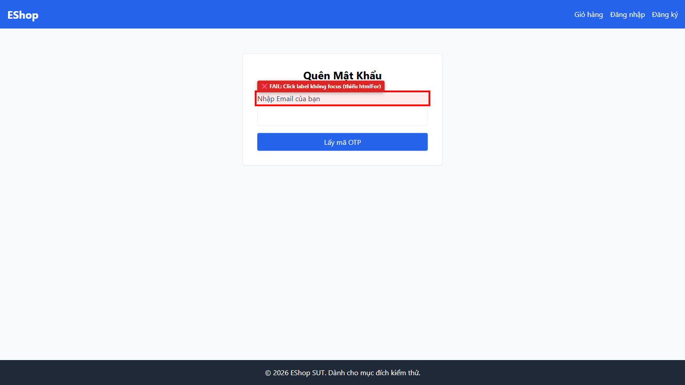

# [BUG][Forgot Password] Nhấp nhãn văn bản label không focus ô nhập email

## Found by Test Case

- GUI-FORGOT-IA02-09

## Requirement liên quan

- FR-22

## Severity / Priority

- **Severity**: Minor
- **Priority**: P3

## Environment

- Browser: Google Chrome
- OS: Windows 11
- URL: http://localhost:5173/forgot-password
- Build/Commit: 9b1ecea

## Steps to reproduce

1. Truy cập trang Quên Mật Khẩu tại http://localhost:5173/forgot-password
2. Dùng con trỏ chuột nhấp trực tiếp vào dòng chữ nhãn "Nhập Email của bạn"

## Expected result

- Con trỏ bàn phím (focus) tự động di chuyển vào ô nhập email

## Actual result

- Nhấp vào nhãn không có phản hồi, ô nhập email không được focus do thẻ <label> thiếu thuộc tính htmlFor

## Evidence

- Screenshot: 
