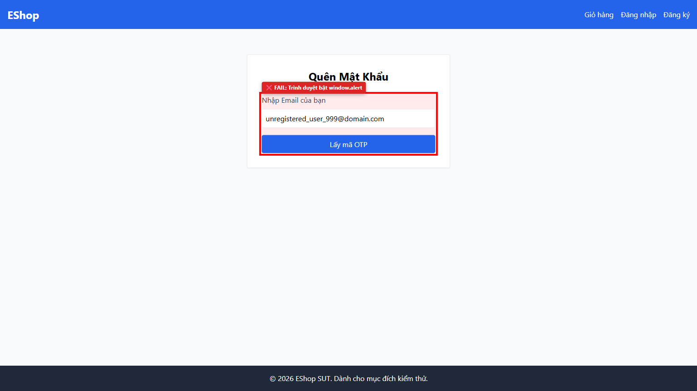

# [BUG][Forgot Password] Hệ thống báo lỗi qua window.alert thay vì thông báo UI

## Found by Test Case

- GUI-FORGOT-IA02-07, GUI-FORGOT-IA04-04

## Requirement liên quan

- FR-22, FR-24

## Severity / Priority

- **Severity**: Major
- **Priority**: P1

## Environment

- Browser: Google Chrome
- OS: Windows 11
- URL: http://localhost:5173/forgot-password
- Build/Commit: 9b1ecea

## Steps to reproduce

1. Truy cập trang Quên Mật Khẩu
2. Nhập email chưa đăng ký "unknown@domain.com" và nhấn nút submit

## Expected result

- Thông báo lỗi hiển thị rõ ràng bằng banner/text màu đỏ trên giao diện form phía trên nút submit

## Actual result

- Trình duyệt bật hộp thoại popup window.alert("Lỗi: User not found") làm gián đoạn trải nghiệm người dùng

## Evidence

- Screenshot: 
