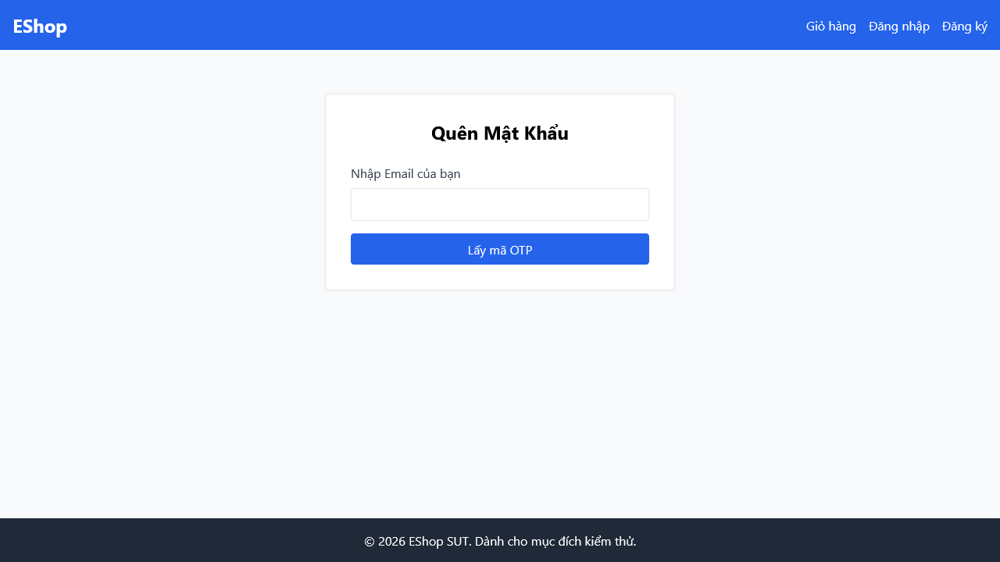

# [BUG][Quên Mật Khẩu] Thiếu Step Indicator (Bước 1 / 2) và liên kết "Quay lại đăng nhập" trên giao diện

## Found by Test Case

- F03-TC-017

## Requirement liên quan

- FR-03

## Severity / Priority

- **Severity**: Minor
- **Priority**: P2

## Environment

- Browser: Google Chrome
- OS: Windows 11
- URL: http://localhost:5173/forgot-password
- Build/Commit: 3aa95b1

## Steps to reproduce

1. Truy cập trang Quên mật khẩu tại địa chỉ http://localhost:5173/forgot-password.
2. Kiểm tra phần phía trên form và bên dưới form.

## Expected result

- Giao diện phải hiển thị chỉ báo bước thực hiện: "Bước 1 / 2" và một liên kết "Quay lại đăng nhập" để cho phép người dùng điều hướng quay lại trang đăng nhập.

## Actual result

- Giao diện hoàn toàn thiếu chỉ báo bước thực hiện và không có liên kết điều hướng quay lại trang đăng nhập, vi phạm đặc tả tiêu chuẩn thiết kế giao diện UX/UI của phân hệ.

## Evidence

- Screenshot: 
