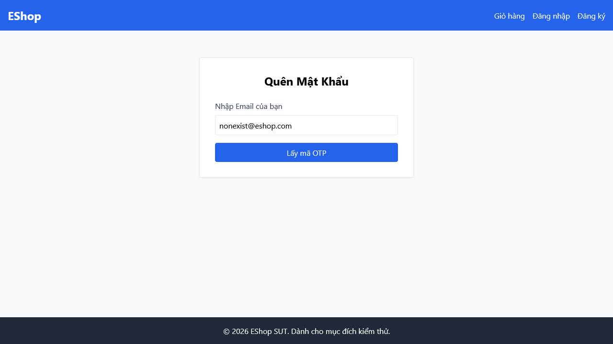

# [BUG][Quên Mật Khẩu] Thiếu ký tự bắt buộc (*) tại nhãn Email trên giao diện

## Found by Test Case

- F03-TC-018

## Requirement liên quan

- FR-03

## Severity / Priority

- **Severity**: Minor
- **Priority**: P2

## Environment

- Browser: Google Chrome
- OS: Windows 11
- URL: http://localhost:5173/forgot-password
- Build/Commit: 3aa95b1

## Steps to reproduce

1. Truy cập trang Quên mật khẩu tại địa chỉ http://localhost:5173/forgot-password.
2. Kiểm tra nhãn (label) của trường nhập Email.

## Expected result

- Nhãn của các trường nhập liệu bắt buộc (như Email) phải hiển thị ký tự dấu sao đỏ `*` để chỉ báo đây là thông tin bắt buộc phải nhập.

## Actual result

- Nhãn trường email chỉ hiển thị "Nhập Email của bạn" và hoàn toàn thiếu ký tự dấu sao `*` chỉ báo bắt buộc.

## Evidence

- Screenshot: 
