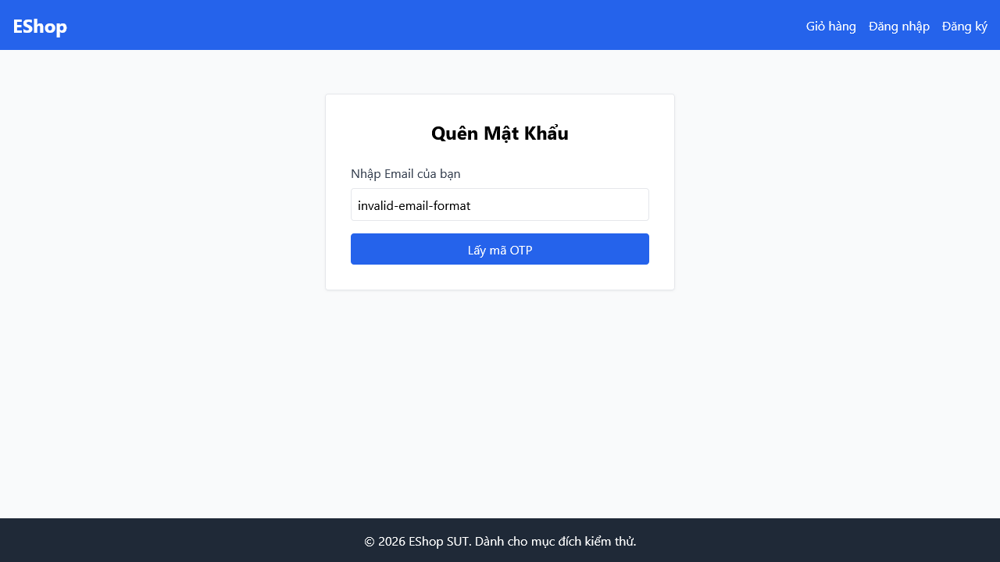

# [BUG][Quên Mật Khẩu] Thiếu khu vực hiển thị thông báo lỗi inline phía trên nút bấm (SUT dùng Alert)

## Found by Test Case

- F03-TC-019

## Requirement liên quan

- FR-03

## Severity / Priority

- **Severity**: Minor
- **Priority**: P2

## Environment

- Browser: Google Chrome
- OS: Windows 11
- URL: http://localhost:5173/forgot-password
- Build/Commit: 3aa95b1

## Steps to reproduce

1. Truy cập trang Quên mật khẩu tại địa chỉ http://localhost:5173/forgot-password.
2. Nhập một email chưa đăng ký (ví dụ: `nonexist@eshop.com`) và nhấn "Lấy mã OTP".
3. Quan sát cách hiển thị thông báo lỗi trên giao diện.

## Expected result

- Hệ thống hiển thị thông điệp lỗi inline (như phần tử `.error-message`) nằm ở vị trí trực quan phía trên nút submit để giữ tính chuyên nghiệp của giao diện web.

## Actual result

- Hệ thống hoàn toàn không có phần tử hiển thị lỗi inline mà hiển thị lỗi thông qua hộp thoại cảnh báo mặc định của trình duyệt (`alert("Lỗi: " + ...)`), gây trải nghiệm kém và phá vỡ cấu trúc giao diện.

## Evidence

- Screenshot: 
