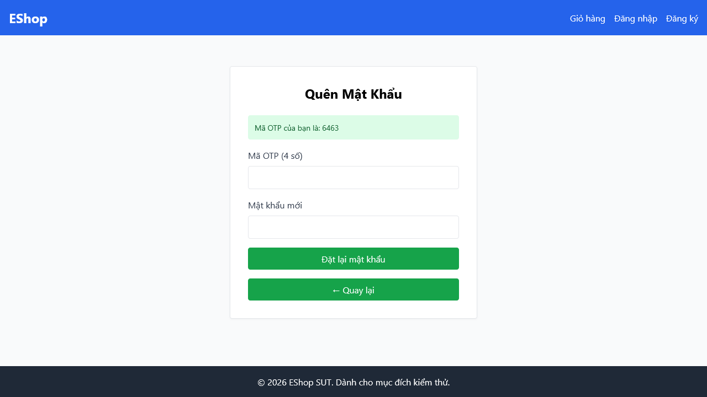

# [BUG][Quên Mật Khẩu] Không vô hiệu hóa nút submit khi đang xử lý yêu cầu (Double Submit Prevention)

## Found by Test Case

- F03-TC-021

## Requirement liên quan

- FR-03

## Severity / Priority

- **Severity**: Minor
- **Priority**: P2

## Environment

- Browser: Google Chrome
- OS: Windows 11
- URL: http://localhost:5173/forgot-password
- Build/Commit: 3aa95b1

## Steps to reproduce

1. Truy cập trang Quên mật khẩu tại địa chỉ http://localhost:5173/forgot-password.
2. Nhập một email hợp lệ.
3. Nhấp nút "Lấy mã OTP" và quan sát thuộc tính trạng thái hoạt động của nút trong khi trình duyệt đang gửi yêu cầu và đợi phản hồi.

## Expected result

- Nút submit phải được chuyển sang trạng thái vô hiệu hóa (disabled) ngay khi click để ngăn chặn người dùng bấm nhiều lần (Double Submit), gửi liên tiếp nhiều request lên server.

## Actual result

- Nút submit vẫn được giữ ở trạng thái kích hoạt (enabled) hoạt động bình thường, cho phép người dùng click liên tiếp nhiều lần gây quá tải và rác dữ liệu ở backend.

## Evidence

- Screenshot: 
