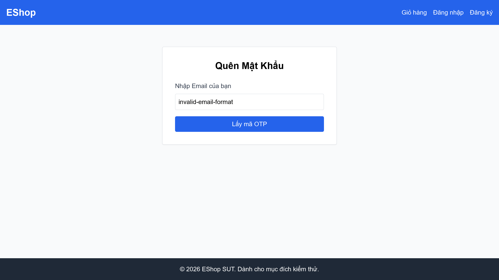

# [BUG][Quên Mật Khẩu] Ô nhập mật khẩu trên trang đăng nhập sử dụng type="text" làm lộ thông tin (Security Bug)

## Found by Test Case

- F03-TC-001 (luồng xác minh đăng nhập sau đổi mật khẩu)

## Requirement liên quan

- FR-02 (và luồng xác minh đăng nhập của FR-03)

## Severity / Priority

- **Severity**: Critical
- **Priority**: P0

## Environment

- Browser: Google Chrome
- OS: Windows 11
- URL: http://localhost:5173/login
- Build/Commit: 3aa95b1

## Steps to reproduce

1. Truy cập trang đăng nhập tại địa chỉ http://localhost:5173/login.
2. Nhập một giá trị bất kỳ vào ô nhập liệu "Mật khẩu".
3. Mở Developer Tools kiểm tra thuộc tính thẻ input mật khẩu.

## Expected result

- Trường nhập mật khẩu phải có thuộc tính `type="password"` để ẩn các ký tự nhập vào dưới dạng dấu chấm hoặc dấu hoa thị, bảo vệ tính riêng tư của người dùng.

## Actual result

- Ô nhập mật khẩu sử dụng `type="text"`, khiến cho mật khẩu của người dùng hiển thị hoàn toàn dưới dạng văn bản thô (plaintext) trên màn hình khi gõ, tạo ra lỗ hổng bảo mật nghiêm trọng.

## Evidence

- Screenshot: 
