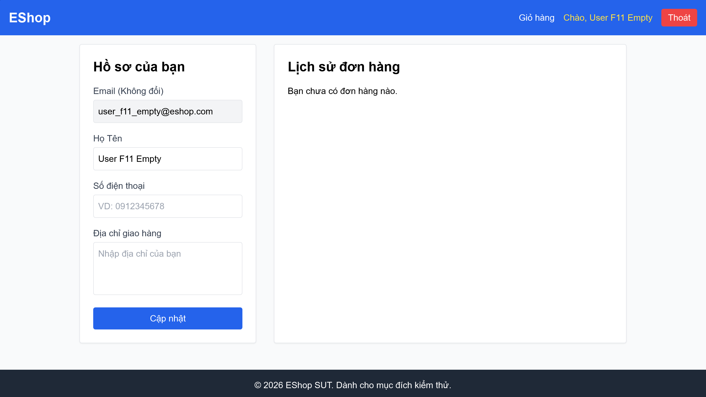

# [BUG][Lịch Sử Đơn Hàng] Cho phép người dùng hủy đơn hàng đang ở trạng thái "shipping" (Đang giao)

## Found by Test Case

- F11-TC-013

## Requirement liên quan

- FR-11

## Severity / Priority

- **Severity**: Critical
- **Priority**: P0

## Environment

- Browser: Google Chrome
- OS: Windows 11
- URL: http://localhost:5173/profile
- Build/Commit: 3aa95b1

## Steps to reproduce

1. Đăng nhập bằng tài khoản có đơn hàng đang ở trạng thái "Đang giao" (`shipping`) (ví dụ: `user_f11_main@eshop.com`).
2. Truy cập trang cá nhân `/profile` và cuộn xuống mục Lịch sử đơn hàng.
3. Tìm đến đơn hàng có trạng thái "Đang giao" và kiểm tra xem nút "Hủy đơn" có hiển thị hay không.
4. Nhấn nút "Hủy đơn" và kiểm tra hành vi của hệ thống.

## Expected result

- Đối với các đơn hàng ở trạng thái "Đang giao" (shipping) hoặc "Đã giao" (delivered), nút "Hủy đơn" phải bị ẩn hoặc vô hiệu hóa. Người dùng chỉ được phép hủy đơn ở trạng thái "Chờ xác nhận" (pending) hoặc "Đã xác nhận" (confirmed).

## Actual result

- Nút "Hủy đơn" vẫn hiển thị hoạt động bình thường trên đơn hàng có trạng thái "Đang giao". Khi nhấn, hệ thống gửi yêu cầu PUT tới `/api/orders/:id/cancel`, thông báo "Hủy đơn thành công!" và cập nhật trạng thái đơn hàng sang "Đã hủy" (canceled), vi phạm logic quy trình xử lý đơn hàng.

## Evidence

- Screenshot: 
