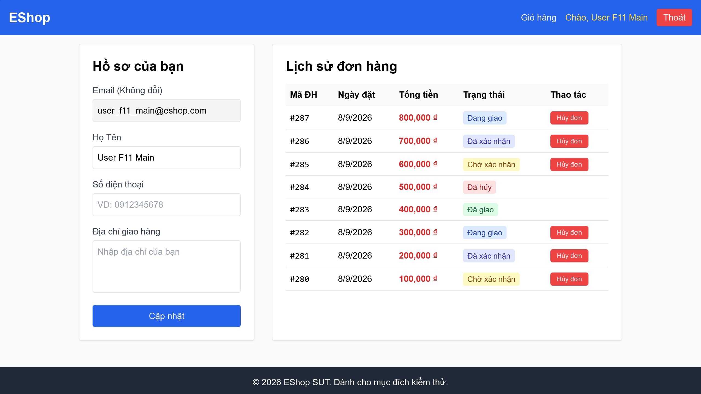

# [BUG][Lịch Sử Đơn Hàng] Không có kiểu dáng làm nổi bật trang hiện tại trên thanh điều hướng

## Found by Test Case

- F11-TC-017

## Requirement liên quan

- FR-11

## Severity / Priority

- **Severity**: Minor
- **Priority**: P2

## Environment

- Browser: Google Chrome
- OS: Windows 11
- URL: http://localhost:5173/profile
- Build/Commit: 3aa95b1

## Steps to reproduce

1. Đăng nhập và truy cập trang cá nhân `/profile`.
2. Kiểm tra trực quan liên kết menu hiện tại (Chào, <Tên>) trên thanh điều hướng phía trên.

## Expected result

- Khi người dùng đang ở một trang cụ thể, liên kết đại diện trên thanh menu điều hướng phải được thêm lớp CSS hoạt động (ví dụ: `.active`, `.highlight`, hoặc màu nền làm nổi bật) để giúp khách hàng dễ định vị vị trí của họ trong hệ thống.

## Actual result

- Liên kết trang cá nhân không có bất kỳ hiệu ứng hay lớp CSS đặc biệt nào khác biệt so với các menu khác khi đang hoạt động, gây khó khăn cho việc định hướng trải nghiệm người dùng.

## Evidence

- Screenshot: 
