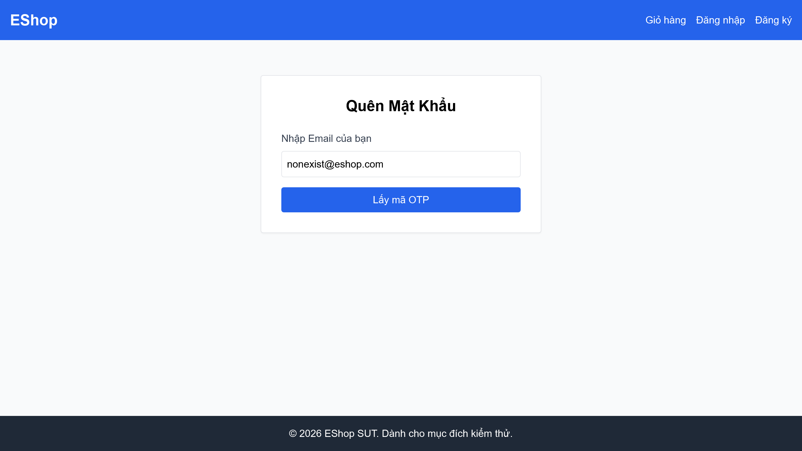

# BÁO CÁO LỖI (BUG REPORT) - PHÂN HỆ FR-03 (QUÊN MẬT KHẨU)

Báo cáo danh sách các lỗi phát hiện qua ma trận kiểm thử cho phân hệ FR-03 (Quên mật khẩu và Đặt lại mật khẩu).

---

# [BUG][Quên Mật Khẩu] Lỗi Regex mật khẩu mạnh bắt buộc chứa khoảng trắng

## Found by Test Case

- F03-TC-011

## Requirement liên quan

- FR-03

## Severity / Priority

- **Severity**: Major
- **Priority**: P1

## Environment

- Browser: Google Chrome
- OS: Windows 11
- URL: http://localhost:5173/forgot-password
- Build/Commit: 3aa95b1

## Steps to reproduce

1. Truy cập trang Quên mật khẩu tại địa chỉ http://localhost:5173/forgot-password.
2. Nhập một email đã đăng ký (ví dụ: `user_f03_11@eshop.com`) và nhấn nút "Lấy mã OTP".
3. Nhập mã OTP hợp lệ hiển thị trên màn hình.
4. Tại ô "Mật khẩu mới", nhập mật khẩu hợp lệ không chứa khoảng trắng (ví dụ: `NewPass123!`).
5. Nhấn nút "Đặt lại mật khẩu".

## Expected result

- Hệ thống chấp nhận mật khẩu, cập nhật cơ sở dữ liệu thành công và chuyển hướng người dùng về trang đăng nhập `/login` với thông báo thành công.

## Actual result

- Hệ thống báo lỗi "Mật khẩu quá yếu! Phải dài tối thiểu 8 ký tự, gồm chữ hoa, chữ thường, số và KÝ TỰ ĐẶC BIỆT.".
- Nguyên nhân: Biểu thức chính quy Regex trong mã nguồn frontend của SUT (`flawedStrongPasswordRegex = /^(?=.*[a-z])(?=.*[A-Z])(?=.*\d)(?=.*\s)[A-Za-z\d\s]{8,}$/`) chứa nhóm bắt buộc khoảng trắng `(?=.*\s)`, buộc người dùng phải thêm dấu cách vào mật khẩu mới được chấp nhận.

## Evidence

- Screenshot: 

---

# [BUG][Quên Mật Khẩu] Thiếu trường nhập "Xác nhận mật khẩu" trên giao diện đặt lại mật khẩu

## Found by Test Case

- F03-TC-012

## Requirement liên quan

- FR-03

## Severity / Priority

- **Severity**: Major
- **Priority**: P1

## Environment

- Browser: Google Chrome
- OS: Windows 11
- URL: http://localhost:5173/forgot-password
- Build/Commit: 3aa95b1

## Steps to reproduce

1. Truy cập trang Quên mật khẩu tại địa chỉ http://localhost:5173/forgot-password.
2. Nhập một email hợp lệ và bấm "Lấy mã OTP" để chuyển sang Bước 2 (Đặt lại mật khẩu).
3. Quan sát các trường nhập liệu xuất hiện trên biểu mẫu (Form).

## Expected result

- Biểu mẫu đặt lại mật khẩu ở Bước 2 phải hiển thị đầy đủ trường nhập "Mật khẩu mới" và trường "Xác nhận mật khẩu" (Confirm Password) để người dùng xác nhận và tránh gõ sai mật khẩu.

## Actual result

- Giao diện Step 2 chỉ hiển thị trường "Mã OTP" và "Mật khẩu mới", hoàn toàn thiếu trường "Xác nhận mật khẩu". Điều này vi phạm nghiêm trọng đặc tả yêu cầu và thiết kế UI/UX tiêu chuẩn.

## Evidence

- Screenshot: 

---

# [BUG][Quên Mật Khẩu] Form quên mật khẩu không chặn email sai định dạng bằng HTML5 validation

## Found by Test Case

- F03-TC-004

## Requirement liên quan

- FR-03

## Severity / Priority

- **Severity**: Minor
- **Priority**: P2

## Environment

- Browser: Google Chrome
- OS: Windows 11
- URL: http://localhost:5173/forgot-password
- Build/Commit: 3aa95b1

## Steps to reproduce

1. Truy cập trang Quên mật khẩu tại địa chỉ http://localhost:5173/forgot-password.
2. Nhập vào trường email một chuỗi sai định dạng (ví dụ: `invalid-email-format`).
3. Nhấn nút "Lấy mã OTP".

## Expected result

- Trình duyệt tự động chặn hành động gửi form và hiển thị thông báo lỗi HTML5 validation (ví dụ: "Please include an '@' in the email address...").

## Actual result

- Form vẫn submit bình thường mà không bị trình duyệt chặn (do ô input email sử dụng thuộc tính `type="text"` thay vì `type="email"`), dẫn đến việc gửi yêu cầu lỗi lên server và trả về thông báo lỗi "User not found" từ API.

## Evidence

- Screenshot: 
