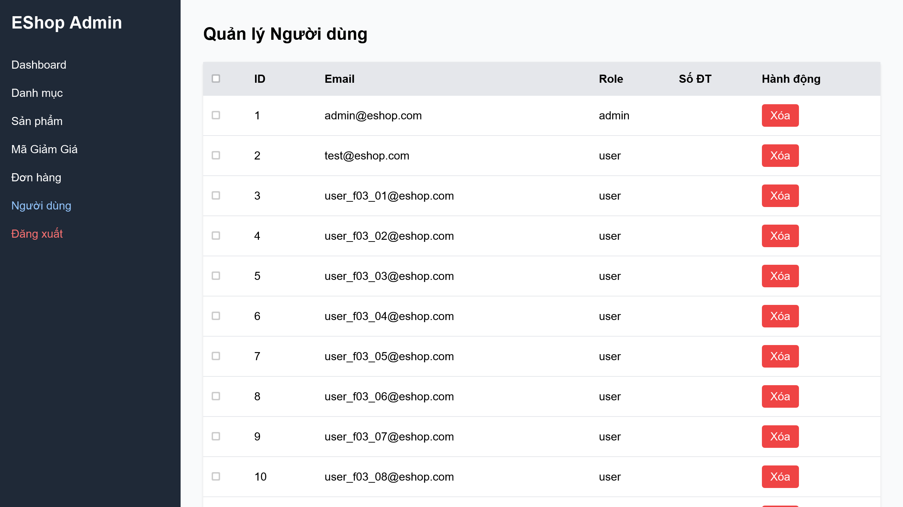

# BÁO CÁO LỖI (BUG REPORT) - PHÂN HỆ FR-19 (QUẢN LÝ NGƯỜI DÙNG ADMIN)

Báo cáo danh sách các lỗi phát hiện qua ma trận kiểm thử cho phân hệ FR-19 (Quản lý người dùng phía Admin).

---

# [BUG][Quản Lý Người Dùng Admin] API danh sách người dùng và API xóa người dùng thiếu phân quyền Admin

## Found by Test Case

- F19-TC-005 & F19-TC-006

## Requirement liên quan

- FR-19

## Severity / Priority

- **Severity**: Critical
- **Priority**: P0

## Environment

- Browser: Google Chrome
- OS: Windows 11
- URL: http://localhost:3000/api/admin/users
- Build/Commit: 3aa95b1

## Steps to reproduce

1. Đăng nhập hệ thống bằng một tài khoản khách hàng thông thường không phải admin (ví dụ: `test@eshop.com`).
2. Trích xuất mã JWT Token từ phản hồi đăng nhập thành công.
3. Sử dụng một công cụ HTTP Client hoặc script API gửi một yêu cầu GET tới API danh sách quản trị: `http://localhost:3000/api/admin/users` kèm theo header `Authorization: Bearer <user_token>`.
4. Gửi yêu cầu DELETE tới API xóa người dùng: `http://localhost:3000/api/admin/users/<user_id>` kèm theo header `Authorization: Bearer <user_token>`.

## Expected result

- Cả hai yêu cầu đều phải bị chặn lại ở phía máy chủ và trả về mã trạng thái lỗi `403 Forbidden` (hoặc `401 Unauthorized`) do tài khoản thực hiện không có vai trò quản trị (role không phải `admin`).

## Actual result

- Máy chủ vẫn xử lý thành công, trả về danh sách toàn bộ người dùng (kèm các thông tin bảo mật) hoặc xóa người dùng thành công với mã trạng thái `200 OK`. 
- Nguyên nhân: Trong file `backend/server.js`, các endpoint `/api/admin/users` chỉ áp dụng middleware `authenticateToken` để kiểm tra token hợp lệ mà hoàn toàn bỏ qua việc xác thực vai trò quản trị (`req.user.role === 'admin'`).

## Evidence

- Screenshot: 

---

# [BUG][Quản Lý Người Dùng Admin] Cho phép tài khoản Admin tự xóa chính mình trên giao diện và API

## Found by Test Case

- F19-TC-011 & F19-TC-012

## Requirement liên quan

- FR-19

## Severity / Priority

- **Severity**: Critical
- **Priority**: P0

## Environment

- Browser: Google Chrome
- OS: Windows 11
- URL: http://localhost:5174/ (Ứng dụng frontend Admin)
- Build/Commit: 3aa95b1

## Steps to reproduce

1. Đăng nhập vào trang quản trị Admin tại `http://localhost:5174/` bằng tài khoản `admin@eshop.com`.
2. Bấm chọn tab "Người dùng" để mở giao diện danh sách người dùng.
3. Tìm đến dòng của chính tài khoản `admin@eshop.com` đang đăng nhập.
4. Bấm vào nút "Xóa" tương ứng hoặc gửi trực tiếp request API HTTP DELETE đến `/api/admin/users/<admin_id>` bằng Token Admin hiện tại.

## Expected result

- Nút "Xóa" của admin đang đăng nhập trên giao diện phải bị ẩn hoặc vô hiệu hóa.
- API backend phải chặn yêu cầu tự xóa chính mình của Admin hiện tại và trả về lỗi `400 Bad Request` hoặc `403 Forbidden`.

## Actual result

- Nút "Xóa" vẫn hiển thị hoạt động bình thường trên giao diện cho tài khoản admin đang đăng nhập.
- Khi bấm nút hoặc gọi API, hệ thống tiến hành xóa thành công tài khoản admin khỏi CSDL và trả về mã `200 OK`, làm sập phiên đăng nhập hiện tại và khóa hoàn toàn quyền quản trị của hệ thống.

## Evidence

- Screenshot: 

---

# [BUG][Quản Lý Người Dùng Admin] Tiêu đề trang quản lý sử dụng sai thẻ h2 thay vì thẻ h1

## Found by Test Case

- F19-TC-014

## Requirement liên quan

- FR-19

## Severity / Priority

- **Severity**: Trivial
- **Priority**: P3

## Environment

- Browser: Google Chrome
- OS: Windows 11
- URL: http://localhost:5174/
- Build/Commit: 3aa95b1

## Steps to reproduce

1. Đăng nhập vào trang quản trị Admin tại `http://localhost:5174/` bằng tài khoản admin.
2. Bấm chọn tab "Người dùng".
3. Mở công cụ Developer Tools của trình duyệt (F12) và kiểm tra (Inspect) mã nguồn HTML của tiêu đề trang chính "Quản lý Người dùng".

## Expected result

- Tiêu đề chính hiển thị nội dung trang phải sử dụng thẻ tiêu đề cao nhất là `<h1>` theo đúng tiêu chuẩn Semantic HTML5 và khả năng tiếp cận (Accessibility).

## Actual result

- Tiêu đề chính của trang sử dụng thẻ `<h2>` (`<h2 className="text-2xl font-bold mb-6">Quản lý Người dùng</h2>`). Trong khi đó, thẻ `<h1>` duy nhất trên trang đang được dùng cho logo thương hiệu ở thanh bên (sidebar).

## Evidence

- Screenshot: 
