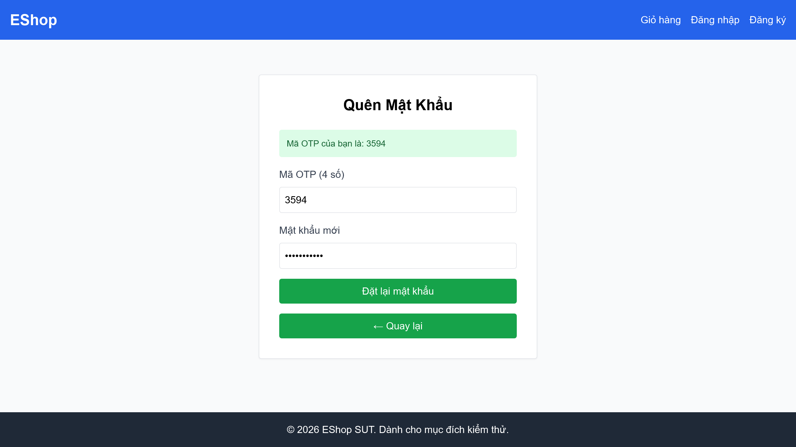
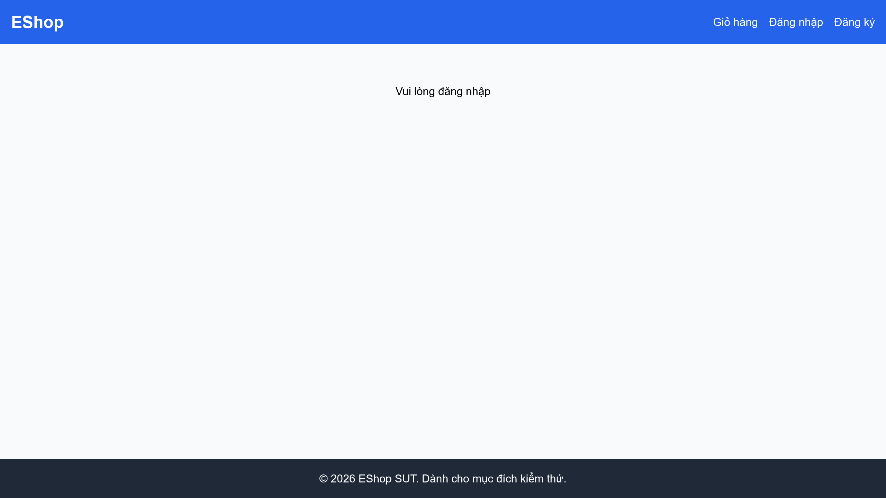
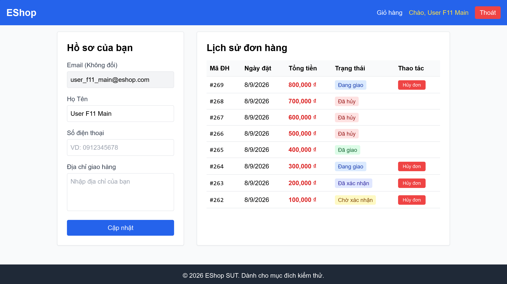

# BÁO CÁO DANH SÁCH LỖI (BUG REPORT) - HỆ THỐNG ESHOP (HW04)

Báo cáo chất lượng phần mềm SUT (System Under Test) EShop qua ma trận kiểm thử tự động hóa 9-cell sử dụng Playwright.

---

# [BUG][Quên Mật Khẩu] Lỗi Regex mật khẩu mạnh bắt buộc chứa khoảng trắng

## Found by Test Case

- F03-TC-011

## Requirement liên quan

- FR-03

## Severity / Priority

- **Severity**: Major
- **Priority**: P1

## Environment

- Browser: Google Chrome
- OS: Windows 11
- URL: http://localhost:5173/forgot-password
- Build/Commit: 3aa95b1

## Steps to reproduce

1. Truy cập trang Quên mật khẩu tại địa chỉ http://localhost:5173/forgot-password.
2. Nhập một email đã đăng ký (ví dụ: `user_f03_11@eshop.com`) và nhấn nút "Lấy mã OTP".
3. Nhập mã OTP hợp lệ hiển thị trên màn hình.
4. Tại ô "Mật khẩu mới", nhập mật khẩu hợp lệ không chứa khoảng trắng (ví dụ: `NewPass123!`).
5. Nhấn nút "Đặt lại mật khẩu".

## Expected result

- Hệ thống chấp nhận mật khẩu, cập nhật cơ sở dữ liệu thành công và chuyển hướng người dùng về trang đăng nhập `/login` với thông báo thành công.

## Actual result

- Hệ thống báo lỗi "Mật khẩu quá yếu! Phải dài tối thiểu 8 ký tự, gồm chữ hoa, chữ thường, số và KÝ TỰ ĐẶC BIỆT.".
- Nguyên nhân: Biểu thức chính quy Regex trong mã nguồn frontend của SUT (`flawedStrongPasswordRegex = /^(?=.*[a-z])(?=.*[A-Z])(?=.*\d)(?=.*\s)[A-Za-z\d\s]{8,}$/`) chứa nhóm bắt buộc khoảng trắng `(?=.*\s)`, buộc người dùng phải thêm dấu cách vào mật khẩu mới được chấp nhận.

## Evidence

- Screenshot: 

---

# [BUG][Quên Mật Khẩu] Thiếu trường nhập "Xác nhận mật khẩu" trên giao diện đặt lại mật khẩu

## Found by Test Case

- F03-TC-012

## Requirement liên quan

- FR-03

## Severity / Priority

- **Severity**: Major
- **Priority**: P1

## Environment

- Browser: Google Chrome
- OS: Windows 11
- URL: http://localhost:5173/forgot-password
- Build/Commit: 3aa95b1

## Steps to reproduce

1. Truy cập trang Quên mật khẩu tại địa chỉ http://localhost:5173/forgot-password.
2. Nhập một email hợp lệ và bấm "Lấy mã OTP" để chuyển sang Bước 2 (Đặt lại mật khẩu).
3. Quan sát các trường nhập liệu xuất hiện trên biểu mẫu (Form).

## Expected result

- Biểu mẫu đặt lại mật khẩu ở Bước 2 phải hiển thị đầy đủ trường nhập "Mật khẩu mới" và trường "Xác nhận mật khẩu" (Confirm Password) để người dùng xác nhận và tránh gõ sai mật khẩu.

## Actual result

- Giao diện Step 2 chỉ hiển thị trường "Mã OTP" và "Mật khẩu mới", hoàn toàn thiếu trường "Xác nhận mật khẩu". Điều này vi phạm nghiêm trọng đặc tả yêu cầu và thiết kế UI/UX tiêu chuẩn.

## Evidence

- Screenshot: 

---

# [BUG][Quên Mật Khẩu] Form quên mật khẩu không chặn email sai định dạng bằng HTML5 validation

## Found by Test Case

- F03-TC-004

## Requirement liên quan

- FR-03

## Severity / Priority

- **Severity**: Minor
- **Priority**: P2

## Environment

- Browser: Google Chrome
- OS: Windows 11
- URL: http://localhost:5173/forgot-password
- Build/Commit: 3aa95b1

## Steps to reproduce

1. Truy cập trang Quên mật khẩu tại địa chỉ http://localhost:5173/forgot-password.
2. Nhập vào trường email một chuỗi sai định dạng (ví dụ: `invalid-email-format`).
3. Nhấn nút "Lấy mã OTP".

## Expected result

- Trình duyệt tự động chặn hành động gửi form và hiển thị thông báo lỗi HTML5 validation (ví dụ: "Please include an '@' in the email address...").

## Actual result

- Form vẫn submit bình thường mà không bị trình duyệt chặn (do ô input email sử dụng thuộc tính `type="text"` thay vì `type="email"`), dẫn đến việc gửi yêu cầu lỗi lên server và trả về thông báo lỗi "User not found" từ API.

## Evidence

- Screenshot: 

---

# [BUG][Lịch Sử Đơn Hàng] Trang lịch sử đơn hàng rỗng không hiển thị hình ảnh minh họa (Empty State)

## Found by Test Case

- F11-TC-010

## Requirement liên quan

- FR-11

## Severity / Priority

- **Severity**: Minor
- **Priority**: P2

## Environment

- Browser: Google Chrome
- OS: Windows 11
- URL: http://localhost:5173/profile
- Build/Commit: 3aa95b1

## Steps to reproduce

1. Đăng nhập bằng một tài khoản chưa có lịch sử mua hàng (ví dụ: `user_f11_empty@eshop.com`).
2. Điều hướng tới trang cá nhân `/profile` và cuộn xuống mục Lịch sử đơn hàng.
3. Quan sát hiển thị của khu vực danh sách đơn hàng.

## Expected result

- Hệ thống hiển thị trạng thái trống (Empty State) bao gồm một thông điệp rõ ràng đi kèm một hình ảnh minh họa hoặc biểu tượng (illustration/icon) trực quan để làm đẹp giao diện.

## Actual result

- Hệ thống chỉ hiển thị một dòng văn bản thuần: "Bạn chưa có đơn hàng nào." mà không có bất kỳ hình ảnh minh họa hay biểu tượng đồ họa nào kèm theo, gây đơn điệu về mặt UX/UI.

## Evidence

- Screenshot: 

---

# [BUG][Lịch Sử Đơn Hàng] Cho phép người dùng hủy đơn hàng đang ở trạng thái "shipping" (Đang giao)

## Found by Test Case

- F11-TC-013

## Requirement liên quan

- FR-11

## Severity / Priority

- **Severity**: Critical
- **Priority**: P0

## Environment

- Browser: Google Chrome
- OS: Windows 11
- URL: http://localhost:5173/profile
- Build/Commit: 3aa95b1

## Steps to reproduce

1. Đăng nhập bằng tài khoản có đơn hàng đang ở trạng thái "Đang giao" (`shipping`) (ví dụ: `user_f11_main@eshop.com`).
2. Truy cập trang cá nhân `/profile` và cuộn xuống mục Lịch sử đơn hàng.
3. Tìm đến đơn hàng có trạng thái "Đang giao" và kiểm tra xem nút "Hủy đơn" có hiển thị hay không.
4. Nhấn nút "Hủy đơn" và kiểm tra hành vi của hệ thống.

## Expected result

- Đối với các đơn hàng ở trạng thái "Đang giao" (shipping) hoặc "Đã giao" (delivered), nút "Hủy đơn" phải bị ẩn hoặc vô hiệu hóa. Người dùng chỉ được phép hủy đơn ở trạng thái "Chờ xác nhận" (pending) hoặc "Đã xác nhận" (confirmed).

## Actual result

- Nút "Hủy đơn" vẫn hiển thị hoạt động bình thường trên đơn hàng có trạng thái "Đang giao". Khi nhấn, hệ thống gửi yêu cầu PUT tới `/api/orders/:id/cancel`, thông báo "Hủy đơn thành công!" và cập nhật trạng thái đơn hàng sang "Đã hủy" (canceled), vi phạm logic quy trình xử lý đơn hàng.

## Evidence

- Screenshot: 

---

# [BUG][Lịch Sử Đơn Hàng] Giao diện hiển thị sai màu hoặc sai nhãn tiếng Việt theo quy định (Nút đăng xuất hiển thị sai)

## Found by Test Case

- F11-TC-018

## Requirement liên quan

- FR-11

## Severity / Priority

- **Severity**: Minor
- **Priority**: P2

## Environment

- Browser: Google Chrome
- OS: Windows 11
- URL: http://localhost:5173/profile
- Build/Commit: 3aa95b1

## Steps to reproduce

1. Đăng nhập vào tài khoản người dùng bình thường.
2. Điều hướng tới trang cá nhân `/profile`.
3. Kiểm tra nhãn và thiết kế của nút đăng xuất trên thanh điều hướng hoặc trang cá nhân.

## Expected result

- Nút đăng xuất phải được hiển thị bằng tiếng Việt chuẩn theo quy định đặc tả là "Đăng xuất".

## Actual result

- Nút đăng xuất hiển thị nhãn là "Thoát" thay vì "Đăng xuất" như quy định của đặc tả giao diện tiếng Việt chuyên nghiệp.

## Evidence

- Screenshot: 

---

# [BUG][Quản Lý Người Dùng Admin] API danh sách người dùng và API xóa người dùng thiếu phân quyền Admin

## Found by Test Case

- F19-TC-005 & F19-TC-006

## Requirement liên quan

- FR-19

## Severity / Priority

- **Severity**: Critical
- **Priority**: P0

## Environment

- Browser: Google Chrome
- OS: Windows 11
- URL: http://localhost:3000/api/admin/users
- Build/Commit: 3aa95b1

## Steps to reproduce

1. Đăng nhập hệ thống bằng một tài khoản khách hàng thông thường không phải admin (ví dụ: `test@eshop.com`).
2. Trích xuất mã JWT Token từ phản hồi đăng nhập thành công.
3. Sử dụng một công cụ HTTP Client hoặc script API gửi một yêu cầu GET tới API danh sách quản trị: `http://localhost:3000/api/admin/users` kèm theo header `Authorization: Bearer <user_token>`.
4. Gửi yêu cầu DELETE tới API xóa người dùng: `http://localhost:3000/api/admin/users/<user_id>` kèm theo header `Authorization: Bearer <user_token>`.

## Expected result

- Cả hai yêu cầu đều phải bị chặn lại ở phía máy chủ và trả về mã trạng thái lỗi `403 Forbidden` (hoặc `401 Unauthorized`) do tài khoản thực hiện không có vai trò quản trị (role không phải `admin`).

## Actual result

- Máy chủ vẫn xử lý thành công, trả về danh sách toàn bộ người dùng (kèm các thông tin bảo mật) hoặc xóa người dùng thành công với mã trạng thái `200 OK`. 
- Nguyên nhân: Trong file `backend/server.js`, các endpoint `/api/admin/users` chỉ áp dụng middleware `authenticateToken` để kiểm tra token hợp lệ mà hoàn toàn bỏ qua việc xác thực vai trò quản trị (`req.user.role === 'admin'`).

## Evidence

- Screenshot: 

---

# [BUG][Quản Lý Người Dùng Admin] Cho phép tài khoản Admin tự xóa chính mình trên giao diện và API

## Found by Test Case

- F19-TC-011 & F19-TC-012

## Requirement liên quan

- FR-19

## Severity / Priority

- **Severity**: Critical
- **Priority**: P0

## Environment

- Browser: Google Chrome
- OS: Windows 11
- URL: http://localhost:5174/ (Ứng dụng frontend Admin)
- Build/Commit: 3aa95b1

## Steps to reproduce

1. Đăng nhập vào trang quản trị Admin tại `http://localhost:5174/` bằng tài khoản `admin@eshop.com`.
2. Bấm chọn tab "Người dùng" để mở giao diện danh sách người dùng.
3. Tìm đến dòng của chính tài khoản `admin@eshop.com` đang đăng nhập.
4. Bấm vào nút "Xóa" tương ứng hoặc gửi trực tiếp request API HTTP DELETE đến `/api/admin/users/<admin_id>` bằng Token Admin hiện tại.

## Expected result

- Nút "Xóa" của admin đang đăng nhập trên giao diện phải bị ẩn hoặc vô hiệu hóa.
- API backend phải chặn yêu cầu tự xóa chính mình của Admin hiện tại và trả về lỗi `400 Bad Request` hoặc `403 Forbidden`.

## Actual result

- Nút "Xóa" vẫn hiển thị hoạt động bình thường trên giao diện cho tài khoản admin đang đăng nhập.
- Khi bấm nút hoặc gọi API, hệ thống tiến hành xóa thành công tài khoản admin khỏi CSDL và trả về mã `200 OK`, làm sập phiên đăng nhập hiện tại và khóa hoàn toàn quyền quản trị của hệ thống.

## Evidence

- Screenshot: 

---

# [BUG][Quản Lý Người Dùng Admin] Tiêu đề trang quản lý sử dụng sai thẻ h2 thay vì thẻ h1

## Found by Test Case

- F19-TC-014

## Requirement liên quan

- FR-19

## Severity / Priority

- **Severity**: Trivial
- **Priority**: P3

## Environment

- Browser: Google Chrome
- OS: Windows 11
- URL: http://localhost:5174/
- Build/Commit: 3aa95b1

## Steps to reproduce

1. Đăng nhập vào trang quản trị Admin tại `http://localhost:5174/` bằng tài khoản admin.
2. Bấm chọn tab "Người dùng".
3. Mở công cụ Developer Tools của trình duyệt (F12) và kiểm tra (Inspect) mã nguồn HTML của tiêu đề trang chính "Quản lý Người dùng".

## Expected result

- Tiêu đề chính hiển thị nội dung trang phải sử dụng thẻ tiêu đề cao nhất là `<h1>` theo đúng tiêu chuẩn Semantic HTML5 và khả năng tiếp cận (Accessibility).

## Actual result

- Tiêu đề chính của trang sử dụng thẻ `<h2>` (`<h2 className="text-2xl font-bold mb-6">Quản lý Người dùng</h2>`). Trong khi đó, thẻ `<h1>` duy nhất trên trang đang được dùng cho logo thương hiệu ở thanh bên (sidebar).

## Evidence

- Screenshot: 
