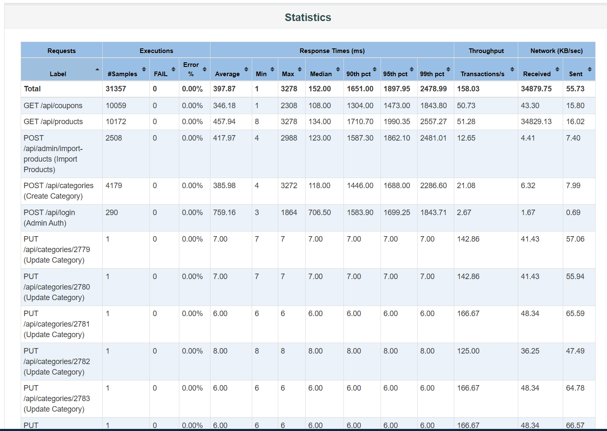

# [BUG-PERF-001][Spike Test] Suy giảm hiệu năng nghiêm trọng (P95 Latency > 1.8s) do tranh chấp Single-Writer Lock của SQLite dưới áp lực tải đột biến 250 VUs

## Found by Test Scenario

- Kịch bản **Spike Testing (Flash Sale Simulation)** — File: [`23127148_Spike_20260815.jmx`](../test-plans/23127148_Spike_20260815.jmx)

## Requirement / Endpoint liên quan

- Toàn bộ nhóm API Transactional CRUD & Admin Operations:
  - `POST /api/categories` (Tạo danh mục mới)
  - `PUT /api/categories/:id` (Cập nhật danh mục)
  - `POST /api/admin/import-products` (Import danh sách sản phẩm)
- Phi chức năng: NFR-01 (Thời gian phản hồi SLA < 500ms dưới tải đột biến)

## Severity / Priority

- **Severity:** Major (Suy giảm trải nghiệm người dùng nghiêm trọng)
- **Priority:** P1 (Cần tối ưu trước khi triển khai các chiến dịch Flash Sale)

## Environment

- **SUT Backend:** Node.js v20.x, Express.js 4.x
- **Database Engine:** SQLite 3 (File-based database: `backend/database.sqlite`)
- **Test Tool:** Apache JMeter 5.6.3 (Non-GUI CLI execution)
- **Hardware Specs:** CPU Intel Core i5-12450HX (8C/12T, 4.4 GHz), 24GB DDR5 RAM, NVMe PCIe 4.0 SSD
- **OS:** Windows 11 Home Single Language (64-bit)

---

## Steps to reproduce

1. Khởi động máy chủ backend: `npm start` tại thư mục `backend/` (cổng 3000).
2. Thiết lập kịch bản Spike Test với Ultimate Thread Group:
   - Tải nền (Baseline): 20 VUs trong 30s.
   - Đột biến tức thời (Spike Surge): Tăng vọt lên **250 Virtual Users** trong 10 giây.
   - Thời gian duy trì đỉnh tải: 30 giây.
   - **Think Time:** 0 giây (mô phỏng người dùng tranh mua vé/sản phẩm flash sale dồn dập).
3. Thực thi kịch bản bằng lệnh CLI non-GUI:
   ```powershell
   jmeter -n -t HW5/test-plans/23127148_Spike_20260815.jmx `
          -l HW5/results/spike/spike_results.jtl `
          -e -o HW5/results/spike/html-report
   ```
4. Quan sát bảng `Statistics` và đồ thị `Response Time Over Time` trong HTML Dashboard Report.

---

## Expected result

- Hệ thống duy trì thời gian phản hồi ở mức chấp nhận được ($P95 < 500\text{ ms}$, $P99 < 1000\text{ ms}$).
- Không xảy ra hiện tượng tắc nghẽn hàng đợi ghi (I/O queuing backlog) kéo dài thời gian xử lý request.

---

## Actual result

- Hệ thống xuất hiện hiện tượng **suy giảm hiệu năng cực kỳ nghiêm trọng (Severe Latency Degradation)**:
  - **P95 Latency tăng vọt:** Từ **`16.00 ms`** (ở Load Test 50 VUs) lên đến **`1,897.95 ms (~1.9 giây)`** — **tăng gấp ~118 lần**, vi phạm nghiêm trọng ngưỡng cam kết SLA 500ms.
  - **P99 Latency:** Chạm mốc **`2,478.99 ms (~2.5 giây)`**.
  - **Max Latency:** Đạt đỉnh **`3,278.00 ms (3.28 giây)`** đối với các request ghi dữ liệu.
  - **Average Response Time:** Tăng từ `7.13 ms` lên `397.87 ms` (tăng gấp 55 lần).

---

## Root cause analysis

1. **Khóa đơn luồng SQLite (Single-Writer Lock):** SQLite là hệ quản trị cơ sở dữ liệu dạng file (file-based). Khi có nhiều transaction ghi đồng thời (`INSERT`, `UPDATE`), SQLite áp dụng cơ chế khóa độc quyền trên toàn bộ database file (`exclusive lock`).
2. **Nghẽn hàng đợi ghi I/O (I/O Write Contention):** Khi 250 Virtual Users với Think Time = 0s liên tục gửi `POST /api/categories`, `PUT /api/categories/:id` và `POST /api/admin/import-products`, hàng trăm tác vụ ghi phải xếp hàng tuần tự chờ giải phóng khóa.
3. Mặc dù CPU chỉ tiêu thụ khoảng 15-20% và không có request nào bị lỗi HTTP (Error Rate = 0.00%), thời gian chờ cấp phát lock đã làm phình to độ trễ đuôi (Tail Latency) của toàn bộ hệ thống.

---

## Proposed Solution / Recommendations

1. **Kích hoạt SQLite WAL Mode (Write-Ahead Logging):** 
   Cấu hình `PRAGMA journal_mode = WAL;` và `PRAGMA synchronous = NORMAL;` trong `backend/database.js` để cho phép các tác vụ đọc (Reader) và ghi (Writer) hoạt động đồng thời mà không chặn lẫn nhau.
2. **Batching Transactions:** Gom các thao tác ghi liên tiếp thành các khối Transaction (`BEGIN TRANSACTION ... COMMIT`) thay vì commit riêng lẻ từng câu lệnh.
3. **Chuyển đổi DBMS cho môi trường Production:** Sử dụng các hệ quản trị cơ sở dữ liệu Client-Server hỗ trợ Multi-Version Concurrency Control (MVCC) như **PostgreSQL** hoặc **MySQL/MariaDB** khi triển khai hệ thống thương mại điện tử thực tế.

---

## Evidence

- **Response Time Over Time:**  
  

- **Statistics Table Report:**  
  
