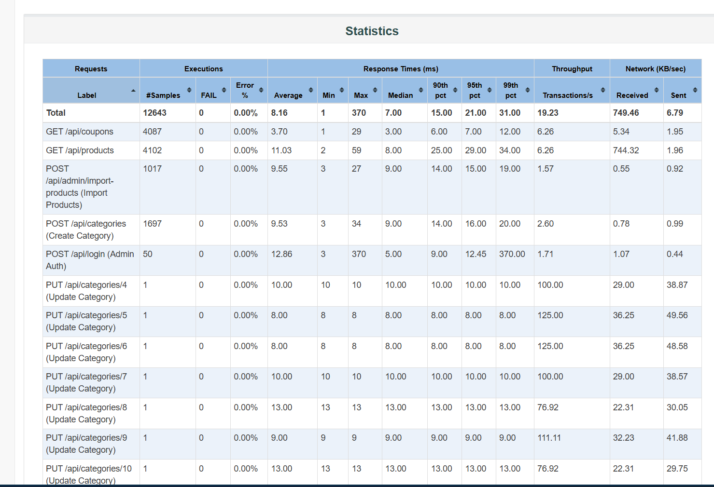

# [BUG-PERF-002][Admin Bulk Import] Nghẽn I/O và tắc nghẽn Event Loop do xử lý Import sản phẩm dạng Synchronous lặp dòng trong Request Context

## Found by Test Scenario

- Kịch bản **Load Testing & Endurance Testing** — Sampler: `POST /api/admin/import-products`

## Requirement / Endpoint liên quan

- Endpoint: `POST /api/admin/import-products` (Import hàng loạt danh sách sản phẩm)
- Phi chức năng: NFR-02 (Tối ưu hóa tài nguyên Event Loop và Disk I/O của Node.js Backend)

## Severity / Priority

- **Severity:** Medium (Ảnh hưởng đến khả năng mở rộng khi lượng dữ liệu lớn)
- **Priority:** P2 (Cần tái cấu trúc kiến trúc import)

## Environment

- **SUT Backend:** Node.js v20.x, Express.js 4.x
- **Database Engine:** SQLite 3 (Package `sqlite3`)
- **Test Tool:** Apache JMeter 5.6.3

---

## Steps to reproduce

1. Chuẩn bị payload JSON chứa mảng nhiều sản phẩm (ví dụ: mảng từ `products.csv` gồm 25 sản phẩm).
2. Gửi request `POST /api/admin/import-products` với Bearer Token của Admin.
3. Dưới áp lực nhiều Virtual Users đồng thời (từ 50 VUs trở lên trong kịch bản Endurance ngâm tải 10 phút với > 12,600 requests).
4. Kiểm tra mã nguồn tại `backend/server.js:199-241` xử lý import.

---

## Expected result

- Tác vụ Import số lượng lớn phải được thực thi trong một Database Transaction duy nhất (`BEGIN TRANSACTION ... COMMIT`), hoặc chuyển xuống Background Queue để trả về phản hồi tức thì (`202 Accepted`) cho client, tránh giữ kết nối HTTP quá lâu.

---

## Actual result

- Trong mã nguồn `backend/server.js`:
  ```javascript
  const stmt = db.prepare("INSERT INTO products (name, price, description, imageUrl, category_id) VALUES (?, ?, ?, ?, ?)");
  rows.forEach((row, index) => {
    stmt.run(row.name, row.price, row.description, row.imageUrl, row.category_id, function (err) { ... });
  });
  stmt.finalize(() => { res.json(...); });
  ```
- **Vấn đề:** 
  1. Mỗi dòng trong `rows.forEach()` thực hiện một lệnh `stmt.run()` riêng lẻ nằm ngoài Transaction. SQLite buộc phải ghi và flush đĩa (Disk Sync) từng record một.
  2. Toàn bộ quá trình diễn ra blocking trên Event Loop của Node.js trong khi client phải chờ đợi toàn bộ mảng insert xong mới nhận được response.

---

## Root cause analysis

1. **Thiếu Database Transaction Wrapping:** Không sử dụng `db.run("BEGIN TRANSACTION")` trước vòng lặp và `db.run("COMMIT")` sau khi hoàn tất.
2. **Kiến trúc xử lý Bulk Import dạng Synchronous:** Đối với các hệ thống thương mại điện tử, việc import hàng nghìn SKU sản phẩm qua giao diện HTTP đồng bộ sẽ gây quá tải thời gian phản hồi (HTTP Timeout) và làm nghẽn Event Loop xử lý các request tra cứu của người dùng thông thường.

---

## Proposed Solution / Recommendations

1. **Gói gọn vòng lặp trong Database Transaction:**
   ```javascript
   db.serialize(() => {
     db.run("BEGIN TRANSACTION");
     const stmt = db.prepare("INSERT INTO products VALUES (?, ?, ?, ?, ?)");
     rows.forEach(r => stmt.run(r.name, r.price, r.description, r.imageUrl, r.category_id));
     stmt.finalize();
     db.run("COMMIT", (err) => {
       if (err) return res.status(500).json({ error: err.message });
       res.json({ message: "Import completed successfully", inserted: rows.length });
     });
   });
   ```
2. **Áp dụng Async Worker Queue:** Đối với file dữ liệu lớn (> 1000 records), chuyển payload vào hàng đợi (Redis + BullMQ) và trả về `Job ID` để client theo dõi tiến độ qua WebSocket / Polling.

---

## Evidence

- **Endurance Statistics Table:**  
  
