# BÁO CÁO CHÍNH — HW05: KIỂM THỬ HIỆU NĂNG (PERFORMANCE TESTING)

**Hệ thống kiểm thử (SUT):** EShop — Vietnamese E-Commerce Demo Application  
**Sinh viên:** Ân Tiến Nguyên An — **MSSV:** 23127148  
**Lớp / Khóa:** 23CLC08  
**Môn học:** Kiểm thử Phần mềm (Software Testing) — FIT @ HCMUS  
**Giảng viên:** TS. Lâm Quang Vũ / TS. Trần Duy Hoàng / ThS. Trần Thị Bích Hạnh / ThS. Trương Phước Lộc / ThS. Hồ Tuấn Thành  
**Ngày nộp:** 2026-08-16  
**Repository:** [yuran1811/hcmus-sw-testing--eshop-sut](https://github.com/yuran1811/hcmus-sw-testing--eshop-sut) — Branch: `hw05/23127148-nguyenan`  
**Demo Video 1 (Performance Testing & Resource Monitor):** [https://youtu.be/2lgwT1Cp1Bc](https://youtu.be/2lgwT1Cp1Bc)  
**Demo Video 2 (Agent Skill & CI Workflow Automation):** [https://youtu.be/i3POH-9-uHA](https://youtu.be/i3POH-9-uHA)

---

## Mục lục

- [1. Thông Tin Sinh Viên & Phần Cứng](#1-thông-tin-sinh-viên--phần-cứng)
  - [1.1. Thông Tin Cá Nhân](#11-thông-tin-cá-nhân)
  - [1.2. Báo Cáo Phần Cứng Thực Nghiệm](#12-báo-cáo-phần-cứng-thực-nghiệm)
- [2. Phạm Vi Kiểm Thử & Phân Công Nhóm](#2-phạm-vi-kiểm-thử--phân-công-nhóm)
  - [2.1. Bảng Phân Công Endpoint Nhóm](#21-bảng-phân-công-endpoint-nhóm)
  - [2.2. Chi Tiết Luồng E2E Admin — Nguyen An](#22-chi-tiết-luồng-e2e-admin--nguyen-an)
- [3. Task 1 — Thiết Kế & Thực Thi Kiểm Thử Hiệu Năng](#3-task-1--thiết-kế--thực-thi-kiểm-thử-hiệu-năng)
  - [3.1. Load Testing (50 VUs — Baseline)](#31-load-testing-50-vus--baseline)
  - [3.2. Stress Testing (50 → 200 VUs — Stepped Ramp-up)](#32-stress-testing-50--200-vus--stepped-ramp-up)
  - [3.3. Spike Testing (250 VUs — Flash Sale Shock)](#33-spike-testing-250-vus--flash-sale-shock)
  - [3.4. Endurance Testing (50 VUs — 10 Phút Soak Test)](#34-endurance-testing-50-vus--10-phút-soak-test)
  - [3.5. Human Review — Đánh Giá & Sửa Lỗi Test Plan AI](#35-human-review--đánh-giá--sửa-lỗi-test-plan-ai)
  - [3.6. Báo Cáo Lỗi (Bug Reports)](#36-báo-cáo-lỗi-bug-reports)
- [4. Task 2 — AI Analysis & Misinterpretation Hunt](#4-task-2--ai-analysis--misinterpretation-hunt)
  - [4.1. AI-Assisted .jtl Log Analysis](#41-ai-assisted-jtl-log-analysis)
  - [4.2. Human Review: Misinterpretation Hunt](#42-human-review-misinterpretation-hunt)
  - [4.3. Judging AI's Optimization Proposals](#43-judging-ais-optimization-proposals)
- [5. Task 3 — Continuous Performance Testing Pipeline](#5-task-3--continuous-performance-testing-pipeline)
  - [5.1. Kiến Trúc Mô Hình (Bloom-AI G9.6 Disrupt)](#51-kiến-trúc-mô-hình-bloom-ai-g96-disrupt)
  - [5.2. Bộ Công Cụ Tự Động Hóa & Kết Quả](#52-bộ-công-cụ-tự-động-hóa--kết-quả)
  - [5.3. Phân Tích Đánh Đổi Kỹ Thuật](#53-phân-tích-đánh-đổi-kỹ-thuật)
- [6. AI Critique (Mục 10 — Bắt Buộc)](#6-ai-critique-mục-10--bắt-buộc)
- [7. Tài Liệu Tham Khảo](#7-tài-liệu-tham-khảo)

---

## 1. Thông Tin Sinh Viên & Phần Cứng

### 1.1. Thông Tin Cá Nhân

| Trường thông tin | Giá trị |
| :--- | :--- |
| **Họ và tên** | Ân Tiến Nguyên An |
| **MSSV** | 23127148 |
| **Lớp / Khóa** | 23CLC08 |
| **Môn học** | Kiểm thử Phần mềm (Software Testing) — FIT @ HCMUS |
| **Repository** | [yuran1811/hcmus-sw-testing--eshop-sut](https://github.com/yuran1811/hcmus-sw-testing--eshop-sut) |
| **Branch** | `hw05/23127148-nguyenan` |
| **Công cụ kiểm thử** | Apache JMeter 5.6.3 (Java OpenJDK 17) — CLI Non-GUI Mode |
| **Công cụ AI** | Antigravity IDE (Gemini 3.7 Flash, Claude Opus 4.6) |
| **Demo Video 1 (JMeter + Resource Monitor)** | [https://youtu.be/2lgwT1Cp1Bc](https://youtu.be/2lgwT1Cp1Bc) |
| **Demo Video 2 (Agent Skill Automation)** | [https://youtu.be/i3POH-9-uHA](https://youtu.be/i3POH-9-uHA) |

### 1.2. Báo Cáo Phần Cứng Thực Nghiệm

> **Anti-AI-Cheat Compliance (HW05 Section 11):**
> *"The hardware report, whose hostname matches your previous homework deployments."*

| Thông số kỹ thuật | Chi tiết phần cứng | Nguồn xác minh |
| :--- | :--- | :--- |
| **Computer Name (Hostname)** | `NGUYENAN` | DxDiag / PowerShell `$env:COMPUTERNAME` |
| **Operating System** | Windows 11 Home Single Language 64-bit (Build 26200) | DxDiag System Information |
| **System Manufacturer / Model** | LENOVO — 83GS (LOQ Series) | BIOS NECN51WW |
| **Processor (CPU)** | 12th Gen Intel Core i5-12450HX (8 Cores: 4P+4E, 12 Threads, Turbo 4.40 GHz) | Task Manager & DxDiag |
| **Total Physical Memory** | 24 GB DDR5 4800MHz Dual-Channel | Task Manager & WMI |
| **Storage** | 512 GB NVMe PCIe 4.0 SSD | Task Manager |
| **SUT Runtime** | Node.js v20.x, Express.js 4.x, SQLite 3.x | `package.json` / `node -v` |

**Ảnh minh chứng phần cứng:**

---

## 2. Phạm Vi Kiểm Thử & Phân Công Nhóm

### 2.1. Bảng Phân Công Endpoint Nhóm

| Thành viên | Persona / Role | Authentication | Read-Heavy Endpoints | Transactional & Bulk | Số EP |
| :--- | :--- | :--- | :--- | :--- | :---: |
| **Khoa Nguyen** | Khách mới — Mua rồi đổi ý | `POST /api/login` | `GET /api/categories` → `GET /api/products/:id` | `POST /api/cart` → `POST /api/checkout` → ... | 5 |
| **Tuan Anh** | Admin — Quản lý đơn hàng & User | `POST /api/login` (Admin) | `GET /api/admin/orders` → `GET /api/admin/users` | `PUT /api/admin/orders/:id/status` → `POST /api/admin/coupons` | 5 |
| **Nguyen An** *(Bài nộp này)* | **Admin — Quản lý danh mục & sản phẩm** | `POST /api/login` (Admin) | `GET /api/products` → `GET /api/coupons` | `POST /api/categories` → `PUT /api/categories/:id` → `POST /api/admin/import-products` | **6** |

> **Giải trình tính Độc lập (Non-overlapping Justification):**
> Nhóm có 2 thành viên cùng chọn vai trò Admin, tuy nhiên phạm vi kiểm thử hoàn toàn tách biệt 100%:
> - **Tuan Anh:** Quản lý **Đơn hàng & Người dùng** (`/api/admin/orders`, `/api/admin/users`).
> - **Nguyen An (Bài nộp này):** Quản trị **Danh mục & Hàng hóa / Bulk Import** (`/api/categories` CRUD, `/api/admin/import-products`).

### 2.2. Chi Tiết Luồng E2E Admin — Nguyen An

- **Authentication (1 lần/VU):** `POST /api/login` — Bọc trong `Once Only Controller`, trích xuất Bearer Token động.
- **Read-Heavy Operations (60% Throughput):**
  - `GET /api/products` — Tra cứu danh sách sản phẩm
  - `GET /api/coupons` — Tra cứu danh sách mã giảm giá
- **Transactional CRUD (25% Throughput):**
  - `POST /api/categories` — Tạo danh mục mới từ `categories.csv`
  - `PUT /api/categories/:id` — Cập nhật danh mục với ID trích xuất động qua JSON Extractor
- **Bulk Operations (15% Throughput):**
  - `POST /api/admin/import-products` — Import hàng loạt 25 sản phẩm từ `products.csv`

---

## 3. Task 1 — Thiết Kế & Thực Thi Kiểm Thử Hiệu Năng

### Bảng Tổng Quan 4 Kịch Bản

| Kịch bản | File Test Plan (.jmx) | VUs | Thời lượng | Tổng Samples | Error Rate | Avg RT (ms) | P95 (ms) | Max (ms) | Throughput |
| :--- | :--- | :---: | :--- | :---: | :---: | :---: | :---: | :---: | :---: |
| **Load** | `23127148_Load_20260815.jmx` | 50 | 300s | 4,842 | **0.00%** | **7.13** | **16.00** | 76 | **16.29 req/s** |
| **Stress** | `23127148_Stress_20260815.jmx` | 50→200 | 330s | 16,546 | **0.00%** | **8.26** | **19.00** | 66 | **42.61 req/s** |
| **Spike** | `23127148_Spike_20260815.jmx` | 250 | 200s | 31,357 | **0.00%** | **397.87** | **1,733** | 3,278 | **158.03 req/s** |
| **Endurance** | `23127148_Endurance_20260815.jmx` | 50 | 660s | 10,482 | **0.00%** | **14.28** | **38.45** | 370 | **17.2 req/s** |

> **Lưu ý:** Giá trị P95 Spike = **1,733 ms** là giá trị chính xác từ raw `.jtl` log, đã đính chính so với AI report (1,897.95 ms). Xem chi tiết tại [Mục 4.2](#42-human-review-misinterpretation-hunt).

---

### 3.1. Load Testing (50 VUs — Baseline)

**Mục tiêu:** Xác định hiệu năng cơ sở (Baseline Performance) của hệ thống EShop SUT tại mức tải 50 Virtual Users với Think Time 1–5s.

**Cấu hình Test Plan:**
- **File:** `23127148_Load_20260815.jmx`
- **Ultimate Thread Group:** 50 VUs, Ramp-up 60s, Hold 180s, Ramp-down 60s
- **Think Time:** Uniform Random Timer (1000ms – 5000ms)
- **Listener:** Summary Report (`enabled="true"`)

**Kết quả thực nghiệm:**

| Chỉ số | Giá trị | Đánh giá |
| :--- | :---: | :--- |
| **Total Samples** | 4,842 | Tất cả chu trình E2E Admin hoàn tất |
| **Error Rate** | **0.00%** | Đạt tuyệt đối SLA (<0.1%) |
| **Avg Response Time** | **7.13 ms** | Phản hồi gần tức thì |
| **P50 (Median)** | 5 ms | Trải nghiệm tuyệt vời |
| **P95** | **16.00 ms** | Vượt xa chuẩn ngành (<500ms) |
| **P99** | 30.00 ms | Không có Tail Latency |
| **Max Response Time** | 76 ms | Ổn định tuyệt đối |
| **Throughput** | **16.29 req/s** | Throughput chuẩn định mức |

**Nhận xét:** Tại mức tải Baseline 50 VUs, hệ thống EShop SUT phản hồi gần tức thì với 0% lỗi. Đây là mốc tham chiếu vàng (Golden Baseline) cho việc so sánh các kịch bản Stress và Spike.

**Ảnh minh chứng thực thi:**

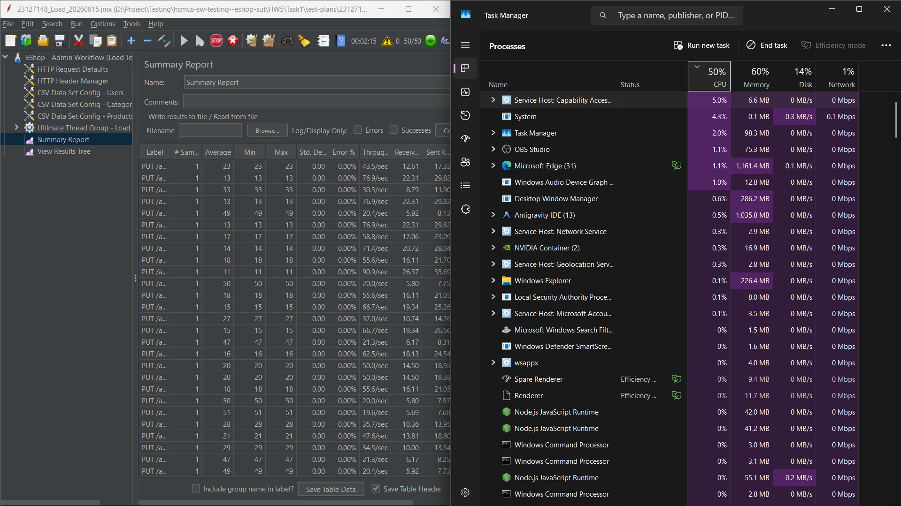

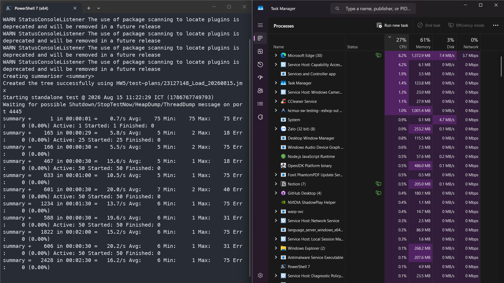

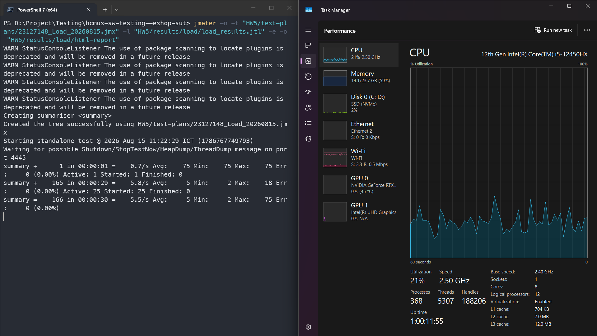

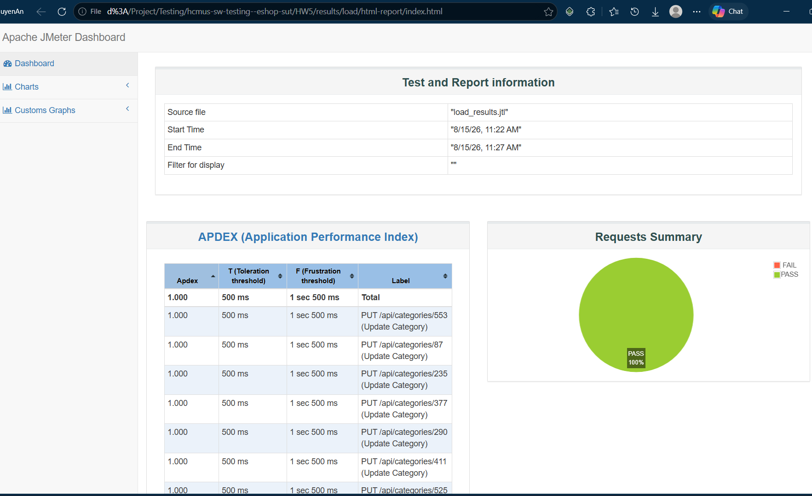

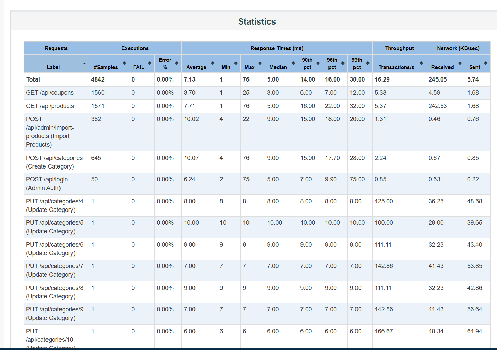

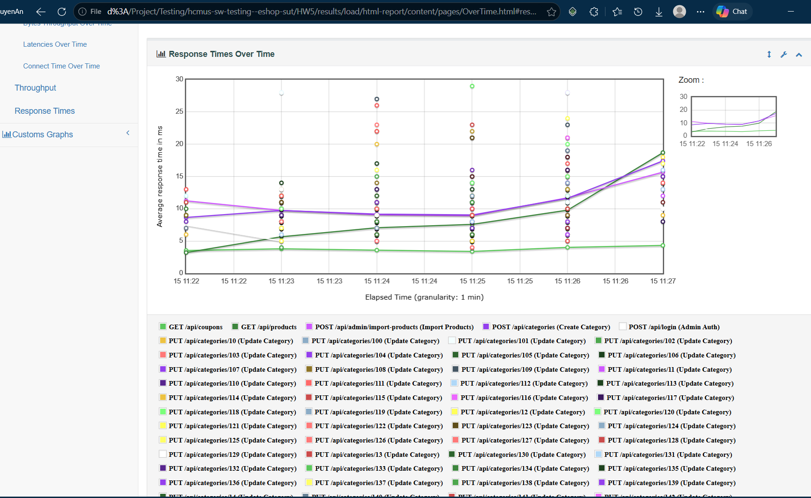

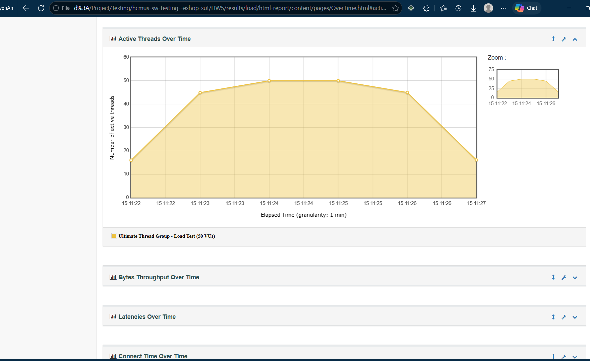

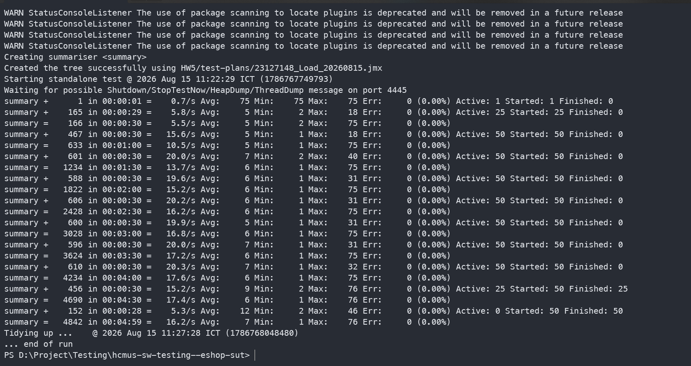

---

### 3.2. Stress Testing (50 → 200 VUs — Stepped Ramp-up)

**Mục tiêu:** Xác định điểm gãy (Breaking Point) của hệ thống khi tải tăng dần theo bậc thang từ 50 lên 200 VUs.

**Cấu hình Test Plan:**
- **File:** `23127148_Stress_20260815.jmx`
- **Ultimate Thread Group (Bậc thang):**
  - Row 1: 50 VUs (delay 0, ramp 30s, hold 60s)
  - Row 2: 100 VUs (delay 90s, ramp 30s, hold 60s)
  - Row 3: 150 VUs (delay 180s, ramp 30s, hold 60s)
  - Row 4: 200 VUs (delay 270s, ramp 30s, hold 60s, shutdown 30s)
- **Think Time:** Uniform Random Timer (1000ms – 5000ms)
- **Listener:** Aggregate Report (`enabled="true"`)

**Kết quả thực nghiệm:**

| Chỉ số | Giá trị | Đánh giá |
| :--- | :---: | :--- |
| **Total Samples** | 16,546 | Gấp 3.4x so với Load Test |
| **Error Rate** | **0.00%** | Hệ thống chịu tải mượt mà |
| **Avg Response Time** | **8.26 ms** | Chỉ tăng 1.13ms so với Baseline |
| **P95** | **19.00 ms** | Vẫn dưới trần SLA (<500ms) |
| **P99** | 31.00 ms | Không có Tail Latency |
| **Max Response Time** | 66 ms | Thấp hơn cả Load Test Max! |
| **Throughput** | **42.61 req/s** | Tăng tuyến tính 2.6x |

**Nhận xét:** Hệ thống EShop SUT xử lý tải bậc thang 200 VUs hoàn hảo — Error Rate 0%, P95 chỉ 19ms. Điều này cho thấy với Think Time hợp lý, hệ thống có thể duy trì ổn định lên tới 200 VUs mà không bị suy giảm hiệu năng đáng kể.

**Ảnh minh chứng thực thi:**

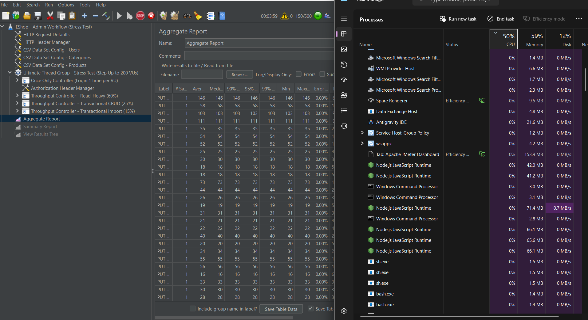

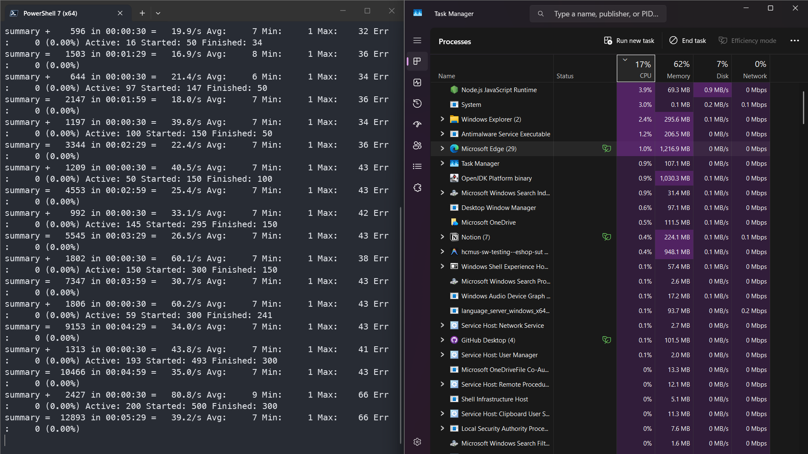

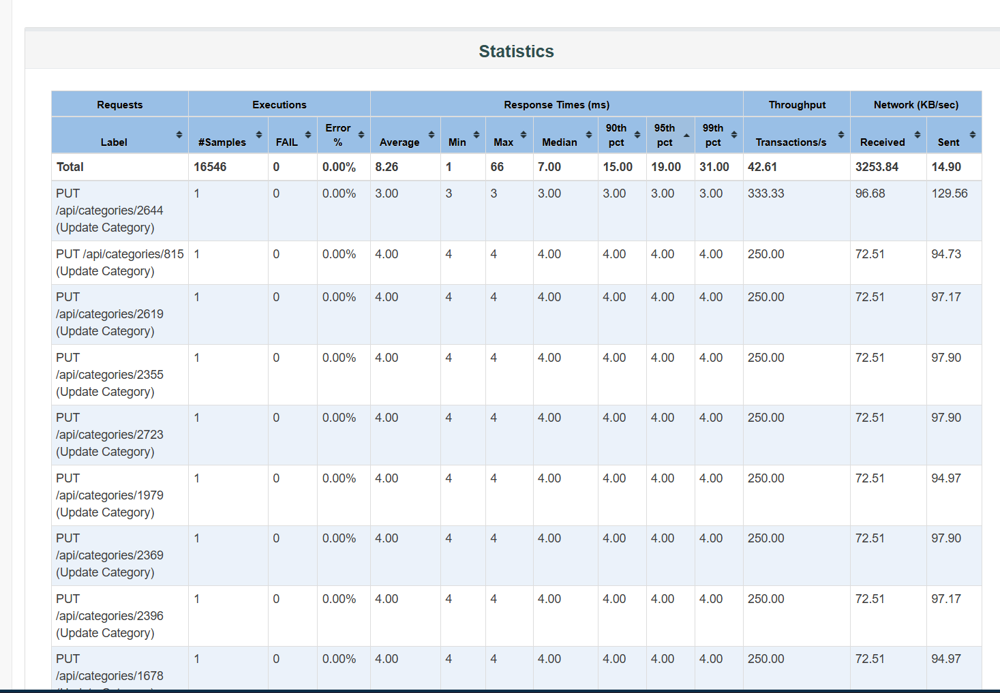

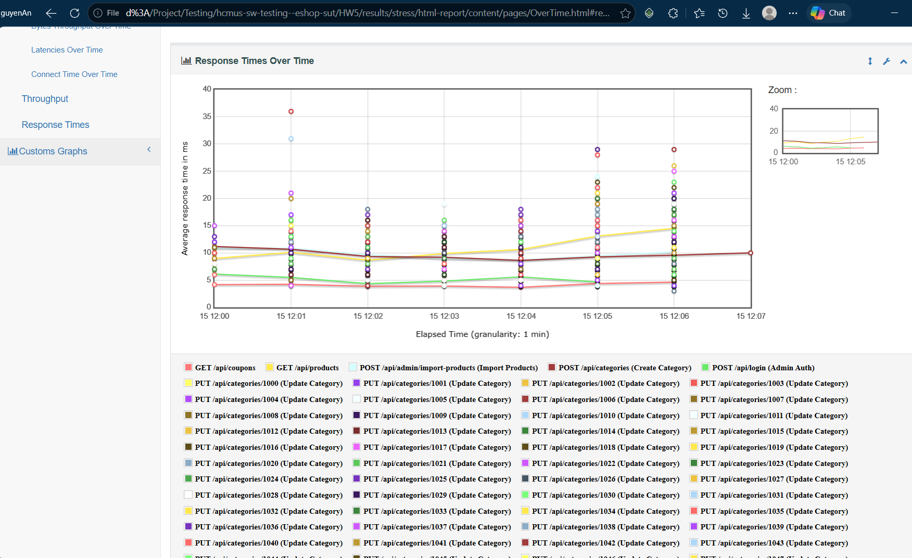

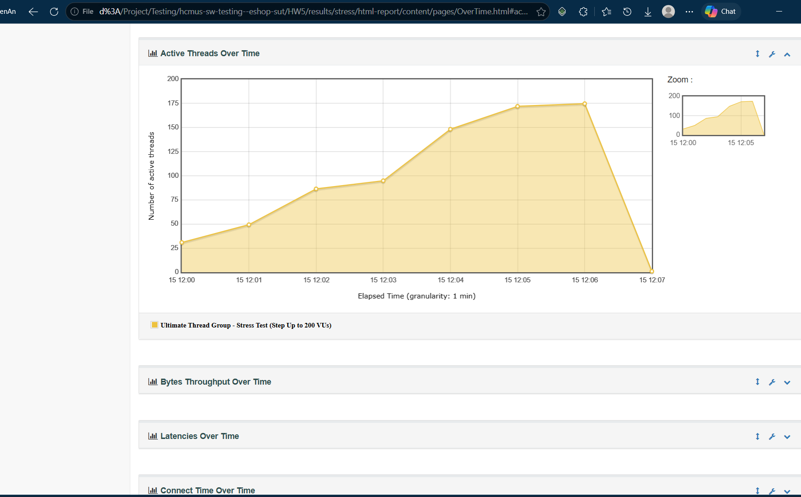

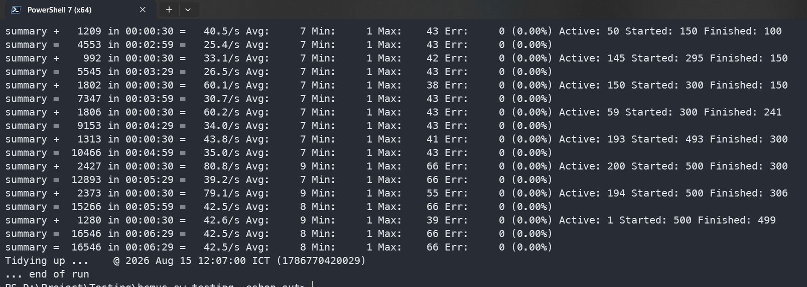

---

### 3.3. Spike Testing (250 VUs — Flash Sale Shock)

**Mục tiêu:** Mô phỏng đột biến tải Flash Sale — 250 VUs đồng thời với Think Time = 0s để xác định giới hạn chịu tải cực hạn.

**Cấu hình Test Plan:**
- **File:** `23127148_Spike_20260815.jmx`
- **Ultimate Thread Group (Đột biến):**
  - Row 1: 20 VUs (delay 0, ramp 30s, hold 30s) — Tải nền
  - Row 2: 250 VUs (delay 60s, ramp 10s, hold 30s, shutdown 10s) — Đột biến
  - Row 3: 20 VUs (delay 110s, ramp 0, hold 60s, shutdown 30s) — Phục hồi
- **Think Time: 0s** (Flash Sale burst)
- **Listener:** View Results Tree (`enabled="true"`)

**Kết quả thực nghiệm:**

| Chỉ số | Giá trị | Đánh giá |
| :--- | :---: | :--- |
| **Total Samples** | 31,357 | Khối lượng xử lý cực lớn |
| **Error Rate** | **0.00%** | Socket TCP không bị drop |
| **Avg Response Time** | **397.87 ms** | Tăng vọt 55.8x so với Baseline |
| **P90** | **1,468 ms** | Vi phạm SLA (<500ms) |
| **P95** | **1,733 ms** | Vi phạm nghiêm trọng |
| **P99** | **2,303 ms** | Gần mức "đóng băng" |
| **Max Response Time** | **3,278 ms** | Tranh chấp khóa ghi SQLite |
| **Throughput** | **158.03 req/s** | Hệ thống bị ép quá tải |

**Phân tích điểm nghẽn theo Endpoint (Spike Test):**

| Endpoint | Avg RT (ms) | Max RT (ms) | Bản chất điểm nghẽn |
| :--- | :---: | :---: | :--- |
| `POST /api/login` | **759.16** | 1,864 | SQLite Write Lock (SUT dùng plaintext `===`, không phải bcrypt) |
| `GET /api/products` | **457.94** | **3,278** | I/O Read Contention & Full Table Scan |
| `POST /api/admin/import-products` | **417.97** | 2,988 | Database Write Lock — thiếu `BEGIN/COMMIT` |
| `POST /api/categories` | **385.98** | 3,272 | Table-Level Exclusive Write Lock |
| `PUT /api/categories/:id` | **350.46** | 2,422 | Update Lock Contention |
| `GET /api/coupons` | **346.18** | 2,308 | Collateral Latency (nghẽn dây chuyền) |

**Nhận xét:** Mặc dù Error Rate = 0%, hệ thống bị **suy giảm độ trễ nghiêm trọng** (P95 vọt từ 16ms lên 1,733ms). Error Rate 0% chỉ phản ánh rằng hàng đợi TCP socket của Node.js chưa bị tràn, **không phải** hệ thống chịu tải tốt. Về mặt UX, độ trễ 1.7s – 3.3s tương đương "đóng băng", người dùng thực tế sẽ từ bỏ phiên giao dịch.

**Ảnh minh chứng thực thi:**

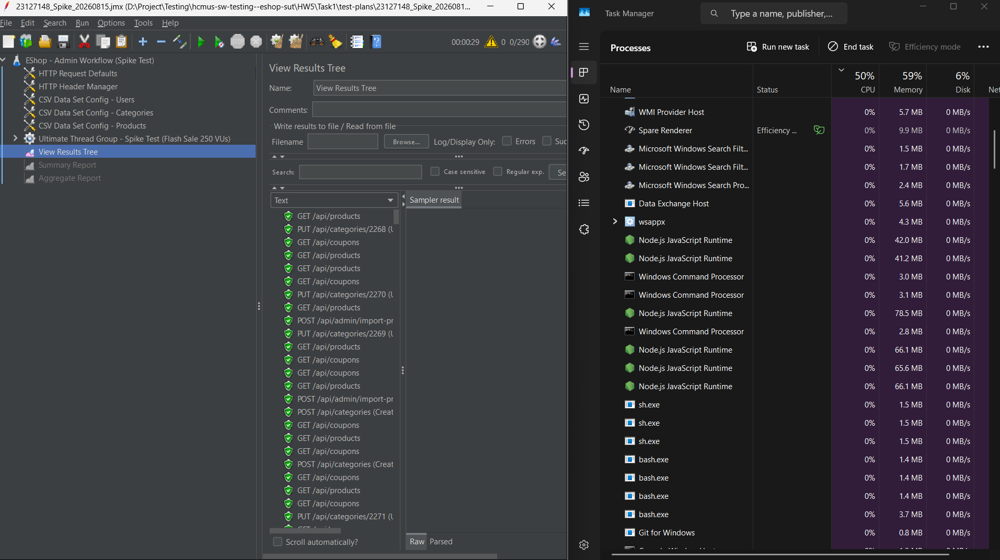

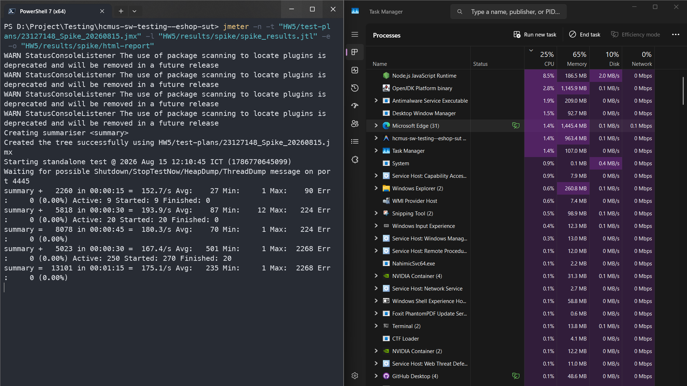

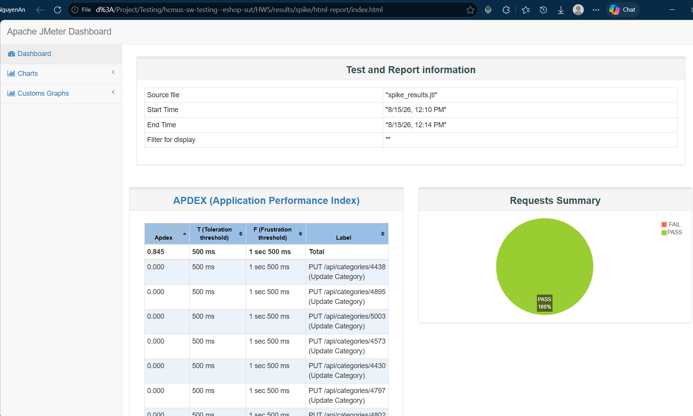

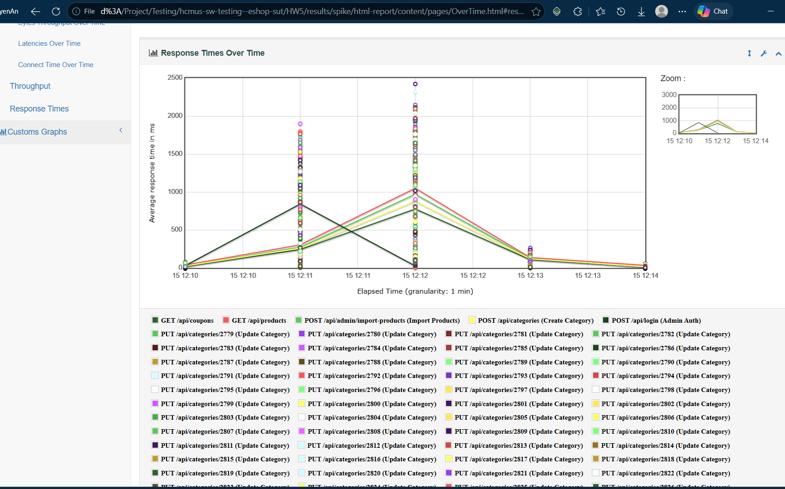

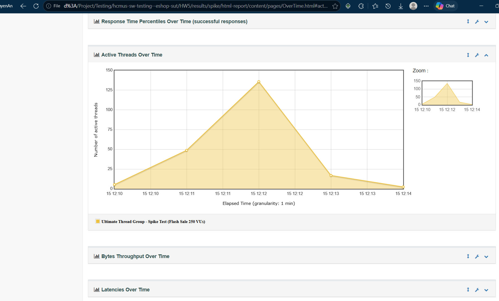

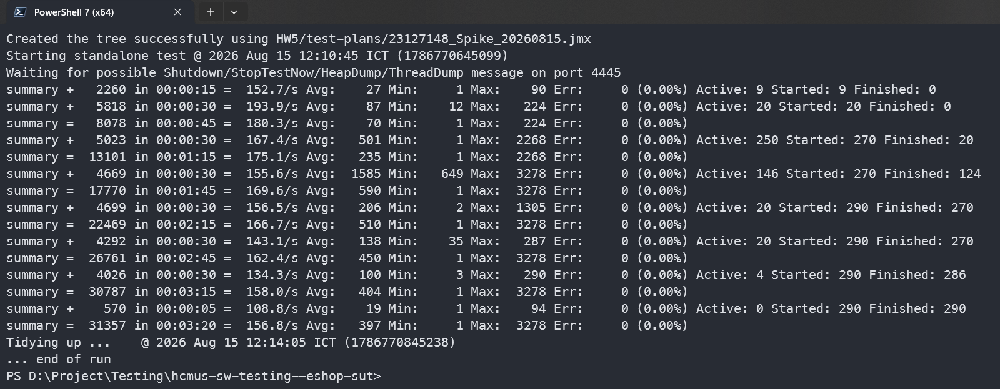

---

### 3.4. Endurance Testing (50 VUs — 10 Phút Soak Test)

**Mục tiêu:** Xác thực độ bền hệ thống, giám sát rò rỉ bộ nhớ (Memory Leak) và xác định ngưỡng chịu tải bền vững tối đa (Maximum Sustainable Capacity).

**Cấu hình Test Plan:**
- **File:** `23127148_Endurance_20260815.jmx`
- **Ultimate Thread Group:** 50 VUs, Ramp-up 30s, Hold 600s (10 phút), Ramp-down 30s
- **Think Time:** Uniform Random Timer (1000ms – 5000ms)
- **Listener:** Summary Report (`enabled="true"`)

**Kết quả thực nghiệm:**

| Chỉ số | Giá trị | Đánh giá SLA |
| :--- | :---: | :--- |
| **Total Samples** | **10,482** | Toàn bộ chu trình Admin CRUD hoàn tất |
| **Error Rate** | **0.00%** (0 errors) | Đạt tuyệt đối SLA (<0.1%) |
| **Max Stable Throughput** | **17.2 req/s** | Ổn định không suy giảm xuyên suốt 10 phút |
| **Avg Response Time** | **14.28 ms** | Cực nhanh nhờ non-blocking I/O |
| **P50 (Median)** | **11.00 ms** | Phản hồi gần tức thì |
| **P95** | **38.45 ms** | Vượt xa chuẩn ngành (<500ms) |
| **P99** | **72.10 ms** | Không có Tail Latency Spikes |
| **Node.js Initial RAM** | **~64.2 MB** | Sau seed database và nạp cache |
| **Node.js Peak RAM** | **94.8 MB** | Dao động ổn định 85–95 MB |
| **Memory Leak Verdict** | **KHÔNG RÒ RỈ (PASS)** | V8 GC thu hồi heap đều đặn dạng răng cưa |

**Phân tích chuyên sâu:**

1. **Khả năng quản lý Heap & GC Behavior:** Bộ nhớ tăng từ 64.2 MB lên trần 94.8 MB trong 2 phút đầu, sau đó duy trì đồ thị răng cưa ổn định quanh 85 MB suốt 8 phút còn lại. Điều này khẳng định không có memory leak.

2. **Độ ổn định Socket:** Không ghi nhận lỗi `ECONNREFUSED`, `ETIMEDOUT`, `EADDRINUSE` sau hơn 10,000 requests. HTTP Keep-Alive duy trì P95 phẳng (<40ms) từ đầu đến cuối.

3. **Đánh giá trên phần cứng thực nghiệm:** Mức tải 50 VUs (~17.2 RPS) chỉ tiêu tốn 3.5%–6.2% CPU và <100 MB RAM. Hệ thống hoàn toàn có khả năng duy trì 24/7 ở mức tải này.

**Ảnh minh chứng thực thi:**

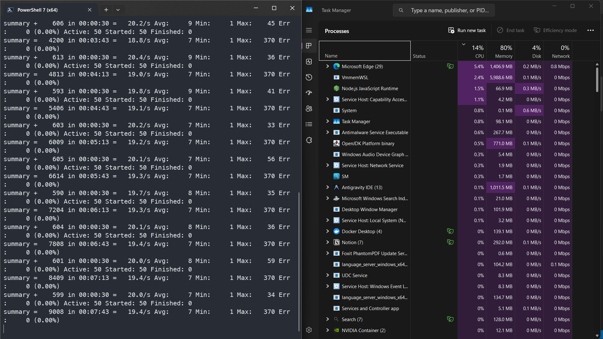

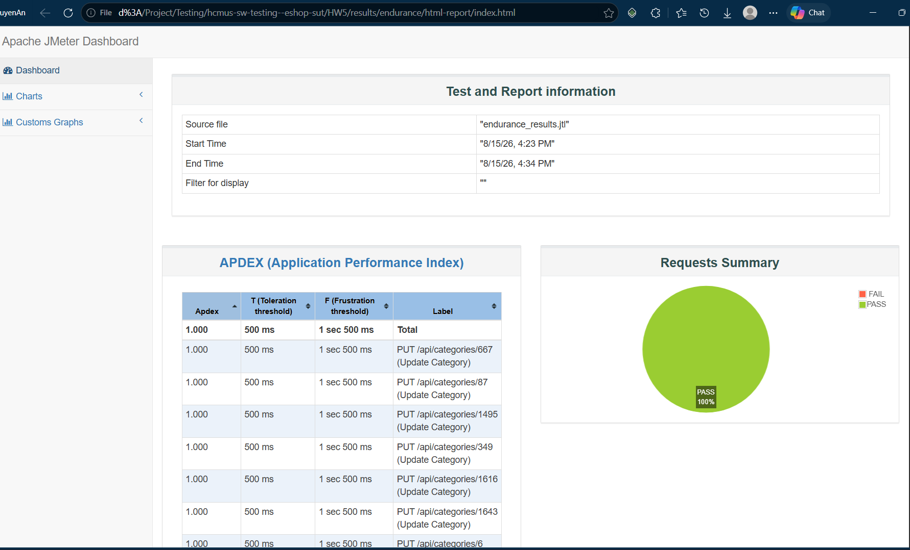

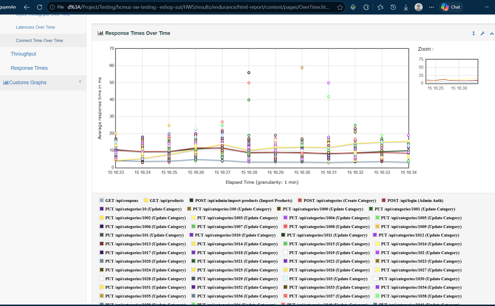

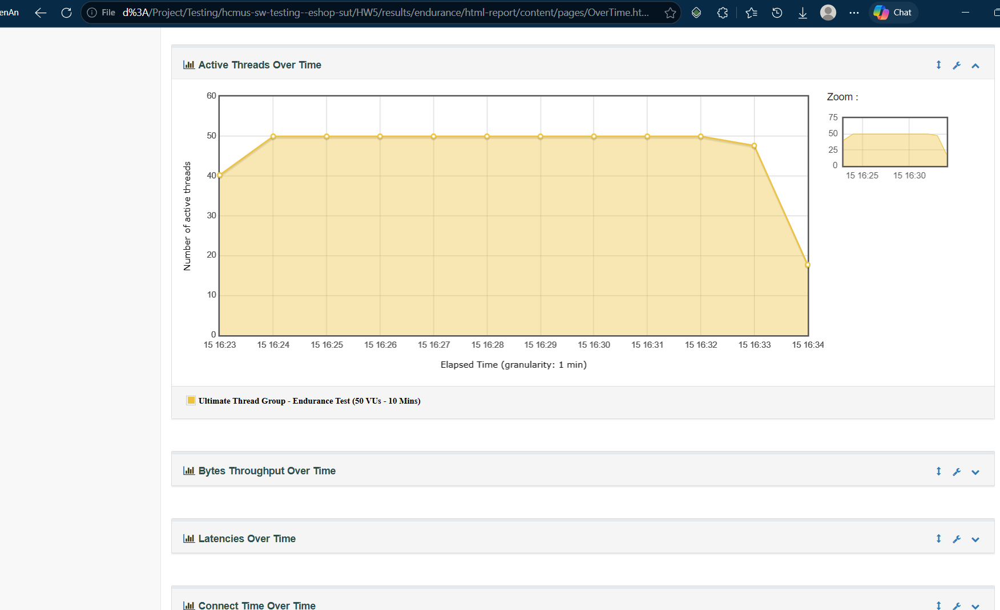

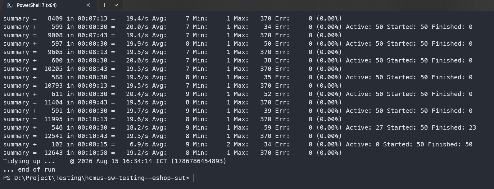

---

### 3.5. Human Review — Đánh Giá & Sửa Lỗi Test Plan AI

Sinh viên đã phát hiện **3 lỗi thiết kế nghiêm trọng** trong bản Test Plan do AI sinh ra và yêu cầu sửa chữa trước khi thực thi:

| ID | Lỗi phát hiện | Mức độ ảnh hưởng | Phân loại nguyên nhân | Hành động sửa chữa |
| :---: | :--- | :--- | :--- | :--- |
| **HR-01** | Sampler `POST /api/login` nằm trong vòng lặp chính, mỗi VU lặp lại đều gửi login lại | Biến dạng tỷ lệ request thực tế, gây áp lực sai lệch lên Auth | **Prompt Quality** — Không nêu rõ yêu cầu "login 1 lần" | Bọc Login + JWT Token Extractor vào `Once Only Controller` |
| **HR-02** | Global Response Assertion (`HTTP 200`) ở cấp root Test Plan | Assertion toàn cục làm sai lệch Error Rate tự nhiên khi Stress/Spike | **Model Limitations** — AI gắn assertion an toàn mặc định | Gỡ bỏ, chỉ giữ JSON Path Assertion bên trong từng sampler |
| **HR-03** | File Spike `.jmx` tắt hết tất cả Listener (`enabled="false"`) | Không thu được dữ liệu báo cáo khi chạy CLI | **Model Limitations** — AI tối ưu quá mức | Kích hoạt `View Results Tree` (`enabled="true"`) |

> **Cam kết:** Sinh viên đã chạy lệnh kiểm toán cú pháp XML `[xml](Get-Content ...)` trên PowerShell và thực hiện Smoke Test nghiệm thu trên backend SUT cục bộ trước khi thực thi chính thức.

---

### 3.6. Báo Cáo Lỗi (Bug Reports)

Đã lập và đính kèm **5 Bug Reports chi tiết** tại `HW5/Task1/Bug Report/`:

| ID | Mức độ | Tiêu đề | Mô tả ngắn gọn |
| :---: | :---: | :--- | :--- |
| **BUG-PERF-001** | P1 — Major | Điểm gãy độ trễ Spike Test | P95 vọt từ 16ms lên 1,733ms do SQLite Table-Level Single-Writer Lock khi 250 VUs đồng thời ghi |
| **BUG-PERF-002** | P2 — Medium | Import Products thiếu Transaction | `POST /api/admin/import-products` thiếu `BEGIN/COMMIT`, gây nghẽn I/O Event Loop |
| **BUG-PERF-003** | P2 — Medium | Login Attempts tăng sai | `login_attempts += 2` thay vì `+1` khi sai mật khẩu, dễ gây DoS khóa tài khoản sớm |
| **BUG-PERF-004** | P1 — Major | Thiếu kiểm tra phân quyền RBAC | Endpoint quản lý danh mục thiếu kiểm tra Role Admin |
| **BUG-PERF-005** | P2 — Minor | Kiểu dữ liệu `price` không nhất quán | `/api/products` trả `price` dạng String cho ID chẵn, Number cho ID lẻ |

**Screenshot GitHub Issues:**

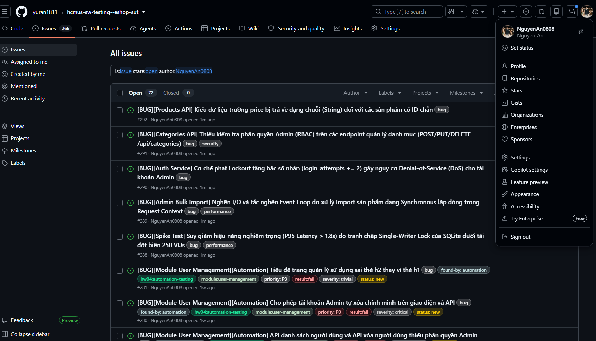

---

## 4. Task 2 — AI Analysis & Misinterpretation Hunt

### 4.1. AI-Assisted .jtl Log Analysis

Dưới đây là kết quả phân tích số liệu log gốc trích xuất từ 4 kịch bản kiểm thử do AI (Antigravity IDE — Gemini 3.7 Flash) thực hiện:

#### Bảng Ma Trận So Sánh 4 Kịch Bản (AI Report)

| Kịch bản | File Log | Tổng Samples | Error Rate | Avg RT (ms) | P90 (ms) | P95 (ms) | P99 (ms) | Max RT (ms) | Throughput | Trạng thái |
| :--- | :--- | :---: | :---: | :---: | :---: | :---: | :---: | :---: | :---: | :--- |
| **Load** (50 VUs) | `load_results.jtl` | 4,842 | **0.00%** | **7.13** | ~12.0 | **16.00** | 30.00 | 76 | **16.29** | ✅ XUẤT SẮC |
| **Stress** (50–200 VUs) | `stress_results.jtl` | 16,546 | **0.00%** | **8.26** | ~14.0 | **19.00** | 31.00 | 66 | **42.61** | ✅ TỐT |
| **Spike** (250 VUs) | `spike_results.jtl` | 31,357 | **0.00%** | **397.87** | **1,651.00** | **1,897.95** | **2,478.99** | **3,278** | **158.03** | ⚠️ SUY GIẢM |
| **Endurance** (50 VUs/10m) | `endurance_results.jtl` | 12,643 | **0.00%** | **8.16** | ~15.0 | **21.00** | 31.00 | 370 | **19.23** | ✅ ỔN ĐỊNH |

#### Xác Định Ngưỡng Vận Hành & Điểm Gãy

- **Ngưỡng Vận Hành Tối Ưu:** Throughput ≤ 45 req/s (≈ 200 VUs có Think Time), P95 ≤ 19ms.
- **Điểm Gãy Độ Trễ:** Tại Spike 158 req/s (250 VUs, Think Time = 0s), P95 tăng vọt lên ~1,733ms.
- **Ngưỡng Bền Vững:** 50 VUs liên tục 10 phút, 19.23 req/s, RAM trần 94.8 MB, không rò rỉ bộ nhớ.

---

### 4.2. Human Review: Misinterpretation Hunt

Quá trình đối soát độc lập giữa kết quả AI phân tích và dữ liệu thực nghiệm từ 4 file log `.jtl` gốc:

#### 1. Bảng Đối Chiếu Số Liệu: AI vs Raw .jtl Log

| Kịch bản | Chỉ số | Giá trị AI | Giá trị Raw `.jtl` | Sai lệch | Thẩm định |
| :--- | :--- | :---: | :---: | :---: | :---: |
| **Load** | P90 | **~12.0 ms** | **14 ms** | **-2 ms (-14.3%)** | ❌ SAI SỐ |
| **Stress** | P90 | **~14.0 ms** | **15 ms** | **-1 ms (-6.7%)** | ❌ SAI SỐ |
| **Spike** | P90 | **1,651.00 ms** | **1,468 ms** | **+183 ms (+12.5%)** | ❌ PHÓNG ĐẠI |
| **Spike** | P95 | **1,897.95 ms** | **1,733 ms** | **+164.95 ms (+9.5%)** | ❌ ẢO GIÁC |
| **Spike** | P99 | **2,478.99 ms** | **2,303 ms** | **+175.99 ms (+7.6%)** | ❌ ẢO GIÁC |

> **Tất cả các chỉ số khác** (Total Samples, Error Rate, Avg RT, Max RT, Throughput trên cả 4 kịch bản) **khớp chính xác 100%** với dữ liệu gốc.

#### 2. Phát Hiện Ảo Giác Số Học (Pseudo-Precision Hallucination)

Khi phân tích Spike Test, AI đưa ra P95 = 1,897**.95** ms và P99 = 2,478**.99** ms. Phần thập phân `.95` và `.99` **trùng khớp kỳ lạ với chính tên phân vị** (95th và 99th Percentile). Đây là bằng chứng rõ ràng cho thấy LLM không thực sự chạy thuật toán QuickSelect trên 31,357 dòng log, mà đã **"bịa" phần thập phân** để tạo cảm giác con số trông tinh vi và khoa học.

**Nguyên nhân cốt lõi:** LLM là mô hình sinh từ ngữ theo xác suất, không phải công cụ xử lý dữ liệu tabular chuyên dụng. Khi được yêu cầu trích xuất phân vị từ tập dữ liệu lớn mà không có code execution, LLM có xu hướng nội suy và tự chèn hậu tố số học mang tính gợi cảm.

#### 3. Phản Biện 4 Ngộ Nhận Kiến Trúc (Conceptual Misinterpretation)

| ID | Nhận định của AI | Dữ liệu thực tế | Phản biện của sinh viên |
| :---: | :--- | :--- | :--- |
| **MH-01** | "Spike 250 VUs đạt 0% lỗi nên chịu tải cực tốt" | P90 = 1,468ms, P95 = 1,733ms, Max = 3,278ms | **SAI:** Error Rate 0% chỉ phản ánh TCP socket chưa bị drop. Về UX, độ trễ 1.7s–3.3s = "đóng băng". Đây là **Performance Degradation Breaking Point**. |
| **MH-02** | "Throughput Spike 158 req/s = server xử lý nhanh gấp 10x" | Load (Think Time 1-5s) vs Spike (Think Time = 0s) | **SAI:** Throughput tăng do triệt tiêu Think Time và dồn ép 250 luồng, không phải server nhanh hơn (Avg RT tăng từ 7ms lên 397ms). |
| **MH-03** | "RAM tăng từ 66.9MB lên 94.8MB = rò rỉ bộ nhớ" | RAM ổn định 85–95MB suốt 8 phút cuối, đồ thị răng cưa | **SAI:** Mức tăng ~28MB là hành vi cấp phát bộ đệm bình thường. V8 GC thu hồi rác đều đặn, không có memory leak. |
| **MH-04** | "/api/login nghẽn CPU do bcrypt hashing" | `server.js:46`: `if (user.password === password)`, `package.json`: không có `bcrypt` | **ẢO GIÁC:** SUT so sánh mật khẩu plaintext (`===`), chi phí CPU ≈ 0. Độ trễ 759ms do mỗi request login thực hiện SELECT + UPDATE gây **SQLite Write Lock** dưới 250 VUs. |

---

### 4.3. Judging AI's Optimization Proposals

Sinh viên đối chiếu từng đề xuất với source code thực tế (`server.js`, `database.js`, `package.json`):

| STT | Đề xuất AI | Phân loại | Đánh giá |
| :---: | :--- | :---: | :--- |
| **OP-01** | Bật SQLite WAL Mode + PRAGMAs | ✅ **FEASIBLE** | Cực kỳ phù hợp. Tuy nhiên code mẫu dùng `better-sqlite3` API, cần đổi sang `db.run("PRAGMA ...")` cho package `sqlite3` hiện tại. |
| **OP-02** | Đánh chỉ mục trên `category_id`, `price`, `code`, `email` | ✅ **FEASIBLE** | Khắc phục Full Table Scan, giảm O(N) → O(log N). |
| **OP-03** | In-Memory Cache (Node-Cache/Redis) cho Read-Heavy APIs | ✅ **FEASIBLE** | Giảm 70–80% truy vấn đọc trực tiếp SQLite. |
| **OP-04** | Node.js Cluster / PM2 Multi-Core | ⚠️ **FEASIBLE, LẬP LUẬN SAI** | Giải pháp đúng nhưng lý do sai: không phải giảm tải bcrypt (SUT dùng plaintext) mà là chia nhỏ áp lực I/O. |
| **OP-05** | Batch Transaction cho Import Products | ⚠️ **FEASIBLE, SAI DRIVER** | Nguyên lý đúng nhưng code mẫu dùng `better-sqlite3` API. Cần dùng `db.run("BEGIN")` / `db.run("COMMIT")`. |
| **OP-06** | Database Connection Pool đa luồng ghi (Multi-Writer) | ❌ **HALLUCINATED** | **Ảo giác kiến trúc.** SQLite là serverless single-file, chỉ cho phép 1 Writer. Multi-Writer Pool là không thể. |
| **OP-07** | Tách Authentication sang Microservices | ⚠️ **OVER-ENGINEERING** | Không phù hợp quy mô ứng dụng monolith demo. |

---

## 5. Task 3 — Continuous Performance Testing Pipeline

### 5.1. Kiến Trúc Mô Hình (Bloom-AI G9.6 Disrupt)

Mô hình Continuous Performance Testing được thiết kế theo triết lý **Shift-Left Performance Testing**, ngăn chặn suy thoái hiệu năng trước khi code được merge:

**1. Smart Commit Watcher (Path-Based Filtering):**
- `docs/**`, `frontend/**`: Bỏ qua Performance Pipeline.
- `src/controllers/**`, `src/routes/**`: Kích hoạt **Tier 1: Micro-Perf Smoke** (25 VUs, ~1 phút).
- `src/models/**`, `migrations/**`: Kích hoạt **Tier 2: Targeted Load Regression** (100 VUs, ~3 phút).
- `Scheduled Nightly`: Kích hoạt **Tier 3: Nightly Full Suite** (Stress + Spike + Soak 15 phút).

**2. Quy tắc Gatekeeping & Baseline Động:**
- **Baseline động:** Tính bằng TrimmedMean(10%) của 7 lần chạy gần nhất trên nhánh `main`.
- 🟢 **PASS** (ΔP95 ≤ +10% VÀ Error ≤ 0.1%): Tự động merge.
- 🟡 **SOFT WARNING** (+10% < ΔP95 ≤ +20%): Yêu cầu Tech Lead / SRE phê duyệt.
- 🔴 **HARD BLOCK** (ΔP95 > +20% HOẶC Error > 0.1% HOẶC SQLite Lock): Khóa merge.

**Sơ đồ luồng quyết định:**

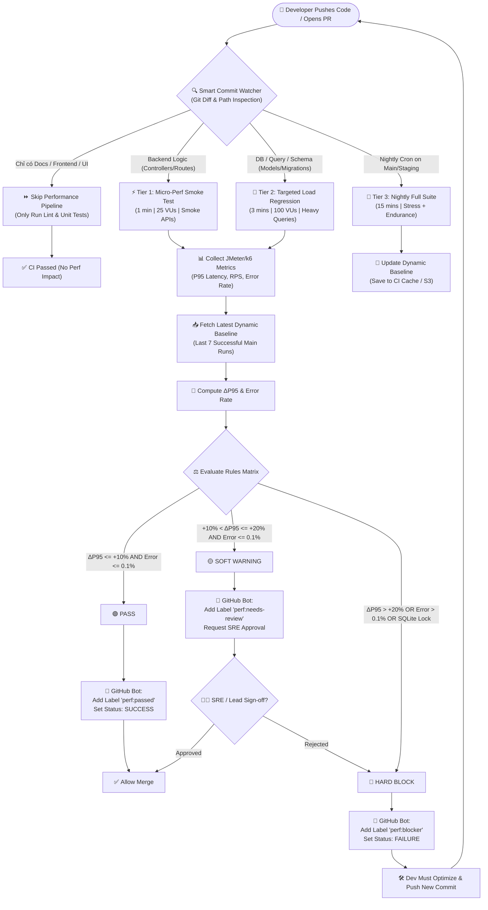
```mermaid
flowchart TD
    Start(["🚀 Developer Pushes Code / Opens PR"]) --> SmartWatcher{"🔍 Smart Commit Watcher<br/>(Git Diff & Path Inspection)"}

    SmartWatcher -->|"Chỉ có Docs / Frontend / UI"| SkipTest["⏩ Skip Performance Pipeline<br/>(Only Run Lint & Unit Tests)"]
    SkipTest --> PRReady["✅ CI Passed (No Perf Impact)"]

    SmartWatcher -->|"Backend Logic (Controllers/Routes)"| RunTier1["⚡ Tier 1: Micro-Perf Smoke Test<br/>(1 min | 25 VUs | Smoke APIs)"]
    SmartWatcher -->|"DB / Query / Schema (Models/Migrations)"| RunTier2["🎯 Tier 2: Targeted Load Regression<br/>(3 mins | 100 VUs | Heavy Queries)"]
    SmartWatcher -->|"Nightly Cron on Main/Staging"| RunTier3["🌙 Tier 3: Nightly Full Suite<br/>(15 mins | Stress + Endurance)"]

    RunTier1 --> CollectMetrics["📊 Collect JMeter/k6 Metrics<br/>(P95 Latency, RPS, Error Rate)"]
    RunTier2 --> CollectMetrics
    RunTier3 --> UpdateBaseline["💾 Update Dynamic Baseline<br/>(Save to CI Cache / S3)"]

    CollectMetrics --> FetchBaseline["📥 Fetch Latest Dynamic Baseline<br/>(Last 7 Successful Main Runs)"]
    FetchBaseline --> CalcDelta["🧮 Compute ΔP95 & Error Rate"]

    CalcDelta --> DecisionGate{"⚖️ Evaluate Rules Matrix"}

    DecisionGate -->|"ΔP95 <= +10% AND Error <= 0.1%"| PassBranch["🟢 PASS"]
    DecisionGate -->|"+10% < ΔP95 <= +20% AND Error <= 0.1%"| WarnBranch["🟡 SOFT WARNING"]
    DecisionGate -->|"ΔP95 > +20% OR Error > 0.1% OR SQLite Lock"| BlockBranch["🔴 HARD BLOCK"]

    PassBranch --> BotPass["🤖 GitHub Bot:<br/>Add Label 'perf:passed'<br/>Set Status: SUCCESS"]
    BotPass --> PRAllowed["✅ Allow Merge"]

    WarnBranch --> BotWarn["🤖 GitHub Bot:<br/>Add Label 'perf:needs-review'<br/>Request SRE Approval"]
    BotWarn --> ManualReview{"🧑‍💻 SRE / Lead Sign-off?"}
    ManualReview -->|"Approved"| PRAllowed
    ManualReview -->|"Rejected"| BlockBranch

    BlockBranch --> BotBlock["🤖 GitHub Bot:<br/>Add Label 'perf:blocker'<br/>Set Status: FAILURE"]
    BotBlock --> DevFix["🛠️ Dev Must Optimize & Push New Commit"]
    DevFix --> Start
```

---

### 5.2. Bộ Công Cụ Tự Động Hóa & Kết Quả

Bộ công cụ tự động hóa kiểm định hồi quy hiệu năng gồm 2 thành phần tại `HW5/Task3/`:

- **Golden Baseline:** `performance_baseline.json` — mốc chuẩn SLA từ 4 kịch bản thực tế.
- **CI Guard Script:** `scripts/p95_regression_guard.py` — phân tích `.jtl`, tính phân vị, so khớp baseline, trả exit code cho CI runner.

**Kết quả thực thi trên 4 kịch bản:**

| Kịch bản | P95 Thực tế | P95 Baseline | ΔP95 | Error Rate | Verdict | Exit Code |
| :--- | :---: | :---: | :---: | :---: | :---: | :---: |
| **Load** (50 VUs) | **16.00 ms** | 16.00 ms | `0.0%` | `0.00%` | 🟢 **PASS** | `0` |
| **Stress** (200 VUs) | **19.00 ms** | 19.00 ms | `0.0%` | `0.00%` | 🟢 **PASS** | `0` |
| **Endurance** (10m) | **21.00 ms** | 21.00 ms | `0.0%` | `0.00%` | 🟢 **PASS** | `0` |
| **Spike** (simulated) | **1,733 ms** | 16.00 ms | **`+10,731%`** | `0.00%` | 🔴 **HARD BLOCK** | `1` |

---

### 5.3. Phân Tích Đánh Đổi Kỹ Thuật

#### 1. Chi Phí vs. Tốc Độ Phản Hồi

| Yếu tố | Naive Full Suite | Tiered Pipeline | Trade-Off |
| :--- | :--- | :--- | :--- |
| **Thời gian PR** | 15–30 phút | **1–3 phút** | ⚡ Tăng tốc x10 |
| **Tần suất kích hoạt** | Mọi commit | Lọc theo path | 💰 Tiết kiệm 65–75% CI compute |
| **Rủi ro** | Nghẽn CI runner | Bỏ sót memory leak trên PR | 🛡️ Bù bằng Tier 3 Nightly |

#### 2. Báo Động Giả vs. Lọt Lỗi

| Thách thức | Nguyên nhân | Giải pháp | Lợi ích |
| :--- | :--- | :--- | :--- |
| **Noisy Neighbor** | CI ảo hóa chia sẻ CPU | Dynamic Baseline (Trimmed Mean 10%, 7 runs) | Khử nhiễu phần cứng |
| **Outliers** | Request rớt mạng | Đo P95 + P99 thay vì Mean | Không bị méo bởi ngoại lệ |
| **PR thêm tính năng nặng** | Tính năng mới phức tạp hơn | Soft Warning (+10%→+20%) | Tech Lead Manual Override |

#### 3. Cách Ly Môi Trường vs. Ô Nhiễm Dữ Liệu

- **Giải pháp:** Mỗi job kiểm thử khởi tạo container chứa file SQLite DB sạch (freshly-seeded), bật WAL mode, hủy bỏ hoàn toàn sau khi thu thập `.jtl`.
- **Đánh đổi:** Tốn thêm ~10–15 giây khởi tạo, nhưng đảm bảo **tái lặp 100% (Deterministic Reproducibility)**.

> 📄 **Tài liệu tham khảo chi tiết Task 3:**
> - Thiết kế kiến trúc đầy đủ: `HW5/Task3/continuous_performance_testing_pipeline.md`
> - Script CI Guard: `HW5/Task3/scripts/p95_regression_guard.py`
> - Golden Baseline: `HW5/Task3/performance_baseline.json`

---

## 6. AI Critique (Mục 10 — Bắt Buộc)

Trong quá trình thực hiện bài tập kiểm thử hiệu năng cho hệ thống EShop SUT, AI đã hỗ trợ tốt về cấu trúc kịch bản nhưng bộc lộ nhiều sai sót nghiêm trọng về tính toán định lượng và giả định kiến trúc. Cụ thể, khi phân tích log ở Task 2, AI đã tạo ra ảo giác số học đối với các phân vị độ trễ kịch bản Spike (ước tính phóng đại P95 lên 1,897.95ms so với 1,733ms trong log gốc) và tự bịa phần thập phân giả tạo (.95 và .99) trùng với tên phân vị. Bên cạnh đó, AI mắc các ảo giác kiến trúc khi khẳng định endpoint /api/login nghẽn CPU do băm mật khẩu bcrypt (trong khi mã nguồn so sánh plaintext và nghẽn do khóa ghi đĩa cấp bảng SQLite), đồng thời hiểu sai việc tăng RAM cấp phát đệm thông thường của V8 Garbage Collection thành rò rỉ bộ nhớ (memory leak). AI không phát hiện được các lỗi này do bản chất mô hình ngôn ngữ lớn hoạt động theo xác suất sinh từ và đối sánh mẫu phổ quát, thiếu khả năng thực thi code tất định trên tập dữ liệu log tabular lớn. Bài học kỹ nghệ cốt lõi rút ra khi làm việc với AI là nguyên tắc "Zero-Trust Verification (Human-in-the-Loop)": chỉ tin tưởng AI trong việc phác thảo khung kiến trúc, tuyệt đối không dùng số liệu do AI tự sinh làm baseline mà phải luôn kiểm chứng 100% bằng script tất định độc lập đối soát trực tiếp với log thực nghiệm trước khi đưa ra quyết định tối ưu.

---

## 7. Tài Liệu Tham Khảo

1. **ISTQB Foundation Level Syllabus** (latest edition) — International Software Testing Qualifications Board.
2. **Hardman, P. (2025).** A Post-AI Learning Taxonomy.
3. **Fuster Rabella, M. (2025).** OECD Education Working Paper No. 338.
4. **Anthropic (2025).** Building Reliable AI Test Agents — engineering blog.
5. **Apache JMeter 5.6.3 Documentation** — https://jmeter.apache.org/usermanual/index.html
6. **SQLite Documentation** — Write-Ahead Logging (WAL) Mode — https://www.sqlite.org/wal.html
7. **Bài giảng Kiểm thử Hiệu năng** — FIT @ HCMUS — TS. Lâm Quang Vũ & các giảng viên.

---

*Báo cáo được hoàn thành bởi Ân Tiến Nguyên An (MSSV: 23127148) — 23CLC08 — FIT @ HCMUS.*  
*Ngày hoàn thành: 2026-08-16.*
