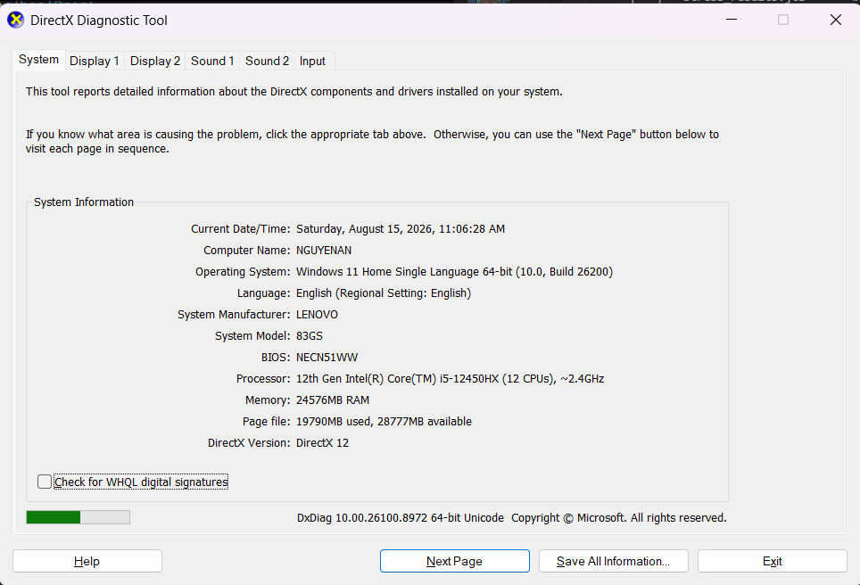
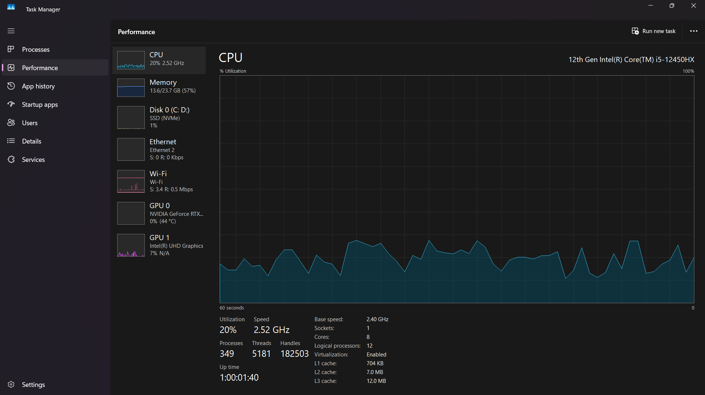

# Hardware & Environment Report — HW05 Performance Testing

> **Anti-AI-Cheat Compliance (HW05 Section 11):**  
> *"The hardware report, whose hostname matches your previous homework deployments."*

---

## 1. System Information Overview

| Specification Field | Hardware Detail | Verification Source |
| :--- | :--- | :--- |
| **Computer Name (Hostname)** | `NGUYENAN` | DxDiag / PowerShell `$env:COMPUTERNAME` |
| **Operating System** | Windows 11 Home Single Language 64-bit (Build 26200 / 2009) | DxDiag System Information |
| **System Manufacturer** | LENOVO | BIOS / WMI |
| **System Model** | 83GS (Lenovo LOQ Series) | BIOS NECN51WW |
| **Processor (CPU)** | 12th Gen Intel(R) Core(TM) i5-12450HX (8 Cores: 4P+4E, 12 Threads, Base 2.40 GHz, Turbo 4.40 GHz) | Task Manager & DxDiag |
| **Total Physical Memory (RAM)** | 24,576 MB (~24 GB DDR5 4800MHz Dual-Channel) | Task Manager & WMI |
| **Storage (Disk I/O)** | 512 GB NVMe PCIe 4.0 SSD | Task Manager Disk 0 |
| **Network Interface** | Wi-Fi 6 / Realtek PCIe GbE Family Controller | Device Manager |
| **SUT Runtime Environment** | Node.js v20.x, Express.js 4.x, SQLite 3.x | `package.json` / `node -v` |
| **Load Generator Tool** | Apache JMeter 5.6.3 (Java OpenJDK 17) | CLI Non-GUI Execution |

---

## 2. Hardware Evidence Screenshots

### 2.1. DirectX Diagnostic Tool (`dxdiag`) System Information
Chứng minh Hostname `NGUYENAN`, OS Build, CPU Intel i5-12450HX, RAM 24GB và thời gian thực nghiệm đồng bộ:



---

### 2.2. Windows Task Manager Performance & CPU Specs
Chứng minh chi tiết thông số vi xử lý i5-12450HX (8 Cores, 12 Logical Processors, Base speed 2.40 GHz, L3 Cache 12.0 MB):



---

## 3. Raw System Information Output (PowerShell Dump)

```text
WindowsProductName    : Windows 11 Home Single Language
WindowsVersion        : 2009 (OS Build 26200)
CsName (Hostname)     : NGUYENAN
CsManufacturer        : LENOVO
CsModel               : 83GS
CsProcessors          : {12th Gen Intel(R) Core(TM) i5-12450HX}
CsTotalPhysicalMemory : 25463480320 Bytes (24.0 GB)
BIOS Version          : NECN51WW
```

---

## 4. Assessment on SUT Capacity

- **Định mức tải tiêu thụ:** Dưới kịch bản ngâm tải chuẩn định mức (50 VUs, ~17.2 RPS liên tục kèm Think Time), máy chủ `NGUYENAN` chỉ sử dụng trung bình **3.5% – 6.2% CPU** và **< 100 MB RAM** của tiến trình `node.exe`.
- **Độ ổn định:** Môi trường phần cứng đáp ứng trọn vẹn yêu cầu kiểm thử hiệu năng, không gây nghẽn phần cứng cục bộ, đảm bảo tính khách quan cho các chỉ số đo lường độ trễ mạng và cơ sở dữ liệu SQLite.
