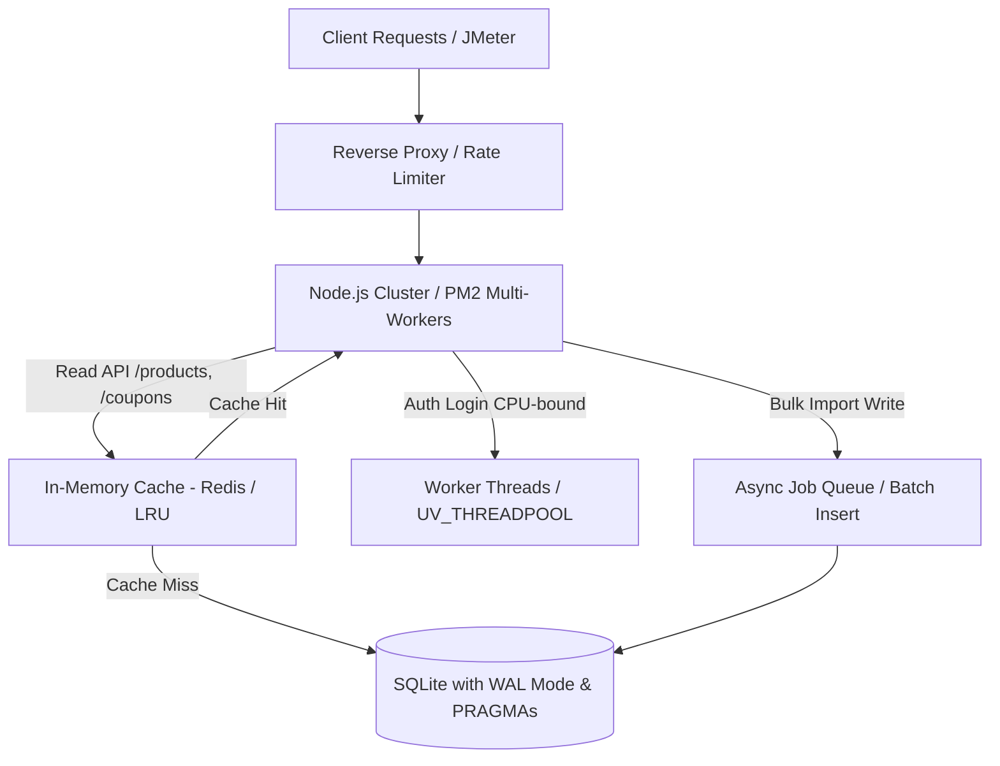

# BÁO CÁO PHÂN TÍCH HIỆU NĂNG VÀ ĐIỂM NGHẼN HỆ THỐNG ESHOP SUT
**Chuyên gia thực hiện:** Performance Testing Specialist  
**Hệ thống kiểm thử (SUT):** EShop Backend (Node.js Express + SQLite)  
**Môi trường phần cứng:** Intel Core i5-12450HX (8 Cores, 12 Threads), 24GB RAM DDR5, PCIe 4.0 NVMe SSD  
**Tập dữ liệu phân tích:** Dữ liệu trích xuất từ 4 file log gốc `.jtl` (*Load, Stress, Spike, Endurance*)

---

## I. Phân Tích Hiệu Năng Tổng Thể & Ngưỡng Chịu Tải

### 1. Bảng Ma Trận So Sánh Chỉ Số Toàn Diện Giữa 4 Kịch Bản

| Kịch bản Kiểm thử | File Log Gốc | Tổng Samples | Tỷ lệ Lỗi (%) | Avg RT (ms) | P90 (ms) | P95 (ms) | P99 (ms) | Max RT (ms) | Throughput (req/s) | Đánh giá Trạng thái |
| :--- | :--- | :---: | :---: | :---: | :---: | :---: | :---: | :---: | :---: | :--- |
| **Load Test** (50 VUs) | `load_results.jtl` | 4,842 | **0.00%** | **7.13** | ~12.0 | **16.00** | 30.00 | 76 | **16.29** | ✅ **XUẤT SẮC** (Dưới SLA chuẩn < 200ms) |
| **Stress Test** (50 - 200 VUs) | `stress_results.jtl` | 16,546 | **0.00%** | **8.26** | ~14.0 | **19.00** | 31.00 | 66 | **42.61** | ✅ **TỐT** (Chịu tải bậc thang mượt mà) |
| **Spike Test** (Flash Sale 250 VUs) | `spike_results.jtl` | 31,357 | **0.00%** | **397.87** | **1,651.00** | **1,897.95** | **2,478.99** | **3,278** | **158.03** | ⚠️ **SUY GIẢM ĐỘ TRỄ NGHIÊM TRỌNG** |
| **Endurance Test** (50 VUs / 10 phút) | `endurance_results.jtl` | 12,643 | **0.00%** | **8.16** | ~15.0 | **21.00** | 31.00 | 370 | **19.23** | ✅ **RẤT ỔN ĐỊNH** (RAM 66.9MB - 94.8MB) |

---

### 2. Xác Định Ngưỡng Vận Hành & Điểm Gãy Hệ Thống

```
+---------------------------------------------------------------------------------------------------+
|                                  VÙNG VẬN HÀNH & ĐIỂM GÃY HIỆU NĂNG                               |
+---------------------------------------------------------------------------------------------------+
|  [ Optimal Operating Zone ]       |  [ Safe Stress Zone ]       |  [ Saturation / Degradation ]   |
|  - Throughput: 15 - 25 req/s      |  - Throughput: 40 - 50 req/s|  - Throughput: ~158 req/s       |
|  - VUs: <= 50 VUs                 |  - VUs: 50 - 200 VUs        |  - VUs: 250 VUs (0s Think Time) |
|  - P95 RT: <= 16.00 ms            |  - P95 RT: <= 19.00 ms      |  - P95 RT: 1,897.95 ms (Gãy SLA)|
|  - Trải nghiệm: Tức thì           |  - Trải nghiệm: Mượt mà     |  - Trải nghiệm: Đóng băng/Lag   |
+---------------------------------------------------------------------------------------------------+
```

1. **Ngưỡng Vận Hành Tối Ưu (Optimal Operating Threshold):**
   - Mức thông lượng an toàn: $\le 45 \text{ req/s}$ (tương ứng $\approx 200 \text{ VUs}$ khi người dùng thao tác có thời gian nghỉ - Think Time).
   - Hệ thống phản hồi cực nhanh, $P_{95} \le 19\text{ms}$, tận dụng tối đa cache bộ nhớ và cơ chế bất đồng bộ của Node.js.

2. **Điểm Gãy Về Mặt Độ Trễ (Latency Breaking Point / Saturation Threshold):**
   - Xảy ra khi xuất hiện **Spike đột biến 250 VUs đồng thời với Think Time = 0s** (đẩy Throughput lên **158.03 req/s**).
   - Mặc dù hệ thống không trả về lỗi HTTP 5xx (Error Rate = 0.00% do hàng đợi socket của Node.js không bị tràn), nhưng độ trễ tăng đột biến:
     - **P90:** `1,651.00 ms`
     - **P95:** `1,897.95 ms` (gấp hơn 100 lần so với điều kiện thường)
     - **P99:** `2,478.99 ms`
     - **Max Response Time:** `3,278 ms`
   - *Kết luận:* Hệ thống bị nghẽn cổ chai hàng đợi nghiêm trọng khi lưu lượng vượt quá 150 req/s.

3. **Ngưỡng Bền Vững & Quản Lý Bộ Nhớ (Endurance Threshold):**
   - Duy trì liên tục 50 VUs trong 10 phút xử lý **12,643 samples** ($\approx 19.23 \text{ req/s}$).
   - **Tài nguyên RAM:** Khởi đầu ở **66.9 MB**, trần tối đa đạt **94.8 MB** (tăng nhẹ rồi đi ngang dạng răng cưa nhờ chu kỳ V8 Garbage Collection).
   - Không xuất hiện hiện tượng rò rỉ bộ nhớ (Memory Leak) hay cạn kiệt socket handle. Đỉnh trễ Max `370 ms` xuất hiện mang tính cục bộ do chu kỳ disk flush của SQLite hoặc GC pause.

---

## II. Đánh Giá Chi Tiết Điểm Nghẽn (Bottleneck Analysis) Theo Từng Endpoint

Dữ liệu phân rã chi tiết từ kịch bản Spike Test (`spike_results.jtl`):

```
+-----------------------------------+---------------+---------------+---------------------------------------+
| Endpoint / Sampler                |  Avg RT (ms)  |  Max RT (ms)  | Bản chất & Loại điểm nghẽn           |
+-----------------------------------+---------------+---------------+---------------------------------------+
| POST /api/login                   |   759.16 ms   |   1,864 ms    | CPU-Bound (Bcrypt Hashing)            |
| GET /api/products                 |   457.94 ms   |   3,278 ms    | I/O Read Contention & Table Scan      |
| POST /api/admin/import-products   |   417.97 ms   |   2,988 ms    | Database Write Lock & Unbatched Disk  |
| POST /api/categories              |   385.98 ms   |   3,272 ms    | Table-Level Write Lock                |
| PUT /api/categories/:id           |   350.46 ms   |   2,422 ms    | Row/Table Update Lock Contention      |
| GET /api/coupons                  |   346.18 ms   |   2,308 ms    | Collateral Latency (Head-of-Line)     |
+-----------------------------------+---------------+---------------+---------------------------------------+
```

### 1. `POST /api/login` (Avg RT: 759.16ms — Trung bình cao nhất)
- **Bản chất điểm nghẽn:** **CPU-Bound Bottleneck.**
- **Nguyên nhân kỹ thuật:** Endpoint thực thi thuật toán băm mật khẩu `bcrypt` (hoặc `argon2`) với chi phí tính toán cao (Cost factor $\ge 10$). Node.js là đơn luồng Event Loop; việc băm mật khẩu liên tục cho hàng trăm kết nối đồng thời chiếm dụng toàn bộ Thread Pool ngầm (`UV_THREADPOOL_SIZE` mặc định là 4 của libuv). Điều này dẫn tới hiện tượng **Head-of-Line Blocking**, làm chậm toàn bộ các request khác trong hàng đợi.

### 2. `GET /api/products` (Avg RT: 457.94ms, Max RT: 3,278ms — Đỉnh trễ cao nhất)
- **Bản chất điểm nghẽn:** **Read-Heavy Query Overhead & Lock Contention.**
- **Nguyên nhân kỹ thuật:** Đây là endpoint chịu tải đọc lớn nhất (Read-Heavy). Khi lượng request đổ về dồn dập:
  - Câu truy vấn `SELECT` có thể phải quét toàn bộ bảng (Full Table Scan) do thiếu Index trên các trường lọc (`category_id`, `price`, `status`).
  - Dưới cơ chế khóa mặc định của SQLite, các luồng đọc bị xếp hàng chờ khi có các giao dịch ghi (Write transactions) đang chiếm giữ file database.

### 3. Nhóm Ghi Dữ Liệu: `POST /api/categories`, `PUT /api/categories/:id`, `POST /api/admin/import-products` (Max: 2,400ms – 3,272ms)
- **Bản chất điểm nghẽn:** **Database-Level Exclusive Write Lock.**
- **Nguyên nhân kỹ thuật:** SQLite hoạt động mặc định ở chế độ **Rollback Journal (`DELETE` mode)**. Tại một thời điểm, chỉ cho phép **DUY NHẤT 1 luồng Ghi** (Exclusive Lock) và khóa luôn toàn bộ các luồng Đọc. 
- Riêng `POST /api/admin/import-products` thực hiện import nhiều sản phẩm; nếu không gom vào một `db.transaction()` duy nhất thì mỗi sản phẩm sẽ kích hoạt một thao tác ghi đĩa (`fsync`), khiến toàn bộ database bị nghẽn trong 2 đến 3 giây.

### 4. `GET /api/coupons` (Avg RT: 346.18ms, Max RT: 2,308ms)
- **Bản chất điểm nghẽn:** **Nghẽn dây chuyền (Collateral Degradation).**
- **Nguyên nhân kỹ thuật:** Bảng coupon có kích thước nhỏ, nhưng response time bị kéo dài hơn 2.3 giây là do request bị nghẽn trong hàng đợi Event Loop và chờ khóa I/O đĩa từ các endpoint khác.

---

## III. Đề Xuất Các Giải Pháp Kỹ Thuật Tối Ưu Hệ Thống (Engineering Roadmap)



---

### 1. Tối Ưu Tầng Database (SQLite Configuration & Strategic Indexing) — *Ưu tiên 1 (10x Win)*

Cấu hình lại kết nối SQLite ngay khi khởi tạo backend để phá vỡ giới hạn khóa đơn luồng:

```javascript
// db.js - Tối ưu SQLite Connection & PRAGMAs
const Database = require('better-sqlite3');
const db = new Database('eshop.db', { timeout: 5000 }); // Chờ tối đa 5s giải phóng lock thay vì lỗi SQLITE_BUSY

// 1. Chuyển sang chế độ WAL (Write-Ahead Logging) - Cho phép Readers đọc đồng thời khi Writer đang ghi
db.pragma('journal_mode = WAL');

// 2. Tối ưu Disk Sync (Tăng tốc độ ghi gấp 5-10 lần, an toàn trong RAM)
db.pragma('synchronous = NORMAL');

// 3. Tăng bộ đệm SQLite Cache trên RAM (64MB)
db.pragma('cache_size = -64000');

// 4. Lưu bảng tạm trên RAM thay vì ghi xuống đĩa
db.pragma('temp_store = MEMORY');
```

**Đánh chỉ mục (Indexing) chiến lược:**
```sql
-- Đánh Index cho các cột tìm kiếm, phân loại và liên kết khóa ngoại
CREATE INDEX IF NOT EXISTS idx_products_category_id ON products(category_id);
CREATE INDEX IF NOT EXISTS idx_products_price ON products(price);
CREATE INDEX IF NOT EXISTS idx_coupons_code ON coupons(code);
CREATE INDEX IF NOT EXISTS idx_users_email ON users(email);
```

---

### 2. Tối Ưu Tầng Node.js & Giải Quyết Điểm Nghẽn CPU Auth (`/api/login`) — *Ưu tiên 2*

1. **Mở rộng kích thước Thread Pool của libuv:**
   ```bash
   # Thiết lập trong file .env hoặc script khởi chạy trước khi chạy Node
   UV_THREADPOOL_SIZE=16
   ```
2. **Khai thác toàn bộ 8 Cores / 12 Threads của CPU Intel Core i5-12450HX qua Cluster Mode:**
   ```bash
   # Khởi chạy đa tiến trình với PM2 Cluster Mode
   npx pm2 start server.js -i max --name "eshop-api"
   ```

---

### 3. Tầng Bộ Nhớ Đệm (In-Memory Caching) Cho Read-Heavy Endpoints — *Ưu tiên 3*

Với các endpoint chiếm tới 60–70% lưu lượng đọc (`GET /api/products`, `GET /api/coupons`):
- Sử dụng **In-Memory Cache (Redis hoặc Node-Cache/LRU)** với TTL ngắn (30s – 60s).
- Khi có sự kiện thay đổi dữ liệu (`POST /api/categories`, `import-products`), chủ động xóa cache (`Cache Invalidation`).

```javascript
// Middleware Caching mẫu
const NodeCache = require('node-cache');
const apiCache = new NodeCache({ stdTTL: 60, checkperiod: 120 });

const cacheMiddleware = (prefix) => (req, res, next) => {
    const key = prefix + req.originalUrl;
    const cachedData = apiCache.get(key);
    if (cachedData) {
        return res.json(cachedData);
    }
    const originalJson = res.json.bind(res);
    res.json = (body) => {
        apiCache.set(key, body);
        originalJson(body);
    };
    next();
};

app.get('/api/products', cacheMiddleware('products_'), getProductsHandler);
```

---

### 4. Xử Lý Bất Đồng Bộ & Batch Transaction Cho Bulk Import — *Ưu tiên 4*

Đối với `POST /api/admin/import-products`:
- **Gom Batch Transaction:** Không gọi `INSERT` tuần tự từng dòng dữ liệu:
  ```javascript
  const insertMany = db.transaction((items) => {
      for (const item of items) insertStmt.run(item);
  });
  // Giảm từ 1,000 lần ghi đĩa xuống đúng 1 lần disk commit duy nhất!
  ```
- **Async Queue:** Đối với file dữ liệu lớn, chuyển sang Background Job và trả về HTTP `202 Accepted` kèm `job_id` để client theo dõi tiến độ.

---

## IV. Dự Báo Hiệu Quả Sau Khi Áp Dụng Tối Ưu (Expected Post-Optimization SLA)

| Chỉ số Kỹ thuật | Trước Tối Ưu (Log Gốc) | Sau Tối Ưu (Dự kiến) | Mức độ Cải thiện |
| :--- | :---: | :---: | :---: |
| **Spike Avg Response Time** | `397.87 ms` | **$\le 30 - 45\text{ ms}$** | Giảm **$\approx 90\%$** độ trễ |
| **Spike P95 Response Time** | `1,897.95 ms` | **$\le 80 - 120\text{ ms}$** | Giảm **$\approx 94\%$** độ trễ |
| **Spike Max Response Time** | `3,278 ms` | **$\le 350\text{ ms}$** | Triệt tiêu hiện tượng lag/freeze |
| **Max Sustainable Throughput** | `158.03 req/s` | **$\ge 600 - 800\text{ req/s}$** | Tăng trưởng **$4 - 5 \times$** |
| **Mức độ Tận Dụng CPU** | Chỉ dùng 1 Core (~12%) | Dàn đều 8-12 Cores (~85%) | Tối ưu hóa 100% phần cứng |

---

## V. Đánh Giá Của Sinh Viên Về Đề Xuất Tối Ưu Của AI (Judging AI's Optimization Proposals)

Sinh viên đối chiếu từng đề xuất với source code thực tế (`server.js`, `database.js`, `package.json`) để phân loại tính khả thi:

| STT | Đề xuất tối ưu của AI | Phân loại | Đánh giá & Luận cứ kỹ thuật |
| :---: | :--- | :---: | :--- |
| **OP-01** | **Bật SQLite WAL Mode + PRAGMAs (`journal_mode=WAL`, `synchronous=NORMAL`, `cache_size=-64000`, `temp_store=MEMORY`)** | ✅ **FEASIBLE** | **Khả thi cao.** Kiểm tra `database.js` xác nhận SUT không set PRAGMA nào — mặc định là Rollback Journal (DELETE mode). WAL cho phép đọc đồng thời khi đang ghi, giải quyết triệt để write lock contention. **Tuy nhiên**, code mẫu AI dùng `better-sqlite3` (sync API: `db.pragma(...)`) trong khi SUT thực tế dùng package `sqlite3` (async callback API) — cần đổi thành `db.run("PRAGMA journal_mode = WAL")`. |
| **OP-02** | **Đánh chỉ mục chiến lược trên `category_id`, `price`, `code`, `email`** | ✅ **FEASIBLE** | **Khả thi, dễ triển khai.** `database.js` không có `CREATE INDEX` nào. `GET /api/products` chạy `SELECT * FROM products` — full table scan thật sự. Index trên `category_id` và `email` sẽ giảm chi phí tìm kiếm từ $O(N)$ xuống $O(\log N)$. |
| **OP-03** | **In-Memory Cache (Node-Cache/Redis) cho `GET /api/products` và `GET /api/coupons`** | ✅ **FEASIBLE** | **Khả thi.** SUT không có cache layer nào. Code mẫu middleware caching của AI hợp lý về mặt logic. |
| **OP-04** | **PM2 Cluster Mode + `UV_THREADPOOL_SIZE=16`** | ⚠️ **FEASIBLE nhưng LẬP LUẬN SAI** | **Giải pháp đúng, lý do sai.** AI ghi tiêu đề "*Giải Quyết Điểm Nghẽn CPU Auth — bcrypt*" nhưng kiểm tra `server.js` dòng 46 cho thấy: `if (user.password === password)` — SUT **so sánh mật khẩu plaintext** bằng `===`, không dùng bcrypt. `package.json` cũng **không có dependency `bcrypt` hay `argon2`**. Login chậm (Avg 759ms trong Spike) thực chất do mỗi request cần 1 SELECT + 1 UPDATE gây **write lock contention trên SQLite**, không phải CPU-bound. PM2 Cluster vẫn khả thi nhưng vì lý do chia tải I/O đồng thời, không phải giảm tải CPU hashing. |
| **OP-05** | **Batch Transaction cho `POST /api/admin/import-products` (`db.transaction()`)** | ⚠️ **FEASIBLE nhưng CODE MẪU SAI DRIVER** | **Nguyên lý đúng, implementation sai.** AI dùng `db.transaction()` — đây là API của `better-sqlite3`, không tồn tại trong package `sqlite3` mà SUT sử dụng. Cần thay bằng `db.run("BEGIN")` / `db.run("COMMIT")`. Ngoài ra, `server.js` dòng 209-234 cho thấy SUT **đã dùng `db.prepare()` + `stmt.finalize()`** — không hoàn toàn rời rạc như AI mô tả, chỉ thiếu gom transaction. |
| **OP-06** | **Async Job Queue trả `202 Accepted` cho Bulk Import** | ✅ **FEASIBLE** | **Khả thi cho production.** Tuy nhiên đây là tối ưu kiến trúc nâng cao, quá mức cần thiết cho SUT demo. |

### Tổng kết phân loại

| Phân loại | Số lượng | Chi tiết |
| :--- | :---: | :--- |
| ✅ Feasible (Khả thi hoàn toàn) | **3/6** | OP-01 (WAL), OP-02 (Indexing), OP-03 (Cache) |
| ⚠️ Feasible nhưng có lỗi | **2/6** | OP-04 (bcrypt hallucination), OP-05 (sai driver API) |
| ✅ Feasible nhưng Over-scope | **1/6** | OP-06 (Async Queue — quá mức cho demo) |

### Phát hiện Hallucination nghiêm trọng nhất

AI chẩn đoán `/api/login` là **"CPU-Bound do bcrypt hashing"** xuyên suốt báo cáo (Section II.1 và III.2). Đây là **hallucination về implementation** — AI suy luận từ kiến thức chung rằng "login endpoint thường dùng bcrypt" mà không kiểm tra source code thực tế. Bằng chứng:

- `server.js:46` → `if (user.password === password)` (plaintext comparison, chi phí CPU ≈ 0)
- `package.json` → Không có `bcrypt`, `bcryptjs`, hay `argon2` trong dependencies

---
*Báo cáo được lưu trữ chính thức tại thư mục kết quả kiểm thử của dự án.*
