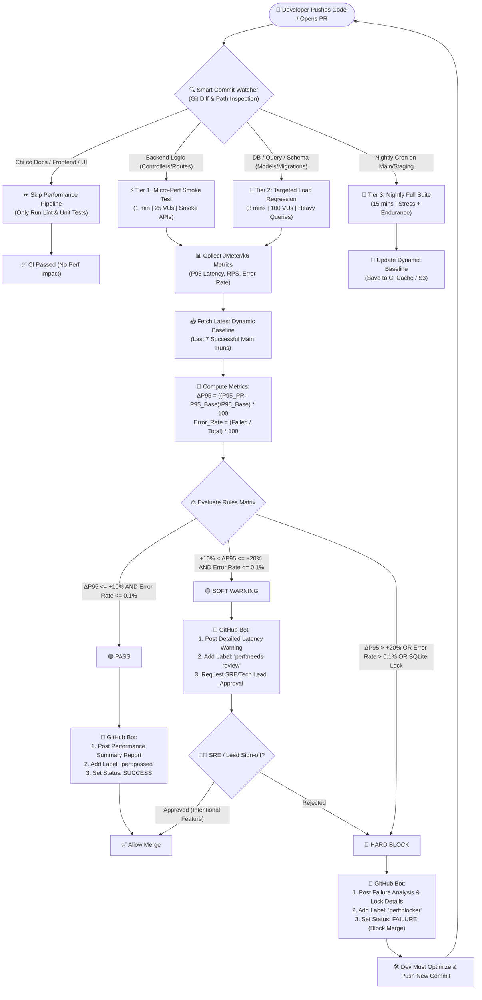

# Thiết Kế Mô Hình Continuous Performance Testing Pipeline
**Chuẩn đánh giá:** Bloom-AI G9.6 (Disrupt)  
**Hệ thống áp dụng:** EShop SUT (Node.js Express + SQLite)  
**Sinh viên thực hiện:** Ân Tiến Nguyên An — MSSV: 23127148  
**Môn học:** Kiểm thử phần mềm (Software Testing) — FIT @ HCMUS  

---

## 1. Tổng Quan & Mục Tiêu Kiến Trúc

Trong môi trường phát triển hiện đại với mô hình CI/CD liên tục, việc kiểm thử hiệu năng không thể bị cô lập ở giai đoạn cuối chu kỳ phát hành (Pre-release Bottleneck). Mô hình **Continuous Performance Testing Pipeline** được thiết kế nhằm mục tiêu:

- **Shift-Left Performance Testing:** Phát hiện sớm các vấn đề nghẽn cổ chai (bottlenecks), rò rỉ bộ nhớ (memory leaks) và xung đột ghi cơ sở dữ liệu (database write locks) ngay khi lập trình viên mở Pull Request (PR).
- **Zero Waste Compute:** Sử dụng cơ chế giám sát thông minh (Smart Commit Watcher) để lọc bỏ các thay đổi không ảnh hưởng runtime, phân tầng tài nguyên kiểm thử tối ưu.
- **Automated Gatekeeping:** Tự động chặn (Hard Block) hoặc cảnh báo (Soft Warning) khi chỉ số độ trễ phân vị 95 ($P95$) hoặc tỷ lệ lỗi ($E_R$) suy thoái so với Baseline động của hệ thống.

---

## 2. Cơ Chế Giám Sát Commit & Phân Tầng Trigger (Smart Watcher & Tiered Matrix)

Pipeline sử dụng **Path-Based Filtering & AST/Diff-Aware Analysis** để phân loại thay đổi trong git commit và kích hoạt tầng kiểm thử tương ứng.

### 2.1. Ma Trận Lọc Thay Đổi (Path-Based Filtering Matrix)

| Phân loại tệp thay đổi | Danh sách File / Thư mục (`Path Pattern`) | Hành vi Pipeline | Lý do kỹ thuật |
| :--- | :--- | :--- | :--- |
| **Bỏ qua hoàn toàn (Skip)** | `docs/**`, `*.md`, `frontend/**`, `public/**`, `.github/workflows/docs.yml` | ⏩ **Bỏ qua Perf Pipeline** (Chỉ chạy Lint/Unit tests) | Không tác động đến backend runtime logic hoặc database query. |
| **Backend Core Logic** | `src/controllers/**`, `src/routes/**`, `src/services/**`, `src/middlewares/**` | ⚡ **Kích hoạt Tier 1: Micro-Perf Smoke** | Ảnh hưởng trực tiếp đến thời gian xử lý CPU / Event loop của Node.js. |
| **Database & Heavy Query** | `src/models/**`, `src/db/**`, `migrations/**`, `prisma/**`, `*.sql` | 🎯 **Kích hoạt Tier 2: Targeted Load Regression** | Tiềm ẩn nguy cơ Full Table Scan, thiếu Index, hoặc SQLite Table Lock contention. |
| **Infra & Dependencies** | `package.json`, `Dockerfile`, `docker-compose.yml`, `ecosystem.config.js` | 🎯 **Kích hoạt Tier 2** + Alert Memory Check | Thay đổi phiên bản thư viện hoặc container limits có thể làm suy giảm RPS toàn cục. |
| **Scheduled / Merge to Main** | Nhánh `main`, `staging` (Chạy tự động lúc 02:00 AM) | 🌙 **Kích hoạt Tier 3: Nightly Full Suite** | Đo lường độ ổn định trường kỳ (Endurance) và tái chuẩn hóa Dynamic Baseline. |

---

### 2.2. Chiến Lược Kiểm Thử 3 Tầng (3-Tier Performance Testing Strategy)

```
┌─────────────────────────────────────────────────────────────────────────┐
│                      Tier 3: Nightly Full Suite                         │ ~15 mins
│           (Stress + Spike + Endurance 15 mins on Staging/Main)          │
├─────────────────────────────────────────────────────────────────────────┤
│                   Tier 2: Targeted Load Regression                      │ ~3 mins
│           (50-100 VUs - Focus on DB Queries & Write Contention)         │
├─────────────────────────────────────────────────────────────────────────┤
│                     Tier 1: Micro-Perf Smoke Test                       │ ~1 min
│              (10-25 VUs - Critical Paths on Every Backend PR)           │
└─────────────────────────────────────────────────────────────────────────┘
```

#### Tier 1: Micro-Perf Smoke Test (Thời lượng: ~1 phút — Mọi PR Backend)
- **Mục tiêu:** Bắt nhanh các lỗi nghiêm trọng (blocking sync calls, uncaught exceptions, cú pháp truy vấn sai).
- **Quy mô tải:** 10 – 25 VUs (Virtual Users), chạy trên 3 API huyết mạch:
  1. `GET /api/products` (Catalog listing / Cache check)
  2. `GET /api/products/:id` (Single product lookup)
  3. `POST /api/auth/login` (CPU-bound bcrypt/JWT check)
- **Môi trường:** Isolated In-Memory SQLite Test DB.

#### Tier 2: Targeted Load Regression (Thời lượng: ~3 phút — PR sửa Query / Schema / API)
- **Mục tiêu:** Đánh giá khả năng chịu tải của SQLite (đặc thù Single-Writer Lock) khi phát sinh thay đổi index hoặc complex queries.
- **Quy mô tải:** 50 – 100 VUs, ramp-up 30s, steady-state 2 phút.
- **Kịch bản phân bổ:**
  - 70% Read: `GET /api/products?search=...&category=...` (Tra cứu phức tạp)
  - 30% Write: `POST /api/cart/add` & `POST /api/orders` (Ghi đồng thời kiểm tra lock contention)

#### Tier 3: Nightly Full Performance Suite (Thời lượng: ~15 phút — Nightly on Staging)
- **Mục tiêu:** Phát hiện rò rỉ bộ nhớ (Memory Leak), phân mảnh DB (WAL growth), và xác định giới hạn quá tải (Breaking point).
- **Quy mô:** Kết hợp Load Test (200 VUs), Stress Test (50 → 250 VUs), Spike Test (đột biến x5 traffic), và Soak Test (chạy liên tục 15 phút).
- **Đầu ra:** Tái tạo và lưu trữ **Dynamic Baseline** chuẩn cho chu kỳ làm việc tiếp theo.

---

## 3. Quy Tắc Phát Hiện Hồi Quy Độ Trễ P95 (P95 Regression Detection Rules)

Khác với các ngưỡng tĩnh cố định (Static Hardcoded Thresholds) vốn gây báo động giả (*False Positives*) khi phần cứng CI biến động, hệ thống sử dụng cơ chế **Dynamic Baseline** kết hợp **Trimmed Moving Average**.

### 3.1. Công Thức Đo Lường

#### 1. Baseline Động ($P95_{\text{Baseline}}$):
Được tính từ trung bình có cắt tỉa (Trimmed Mean 10%) của $N = 7$ lần chạy thành công gần nhất trên nhánh `main`:
$$P95_{\text{Baseline}} = \text{TrimmedMean}_{10\%}\left(\{P95_{\text{run}_1}, P95_{\text{run}_2}, \dots, P95_{\text{run}_7}\}\right)$$

#### 2. Độ Lệch Hiệu Năng ($\Delta P95$):
$$\Delta P95(\%) = \left( \frac{P95_{\text{PR}} - P95_{\text{Baseline}}}{P95_{\text{Baseline}}} \right) \times 100\%$$

#### 3. Tỷ Lệ Lỗi (Error Rate - $E_R$):
$$E_R(\%) = \left( \frac{\sum \text{Failed Requests (5xx, Timeouts, SQLite Lock)}}{\sum \text{Total Requests}} \right) \times 100\%$$

---

### 3.2. Ma Trận Quyết Định (Gatekeeping Rules Matrix)

```
  Δ P95 (%)
     ▲
+30% ┼─────────────────────────────────────────── [ HARD BLOCK (PR FAILED) ]
     │   - PR bị khóa merge tự động
+20% ┼─────────────────────────────────────────── [ Ngưỡng Hard Block: > +20% ]
     │   - PR dán nhãn ⚠️ Performance Warning
     │   - Cần SRE / Tech Lead Override
+10% ┼─────────────────────────────────────────── [ Ngưỡng Soft Warning: +10% đến +20% ]
     │
  0% ┼─────────────────────────────────────────── [ PASS / HEALTHY: <= +10% ]
     │   - Tự động gắn nhãn 🚀 Perf Passed
-10% ┼─────────────────────────────────────────── [ FAST / IMPROVEMENT: < -10% ]
     ▼
```

| Phân loại (Verdict) | Điều kiện kích hoạt (Trigger Criteria) | Hành động của GitHub Bot (CI Bot Actions) | Trạng thái PR (Merge Gate) |
| :--- | :--- | :--- | :--- |
| 🟢 **PASS** | $\Delta P95 \le +10\%$ **VÀ** $E_R \le 0.1\%$ | • Post comment: Bảng tóm tắt kết quả so sánh với Baseline.<br>• Gán label: `perf:passed`.<br>• Set Status: `success`. | ✅ **Cho phép Merge** |
| 🟡 **SOFT WARNING** | $+10\% < \Delta P95 \le +20\%$ **VÀ** $E_R \le 0.1\%$ | • Post comment: Cảnh báo hồi quy nhẹ, liệt kê Top 3 Slowest Endpoints.<br>• Gán label: `perf:needs-review`.<br>• Yêu cầu phê duyệt từ **Tech Lead / SRE**. | ⚠️ **Yêu cầu Review/Override** |
| 🔴 **HARD BLOCK** | $\Delta P95 > +20\%$ **HOẶC** $E_R > 0.1\%$ **HOẶC** Phát sinh lỗi `SQLITE_BUSY` / `SQLITE_LOCKED` | • Post comment: Báo cáo lỗi hồi quy nghiêm trọng, đính kèm Trace Logs.<br>• Gán label: `perf:blocker`.<br>• Set Status: `failure` (Khóa nút Merge). | ❌ **Chặn Merge hoàn toàn** |

---

## 4. Sơ Đồ Luồng Quyết Định (Mermaid Flowchart)



---

## 5. Mẫu Báo Cáo Tự Động của GitHub Action Bot (PR Comment Template)

```markdown
### 🤖 Performance Test Results — PR #142 (Commit `a7b9f32`)

**Triggered Tier:** `Tier 2: Targeted Load Regression (3 mins)`  
**Target Environment:** Isolated Test Container (Node.js 20 + SQLite WAL Mode)

| Chỉ số (Metric) | Kết quả PR | Dynamic Baseline | Độ lệch (Delta) | Đánh giá |
| :--- | :--- | :--- | :--- | :--- |
| **Throughput (RPS)** | 485 req/s | 510 req/s | `-4.9%` | 🟢 Normal |
| **P95 Latency** | **312 ms** | **245 ms** | **`+27.3%`** | 🔴 **HARD BLOCK** |
| **P99 Latency** | 580 ms | 410 ms | `+41.4%` | 🔴 Critical |
| **Error Rate** | 0.00% | 0.00% | `0.0%` | 🟢 Clean |
| **SQLite Lock Wait** | 14 errors | 0 errors | `+14` | 🔴 Contention |

---

### 🚨 Phân Tích Nguyên Nhân Nghẽn (Bottleneck Root-Cause):
1. **Endpoint Vi Phạm:** `POST /api/orders` phát sinh độ trễ P95 tăng vọt lên **312ms** do câu truy vấn cập nhật tồn kho thiếu Index và giữ Transaction quá lâu trên file SQLite DB.
2. **Khuyến Nghị Khắc Phục:**
   - Đảm bảo bảng `orders` và `products` đã được đánh Index trên `category_id` và `product_id`.
   - Sử dụng `db.pragma('journal_mode = WAL');` để tăng hiệu năng đọc/ghi đồng thời.
   - Giảm thiểu thời gian giữ Write Lock trong transaction.

> ⛔ **Merge Gate Status:** **FAILED**. Pull Request bị chặn tự động cho đến khi các vấn đề hiệu năng trên được khắc phục.
```
