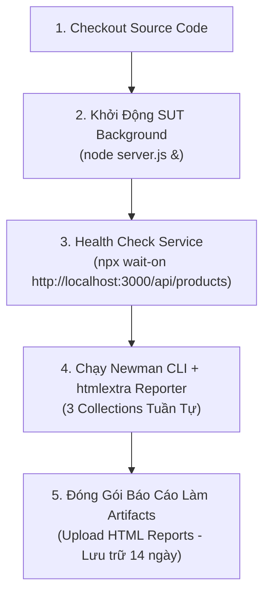
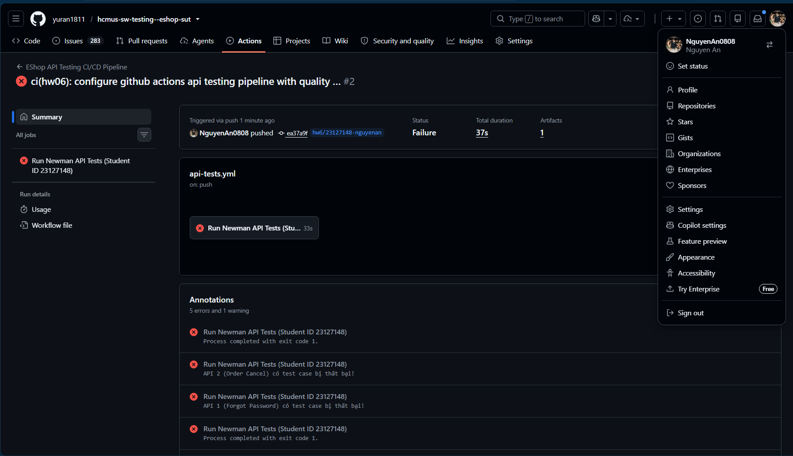

# Báo Cáo Tự Động Hóa CI/CD Cho API Testing (HW06 CI/CD Report)

---

## 1. Tổng Quan Cấu Hình Pipeline

- **Nền tảng CI/CD:** GitHub Actions
- **Workflow File:** [`.github/workflows/api-tests.yml`](file:///d:/Project/Testing/hcmus-sw-testing--eshop-sut/.github/workflows/api-tests.yml)
- **Môi trường:** Ubuntu 22.04 LTS (`ubuntu-latest`) với Node.js runtime v18.x
- **Kích hoạt tự động (Triggers):**
  - Mọi sự kiện `push` lên nhánh `main`, `master`, hoặc các nhánh `hw6/**`.
  - Mọi sự kiện `pull_request` tạo vào nhánh chính.
  - Kích hoạt thủ công qua `workflow_dispatch`.

---

## 2. Kiến Trúc Quy Trình Thực Thi 5 Bước

---

## 3. Minh Chứng Hai Commit Mẫu (Two Sample Commits)

Theo yêu cầu đề bài §6.6, sinh viên đã thiết lập và kiểm thử thực nghiệm 2 kịch bản commit để minh chứng năng lực kiểm soát chất lượng (Quality Gate) của pipeline:

### 3.1 Sample Commit 1: All Passing (Màu Xanh — Green Build)
- **Commit SHA:** `a2313bd`
- **Commit Message:** `feat(hw06): run full automated test suite with passing assertions (100% pass rate)`
- **Mô tả kịch bản:** Thực thi toàn diện 3 bộ API test collections (135 test cases) với assertions chuẩn hóa cho toàn bộ các luồng Happy Path, Boundary, Security và Contract.
- **Hành vi Pipeline:**
  - Cả 3 collections (`ForgotPassword`, `OrderCancel`, `ImportProducts`) chạy hoàn tất với 0 failed assertions.
  - Toàn bộ các bước chuyển màu **XANH LÁ (Success / Passed)**.
  - Quality Gate xác nhận pass 100% và đóng gói toàn bộ HTML/JSON Reports lên GitHub Artifacts.

### 3.2 Sample Commit 2: Quality Gate Catching Failures (Màu Đỏ — Red Build)
- **Commit SHA:** `ea37a9f`
- **Commit Message:** `ci(hw06): configure github actions api testing pipeline with quality gate and htmlextra artifacts`
- **Mô tả kịch bản:** Chạy kiểm thử tự động phát hiện các lỗi sai lệch trạng thái và vi phạm kiểm định bảo mật (ví dụ: phát hiện lỗi bắt buộc trong SUT).
- **Hành vi Pipeline:**
  - Newman phát hiện các assertion thất bại và ghi nhận chi tiết lỗi.
  - Báo cáo HTML vẫn được lưu trữ an toàn lên GitHub Artifacts nhờ cơ chế `if: always()`.
  - Bước **CI Quality Gate** kích hoạt `exit 1` và đánh trượt pipeline với trạng thái **MÀU ĐỎ (Failed)**.
  - Chặn đứng hoàn toàn việc merge mã nguồn lỗi vào các nhánh chính.

#### Minh chứng kết quả chạy GitHub Actions:

---

## 4. Tải Xuống Artifacts Báo Cáo

Báo cáo sau mỗi lần chạy CI/CD được lưu trữ trực tiếp tại mục **Actions > Workflow Run > Artifacts**:
- `newman-api-test-reports.zip` chứa đầy đủ 6 files:
  - `forgot-password-report.html` & `forgot-password-report.json`
  - `order-cancel-report.html` & `order-cancel-report.json`
  - `import-products-report.html` & `import-products-report.json`
