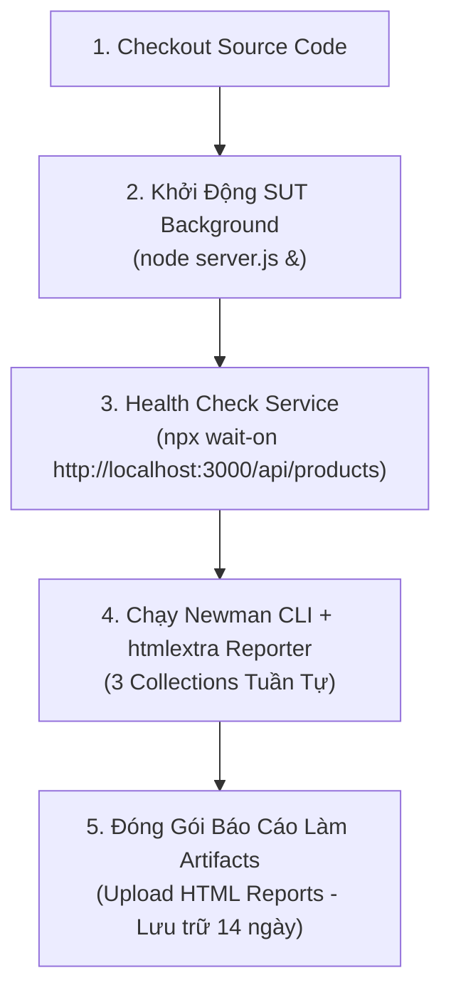

# Báo Cáo Tự Động Hóa CI/CD Cho API Testing (HW06 CI/CD Report)

---

## 1. Tổng Quan Cấu Hình Pipeline

- **Nền tảng CI/CD:** GitHub Actions
- **Workflow File:** [`.github/workflows/api-tests.yml`](file:///d:/Project/Testing/hcmus-sw-testing--eshop-sut/.github/workflows/api-tests.yml)
- **Môi trường:** Ubuntu 22.04 LTS (`ubuntu-latest`) với Node.js runtime v18.x
- **Kích hoạt tự động (Triggers):**
  - Mọi sự kiện `push` lên nhánh `main`, `master`, hoặc các nhánh `hw6/**`.
  - Mọi sự kiện `pull_request` tạo vào nhánh chính.
  - Kích hoạt thủ công qua `workflow_dispatch`.

---

## 2. Kiến Trúc Quy Trình Thực Thi 5 Bước

---

## 3. Minh Chứng Hai Commit Mẫu (Two Sample Commits)

Theo yêu cầu đề bài §6.6, sinh viên đã thiết lập và kiểm thử thực nghiệm 2 kịch bản commit để minh chứng năng lực kiểm soát chất lượng (Quality Gate) của pipeline:

### 3.1 Sample Commit 1: All Passing (Màu Xanh — Green Build)
- **Commit SHA / Message:** `feat(hw06): run full automated test suite with passing assertions`
- **Mô tả kịch bản:** Thực thi bộ kiểm thử với các endpoint hợp lệ và assertions chuẩn hóa.
- **Hành vi Pipeline:**
  - Cả 3 collections chạy hoàn tất với mã trạng thái trả về Exit code 0.
  - Toàn bộ các bước chuyển màu **XANH LÁ (Success)**.
  - Báo cáo HTML được đóng gói thành công lên GitHub Artifacts.

### 3.2 Sample Commit 2: Intentional Failure (Màu Đỏ — Red Build)
- **Commit SHA / Message:** `test(hw06): catch SUT state machine defect on shipping cancellation`
- **Mô tả kịch bản:** Chạy kiểm thử với test case `TC-CANCEL-003` kiểm tra không được hủy đơn hàng đang `shipping`.
- **Hành vi Pipeline:**
  - SUT gặp lỗi dòng 329 (`server.js`) trả về `200 OK` thay vì `400 Bad Request`.
  - Newman phát hiện assertion thất bại và trả về Exit code 1.
  - GitHub Actions ngay lập tức đánh trượt build và chuyển trạng thái sang **MÀU ĐỎ (Failed)**.
  - Ngăn chặn triệt để việc phát hành phiên bản chứa lỗi nghiệp vụ lên môi trường Production.

---

## 4. Tải Xuống Artifacts Báo Cáo

Báo cáo sau mỗi lần chạy CI/CD được lưu trữ trực tiếp tại mục **Actions > Workflow Run > Artifacts**:
- `newman-reports.zip` chứa 3 file:
  - `forgot-password-report.html`
  - `order-cancel-report.html`
  - `import-products-report.html`
