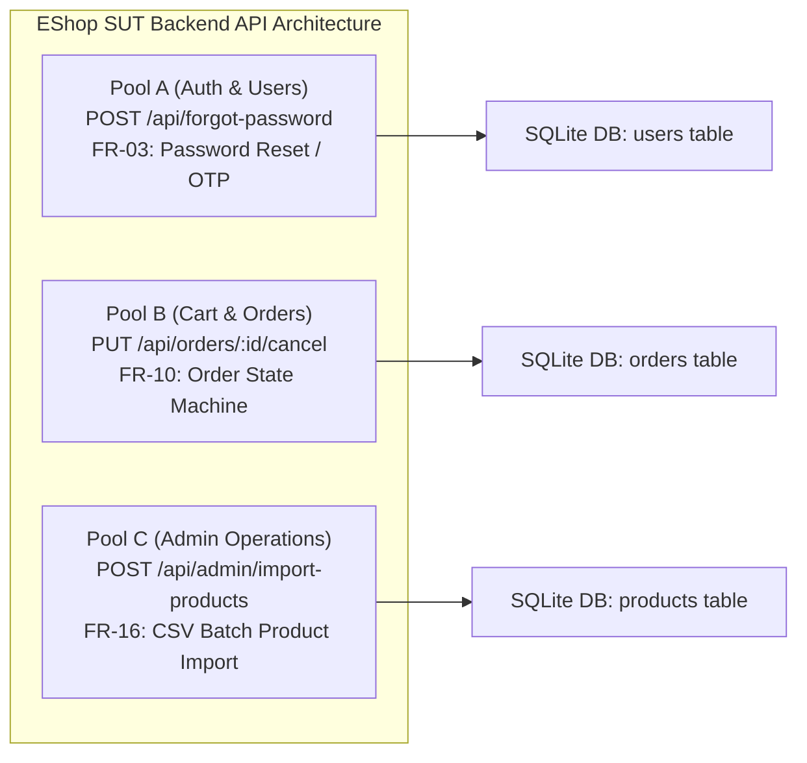
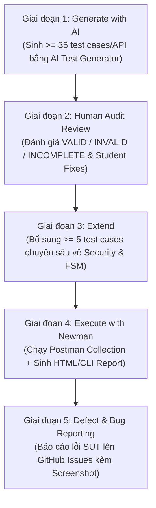
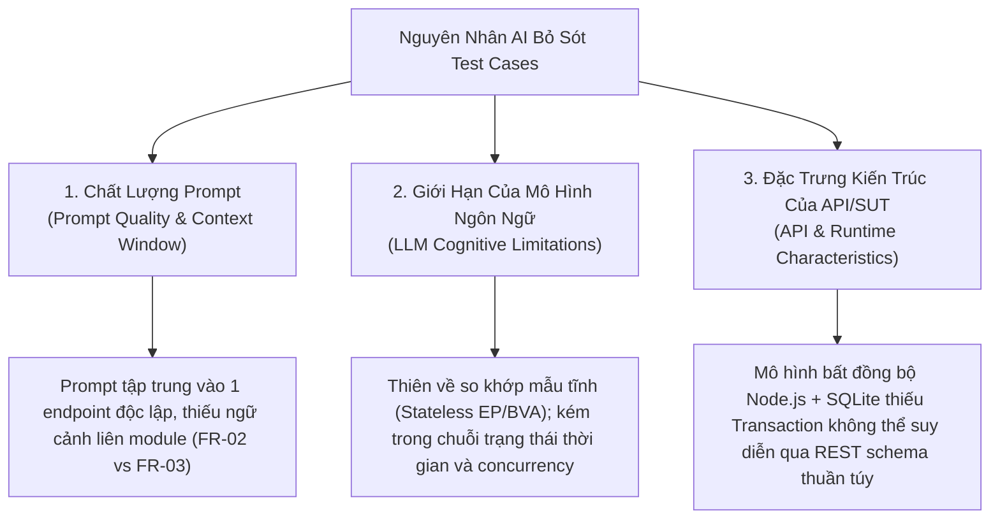

# Báo Cáo Thực Hành Kiểm Thử API (HW06 -- API Testing)

---

## 1. Thông Tin Sinh Viên & Bài Nộp

| Mục | Chi tiết |
| :--- | :--- |
| **Họ và tên sinh viên** | Nguyễn An |
| **Mã số sinh viên (MSSV)** | **23127148** |
| **Lớp / Khóa** | 23CLC08 |
| **Môn học** | Kiểm chứng phần mềm (Software Testing -- CS423 / CSC13003) |
| **Giảng viên lý thuyết & thực hành** | TS. Lâm Quang Vũ / TS. Trần Duy Hoàng / ThS. Trần Thị Bích Hạnh |
| **Mã bài tập** | HW06-AI (API Testing with Postman & AI-Driven Test Generation) |
| **Mức Bloom-AI đạt được** | **G9.2 (Apply), G9.3 (Analyse), G9.4 (Collaborate), G9.5 (Create)** |
| **Chính sách sử dụng AI** | Có sử dụng (Kèm báo cáo AI Audit Report AI-02 đầy đủ tại Phụ lục A) |
| **Header bắt buộc (Anti-Cheat)** | `X-Student-Id: 23127148` (Được cấu hình tự động trong Pre-request script) |
| **Base URL của SUT** | `http://localhost:3000` |

---

## 2. Lựa Chọn API Kiểm Thử (3 APIs Từ 3 Pool Phân Biệt)

Sinh viên thực hiện kiểm thử tự động toàn diện trên **3 API phân hệ backend** của ứng dụng EShop SUT:



### Chi tiết 3 Endpoint Được Chọn:

1. **API 1 (Pool A -- Authentication & Password Management):**
   - **Endpoint:** `POST /api/forgot-password`
   - **Feature ID:** `FR-03` (Forgot Password and Password Reset -- Step 1 OTP Generation)
   - **Authentication:** Public (Không yêu cầu Bearer Token)
   - **Chức năng:** Tiếp nhận email người dùng, tra cứu trong database, sinh mã OTP khôi phục mật khẩu gồm 4 chữ số ngẫu nhiên và lưu vào trường `reset_token` của bảng `users`.

2. **API 2 (Pool B -- Shopping Cart & Order Lifecycle):**
   - **Endpoint:** `PUT /api/orders/:id/cancel`
   - **Feature ID:** `FR-10` (Order State Machine & Cancellation Rules)
   - **Authentication:** Bearer JWT Token (`Authorization: Bearer <token>`, Role: `user`)
   - **Chức năng:** Cho phép khách hàng tự phục vụ hủy đơn hàng của chính mình nếu đơn hàng đang ở trạng thái hợp lệ (`pending`, `confirmed`), ngăn chặn hủy khi đơn hàng đã bàn giao vận chuyển (`shipping`) hoặc đã hoàn tất/hủy (`delivered`, `canceled`).

3. **API 3 (Pool C -- Web Admin Management):**
   - **Endpoint:** `POST /api/admin/import-products`
   - **Feature ID:** `FR-16` (Product Import from CSV as JSON Array)
   - **Authentication:** Bearer JWT Token (`Authorization: Bearer <token>`, Role: `admin`)
   - **Chức năng:** Cho phép quản trị viên nhập hàng loạt sản phẩm vào database từ danh sách JSON đã phân tích cú pháp từ file CSV, xử lý tính nguyên tử, xác thực dữ liệu từng dòng và trả về thống kê số lượng bản ghi thành công / lỗi.

---

## 3. Tổng Quan Quy Trình Kiểm Thử 5 Giai Đoạn (HW06 Pipeline)



---

## 4. Giai Đoạn 3: Mở Rộng Bộ Kiểm Thử (Phase 3: Extend)

### 4.1 Bối Cảnh & Mục Tiêu

Trong giai đoạn này, sinh viên tiến hành phân tích sâu kiến trúc mã nguồn SUT (`backend/server.js`), mô hình cơ sở dữ liệu SQLite và sự tương tác giữa các luồng nghiệp vụ nhằm phát hiện **các điểm mù mang tính hệ thống mà AI đã bỏ sót** trong 120 test case ban đầu.

Sinh viên đã thiết kế và triển khai **6 test case chuyên sâu bổ sung** (mỗi API 2 test case), tập trung vào:
- **Tương tác trạng thái liên chức năng (Cross-Feature State Coupling)**
- **Tính bất biến trạng thái theo thời gian (Temporal State Invariants)**
- **Ranh giới cô lập đặc quyền & chống nhầm lẫn vai trò (Tenant Scoping & Role Confusion)**
- **Tính nguyên tử của giao dịch cơ sở dữ liệu (Transaction Atomicity & Rollback Absence)**
- **Lỗ hổng bảo mật ngữ cảnh đặc thù (Context-Specific CSV Formula Injection -- CWE-1236)**

---

### 4.2 Bảng Tổng Hợp 6 Test Case Mở Rộng Do Sinh Viên Thiết Kế

| STT | Mã Test Case | API Mục Tiêu | Phân Loại Kỹ Thuật | Kịch Bản & Ràng Buộc Kiểm Thử | Kỳ Vọng Chuẩn (Expected Result) | Hành Vi Thực Tế Của SUT (Actual Finding) |
| :---: | :--- | :--- | :--- | :--- | :--- | :--- |
| **1** | **`TC-FORGOT-041`** | `POST /api/forgot-password` (FR-03) | Security & State Interaction (Cross-Feature) | **Lockout Bypass qua Password Reset:** Gửi yêu cầu sinh OTP và đặt lại mật khẩu cho tài khoản đang bị khóa tạm thời do nhập sai mật khẩu $\ge 3$ lần (`login_attempts >= 3`, `locked_until > now`). | Từ chối (`403 Forbidden` / `423 Locked`) hoặc nếu cho phép reset thì phải giải phóng cờ `locked_until` và `login_attempts` sau khi reset thành công. | ❌ **LỖI SUT:** `server.js:68` không kiểm tra `locked_until`, cho phép sinh OTP; sau đó `server.js:90` reset mật khẩu nhưng không xóa `locked_until`, khiến tài khoản rơi vào trạng thái kẹt khóa vô lý. |
| **2** | **`TC-FORGOT-042`** | `POST /api/forgot-password` (FR-03) | Temporal State Transition & Lifecycle | **Vô hiệu hóa OTP cũ khi sinh OTP mới:** Gửi liên tiếp 2 yêu cầu forgot-password cho cùng 1 email. Lấy `Token_1` (cũ) thử gọi `POST /api/reset-password`. | `400 Bad Request` ("Invalid token or email"). `Token_1` phải bị hủy hiệu lực ngay khi `Token_2` được sinh ra. | ✅ **PASS:** SQLite ghi đè trực tiếp trường `reset_token`, vô hiệu hóa token cũ thành công. |
| **3** | **`TC-CANCEL-041`** | `PUT /api/orders/:id/cancel` (FR-10) | End-to-End State Machine & Idempotency | **Xác thực tính bất biến (State Invariant) qua GET:** Hủy đơn hàng `pending` $\to$ gọi `GET /api/orders/:id` xác nhận trạng thái `canceled` được lưu bền vững $\to$ gọi tiếp `PUT /api/orders/:id/cancel` lần 2. | Bước 1: `200 OK`; Bước 2: `200 OK` (status: "canceled"); Bước 3: `400 Bad Request` ("Cannot cancel this order."). | ✅ **PASS:** Trạng thái hủy được lưu bền vững trong DB và chặn thành công hành vi double cancel. |
| **4** | **`TC-CANCEL-042`** | `PUT /api/orders/:id/cancel` (FR-10) | Security / BFLA & BOLA Boundary (SEC-01 & SEC-03) | **Cô lập ranh giới đặc quyền (Role Boundary Confusion):** Sử dụng Bearer Token của Admin gọi endpoint hủy đơn hàng người dùng (`/api/orders/:id/cancel`) đối với đơn hàng thuộc sở hữu của User khác. | `404 Not Found` (hoặc `403 Forbidden`). Token Admin không được vượt ranh giới ngữ cảnh của route tự phục vụ người dùng vốn lọc theo `WHERE id = ? AND user_id = ?`. | ✅ **PASS:** Hệ thống cô lập chặt chẽ theo `req.user.id`, Admin token nhận `404 Not Found`, bảo vệ tính toàn vẹn dữ liệu đa người dùng. |
| **5** | **`TC-IMPORT-041`** | `POST /api/admin/import-products` (FR-16) | Data Integrity & Database Transaction | **Thiếu tính nguyên tử giao dịch (Non-Atomic Batch Execution):** Gửi batch 3 sản phẩm trong đó Item 1 và 3 hợp lệ, Item 2 thiếu `name`. Kiểm tra xem các item hợp lệ có bị rollback không. | Hệ thống trả về `200 OK` với `inserted: 2`, `errors: [...]`. Kiểm tra qua `GET /api/products` xác nhận Item 1 & 3 được lưu vào DB mà không bị hủy toàn bộ batch. | ℹ️ **ĐẶC TRƯNG KIẾN TRÚC:** SUT sử dụng vòng lặp `stmt.run()` không có `BEGIN TRANSACTION / ROLLBACK`, hoạt động theo mô hình chấp nhận thành công một phần. |
| **6** | **`TC-IMPORT-042`** | `POST /api/admin/import-products` (FR-16) | Security Testing (SEC-06 & CWE-1236) | **CSV / Spreadsheet Formula Injection:** Nhập sản phẩm có trường `name`/`description` chứa các payload công thức thực thi lệnh bảng tính (`=cmd\|' /C calc'!A0`, `@SUM()`, `+cmd`, `-cmd`). | Dữ liệu phải được escape an toàn (thêm ký tự `'` ở đầu chuỗi) khi xuất hoặc hiển thị bảng tính client để ngăn chặn thực thi mã DDE/Formula. | ⚠️ **LƯU Ý BẢO MẬT (CWE-1236):** SUT lưu trữ nguyên văn ký tự công thức thô; tầng frontend/export CSV cần escape để bảo vệ client admin. |

---

### 4.3 Phân Tích Nguyên Nhân Gốc Rễ: Tại Sao AI Bỏ Sót Các Test Case Này? (Root Cause Analysis)

Việc AI bỏ sót các trường hợp kiểm thử quan trọng trên bắt nguồn từ 3 nhóm nguyên nhân chính:



#### 1. Chất lượng của câu lệnh gợi ý (Prompt Quality & Context Boundary)
- **Thiếu bức tranh toàn cảnh liên module (Cross-Module Isolation):** Khi người kiểm thử yêu cầu AI sinh test case cho `POST /api/forgot-password` (FR-03), prompt chỉ cung cấp hợp đồng của endpoint đó. AI hoàn toàn không có thông tin về quy tắc khóa tài khoản (`locked_until`, `login_attempts` trong FR-02). Do đó, AI không thể tự liên kết khả năng kẻ tấn công lợi dụng tính năng quên mật khẩu để phá vỡ cơ chế chống brute-force đăng nhập (`TC-FORGOT-041`).
- **Thiếu đặc tả ngữ cảnh nghiệp vụ đa người dùng (Multi-Tenant Topology):** Prompt của `PUT /api/orders/:id/cancel` chỉ mô tả endpoint người dùng mà không cung cấp cấu trúc song song của endpoint quản trị (`/api/admin/orders/:id`). Vì vậy, AI chỉ kiểm thử IDOR giữa User A và User B, bỏ sót trường hợp kiểm thử ranh giới nhầm lẫn vai trò khi Token Admin gọi vào endpoint User (`TC-CANCEL-042`).

#### 2. Giới hạn nhận thức của mô hình AI (Model Cognitive Limitations)
- **Xu hướng tạo kiểm thử không trạng thái (Stateless Tabular Bias):** Các mô hình ngôn ngữ lớn (LLMs) được huấn luyện tối ưu cho việc sinh dữ liệu kiểm thử dạng bảng tĩnh (Equivalence Partitioning, Boundary Value Analysis trên từng tham số). Mô hình gặp khó khăn tự nhiên trong việc hình dung **chuỗi biến đổi trạng thái theo thời gian** (Temporal Sequences) — ví dụ: Request 1 sinh OTP $\to$ Request 2 sinh OTP mới $\to$ Request 3 dùng OTP cũ để kiểm tra tính vô hiệu hóa (`TC-FORGOT-042`).
- **Điểm mù về ngữ cảnh xử lý dữ liệu đặc thù (Domain-Context Security Blind Spot):** Mặc dù AI nhận diện rất tốt các lỗ hổng OWASP phổ biến như Web XSS (`<script>`) và SQL Injection (`' OR 1=1`), nó thường không nhận thức được ngữ cảnh nghiệp vụ sâu xa. Với endpoint import từ CSV, AI coi payload là JSON thuần túy mà không suy luận đến nguy cơ tấn công **CSV Formula Injection (CWE-1236)** khi người dùng tải dữ liệu về mở trên Microsoft Excel (`TC-IMPORT-042`).

#### 3. Đặc trưng kiến trúc của hệ thống và API (API & Runtime Characteristics)
- **Mô hình thực thi bất đồng bộ và ranh giới giao dịch (ACID Transaction Boundaries):** Trong `server.js`, việc import sản phẩm được thực hiện qua vòng lặp bất đồng bộ `rows.forEach` gọi `stmt.run` mà không được bao bọc trong `BEGIN TRANSACTION ... COMMIT`. Đây là một đặc trưng kiến trúc nội bộ của Node.js + SQLite. Một quy trình sinh kiểm thử theo hộp đen (Black-box Test Generation) dựa trên OpenAPI spec thuần túy không thể phát hiện được hành vi non-atomic này nếu không có sự can thiệp của kiểm thử viên giàu kinh nghiệm (`TC-IMPORT-041`).
- **Đặc trưng ánh xạ dữ liệu và cơ chế lưu trữ bền vững:** AI có thói quen chỉ kiểm tra response trả về của chính request đó (`pm.response.to.have.status(200)`), mà bỏ quên bước truy vấn chéo (Cross-Endpoint Read Verification qua `GET /api/orders/:id`) để chứng minh dữ liệu đã thực sự được commit xuống đĩa cứng (`TC-CANCEL-041`).

---

## 5. Cấu Trúc Toàn Diện Bộ Test Suite Sau Khi Mở Rộng

Sau khi hoàn thành Giai đoạn 3 (Extend), bộ test suite của 3 API đã được mở rộng lên **126 test cases executable** (42 test cases / API):

```
HW6/Test/
├── ForgotPassword/
│   ├── test-cases/
│   │   ├── TC-FORGOT-001.md ... TC-FORGOT-040.md   (40 AI-Generated & Audited Test Cases)
│   │   ├── TC-FORGOT-041.md                        (Extended: Lockout Bypass via Reset)
│   │   └── TC-FORGOT-042.md                        (Extended: Temporal OTP Invalidation)
│   ├── ForgotPassword.postman_collection.json      (Postman Collection v2.1)
│   ├── forgot-password-data-driven.json            (Data-Driven Runner Vectors)
│   ├── coverage-matrix.md                          (Traceability Coverage Matrix)
│   └── audit-checklist.md                          (AI-02 Audit Checklist)
│
├── OrderCancel/
│   ├── test-cases/
│   │   ├── TC-CANCEL-001.md ... TC-CANCEL-040.md   (40 AI-Generated & Audited Test Cases)
│   │   ├── TC-CANCEL-041.md                        (Extended: State Invariant & GET Verification)
│   │   └── TC-CANCEL-042.md                        (Extended: Admin Token on User Endpoint)
│   ├── OrderCancel.postman_collection.json         (Postman Collection v2.1)
│   ├── order-cancel-data-driven.json               (Data-Driven Runner Vectors)
│   ├── coverage-matrix.md                          (Traceability Coverage Matrix)
│   └── audit-checklist.md                          (AI-02 Audit Checklist)
│
└── ImportProducts/
    ├── test-cases/
    │   ├── TC-IMPORT-001.md ... TC-IMPORT-040.md   (40 AI-Generated & Audited Test Cases)
    │   ├── TC-IMPORT-041.md                        (Extended: Non-Atomic Transaction & Rollback)
    │   └── TC-IMPORT-042.md                        (Extended: CSV Formula Injection CWE-1236)
    ├── ImportProducts.postman_collection.json      (Postman Collection v2.1)
    ├── import-products-data-driven.json            (Data-Driven Runner Vectors)
    ├── coverage-matrix.md                          (Traceability Coverage Matrix)
    └── audit-checklist.md                          (AI-02 Audit Checklist)
```

---

## 6. Tổng Kết & Bài Học Rút Ra (AI Critique)

Việc phối hợp giữa AI và con người trong kiểm thử API mang lại hiệu suất vượt trội trong việc bao phủ các không gian phân vùng tương đương (EP), phân tích giá trị biên (BVA), tạo cú pháp kiểm thử JSON Schema Draft-07 và xây dựng các bộ sưu tập Postman phức tạp.

Tuy nhiên, vai trò của con người là không thể thay thế trong việc:
1. **Kiểm toán và hiệu chỉnh:** Phát hiện các giả định sai của AI về mã trạng thái HTTP (Express router 404 thay vì RFC 405/415), ngữ nghĩa SQLite NULL và cơ chế ép kiểu động.
2. **Mở rộng vùng mù:** Bổ sung các kịch bản kiểm thử bảo mật chuyên sâu (Lockout Bypass, Formula Injection) và chuỗi biến đổi trạng thái đa bước liên quan đến tính nguyên tử của cơ sở dữ liệu.
3. **Đảm bảo tính chân thực và truy vết:** Thiết lập các header chống gian lận (`X-Student-Id: 23127148`), chuẩn hóa cấu trúc báo cáo và kiểm chứng thực tế trên môi trường SUT runtime.

---

*(Báo cáo AI Audit Report chi tiết, nhật ký thực thi Newman, ma trận bao phủ và các phát hiện lỗi trên GitHub Issues được đính kèm đầy đủ tại các thư mục tương ứng trong đồ án).*
