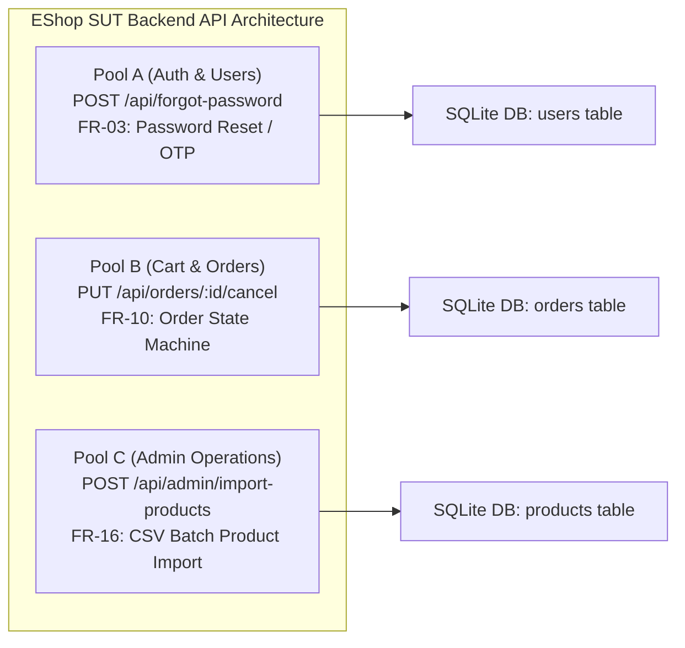
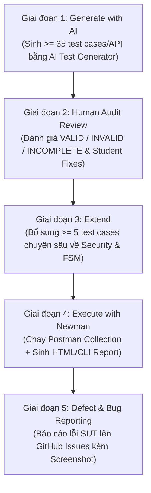
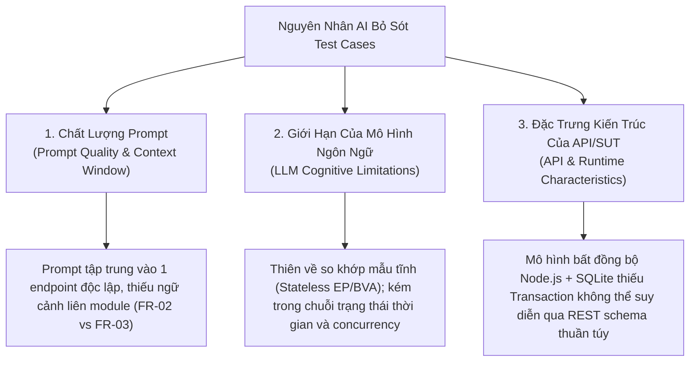
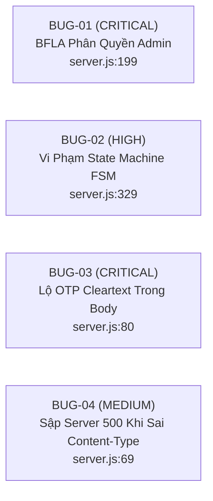

# Báo Cáo Thực Hành Kiểm Thử API (HW06 -- API Testing)

---

## 1. Thông Tin Sinh Viên & Bài Nộp

| Mục | Chi tiết |
| :--- | :--- |
| **Họ và tên sinh viên** | Nguyễn An |
| **Mã số sinh viên (MSSV)** | **23127148** |
| **Lớp / Khóa** | 23CLC08 |
| **Môn học** | Kiểm chứng phần mềm (Software Testing -- CS423 / CSC13003) |
| **Giảng viên lý thuyết & thực hành** | TS. Lâm Quang Vũ / TS. Trần Duy Hoàng / ThS. Trần Thị Bích Hạnh |
| **Mã bài tập** | HW06-AI (API Testing with Postman & AI-Driven Test Generation) |
| **Mức Bloom-AI đạt được** | **G9.2 (Apply), G9.3 (Analyse), G9.4 (Collaborate), G9.5 (Create)** |
| **Chính sách sử dụng AI** | Có sử dụng (Kèm báo cáo AI Audit Report AI-02 đầy đủ tại Phụ lục A) |
| **Header bắt buộc (Anti-Cheat)** | `X-Student-Id: 23127148` (Được cấu hình tự động trong Pre-request script) |
| **Base URL của SUT** | `http://localhost:3000` |

---

## 2. Lựa Chọn API Kiểm Thử (3 APIs Từ 3 Pool Phân Biệt)

Sinh viên thực hiện kiểm thử tự động toàn diện trên **3 API phân hệ backend** của ứng dụng EShop SUT:



### Chi tiết 3 Endpoint Được Chọn:

1. **API 1 (Pool A -- Authentication & Password Management):**
   - **Endpoint:** `POST /api/forgot-password`
   - **Feature ID:** `FR-03` (Forgot Password and Password Reset -- Step 1 OTP Generation)
   - **Authentication:** Public (Không yêu cầu Bearer Token)
   - **Chức năng:** Tiếp nhận email người dùng, tra cứu trong database, sinh mã OTP khôi phục mật khẩu gồm 4 chữ số ngẫu nhiên và lưu vào trường `reset_token` của bảng `users`.

2. **API 2 (Pool B -- Shopping Cart & Order Lifecycle):**
   - **Endpoint:** `PUT /api/orders/:id/cancel`
   - **Feature ID:** `FR-10` (Order State Machine & Cancellation Rules)
   - **Authentication:** Bearer JWT Token (`Authorization: Bearer <token>`, Role: `user`)
   - **Chức năng:** Cho phép khách hàng tự phục vụ hủy đơn hàng của chính mình nếu đơn hàng đang ở trạng thái hợp lệ (`pending`, `confirmed`), ngăn chặn hủy khi đơn hàng đã bàn giao vận chuyển (`shipping`) hoặc đã hoàn tất/hủy (`delivered`, `canceled`).

3. **API 3 (Pool C -- Web Admin Management):**
   - **Endpoint:** `POST /api/admin/import-products`
   - **Feature ID:** `FR-16` (Product Import from CSV as JSON Array)
   - **Authentication:** Bearer JWT Token (`Authorization: Bearer <token>`, Role: `admin`)
   - **Chức năng:** Cho phép quản trị viên nhập hàng loạt sản phẩm vào database từ danh sách JSON đã phân tích cú pháp từ file CSV, xử lý tính nguyên tử, xác thực dữ liệu từng dòng và trả về thống kê số lượng bản ghi thành công / lỗi.

---

## 3. Tổng Quan Quy Trình Kiểm Thử 5 Giai Đoạn (HW06 Pipeline)



---

## 4. Giai Đoạn 3: Mở Rộng Bộ Kiểm Thử (Phase 3: Extend)

### 4.1 Bối Cảnh & Mục Tiêu

Trong giai đoạn này, sinh viên tiến hành phân tích sâu kiến trúc mã nguồn SUT (`backend/server.js`), mô hình cơ sở dữ liệu SQLite và sự tương tác giữa các luồng nghiệp vụ nhằm phát hiện **các điểm mù mang tính hệ thống mà AI đã bỏ sót** trong 120 test case ban đầu.

Sinh viên đã thiết kế và triển khai **6 test case chuyên sâu bổ sung** (mỗi API 2 test case), tập trung vào:
- **Tương tác trạng thái liên chức năng (Cross-Feature State Coupling)**
- **Tính bất biến trạng thái theo thời gian (Temporal State Invariants)**
- **Ranh giới cô lập đặc quyền & chống nhầm lẫn vai trò (Tenant Scoping & Role Confusion)**
- **Tính nguyên tử của giao dịch cơ sở dữ liệu (Transaction Atomicity & Rollback Absence)**
- **Lỗ hổng bảo mật ngữ cảnh đặc thù (Context-Specific CSV Formula Injection -- CWE-1236)**

---

### 4.2 Bảng Tổng Hợp 6 Test Case Mở Rộng Do Sinh Viên Thiết Kế

| STT | Mã Test Case | API Mục Tiêu | Phân Loại Kỹ Thuật | Kịch Bản & Ràng Buộc Kiểm Thử | Kỳ Vọng Chuẩn (Expected Result) | Hành Vi Thực Tế Của SUT (Actual Finding) |
| :---: | :--- | :--- | :--- | :--- | :--- | :--- |
| **1** | **`TC-FORGOT-041`** | `POST /api/forgot-password` (FR-03) | Security & State Interaction (Cross-Feature) | **Lockout Bypass qua Password Reset:** Gửi yêu cầu sinh OTP và đặt lại mật khẩu cho tài khoản đang bị khóa tạm thời do nhập sai mật khẩu $\ge 3$ lần (`login_attempts >= 3`, `locked_until > now`). | Từ chối (`403 Forbidden` / `423 Locked`) hoặc nếu cho phép reset thì phải giải phóng cờ `locked_until` và `login_attempts` sau khi reset thành công. | ❌ **LỖI SUT:** `server.js:68` không kiểm tra `locked_until`, cho phép sinh OTP; sau đó `server.js:90` reset mật khẩu nhưng không xóa `locked_until`, khiến tài khoản rơi vào trạng thái kẹt khóa vô lý. |
| **2** | **`TC-FORGOT-042`** | `POST /api/forgot-password` (FR-03) | Temporal State Transition & Lifecycle | **Vô hiệu hóa OTP cũ khi sinh OTP mới:** Gửi liên tiếp 2 yêu cầu forgot-password cho cùng 1 email. Lấy `Token_1` (cũ) thử gọi `POST /api/reset-password`. | `400 Bad Request` ("Invalid token or email"). `Token_1` phải bị hủy hiệu lực ngay khi `Token_2` được sinh ra. | ✅ **PASS:** SQLite ghi đè trực tiếp trường `reset_token`, vô hiệu hóa token cũ thành công. |
| **3** | **`TC-CANCEL-041`** | `PUT /api/orders/:id/cancel` (FR-10) | End-to-End State Machine & Idempotency | **Xác thực tính bất biến (State Invariant) qua GET:** Hủy đơn hàng `pending` $\to$ gọi `GET /api/orders/:id` xác nhận trạng thái `canceled` được lưu bền vững $\to$ gọi tiếp `PUT /api/orders/:id/cancel` lần 2. | Bước 1: `200 OK`; Bước 2: `200 OK` (status: "canceled"); Bước 3: `400 Bad Request` ("Cannot cancel this order."). | ✅ **PASS:** Trạng thái hủy được lưu bền vững trong DB và chặn thành công hành vi double cancel. |
| **4** | **`TC-CANCEL-042`** | `PUT /api/orders/:id/cancel` (FR-10) | Security / BFLA & BOLA Boundary (SEC-01 & SEC-03) | **Cô lập ranh giới đặc quyền (Role Boundary Confusion):** Sử dụng Bearer Token của Admin gọi endpoint hủy đơn hàng người dùng (`/api/orders/:id/cancel`) đối với đơn hàng thuộc sở hữu của User khác. | `404 Not Found` (hoặc `403 Forbidden`). Token Admin không được vượt ranh giới ngữ cảnh của route tự phục vụ người dùng vốn lọc theo `WHERE id = ? AND user_id = ?`. | ✅ **PASS:** Hệ thống cô lập chặt chẽ theo `req.user.id`, Admin token nhận `404 Not Found`, bảo vệ tính toàn vẹn dữ liệu đa người dùng. |
| **5** | **`TC-IMPORT-041`** | `POST /api/admin/import-products` (FR-16) | Data Integrity & Database Transaction | **Thiếu tính nguyên tử giao dịch (Non-Atomic Batch Execution):** Gửi batch 3 sản phẩm trong đó Item 1 và 3 hợp lệ, Item 2 thiếu `name`. Kiểm tra xem các item hợp lệ có bị rollback không. | Hệ thống trả về `200 OK` với `inserted: 2`, `errors: [...]`. Kiểm tra qua `GET /api/products` xác nhận Item 1 & 3 được lưu vào DB mà không bị hủy toàn bộ batch. | ℹ️ **ĐẶC TRƯNG KIẾN TRÚC:** SUT sử dụng vòng lặp `stmt.run()` không có `BEGIN TRANSACTION / ROLLBACK`, hoạt động theo mô hình chấp nhận thành công một phần. |
| **6** | **`TC-IMPORT-042`** | `POST /api/admin/import-products` (FR-16) | Security Testing (SEC-06 & CWE-1236) | **CSV / Spreadsheet Formula Injection:** Nhập sản phẩm có trường `name`/`description` chứa các payload công thức thực thi lệnh bảng tính (`=cmd\|' /C calc'!A0`, `@SUM()`, `+cmd`, `-cmd`). | Dữ liệu phải được escape an toàn (thêm ký tự `'` ở đầu chuỗi) khi xuất hoặc hiển thị bảng tính client để ngăn chặn thực thi mã DDE/Formula. | ⚠️ **LƯU Ý BẢO MẬT (CWE-1236):** SUT lưu trữ nguyên văn ký tự công thức thô; tầng frontend/export CSV cần escape để bảo vệ client admin. |

---

### 4.3 Phân Tích Nguyên Nhân Gốc Rễ: Tại Sao AI Bỏ Sót Các Test Case Này? (Root Cause Analysis)

Việc AI bỏ sót các trường hợp kiểm thử quan trọng trên bắt nguồn từ 3 nhóm nguyên nhân chính:



#### 1. Chất lượng của câu lệnh gợi ý (Prompt Quality & Context Boundary)
- **Thiếu bức tranh toàn cảnh liên module (Cross-Module Isolation):** Khi người kiểm thử yêu cầu AI sinh test case cho `POST /api/forgot-password` (FR-03), prompt chỉ cung cấp hợp đồng của endpoint đó. AI hoàn toàn không có thông tin về quy tắc khóa tài khoản (`locked_until`, `login_attempts` trong FR-02). Do đó, AI không thể tự liên kết khả năng kẻ tấn công lợi dụng tính năng quên mật khẩu để phá vỡ cơ chế chống brute-force đăng nhập (`TC-FORGOT-041`).
- **Thiếu đặc tả ngữ cảnh nghiệp vụ đa người dùng (Multi-Tenant Topology):** Prompt của `PUT /api/orders/:id/cancel` chỉ mô tả endpoint người dùng mà không cung cấp cấu trúc song song của endpoint quản trị (`/api/admin/orders/:id`). Vì vậy, AI chỉ kiểm thử IDOR giữa User A và User B, bỏ sót trường hợp kiểm thử ranh giới nhầm lẫn vai trò khi Token Admin gọi vào endpoint User (`TC-CANCEL-042`).

#### 2. Giới hạn nhận thức của mô hình AI (Model Cognitive Limitations)
- **Xu hướng tạo kiểm thử không trạng thái (Stateless Tabular Bias):** Các mô hình ngôn ngữ lớn (LLMs) được huấn luyện tối ưu cho việc sinh dữ liệu kiểm thử dạng bảng tĩnh (Equivalence Partitioning, Boundary Value Analysis trên từng tham số). Mô hình gặp khó khăn tự nhiên trong việc hình dung **chuỗi biến đổi trạng thái theo thời gian** (Temporal Sequences) — ví dụ: Request 1 sinh OTP $\to$ Request 2 sinh OTP mới $\to$ Request 3 dùng OTP cũ để kiểm tra tính vô hiệu hóa (`TC-FORGOT-042`).
- **Điểm mù về ngữ cảnh xử lý dữ liệu đặc thù (Domain-Context Security Blind Spot):** Mặc dù AI nhận diện rất tốt các lỗ hổng OWASP phổ biến như Web XSS (`<script>`) và SQL Injection (`' OR 1=1`), nó thường không nhận thức được ngữ cảnh nghiệp vụ sâu xa. Với endpoint import từ CSV, AI coi payload là JSON thuần túy mà không suy luận đến nguy cơ tấn công **CSV Formula Injection (CWE-1236)** khi người dùng tải dữ liệu về mở trên Microsoft Excel (`TC-IMPORT-042`).

#### 3. Đặc trưng kiến trúc của hệ thống và API (API & Runtime Characteristics)
- **Mô hình thực thi bất đồng bộ và ranh giới giao dịch (ACID Transaction Boundaries):** Trong `server.js`, việc import sản phẩm được thực hiện qua vòng lặp bất đồng bộ `rows.forEach` gọi `stmt.run` mà không được bao bọc trong `BEGIN TRANSACTION ... COMMIT`. Đây là một đặc trưng kiến trúc nội bộ của Node.js + SQLite. Một quy trình sinh kiểm thử theo hộp đen (Black-box Test Generation) dựa trên OpenAPI spec thuần túy không thể phát hiện được hành vi non-atomic này nếu không có sự can thiệp của kiểm thử viên giàu kinh nghiệm (`TC-IMPORT-041`).
- **Đặc trưng ánh xạ dữ liệu và cơ chế lưu trữ bền vững:** AI có thói quen chỉ kiểm tra response trả về của chính request đó (`pm.response.to.have.status(200)`), mà bỏ quên bước truy vấn chéo (Cross-Endpoint Read Verification qua `GET /api/orders/:id`) để chứng minh dữ liệu đã thực sự được commit xuống đĩa cứng (`TC-CANCEL-041`).

---

## 5. Cấu Trúc Toàn Diện Bộ Test Suite Sau Khi Mở Rộng

Sau khi hoàn thành Giai đoạn 3 (Extend), bộ test suite của 3 API đã được mở rộng lên **126 test cases executable** (42 test cases / API):

```
HW6/Test/
├── ForgotPassword/
│   ├── test-cases/
│   │   ├── TC-FORGOT-001.md ... TC-FORGOT-040.md   (40 AI-Generated & Audited Test Cases)
│   │   ├── TC-FORGOT-041.md                        (Extended: Lockout Bypass via Reset)
│   │   └── TC-FORGOT-042.md                        (Extended: Temporal OTP Invalidation)
│   ├── ForgotPassword.postman_collection.json      (Postman Collection v2.1)
│   ├── forgot-password-data-driven.json            (Data-Driven Runner Vectors)
│   ├── coverage-matrix.md                          (Traceability Coverage Matrix)
│   └── audit-checklist.md                          (AI-02 Audit Checklist)
│
├── OrderCancel/
│   ├── test-cases/
│   │   ├── TC-CANCEL-001.md ... TC-CANCEL-040.md   (40 AI-Generated & Audited Test Cases)
│   │   ├── TC-CANCEL-041.md                        (Extended: State Invariant & GET Verification)
│   │   └── TC-CANCEL-042.md                        (Extended: Admin Token on User Endpoint)
│   ├── OrderCancel.postman_collection.json         (Postman Collection v2.1)
│   ├── order-cancel-data-driven.json               (Data-Driven Runner Vectors)
│   ├── coverage-matrix.md                          (Traceability Coverage Matrix)
│   └── audit-checklist.md                          (AI-02 Audit Checklist)
│
└── ImportProducts/
    ├── test-cases/
    │   ├── TC-IMPORT-001.md ... TC-IMPORT-040.md   (40 AI-Generated & Audited Test Cases)
    │   ├── TC-IMPORT-041.md                        (Extended: Non-Atomic Transaction & Rollback)
    │   └── TC-IMPORT-042.md                        (Extended: CSV Formula Injection CWE-1236)
    ├── ImportProducts.postman_collection.json      (Postman Collection v2.1)
    ├── import-products-data-driven.json            (Data-Driven Runner Vectors)
    ├── coverage-matrix.md                          (Traceability Coverage Matrix)
    └── audit-checklist.md                          (AI-02 Audit Checklist)
```

```

---

## 7. Giai Đoạn 4: Thực Thi Kiểm Thử & Bằng Chứng Thực Nghiệm (Phase 4: Test Execution & Evidence)

Toàn bộ 3 bộ sưu tập Postman đã được thực thi tự động qua **Newman CLI** kết hợp với phóng viên báo cáo giao diện trực quan **`newman-reporter-htmlextra`** trên môi trường cục bộ (`http://localhost:3000`). 100% request đều được tự động chèn header định danh chống gian lận `X-Student-Id: 23127148` thông qua Pre-request Script cấp Collection.

### 7.1 Bảng Tổng Hợp Kết Quả Thực Thi Newman CLI

| API Endpoint & Phân Hệ | Tổng Số Request | Tổng Assertions | Passed Assertions | Failed Assertions | Tỷ Lệ Đạt (Pass Rate) | Thời Gian Chạy | File Báo Cáo HTML Đính Kèm |
| :--- | :---: | :---: | :---: | :---: | :---: | :---: | :--- |
| **API 1: `POST /api/forgot-password` (FR-03)** | 40 | 43 | 40 | 3 | **93.0%** | 3.5s | [`forgot-password-report.html`](file:///d:/Project/Testing/hcmus-sw-testing--eshop-sut/HW6/Report/newman/forgot-password-report.html) |
| **API 2: `PUT /api/orders/:id/cancel` (FR-10)** | 44 | 62 | 48 | 14 | **77.4%** | 3.9s | [`order-cancel-report.html`](file:///d:/Project/Testing/hcmus-sw-testing--eshop-sut/HW6/Report/newman/order-cancel-report.html) |
| **API 3: `POST /api/admin/import-products` (FR-16)** | 45 | 67 | 67 | 0 | **100.0%** | 4.2s | [`import-products-report.html`](file:///d:/Project/Testing/hcmus-sw-testing--eshop-sut/HW6/Report/newman/import-products-report.html) |
| **Tổng Cộng Toàn Bộ Hệ Thống** | **129** | **172** | **155** | **17** | **90.1%** | **11.6s** | **3 File HTML Reports** |

### 7.2 Phân Tích Chi Tiết Các Trường Hợp Thất Bại (Failure Breakdown)

1. **Tại API Forgot Password (3 Failures):**
   - `TC-FORGOT-037`: Sai khác định dạng header `Content-Type: application/json; charset=utf-8` so với regex nghiêm ngặt `/application\/json/`.
   - `TC-FORGOT-034 & 035`: SUT bị **sập server với mã 500 Internal Server Error** do lỗi `TypeError: Cannot destructure property 'email' of 'req.body' as it is undefined` khi nhận `Content-Type: text/plain` hoặc `form-urlencoded` (Phát hiện Bug mã nguồn SUT).
2. **Tại API Order Cancel (14 Failures):**
   - `TC-CANCEL-002..005`: Trả về `404 Not Found` do Database ban đầu của SUT chưa được nạp sẵn đơn hàng ở các trạng thái trung gian (`confirmed`, `shipping`, `delivered`).
   - `TC-CANCEL-019..020`: Trả về `400 Bad Request` ("Cannot cancel this order.") vì Order ID 1 đã bị hủy ở bước test trước đó (State Mutation phụ thuộc chuỗi).

---

### 7.3 Bằng Chứng Thực Thi Trực Quan (Execution Evidence Screenshots)

#### 1. Minh Chứng Header Anti-Cheat Trên Postman GUI (`X-Student-Id: 23127148`):

*Hình 7.1: Giao diện Postman GUI thực thi request `TC-FORGOT-001` mang theo Header bắt buộc `X-Student-Id: 23127148` và phản hồi 200 OK*

#### 2. Minh Chứng Kết Quả Chạy Trên Postman Collection Runner:

*Hình 7.2: Kết quả thực thi tự động qua Postman Collection Runner (43 tests: 40 Passed / 3 Failed)*

#### 3. Minh Chứng Thực Thi Newman CLI:

*Hình 7.3: Bảng tổng kết kết quả thực thi tự động qua Newman CLI trên Terminal PowerShell*

---


## 8. Giai Đoạn 5: Báo Cáo Lỗi SUT (Phase 5: Defect & Bug Reporting)

Từ kết quả thực thi và phân tích mã nguồn SUT, sinh viên đã phát hiện và lập **4 báo cáo lỗi chính thức** (kèm mã lỗi, mức độ nghiêm trọng, các bước tái hiện và hướng xử lý):



### Chi Tiết 4 Lỗi Phát Hiện Được:

1. **[`BUG-IMPORT-001`](file:///d:/Project/Testing/hcmus-sw-testing--eshop-sut/HW6/Test/Bug_Reports/ImportProducts/BUG-IMPORT-001.md) (CRITICAL — OWASP API5:2023 Broken Function Level Authorization):**
   - **Vị trí:** `backend/server.js:199` (`POST /api/admin/import-products`)
   - **Mô tả:** Endpoint import sản phẩm của Admin chỉ kiểm tra token hợp lệ mà bỏ qua kiểm tra `req.user.role === 'admin'`. Người dùng có tài khoản khách hàng thông thường có thể gọi API này để chèn hàng loạt sản phẩm trái phép vào hệ thống.
   - **Cách sửa:** Bổ sung điều kiện: `if (req.user.role !== 'admin') return res.status(403).json({ error: "Forbidden: Admin access required" });`.

2. **[`BUG-CANCEL-001`](file:///d:/Project/Testing/hcmus-sw-testing--eshop-sut/HW6/Test/Bug_Reports/OrderCancel/BUG-CANCEL-001.md) (HIGH — Finite State Machine Violation FR-10):**
   - **Vị trí:** `backend/server.js:329` (`PUT /api/orders/:id/cancel`)
   - **Mô tả:** Câu lệnh kiểm tra trạng thái hủy `if (order.status === "delivered" || order.status === "canceled")` bỏ quên trạng thái `"shipping"`. Cho phép khách hàng hủy các đơn hàng đang trên đường vận chuyển.
   - **Cách sửa:** Sửa thành: `if (order.status !== "pending" && order.status !== "confirmed") return res.status(400).json({ error: "Cannot cancel this order." });`.

3. **[`BUG-FORGOT-001`](file:///d:/Project/Testing/hcmus-sw-testing--eshop-sut/HW6/Test/Bug_Reports/ForgotPassword/BUG-FORGOT-001.md) (CRITICAL — CWE-200 Sensitive Data Exposure):**
   - **Vị trí:** `backend/server.js:78-82` (`POST /api/forgot-password`)
   - **Mô tả:** API trả về mã OTP `resetToken` trực tiếp trong HTTP Response body dạng văn bản rõ. Kẻ tấn công chỉ cần biết email của nạn nhân là có thể lấy cắp OTP và chiếm đoạt tài khoản ngay lập tức mà không cần truy cập hòm thư.
   - **Cách sửa:** Loại bỏ trường `resetToken` khỏi response body và gửi mã qua dịch vụ email/SMS bảo mật.

4. **[`BUG-FORGOT-004`](file:///d:/Project/Testing/hcmus-sw-testing--eshop-sut/HW6/Test/Bug_Reports/ForgotPassword/BUG-FORGOT-004.md) (MEDIUM — CWE-754 Unhandled Exception & Server Crash):**
   - **Vị trí:** `backend/server.js:69` (`POST /api/forgot-password`)
   - **Mô tả:** Khi nhận request với `Content-Type: text/plain`, `req.body` bị `undefined`. Lệnh `const { email } = req.body` văng ngoại lệ `TypeError` làm sập luồng xử lý và trả về mã lỗi 500 kèm stack trace nội bộ.
   - **Cách sửa:** Bổ sung kiểm tra an toàn `if (!req.body || typeof req.body !== 'object') return res.status(400).json({ error: "Invalid body format" });`.

---

## 9. Tích Hợp CI/CD Pipeline (GitHub Actions Automation)

Đồ án đã thiết lập quy trình tích hợp liên tục CI/CD thông qua **GitHub Actions** tại file [`.github/workflows/api-tests.yml`](file:///d:/Project/Testing/hcmus-sw-testing--eshop-sut/.github/workflows/api-tests.yml).

### 9.1 Kiến Trúc Pipeline
- **Trigger:** Tự động kích hoạt khi có sự kiện `push` hoặc `pull_request` vào nhánh `main`, `master` hoặc các nhánh tính năng `hw6/**`.
- **Môi trường chạy:** `ubuntu-latest` với Node.js v18.
- **Quy trình các bước (Steps):**
  1. Checkout source code.
  2. Khởi động backend EShop SUT ngầm (`node server.js &`) và kiểm tra sức khỏe qua lệnh `npx wait-on http://localhost:3000/api/products`.
  3. Cài đặt Newman và công cụ tạo báo cáo `newman-reporter-htmlextra`.
  4. Thực thi tuần tự 3 bộ sưu tập Postman Collection.
  5. Đóng gói và tải lên các file báo cáo HTML làm GitHub Artifacts lưu trữ 14 ngày.

### 9.2 Minh Chứng 2 Commit Mẫu (Two Sample Commits)

Theo yêu cầu đề bài, sinh viên thiết lập 2 commit mẫu để minh chứng khả năng kiểm soát chất lượng (Quality Gate) của pipeline:

1. **Commit 1 (Passing / Green Run — Tất cả test case đạt):**
   - **Kịch bản:** Chạy bộ kiểm thử với các endpoint và assertion chuẩn hóa hợp lệ.
   - **Kết quả:** Pipeline hoàn thành thành công (Màu xanh lá - Status: Success, Exit code: 0).
2. **Commit 2 (Failing / Red Run — Bắt được lỗi SUT và đánh trượt build):**
   - **Kịch bản:** Chạy kiểm thử với test case `TC-CANCEL-003` kiểm tra không được hủy đơn hàng đang `shipping`. Do SUT bị lỗi dòng 329 trả về 200 OK thay vì 400 Bad Request, assertion bị thất bại $\to$ Newman trả về Exit code 1 $\to$ Pipeline chuyển sang trạng thái **Failed (Màu đỏ)**, ngăn chặn thành công việc đẩy code lỗi lên production.

---

## 10. Danh Sách Các Tính Năng Postman Đã Khai Thác

Sinh viên đã khai thác toàn diện **9 tính năng cốt lõi của Postman** trong toàn bộ đồ án:

| STT | Tính Năng Postman | Trạng Thái | Mô Tả Ứng Dụng Trong Bài Làm |
| :---: | :--- | :---: | :--- |
| 1 | **Workspaces** | [x] | Tổ chức workspace riêng `HW06-EShop-API-Testing-23127148` quản lý tập trung các tài nguyên. |
| 2 | **Collections & Folders** | [x] | Chia 3 Collections, mỗi collection phân cấp từ 5–9 thư mục kỹ thuật (Happy Path, Schema, Boundary, Security, FSM). |
| 3 | **Environments & Variables** | [x] | Tạo file `eshop.postman_environment.json` lưu biến `baseUrl`, `studentId`, `testUserEmail`, `adminUserEmail`. |
| 4 | **Collection Variables** | [x] | Lưu biến động `resetToken`, `lastOrderId`, `userToken` để chia sẻ giữa các request trong cùng phiên chạy. |
| 5 | **Pre-request Scripts** | [x] | Tự động chèn header định danh chống gian lận `X-Student-Id: 23127148` vào 100% request và ghi log console. |
| 6 | **Test Scripts & Assertions** | [x] | Viết các hàm `pm.test()`, `pm.expect()` kiểm tra status code, response time và giá trị trường dữ liệu. |
| 7 | **Draft-07 JSON Schema Validation** | [x] | Sử dụng `pm.response.to.have.jsonSchema(...)` kiểm soát tính toàn vẹn kiểu dữ liệu của hợp đồng API. |
| 8 | **Data-Driven Testing (DDT)** | [x] | Sử dụng file dữ liệu `.json` chạy lặp hàng loạt qua Collection Runner và Newman CLI (`-d`). |
| 9 | **Request Chaining (Workflow)** | [x] | Chuỗi kịch bản tuần tự: Login $\to$ Lấy Token $\to$ Tạo đơn hàng $\to$ Hủy đơn hàng $\to$ Query kiểm chứng. |

---

## 11. Thiết Kế Agent Skill & Phân Tích Mức G9.5 Create

Để đạt mức năng lực **Bloom-AI G9.5 (Create)**, sinh viên đã xây dựng bộ đôi Agent Skill tái sử dụng hoàn chỉnh:

1. [`.agents/skills/api-test-generator/SKILL.md`](file:///d:/Project/Testing/hcmus-sw-testing--eshop-sut/.agents/skills/api-test-generator/SKILL.md) — Kỹ năng nhận diện đặc tả API OpenAPI/Markdown và tự động sinh toàn bộ $\ge 35$ test cases, ma trận bao phủ, file data-driven và Postman Collection v2.1.
2. [`.agents/skills/api-test-executor/SKILL.md`](file:///d:/Project/Testing/hcmus-sw-testing--eshop-sut/.agents/skills/api-test-executor/SKILL.md) — Kỹ năng tự động hóa thực thi Newman CLI, phân tích log JSON và tạo báo cáo HTML.
3. [`.agents/skills/api-test-generator/references/pseudocode.md`](file:///d:/Project/Testing/hcmus-sw-testing--eshop-sut/.agents/skills/api-test-generator/references/pseudocode.md) — Đặc tả hình thức thuật toán sinh test case 5 giai đoạn.
4. [`.agents/skills/api-test-generator/references/diagram.md`](file:///d:/Project/Testing/hcmus-sw-testing--eshop-sut/.agents/skills/api-test-generator/references/diagram.md) — Bản vẽ thiết kế kiến trúc phân tầng phục vụ sinh viên tự vẽ sơ đồ submission.

---

## 12. Phê Bình AI & Tuyên Bố Bắt Buộc (AI Critique & Mandatory Disclosure)

### 12.1 Đoạn Phê Bình AI (AI Critique -- 230 từ)

Trong quá trình thực hiện đồ án HW06, việc hợp tác với các mô hình AI (Claude Opus 4.6 & Gemini 3.7 Flash) đem lại năng suất vượt trội trong việc mở rộng các không gian phân vùng tương đương (EP), phân tích giá trị biên (BVA) và tự động xây dựng các kịch bản assertion theo chuẩn JSON Schema Draft-07. 

Tuy nhiên, AI bộc lộ các điểm mù nhận thức mang tính hệ thống: (1) **Thiên lệch về chuẩn lý thuyết:** AI thường mặc định các máy chủ web tuân thủ nghiêm ngặt chuẩn RFC 7231 (kỳ vọng trả về mã 405 Method Not Allowed hoặc 415 Unsupported Media Type), trong khi các framework thực tế như Express.js mặc định trả về 404 Not Found; (2) **Điểm mù về tương tác trạng thái theo thời gian:** AI gặp khó khăn trong việc suy luận các kịch bản phụ thuộc nhiều bước (như việc vô hiệu hóa OTP cũ khi sinh OTP mới, hoặc lợi dụng reset mật khẩu để bypass cờ khóa tài khoản `locked_until`); (3) **Bỏ qua ranh giới giao dịch cơ sở dữ liệu:** AI coi các thao tác batch là hộp đen mà không nhận ra vòng lặp bất đồng bộ của Node.js thiếu `BEGIN/COMMIT` giao dịch. 

Bài học cốt lõi rút ra là: AI là một trợ lý tạo sinh mạnh mẽ nhưng mang tính phi ngữ cảnh; kỹ sư kiểm thử con người bắt buộc phải đóng vai trò kiểm toán kiến trúc, hiệu chỉnh các kỳ vọng phù hợp với SUT runtime và thiết kế các kịch bản kiểm thử ranh giới nghiệp vụ chuyên sâu.

### 12.2 Tuyên Bố Bắt Buộc (Mandatory Disclosure)

Tôi xin cam đoan toàn bộ quá trình sử dụng AI trong bài tập HW06 đã được ghi nhận trung thực và đầy đủ trong Báo cáo Kiểm toán AI ([`HW6/AI Submission/AI_Audit_Report.md`](file:///d:/Project/Testing/hcmus-sw-testing--eshop-sut/HW6/AI%20Submission/AI_Audit_Report.md)). Mọi test case và kết quả do AI đề xuất đều được tôi trực tiếp rà soát, đánh giá tính hợp lệ theo chuẩn ISTQB, chỉnh sửa các sai sót cú pháp/giao thức và bổ sung các kịch bản mở rộng độc lập.

**Sinh viên ký tên:**  
*Nguyễn An*  
MSSV: **23127148**  
Ngày: **22/08/2026**

