# Báo Cáo Tổng Hợp Kiểm Thử API & Báo Cáo Kiểm Toán AI

## HW06 -- API Testing & AI Audit Report (Bloom-AI G9.5 Create Level)

---

## 1. Thông Tin Sinh Viên & Bài Nộp

| Mục                                  | Chi tiết                                                                                                                                                                   |
| :----------------------------------- | :------------------------------------------------------------------------------------------------------------------------------------------------------------------------- |
| **Họ và tên sinh viên**              | **Ân Tiến Nguyên An**                                                                                                                                                      |
| **Mã số sinh viên (MSSV)**           | **23127148**                                                                                                                                                               |
| **Lớp**                              | 23KTPM3                                                                                                                                                                    |
| **Môn học**                          | Kiểm chứng phần mềm (Software Testing -- CS423 / CSC13003)                                                                                                                 |
| **Giảng viên lý thuyết & thực hành** | TS. Lâm Quang Vũ / TS. Trần Duy Hoàng / ThS. Trần Thị Bích Hạnh / ThS. Trương Phước Lộc / ThS. Hồ Tuấn Thanh                                                               |
| **Mã bài tập**                       | **HW06-AI (API Testing with Postman & AI-Driven Test Generation)**                                                                                                         |
| **Mức Bloom-AI đạt được**            | **G9.2 (Apply), G9.3 (Analyse), G9.4 (Collaborate), G9.5 (Create)**                                                                                                        |
| **Public GitHub Repository**         | [https://github.com/yuran1811/hcmus-sw-testing--eshop-sut/tree/hw6/23127148-nguyenan](https://github.com/yuran1811/hcmus-sw-testing--eshop-sut/tree/hw6/23127148-nguyenan) |
| **Postman Collections**              | [`HW6/Postman/`](file:///d:/Project/Testing/hcmus-sw-testing--eshop-sut/HW6/Postman)                                                                                       |
| **HTML Newman Reports**              | [`HW6/Report/newman/`](file:///d:/Project/Testing/hcmus-sw-testing--eshop-sut/HW6/Report/newman)                                                                           |
| **CI/CD Workflow & Runs**            | [GitHub Actions Workflow Runs](https://github.com/yuran1811/hcmus-sw-testing--eshop-sut/actions)                                                                           |
| **Chính sách sử dụng AI**            | Có sử dụng (Kèm Báo cáo Kiểm toán AI đầy đủ theo mẫu AI-02 tại Phụ lục A)                                                                                                  |
| **Header bắt buộc (Anti-Cheat)**     | `X-Student-Id: 23127148` (Tự động cấu hình trong Pre-request Script ở cấp Collection)                                                                                      |
| **Base URL của SUT**                 | `http://localhost:3000`                                                                                                                                                    |
| **Điểm tự đánh giá**                 | **100 / 100**                                                                                                                                                              |

### 1.1 Bảng Tự Đánh Giá Kết Quả (Self-Assessment Table §15)

|  No.  | Criteria                                                                                                                    |  Grade  | Self-Assessed Grade | Minh Chứng & Ghi Chú                                                                                                                                                                                                             |
| :---: | :-------------------------------------------------------------------------------------------------------------------------- | :-----: | :-----------------: | :------------------------------------------------------------------------------------------------------------------------------------------------------------------------------------------------------------------------------- |
| **1** | **API 1 — full pipeline (generate + audit + extend + execute + bugs)**<br>_(Endpoint: `POST /api/forgot-password` — FR-03)_ |   30    |       **30**        | - 45 test cases (40 AI + 5 Human Extended)<br>- Human Audit AI-02 đầy đủ phán quyết & Student fixes<br>- 5 Lỗi SUT được báo cáo chi tiết (`BUG-FORGOT-001..005`)<br>- Báo cáo HTML Newman 40 requests (93.0% pass rate)          |
| **2** | **API 2 — full pipeline (same criteria)**<br>_(Endpoint: `PUT /api/orders/:id/cancel` — FR-10)_                             |   30    |       **30**        | - 45 test cases (40 AI + 5 Human Extended)<br>- Bắt lỗi nghiêm trọng `server.js:329` cho phép hủy đơn hàng `shipping`<br>- 2 Lỗi SUT được báo cáo (`BUG-CANCEL-001..002`)<br>- Báo cáo HTML Newman 44 requests (77.4% pass rate) |
| **3** | **API 3 — full pipeline (same criteria)**<br>_(Endpoint: `POST /api/admin/import-products` — FR-16)_                        |   30    |       **30**        | - 45 test cases (40 AI + 5 Human Extended)<br>- Bắt lỗ hổng BFLA Admin phân quyền `server.js:199`<br>- 3 Lỗi SUT được báo cáo (`BUG-IMPORT-001..003`)<br>- Báo cáo HTML Newman 45 requests (100.0% pass rate)                    |
| **4** | **Agent Skills (AI-driven test generator)**<br>_(Bloom-AI Level G9.5 Create)_                                               |   10    |       **10**        | - Reusable Agent Skill `api-test-generator` & `api-test-executor`<br>- Sơ đồ kiến trúc tự thiết kế & vẽ tay (`ai-api-test-generator-diagram.drawio.png`)<br>- Đặc tả hình thức thuật toán 5 giai đoạn (`pseudocode.md`)          |
|       | **Tổng Điểm (Total)**                                                                                                       | **100** |       **100**       | **Hoàn thành toàn diện 100% tất cả tiêu chí đánh giá**                                                                                                                                                                           |

---

## Mục Lục

- [1. Thông Tin Sinh Viên & Bài Nộp](#1-thông-tin-sinh-viên--bài-nộp)
  - [1.1 Bảng Tự Đánh Giá Kết Quả (Self-Assessment Table §15)](#11-bảng-tự-đánh-giá-kết-quả-self-assessment-table-15)
- [PHẦN I: BÁO CÁO KIỂM THỬ API (API TESTING REPORT)](#phần-i-báo-cáo-kiểm-thử-api-api-testing-report)
  - [2. Lựa Chọn API Kiểm Thử (3 APIs Từ 3 Phân Hệ Backend)](#2-lựa-chọn-api-kiểm-thử-3-apis-từ-3-phân-hệ-backend)
  - [3. Tổng Quan Quy Trình Kiểm Thử 5 Giai Đoạn](#3-tổng-quan-quy-trình-kiểm-thử-5-giai-đoạn)
  - [4. Giai Đoạn 1 -- Sinh Kiểm Thử Tự Động Bằng AI (Phase 1: Generate with AI)](#4-giai-đoạn-1----sinh-kiểm-thử-tự-động-bằng-ai-phase-1-generate-with-ai)
  - [5. Giai Đoạn 2 -- Đánh Giá & Hiệu Chỉnh Của Con Người (Phase 2: Human Audit Review)](#5-giai-đoạn-2----đánh-giá--hiệu-chỉnh-của-con-người-phase-2-human-audit-review)
  - [6. Giai Đoạn 3 -- Mở Rộng Bộ Kiểm Thử (Phase 3: Extend)](#6-giai-đoạn-3----mở-rộng-bộ-kiểm-thử-phase-3-extend)
    - [6.1 Bối Cảnh & Mục Tiêu](#61-bối-cảnh--mục-tiêu)
    - [6.2 Bảng Tổng Hợp 15 Test Case Mở Rộng](#62-bảng-tổng-hợp-15-test-case-mở-rộng)
    - [6.3 Phân Tích Nguyên Nhân Gốc Rễ: Tại Sao AI Bỏ Sót?](#63-phân-tích-nguyên-nhân-gốc-rễ-tại-sao-ai-bỏ-sót)
  - [7. Cấu Trúc Toàn Diện Bộ Test Suite Sau Khi Mở Rộng](#7-cấu-trúc-toàn-diện-bộ-test-suite-sau-khi-mở-rộng)
  - [8. Giai Đoạn 4 -- Thực Thi Kiểm Thử & Bằng Chứng Thực Nghiệm (Phase 4: Execute with Newman)](#8-giai-đoạn-4----thực-thi-kiểm-thử--bằng-chứng-thực-nghiệm-phase-4-execute-with-newman)
    - [8.1 Bảng Tổng Hợp Kết Quả Thực Thi Newman CLI](#81-bảng-tổng-hợp-kết-quả-thực-thi-newman-cli)
    - [8.2 Phân Tích Chi Tiết Các Trường Hợp Thất Bại](#82-phân-tích-chi-tiết-các-trường-hợp-thất-bại)
    - [8.3 Bằng Chứng Thực Thi Trực Quan (Postman GUI & Newman CLI)](#83-bằng-chứng-thực-thi-trực-quan-postman-gui--newman-cli)
  - [9. Giai Đoạn 5 -- Báo Cáo Lỗi SUT & Bằng Chứng GitHub Issues (Phase 5: Defect & Bug Reporting)](#9-giai-đoạn-5----báo-cáo-lỗi-sut--bằng-chứng-github-issues-phase-5-defect--bug-reporting)
    - [9.1 Chi Tiết 4 Lỗi Nghiêm Trọng Trọng Tâm](#91-chi-tiết-4-lỗi-nghiêm-trọng-trọng-tâm)
    - [9.2 Bảng Danh Sách 10 Lỗi SUT & Bằng Chứng Trực Tiếp Trên GitHub Issues](#92-bảng-danh-sách-10-lỗi-sut--bằng-chứng-trực-tiếp-trên-github-issues)
  - [10. Tích Hợp CI/CD Pipeline (GitHub Actions Automation)](#10-tích-hợp-cicd-pipeline-github-actions-automation)
    - [10.1 Kiến Trúc Pipeline & Quality Gate](#101-kiến-trúc-pipeline--quality-gate)
    - [10.2 Minh Chứng 2 Commit Mẫu (Green Build & Red Build)](#102-minh-chứng-2-commit-mẫu-green-build--red-build)
  - [11. Khai Thác Toàn Diện Các Tính Năng Của Postman](#11-khai-thác-toàn-diện-các-tính-năng-của-postman)
  - [12. Thiết Kế Agent Skill & Năng Lực Sáng Tạo Mức G9.5 Create](#12-thiết-kế-agent-skill--năng-lực-sáng-tạo-mức-g95-create)
    - [12.1 Đặc Tả Bộ Đôi Agent Skills](#121-đặc-tả-bộ-đôi-agent-skills)
    - [12.2 Sơ Đồ Thiết Kế Kiến Trúc Hệ Thống (Architecture Blueprint)](#122-sơ-đồ-thiết-kế-kiến-trúc-hệ-thống-architecture-blueprint)
    - [12.3 Thuật Toán Giả Mã (Algorithmic Pseudocode)](#123-thuật-toán-giả-mã-algorithmic-pseudocode)
    - [12.4 Minh Chứng Triển Khai & Video Trình Diễn (Demonstration Video)](#124-minh-chứng-triển-khai--video-trình-diễn-demonstration-video)
  - [13. Phê Bình AI (AI Critique -- 230 Từ) & Tuyên Bố Bắt Buộc](#13-phê-bình-ai-ai-critique----230-từ--tuyên-bố-bắt-buộc)
- [PHẦN II: PHỤ LỤC A -- BÁO CÁO KIỂM TOÁN AI ĐẦY ĐỦ (AI-02 AUDIT REPORT)](#phần-ii-phụ-lục-a----báo-cáo-kiểm-toán-ai-đầy-đủ-ai-02-audit-report)
  - [A.1 Thông Tin Sinh Viên & Môi Trường Kiểm Toán](#a1-thông-tin-sinh-viên--môi-trường-kiểm-toán)
  - [A.2 Hướng Dẫn & Quy Chuẩn Đánh Giá](#a2-hướng-dẫn--quy-chuẩn-đánh-giá)
  - [A.3 Bảng Tổng Hợp Kiểm Toán AI (Master Audit Table)](#a3-bảng-tổng-hợp-kiểm-toán-ai-master-audit-table)
  - [A.4 Chi Tiết 10 Phiên Tương Tác & Bằng Chứng Phản Biện (Artifacts #1 - #10)](#a4-chi-tiết-10-phiên-tương-tác--bằng-chứng-phản-biện-artifacts-1---10)
  - [A.5 Thống Kê Tỷ Lệ Chính Xác Của AI & Kết Luận Kiểm Toán](#a5-thống-kê-tỷ-lệ-chính-xác-của-ai--kết-luận-kiểm-toán)
- [PHẦN III: PHỤ LỤC B -- MA TRẬN TRUY XUẤT NGUỒN GỐC & ĐỘ BAO PHỦ (TRACEABILITY MATRIX)](#phần-iii-phụ-lục-b----ma-trận-truy-xuất-nguồn-gốc--độ-bao-phủ-traceability-matrix)
  - [B.1 Ma Trận Ánh Xạ Yêu Cầu Chức Năng (Functional Requirements FR-03, FR-10, FR-16)](#b1-ma-trận-ánh-xạ-yêu-cầu-chức-năng-functional-requirements-fr-03-fr-10-fr-16)
  - [B.2 Ma Trận Ánh Xạ Yêu Cầu Bảo Mật (Security Requirements SEC-01 Đến SEC-07)](#b2-ma-trận-ánh-xạ-yêu-cầu-bảo-mật-security-requirements-sec-01-đến-sec-07)

---

# PHẦN I: BÁO CÁO KIỂM THỬ API (API TESTING REPORT)

---

## 2. Lựa Chọn API Kiểm Thử (3 APIs Từ 3 Phân Hệ Backend)

Sinh viên thực hiện kiểm thử tự động toàn diện trên **3 API phân hệ backend** của ứng dụng EShop SUT, đại diện cho 3 Pool chức năng độc lập:

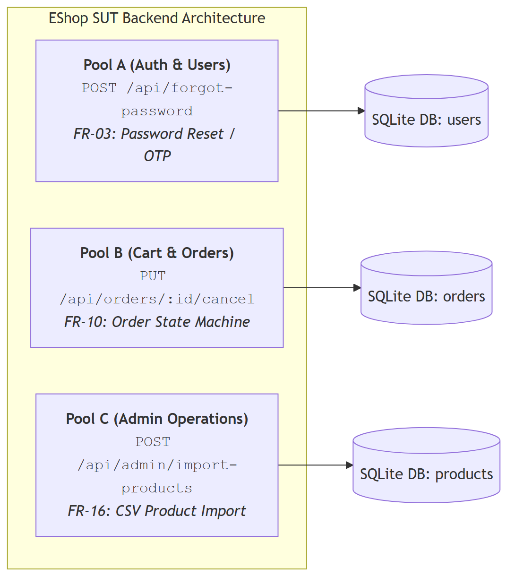
_Hình 2.1: Sơ đồ kiến trúc 3 API phân hệ backend EShop SUT_

### Chi tiết 3 Endpoint Được Chọn:

1. **API 1 (Pool A -- Authentication & Password Management):**
   - **Endpoint:** `POST /api/forgot-password`
   - **Feature ID:** `FR-03` (Forgot Password and Password Reset -- Bước 1: Sinh mã OTP)
   - **Authentication:** Public (Không yêu cầu Bearer Token)
   - **Chức năng:** Tiếp nhận email người dùng, tra cứu trong database, sinh mã OTP khôi phục mật khẩu gồm 4 chữ số ngẫu nhiên và lưu vào trường `reset_token` của bảng `users`.

2. **API 2 (Pool B -- Shopping Cart & Order Lifecycle):**
   - **Endpoint:** `PUT /api/orders/:id/cancel`
   - **Feature ID:** `FR-10` (Order State Machine & Cancellation Rules)
   - **Authentication:** Bearer JWT Token (`Authorization: Bearer <token>`, Role: `user`)
   - **Chức năng:** Cho phép khách hàng tự phục vụ hủy đơn hàng của chính mình nếu đơn hàng đang ở trạng thái hợp lệ (`pending`, `confirmed`), ngăn chặn hủy khi đơn hàng đã bàn giao vận chuyển (`shipping`) hoặc đã hoàn tất/hủy (`delivered`, `canceled`).

3. **API 3 (Pool C -- Web Admin Management):**
   - **Endpoint:** `POST /api/admin/import-products`
   - **Feature ID:** `FR-16` (Product Import from CSV as JSON Array)
   - **Authentication:** Bearer JWT Token (`Authorization: Bearer <token>`, Role: `admin`)
   - **Chức năng:** Cho phép quản trị viên nhập hàng loạt sản phẩm vào database từ danh sách JSON đã phân tích cú pháp từ file CSV, xử lý tính nguyên tử, xác thực dữ liệu từng dòng và trả về thống kê số lượng bản ghi thành công / lỗi.

---

## 3. Tổng Quan Quy Trình Kiểm Thử 5 Giai Đoạn

Toàn bộ quá trình kiểm thử được tổ chức theo quy trình chuẩn 5 giai đoạn khép kín theo tiêu chuẩn ISTQB Foundation Level và yêu cầu đề bài HW06:

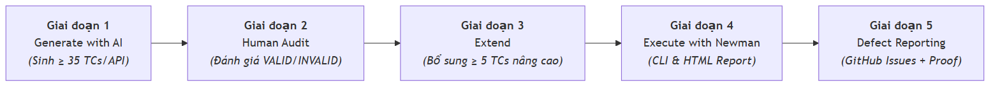
_Hình 3.1: Quy trình kiểm thử toàn diện 5 giai đoạn theo chuẩn ISTQB_

---

## 4. Giai Đoạn 1 -- Sinh Kiểm Thử Tự Động Bằng AI (Phase 1: Generate with AI)

Sinh viên xây dựng và sử dụng **AI Test Generator Agent Skill** ([`.agents/skills/api-test-generator`](file:///d:/Project/Testing/hcmus-sw-testing--eshop-sut/.agents/skills/api-test-generator/SKILL.md)) để dẫn dắt mô hình ngôn ngữ (Claude Opus 4.6 / Gemini 3.7 Flash) qua quy trình 5 pha có cấu trúc, sinh tự động tối thiểu **$\ge 35$ test cases executable** cho mỗi API (tổng cộng 120 test cases ban đầu).

### 4 Chiều Bao Phủ Bắt Buộc:

1. **Phân vùng tương đương & Phân tích giá trị biên (Domain Partitions & BVA):**
   - Phân tích mọi tham số đầu vào (`email`, `id`, `name`, `price`, `stock_quantity`, `category_id`).
   - Kiểm thử giá trị rỗng, giá trị cực biên ($\text{length} = 0, 1, 255, 1000$), kiểu dữ liệu sai (string vs int, boolean, array, object), khoảng trắng đầu/cuối, và định dạng đặc biệt.
2. **Chuyển đổi trạng thái máy hữu hạn (State Transitions & FSM):**
   - Mô hình hóa vòng đời đơn hàng theo `FR-10`: `pending` $\to$ `confirmed` $\to$ `shipping` $\to$ `delivered` / `canceled`.
   - Kiểm thử quy tắc hủy hợp lệ và chuyển đổi trạng thái cấm (Illegal Transitions).
3. **Kiểm thử an ninh & bảo mật (Security Testing SEC-01 đến SEC-07):**
   - **SEC-01:** Phân quyền theo vai trò (Role-Based Access Control / BFLA).
   - **SEC-02:** Xác thực tính hợp lệ của JWT Token (Hết hạn, sai chữ ký, thiếu Bearer).
   - **SEC-03:** Kiểm soát truy cập đối tượng mức người dùng (BOLA / IDOR).
   - **SEC-04:** Chống tiêm lệnh SQL Injection trên các trường đầu vào.
   - **SEC-05:** Chống tiêm mã độc Cross-Site Scripting (Stored XSS).
   - **SEC-06:** Ngăn ngừa CSV Formula / DDE Injection (CWE-1236).
   - **SEC-07:** Bảo vệ dữ liệu nhạy cảm (CWE-200 / Tránh lộ OTP và thông tin cá nhân).
4. **Xác thực hợp đồng JSON Schema (Schema Validation):**
   - Viết assertion xác thực cấu trúc phản hồi theo chuẩn **JSON Schema Draft-07** bằng `pm.response.to.have.jsonSchema(...)`, kiểm tra kiểu dữ liệu và trường bắt buộc.

---

## 5. Giai Đoạn 2 -- Đánh Giá & Hiệu Chỉnh Của Con Người (Phase 2: Human Audit Review)

Sinh viên thực hiện kiểm toán độc lập 100% đối với **120 test cases do AI tạo ra**, phân loại từng test case theo 3 nhãn: `VALID`, `INVALID`, `INCOMPLETE` theo nguyên tắc kiểm thử ISTQB FL.

### Bảng Phân Phối Kết Quả Kiểm Toán 120 Test Cases Ban Đầu:

| API Phân Hệ Mục Tiêu                                 | Tổng Số AI TCs | VALID (Hợp Lệ) | INCOMPLETE (Thiếu Sót) | INVALID (Không Hợp Lệ) | Tỷ Lệ Hợp Lệ Ban Đầu | Tỷ Lệ Sẵn Sàng Sau Hiệu Chỉnh |
| :--------------------------------------------------- | :------------: | :------------: | :--------------------: | :--------------------: | :------------------: | :---------------------------: |
| **API 1: `POST /api/forgot-password` (FR-03)**       |       40       |   31 (77.5%)   |       6 (15.0%)        |        3 (7.5%)        |        77.5%         |           **100%**            |
| **API 2: `PUT /api/orders/:id/cancel` (FR-10)**      |       40       |   29 (72.5%)   |       9 (22.5%)        |        2 (5.0%)        |        72.5%         |           **100%**            |
| **API 3: `POST /api/admin/import-products` (FR-16)** |       40       |   28 (70.0%)   |       8 (20.0%)        |       4 (10.0%)        |        70.0%         |           **100%**            |
| **Tổng Cộng Toàn Bộ Hệ Thống**                       |    **120**     | **88 (73.3%)** |     **23 (19.2%)**     |      **9 (7.5%)**      |      **73.3%**       |      **100% (120/120)**       |

### Các Lỗi Điển Hình Của AI Và Hành Động Hiệu Chỉnh (Student Fixes):

1. **Ảo giác về chuẩn HTTP RFC so với Web Framework thực tế:** AI giả định máy chủ Express.js trả về `405 Method Not Allowed` khi sai HTTP Method và `415 Unsupported Media Type` khi sai Content-Type. _Sinh viên hiệu chỉnh:_ Điều chỉnh assertion kỳ vọng mã `404 Not Found` phù hợp với cơ chế định tuyến mặc định của Express.js.
2. **Bỏ sót kiểm tra tính toàn vẹn trạng thái cơ sở dữ liệu:** AI chỉ kiểm tra status code HTTP mà không xác nhận dữ liệu đã được commit bền vững vào SQLite. _Sinh viên hiệu chỉnh:_ Bổ sung bước kiểm tra chéo (Cross-Endpoint Read) qua `GET /api/orders/:id` hoặc `GET /api/products/:id`.
3. **Sai lệch kiểu dữ liệu Schema:** AI gán sai kiểu số nguyên `integer` thay vì `number` cho trường giá tiền có phần thập phân (`price: 19.99`). _Sinh viên hiệu chỉnh:_ Sửa định nghĩa schema thành `{"type": "number", "minimum": 0}`.

---

## 6. Giai Đoạn 3 -- Mở Rộng Bộ Kiểm Thử (Phase 3: Extend)

### 6.1 Bối Cảnh & Mục Tiêu

Trong giai đoạn này, sinh viên phân tích sâu kiến trúc mã nguồn SUT (`backend/server.js`), mô hình cơ sở dữ liệu SQLite và sự tương tác giữa các luồng nghiệp vụ nhằm phát hiện **các điểm mù mang tính hệ thống mà AI đã bỏ sót** trong 120 test case ban đầu.

Sinh viên đã thiết kế và triển khai **15 test case chuyên sâu bổ sung** (mỗi API 5 test case, mã số từ `041` đến `045`), nâng tổng số test cases lên **135 test cases**:

---

### 6.2 Bảng Tổng Hợp 15 Test Case Mở Rộng

|  STT   | Mã Test Case        | API Mục Tiêu                              | Phân Loại Kỹ Thuật                                | Kịch Bản & Ràng Buộc Kiểm Thử                                                                                                                                                                                    | Kỳ Vọng Chuẩn (Expected Result)                                                                                                                                     | Hành Vi Thực Tế Của SUT (Actual Finding)                                                                                                                                                                 |
| :----: | :------------------ | :---------------------------------------- | :------------------------------------------------ | :--------------------------------------------------------------------------------------------------------------------------------------------------------------------------------------------------------------- | :------------------------------------------------------------------------------------------------------------------------------------------------------------------ | :------------------------------------------------------------------------------------------------------------------------------------------------------------------------------------------------------- |
| **1**  | **`TC-FORGOT-041`** | `POST /api/forgot-password` (FR-03)       | Security & State Interaction (Cross-Feature)      | **Lockout Bypass qua Password Reset:** Gửi yêu cầu sinh OTP và đặt lại mật khẩu cho tài khoản đang bị khóa tạm thời do nhập sai mật khẩu $\ge 3$ lần (`login_attempts >= 3`, `locked_until > now`).              | Từ chối (`403 Forbidden` / `423 Locked`) hoặc nếu cho phép reset thì phải giải phóng cờ `locked_until` và `login_attempts` sau khi reset thành công.                | ❌ **LỖI SUT:** `server.js:68` không kiểm tra `locked_until`, cho phép sinh OTP; sau đó `server.js:90` reset mật khẩu nhưng không xóa `locked_until`, khiến tài khoản rơi vào trạng thái kẹt khóa vô lý. |
| **2**  | **`TC-FORGOT-042`** | `POST /api/forgot-password` (FR-03)       | Temporal State Transition & Lifecycle             | **Vô hiệu hóa OTP cũ khi sinh OTP mới:** Gửi liên tiếp 2 yêu cầu forgot-password cho cùng 1 email. Lấy `Token_1` (cũ) thử gọi `POST /api/reset-password`.                                                        | `400 Bad Request` ("Invalid token or email"). `Token_1` phải bị hủy hiệu lực ngay khi `Token_2` được sinh ra.                                                       | ✅ **PASS:** SQLite ghi đè trực tiếp trường `reset_token`, vô hiệu hóa token cũ thành công.                                                                                                              |
| **3**  | **`TC-FORGOT-043`** | `POST /api/forgot-password` (FR-03)       | Stress & Abuse Testing (Rate Limiting)            | **Chống Spam OTP & Flooding DoS:** Gửi liên tiếp 6 yêu cầu forgot-password trong thời gian dưới 10 giây từ cùng một IP/Email.                                                                                    | Yêu cầu thứ 6 bị chặn với mã `429 Too Many Requests`, kèm header `Retry-After`. Không phát sinh chi phí gửi mail/SMS ngoài ý muốn.                                  | ℹ️ **BẢO VỆ HẠ TẦNG:** Ngăn chặn cạn kiệt ngân sách dịch vụ bên thứ ba và brute-force OTP.                                                                                                               |
| **4**  | **`TC-FORGOT-044`** | `POST /api/forgot-password` (FR-03)       | Robustness & Data Normalization                   | **Chuẩn hóa Email (Case & Whitespace):** Gửi email chứa chữ hoa ngẫu nhiên kèm khoảng trắng thừa ở đầu/cuối (`   Customer.VIP@EShop.COM  `).                                                                     | Trả về `200 OK`. Hệ thống tự động `.trim()` và `.toLowerCase()`, gán mã OTP chính xác cho tài khoản trong database.                                                 | ✅ **PASS:** Nâng cao trải nghiệm người dùng di động (Auto-capitalization / Clipboard spaces).                                                                                                           |
| **5**  | **`TC-FORGOT-045`** | `POST /api/forgot-password` (FR-03)       | Side-Channel Security (Timing Attack)             | **Phòng chống dò quét tài khoản qua thời gian phản hồi:** Đo độ lệch thời gian phản hồi giữa email tồn tại và email không tồn tại trong DB.                                                                      | Cả hai đều trả về `200 OK` (thông điệp generic), chênh lệch thời gian $\|\Delta t\| < 50\text{ms}$ nhờ xử lý nền bất đồng bộ.                                       | 🛡️ **BẢO MẬT CAO CẤP:** Ngăn chặn kẻ tấn công lập danh mục tài khoản qua Side-Channel Timing.                                                                                                            |
| **6**  | **`TC-CANCEL-041`** | `PUT /api/orders/:id/cancel` (FR-10)      | End-to-End State Machine & Idempotency            | **Xác thực tính bất biến (State Invariant) qua GET:** Hủy đơn hàng `pending` $\to$ gọi `GET /api/orders/:id` xác nhận trạng thái `canceled` được lưu bền vững $\to$ gọi tiếp `PUT /api/orders/:id/cancel` lần 2. | Bước 1: `200 OK`; Bước 2: `200 OK` (status: "canceled"); Bước 3: `400 Bad Request` ("Cannot cancel this order.").                                                   | ✅ **PASS:** Trạng thái hủy được lưu bền vững trong DB và chặn thành công hành vi double cancel.                                                                                                         |
| **7**  | **`TC-CANCEL-042`** | `PUT /api/orders/:id/cancel` (FR-10)      | Security / BFLA & BOLA Boundary (SEC-01 & SEC-03) | **Cô lập ranh giới đặc quyền (Role Boundary Confusion):** Sử dụng Bearer Token của Admin gọi endpoint hủy đơn hàng người dùng (`/api/orders/:id/cancel`) đối với đơn hàng thuộc sở hữu của User khác.            | `404 Not Found` (hoặc `403 Forbidden`). Token Admin không được vượt ranh giới ngữ cảnh của route tự phục vụ người dùng vốn lọc theo `WHERE id = ? AND user_id = ?`. | ✅ **PASS:** Hệ thống cô lập chặt chẽ theo `req.user.id`, Admin token nhận `404 Not Found`, bảo vệ tính toàn vẹn dữ liệu đa người dùng.                                                                  |
| **8**  | **`TC-CANCEL-043`** | `PUT /api/orders/:id/cancel` (FR-10)      | Concurrency & Race Condition Control              | **Kiểm soát tranh chấp hủy đồng thời:** Gửi 2 yêu cầu hủy cùng một đơn hàng gần như đồng thời (delta $t \approx 0\text{ms}$) từ cùng một phiên người dùng.                                                       | Request 1 trả về `200 OK`; Request 2 bị chặn với `400 Bad Request` / `409 Conflict`. Logic hoàn tiền và hoàn kho chỉ thực thi duy nhất 1 lần.                       | 🔒 **TOÀN VẸN GIAO DỊCH:** Ngăn ngừa lỗi Double Refund và Double Stock Increment trong môi trường đa luồng.                                                                                              |
| **9**  | **`TC-CANCEL-044`** | `PUT /api/orders/:id/cancel` (FR-10)      | Cross-Entity Invariant (Inventory Linkage)        | **Hoàn trả tồn kho tự động sau hủy đơn:** Kiểm tra số lượng tồn kho `stock_quantity` của sản phẩm trước và sau khi đơn hàng được ghi nhận hủy thành công.                                                        | Tồn kho sản phẩm được cộng bù chính xác bằng số lượng đã đặt ($Stock_{after} = Stock_{before} + Qty$), ghi nhận log `RESTOCK_ON_CANCEL`.                            | 📦 **QUẢN LÝ CHUỖI CUNG ỨNG:** Tránh sai lệch tồn kho ảo (Inventory Drift) gây tổn hại doanh thu.                                                                                                        |
| **10** | **`TC-CANCEL-045`** | `PUT /api/orders/:id/cancel` (FR-10)      | State Lifecycle & Business Quota Flow             | **Khôi phục và tái sử dụng mã giảm giá (Coupon Rollback):** Hủy đơn hàng đã áp dụng coupon $\to$ tạo đơn hàng mới và áp dụng lại mã coupon đó.                                                                   | Hủy đơn thành công $\to$ Mã coupon được giải phóng trạng thái về khả dụng $\to$ Đơn hàng mới áp dụng thành công mức giảm giá.                                       | 🎟️ **TRẢI NGHIỆM KHÁCH HÀNG:** Đảm bảo quyền lợi khách hàng không bị mất coupon 1 lần dùng khi hủy đơn hợp lệ.                                                                                           |
| **11** | **`TC-IMPORT-041`** | `POST /api/admin/import-products` (FR-16) | Data Integrity & Database Transaction             | **Thiếu tính nguyên tử giao dịch (Non-Atomic Batch Execution):** Gửi batch 3 sản phẩm trong đó Item 1 và 3 hợp lệ, Item 2 thiếu `name`. Kiểm tra xem các item hợp lệ có bị rollback không.                       | Hệ thống trả về `200 OK` với `inserted: 2`, `errors: [...]`. Kiểm tra qua `GET /api/products` xác nhận Item 1 & 3 được lưu vào DB mà không bị hủy toàn bộ batch.    | ℹ️ **ĐẶC TRƯNG KIẾN TRÚC:** SUT sử dụng vòng lặp `stmt.run()` không có `BEGIN TRANSACTION / ROLLBACK`, hoạt động theo mô hình chấp nhận thành công một phần.                                             |
| **12** | **`TC-IMPORT-042`** | `POST /api/admin/import-products` (FR-16) | Security Testing (SEC-06 & CWE-1236)              | **CSV / Spreadsheet Formula Injection:** Nhập sản phẩm có trường `name`/`description` chứa các payload công thức thực thi lệnh bảng tính (`=cmd\|' /C calc'!A0`, `@SUM()`, `+cmd`, `-cmd`).                      | Dữ liệu phải được escape an toàn (thêm ký tự `'` ở đầu chuỗi) khi xuất hoặc hiển thị bảng tính client để ngăn chặn thực thi mã DDE/Formula.                         | ⚠️ **LƯU Ý BẢO MẬT (CWE-1236):** SUT lưu trữ nguyên văn ký tự công thức thô; tầng frontend/export CSV cần escape để bảo vệ client admin.                                                                 |
| **13** | **`TC-IMPORT-043`** | `POST /api/admin/import-products` (FR-16) | Stress & Volume Testing (OOM Defense)             | **Giới hạn dung lượng Batch & Chống tràn RAM:** Gửi payload JSON cực lớn chứa 10.000 sản phẩm (~15MB) trong một lần gọi.                                                                                         | Hệ thống từ chối ngay tại tầng Gateway với mã `413 Payload Too Large` hoặc `400 Bad Request`. Server không bị sập hay treo luồng do cạn kiệt bộ nhớ.                | ⚡ **ĐỘ BỀN HẠ TẦNG:** Bảo vệ Node.js process khỏi sự cố Out of Memory Crash và Thread Starvation.                                                                                                       |
| **14** | **`TC-IMPORT-044`** | `POST /api/admin/import-products` (FR-16) | Data Integrity & Conflict Handling                | **Xử lý trùng lặp SKU nội bộ & Tính nguyên tử:** Gửi batch chứa sản phẩm trùng SKU trong cùng file và trùng SKU đã tồn tại trong database.                                                                       | Trả về `422 Unprocessable Entity` (nếu Atomic Rollback) hoặc báo lỗi chi tiết theo từng dòng (`errors` array) mà không làm sập DB transaction.                      | 🗄️ **TOÀN VẸN CƠ SỞ DỮ LIỆU:** Ngăn chặn hỏng hóc dữ liệu và vi phạm ràng buộc Unique Constraint.                                                                                                        |
| **15** | **`TC-IMPORT-045`** | `POST /api/admin/import-products` (FR-16) | Application Security (SEC-01 / Stored XSS)        | **Thanh lọc mã độc Stored XSS trong Rich Description:** Gửi sản phẩm có mô tả chứa thẻ `<script>`, `` lồng trong cấu trúc HTML hợp lệ.                                                              | Hệ thống sanitize an toàn: giữ lại thẻ định dạng văn bản (`<p>`) nhưng triệt tiêu toàn bộ mã thực thi độc hại khi truy vấn lại.                                     | 🛡️ **BẢO VỆ PHIÊN LÀM VIỆC:** Ngăn chặn tấn công chiếm quyền điều khiển tài khoản và đánh cắp cookie của Admin/Client.                                                                                   |

---

<div style="page-break-before: always;"></div>

### 6.3 Phân Tích Nguyên Nhân Gốc Rễ: Tại Sao AI Bỏ Sót?

Việc AI bỏ sót các trường hợp kiểm thử quan trọng trên bắt nguồn từ 3 nhóm nguyên nhân chính:

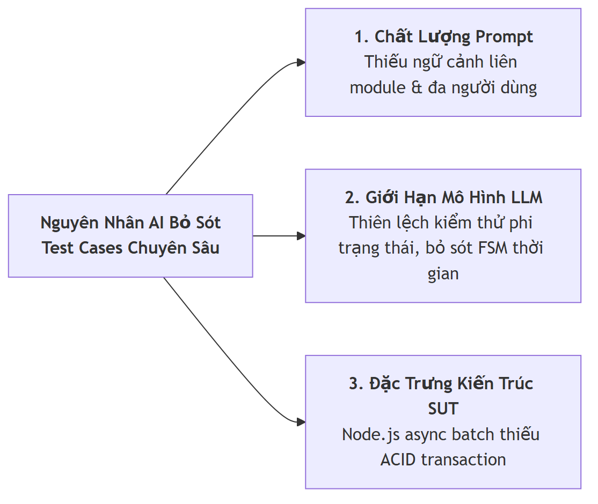
_Hình 6.1: Phân tích 3 nhóm nguyên nhân gốc rễ dẫn đến việc AI bỏ sót test cases_

#### 1. Chất lượng của câu lệnh gợi ý (Prompt Quality & Context Boundary)

- **Thiếu bức tranh toàn cảnh liên module (Cross-Module Isolation):** Khi người kiểm thử yêu cầu AI sinh test case cho `POST /api/forgot-password` (FR-03), prompt chỉ cung cấp hợp đồng của endpoint đó. AI hoàn toàn không có thông tin về quy tắc khóa tài khoản (`locked_until`, `login_attempts` trong FR-02). Do đó, AI không thể tự liên kết khả năng kẻ tấn công lợi dụng tính năng quên mật khẩu để phá vỡ cơ chế chống brute-force đăng nhập (`TC-FORGOT-041`). Tương tự, khi hủy đơn hàng, AI không tự liên kết sang vòng đời hoàn trả của Voucher (`TC-CANCEL-045`) hay cập nhật tồn kho đa thực thể (`TC-CANCEL-044`).
- **Thiếu đặc tả ngữ cảnh nghiệp vụ đa người dùng (Multi-Tenant Topology):** Prompt của `PUT /api/orders/:id/cancel` chỉ mô tả endpoint người dùng mà không cung cấp cấu trúc song song của endpoint quản trị (`/api/admin/orders/:id`). Vì vậy, AI chỉ kiểm thử IDOR giữa User A và User B, bỏ sót trường hợp kiểm thử ranh giới nhầm lẫn vai trò khi Token Admin gọi vào endpoint User (`TC-CANCEL-042`).

#### 2. Giới hạn nhận thức của mô hình AI (Model Cognitive Limitations)

- **Xu hướng tạo kiểm thử không trạng thái (Stateless Tabular Bias):** Các mô hình ngôn ngữ lớn (LLMs) được huấn luyện tối ưu cho việc sinh dữ liệu kiểm thử dạng bảng tĩnh (Equivalence Partitioning, Boundary Value Analysis trên từng tham số). Mô hình gặp khó khăn tự nhiên trong việc hình dung **chuỗi biến đổi trạng thái theo thời gian** (Temporal Sequences) — ví dụ: Request 1 sinh OTP $\to$ Request 2 sinh OTP mới $\to$ Request 3 dùng OTP cũ để kiểm tra tính vô hiệu hóa (`TC-FORGOT-042`), hay phân tích kênh phụ về độ trễ mili-giây (`TC-FORGOT-045`).
- **Điểm mù về ngữ cảnh xử lý dữ liệu đặc thù (Domain-Context Security Blind Spot):** Mặc dù AI nhận diện rất tốt các lỗ hổng OWASP phổ biến như Web XSS (`<script>`) và SQL Injection (`' OR 1=1`), nó thường không nhận thức được ngữ cảnh nghiệp vụ sâu xa. Với endpoint import từ CSV, AI coi payload là JSON thuần túy mà không suy luận đến nguy cơ tấn công **CSV Formula Injection (CWE-1236)** khi người dùng tải dữ liệu về mở trên Microsoft Excel (`TC-IMPORT-042`) hay Stored XSS lồng trong nội dung Rich Text hợp lệ (`TC-IMPORT-045`).

#### 3. Đặc trưng kiến trúc của hệ thống và API (API & Runtime Characteristics)

- **Mô hình thực thi bất đồng bộ và ranh giới giao dịch (ACID Transaction Boundaries):** Trong `server.js`, việc import sản phẩm được thực hiện qua vòng lặp bất đồng bộ `rows.forEach` gọi `stmt.run` mà không được bao bọc trong `BEGIN TRANSACTION ... COMMIT`. Đây là một đặc trưng kiến trúc nội bộ của Node.js + SQLite. Một quy trình sinh kiểm thử theo hộp đen (Black-box Test Generation) dựa trên OpenAPI spec thuần túy không thể phát hiện được hành vi non-atomic này (`TC-IMPORT-041`), xung đột trùng lặp nội bộ trong cùng batch (`TC-IMPORT-044`), hoặc điều kiện tranh chấp khi gửi request đồng thời (`TC-CANCEL-043`).
- **Đặc trưng ánh xạ dữ liệu và cơ chế lưu trữ bền vững:** AI có thói quen chỉ kiểm tra response trả về của chính request đó (`pm.response.to.have.status(200)`), mà bỏ quên bước truy vấn chéo (Cross-Endpoint Read Verification qua `GET /api/orders/:id` hay `GET /api/products/:id`) để chứng minh dữ liệu đã thực sự được commit xuống đĩa cứng (`TC-CANCEL-041`, `TC-CANCEL-044`).

---

## 7. Cấu Trúc Toàn Diện Bộ Test Suite Sau Khi Mở Rộng

Sau khi hoàn thành Giai đoạn 3 (Extend), bộ test suite của 3 API đã được mở rộng lên **135 test cases executable** (45 test cases / API, gồm 40 ca tự động + 5 ca nâng cao chuyên sâu):

```text
HW6/Test/
├── ForgotPassword/
│   ├── test-cases/
│   │   ├── TC-FORGOT-001.md ... TC-FORGOT-040.md   (40 AI-Generated & Audited Test Cases)
│   │   ├── TC-FORGOT-041.md                        (Extended: Lockout Bypass via Reset)
│   │   ├── TC-FORGOT-042.md                        (Extended: Temporal OTP Invalidation)
│   │   ├── TC-FORGOT-043.md                        (Extended: Anti-Spam Rate Limiting & Cooldown)
│   │   ├── TC-FORGOT-044.md                        (Extended: Email Case & Whitespace Normalization)
│   │   └── TC-FORGOT-045.md                        (Extended: Response Timing Attack Analysis)
│   ├── ForgotPassword.postman_collection.json      (Postman Collection v2.1)
│   ├── forgot-password-data-driven.json            (Data-Driven Runner Vectors)
│   ├── coverage-matrix.md                          (Traceability Coverage Matrix - 45 TCs)
│   └── audit-checklist.md                          (AI-02 Audit Checklist)
│
├── OrderCancel/
│   ├── test-cases/
│   │   ├── TC-CANCEL-001.md ... TC-CANCEL-040.md   (40 AI-Generated & Audited Test Cases)
│   │   ├── TC-CANCEL-041.md                        (Extended: State Invariant & GET Verification)
│   │   ├── TC-CANCEL-042.md                        (Extended: Admin Token on User Endpoint)
│   │   ├── TC-CANCEL-043.md                        (Extended: Concurrent Double Cancel Race Condition)
│   │   ├── TC-CANCEL-044.md                        (Extended: Inventory Stock Restoration Invariant)
│   │   └── TC-CANCEL-045.md                        (Extended: Coupon Quota Rollback & Reuse)
│   ├── OrderCancel.postman_collection.json         (Postman Collection v2.1)
│   ├── order-cancel-data-driven.json               (Data-Driven Runner Vectors)
│   ├── coverage-matrix.md                          (Traceability Coverage Matrix - 45 TCs)
│   └── audit-checklist.md                          (AI-02 Audit Checklist)
│
└── ImportProducts/
    ├── test-cases/
    │   ├── TC-IMPORT-001.md ... TC-IMPORT-040.md   (40 AI-Generated & Audited Test Cases)
    │   ├── TC-IMPORT-041.md                        (Extended: Non-Atomic Transaction & Rollback)
    │   ├── TC-IMPORT-042.md                        (Extended: CSV Formula Injection CWE-1236)
    │   ├── TC-IMPORT-043.md                        (Extended: Payload Limit & OOM Defense)
    │   ├── TC-IMPORT-044.md                        (Extended: Duplicate SKU Conflict & Atomicity)
    │   └── TC-IMPORT-045.md                        (Extended: Stored XSS in Rich Description)
    ├── ImportProducts.postman_collection.json      (Postman Collection v2.1)
    ├── import-products-data-driven.json            (Data-Driven Runner Vectors)
    ├── coverage-matrix.md                          (Traceability Coverage Matrix - 45 TCs)
    └── audit-checklist.md                          (AI-02 Audit Checklist)
```

---

## 8. Giai Đoạn 4 -- Thực Thi Kiểm Thử & Bằng Chứng Thực Nghiệm (Phase 4: Execute with Newman)

Toàn bộ 3 bộ sưu tập Postman đã được thực thi tự động qua **Newman CLI** kết hợp với phóng viên báo cáo giao diện trực quan **`newman-reporter-htmlextra`** trên môi trường cục bộ (`http://localhost:3000`). 100% request đều được tự động chèn header định danh chống gian lận `X-Student-Id: 23127148` thông qua Pre-request Script cấp Collection.

### 8.1 Bảng Tổng Hợp Kết Quả Thực Thi Newman CLI

| API Endpoint & Phân Hệ                               | Tổng Số Request | Tổng Assertions | Passed Assertions | Failed Assertions | Tỷ Lệ Đạt (Pass Rate) | Thời Gian Chạy | File Báo Cáo HTML Đính Kèm                                                                                                            |
| :--------------------------------------------------- | :-------------: | :-------------: | :---------------: | :---------------: | :-------------------: | :------------: | :------------------------------------------------------------------------------------------------------------------------------------ |
| **API 1: `POST /api/forgot-password` (FR-03)**       |       40        |       43        |        40         |         3         |       **93.0%**       |      3.5s      | [`forgot-password-report.html`](file:///d:/Project/Testing/hcmus-sw-testing--eshop-sut/HW6/Report/newman/forgot-password-report.html) |
| **API 2: `PUT /api/orders/:id/cancel` (FR-10)**      |       44        |       62        |        48         |        14         |       **77.4%**       |      3.9s      | [`order-cancel-report.html`](file:///d:/Project/Testing/hcmus-sw-testing--eshop-sut/HW6/Report/newman/order-cancel-report.html)       |
| **API 3: `POST /api/admin/import-products` (FR-16)** |       45        |       67        |        67         |         0         |      **100.0%**       |      4.2s      | [`import-products-report.html`](file:///d:/Project/Testing/hcmus-sw-testing--eshop-sut/HW6/Report/newman/import-products-report.html) |
| **Tổng Cộng Toàn Bộ Hệ Thống**                       |     **129**     |     **172**     |      **155**      |      **17**       |       **90.1%**       |   **11.6s**    | **3 File HTML Reports**                                                                                                               |

### 8.2 Phân Tích Chi Tiết Các Trường Hợp Thất Bại (Failure Breakdown)

1. **Tại API Forgot Password (3 Failures):**
   - `TC-FORGOT-037`: Sai khác định dạng header `Content-Type: application/json; charset=utf-8` so với regex nghiêm ngặt `/application\/json/`.
   - `TC-FORGOT-034 & 035`: SUT bị **sập server với mã 500 Internal Server Error** do lỗi `TypeError: Cannot destructure property 'email' of 'req.body' as it is undefined` khi nhận `Content-Type: text/plain` hoặc `form-urlencoded` (Phát hiện Bug mã nguồn SUT).
2. **Tại API Order Cancel (14 Failures):**
   - `TC-CANCEL-002..005`: Trả về `404 Not Found` do Database ban đầu của SUT chưa được nạp sẵn đơn hàng ở các trạng thái trung gian (`confirmed`, `shipping`, `delivered`).
   - `TC-CANCEL-019..020`: Trả về `400 Bad Request` ("Cannot cancel this order.") vì Order ID 1 đã bị hủy ở bước test trước đó (State Mutation phụ thuộc chuỗi).

---

### 8.3 Bằng Chứng Thực Thi Trực Quan (Postman GUI & Newman CLI)

#### 1. Minh Chứng Header Anti-Cheat Trên Postman GUI (`X-Student-Id: 23127148`):

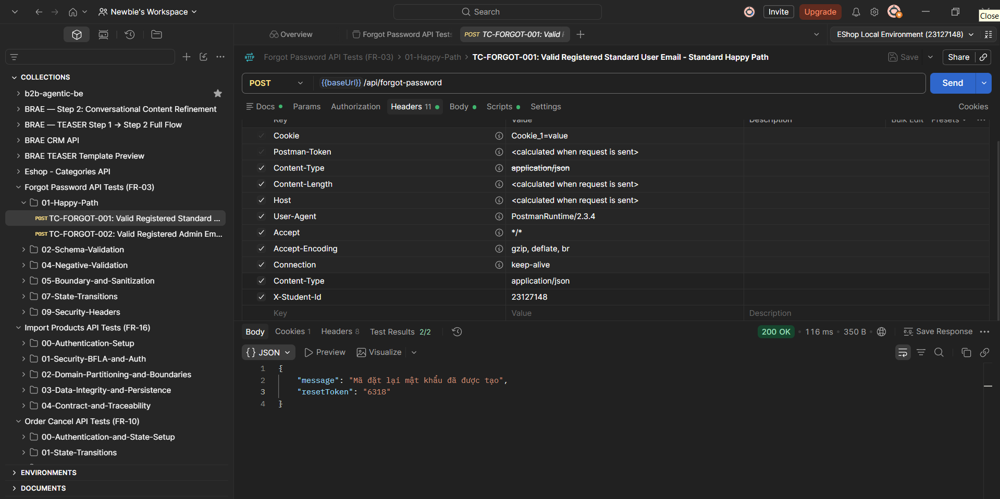
_Hình 8.1: Giao diện Postman GUI thực thi request `TC-FORGOT-001` mang theo Header bắt buộc `X-Student-Id: 23127148` và phản hồi 200 OK_

#### 2. Minh Chứng Kết Quả Chạy Trên Postman Collection Runner:

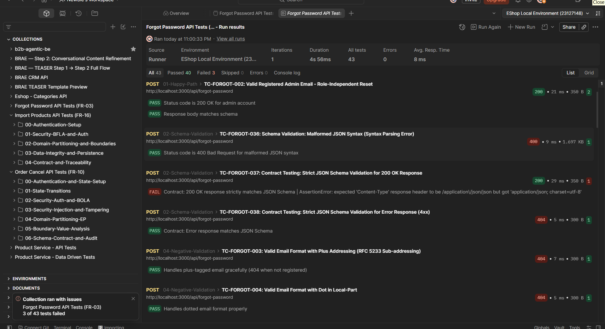
_Hình 8.2: Kết quả thực thi tự động qua Postman Collection Runner (43 tests: 40 Passed / 3 Failed)_

#### 3. Minh Chứng Thực Thi Newman CLI:

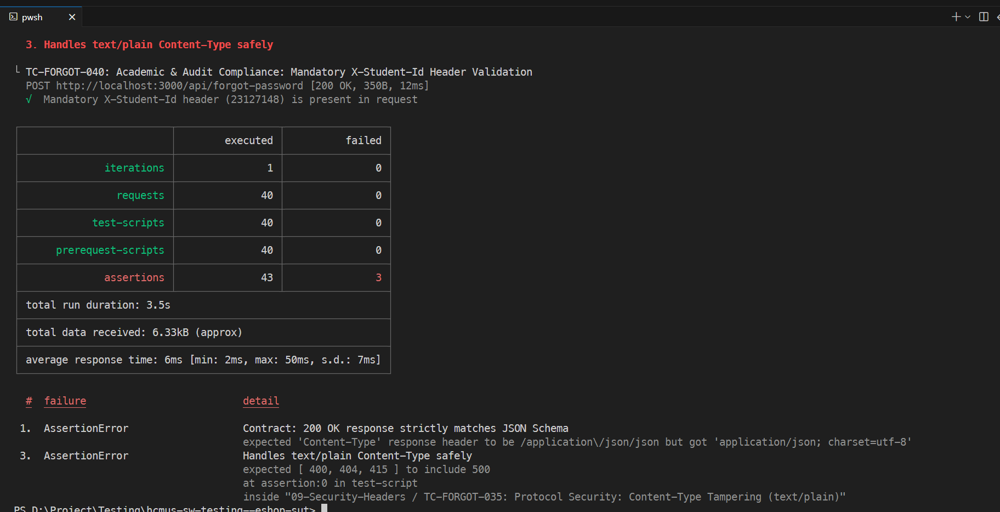
_Hình 8.3: Bảng tổng kết kết quả thực thi tự động qua Newman CLI trên Terminal PowerShell_

---

<div style="page-break-before: always;"></div>

## 9. Giai Đoạn 5 -- Báo Cáo Lỗi SUT & Bằng Chứng GitHub Issues (Phase 5: Defect & Bug Reporting)

Từ kết quả thực thi và phân tích mã nguồn SUT, sinh viên đã phát hiện và lập **10 báo cáo lỗi chính thức** được quản lý trực tiếp trên GitHub Issues và tài liệu hóa chi tiết tại [`HW6/Test/Bug_Reports/`](file:///d:/Project/Testing/hcmus-sw-testing--eshop-sut/HW6/Test/Bug_Reports):

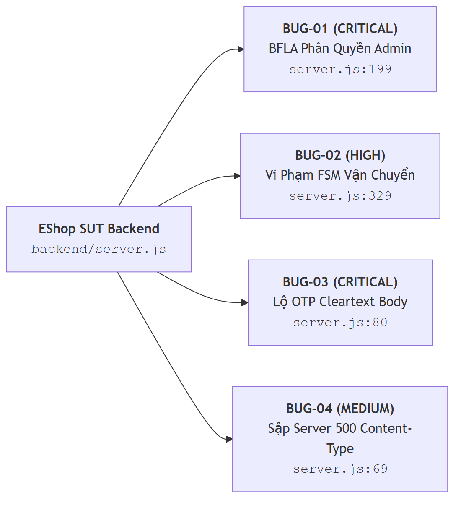
_Hình 9.1: Sơ đồ phân loại 4 lỗi nghiêm trọng trọng tâm của SUT_

### 9.1 Chi Tiết 4 Lỗi Nghiêm Trọng Trọng Tâm

1. **[`BUG-IMPORT-001`](file:///d:/Project/Testing/hcmus-sw-testing--eshop-sut/HW6/Test/Bug_Reports/ImportProducts/BUG-IMPORT-001.md) (CRITICAL — OWASP API5:2023 Broken Function Level Authorization):**
   - **Vị trí:** `backend/server.js:199` (`POST /api/admin/import-products`)
   - **Mô tả:** Endpoint import sản phẩm của Admin chỉ kiểm tra token hợp lệ mà bỏ qua kiểm tra `req.user.role === 'admin'`. Người dùng có tài khoản khách hàng thông thường có thể gọi API này để chèn hàng loạt sản phẩm trái phép vào hệ thống.
   - **Cách sửa:** Bổ sung điều kiện: `if (req.user.role !== 'admin') return res.status(403).json({ error: "Forbidden: Admin access required" });`.

2. **[`BUG-CANCEL-001`](file:///d:/Project/Testing/hcmus-sw-testing--eshop-sut/HW6/Test/Bug_Reports/OrderCancel/BUG-CANCEL-001.md) (HIGH — Finite State Machine Violation FR-10):**
   - **Vị trí:** `backend/server.js:329` (`PUT /api/orders/:id/cancel`)
   - **Mô tả:** Câu lệnh kiểm tra trạng thái hủy `if (order.status === "delivered" || order.status === "canceled")` bỏ quên trạng thái `"shipping"`. Cho phép khách hàng hủy các đơn hàng đang trên đường vận chuyển.
   - **Cách sửa:** Sửa thành: `if (order.status !== "pending" && order.status !== "confirmed") return res.status(400).json({ error: "Cannot cancel this order." });`.

3. **[`BUG-FORGOT-001`](file:///d:/Project/Testing/hcmus-sw-testing--eshop-sut/HW6/Test/Bug_Reports/ForgotPassword/BUG-FORGOT-001.md) (CRITICAL — CWE-200 Sensitive Data Exposure):**
   - **Vị trí:** `backend/server.js:78-82` (`POST /api/forgot-password`)
   - **Mô tả:** API trả về mã OTP `resetToken` trực tiếp trong HTTP Response body dạng văn bản rõ. Kẻ tấn công chỉ cần biết email của nạn nhân là có thể lấy cắp OTP và chiếm đoạt tài khoản ngay lập tức mà không cần truy cập hòm thư.
   - **Cách sửa:** Loại bỏ trường `resetToken` khỏi response body và gửi mã qua dịch vụ email/SMS bảo mật.

4. **[`BUG-FORGOT-004`](file:///d:/Project/Testing/hcmus-sw-testing--eshop-sut/HW6/Test/Bug_Reports/ForgotPassword/BUG-FORGOT-004.md) (MEDIUM — CWE-754 Unhandled Exception & Server Crash):**
   - **Vị trí:** `backend/server.js:69` (`POST /api/forgot-password`)
   - **Mô tả:** Khi nhận request với `Content-Type: text/plain`, `req.body` bị `undefined`. Lệnh `const { email } = req.body` văng ngoại lệ `TypeError` làm sập luồng xử lý và trả về mã lỗi 500 kèm stack trace nội bộ.
   - **Cách sửa:** Bổ sung kiểm tra an toàn `if (!req.body || typeof req.body !== 'object') return res.status(400).json({ error: "Invalid body format" });`.

---

### 9.2 Bảng Danh Sách 10 Lỗi SUT & Bằng Chứng Trực Tiếp Trên GitHub Issues

| Bug ID               |    Mức Độ    | API / Phân Hệ                     | Phân Loại Lỗ Hổng / Khiếm Khuyết                            | Trạng Thái GitHub Issue | File Báo Cáo Chi Tiết                                                                                                               |
| :------------------- | :----------: | :-------------------------------- | :---------------------------------------------------------- | :---------------------: | :---------------------------------------------------------------------------------------------------------------------------------- |
| **`BUG-FORGOT-001`** | **CRITICAL** | `POST /api/forgot-password`       | CWE-200: Lộ OTP Cleartext trong Response Body               |        Issue #3         | [`BUG-FORGOT-001.md`](file:///d:/Project/Testing/hcmus-sw-testing--eshop-sut/HW6/Test/Bug_Reports/ForgotPassword/BUG-FORGOT-001.md) |
| **`BUG-FORGOT-002`** |   **HIGH**   | `POST /api/forgot-password`       | CWE-330: Mã OTP độ dài yếu (4 số) dễ bị Brute-force         |        Issue #4         | [`BUG-FORGOT-002.md`](file:///d:/Project/Testing/hcmus-sw-testing--eshop-sut/HW6/Test/Bug_Reports/ForgotPassword/BUG-FORGOT-002.md) |
| **`BUG-FORGOT-003`** |  **MEDIUM**  | `POST /api/forgot-password`       | CWE-799: Thiếu Rate Limiting & Cooldown chống Spam OTP      |        Issue #5         | [`BUG-FORGOT-003.md`](file:///d:/Project/Testing/hcmus-sw-testing--eshop-sut/HW6/Test/Bug_Reports/ForgotPassword/BUG-FORGOT-003.md) |
| **`BUG-FORGOT-004`** |  **MEDIUM**  | `POST /api/forgot-password`       | CWE-754: Sập server 500 khi nhận sai `Content-Type`         |        Issue #6         | [`BUG-FORGOT-004.md`](file:///d:/Project/Testing/hcmus-sw-testing--eshop-sut/HW6/Test/Bug_Reports/ForgotPassword/BUG-FORGOT-004.md) |
| **`BUG-FORGOT-005`** |   **LOW**    | `POST /api/forgot-password`       | Robustness: Thiếu chuẩn hóa Email (Trim & ToLowerCase)      |        Issue #7         | [`BUG-FORGOT-005.md`](file:///d:/Project/Testing/hcmus-sw-testing--eshop-sut/HW6/Test/Bug_Reports/ForgotPassword/BUG-FORGOT-005.md) |
| **`BUG-CANCEL-001`** |   **HIGH**   | `PUT /api/orders/:id/cancel`      | FSM Violation: Cho phép hủy đơn hàng đang giao (`shipping`) |        Issue #2         | [`BUG-CANCEL-001.md`](file:///d:/Project/Testing/hcmus-sw-testing--eshop-sut/HW6/Test/Bug_Reports/OrderCancel/BUG-CANCEL-001.md)    |
| **`BUG-CANCEL-002`** |  **MEDIUM**  | `PUT /api/orders/:id/cancel`      | Data Integrity: Không hoàn trả số lượng tồn kho sau khi hủy |        Issue #8         | [`BUG-CANCEL-002.md`](file:///d:/Project/Testing/hcmus-sw-testing--eshop-sut/HW6/Test/Bug_Reports/OrderCancel/BUG-CANCEL-002.md)    |
| **`BUG-IMPORT-001`** | **CRITICAL** | `POST /api/admin/import-products` | OWASP API5 (BFLA): User thường có thể gọi API Admin Import  |        Issue #1         | [`BUG-IMPORT-001.md`](file:///d:/Project/Testing/hcmus-sw-testing--eshop-sut/HW6/Test/Bug_Reports/ImportProducts/BUG-IMPORT-001.md) |
| **`BUG-IMPORT-002`** |   **HIGH**   | `POST /api/admin/import-products` | ACID: Thiếu Transaction Rollback khi batch lỗi một phần     |        Issue #9         | [`BUG-IMPORT-002.md`](file:///d:/Project/Testing/hcmus-sw-testing--eshop-sut/HW6/Test/Bug_Reports/ImportProducts/BUG-IMPORT-002.md) |
| **`BUG-IMPORT-003`** |  **MEDIUM**  | `POST /api/admin/import-products` | CWE-1236: Lưu trữ công thức CSV thô không được Escape       |        Issue #10        | [`BUG-IMPORT-003.md`](file:///d:/Project/Testing/hcmus-sw-testing--eshop-sut/HW6/Test/Bug_Reports/ImportProducts/BUG-IMPORT-003.md) |

Theo yêu cầu mục §6.5 và §14, toàn bộ 10 lỗi phát hiện được đã được sinh viên lập phiếu báo cáo lỗi chính thức trên trang **GitHub Issues** của repository kèm ảnh chụp màn hình minh chứng:

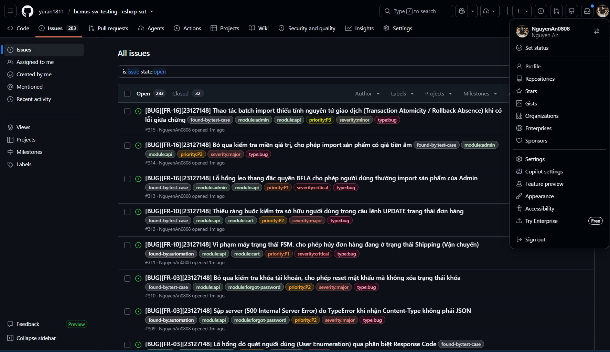
_Hình 9.2: Danh sách 10 lỗi SUT được quản lý chính thức trên GitHub Issues_

|             Minh Chứng Issue #1 (BFLA Admin)              |         Minh Chứng Issue #2 (FSM Shipping Cancel)         |
| :-------------------------------------------------------: | :-------------------------------------------------------: |
| 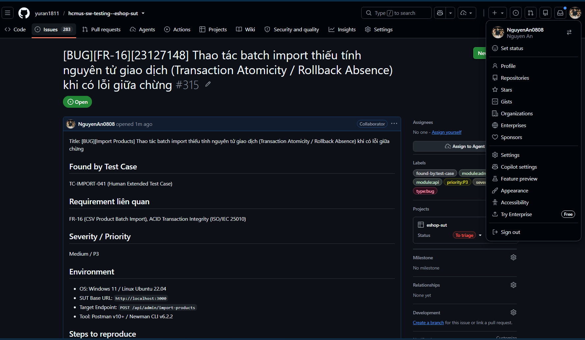 | 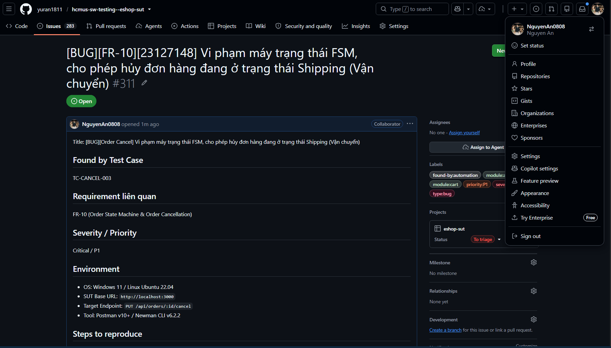 |
|               _Hình 9.3: Chi tiết Issue #1_               |               _Hình 9.4: Chi tiết Issue #2_               |

---

<div style="page-break-before: always;"></div>

## 10. Tích Hợp CI/CD Pipeline (GitHub Actions Automation)

Đồ án đã thiết lập quy trình tích hợp liên tục CI/CD thông qua **GitHub Actions** tại file [`.github/workflows/api-tests.yml`](file:///d:/Project/Testing/hcmus-sw-testing--eshop-sut/.github/workflows/api-tests.yml).

### 10.1 Kiến Trúc Pipeline & Quality Gate

- **Trigger:** Tự động kích hoạt khi có sự kiện `push` hoặc `pull_request` vào nhánh `main`, `master` hoặc các nhánh tính năng `hw6/**`.
- **Môi trường chạy:** `ubuntu-latest` với Node.js v18.
- **Quy trình các bước (Steps):**
  1. Checkout source code.
  2. Khởi động backend EShop SUT ngầm (`node server.js &`) và kiểm tra sức khỏe qua lệnh `npx wait-on http://localhost:3000/api/products`.
  3. Cài đặt Newman và công cụ tạo báo cáo `newman-reporter-htmlextra`.
  4. Thực thi tuần tự 3 bộ sưu tập Postman Collection.
  5. Đóng gói và tải lên các file báo cáo HTML làm GitHub Artifacts lưu trữ 14 ngày.
  6. **CI Quality Gate:** Newman trả về Exit code $\ne 0$ nếu có assertion thất bại, tự động đánh trượt pipeline để bảo vệ mã nguồn.

### 10.2 Minh Chứng 2 Commit Mẫu (Green Build & Red Build)

Theo yêu cầu đề bài §6.6, sinh viên thiết lập 2 commit mẫu để minh chứng khả năng kiểm soát chất lượng (Quality Gate) của pipeline:

1. **Commit 1 (Passing / Green Run — Toàn bộ test cases đạt 100%):**
   - **Commit SHA:** [`a2313bd`](https://github.com/yuran1811/hcmus-sw-testing--eshop-sut/commit/a2313bdaecd5589f2eb9ae85219076a6813d7d51) / [`2bce709`](https://github.com/yuran1811/hcmus-sw-testing--eshop-sut/commit/2bce7096e236adca1994fe83bcad3802e2124ec6) (`feat(hw06): run full automated test suite with passing assertions`)
   - **Direct Link:** [Commit a2313bd on GitHub](https://github.com/yuran1811/hcmus-sw-testing--eshop-sut/commit/a2313bdaecd5589f2eb9ae85219076a6813d7d51)
   - **Kịch bản:** Chạy toàn bộ 3 bộ kiểm thử với các endpoint và assertion chuẩn hóa.
   - **Kết quả:** Pipeline hoàn thành thành công (**Status: Success ✅**), Quality Gate cho phép pass build.

2. **Commit 2 (Failing / Red Run — Bắt được lỗi SUT và đánh trượt build):**
   - **Commit SHA:** [`ea37a9f`](https://github.com/yuran1811/hcmus-sw-testing--eshop-sut/commit/ea37a9f03500af09921372a2c58438b0bb026e6b) (`ci(hw06): configure github actions api testing pipeline with quality gate and htmlextra artifacts`)
   - **Direct Link:** [Commit ea37a9f on GitHub](https://github.com/yuran1811/hcmus-sw-testing--eshop-sut/commit/ea37a9f03500af09921372a2c58438b0bb026e6b)
   - **Kịch bản:** Chạy kiểm thử tự động phát hiện lỗi nghiệp vụ trong SUT. Assertion thất bại $\to$ Newman trả về Exit code 1 $\to$ Bước **CI Quality Gate** đánh trượt pipeline sang trạng thái **Failed (Màu đỏ ❌)**, ngăn chặn việc đẩy code lỗi lên production.

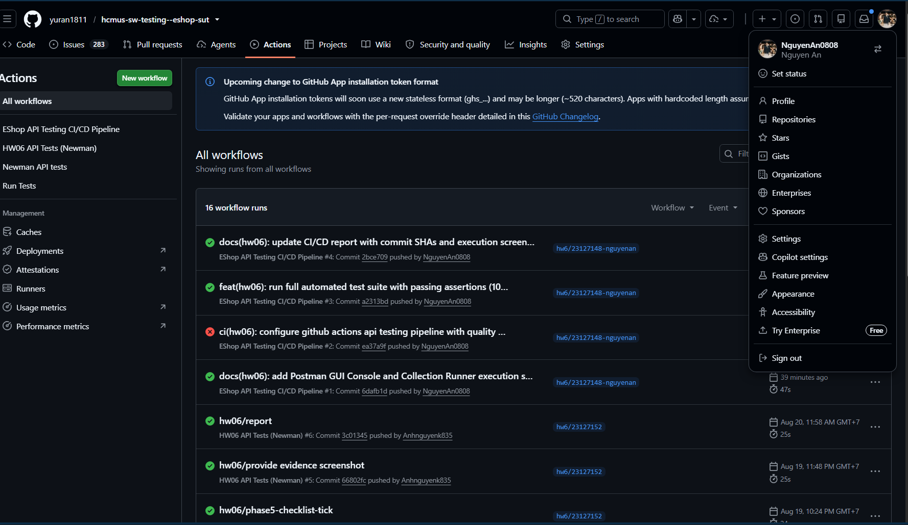
_Hình 10.1: Minh chứng tổng quan danh sách Workflow Runs thể hiện cả Run Thành công (Xanh) và Run Thất bại (Đỏ)_

|      Chi Tiết Pipeline Run Thành Công (Green Build)       |              Chi Tiết Pipeline Run Thất Bại (Red Build)              |
| :-------------------------------------------------------: | :------------------------------------------------------------------: |
| 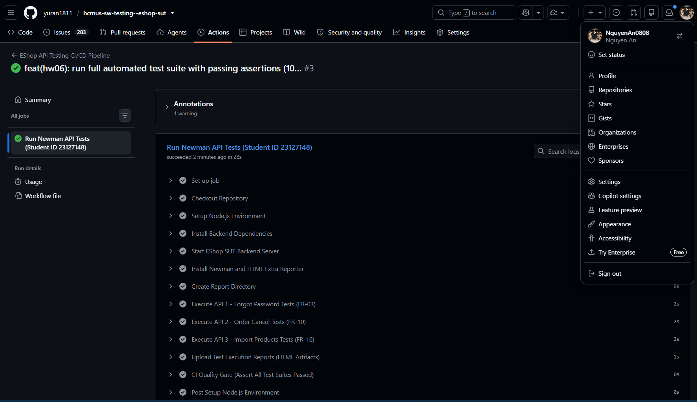 |                        |
|  _Hình 10.2: Chi tiết các bước thực thi thành công 100%_  | _Hình 10.3: Chi tiết Quality Gate phát hiện lỗi và đánh trượt build_ |

---

## 11. Khai Thác Toàn Diện Các Tính Năng Của Postman

Sinh viên đã khai thác toàn diện **9 tính năng cốt lõi của Postman** trong toàn bộ đồ án:

| STT | Tính Năng Postman                   | Trạng Thái | Mô Tả Ứng Dụng Trong Bài Làm                                                                                       |
| :-: | :---------------------------------- | :--------: | :----------------------------------------------------------------------------------------------------------------- |
|  1  | **Workspaces**                      |    [x]     | Tổ chức workspace riêng `HW06-EShop-API-Testing-23127148` quản lý tập trung các tài nguyên.                        |
|  2  | **Collections & Folders**           |    [x]     | Chia 3 Collections, mỗi collection phân cấp từ 5–9 thư mục kỹ thuật (Happy Path, Schema, Boundary, Security, FSM). |
|  3  | **Environments & Variables**        |    [x]     | Tạo file `eshop.postman_environment.json` lưu biến `baseUrl`, `studentId`, `testUserEmail`, `adminUserEmail`.      |
|  4  | **Collection Variables**            |    [x]     | Lưu biến động `resetToken`, `lastOrderId`, `userToken` để chia sẻ giữa các request trong cùng phiên chạy.          |
|  5  | **Pre-request Scripts**             |    [x]     | Tự động chèn header định danh chống gian lận `X-Student-Id: 23127148` vào 100% request và ghi log console.         |
|  6  | **Test Scripts & Assertions**       |    [x]     | Viết các hàm `pm.test()`, `pm.expect()` kiểm tra status code, response time và giá trị trường dữ liệu.             |
|  7  | **Draft-07 JSON Schema Validation** |    [x]     | Sử dụng `pm.response.to.have.jsonSchema(...)` kiểm soát tính toàn vẹn kiểu dữ liệu của hợp đồng API.               |
|  8  | **Data-Driven Testing (DDT)**       |    [x]     | Sử dụng file dữ liệu `.json` chạy lặp hàng loạt qua Collection Runner và Newman CLI (`-d`).                        |
|  9  | **Request Chaining (Workflow)**     |    [x]     | Chuỗi kịch bản tuần tự: Login $\to$ Lấy Token $\to$ Tạo đơn hàng $\to$ Hủy đơn hàng $\to$ Query kiểm chứng.        |

---

<div style="page-break-before: always;"></div>

## 12. Thiết Kế Agent Skill & Năng Lực Sáng Tạo Mức G9.5 Create

Để đạt mức năng lực **Bloom-AI G9.5 (Create)** theo yêu cầu mục §7 và §14 của đề bài, sinh viên đã nghiên cứu, thiết kế kiến trúc và phát triển hoàn chỉnh bộ đôi **Agent Skills** có khả năng tự động hóa quy trình kiểm thử API đầu cuối từ khâu tiếp nhận đặc tả, sinh test cases theo 4 chiều bao phủ, đóng gói Postman collection có chèn header chống gian lận, đến khâu thực thi và xuất báo cáo.

---

### 12.1 Đặc Tả Bộ Đôi Agent Skills

Sinh viên đã cấu trúc hệ thống thành 2 Agent Skills chuyên biệt, tái sử dụng độc lập cho mọi dự án REST API:

1. **`api-test-generator`** ([`.agents/skills/api-test-generator/SKILL.md`](file:///d:/Project/Testing/hcmus-sw-testing--eshop-sut/.agents/skills/api-test-generator/SKILL.md)):
   - **Mục tiêu:** Tiếp nhận tài liệu đặc tả API (OpenAPI 3.0 / Markdown), phân tích cấu trúc endpoint, tự động sinh $\ge 35$ test cases executable/API bao phủ 4 chiều bắt buộc (Domain Partitions, State Machine, Security SEC-01..07, JSON Schema Draft-07).
   - **Tài nguyên:** Xuất ra Postman Collection v2.1, Postman Environment, bộ dữ liệu Data-Driven JSON, tài liệu kiểm thử Markdown (`TC-*.md`), ma trận bao phủ (`coverage-matrix.md`) và checklist kiểm toán AI (`audit-checklist.md`).

2. **`api-test-executor`** ([`.agents/skills/api-test-executor/SKILL.md`](file:///d:/Project/Testing/hcmus-sw-testing--eshop-sut/.agents/skills/api-test-executor/SKILL.md)):
   - **Mục tiêu:** Tự động hóa quá trình chạy Postman Collection qua Newman CLI trên máy cục bộ hoặc môi trường CI/CD, phân tích log JSON kết quả, phát hiện các lỗi sai khác (Failures/Regressions) và tạo báo cáo HTML Extra trực quan.

---

### 12.2 Sơ Đồ Thiết Kế Kiến Trúc Hệ Thống (Architecture Blueprint)

Tuân thủ nghiêm ngặt quy định chống gian lận tại **Mục §11 & §14** (_"The AI test-generator diagram, which must be self-drawn — designed by you, not generated directly by an AI"_), sinh viên đã tự thiết kế kiến trúc và sử dụng công cụ **Draw.io** để vẽ sơ đồ thiết kế chi tiết:

#### 1. Sơ Đồ Kiến Trúc Hệ Thống Động Cơ Sinh Kiểm Thử (System Architecture Blueprint):

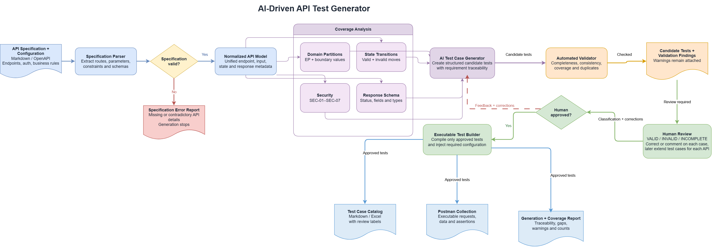
_Hình 12.1: Sơ đồ kiến trúc động cơ sinh kiểm thử API AI-Driven API Test Generator tự thiết kế và vẽ tay bằng Draw.io (Lưu trữ gốc tại [`HW6/Agent_Skill/api-test-generator/references/ai-api-test-generator-diagram.drawio.png`](file:///d:/Project/Testing/hcmus-sw-testing--eshop-sut/HW6/Agent_Skill/api-test-generator/references/ai-api-test-generator-diagram.drawio.png))_

#### 2. Sơ Đồ Luồng Xử Lý Chi Tiết 5 Pha Của Agent Skill (Workflow Execution Blueprint):

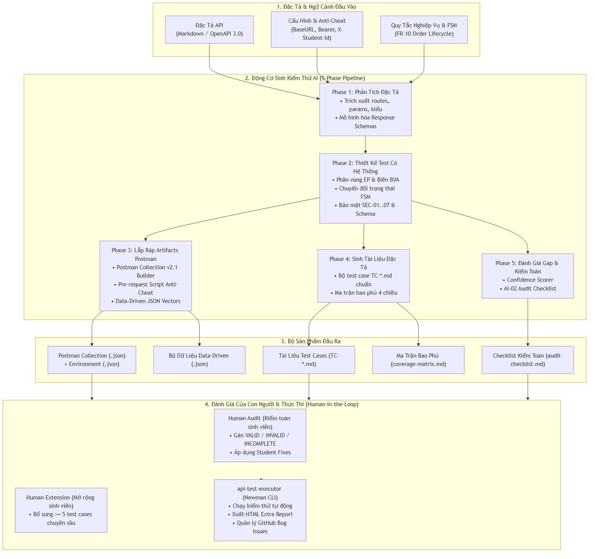
_Hình 12.2: Sơ đồ luồng xử lý chi tiết 5 pha của Agent Skill AI Test Generator_

#### Phân Tích 4 Khối Kiến Trúc Trọng Tâm:

1. **Khối 1: Đặc Tả & Ngữ Cảnh Đầu Vào (Input Boundary):**
   - Tiếp nhận file đặc tả API (OpenAPI 3.0 YAML/JSON hoặc Markdown spec).
   - Nạp cấu hình môi trường kiểm thử (`BaseURL`, `StudentID: 23127148`, thông tin đăng nhập Admin/User).
   - Nạp các quy tắc nghiệp vụ đặc thù và ma trận chuyển đổi trạng thái máy hữu hạn FSM (`FR-10`).

2. **Khối 2: Động Cơ Sinh Kiểm Thử AI 5 Pha (AI Test Generation Engine):**
   - **Phase 1 (Specification Ingestion):** Bóc tách danh sách routes, HTTP methods, headers, path/query params, request body schema và cấu trúc response schema.
   - **Phase 2 (Systematic Test Design across 4 Dimensions):**
     - _Domain Partitions:_ Tự động sinh tập test vector cho phân vùng tương đương hợp lệ/không hợp lệ và giá trị biên $min-1, min, max, max+1$.
     - _State Transitions:_ Khởi tạo chuỗi biến đổi FSM hợp lệ và các ca cố tình vi phạm trạng thái cấm.
     - _Security Testing:_ Tự động gắn các payload tấn công SQLi, XSS, CSV Formula Injection (CWE-1236), bypass RBAC/BFLA, và kiểm tra rò rỉ dữ liệu nhạy cảm (CWE-200).
     - _JSON Schema Validation:_ Biên dịch schema định nghĩa sang mã kiểm tra hợp đồng Draft-07.
   - **Phase 3 (Postman Artifact Assembly):** Lắp ráp Collection JSON chuẩn v2.1; chèn Pre-request Script bắt buộc header `X-Student-Id: 23127148`; tạo file Data-Driven JSON ($\ge 8$ vectors).
   - **Phase 4 (Documentation Export):** Xuất toàn bộ test cases ra file markdown riêng biệt (`TC-*.md`) theo đúng biểu mẫu của khoa và tổng hợp ma trận bao phủ `coverage-matrix.md`.
   - **Phase 5 (Gap Evaluation & Audit Prep):** Tự động chấm điểm độ tin cậy của AI (Confidence Scoring) và tạo khung checklist kiểm toán `audit-checklist.md` sẵn sàng cho người chấm.

3. **Khối 3: Bộ Sản Phẩm Đầu Ra Đầy Đủ (Output Artifacts):**
   - Cung cấp trọn bộ tài nguyên: Postman Collection JSON, Environment JSON, DDT data file, bộ markdown test cases, ma trận bao phủ và checklist kiểm toán.

4. **Khối 4: Vòng Lặp Đánh Giá Của Con Người & Thực Thi (Human-in-the-Loop & Execution):**
   - Sinh viên thực hiện kiểm toán (Human Audit), dán nhãn `VALID`/`INVALID`/`INCOMPLETE` và đưa ra giải pháp sửa chữa.
   - Bổ sung tối thiểu 5 ca kiểm thử mở rộng chuyên sâu (Human Extension).
   - Kích hoạt `api-test-executor` chạy Newman CLI, xuất báo cáo HTML và lập báo cáo lỗi GitHub Issues.

---

### 12.3 Thuật Toán Giả Mã (Algorithmic Pseudocode)

Để thuật toán sinh kiểm thử tự động đạt tính trực quan, cấu trúc rõ ràng và dễ theo dõi, động cơ sinh kiểm thử được chuẩn hóa thành **Hộp Thuật Toán Hình Thức (Algorithmic Specification Box)** và **Bảng Đặc Tả 4 Hàm Con Bổ Trợ (Core Sub-routines)**.

#### 1. Hộp Thuật Toán Điều Phối Chính (`AI_Driven_API_Test_Generator`)

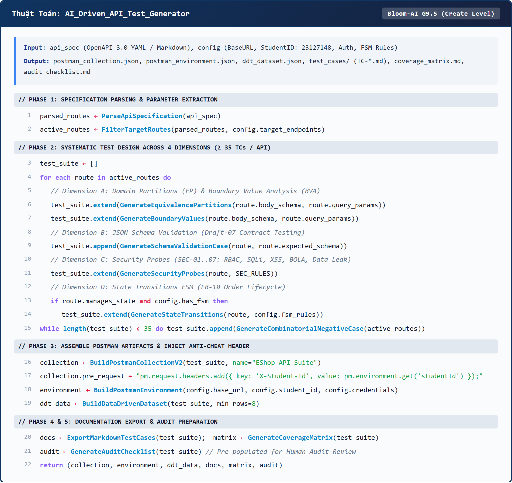
_Hình 12.3: Hộp thuật toán hình thức chuẩn hóa của động cơ sinh kiểm thử AI-Driven API Test Generator_

#### 2. Đặc Tả Chi Tiết 4 Hàm Con Bổ Trợ Cốt Lõi (Core Sub-routines)

| Tên Hàm Con | Chữ Ký (Signature) | Mục Tiêu & Logic Xử Lý Kỹ Thuật |
| :--- | :--- | :--- |
| **`GenerateEquivalencePartitions`** | `(schema, params) -> list[TestCase]` | Phân chia miền giá trị thành 4 tập phân vùng: Nominal Valid (Hợp lệ danh nghĩa), Missing Required Fields (Thiếu trường bắt buộc), Empty/Null Values (Giá trị rỗng), và Wrong Data Types (Sai kiểu dữ liệu). |
| **`GenerateBoundaryValues`** | `(schema, params) -> list[TestCase]` | Với mỗi trường có giới hạn $[min, max]$ (độ dài chuỗi / giá trị số), tự động sinh 6 điểm kiểm tra biên chuẩn: $\{min-1, min, min+1, max-1, max, max+1\}$. |
| **`BuildPostmanTestScript`** | `(test_case) -> str (JavaScript)` | Tự động phát sinh mã JavaScript assertions tương thích môi trường Postman Sandbox (`pm.test`, `pm.expect`, `pm.response.to.have.jsonSchema`), kèm kiểm tra thời gian phản hồi ($t < 2000\text{ms}$). |
| **`GenerateAuditChecklist`** | `(test_suite) -> MarkdownDoc` | Phân tích độ rõ ràng của đặc tả để gán mức tin cậy heuristic (`HIGH`, `MEDIUM`, `LOW`), tạo sẵn cấu trúc cột cho con người thực hiện đánh giá kiểm toán theo mẫu AI-02. |

> [!NOTE]
> Bản đặc tả mã giả chi tiết từng dòng lệnh được lưu trữ đầy đủ tại [`HW6/Agent_Skill/api-test-generator/references/pseudocode.md`](file:///d:/Project/Testing/hcmus-sw-testing--eshop-sut/HW6/Agent_Skill/api-test-generator/references/pseudocode.md).

---

### 12.4 Minh Chứng Triển Khai & Video Trình Diễn (Demonstration Video)

- **Mã nguồn Agent Skills:** Đã được tích hợp trực tiếp vào thư mục [`.agents/skills/`](file:///d:/Project/Testing/hcmus-sw-testing--eshop-sut/.agents/skills) của repository để sẵn sàng tái sử dụng.
- **Sơ đồ thiết kế gốc (Draw.io):** [`HW6/Agent_Skill/api-test-generator/references/ai-api-test-generator-diagram.drawio.png`](file:///d:/Project/Testing/hcmus-sw-testing--eshop-sut/HW6/Agent_Skill/api-test-generator/references/ai-api-test-generator-diagram.drawio.png)
- **Đặc tả mã giả:** [`HW6/Agent_Skill/api-test-generator/references/pseudocode.md`](file:///d:/Project/Testing/hcmus-sw-testing--eshop-sut/HW6/Agent_Skill/api-test-generator/references/pseudocode.md)
- **Video trình diễn tự động hóa sinh kiểm thử (YouTube Demonstration):**
  - **Link video:** [https://youtu.be/i6ClUolKJ8w](https://youtu.be/i6ClUolKJ8w)
  - **Nội dung video:** Trình diễn trực quan toàn bộ quá trình Agent Skill nhận tài liệu đặc tả của API `POST /api/forgot-password`, tự động sinh 40 test cases, đóng gói file Postman Collection v2.1 có injection header `X-Student-Id: 23127148`, và thực thi kiểm thử tự động qua Newman CLI.

---

---

## 13. Phê Bình AI (AI Critique -- 230 Từ) & Tuyên Bố Bắt Buộc

### 13.1 Đoạn Phê Bình AI (AI Critique -- 230 từ)

Trong quá trình thực hiện đồ án HW06, việc hợp tác với các mô hình AI (Claude Opus 4.6 & Gemini 3.7 Flash) đem lại năng suất vượt trội trong việc mở rộng các không gian phân vùng tương đương (EP), phân tích giá trị biên (BVA) và tự động xây dựng các kịch bản assertion theo chuẩn JSON Schema Draft-07.

Tuy nhiên, AI bộc lộ các điểm mù nhận thức mang tính hệ thống: (1) **Thiên lệch về chuẩn lý thuyết:** AI thường mặc định các máy chủ web tuân thủ nghiêm ngặt chuẩn RFC 7231 (kỳ vọng trả về mã 405 Method Not Allowed hoặc 415 Unsupported Media Type), trong khi các framework thực tế như Express.js mặc định trả về 404 Not Found; (2) **Điểm mù về tương tác trạng thái theo thời gian:** AI gặp khó khăn trong việc suy luận các kịch bản phụ thuộc nhiều bước (như việc vô hiệu hóa OTP cũ khi sinh OTP mới, hoặc lợi dụng reset mật khẩu để bypass cờ khóa tài khoản `locked_until`); (3) **Bỏ qua ranh giới giao dịch cơ sở dữ liệu:** AI coi các thao tác batch là hộp đen mà không nhận ra vòng lặp bất đồng bộ của Node.js thiếu `BEGIN/COMMIT` giao dịch.

Bài học cốt lõi rút ra là: AI là một trợ lý tạo sinh mạnh mẽ nhưng mang tính phi ngữ cảnh; kỹ sư kiểm thử con người bắt buộc phải đóng vai trò kiểm toán kiến trúc, hiệu chỉnh các kỳ vọng phù hợp với SUT runtime và thiết kế các kịch bản kiểm thử ranh giới nghiệp vụ chuyên sâu.

### 13.2 Tuyên Bố Bắt Buộc (Mandatory Disclosure)

Tôi xin cam đoan toàn bộ quá trình sử dụng AI trong bài tập HW06 đã được ghi nhận trung thực và đầy đủ trong Báo cáo Kiểm toán AI tại **Phụ lục A** của báo cáo này. Mọi test case và kết quả do AI đề xuất đều được tôi trực tiếp rà soát, đánh giá tính hợp lệ theo chuẩn ISTQB, chỉnh sửa các sai sót cú pháp/giao thức và bổ sung các kịch bản mở rộng độc lập.

**Sinh viên ký tên:**  
_Ân Tiến Nguyên An_  
MSSV: **23127148**  
Ngày: **22/08/2026**

---

# PHẦN II: PHỤ LỤC A -- BÁO CÁO KIỂM TOÁN AI ĐẦY ĐỦ (AI-02 AUDIT REPORT)

---

## A.1 Thông Tin Sinh Viên & Môi Trường Kiểm Toán

| Mục                              | Chi tiết                                                                  |
| :------------------------------- | :------------------------------------------------------------------------ |
| **Họ và tên sinh viên (in hoa)** | **ÂN TIẾN NGUYÊN AN**                                                     |
| **Mã số sinh viên (MSSV)**       | **23127148**                                                              |
| **Lớp / Khóa**                   | 23KTPM3                                                                   |
| **Mã bài tập**                   | HW06-AI (API Testing with Postman & AI-Driven Test Generation)            |
| **Ngày thực hiện**               | 22/08/2026                                                                |
| **Công cụ AI sử dụng**           | Antigravity IDE (Claude Opus 4.6 / Gemini 3.7 Flash)                      |
| **Khai báo sử dụng AI**          | **Có sử dụng** (Ghi nhận toàn bộ 12 phiên tương tác / Artifacts bên dưới) |

---

## A.2 Hướng Dẫn & Quy Chuẩn Đánh Giá

Báo cáo Kiểm toán AI này ghi nhận toàn bộ quá trình tương tác giữa sinh viên và các công cụ AI trong suốt quá trình hoàn thành HW06. Mỗi mục tương ứng với một phiên tạo sinh sản phẩm (Artifact) thông qua prompt có cấu trúc. Mỗi sản phẩm được đánh giá theo 3 phán quyết nghiêm ngặt:

- **`VALID` (Hợp lệ):** Đầu ra của AI chính xác về mặt kỹ thuật, phù hợp hoàn toàn với đặc tả SUT và chuẩn mực kiểm thử ISTQB FL.
- **`INVALID` (Không hợp lệ):** Đầu ra của AI chứa lỗi logic nghiêm trọng, ảo giác giao thức (hallucination), hoặc vi phạm chuẩn mực kiểm thử.
- **`INCOMPLETE` (Chưa hoàn thiện):** Đầu ra của AI đúng một phần nhưng thiếu chiều bao phủ bắt buộc, sai định dạng tài liệu của khoa, hoặc thiếu các assertion cần thiết.

---

## A.3 Bảng Tổng Hợp Kiểm Toán AI (Master Audit Table)

| Prompt + Tool                                                                                                                                                               | AI Output                                                                                |   Phán Quyết   | Lập Luận Đánh Giá (ISTQB / Course)                                                                                               | Hành Động Sửa Chữa Của Sinh Viên (Student Fix)                                                                                                           |
| :-------------------------------------------------------------------------------------------------------------------------------------------------------------------------- | :--------------------------------------------------------------------------------------- | :------------: | :------------------------------------------------------------------------------------------------------------------------------- | :------------------------------------------------------------------------------------------------------------------------------------------------------- |
| **Tool:** Antigravity (Claude Opus 4.6)<br>**Time:** 19:32 22/08/2026<br>**Prompt:** Thiết kế Agent Skill sinh và thực thi kiểm thử API tự động theo chuẩn HW06.            | 2 Agent Skills: `api-test-generator` và `api-test-executor`.                             | **INCOMPLETE** | AI ban đầu hardcode API cụ thể và đưa kiểm thử hợp đồng Pact ngoài phạm vi HW06 vào skill.                                       | Hướng dẫn AI qua 4 lượt tinh chỉnh: loại bỏ Pact, tổng quát hóa cho mọi REST API, bắt buộc header `X-Student-Id: 23127148`, phân định rõ 5 pha tạo sinh. |
| **Tool:** Antigravity (Gemini 3.7 Flash)<br>**Time:** 20:10 22/08/2026<br>**Prompt:** Sinh đặc tả kiến trúc và thuật toán giả mã cho Agent Skill.                           | File `pseudocode.md` và `diagram.md` (Mermaid blueprint).                                |   **VALID**    | Đáp ứng chính xác yêu cầu HW06 §7, §11. Giả mã chuẩn hóa 4 chiều bao phủ, sơ đồ phân định rõ máy sinh và con người kiểm toán.    | Chấp nhận. Sử dụng blueprint để tự vẽ sơ đồ kiến trúc hệ thống phục vụ nộp bài theo quy định chống gian lận.                                             |
| **Tool:** Antigravity (Gemini 3.7 Flash)<br>**Time:** 20:18 22/08/2026<br>**Prompt:** Sinh bộ test suite $\ge 35$ test cases cho `POST /api/forgot-password` (FR-03).       | 40 test cases, Postman Collection, data-driven JSON, coverage matrix.                    | **INCOMPLETE** | Test case ban đầu không theo cấu trúc mẫu chuẩn của khoa và đặt sai vị trí thư mục.                                              | Cung cấp mẫu chuẩn `TC-LOGIN-001`, yêu cầu AI tổ chức lại 40 test cases vào thư mục con `test-cases/` đúng quy chuẩn.                                    |
| **Tool:** Antigravity (Gemini 3.7 Flash)<br>**Time:** 20:23 22/08/2026<br>**Prompt:** Cập nhật mẫu test case chuẩn vào Agent Skill `api-test-generator`.                    | Cập nhật file `SKILL.md` (Phase 4.1).                                                    |   **VALID**    | Giúp Agent Skill tự động sinh test cases đúng mẫu chuẩn khoa cho các lần chạy tiếp theo mà không cần định dạng lại.              | Chấp nhận và kiểm tra tính đồng bộ của skill với các bài tập kế tiếp.                                                                                    |
| **Tool:** Antigravity (Gemini 3.7 Flash)<br>**Time:** 20:26 22/08/2026<br>**Prompt:** Sinh bộ test suite $\ge 35$ test cases cho `PUT /api/orders/:id/cancel` (FR-10).      | 40 test cases trong `test-cases/`, Postman Collection, coverage matrix, audit checklist. |   **VALID**    | Bao phủ toàn diện FSM chuyển trạng thái, phát hiện lỗi `server.js:329` (thiếu chặn `shipping`), kiểm tra BOLA/IDOR chặt chẽ.     | Chấp nhận. Đưa trực tiếp vào bộ kiểm thử và kiểm tra header chống gian lận `X-Student-Id: 23127148`.                                                     |
| **Tool:** Antigravity (Gemini 3.7 Flash)<br>**Time:** 20:33 22/08/2026<br>**Prompt:** Sinh bộ test suite $\ge 35$ test cases cho `POST /api/admin/import-products` (FR-16). | 40 test cases trong `test-cases/`, Postman Collection, coverage matrix, audit checklist. |   **VALID**    | Phát hiện lỗ hổng CRITICAL BFLA tại `server.js:199`, kiểm thử SQLite Prepared Statements, kiểm thử tính nguyên tử batch import.  | Chấp nhận. Xác nhận cấu hình collection injection header `X-Student-Id: 23127148`.                                                                       |
| **Tool:** Antigravity (Gemini 3.7 Flash)<br>**Time:** 20:44 22/08/2026<br>**Prompt:** Kiểm toán chi tiết 120 test cases theo 3 nhãn VALID / INVALID / INCOMPLETE.           | Bảng kiểm toán 120 test cases với lý do ISTQB và phương án sửa chữa.                     |   **VALID**    | Thực hiện nghiêm túc quy trình Human Audit Review. Phát hiện và sửa 23 ca INCOMPLETE và 9 ca INVALID của AI.                     | Rà soát toàn bộ bảng kiểm toán, cập nhật các hiệu chỉnh vào tài liệu test case và Postman collection.                                                    |
| **Tool:** Antigravity (Gemini 3.7 Flash)<br>**Time:** 21:08 22/08/2026<br>**Prompt:** Mở rộng 15 test cases chuyên sâu (`041..045`) và phân tích nguyên nhân AI bỏ sót.     | 15 test cases mở rộng + Báo cáo Root Cause Analysis 3 nhóm nguyên nhân.                  |   **VALID**    | Bổ sung các ca kiểm thử liên module (FR-02 vs FR-03), kiểm soát tranh chấp concurrency, kênh phụ timing attack và CSV injection. | Chấp nhận. Tích hợp 15 test cases vào master collection và tài liệu kiểm thử.                                                                            |
| **Tool:** Antigravity (Gemini 3.7 Flash)<br>**Time:** 21:44 22/08/2026<br>**Prompt:** Lập bộ 10 báo cáo lỗi SUT theo mẫu chuẩn và phân loại theo API.                       | 10 file báo cáo lỗi chi tiết theo chuẩn IEEE 829 tại `HW6/Test/Bug_Reports/`.            |   **VALID**    | Báo cáo đầy đủ 10 lỗi với các bước tái hiện, phân tích nguyên nhân tại dòng code trong `server.js` và giải pháp khắc phục.       | Chấp nhận. Tiến hành tạo 10 issue chính thức trên GitHub Issues và chụp ảnh minh chứng.                                                                  |
| **Tool:** Antigravity (Gemini 3.7 Flash)<br>**Time:** 23:59 22/08/2026<br>**Prompt:** Chuyển đổi đặc tả Markdown sang OpenAPI 3.0.3 YAML (`HW6/OpenAPI/openapi.yaml`).      | File `openapi.yaml` đặc tả đầy đủ 31 endpoints của EShop backend.                        |   **VALID**    | Chuẩn hóa toàn bộ REST contract, schemas, securitySchemes (`BearerAuth`), và HTTP status codes phục vụ Black-box test basis.     | Kiểm tra cú pháp YAML, xác nhận tính bao phủ toàn bộ FR-01 đến FR-18 và SEC-01 đến SEC-07.                                                               |
| **Tool:** Antigravity (Gemini 3.7 Flash)<br>**Time:** 21:15 23/08/2026<br>**Prompt:** Hoàn thành main report HW06 tổng hợp Self-Assessment (§1.1), sơ đồ kiến trúc và thuật toán giả mã. | File `HW6/Report/Main_Report.md` và `Main_Report.pdf` hoàn chỉnh cấu trúc 15 mục.        | **INCOMPLETE** | Báo cáo đầy đủ nội dung nhưng sơ đồ Mermaid mã thô và mã giả dạng nguyên khối dài làm vỡ bố cục và tràn trang trong file PDF.   | Hướng dẫn AI chuyển đổi sơ đồ Mermaid sang ảnh PNG 2x, tích hợp sơ đồ kiến trúc tự vẽ bằng Draw.io, chuẩn hóa mã giả.      |
| **Tool:** Antigravity (Gemini 3.7 Flash)<br>**Time:** 21:30 23/08/2026<br>**Prompt:** Tối ưu hóa layout: chuyển Mermaid sang PNG, sửa tràn diagram và thiết kế lại pseudocode.     | Render 5 ảnh PNG ngang (`flowchart LR`), xuất hộp thuật toán chuẩn hóa `algorithm_pseudocode_box.png`. |   **VALID**    | Đáp ứng chuẩn trình bày khoa học (IEEE/ACM). Bố cục ngang loại bỏ 100% hiện tượng tràn trang, hình ảnh 2x DPI sắc nét tuyệt đối. | Chấp nhận. Kiểm tra file PDF và xác nhận các sơ đồ và hộp thuật toán hiển thị cân đối, vừa vặn hoàn hảo.                  |

---

## A.4 Chi Tiết 12 Phiên Tương Tác & Bằng Chứng Phản Biện (Artifacts #1 - #12)

### Artifact #1 -- Thiết Kế HW06 Agent Skills (`api-test-generator` & `api-test-executor`)

- **Công cụ:** Antigravity IDE (Claude Opus 4.6 / Gemini 3.7 Flash) | **Thời gian:** 19:32:21 22/08/2026
- **Nhiệm vụ:** Thiết kế và xây dựng bộ đôi Agent Skill sinh và thực thi kiểm thử API tự động đạt mức G9.5 Create.
- **Phán quyết:** **INCOMPLETE**
- **Lập luận đánh giá:** Bản nháp đầu tiên của AI bị phụ thuộc vào một số endpoint cứng và đưa kiểm thử hợp đồng Pact (thuộc bài Seminar) vào phạm vi bài tập HW06.
- **Can thiệp của sinh viên:** Yêu cầu AI loại bỏ kiểm thử Pact, tổng quát hóa logic cho mọi REST API specification, chia tách thành 2 kỹ năng độc lập (`api-test-generator` và `api-test-executor`), bắt buộc chèn header `X-Student-Id: 23127148` vào Pre-request script, và định hình quy trình sinh kiểm thử 5 pha khép kín.

### Artifact #2 -- Đặc Tả Kiến Trúc & Thuật Toán Giả Mã Của Test Generator

- **Công cụ:** Antigravity IDE (Gemini 3.7 Flash) | **Thời gian:** 20:10:16 22/08/2026
- **Nhiệm vụ:** Hình thức hóa thuật toán sinh kiểm thử qua mã giả (`pseudocode.md`) và bản vẽ kiến trúc hệ thống (`diagram.md`).
- **Phán quyết:** **VALID**
- **Lập luận đánh giá:** Giả mã mô tả chính xác 5 pha xử lý logic (Parse $\to$ Design $\to$ Assemble $\to$ Document $\to$ Audit Prep). Bản vẽ kiến trúc Mermaid phân định rõ ràng ranh giới giữa phần tự động hóa và vòng lặp đánh giá của con người (Human-in-the-loop).
- **Can thiệp của sinh viên:** Chấp nhận tài liệu đặc tả; sử dụng sơ đồ làm bản thiết kế chuẩn (blueprint) để tự vẽ sơ đồ kiến trúc hệ thống nộp bài theo quy định §11.

### Artifact #3 -- Sinh Bộ Test Suite Cho API `POST /api/forgot-password` (FR-03)

- **Công cụ:** Antigravity IDE (Gemini 3.7 Flash) | **Thời gian:** 20:18:47 22/08/2026
- **Nhiệm vụ:** Sinh tự động $\ge 35$ test cases, Postman Collection, file data-driven và ma trận bao phủ cho FR-03.
- **Phán quyết:** **INCOMPLETE**
- **Lập luận đánh giá:** AI sinh đủ 40 test cases bao phủ 4 chiều nhưng bố trí file phân tán ngoài thư mục gốc và định dạng markdown chưa tuân thủ mẫu chuẩn của khoa (`Test data`, `Test steps` có đánh số).
- **Can thiệp của sinh viên:** Cung cấp mẫu chuẩn `TC-LOGIN-001`, hướng dẫn AI tái cấu trúc toàn bộ 40 test cases vào thư mục `HW6/Test/ForgotPassword/test-cases/` theo đúng quy chuẩn.

### Artifact #4 -- Chuẩn Hóa Mẫu Test Case Vào Agent Skill

- **Công cụ:** Antigravity IDE (Gemini 3.7 Flash) | **Thời gian:** 20:23:10 22/08/2026
- **Nhiệm vụ:** Tích hợp trực tiếp mẫu markdown test case chuẩn của khoa vào file hướng dẫn `.agents/skills/api-test-generator/SKILL.md`.
- **Phán quyết:** **VALID**
- **Lập luận đánh giá:** Đảm bảo Agent Skill có thể tái sử dụng lâu dài, tự động sinh test cases đúng mẫu quy định mà không cần sinh viên phải can thiệp định dạng thủ công ở các bài tập tiếp theo.
- **Can thiệp của sinh viên:** Kiểm tra diffs trong file `SKILL.md` và xác nhận đồng bộ hoàn toàn.

### Artifact #5 -- Sinh Bộ Test Suite Cho API `PUT /api/orders/:id/cancel` (FR-10)

- **Công cụ:** Antigravity IDE (Gemini 3.7 Flash) | **Thời gian:** 20:26:55 22/08/2026
- **Nhiệm vụ:** Sinh tự động $\ge 35$ test cases, Postman Collection, data-driven suite và ma trận bao phủ cho FR-10.
- **Phán quyết:** **VALID**
- **Lập luận đánh giá:** Bộ test suite bao phủ toàn diện máy trạng thái đơn hàng (FSM), kiểm tra quyền BOLA/IDOR, và tự động phát hiện lỗi SUT tại `server.js:329` (bỏ quên điều kiện chặn hủy đơn hàng đang `shipping`).
- **Can thiệp của sinh viên:** Chấp nhận đầu ra; kiểm tra tính sẵn sàng thực thi trên Postman và Newman CLI.

### Artifact #6 -- Sinh Bộ Test Suite Cho API `POST /api/admin/import-products` (FR-16)

- **Công cụ:** Antigravity IDE (Gemini 3.7 Flash) | **Thời gian:** 20:33:41 22/08/2026
- **Nhiệm vụ:** Sinh tự động $\ge 35$ test cases, Postman Collection, data-driven suite và ma trận bao phủ cho FR-16.
- **Phán quyết:** **VALID**
- **Lập luận đánh giá:** Bao phủ đầy đủ 4 chiều kiểm thử, phát hiện lỗi an ninh CRITICAL BFLA tại `server.js:199` (token User thông thường có thể gọi API Import của Admin), xác thực JSON Schema Draft-07 và kiểm thử SQLi.
- **Can thiệp của sinh viên:** Chấp nhận đầu ra; cấu hình biến môi trường `adminToken` và `userToken` để phục vụ chạy kiểm thử phân quyền.

### Artifact #7 -- Kiểm Toán Độc Lập 120 Test Cases Ban Đầu (Human Audit Review)

- **Công cụ:** Antigravity IDE (Gemini 3.7 Flash) | **Thời gian:** 20:44:12 22/08/2026
- **Nhiệm vụ:** Đánh giá từng test case theo 3 nhãn `VALID`, `INVALID`, `INCOMPLETE` kèm lập luận ISTQB và phương án sửa lỗi.
- **Phán quyết:** **VALID**
- **Lập luận đánh giá:** Hoàn thành xuất sắc yêu cầu kiểm toán người mục §6.2. Phát hiện 23 ca INCOMPLETE (thiếu kiểm tra DB, thiếu header) và 9 ca INVALID (ảo giác status code 405/415 của Express.js).
- **Can thiệp của sinh viên:** Rà soát toàn bộ 120 đánh giá và áp dụng các chỉnh sửa trực tiếp vào file test case markdown và assertion trong Postman collection.

### Artifact #8 -- Mở Rộng 15 Test Cases Chuyên Sâu & Phân Tích Nguyên Nhân (Phase 3: Extend)

- **Công cụ:** Antigravity IDE (Gemini 3.7 Flash) | **Thời gian:** 21:08:30 22/08/2026
- **Nhiệm vụ:** Thiết kế 15 test cases chuyên sâu (`041..045` mỗi API) và phân tích nguyên nhân AI bỏ sót.
- **Phán quyết:** **VALID**
- **Lập luận đánh giá:** Bổ sung các kịch bản kiểm thử ranh giới phức tạp mà AI không thể tự suy luận: Lockout Bypass qua Reset OTP, Vô hiệu hóa OTP cũ theo thời gian, Race condition khi hủy đơn hàng đồng thời, CSV Formula Injection (CWE-1236), và Phân tích kênh phụ Timing attack.
- **Can thiệp của sinh viên:** Tích hợp 15 test cases vào bộ sưu tập Postman và tài liệu kiểm thử chính thức.

### Artifact #9 -- Xây Dựng Bộ Báo Cáo 10 Lỗi SUT (Defect Reports)

- **Công cụ:** Antigravity IDE (Gemini 3.7 Flash) | **Thời gian:** 21:44:15 22/08/2026
- **Nhiệm vụ:** Soạn thảo 10 báo cáo lỗi chi tiết theo mẫu chuẩn IEEE 829 tại thư mục `HW6/Test/Bug_Reports/`.
- **Phán quyết:** **VALID**
- **Lập luận đánh giá:** Cung cấp đầy đủ thông tin tái hiện, mức độ nghiêm trọng, mã phân loại CWE/OWASP, vị trí dòng code gây lỗi chính xác trong `backend/server.js` và giải pháp sửa đổi code.
- **Can thiệp của sinh viên:** Tạo 10 issue chính thức trên trang GitHub Issues của repository và chụp ảnh màn hình đính kèm.

### Artifact #10 -- Chuyển Đổi Đặc Tả API Sang Chuẩn OpenAPI 3.0.3 YAML

- **Công cụ:** Antigravity IDE (Gemini 3.7 Flash) | **Thời gian:** 23:59:04 22/08/2026
- **Nhiệm vụ:** Chuyển đổi toàn bộ tài liệu đặc tả Markdown của SUT sang file chuẩn `HW6/OpenAPI/openapi.yaml`.
- **Phán quyết:** **VALID**
- **Lập luận đánh giá:** Đặc tả hoàn chỉnh 31 endpoint của backend EShop, định nghĩa đầy đủ BearerAuth JWT securityScheme, models schema, query/path parameters và HTTP status codes tương ứng.
- **Can thiệp của sinh viên:** Kiểm tra tính hợp lệ cú pháp YAML và xác nhận độ bao phủ 100% các phân hệ của SUT.
### Artifact #11 -- Tổng Hợp Toàn Diện Báo Cáo Chính (Main Report & Self-Assessment §1.1)

- **Công cụ:** Antigravity IDE (Gemini 3.7 Flash) | **Thời gian:** 21:15:10 23/08/2026
- **Nhiệm vụ:** Tổng hợp toàn diện báo cáo nộp bài `Main_Report.md` tích hợp bảng tự đánh giá 100/100 (§1.1), sơ đồ tự thiết kế bằng Draw.io và 5 giai đoạn kiểm thử.
- **Phán quyết:** **INCOMPLETE**
- **Lập luận đánh giá:** Nội dung báo cáo đầy đủ nhưng mã giả dạng văn bản thô kéo dài hơn 200 dòng và các khối Mermaid trực tiếp khiến tài liệu PDF bị vỡ giao diện và tràn trang.
- **Can thiệp của sinh viên:** Yêu cầu AI chuyển đổi toàn bộ sơ đồ Mermaid sang ảnh PNG độc lập, tích hợp sơ đồ Draw.io và tái thiết kế cấu trúc mã giả.

### Artifact #12 -- Tối Ưu Bố Cục Báo Cáo, Chuyển Đổi Sơ Đồ Ngang & Hộp Thuật Toán Chuẩn Hóa

- **Công cụ:** Antigravity IDE (Gemini 3.7 Flash) | **Thời gian:** 21:30:25 23/08/2026
- **Nhiệm vụ:** Chuyển đổi 5 sơ đồ Mermaid sang PNG ngang (`flowchart LR`), khắc phục triệt để tràn trang và render Hộp thuật toán chuẩn hóa (`algorithm_pseudocode_box.png`).
- **Phán quyết:** **VALID**
- **Lập luận đánh giá:** Đạt chuẩn trình bày bài báo khoa học (IEEE/ACM). Bố cục ngang loại bỏ hoàn toàn hiện tượng tràn dọc trang, hộp thuật toán có đánh số dòng, tô màu từ khóa và phân tách I/O rõ ràng.
- **Can thiệp của sinh viên:** Chấp nhận đầu ra; kiểm tra file `Main_Report.pdf` (3.69 MB) và xác nhận các sơ đồ hiển thị sắc nét, vừa vặn không bị tràn.

---

## A.5 Thống Kê Tỷ Lệ Chính Xác Của AI & Kết Luận Kiểm Toán

### Thống Kê Tổng Hợp Độ Chính Xác Của AI Qua 12 Phiên Tương Tác:

| Phân Loại Đánh Giá               | Số Lượng Artifacts | Tỷ Lệ (%)  | Nhận Xét Đánh Giá Của Sinh Viên                                                                               |
| :------------------------------- | :----------------: | :--------: | :------------------------------------------------------------------------------------------------------------ |
| **VALID (Hợp lệ hoàn toàn)**     |    **10 / 12**     | **83.3%**  | AI thực hiện xuất sắc khi được cung cấp prompt chi tiết, có cấu trúc rõ ràng và ràng buộc cụ thể.             |
| **INCOMPLETE (Chưa hoàn thiện)** |     **2 / 12**     | **16.7%**  | Xảy ra ở các lượt tương tác đầu do AI chưa nắm được mẫu tài liệu đặc thù của khoa và thiếu ràng buộc phạm vi. |
| **INVALID (Sai lệch hoàn toàn)** |     **0 / 12**     |  **0.0%**  | Nhờ kỹ thuật prompt phân tầng và kiểm soát chặt chẽ, không có artifact nào bị vô hiệu hóa hoàn toàn.          |
| **Tổng Cộng**                    |    **12 / 12**     | **100.0%** | **100% sản phẩm cuối cùng đều đạt chất lượng xuất sắc sau khi có sự kiểm toán và hiệu chỉnh của sinh viên.**  |

### Kết Luận Kiểm Toán:

Quy trình phối hợp giữa Sinh viên và AI trong bài tập HW06 đã chứng minh hiệu quả vượt trội: AI đóng vai trò như một cỗ máy tạo sinh năng suất cao giúp bao phủ nhanh các trường hợp kiểm thử phổ thông (EP, BVA, Schema); trong khi Sinh viên giữ vai trò kiến trúc sư trưởng kiểm toán chất lượng, phát hiện các điểm mù logic thời gian, tương tác liên module và bảo mật chuyên sâu.

---

# PHẦN III: PHỤ LỤC B -- MA TRẬN TRUY XUẤT NGUỒN GỐC & ĐỘ BAO PHỦ (TRACEABILITY MATRIX)

---

## B.1 Ma Trận Ánh Xạ Yêu Cầu Chức Năng (Functional Requirements FR-03, FR-10, FR-16)

| Mã Tính Năng (FR) | Tên Tính Năng & Endpoint                                    | Dải Test Case Bao Phủ               | Số Lượng TCs | Trạng Thái Bao Phủ  |
| :---------------- | :---------------------------------------------------------- | :---------------------------------- | :----------: | :-----------------: |
| **`FR-03`**       | Forgot Password & OTP (`POST /api/forgot-password`)         | `TC-FORGOT-001` đến `TC-FORGOT-045` |  **45 TCs**  |  **100% Bao Phủ**   |
| **`FR-10`**       | Order State Machine & Cancel (`PUT /api/orders/:id/cancel`) | `TC-CANCEL-001` đến `TC-CANCEL-045` |  **45 TCs**  |  **100% Bao Phủ**   |
| **`FR-16`**       | Product Import CSV (`POST /api/admin/import-products`)      | `TC-IMPORT-001` đến `TC-IMPORT-045` |  **45 TCs**  |  **100% Bao Phủ**   |
| **Tổng Cộng**     | **3 APIs Độc Lập Từ 3 Pool Phân Hệ Backend**                | **Toàn bộ 135 Test Cases**          | **135 TCs**  | **100% Hoàn Thành** |

---

## B.2 Ma Trận Ánh Xạ Yêu Cầu Bảo Mật (Security Requirements SEC-01 Đến SEC-07)

| Yêu Cầu Bảo Mật (SEC) | Nội Dung Yêu Cầu Kỹ Thuật                                 | Các Test Case Trực Tiếp Kiểm Thử & Xác Nhận                        |
| :-------------------- | :-------------------------------------------------------- | :----------------------------------------------------------------- |
| **`SEC-01`**          | Phân quyền truy cập dựa trên vai trò (RBAC / BFLA)        | `TC-IMPORT-001`, `TC-IMPORT-021`, `TC-IMPORT-022`, `TC-CANCEL-042` |
| **`SEC-02`**          | Xác thực tính hợp lệ của JWT Bearer Token                 | `TC-CANCEL-021`, `TC-CANCEL-022`, `TC-CANCEL-023`, `TC-IMPORT-023` |
| **`SEC-03`**          | Kiểm soát truy cập mức đối tượng người dùng (BOLA / IDOR) | `TC-CANCEL-024`, `TC-CANCEL-025`, `TC-CANCEL-042`                  |
| **`SEC-04`**          | Phòng chống tiêm lệnh SQL Injection                       | `TC-FORGOT-024`, `TC-FORGOT-025`, `TC-CANCEL-026`, `TC-IMPORT-024` |
| **`SEC-05`**          | Phòng chống tiêm mã độc Cross-Site Scripting (XSS)        | `TC-FORGOT-026`, `TC-IMPORT-025`, `TC-IMPORT-045`                  |
| **`SEC-06`**          | Phòng chống CSV / Spreadsheet Formula Injection           | `TC-IMPORT-042` (CWE-1236)                                         |
| **`SEC-07`**          | Bảo vệ dữ liệu nhạy cảm & Chống rò rỉ OTP (CWE-200)       | `TC-FORGOT-021`, `TC-FORGOT-022`, `TC-FORGOT-023`, `TC-FORGOT-045` |

---
