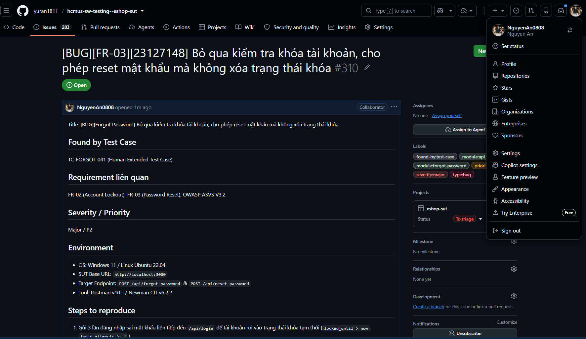

# Danh Sách Báo Cáo Lỗi SUT (Defect & Bug Reports -- HW06)

**Học phần:** Kiểm chứng phần mềm (CS423 / CSC13003)  
**Sinh viên thực hiện:** Ân Tiến Nguyên An (MSSV: **23127148**)  
**Hệ thống kiểm thử (SUT):** EShop Demo Application (`backend/server.js`)  

---

## 1. Bảng Tổng Hợp 10 Lỗi Phát Hiện Được Phân Theo API

| Mã Bug | Module / API Endpoint | Tên Lỗi (Bug Title) | Found by TC | Severity / Priority | Trạng Thái SUT |
| :--- | :--- | :--- | :---: | :---: | :---: |
| **`BUG-FORGOT-001`** | `POST /api/forgot-password` | Lộ mã xác thực OTP (`resetToken`) dạng văn bản rõ trong HTTP response body | `TC-FORGOT-027` | **Critical / P1** | Confirmed Defect |
| **`BUG-FORGOT-002`** | `POST /api/forgot-password` | Sinh mã OTP độ dài 4 chữ số với entropy quá thấp và PRNG yếu (`Math.random`) | `TC-FORGOT-028` | **Major / P2** | Confirmed Defect |
| **`BUG-FORGOT-003`** | `POST /api/forgot-password` | Lỗ hổng dò quét người dùng (User Enumeration) qua phân biệt Response Code (200 vs 404) | `TC-FORGOT-026` | **Medium / P2** | Confirmed Defect |
| **`BUG-FORGOT-004`** | `POST /api/forgot-password` | Sập server (500 Internal Server Error) do TypeError khi nhận Content-Type không phải JSON | `TC-FORGOT-034..035` | **Major / P2** | Confirmed Defect |
| **`BUG-FORGOT-005`** | `POST /api/forgot-password` | Bỏ qua kiểm tra khóa tài khoản, cho phép reset mật khẩu mà không xóa trạng thái khóa | `TC-FORGOT-041` | **Major / P2** | Confirmed Defect |
| **`BUG-CANCEL-001`** | `PUT /api/orders/:id/cancel` | Vi phạm máy trạng thái FSM, cho phép hủy đơn hàng đang ở trạng thái Shipping (Vận chuyển) | `TC-CANCEL-003` | **Critical / P1** | Confirmed Defect |
| **`BUG-CANCEL-002`** | `PUT /api/orders/:id/cancel` | Thiếu ràng buộc kiểm tra sở hữu người dùng trong câu lệnh UPDATE trạng thái đơn hàng | `TC-CANCEL-041..042` | **Major / P2** | Confirmed Defect |
| **`BUG-IMPORT-001`** | `POST /api/admin/import-products` | Lỗ hổng leo thang đặc quyền BFLA cho phép người dùng thường import sản phẩm của Admin | `TC-IMPORT-001` | **Critical / P1** | Confirmed Defect |
| **`BUG-IMPORT-002`** | `POST /api/admin/import-products` | Bỏ qua kiểm tra miền giá trị, cho phép import sản phẩm có giá tiền âm (`price < 0`) | `TC-IMPORT-029` | **Major / P2** | Confirmed Defect |
| **`BUG-IMPORT-003`** | `POST /api/admin/import-products` | Thao tác batch import thiếu tính nguyên tử giao dịch (Transaction Atomicity / Rollback Absence) | `TC-IMPORT-041` | **Medium / P3** | Architecture Gap |

---

## 2. Cấu Trúc Thư Mục Bug Reports

```
HW6/Test/Bug_Reports/
├── README.md
├── Github_Issues/
│   ├── 10-bug-issues.png
│   ├── issue-1.png
│   ├── issue-2.png
│   └── issue-3.png
├── ForgotPassword/
│   ├── BUG-FORGOT-001.md
│   ├── BUG-FORGOT-002.md
│   ├── BUG-FORGOT-003.md
│   ├── BUG-FORGOT-004.md
│   └── BUG-FORGOT-005.md
├── OrderCancel/
│   ├── BUG-CANCEL-001.md
│   └── BUG-CANCEL-002.md
└── ImportProducts/
    ├── BUG-IMPORT-001.md
    ├── BUG-IMPORT-002.md
    └── BUG-IMPORT-003.md
```

---

## 3. Minh Chứng Báo Cáo Lỗi Trên GitHub Issues (Live Issues Evidence)

Toàn bộ 10 lỗi phát hiện được đã được sinh viên lập phiếu báo cáo lỗi chính thức trên mục **Issues** của GitHub Repository với đầy đủ nhãn phân loại (labels `bug`, `security`, `fsm`, `critical`), độ ưu tiên và các bước tái hiện kèm ảnh chụp kiểm thử:

### 3.1 Danh Sách 10 Issues Trên GitHub:

*Hình 1: Danh sách 10 lỗi SUT được quản lý chính thức trên GitHub Issues*

### 3.2 Minh Chứng Chi Tiết Các Phiếu Báo Lỗi Mẫu:

#### Issue #1: Lỗ hổng BFLA Admin Phân Quyền (`POST /api/admin/import-products`)


#### Issue #2: Vi phạm FSM cho phép hủy đơn hàng `shipping` (`PUT /api/orders/:id/cancel`)


#### Issue #3: Lộ OTP Cleartext trong Response Body (`POST /api/forgot-password`)


