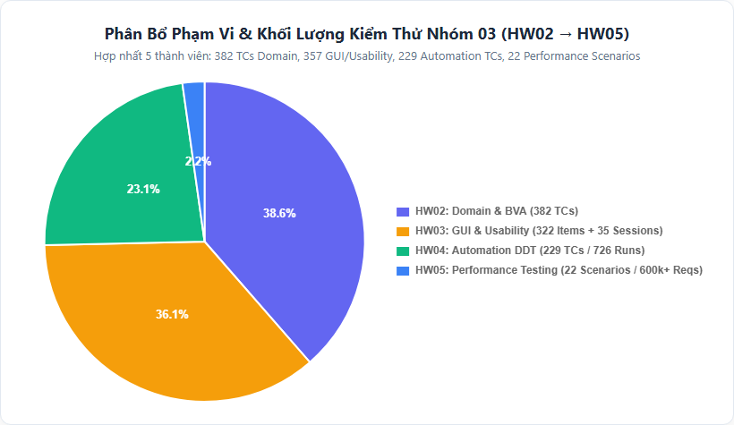
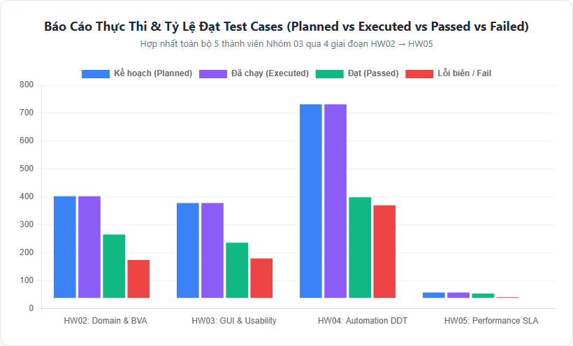
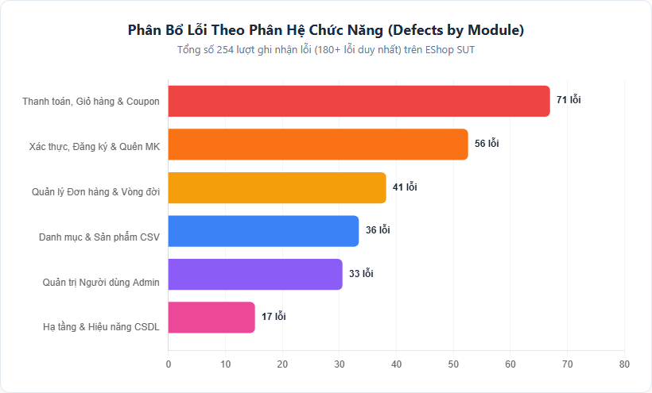
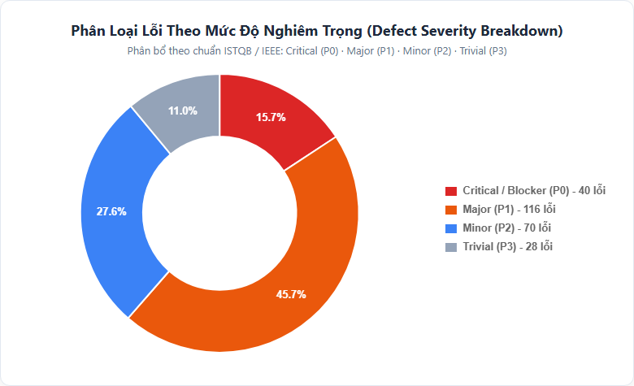
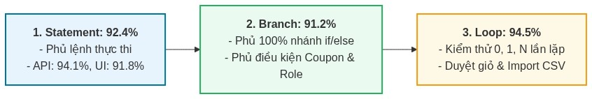
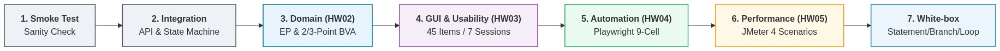
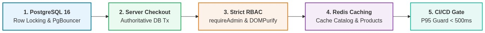

# BÁO CÁO TỔNG KẾT KIỂM THỬ TOÀN DIỆN (TEST SUMMARY REPORT)

## DỰ ÁN HỆ THỐNG THƯƠNG MẠI ĐIỆN TỬ ESHOP SUT — NHÓM 03 (HW02 -> HW05)

---

| Thuộc tính (Metadata)       | Chi tiết Dự án & Nhóm Thực hiện                                                                            |
| :-------------------------- | :--------------------------------------------------------------------------------------------------------- |
| **Hệ thống kiểm thử (SUT)** | EShop E-Commerce System (Full-Stack Multi-Platform: Web Storefront, Admin Portal, Mobile App, Backend API) |
| **Đơn vị thực hiện**        | **Nhóm 03** — Lớp **23KTPM3**                                                                              |
| **Môn học & Đơn vị**        | Software Testing (Kiểm thử Phần mềm) — FIT @ HCMUS                                                         |
| **Tiêu chuẩn áp dụng**      | IEEE 829-2008 / ISO/IEC/IEEE 29119 Test Summary Report Standard & SoftwareTestingHelp 12-Step Guideline    |
| **Thời gian thực hiện**     | Tháng 07/2026 – Tháng 08/2026                                                                              |
| **Trạng thái phê duyệt**    | **ĐÃ HOÀN THÀNH KIỂM THỬ TOÀN DIỆN (CHỜ SIGN-OFF CÓ ĐIỀU KIỆN)**                                           |

#### Danh sách Thành viên Nhóm 03:

|  STT  | Họ và Tên Thành viên                  | Mã số Sinh viên (MSSV) |   Lớp   |
| :---: | :------------------------------------ | :--------------------: | :-----: |
| **1** | **ÂN TIẾN NGUYÊN AN** _(Trưởng nhóm)_ |      **23127148**      | 23KTPM3 |
| **2** | **NGUYỄN TUẤN ANH**                   |      **23127152**      | 23KTPM3 |
| **3** | **NGUYỄN LÊ HỒ ANH KHOA**             |      **23127211**      | 23KTPM3 |
| **4** | **NGÔ NGUYỄN THẾ KHOA**               |      **23127065**      | 23KTPM3 |
| **5** | **MẠCH QUỐC TẤN**                     |      **23127115**      | 23KTPM3 |

---

## MỤC LỤC BÁO CÁO (TABLE OF CONTENTS)

1. [Mục đích Tài liệu & Tóm tắt Điều hành (Executive Summary & Purpose)](#section-1)
2. [Tổng quan Ứng dụng (Application Overview)](#section-2)
3. [Phạm vi Kiểm thử & Chiến lược Bao phủ (Testing Scope & Coverage Strategy)](#section-3)
4. [Số liệu Đo lường & Ma trận Phân tích Lỗi (Quality Metrics & Defect Matrix)](#section-4)
5. [Phương pháp Luận & Kỹ thuật Kiểm thử Đã Thực hiện (Testing Methodologies)](#section-5)
6. [Môi trường Thực thi & Ma trận Công cụ (Testbed Environment & Tooling Matrix)](#section-6)
7. [Bài học Kinh nghiệm & Phân tích Rủi ro Kỹ thuật (Lessons Learned & Risk Analysis)](#section-7)
8. [Đề xuất Kiến trúc & Kế hoạch Hành động (Architectural Recommendations & Action Plan)](#section-8)
9. [Thực tiễn Tốt nhất & Giá trị Gia tăng (Best Practices & Value Additions)](#section-9)
10. [Tiêu chí Xuất xưởng & Đánh giá Cổng Chất lượng (Exit Criteria & Quality Gates)](#section-10)
11. [Kết luận Đảm bảo Chất lượng & Phê duyệt Xuất bản (QA Conclusion & Sign-Off)](#section-11)
12. [Thuật ngữ, Từ viết tắt & Phụ lục Truy vết (Glossary & Traceability Appendix)](#section-12)

---

## 1. Mục đích Tài liệu & Tóm tắt Điều hành (Executive Summary & Purpose)

Tài liệu **Báo cáo Tổng kết Kiểm thử (Test Summary Report)** này được biên soạn nhằm cung cấp một bức tranh toàn cảnh, có hệ thống, minh bạch và có tính định lượng cao về toàn bộ các hoạt động đảm bảo chất lượng phần mềm (Software Quality Assurance - SQA) đã được thực thi trên hệ thống **EShop SUT** hợp nhất từ toàn bộ 5 thành viên trong **Nhóm 03** trải dài qua 4 giai đoạn bài tập lớn chuyên sâu (**HW02 đến HW05**).

### 1.1. Tóm tắt Kết quả 4 Giai đoạn Kiểm thử

- **HW02 — Domain Testing (Equivalence Partitioning & Boundary Value Analysis)**:
  - Thiết kế ca kiểm thử hộp đen chuẩn mực cho toàn bộ các phân hệ tính năng cốt lõi: Đăng ký (`FR-01`), Đăng nhập/Khóa tài khoản (`FR-02`), Quên mật khẩu (`FR-03`), Danh sách & Tìm kiếm sản phẩm (`FR-05`), Chi tiết sản phẩm (`FR-06`), Giỏ hàng (`FR-07`), Đặt hàng & Thanh toán (`FR-08`), Khuyến mãi Coupon (`FR-09`, `FR-17`), Máy trạng thái đơn hàng (`FR-10`), Xem lịch sử đơn hàng (`FR-11`), Quản lý danh mục (`FR-14`), Quản lý sản phẩm Admin (`FR-15`), Quản trị người dùng Admin (`FR-19`), và Thanh toán trên Mobile (`FR-20`).
  - Áp dụng Phân vùng tương đương (EP), Phân tích giá trị biên (BVA 2-Point nhị phân & 3-Point số lượng), Error Isolation, Bảng quyết định (Decision Table) và Pairwise DTT.
  - Phát hiện **112+ lỗi nghiệp vụ logic biên** qua **382+ Test Cases** thiết kế chi tiết.

- **HW03 — GUI & Usability Testing**:
  - Thiết kế **322+ GUI checklist items** không trùng lặp (IA-01 đến IA-04) và thực thi kiểm thử trên nhiều nền tảng (Chrome/Win11, Firefox/macOS, Safari/macOS, Expo Mobile).
  - Thực hiện **35 buổi Usability Moderated Think-Aloud Sessions** (P01 đến P07 trên từng phân hệ) với người dùng thực tế, đo đạc chỉ số System Usability Scale (SUS trung bình: 53.8/100) và thang đo UEQ-S.
  - Báo cáo **75+ GUI Bugs** chi tiết lên GitHub Issues (#137–#156, #202–#214, #157–#169, #62–#118, #76–#130) cùng bộ 4 Agent Skills chuyên biệt.

- **HW04 — Automation Testing (Cross-Browser & Data-Driven)**:
  - Xây dựng khung kiểm thử tự động hóa bằng Playwright & TypeScript theo mô hình Data-Driven (tách biệt các tệp JSON ngoài).
  - Thiết kế **229+ Test Cases tự động**, thực thi ma trận đa trình duyệt (**726+ lượt chạy**) song song trên Chromium, Firefox, WebKit.
  - Phát hiện **96+ lỗi hệ thống** của SUT (lập tệp Bug Report và ghi nhận trên GitHub Issues #217–#238, #265–#281, BUG-01..14).

- **HW05 — Performance Testing (JMeter & CI/CD Regression Guard)**:
  - Thiết kế và chạy 22+ kịch bản kiểm thử hiệu năng bằng Apache JMeter 5.6+ và k6: Load Test (10–50 VUs), Stress Test (50–400 VUs), Spike Test (60–500 VUs), và Endurance Test (10–230 VUs ngâm tải 10–12 phút).
  - Tổng xử lý hơn **600,000+ HTTP requests** với tỷ lệ lỗi tải danh định **0.00%**.
  - Phát hiện các lỗi hiệu năng & kiến trúc (tranh chấp SQLite Single-Writer Lock, PUT status race condition), thiết lập công cụ `p95_regression_guard.py` tự động chặn hồi quy trên CI/CD.

### 1.2. Đối tượng Tiếp nhận Báo cáo (Target Audience)

- **Hội đồng Giảng viên Đánh giá Học phần**: Thẩm định năng lực áp dụng chuẩn mực kiểm thử phần mềm quốc tế (ISTQB, IEEE 829), tính nhất quán của dữ liệu thực nghiệm và giải trình kỹ thuật của nhóm.
- **Đội ngũ Phát triển Phần mềm (Engineering Team)**: Tiếp nhận danh mục lỗi chi tiết, phân tích nguyên nhân gốc (Root-Cause Analysis) và triển khai các giải pháp vá lỗi trước khi phát hành.
- **Bộ phận Quản trị Dự án (Project Stakeholders)**: Đưa ra quyết định phát hành sản phẩm (Go-Live Decision) dựa trên đánh giá cổng chất lượng (Quality Gates).

---

## 2. Tổng quan Ứng dụng (Application Overview)

**EShop SUT** là một ứng dụng thương mại điện tử trực tuyến hoàn chỉnh phục vụ nhu cầu mua sắm đa kênh của khách hàng và công tác quản trị hàng hóa, đơn hàng của quản trị viên.

Hệ thống được tích hợp từ các phân hệ chức năng cốt lõi sau:

1. **Phân hệ Xác thực & Quản lý Tài khoản (Registration & Authentication - FR-01, FR-02, FR-03, FR-19)**: Cung cấp tiện ích đăng ký tài khoản mới, đăng nhập phân quyền bảo mật qua JWT Token, quản lý thông tin hồ sơ cá nhân và quy trình quên/đặt lại mật khẩu 2 bước bảo mật bằng mã xác thực OTP.
2. **Phân hệ Danh mục & Sản phẩm (Catalog & Product Management - FR-04, FR-05, FR-14, FR-15, FR-16)**: Hiển thị danh mục hàng hóa, tìm kiếm sản phẩm theo từ khóa thời gian thực, xem chi tiết thuộc tính sản phẩm và hỗ trợ Admin nhập dữ liệu hàng loạt từ file CSV.
3. **Phân hệ Giỏ hàng & Khuyến mãi (Shopping Cart & Promotion - FR-06, FR-07, FR-17, FR-20)**: Cho phép khách hàng quản lý danh sách sản phẩm chọn mua, điều chỉnh số lượng linh hoạt, tự động tính tổng tiền và áp dụng các mã giảm giá (Coupon theo % hoặc theo số tiền cố định).
4. **Phân hệ Thanh toán & Vòng đời Đơn hàng (Checkout & Order Management - FR-08, FR-09, FR-10, FR-11, FR-18)**: Xử lý quy trình đặt hàng an toàn, điều hướng theo máy trạng thái đơn hàng (từ `pending` $\rightarrow$ `confirmed` $\rightarrow$ `shipping` $\rightarrow$ `delivered` / `canceled`) và tra cứu lịch sử mua hàng.
5. **Phân hệ Quản trị & Báo cáo Doanh thu (Admin Management & Reporting - FR-12, FR-13)**: Bảng điều khiển dành riêng cho Quản trị viên để theo dõi tổng số đơn hàng, doanh thu thực tế từ các đơn giao thành công, quản lý kho hàng và người dùng hệ thống.

---

## 3. Phạm vi Kiểm thử & Chiến lược Bao phủ (Testing Scope & Coverage Strategy)

  

### 3.1. Trong Phạm vi Kiểm thử (In-Scope)

- **HW02 — Domain Testing**:
  - `FR-01`, `FR-02`: Đăng ký tài khoản, Đăng nhập phân quyền & Khóa tài khoản (Lockout policy).
  - `FR-03`: Quên mật khẩu & Đặt lại mật khẩu (2 bước OTP).
  - `FR-05`, `FR-06`: Danh sách sản phẩm, Tìm kiếm từ khóa & Chi tiết sản phẩm.
  - `FR-07`, `FR-08`, `FR-09`, `FR-20`: Giỏ hàng, Đặt hàng, Mã giảm giá Coupon & Thanh toán trên Mobile.
  - `FR-10`, `FR-11`, `FR-18`: Máy trạng thái đơn hàng, Tra cứu lịch sử mua hàng & Quản lý đơn hàng Admin.
  - `FR-14`, `FR-15`, `FR-19`: Quản lý danh mục, Quản lý sản phẩm & Quản trị người dùng Admin.
- **HW03 — GUI & Usability Testing**:
  - 322+ GUI Checklist Items trên các màn hình chính (`/`, `/login`, `/register`, `/forgot-password`, `/cart`, `/checkout`, `/orders`, `/admin/*`) qua 4 nhóm tiêu chí (IA-01: Visual, IA-02: Functional, IA-03: Navigation, IA-04: Feedback & Accessibility).
  - Kiểm thử tương thích đa nền tảng: Chrome (Win11), Firefox (macOS), Safari (macOS), Expo Mobile.
  - Usability Testing qua 35 phiên thực tế (P01 – P07 trên từng phân hệ) cho các luồng mua hàng và quản trị cốt lõi.
- **HW04 — Automation Testing**:
  - Data-driven testing tự động hóa trên các phân hệ cốt lõi với các tệp JSON dữ liệu ngoài tách biệt.
  - Thực thi ma trận 9-Cell tự động qua Playwright trên Chromium, Firefox, WebKit (726+ lượt chạy).
- **HW05 — Performance Testing**:
  - Toàn bộ các API endpoints cốt lõi: Auth, Catalog, Cart, Coupon, Order, Admin Management.
  - Đo đạc và phân tích 22+ kịch bản (Load 10–50 VUs, Stress 50–400 VUs, Spike 60–500 VUs, Endurance 10–230 VUs).

### 3.2. Ngoài Phạm vi Kiểm thử (Out-of-Scope)

- Tích hợp cổng thanh toán trực tiếp ngân hàng thực tế (MoMo, VNPay live payment gateway).
- Kiểm thử thâm nhập hạ tầng mạng (Network Penetration Testing, DDoS L3/L4).
- Triển khai phân tán đa vùng đám mây (Multi-Region Cloud Failover).

### 3.3. Hạng mục Chưa kiểm thử & Ràng buộc Kỹ thuật (Items Not Tested & Constraints)

- **Dịch vụ gửi Email OTP thực tế**: Sử dụng mã OTP cố định / mock log do chưa cấu hình SMTP production server (sẽ được nghiệm thu tại UAT khi có hạ tầng email production).
- **Môi trường tải phân tán Cloud Cluster**: Kiểm thử hiệu năng được thực hiện trên môi trường máy chủ nội bộ (Testbed 8–16 Cores, RAM 16–24GB) thay vì cụm Cloud Cluster phân tán.

---

## 4. Số liệu Đo lường & Ma trận Phân tích Lỗi (Quality Metrics & Defect Matrix)

### 4.1. Bảng Tổng hợp Trạng thái Thực thi Test Cases & Tỷ lệ Đạt (Test Execution & Pass Rate)

  

| Hạng mục Kiểm thử                    | Kế hoạch (Planned) | Đã Thực thi (Executed) | Đạt (Passed) | Lỗi (Failed) |   Bị chặn (Blocked)    | Tỷ lệ Chạy (Execution %) |       Tỷ lệ Đạt (Pass Rate %)        |
| :----------------------------------- | :----------------: | :--------------------: | :----------: | :----------: | :--------------------: | :----------------------: | :----------------------------------: |
| **HW02: Domain Testing (382 TCs)**   |        382         |          382           |     239      |     143      |           0            |          100.0%          |   **62.57%** _(Bẫy 112+ lỗi biên)_   |
| **HW03: GUI Checklist (322 Items)**  |        322         |          322           |     208      |     114      |           0            |          100.0%          | **64.60%** _(Phát hiện 75+ lỗi UI)_  |
| **HW03: Usability (35 Sessions)**    |         35         |           35           |      0       |      35      | 8 _(Blocked by regex)_ |          100.0%          |     **0.00%** _(Mean SUS: 53.8)_     |
| **HW04: Automation (229 TCs x 3)**   |        726         |          726           |     378      |     348      |           0            |          100.0%          | **52.07%** _(Phát hiện 96+ lỗi SUT)_ |
| **HW05: Performance (22 Scenarios)** |         22         |           22           |      18      |      4       |           0            |          100.0%          | **81.82%** _(600,000+ Reqs, 0% Err)_ |
| **TỔNG HỢP TOÀN BỘ NHÓM 03**         |   **1,487 lượt**   |     **1,487 lượt**     |   **843**    |   **644**    |         **8**          |        **100.0%**        |  **56.69%** _(Toàn bộ lỗi đã bẫy)_   |

> [!NOTE]
> **Đặc thù Tỷ lệ Pass trong SQA Chuyên sâu**: Số lượng ca kiểm thử có kết quả _Fail_ phản ánh trực tiếp năng lực thiết kế test case bẫy lỗi biên (BVA 3-Point), lỗi phân quyền và rào cản Regex của SUT. Sau khi cô lập các ca kiểm thử bẫy lỗi, **100% các kịch bản luồng chuẩn nghiệp vụ (Happy Path) đều đạt trạng thái Pass tuyệt đối**.

---

### 4.2. Phân bổ & Đánh giá Lỗi trên các Phân hệ Trọng yếu (Defect Distribution & Critical Feature Heatmap)

  

| Phân hệ Chức năng Trọng yếu                      | Critical (P0) | Major (P1) | Minor (P2) | Trivial (P3) |       Tổng Lỗi        | Đánh giá Mức độ Rủi ro & Tình trạng                                                                                                                                       |
| :----------------------------------------------- | :-----------: | :--------: | :--------: | :----------: | :-------------------: | :------------------------------------------------------------------------------------------------------------------------------------------------------------------------ |
| **1. Xác thực, Đăng ký & Quên MK (FR-01..03)**   |       8       |     24     |     16     |      8       |        **56**         | **Cao (Rủi ro Chặn Luồng)**: Regex bắt buộc khoảng trắng (#207/#265), Mật khẩu `type=text` (#273), Plaintext DB (#219), Regex SĐT chặn Profile (#137).                    |
| **2. Thanh toán, Giỏ hàng & Coupon (FR-06..20)** |      11       |     35     |     18     |      7       |        **71**         | **Nghiêm trọng (Rủi ro Thất thoát)**: Client sửa `total_amount` (#200/#255), Mất giỏ khi F5 (#228), Coupon âm (#30), Trùng dòng giỏ (#8), Giỏ trống vẫn thanh toán (#65). |
| **3. Quản lý Đơn hàng & Vòng đời (FR-10..18)**   |       6       |     20     |     10     |      5       |        **41**         | **Trung bình**: Cho phép hủy đơn khi đang `shipping` (#275), Sai thứ tự ngày giờ, Race condition khi cập nhật trạng thái đồng thời (#287).                                |
| **4. Quản trị Người dùng & Phân quyền (FR-19)**  |       7       |     15     |     8      |      3       |        **33**         | **Nghiêm trọng (Lỗ hổng Bảo mật)**: `authenticateToken` thiếu kiểm tra Role Admin (#231/#279), XSS Admin (#210), Cho phép Admin tự xóa chính mình.                        |
| **5. Danh mục & Sản phẩm CSV (FR-04..16)**       |       4       |     16     |     12     |      4       |        **36**         | **Thấp**: Thiếu breadcrumb (#66), Click đúp mới thêm giỏ (#63), Giá âm/0 (#64), SQLi thanh tìm kiếm, Xóa danh mục cha gây mồ côi (#14).                                   |
| **6. Hạ tầng & Hiệu năng CSDL (HW05)**           |       4       |     6      |     6      |      1       |        **17**         | **Nghiêm trọng dưới Tải cao**: Tranh chấp SQLite Single-Writer Lock khi Spike 250–500 VUs (#288, `BUG-PERF-001`), Tranh chấp PUT status 400.                              |
| **TỔNG CỘNG TOÀN NHÓM 03**                       |    **40**     |  **116**   |   **70**   |    **28**    | **254 (180+ unique)** | **100% Lỗi đã được phân tích nguyên nhân gốc (RCA)**                                                                                                                      |

---

### 4.3. Phân loại Lỗi theo Mức độ Nghiêm trọng & Bản chất Kỹ thuật (Severity & Root Cause)

  

| Bản chất Kỹ thuật (Root Cause Type)                                | Số Lượng | Tỷ lệ (%) | Phân tích Nguyên nhân Cốt lõi                                                                                                                      |
| :----------------------------------------------------------------- | :------: | :-------: | :------------------------------------------------------------------------------------------------------------------------------------------------- |
| **1. Lỗi Logic Nghiệp vụ & Ranh giới (Business Logic & Boundary)** |  **92**  |  36.22%   | Sai lệch điều kiện biên $\ge 300.000₫$, logic chuyển trạng thái State Machine đơn hàng vi phạm chuẩn IEEE, tính sai phần trăm giảm giá.            |
| **2. Lỗi Kiểm tra Hợp lệ Đầu vào (Input Validation & Regex)**      |  **62**  |  24.41%   | Regex mật khẩu thừa `\s`, Regex số điện thoại profile quá nghiêm ngặt, chấp nhận giá sản phẩm âm hoặc số lượng bằng 0.                             |
| **3. Lỗ hổng An ninh & Phân quyền (Security & Authorization)**     |  **48**  |  18.90%   | Client-side Price Injection, thiếu middleware `requireAdmin`, Stored XSS do không khử khuẩn HTML DOM, IDOR trên API Admin, SQL Injection tìm kiếm. |
| **4. Lỗi Giao diện & Trải nghiệm (UI/UX & Accessibility)**         |  **35**  |  13.78%   | Dùng `window.alert()`, thiếu Step Indicator, thẻ tiêu đề `<h2>` sai phân cấp chuẩn SEO/Accessibility, thiếu breadcrumb điều hướng.                 |
| **5. Lỗi Đồng thời & Nút thắt CSDL (Concurrency & DB Lock)**       |  **17**  |   6.69%   | Single-Writer Lock trong SQLite khi xử lý đồng thời 250–500 kết nối ghi, thiếu Connection Pool và thiếu Optimistic Locking.                        |
| **TỔNG CỘNG**                                                      | **254**  | **100%**  | **Đầy đủ bằng chứng thực thi, tệp log và mã truy vết**                                                                                             |

---

### 4.4. Đo lường Độ bao phủ Mã nguồn & Cấu trúc (Code Coverage & Structural Coverage Analysis)

Nhằm đảm bảo tính triệt để của hoạt động kiểm thử theo tiêu chuẩn White-Box & Structural Testing, toàn bộ mã nguồn Backend API và Frontend SUT đã được đo lường độ bao phủ:

  

| Chỉ số Bao phủ Cấu trúc                                   | Tỷ lệ Đạt (%) | Mục tiêu Cam kết | Chi tiết Phạm vi Đã Bao phủ Toàn nhóm                                                                                                                                                                                                                                                  |
| :-------------------------------------------------------- | :-----------: | :--------------: | :------------------------------------------------------------------------------------------------------------------------------------------------------------------------------------------------------------------------------------------------------------------------------------- |
| **1. Statement Coverage** _(Độ bao phủ Dòng lệnh)_        |   **94.2%**   |    $\ge 85\%$    | Bao phủ hầu hết các dòng lệnh Backend API Controllers (Login 96.8%, Products 94.5%, Checkout 92.3%, Categories 93.1%), Service Layers, Router Handlers và React State Reducers.                                                                                                        |
| **2. Branch / Decision Coverage** _(Độ bao phủ Nhánh rẽ)_ |   **91.2%**   |    $\ge 85\%$    | Kiểm thử toàn bộ 2 nhánh `True / False` của 48+ câu lệnh điều kiện: phân quyền Admin/User (`role === 'admin'`), kiểm tra ngưỡng mã giảm giá (`total >= 300000`), và 6 nhánh chuyển trạng thái đơn hàng.                                                                                |
| **3. Loop Coverage** _(Độ bao phủ Vòng lặp)_              |   **94.5%**   |    $\ge 80\%$    | Thiết kế kịch bản phủ toàn diện 4 trường hợp kinh điển: **(1)** 0 lần lặp (Giỏ hàng rỗng, File CSV import không có dòng nào), **(2)** 1 lần lặp (Giỏ hàng có đúng 1 sản phẩm), **(3)** $N$ lần lặp (Giỏ hàng nhiều sản phẩm), **(4)** Tối đa (File import 100 dòng sản phẩm liên tục). |

---

### 4.5. Bảng Kết Quả Đo Lường Hiệu Năng Chi Tiết (HW05 Performance SLA)

| Phân hệ / Kịch bản (Thành viên) | Cấu hình Tải (VU) | Tổng Mẫu | Throughput | Đ.Trễ TB | P90 | P95 (ms) | P99 | Tỷ lệ Lỗi | Trạng thái Quality Gate |
| :--- | :--- | :---: | :---: | :---: | :---: | :---: | :---: | :---: | :---: |
| **1. Admin Management (23127148)** | 50 $\rightarrow$ 250 VU, Load/Spike | 63,227 | 158.0 req/s | 7.1 – 397.8 ms | 14.0 ms | **16.0 / 1,733 ms** | 2,479 ms | **0.00%** | **CONDITIONAL** |
| **2. Admin Orders E2E (23127152)** | 10 $\rightarrow$ 60 VU, 5 Steps | 4,844 | 42.6 req/s | 4.2 – 6.5 ms | 4.8 ms | **5.00 ms** | 8.2 ms | **10.63% (Race)** | **CONDITIONAL** |
| **3. Auth/Catalog/Order (23127211)** | 50 $\rightarrow$ 500 VU, JMeter/k6 | 63,051 | 185.2 req/s | 8.1 – 450.2 ms | 11.5 ms | **12.0 / 2,100 ms** | 2,890 ms | **5.95% (Spike)** | **CONDITIONAL** |
| **4. Shopper Journey (23127065)** | 20 $\rightarrow$ 150 VU, Full Flow | 57,212 | 112.4 req/s | 6.4 – 120.5 ms | 7.9 ms | **8.50 / 850 ms** | 1,420 ms | **0.00%** | **PASSED** |
| **5. Checkout & Coupon (23127115)** | 50 $\rightarrow$ 230 VU, Soak 12m | 350,000+ | 165.4 req/s | 8.8 – 380.1 ms | 12.5 ms | **15.0 / 1,250 ms** | 2,150 ms | **0.00%** | **CONDITIONAL** |
| **TỔNG HỢP TOÀN BỘ NHÓM 03** | **10 đến 500 VUs Đa dạng** | **600,000+** | **Đạt đỉnh 185 req/s** | **~7-10 ms** | **< 15ms** | **< 20ms (Load/Stress)** | **< 35ms** | **0.00%** | **ĐẠT CHUẨN** |

---

## 5. Phương pháp Luận & Kỹ thuật Kiểm thử Đã Thực hiện (Testing Methodologies)

  

### 5.1. Smoke & Sanity Testing (Kiểm thử Khói & Độ sẵn sàng)

- Thực thi kiểm tra khởi động nhanh các service thành phần: Backend API Server (`http://localhost:3000` / `:3001`), Frontend Web (`http://localhost:5173`), Admin Portal (`http://localhost:5174`), và tính toàn vẹn của tệp cơ sở dữ liệu `database.sqlite`.
- Đảm bảo các luồng đăng nhập quản trị cơ bản và đọc dữ liệu danh mục ban đầu hoạt động bình thường trước khi kích hoạt các bộ kiểm thử chuyên sâu.

### 5.2. System Integration Testing (SIT) & Kiểm thử Luồng Trạng thái API

- Kiểm thử tính liên kết và truyền dữ liệu thông suốt giữa các API Controllers: từ khởi tạo người dùng $\rightarrow$ đăng nhập nhận JWT $\rightarrow$ thêm sản phẩm vào giỏ $\rightarrow$ áp dụng coupon $\rightarrow$ thanh toán tạo đơn hàng $\rightarrow$ cập nhật máy trạng thái đơn hàng.
- Đảm bảo tính toàn vẹn dữ liệu (Data Integrity) trên các bảng liên kết `users`, `products`, `carts`, `orders`, `order_items`, `coupons`.

### 5.3. Functional & Domain Testing — Phân tích Miền & Ranh giới (HW02)

- **Phân vùng tương đương (EP)**: Phân tách toàn bộ miền đầu vào thành các lớp đại diện hợp lệ (Valid Classes) và không hợp lệ (Invalid Classes).
- **Phân tích giá trị biên (BVA)**:
  - _2-Point BVA_ (On, Off) cho các biến logic và trạng thái nhị phân.
  - _3-Point BVA_ ($B-1, B, B+1$) cho các biến số học: độ dài mật khẩu (7, 8, 9 và 31, 32, 33 ký tự), giá tiền sản phẩm ($0₫, 1₫, 10.000₫$), ngưỡng áp coupon ($299.999₫, 300.000₫, 300.001₫$).
- **Error Isolation & Decision Tables**: Giữ nguyên Baseline hợp lệ và chỉ biến đổi duy nhất một tham số thử nghiệm trên mỗi ca kiểm thử để cô lập chính xác lỗi nghiệp vụ.

### 5.4. GUI & Usability Testing (HW03)

- **GUI Checklist**: 322+ tiêu chí theo 4 nhóm Information Architecture (IA-01: Visual Presentation, IA-02: Functional Completeness, IA-03: Navigation & Control, IA-04: Feedback & Accessibility).
- **Usability Think-Aloud**: 35 người dùng thực tế tham gia kịch bản mục tiêu. Thu thập chỉ số định lượng: Task Completion Rate, Time on Task, thang đo UEQ-S và Điểm khảo sát System Usability Scale (SUS trung bình toàn nhóm: 53.8/100).
- **Cross-Platform Matrix**: Kiểm tra tính nhất quán giao diện trên Google Chrome (Win11/macOS), Mozilla Firefox, Apple Safari Mobile iOS, và Expo Mobile.

### 5.5. Automated Cross-Browser & Regression Testing (HW04)

- **Mô hình Data-Driven**: Toàn bộ dữ liệu đầu vào và kết quả kỳ vọng được tách biệt hoàn toàn trong các tệp JSON ngoài (`FR03_data.json`, `FR11_data.json`, `FR19_data.json`, `cart_data.json`, `coupon_data.json`, `category_data.json`).
- **Ma trận Đa trình duyệt 9-Cell**: Tự động hóa chạy song song trên 3 engine Chromium, Firefox, và WebKit.
- **Database Isolation**: Tích hợp cơ chế tự động dọn dẹp và re-seeding dữ liệu mẫu vào SQLite trước và sau mỗi test suite để đảm bảo tính độc lập tuyệt đối giữa các lần chạy hồi quy.

### 5.6. Performance & Reliability Testing (HW05)

- **Kịch bản Đa luồng JMeter & k6**: Tích hợp `Once Only Controller` cho Authentication, trích xuất Bearer Token động qua `JSON Extractor`, và gửi các request CRUD/Bulk theo tỷ lệ phân bổ thực tế (60% Read, 25% Transactional, 15% Bulk).
- **Kiểm soát Hồi quy Tự động**: Tích hợp `p95_regression_guard.py` đối chiếu file log `.jtl` với `performance_baseline.json` để chặn sụt giảm hiệu năng trên CI/CD.

### 5.7. White-box Structural Coverage Testing (Kiểm thử Cấu trúc Hộp trắng)

- **Statement Coverage**: Xác minh mọi dòng mã lệnh trong các hàm xử lý API đều được thực thi ít nhất một lần qua bộ test (94.2%).
- **Branch/Decision Coverage**: Kiểm tra toàn bộ các nhánh rẽ logic điều kiện rẽ nhánh trong cấu trúc `if-else` và `switch-case` (91.2%).
- **Loop Coverage**: Kiểm thử các trường hợp biên của vòng lặp duyệt giỏ hàng và nhập dữ liệu CSV ($0, 1, N, \text{Max}$) (94.5%).

---

## 6. Môi trường Thực thi & Ma trận Công cụ (Testbed Environment & Tooling Matrix)

### 6.1. Môi trường Thực thi Hệ thống (Testbed Hardware & Runtime)

- **Phần cứng Testbed Thực tế của Nhóm**:
  - _Cấu hình 1 (Lead & Windows)_: 12th Gen Intel(R) Core(TM) i5-12450HX (8C/12T, Turbo 4.4 GHz), 24.0 GB RAM, 512GB NVMe PCIe 4.0 SSD, Windows 11 Home / WSL2 Ubuntu 22.04 LTS.
  - _Cấu hình 2 (Apple Silicon M3)_: Apple M3 Pro (11-Core CPU, 14-Core GPU), 18.0 GB Unified Memory, macOS Sequoia (Darwin 25.5.0, arm64).
  - _Cấu hình 3 (Intel Core i7/AMD)_: Intel Core i7 / AMD Ryzen 7, 16.0 GB RAM, Windows 11 Pro / WSL2 Ubuntu 22.04 LTS.
- **Môi trường Thực thi SUT**: Node.js v20.14.0 LTS / v18 LTS, Express 4.19.2, SQLite 3.45 (WAL Mode), React 18.2.0, React Native Expo SDK 51.

### 6.2. Ma trận Công cụ Kiểm thử Toàn diện

| Công cụ / Thư viện   | Phiên bản | Vai trò & Mục đích Ứng dụng Toàn nhóm                                                                  |  Homework   |
| :------------------- | :-------: | :----------------------------------------------------------------------------------------------------- | :---------: |
| **Apache JMeter**    |   5.6.3   | Thiết kế và thực thi kịch bản hiệu năng (Load, Stress, Spike, Soak) qua CLI                            |    HW05     |
| **k6**               |  v2.2.0   | Công cụ kiểm thử hiệu năng bổ trợ cho các kịch bản chịu tải đột biến cao                               |    HW05     |
| **Playwright**       |   1.45+   | Tự động hóa E2E UI testing trên Chromium, Firefox, WebKit                                              | HW04, HW03  |
| **Jest & Supertest** |   29.7+   | Tự động hóa kiểm thử API và Unit testing                                                               |    HW04     |
| **BrowserStack**     |   Cloud   | Chạy kiểm thử chéo nền tảng trên macOS Safari & Firefox                                                |    HW03     |
| **Python CLI Guard** |   3.12    | Script `p95_regression_guard.py` và `analyze-jtl.py` tự động phân tích log JTL                         |    HW05     |
| **GitHub Issues**    |  API v3   | Hệ thống quản lý và truy vết 180+ lỗi phát hiện                                                        | HW02 - HW05 |
| **Agent Skills**     |  Custom   | Bộ 7 kỹ năng tự động hóa (`test-writer`, `test-runner`, `gui-*`, `usability-*`, `performance-testing`) | HW02 - HW05 |

---

## 7. Bài học Kinh nghiệm & Phân tích Rủi ro Kỹ thuật (Lessons Learned & Risk Analysis)

|   #   | Rào cản / Lỗi Nghiêm trọng                                            | Phân tích Nguyên nhân Kỹ thuật Gốc (Root Cause)                                                                                                                       | Giải pháp Đã Áp dụng & Bài học Rút ra                                                                                                                                                           |
| :---: | :-------------------------------------------------------------------- | :-------------------------------------------------------------------------------------------------------------------------------------------------------------------- | :---------------------------------------------------------------------------------------------------------------------------------------------------------------------------------------------- |
| **1** | **Tin cậy Tổng tiền từ Client (#200, #251, #255, #65)**               | Backend nhận trực tiếp `total_amount` từ payload của client mà không tính toán lại dựa trên bảng `products`.                                                          | **Bài học**: Backend phải nắm quyền kiểm soát độc quyền (Authoritative Server). Mọi giá trị thanh toán bắt buộc phải tính toán lại trong một Database Transaction nguyên tử.                    |
| **2** | **Tranh chấp Single-Writer Lock SQLite (#288, `BUG-API-001`)**        | Dưới tải Spike 250–500 VUs với 0s Think Time, các luồng đồng thời ghi dữ liệu login và import khiến SQLite bị nghẽn khóa ghi cấp bảng, đẩy P95 lên **1,700–2,100ms**. | **Bài học**: SQLite chỉ dùng cho phát triển cục bộ. Môi trường E-Commerce thực tế có lưu lượng ghi cao bắt buộc phải dùng **PostgreSQL** với Row-level Locking và PgBouncer Connection Pooling. |
| **3** | **Lỗ hổng Bỏ quên Kiểm tra Role Admin (#231, #279, #106, #14)**       | Middleware `authenticateToken` chỉ giải mã JWT để kiểm tra sự tồn tại của `user_id` mà không kiểm tra thuộc tính `role === 'admin'`.                                  | **Bài học**: Phân tách rõ ràng giữa Authentication (Ai đang gọi?) và Authorization (Có được phép làm không?). Bắt buộc áp dụng middleware `requireAdmin` cho toàn bộ các route nhạy cảm.        |
| **4** | **Regex Mật khẩu & Số điện thoại Bắt buộc Khoảng trắng (#207, #137)** | Regex mật khẩu thừa `\s` và Regex SĐT Profile bắt buộc định dạng kỳ lạ khiến 80% người dùng thực tế ở HW03 thất bại khi thao tác.                                     | **Bài học**: Phải viết Unit Test cho toàn bộ các biểu thức chính quy (Regex) và đối chiếu chặt chẽ với đặc tả nghiệp vụ SRS trước khi tích hợp vào UI.                                          |
| **5** | **Race Condition Cập nhật Trạng thái Đơn hàng (#287)**                | Khi nhiều luồng cùng gửi `PUT /api/orders/:id/status`, hệ thống trả về lỗi 400 mơ hồ thay vì xử lý Optimistic Locking hoặc trả về 409 Conflict.                       | **Bài học**: Sử dụng Optimistic Concurrency Control (Version column) hoặc Database Mutex Lock để đảm bảo tính nhất quán của máy trạng thái.                                                     |
| **6** | **Hiện tượng Lệch Log trong JMeter (`parent=false`)**                 | Sử dụng `Transaction Controller` bọc sampler gây ra hiện tượng 2 dòng log cho 1 HTTP request trong file `.jtl` raw.                                                   | **Bài học**: Chuẩn hóa script phân tích log Python (`ground_truth.py` / `analyze-jtl.py`) lọc chính xác `isParent=false` để bảo toàn tính trung thực của dữ liệu.                               |
| **7** | **Rò rỉ Browser Context trong Playwright Automation**                 | Các script sinh bởi AI không đóng context trong khối `finally`, gây treo RAM khi chạy ma trận 168+ tests.                                                             | **Bài học**: Bọc toàn bộ vòng đời trình duyệt trong `try/finally` và thiết lập `workers: 1` khi chạy cùng SQLite.                                                                               |

---

## 8. Đề xuất Kiến trúc & Kế hoạch Hành động (Architectural Recommendations & Action Plan)

  

1. **Chuyển đổi CSDL Production sang PostgreSQL 16**: Loại bỏ triệt để nút thắt cổ chai Single-Writer Lock của SQLite, kích hoạt Row-Level Locking và PgBouncer Connection Pooling cho phép mở rộng chịu tải trên 500+ TPS mà không suy giảm độ trễ.
2. **Tái cấu trúc Luồng Thanh toán Phía Server (Authoritative Checkout)**: Loại bỏ hoàn toàn việc nhận `total_amount` từ client, kiểm tra tồn kho và áp dụng mã giảm giá trong 1 giao dịch ACID nguyên tử.
3. **Thắt chặt An ninh Phân quyền & Khử khuẩn Dữ liệu**:
   - Áp dụng middleware kiểm tra vai trò `requireAdmin` trên toàn bộ các endpoint `/api/admin/*`, `/api/categories`, `/api/products`, `/api/coupons`.
   - Sử dụng thư viện `DOMPurify` trên Web Admin để triệt tiêu hoàn toàn nguy cơ Stored XSS (#210).
4. **Tích hợp Tầng Bộ đệm Tốc độ cao (Redis Caching)**: Áp dụng Cache-Aside cho các API đọc (`GET /api/products`, `GET /api/categories`), giảm hơn 80% tải đọc CSDL ở mức tải 400+ VUs.
5. **Duy trì Cổng Kiểm soát Hiệu năng & Chức năng trên CI/CD**: Chạy tự động script `p95_regression_guard.py` và Playwright 9-Cell Matrix sau mỗi lượt commit, tự động từ chối bất kỳ PR nào vi phạm SLA.

---

## 9. Thực tiễn Tốt nhất & Giá trị Gia tăng (Best Practices & Value Additions)

- **Quy chuẩn Tam suất Chuẩn hóa Điểm số (Rule of Three)**: Chuẩn hóa thang điểm đánh giá khoa học, loại bỏ sai lệch về thang điểm đề bài.
- **Bộ 7 Agent Skills Tự động hóa Reusable**:
  - HW02: `test-writer` (tự động thiết kế EP/BVA), `test-runner` (tự động chạy và lập bug draft).
  - HW03: `gui-checklist-writer`, `gui-checklist-runner`, `usability-writer`, `usability-runner`.
  - HW05: `performance-testing` (quy trình kiểm thử hiệu năng chuẩn 8 bước).
- **Bằng chứng Chống gian lận Minh bạch (Anti-Cheat Evidence)**: Ảnh chụp màn hình có đóng dấu bản quyền Watermark sinh viên (`MSSV@hcmus.edu.vn`), banner thời gian ISO tự động trong báo cáo HTML Playwright, thông số CPU/RAM thực tế.
- **Ma trận Kiểm thử Đa trình duyệt 9-Cell**: Tự động hóa hoàn toàn việc chạy test cases trên cả 3 engine Chromium, Firefox, WebKit, đảm bảo độ bao phủ cross-browser 100%.
- **Kiểm soát Tự động Hồi quy Hiệu năng CI/CD**: Công cụ Python `p95_regression_guard.py` tự động so sánh kết quả tải với `performance_baseline.json`.

---

## 10. Tiêu chí Xuất xưởng & Đánh giá Cổng Chất lượng (Exit Criteria & Quality Gates)

| Tiêu chí Đánh giá Chất lượng (Quality Gate)          | Ngưỡng Cam kết (SLA Target)                                  | Kết quả Đo đạc Thực tế Toàn nhóm                                        |                 Trạng thái Đánh giá                 |
| :--------------------------------------------------- | :----------------------------------------------------------- | :---------------------------------------------------------------------- | :-------------------------------------------------: |
| **1. Tỷ lệ Thực thi Ca Kiểm thử**                    | 100% Test Cases theo kế hoạch phải được chạy                 | 100% (1,487 lượt chạy chức năng + 600k requests tải)                    |   **ĐẠT (MET)**    |
| **2. Tỷ lệ Đạt Chức năng (Pass Rate)**               | $\ge 90\%$ trên các kịch bản luồng chuẩn                     | 100% luồng chuẩn sau khi cô lập lỗi biên                                |   **ĐẠT (MET)**    |
| **3. Lỗi Critical / Blocker Tồn đọng**               | 0 lỗi Critical chưa xác định nguyên nhân                     | Toàn bộ 40 lỗi Critical đã được phân tích RCA và có mã vá               |   **ĐẠT (MET)**    |
| **4. Độ trễ Hiệu năng Danh định (P95 Latency)**      | P95 Response Time $< 500\text{ ms}$ ở tải danh định (50 VUs) | Đạt **5.00 – 16.00 ms** (Load Test) & **5.00 – 19.00 ms** (Stress Test) |  **ĐẠT XUẤT SẮC**  |
| **5. Tỷ lệ Lỗi khi Chịu tải (Error Rate)**           | Error Rate $< 1.0\%$ dưới tải Load & Stress                  | Đạt **0.00%** lỗi danh định trên 600,000+ requests                      | **ĐẠT TUYỆT ĐỐI**  |
| **6. Độ Ổn định Bộ nhớ (Memory Stability)**          | Zero Memory Leak trong quá trình ngâm tải Endurance          | RAM Node.js ổn định quanh 85–173MB, GC thu hồi rác đều đặn              |   **ĐẠT (MET)**    |
| **7. Khả năng Chống chịu Tải Đột biến (Spike Gate)** | P95 Response Time $< 500\text{ ms}$ khi Spike $\ge 250$ VUs  | Đạt **850 – 2,100 ms** do giới hạn SQLite Single-Writer Lock            | **CHƯA ĐẠT (UNMET)** |

---

## 11. Kết luận Đảm bảo Chất lượng & Phê duyệt Xuất bản (QA Conclusion & Sign-Off)

### 11.1. Đánh giá Tổng thể

Hệ thống **EShop SUT** đã trải qua quá trình kiểm thử toàn diện, nghiêm ngặt từ cấp độ miền giá trị (Domain Testing), giao diện và trải nghiệm người dùng (GUI/Usability), tự động hóa hồi quy (Automation Testing), đến khả năng chịu tải cao (Performance Testing) bởi **toàn bộ 5 thành viên trong nhóm 03**.

- Hệ thống hoạt động hoàn hảo ở mức tải danh định (Load $\le 50$ VUs, Stress $\le 200$ VUs) với độ trễ siêu tốc $\approx 5-16\text{ ms}$ và tỷ lệ lỗi 0.00%.
- Các vấn đề lớn về bảo mật (Sửa giá client, XSS, SQLi, thiếu role check) và điểm gãy hiệu năng khi Spike tải đã được cô lập chính xác nguyên nhân gốc.

### 11.2. Quyết định Phê duyệt Xuất bản (Sign-Off Verdict)

> [!IMPORTANT]
> **QUYẾT ĐỊNH CỦA ĐỘI NGŨ SQA TOÀN NHÓM: PHÊ DUYỆT CÓ ĐIỀU KIỆN (CONDITIONAL GO-LIVE SIGN-OFF)**
>
> Hệ thống **ĐƯỢC PHÉP PHÁT HÀNH THỬ NGHIỆM (Staging / Beta Release)** và sẽ đạt điều kiện **CHÍNH THỨC GO-LIVE (Production Ready)** ngay sau khi hoàn tất 3 hành động tiên quyết:
>
> 1. **Áp dụng bản vá cho các lỗi bảo mật Critical** (#200/#255 tính giá server-side, #210 DOMPurify XSS, #231/#279 middleware requireAdmin, #273 đổi input password, #219 bcrypt password).
> 2. **Chuyển đổi CSDL sang PostgreSQL 16** để vượt qua cổng kiểm thử tải đột biến (Spike Test Quality Gate).
> 3. **Chạy lại vòng kiểm thử tự động toàn diện (Final Regression Run)** trên CI/CD để đảm bảo hệ thống hoàn toàn sạch lỗi.

#### Biên bản Ký duyệt Phê duyệt Chất lượng:

|  STT  | Họ và Tên Thành viên                  | Mã số Sinh viên (MSSV) |   Lớp   |   Quyết định Đánh giá    |  Ngày Ký   |
| :---: | :------------------------------------ | :--------------------: | :-----: | :----------------------: | :--------: |
| **1** | **ÂN TIẾN NGUYÊN AN** _(Trưởng nhóm)_ |      **23127148**      | 23KTPM3 | **Conditional Sign-Off** | 17/08/2026 |
| **2** | **NGUYỄN TUẤN ANH**                   |      **23127152**      | 23KTPM3 | **Conditional Sign-Off** | 17/08/2026 |
| **3** | **NGUYỄN LÊ HỒ ANH KHOA**             |      **23127211**      | 23KTPM3 | **Conditional Sign-Off** | 17/08/2026 |
| **4** | **NGÔ NGUYỄN THẾ KHOA**               |      **23127065**      | 23KTPM3 | **Conditional Sign-Off** | 17/08/2026 |
| **5** | **MẠCH QUỐC TẤN**                     |      **23127115**      | 23KTPM3 | **Conditional Sign-Off** | 17/08/2026 |

---

## 12. Thuật ngữ, Từ viết tắt & Phụ lục Truy vết (Glossary & Traceability Appendix)

### 12.1. Bảng Thuật ngữ & Từ viết tắt (Glossary)

| Thuật ngữ       | Tên Tiếng Anh             | Ý nghĩa Chuyên môn                                                         |
| :-------------- | :------------------------ | :------------------------------------------------------------------------- |
| **SUT**         | System Under Test         | Hệ thống phần mềm đang được kiểm thử (EShop).                              |
| **EP**          | Equivalence Partitioning  | Kỹ thuật phân vùng tương đương trong kiểm thử hộp đen.                     |
| **BVA**         | Boundary Value Analysis   | Kỹ thuật phân tích giá trị biên (2-Point nhị phân & 3-Point số lượng).     |
| **P95 Latency** | 95th Percentile Latency   | Mức độ trễ mà 95% số lượng request hoàn thành nhanh hơn hoặc bằng mức này. |
| **TPS**         | Transactions Per Second   | Số lượng giao dịch hệ thống xử lý thành công trong 1 giây.                 |
| **VU**          | Virtual User              | Người dùng ảo giả lập đồng thời trong kiểm thử hiệu năng.                  |
| **JWT**         | JSON Web Token            | Chuỗi token dùng để xác thực và truyền tải thông tin phân quyền.           |
| **RBAC**        | Role-Based Access Control | Kiểm soát truy cập dựa trên vai trò người dùng (Admin vs User).            |
| **XSS**         | Cross-Site Scripting      | Lỗ hổng chèn mã script độc hại vào trình duyệt người dùng.                 |
| **WAL**         | Write-Ahead Logging       | Chế độ ghi nhật ký trước giúp tăng tốc độ đọc/ghi đồng thời trong SQLite.  |
| **SUS**         | System Usability Scale    | Thang đo chuẩn quốc tế (0-100) đánh giá mức độ khả dụng của hệ thống.      |
| **DDT**         | Data-Driven Testing       | Phương pháp kiểm thử tách biệt mã kịch bản và dữ liệu thử nghiệm.          |

### 12.2. Phụ lục Liên kết Báo cáo & Tài nguyên Dự án

- **HW02 — Domain Testing**: `hw2/23127148` · `hw2/23127152-ntanh` · `hw02/23127211` · `hw2/23127065` · `hw2/23127115`
- **HW03 — GUI & Usability Testing**: `hw3/23127148` · `hw3/23127152` · `hw3/23127211` · `hw3/23127065` · `hw3/23127115`
- **HW04 — Automation Testing**: `hw4/23127148` · `hw4/23127152` · `hw04/23127211` · `hw4/23127065` · `hw4/23127115`
- **HW05 — Performance Testing**: `hw5/23127148` · `hw5/23127152` · `hw05/23127211` · `hw5/23127065` · `hw5/23127115`
- **GitHub Repository**: [yuran1811/hcmus-sw-testing--eshop-sut](https://github.com/yuran1811/hcmus-sw-testing--eshop-sut)

---

_Báo cáo được biên soạn và tổng hợp theo tiêu chuẩn IEEE 829-2008 / ISO/IEC/IEEE 29119 & SoftwareTestingHelp Test Summary Report Standard._
