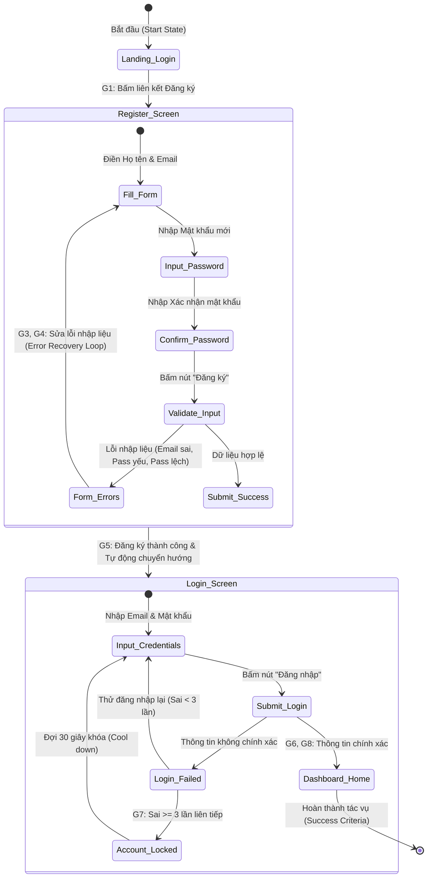

# Ghi chú Thiết kế & Tài liệu hóa (Design Notes)

Tài liệu này giải thích các quyết định thiết kế phương pháp kiểm thử usability, cách lập bản đồ yêu cầu nghiệp vụ hệ thống (SUT Requirement Mapping) và phân chia vai trò giữa AI và Con người trong quá trình xây dựng bộ tài liệu đánh giá này.

---

## 1. Bản đồ ánh xạ Yêu cầu (Requirements Mapping Matrix)

Để đảm bảo buổi kiểm thử bao phủ toàn bộ các khía cạnh nghiệp vụ đặc tả trong [README.md](file:///d:/Project/Testing/hcmus-sw-testing--eshop-sut/README.md) và các chuẩn thiết kế giao diện (Interface Aspects - IA), chúng tôi lập bảng ánh xạ các mục tiêu con (Sub-goals) của kịch bản tác vụ như sau:

| Mã Tác vụ Con | Yêu cầu Đặc tả (FR) | Khía cạnh Giao diện (IA) | Mô tả Chi tiết & Hành vi mong đợi của Người dùng |
| :---: | :--- | :--- | :--- |
| **G1** | N/A | IA-03 (Navigation) | Tìm được đường liên kết sang màn hình Đăng ký từ màn hình Đăng nhập/Trang chủ. |
| **G2** | [FR-01](file:///d:/Project/Testing/hcmus-sw-testing--eshop-sut/README.md#L30-L36) | IA-02 (Forms) | Điền đầy đủ Họ Tên, Email đúng định dạng và thiết lập mật khẩu mới. |
| **G3** | [FR-01](file:///d:/Project/Testing/hcmus-sw-testing--eshop-sut/README.md#L34) | IA-02 (Forms), IA-04 (Feedback/State) | Nhập mật khẩu đáp ứng quy chuẩn mạnh. Tự phục hồi và thử lại nếu hệ thống báo lỗi mật khẩu quá yếu. |
| **G4** | [FR-01](file:///d:/Project/Testing/hcmus-sw-testing--eshop-sut/README.md#L35) | IA-02 (Forms), IA-04 (Feedback/State) | Nhập đúng trường Xác nhận mật khẩu trùng khớp với mật khẩu đã nhập. |
| **G5** | [FR-01](file:///d:/Project/Testing/hcmus-sw-testing--eshop-sut/README.md#L36) | IA-03 (Navigation), IA-04 (Feedback/State) | Nhận diện thông báo Đăng ký thành công và hành động tự chuyển hướng về trang Đăng nhập của hệ thống. |
| **G6** | [FR-02](file:///d:/Project/Testing/hcmus-sw-testing--eshop-sut/README.md#L38-L44) | IA-02 (Forms) | Nhập chính xác thông tin đăng nhập vừa đăng ký (Email và Mật khẩu). |
| **G7** | [FR-02](file:///d:/Project/Testing/hcmus-sw-testing--eshop-sut/README.md#L41-L42) | IA-04 (Feedback/State) | Trường hợp đăng nhập sai >=3 lần liên tiếp, hệ thống khóa tài khoản 30 giây và thông báo phù hợp mà không tiết lộ lý do bảo mật. |
| **G8** | [FR-02](file:///d:/Project/Testing/hcmus-sw-testing--eshop-sut/README.md#L43) | IA-04 (Feedback/State) | Đăng nhập thành công, nhận diện giao diện chứng minh đã đăng nhập (hiển thị Tên người dùng/nút Đăng xuất). |

---

## 2. Sơ đồ luồng trạng thái Người dùng (User Flow State Transition Diagram)

Dưới đây là sơ đồ chi tiết mô tả luồng thao tác của người dùng từ khi bắt đầu tác vụ cho đến khi hoàn thành, bao gồm các vòng lặp sửa lỗi (error recovery loops) khi nhập liệu sai:

---

## 3. Phân chia vai trò Tác giả: AI vs Con người (AI vs Human Collaboration)

Bộ tài liệu Usability Test Plan này là kết quả phối hợp tối ưu hóa năng lực giữa AI và Con người nhằm đạt chất lượng cao nhất:

- **AI Đóng góp (AI Contributions)**:
  - Tự động sinh cấu trúc và khung sườn tài liệu chuẩn hóa theo phương pháp đánh giá Usability của FIT@HCMUS.
  - Phân tích mã yêu cầu đặc tả (FR-01, FR-02) từ `README.md` của EShop để trích xuất các quy tắc mật khẩu mạnh và quy chế khóa tài khoản, tích hợp vào bảng dữ liệu kiểm thử.
  - Đóng gói kịch bản tác vụ dưới dạng **goal-only** nhằm tuân thủ quy tắc kiểm thử usability không hướng dẫn từng bước click chuột.
  - Dịch thuật và bản địa hóa 10 câu hỏi SUS sang tiếng Việt tự nhiên, gần gũi với người dùng.

- **Con người Điều chỉnh & Giám sát (Human Verification & Gap-Pass)**:
  - **Tuyển chọn Người dùng thực tế**: AI chỉ cung cấp roster trống và tiêu chí, sinh viên là người trực tiếp tìm kiếm, thuyết phục 7 người ngoài lớp tham gia và ghi lại thông tin liên lạc thật (có ẩn chữ số giữa).
  - **Chạy Pilot và kiểm chứng**: Sinh viên trực tiếp chạy phiên Pilot thực tế để phát hiện các lỗi của SUT (ví dụ như lỗi Regex bắt buộc khoảng trắng ở trang đổi mật khẩu hoặc OTP hiển thị trên màn hình) và cập nhật nhật ký chạy pilot.
  - **Ký cam kết bảo mật & quyền riêng tư**: Sinh viên thực hiện xin chữ ký và đồng ý quay phim/ghi âm màn hình thật của người dùng trước khi tiến hành kiểm thử.
