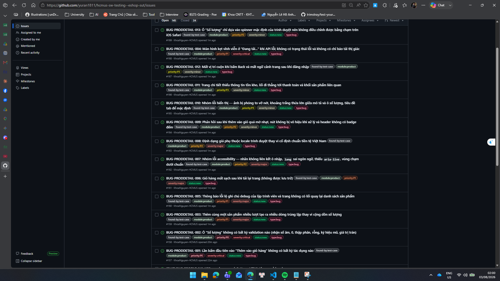

# HW03 – GUI and Usability Testing on EShop

**Mã số sinh viên:** 23127211.
**Họ và tên:** Nguyễn Lê Hồ Anh Khoa.
**Mã bài tập:** HW03-AI.
**Ngày nộp:** 03/08/2026.
**Điểm tự đánh giá:** 91.

---

## Phạm vi đã chọn

| Hạng mục                    | Lựa chọn                                                                               | Lý do                                                                                                                                                                                                                                                |
| --------------------------- | -------------------------------------------------------------------------------------- | ---------------------------------------------------------------------------------------------------------------------------------------------------------------------------------------------------------------------------------------------------- |
| **GUI Checklist** (Task 1)  | Màn hình **Product Detail** (`/product/:id`)                                           | Màn hình giao nhau của 3 pool chức năng (FR-06 hiển thị, FR-07 thêm giỏ hàng, FR-05 điều hướng từ danh sách), có đủ 4 loại thành phần cần cho IA-01→04: ảnh/giá (visual), ô số lượng (form), header (navigation), nhãn nút đổi trạng thái (feedback) |
| **Usability flow** (Task 2) | **U-01**: Tìm kiếm sản phẩm → Xem chi tiết → Thêm giỏ hàng → Áp mã giảm giá → Checkout | Flow end-to-end chạm 5 FR (FR-05, 06, 07, 09, 08), có điểm quyết định thật (chọn sản phẩm) và có bước dễ sinh friction (ô nhập mã giảm giá nằm ở trang Checkout chứ không phải Giỏ hàng)                                                             |
| **Cross-platform** (Task 3) | Chrome 126 (Windows) · Firefox 128 (Windows) · Safari (iOS, thiết bị thật qua LAN)     | Phủ trọn **cả 3 engine** Blink / Gecko / WebKit, cộng thêm một thiết bị **cảm ứng thật**                                                                                                                                                             |

---

## Phương pháp tiếp cận kiểm thử (AI-First Methodology)

Khác với HW02 (pipeline tuyến tính Requirement → Domain Testing → BVA → Traceability), HW03 có 3 nhánh công việc khác nhau về bản chất, nên áp dụng 3 pipeline riêng — mỗi pipeline đều tuân thủ cùng một nguyên tắc: **không giao AI một prompt hộp đen duy nhất**, mà chia thành các bước có điểm dừng kiểm soát của con người.

**Pipeline A — GUI Checklist (Task 1)**
`gui-checklist-builder` chạy **4 pass tuần tự, mỗi pass một interface aspect** (IA-01 → IA-04), thay vì một prompt "hãy tạo checklist GUI". Sau mỗi pass là một bước **critical review bắt buộc** — loại item trùng, viết lại Expected Result mơ hồ, và bổ sung item mà pass đó bỏ sót kèm lý do cụ thể. Skill này **chỉ thiết kế, không thực thi**: mọi ô `Status` được để `Not Run`, việc chấm Passed/Failed do con người làm khi ngồi trước ứng dụng thật.

**Pipeline B — Usability Evaluation (Task 2)**
`usability-evaluation-builder` chia 3 phase. Điểm cốt lõi của skill này là **ranh giới cứng về dữ liệu không được sinh**: danh sách 7 người tham gia và toàn bộ quan sát trong session log phải đến từ người thật, AI chỉ được tạo cấu trúc rỗng. Ranh giới này được giữ nghiêm trong suốt bài (xem mục 2.4).

**Pipeline C — Cross-Platform (Task 3)**
`cross-platform-testing-tracker` lo **nửa tổ chức** (chọn nền tảng, lọc item nào đáng chạy lại, dựng ma trận, chèn watermark) và **từ chối làm nửa thực thi** — không tự sinh screenshot, không tự điền Pass/Fail cho nền tảng chưa chạy thật.

**Nguyên tắc xuyên suốt — phân biệt "quan sát được" với "suy diễn":** Trong toàn bộ 3 pipeline, mọi kết luận đều phải truy được về một quan sát cụ thể (một thuộc tính DOM đo được, một khung hình video, một câu trả lời nguyên văn). Những chỗ không đủ bằng chứng được ghi rõ là "cần xác minh" thay vì chọn một cách giải thích nghe hợp lý — cách làm này đã trực tiếp bắt được vài chỗ dữ liệu tự thuật của người tham gia không khớp với video (xem mục 2.4).

---

# 1. Task 1 — GUI Checklist (Product Detail)

## 1.1 Thiết kế checklist — 4 pass theo interface aspect

**Cách khảo sát màn hình trước khi sinh item** (quyết định chất lượng toàn bộ checklist):

1. Đọc source `ProductDetail.jsx`, `App.jsx`, `CartContext.jsx`, `index.css`
2. Duyệt live UI bằng Playwright/Chromium, chụp màn hình ở cả 3 viewport và **truy vấn DOM thật** (`naturalWidth`, computed style, thuộc tính `input`/`label`, landmarks)
3. Gọi thẳng API `GET /api/products` để biết shape dữ liệu thật

**Building methods:** Component-based · State-based · Risk-based (luồng thêm giỏ hàng chạm tới tiền) · Experience-based · Heuristic-based (Nielsen).

**Inventory thu được** — đây là lý do checklist không bị chung chung:

| Thành phần    | Chi tiết đo được                                                                      |
| ------------- | ------------------------------------------------------------------------------------- |
| Ảnh sản phẩm  | `naturalWidth×Height = 300×300` nhưng render 455×455 (desktop) — phóng ~52%           |
| Giá           | Render qua `Number(price).toLocaleString()` → ra `30,000,000 ₫` (dấu phẩy)            |
| Ô số lượng    | `<input type="number">` **không** có `id`, `name`, `min`, `max`, `step`, `aria-label` |
| Nhãn số lượng | `<label>` **không** có thuộc tính `for`                                               |
| Nút hành động | Đúng **1** nút toàn màn hình, có class `bug-mobile-hidden`                            |
| **Không có**  | breadcrumb, badge đếm giỏ hàng, thông tin tồn kho, nút Mua ngay, sản phẩm liên quan   |

**Pass log — 4 pass tuần tự:**

| Pass | Aspect               | Categories          | Sinh ở pass đầu | Thêm sau critical review |   Tổng |
| ---- | -------------------- | ------------------- | --------------: | -----------------------: | -----: |
| 1/4  | IA-01 General UI     | `VIS`, `RES`, `COM` |              15 |                        8 |     25 |
| 2/4  | IA-02 Forms          | `VAL`, `FUN`        |              11 |                        6 |     17 |
| 3/4  | IA-03 Navigation     | `NAV`               |               6 |                        4 |     10 |
| 4/4  | IA-04 Feedback/state | `FDB`, `USB`, `ACC` |              13 |                        8 |     21 |
|      |                      |                     |          **45** |                   **26** | **73** |

**Coverage gate — vượt yêu cầu >40 item và phủ đủ 4 aspect:**

| Aspect                       | Categories             | Số item | Đạt?        |
| ---------------------------- | ---------------------- | ------: | ----------- |
| IA-01 — General UI standards | VIS 14 + RES 7 + COM 4 |      25 | ✅          |
| IA-02 — Forms                | VAL 10 + FUN 7         |      17 | ✅          |
| IA-03 — Navigation           | NAV 10                 |      10 | ✅          |
| IA-04 — Feedback / state     | FDB 7 + USB 5 + ACC 9  |      21 | ✅          |
| **Tổng**                     |                        |  **73** | ✅ **> 40** |

Aspect nhỏ nhất (IA-03, 10 item) chiếm 14%, lớn nhất (IA-01, 25 item) chiếm 34% — không aspect nào bị bỏ rơi. Phân bố lệch về IA-01 hợp lý vì đề yêu cầu test trên 3 viewport và 2 trình duyệt.

## 1.2 Critical review — AI bỏ sót gì và vì sao

**26/73 item (36%) được bổ sung sau khi review pass đầu.** Mỗi item bổ sung được gán đúng 1 trong 3 nhóm lý do:

| Nhóm lý do                     | Số item | Ý nghĩa                                                                                   |
| ------------------------------ | ------: | ----------------------------------------------------------------------------------------- |
| **MBS** — Model blind spot     |      15 | AI thiên happy-path hoặc bỏ qua đặc tính kỹ thuật ít gặp                                  |
| **WPI** — Weak prompt input    |       6 | Prompt không cung cấp đủ ngữ cảnh (ngôn ngữ app, metadata trang, tiêu chuẩn vùng chạm)    |
| **NLU** — No access to live UI |       5 | Chỉ đọc mô tả màn hình thì không thể biết; phải render thật hoặc đọc CSS/source mới lộ ra |

**Ví dụ tiêu biểu cho từng nhóm:**

- **MBS — `PRODDETAIL-VAL-06`:** Pass đầu chỉ nghĩ tới số âm và số 0 (hai case "kinh điển"), bỏ qua việc `input[type=number]` chấp nhận **ký hiệu mũ** (`2e3`) — hành vi HTML ít người nhớ, không nằm trong mẫu test quen thuộc của mô hình.
- **WPI — `PRODDETAIL-VIS-02`:** Prompt không nêu SUT là ứng dụng **tiếng Việt**. Pass đầu chấp nhận mọi định dạng có phân tách hàng nghìn, trong khi `toLocaleString()` không truyền locale sẽ bám theo locale trình duyệt.
- **NLU — `PRODDETAIL-RES-05`:** Class `bug-mobile-hidden` nghe như "ẩn trên mobile", nhưng đọc `index.css` mới biết nó đặt `margin-right: -100px` ở `max-width: 640px`. Không đọc CSS thì pass đầu không có cách nào biết breakpoint này có gì bất thường.
- **NLU — `PRODDETAIL-FUN-01/02`:** Logic `clickCount` (lần bấm đầu tiên **không làm gì**, chỉ `return`) không thể đoán từ mô tả màn hình — chỉ lộ ra khi đọc source **và** bấm thật 2 lần trên live UI để xác nhận. Đây là item về sau trở thành bug nghiêm trọng nhất của Task 1 và được nhiều người dùng thật độc lập xác nhận ở Task 2.

**Hai loại item AI thường bị nhắc nhở nhưng ở đây bị loại có chủ đích:** đề bài gợi ý AI hay bỏ sót _dark mode_ và _RTL layout_. Sau khi kiểm tra thật (`grep` toàn bộ `frontend-web/src`): **0** class `dark:`, không có `prefers-color-scheme`, không có `dir=`, `tailwind.config.js` không bật `darkMode`. Viết item cho tính năng không tồn tại là **padding** — chính điều mà skill cảnh báo và người chấm nhận ra ngay. Thay vào đó, `PRODDETAIL-VIS-13` (dark mode OS) được giữ dưới dạng kiểm tra _"trang có bị vỡ khi OS bật dark mode không"_ — câu hỏi có ý nghĩa thật với một app không hỗ trợ dark mode.

## 1.3 Thực thi checklist

Toàn bộ 73 item được chạy tay trên SUT thật. Kết quả: **33 Passed / 40 Failed** (tỉ lệ fail 55%).

**Theo interface aspect:**

| Aspect                 |   Tổng | Passed | Failed | Tỉ lệ fail |
| ---------------------- | -----: | -----: | -----: | ---------: |
| IA-01 — General UI     |     25 |     20 |      5 |        20% |
| IA-02 — Forms          |     17 |      3 |     14 |    **82%** |
| IA-03 — Navigation     |     10 |      4 |      6 |        60% |
| IA-04 — Feedback/state |     21 |      6 |     15 |    **71%** |
| **Tổng**               | **73** | **33** | **40** |    **55%** |

**Theo category:**

| Category          | Tổng | Passed | Failed |
| ----------------- | ---: | -----: | -----: |
| VIS Visual        |   14 |     10 |      4 |
| RES Responsive    |    7 |  **7** |  **0** |
| COM Compatibility |    4 |      3 |      1 |
| VAL Validation    |   10 |  **0** | **10** |
| FUN Functional    |    7 |      3 |      4 |
| NAV Navigation    |   10 |      4 |      6 |
| FDB Feedback      |    7 |  **0** |  **7** |
| USB Usability     |    5 |      1 |      4 |
| ACC Accessibility |    9 |      5 |      4 |

**Hai điểm đáng đọc từ bảng này:**

1. **`VAL` fail 10/10 và `FDB` fail 7/7** — không phải nhiều lỗi rời rạc mà là **hai mảng chức năng vắng mặt hoàn toàn**: ô số lượng không có bất kỳ validation nào, và màn hình không có bất kỳ cơ chế phản hồi trạng thái nào (không loading indicator, không error state, không badge giỏ hàng).
2. **`RES` pass 7/7** — tương phản mạnh với phần còn lại. Layout responsive là phần duy nhất được làm tử tế; các lỗi tập trung ở tầng logic và phản hồi, không phải tầng trình bày.

Ảnh chụp màn hình được đính kèm **chỉ cho item Failed** theo đúng yêu cầu — 23 ảnh tại `tests/bug-reports/screenshots/`, mỗi bug report tự chứa đủ bằng chứng không phải trỏ sang thư mục khác.

## 1.4 Bug Report

**Tổng số bug: 13** (`BUG-PRODDETAIL-001` → `013`), lưu tại `tests/bug-reports/product-detail/`.

| Bug ID                 | Tiêu đề                                                                                                           | Found by (checklist item)              | Severity / Priority | GitHub Issue #                                                              |
| ---------------------- | ----------------------------------------------------------------------------------------------------------------- | -------------------------------------- | ------------------- | --------------------------------------------------------------------------- |
| **BUG-PRODDETAIL-001** | Lần bấm đầu tiên vào "Thêm vào giỏ hàng" không có bất kỳ tác dụng nào                                             | FUN-01, FUN-02, FUN-03, FDB-04, USB-04 | **Critical / P0**   | [#157](https://github.com/yuran1811/hcmus-sw-testing--eshop-sut/issues/157) |
| **BUG-PRODDETAIL-002** | Ô "Số lượng" không có bất kỳ validation nào (nhận số âm, 0, thập phân, rỗng, ký hiệu mũ, giá trị tràn)            | VAL-01 → VAL-10                        | **Critical / P0**   | [#158](https://github.com/yuran1811/hcmus-sw-testing--eshop-sut/issues/158) |
| **BUG-PRODDETAIL-003** | Thêm cùng một sản phẩm nhiều lượt tạo ra nhiều dòng trùng lặp thay vì cộng dồn số lượng                           | FUN-04                                 | Major / P1          | [#159](https://github.com/yuran1811/hcmus-sw-testing--eshop-sut/issues/159) |
| **BUG-PRODDETAIL-004** | Màn hình kẹt vĩnh viễn ở "Đang tải..." khi API lỗi; không có trạng thái lỗi                                       | FDB-01, FDB-02                         | **Critical / P1**   | [#168](https://github.com/yuran1811/hcmus-sw-testing--eshop-sut/issues/168) |
| **BUG-PRODDETAIL-005** | Thông báo lỗi lộ ghi chú debug của lập trình viên; trang không có lối quay lại danh sách                          | NAV-06, NAV-07, NAV-08, FDB-03         | Major / P1          | [#160](https://github.com/yuran1811/hcmus-sw-testing--eshop-sut/issues/160) |
| **BUG-PRODDETAIL-006** | Giỏ hàng mất sạch sau khi tải lại trang (không được lưu trữ)                                                      | NAV-09                                 | Major / P1          | [#161](https://github.com/yuran1811/hcmus-sw-testing--eshop-sut/issues/161) |
| **BUG-PRODDETAIL-007** | Nhóm lỗi accessibility — nhãn không liên kết ô nhập, `lang` sai ngôn ngữ, thiếu `aria-live`, vùng chạm dưới chuẩn | ACC-01, ACC-06, ACC-07, ACC-08         | Major / P2          | [#162](https://github.com/yuran1811/hcmus-sw-testing--eshop-sut/issues/162) |
| **BUG-PRODDETAIL-008** | Định dạng giá phụ thuộc locale trình duyệt thay vì cố định chuẩn tiền tệ Việt Nam                                 | VIS-02, COM-04                         | Major / P2          | [#163](https://github.com/yuran1811/hcmus-sw-testing--eshop-sut/issues/163) |
| **BUG-PRODDETAIL-009** | Phản hồi sau khi thêm vào giỏ quá mờ nhạt, nút không bị vô hiệu khi xử lý, header không có badge đếm              | FDB-05, FDB-06, FDB-07                 | Minor / P2          | [#164](https://github.com/yuran1811/hcmus-sw-testing--eshop-sut/issues/164) |
| **BUG-PRODDETAIL-010** | Nhóm lỗi hiển thị — ảnh phóng to vỡ nét, khoảng trắng thừa lớn, tiêu đề tab để mặc định                           | VIS-01, VIS-04, VIS-10                 | Minor / P3          | [#165](https://github.com/yuran1811/hcmus-sw-testing--eshop-sut/issues/165) |
| **BUG-PRODDETAIL-011** | Trang chi tiết thiếu thông tin tồn kho, lối đi thẳng tới thanh toán, khối sản phẩm liên quan                      | USB-02, USB-03, USB-05                 | Minor / P3          | [#166](https://github.com/yuran1811/hcmus-sw-testing--eshop-sut/issues/166) |
| **BUG-PRODDETAIL-012** | Mất vị trí cuộn khi bấm Back và mất ngữ cảnh trang sau khi đăng nhập                                              | NAV-03, NAV-10                         | Minor / P3          | [#167](https://github.com/yuran1811/hcmus-sw-testing--eshop-sut/issues/167) |
| **BUG-PRODDETAIL-013** | Ô "Số lượng" chỉ dựa vào spinner mặc định nên không điều chỉnh được bằng chạm trên iOS Safari                     | COM-02                                 | Minor / P2          | [#169](https://github.com/yuran1811/hcmus-sw-testing--eshop-sut/issues/169) |

**Ảnh chụp GitHub Issues** — toàn bộ 13 issue trên repo `yuran1811/hcmus-sw-testing--eshop-sut`, mỗi issue gắn đủ nhãn `type:bug`, `module:product`, `found-by:test-case`, `severity:*`, `priority:*`:

> **Lưu ý về dãy số issue:** dãy **không liên tục theo thứ tự Bug ID**. `BUG-PRODDETAIL-004` là **#168** chứ không phải #160 — issue này bị bỏ sót ở lượt tạo đầu và được thêm sau, nên số của nó nằm gần cuối dãy. Vì vậy từ `BUG-005` trở đi, số issue thấp hơn 1 đơn vị so với suy đoán tuần tự. Bảng trên dùng số đọc trực tiếp từ ảnh chụp, không suy ra theo quy luật.

**Quy tắc gộp nhiều item vào 1 Bug ID** (giữ nguyên nguyên tắc từ HW02): chỉ gộp khi **mỗi item tự nó trực tiếp quan sát được** một phần của cùng một triệu chứng. Ví dụ `BUG-002` gộp cả 10 item `VAL` vì mỗi item nhập một giá trị invalid khác nhau (âm/0/thập phân/rỗng/mũ/tràn) và **đều trực tiếp quan sát** cùng một sự thật: giá trị đó được chấp nhận. Không gộp dựa trên giả định "chắc cùng một nguyên nhân trong code".

Cả 13 bug đều tồn tại song song ở **hai nơi** theo đúng yêu cầu Task 1 mục 4: bản Markdown đầy đủ (steps to reproduce, expected/actual, evidence, đề xuất sửa) trong `tests/bug-reports/product-detail/`, và GitHub Issue có nhãn phân loại để theo dõi vòng đời.

---

# 2. Task 2 — Usability Evaluation (Flow U-01)

## 2.1 Phase 1 — Kế hoạch

**Ba mục tiêu kiểm chứng được** (mỗi mục trả lời được bằng số liệu trong session log, không phải mô tả lại flow):

1. Người dùng mới có tự hoàn tất đơn hàng có áp mã giảm giá trong 3 phút mà **không cần moderator can thiệp** không? → đo bằng `Outcome` + số `intervention`
2. Người dùng có tự tìm ra chỗ nhập mã giảm giá không, hay **đi tìm ở trang Giỏ hàng trước**? → đo bằng số `wrong turn` vào Giỏ hàng + `hesitation ≥ 5s`
3. Trước khi bấm xác nhận, người dùng có **đối chiếu lại số tiền cuối** không? → quan sát hành vi + probe nhóm Trust

Mục tiêu 2 và 3 không phải câu hỏi chung chung mà nhắm vào **hai điểm nghi ngờ cụ thể của thiết kế** đã phát hiện từ Task 1: ô nhập mã nằm ở trang Checkout (không phải Giỏ hàng, trái thói quen Shopee/Lazada), và ô "Tổng tiền thanh toán" **cho phép sửa trực tiếp**.

**Task scenario (dạng mục tiêu, không phải hướng dẫn từng bước):**

> Bạn đang muốn mua một món phụ kiện công nghệ để tự thưởng cho mình. Bạn vừa nhận được mã giảm giá **VIP100** từ chương trình khuyến mãi của EShop. Hãy tìm một sản phẩm bạn thấy phù hợp, xem kỹ thông tin sản phẩm trước khi quyết định, rồi hoàn tất việc đặt hàng có sử dụng mã giảm giá đó.

**Một quyết định thiết kế đáng nêu — vì sao dùng `VIP100` chứ không phải `SAVE10`:**
Trước khi chốt kịch bản, cả 4 mã coupon trong DB được kiểm chứng trực tiếp qua API `POST /api/apply-coupon`:

| Mã        | Kết quả với đơn 30.000.000 ₫                                                          | Dùng được?         |
| --------- | ------------------------------------------------------------------------------------- | ------------------ |
| `VIP100`  | giảm đúng 100.000 ₫ → còn 29.900.000 ₫                                                | ✅ **Dùng mã này** |
| `BIGBUY`  | giảm đúng 50.000 ₫                                                                    | Dự phòng           |
| `SAVE10`  | **tổng tiền tăng lên 300.000.000 ₫** trong khi vẫn báo "Áp dụng thành công! Giảm 10%" | ❌                 |
| `EXPIRED` | bị từ chối đúng: "Mã giảm giá đã hết hạn"                                             | ❌                 |

`SAVE10` có lỗi tính toán nghiêm trọng ở backend. Nếu đưa mã này vào kịch bản, cả 7 phiên sẽ bị **một lỗi chức năng chi phối** và nghiên cứu không còn đo được **usability của flow** nữa. Đây là ví dụ cho việc kiểm chứng dữ liệu thật trước khi viết kịch bản, thay vì chọn đại một mã có sẵn.

**Instrument:** SUS 10 item (lấy nguyên văn từ `instruments_reference.md`, không diễn giải lại) + 8 câu hỏi mở phủ đủ 4 nhóm bắt buộc — Clarity, Error recovery, Speed, Trust. Các câu probe được **viết mới cho flow này**, không lấy lại từ ngân hàng câu hỏi mẫu.

**Pilot:** chạy với P00 trước, dẫn tới 2 thay đổi thật cho kịch bản v2:

| Hạng mục         | v1       | v2           | Căn cứ từ pilot                                                                     |
| ---------------- | -------- | ------------ | ----------------------------------------------------------------------------------- |
| Timebox          | 10 phút  | **3 phút**   | Người pilot hoàn thành trong 1 phút 11 giây; 10 phút bị đánh giá "quá dài"          |
| Ngưỡng can thiệp | ~60 giây | **~30 giây** | Với task chỉ dài ~1 phút, chờ 60 giây gần bằng toàn bộ thời lượng task nên vô nghĩa |

## 2.2 Phase 2 — Thực hiện 7 phiên

7 người tham gia thật (P01–P07) + 1 pilot (P00), mỗi người đúng 1 phiên, đều ngoài lớp học. Danh sách đầy đủ kèm số điện thoại **đã che 4 số giữa** tại `tests/usability/U-01/recruitment-tracker.md`.

**Cách dựng timeline quan sát — điểm kỹ thuật đáng nêu:** 6/7 phiên có bản ghi màn hình. Timeline được trích bằng cách **giải mã video thành khung hình rồi đọc từng khung** (ffmpeg trích 1 frame mỗi 2–3 giây cho toàn phiên, dày lên 1 frame/giây ở các đoạn quan trọng), không dựa vào trí nhớ hay ghi chú tay. Cách này cho phép xác định mốc thời gian chính xác đến giây của từng sự kiện.

**Giới hạn quan trọng của cách làm này:** trích được **hình**, không trích được **tiếng**. Vì vậy cột "Quote nguyên văn" trong timeline do AI dựng **luôn để trống**, phần lời nói think-aloud do người thực hiện tự nghe lại và điền vào sau. Đây là ranh giới cố ý — bịa lời một người có tên thật trong file là đúng thứ mà TA gọi xác minh sẽ phát hiện.

## 2.3 Phase 3 — Kết quả tổng hợp

| Participant | Outcome            | Thời gian (s) | Error | Wrong turn | Hesitation | Intervention |      SUS |
| ----------- | ------------------ | ------------: | ----: | ---------: | ---------: | -----------: | -------: |
| P01         | SUCCESS_UNASSISTED |            71 |     0 |          0 |          0 |            0 | **40.0** |
| P02         | SUCCESS_UNASSISTED |            66 |     0 |          0 |          0 |            0 |     67.5 |
| P03         | SUCCESS_UNASSISTED |            57 |     0 |          1 |          1 |            0 | **87.5** |
| P04         | SUCCESS_UNASSISTED |           136 |     0 |          0 |          0 |            0 |     60.0 |
| P05         | SUCCESS_UNASSISTED |            57 |     0 |          0 |          0 |            0 |     82.5 |
| P06         | SUCCESS_UNASSISTED |            48 |     1 |          0 |          0 |            0 |     62.5 |
| P07         | SUCCESS_UNASSISTED |            72 |     0 |          0 |          0 |            0 |     47.5 |

- **Tỷ lệ hoàn thành không trợ giúp:** **7/7 = 100%** (0 intervention ở toàn bộ 7 phiên)
- **Median thời gian:** **66 giây** (dải 48–136s) — dùng median thay trung bình cộng vì mẫu nhỏ và P04 ở 136s kéo lệch
- **SUS trung bình: 63,93** · **median 62,5** → xếp loại **C (Trung bình)**
- **Độ phân tán SUS: 40 → 87,5** — trải rộng gần trọn thang điểm

**Điểm đáng đọc nhất không phải con số trung bình mà là độ phân tán.** Cùng một sản phẩm, cùng một task, nhưng có người chấm 87,5 (loại A) và người chấm 40 (loại D/F). Trung bình 63,93 che mất sự thật rằng **trải nghiệm không nhất quán giữa các cá nhân** — và như phần findings cho thấy, những người chấm thấp nhất chính là những người gặp lỗi trực tiếp trong phiên của họ.

### Bốn finding, xếp theo severity

| #        | Finding                                                                                        | Frequency      | Severity            |
| -------- | ---------------------------------------------------------------------------------------------- | -------------- | ------------------- |
| **F-02** | Giỏ hàng không gộp số lượng khi thêm cùng sản phẩm nhiều lần, tạo dòng trùng làm sai tổng tiền | 3/7            | **4 — Catastrophe** |
| **F-01** | Phản hồi khi bấm "Thêm vào giỏ hàng" yếu hoặc biến mất quá nhanh                               | 5/7            | **3 — Major**       |
| **F-03** | Trang chi tiết thiếu thông tin (đặc biệt ảnh thật) khiến thiếu tự tin khi quyết định mua       | **7/7**        | 2 — Minor           |
| **F-04** | Gần một nửa người tham gia không tin tưởng đủ để xác nhận thanh toán nếu là tiền thật          | 3/7 từ chối rõ | 1 — Cosmetic/Minor  |

**F-02 là finding nghiêm trọng nhất và đáng phân tích kỹ:**
Tuy frequency (3/7) thấp hơn F-01, hậu quả đã xảy ra thật. Ở phiên **P07**, video ghi lại lỗi **tái hiện độc lập 2 lần trong cùng một phiên**: lần đầu (00:36) giỏ hàng tạo 2 dòng trùng → tổng 168.000.000 ₫, người tham gia **tự phát hiện và xoá bớt 1 dòng** (00:39, về đúng 84.000.000 ₫); lần hai (00:51) khi quay lại thêm sản phẩm đó lần nữa, giỏ hàng **lại tạo dòng trùng** — và lần này **không được phát hiện**. Phiên kết thúc bằng một đơn hàng thật trị giá **167.900.000 ₫**, gần gấp đôi số tiền người dùng thực sự định trả.

Việc lỗi lặp lại đúng như vậy hai lần chứng minh đây **không phải double-click ngẫu nhiên** mà là hành vi mặc định của hệ thống — khớp với `BUG-PRODDETAIL-003` đã ghi nhận từ Task 1.

**Nghịch lý đáng chú ý ở P07:** người này trả lời probe Trust Q1 là **có** đối chiếu lại số tiền trước khi bấm xác nhận, nhưng việc đối chiếu đó **vẫn không** phát hiện ra tổng tiền bị nhân đôi. Cho thấy bản thân hành vi kiểm tra của người dùng không đủ để bắt lỗi nếu giao diện không hiển thị đúng ngay từ đầu.

**F-03 có tần suất tuyệt đối 7/7** — mọi người tham gia đều có nhận xét tiêu cực hoặc dè dặt về mức độ đầy đủ thông tin sản phẩm. Đáng chú ý là có người vẫn hoàn thành task nhờ **tin vào thương hiệu** chứ không nhờ thông tin trên trang (P03: _"thôi biết dược các mặt hàng này nổi tiếng nên yên tâm mua"_). Đây là vấn đề **niềm tin/chuyển đổi**, không phải khả năng thao tác — nên không chặn task nhưng vẫn là điểm yếu hệ thống.

## 2.4 AI Gap Analysis — nơi dữ liệu tự thuật không khớp quan sát

Giá trị lớn nhất của việc dựng timeline từ video là nó cho phép **đối chiếu chéo** lời kể của người tham gia với hành vi thực tế. Ba chỗ lệch đã được phát hiện và **ghi lại thành ghi chú "cần xác minh" thay vì chọn một cách giải thích**:

1. **P02** — probe ghi _"Bấm thêm vào giỏ 2 lần, xóa 1 món"_, nhưng video không có thao tác xoá nào; giỏ ở 00:27 chỉ có 1 dòng và ở 00:45 có 2 dòng đúng bằng 2 sản phẩm khác nhau.
2. **P05** — probe ghi _"bấm 2 lần thêm giỏ hàng thì thêm 2 sản phẩm, nên tôi phải vào giỏ hàng bỏ ra 1"_, nhưng video cho thấy họ **spam vào ô Số lượng** (không phải nút Thêm) khiến SL=2, giỏ chỉ có **1 dòng**, và đơn hàng cuối **vẫn giữ SL=2** — không có thao tác "bỏ ra 1".
3. **P06** — probe mô tả bấm 2 lần tạo 2 món trùng rồi xoá 1, nhưng video cho thấy giỏ đã sẵn 2 sản phẩm khác nhau, không trùng lặp.

Cả 3 trường hợp đều có thể do người tham gia nhớ nhầm cơ chế kỹ thuật, hoặc thao tác nằm giữa hai khung hình đã lấy mẫu. **Không trường hợp nào được "sửa" cho khớp** — mỗi chỗ được ghi cả hai khả năng vào mục "Ghi chú cần xác minh" của session log tương ứng.

**Một phát hiện chỉ có được nhờ đối chiếu video — P06:** người này chạm vào ô "Tổng tiền thanh toán" chỉ để _đối chiếu_ (đúng như probe Trust Q1 mô tả), nhưng hành động đó **xoá mất mã giảm giá đã áp thành công** (00:36 → 00:40, tổng quay từ 9.900.000 ₫ về 10.000.000 ₫), không có cảnh báo nào. Họ phát hiện và áp lại kịp trước khi xác nhận. Đây là lỗi mà **không probe question nào hỏi tới** và người dùng cũng không tự nêu ra — chỉ lộ ra khi xem lại khung hình.

**Ranh giới dữ liệu được giữ nghiêm suốt Task 2:**

- Danh sách 7 người tham gia: **AI không sinh** — toàn bộ tên và số điện thoại do người thực hiện cung cấp, AI chỉ áp dụng quy ước che 4 số giữa
- Cột "Quote nguyên văn": **AI để trống toàn bộ** — không trích được audio thì không bịa lời
- Ô "Đồng ý ghi hình" của P03–P07: AI **từ chối tự suy ra "Y"** dù cả 5 phiên đều có video thật, vì sự tồn tại của video không tự chứng minh đã xin phép trước khi quay. Ô này chỉ được điền sau khi người điều phối xác nhận là đồng thuận **bằng lời** — và ghi đúng như vậy, không nâng thành "Y" cho gọn bảng

**Bug phát hiện qua usability testing đã được đưa vào GitHub Issues:** F-02 (giỏ hàng không gộp số lượng) chính là `BUG-PRODDETAIL-003` — [#159](https://github.com/yuran1811/hcmus-sw-testing--eshop-sut/issues/159), và F-01 (phản hồi yếu khi thêm vào giỏ) khớp `BUG-PRODDETAIL-001` — [#157](https://github.com/yuran1811/hcmus-sw-testing--eshop-sut/issues/157) và `BUG-PRODDETAIL-009` — [#164](https://github.com/yuran1811/hcmus-sw-testing--eshop-sut/issues/164). Điểm đáng nói: cả ba bug này **được tìm ra trước ở Task 1 bằng checklist**, rồi **được người dùng thật xác nhận độc lập ở Task 2** — hai phương pháp khác nhau hội tụ về cùng một defect, đúng như kỳ vọng khi checklist được thiết kế tốt.

---

# 3. Task 3 — Cross-Browser / Cross-Platform

## 3.1 Ba nền tảng và cách đưa SUT lên thiết bị thật

| Nền tảng | Cấu hình                                                                     | Engine |
| -------- | ---------------------------------------------------------------------------- | ------ |
| **P1**   | Chrome 126 — Windows 11, cửa sổ 1440×900                                     | Blink  |
| **P2**   | Firefox 128 — Windows 11, cửa sổ 1440×900                                    | Gecko  |
| **P3**   | Safari — iOS trên iPhone thật, truy cập qua **LAN nội bộ** (`192.168.1.126`) | WebKit |

Bộ ba này phủ trọn **cả 3 engine trình duyệt**, cộng thêm P3 là thiết bị **cảm ứng thật** — bắt được nhóm lỗi chỉ xuất hiện khi không có chuột và không có hover.

**Thay đổi tạm thời để chạy được trên điện thoại:** `frontend-web` hard-code `http://localhost:3000` ở 13 chỗ trong 7 file. Trên iPhone thì `localhost` trỏ về chính chiếc điện thoại chứ không phải máy chạy backend, nên trang tải được nhưng không có dữ liệu. Trước khi chạy P3, toàn bộ URL đó được đổi tạm sang IP LAN, **sau khi chụp xong đã hoàn nguyên** (kiểm chứng bằng `git status`). Thay đổi này **chỉ chạm địa chỉ gọi API**, không đụng đoạn code render nào — được ghi rõ trong ma trận để người đọc không phải tự suy đoán vì sao P3 chạy được trong khi source vẫn trỏ `localhost`.

## 3.2 Lọc item — 73 → 20

**Không chạy lại cả 73 item trên 3 nền tảng.** Phần lớn item chạy **cùng một đoạn JavaScript** nên đổi engine không sinh thêm phát hiện nào — tốn công mà không tăng độ phủ lỗi.

| Category                      | Trong checklist | Giữ lại | Lý do                                                                |
| ----------------------------- | --------------: | ------: | -------------------------------------------------------------------- |
| `VIS` Visual                  |              14 |      10 | Font, box-shadow, ảnh hỏng, dark mode khác nhau theo engine và OS    |
| `RES` Responsive              |               7 |       4 | Viewport thật của thiết bị khác hẳn viewport giả lập bằng kéo cửa sổ |
| `COM` Compatibility           |               4 |       4 | Category sinh ra đúng cho mục đích này                               |
| `ACC` Accessibility           |               9 |       2 | Chỉ viền focus mặc định và vùng chạm là phụ thuộc nền tảng           |
| `VAL`/`FUN`/`NAV`/`FDB`/`USB` |              39 |   **0** | Logic nghiệp vụ — cùng JS, đổi engine không đổi kết quả              |

Riêng nhóm `FUN` được rà kỹ vì skill nói "thường giữ nếu chạm browser API" — kết quả: không item nào chạm date picker, upload file, hay camera, nên loại hết.

## 3.3 Kết quả

| Nền tảng      | Passed | Failed | Blocked | Not Run | N/A |  Pass rate |
| ------------- | -----: | -----: | ------: | ------: | --: | ---------: |
| P1 Chrome     |     11 |      3 |       1 |       3 |   2 | **78,6 %** |
| P2 Firefox    |     10 |      3 |       1 |       4 |   2 | **76,9 %** |
| P3 Safari iOS |     11 |      3 |       1 |       4 |   1 | **78,6 %** |

**Phân loại defect theo quy tắc "fail trên mấy nền tảng":**

| Item     | Fail trên                | Phân loại                      | Bug                                    |
| -------- | ------------------------ | ------------------------------ | -------------------------------------- |
| `COM-02` | **1/3** — chỉ Safari iOS | **Cross-platform defect thật** | `BUG-PRODDETAIL-013` — **mới**         |
| `VIS-02` | 2/3 — Chrome, Firefox    | Cross-platform defect          | `BUG-PRODDETAIL-008` — đã có từ Task 1 |
| `COM-04` | 3/3                      | Defect chung                   | `BUG-PRODDETAIL-008` — đã có           |
| `VIS-01` | 3/3                      | Defect chung                   | `BUG-PRODDETAIL-010` — đã có           |

**Task 3 sinh ra đúng 1 bug mới** (`BUG-PRODDETAIL-013`: iOS Safari không render spinner cho `input[type=number]`, mà app lại không có nút `+`/`−` thay thế). Con số này nhỏ nhưng trung thực — và giá trị thật của Task 3 nằm ở chỗ khác: nó **nâng chất lượng bằng chứng** cho `BUG-PRODDETAIL-008`.

**Ví dụ điển hình về giá trị của cross-platform testing:**
`BUG-PRODDETAIL-008` (định dạng giá phụ thuộc locale) ban đầu chỉ được chứng minh bằng cách **giả lập locale qua hai browser context của Playwright**. Ở Task 3, nó được tái hiện trên **thiết bị thật**:

| Nền tảng                          | Locale thiết bị    | Chuỗi giá quan sát được | Đúng chuẩn vi-VN? |
| --------------------------------- | ------------------ | ----------------------- | ----------------- |
| Chrome (Windows)                  | Tiếng Anh          | `30,000,000 ₫`          | ❌                |
| Firefox (Windows)                 | Tiếng Anh          | `30,000,000 ₫`          | ❌                |
| Safari (iPhone)                   | Tiếng Việt         | `30.000.000 ₫`          | ✅                |
| Safari (**cùng chiếc iPhone đó**) | Đổi sang tiếng Anh | `30,000,000 ₫`          | ❌                |

Hai dòng cuối là bằng chứng mạnh nhất: **cùng một thiết bị, cùng một trang, chỉ đổi cài đặt ngôn ngữ của máy** thì chuỗi giá đổi theo — xác nhận trực tiếp rằng định dạng bám theo locale thiết bị chứ không được ứng dụng kiểm soát.

**Bằng chứng:** 50 ảnh chụp tại `tests/task03/screenshots-watermarked/`, đặt tên theo quy ước `<platform-slug>_<checklist-ID>_<mô-tả>.png` để truy được về đúng item trong checklist Task 1.

---

# 4. Task 4 — Agent Skills

## 4.1 Ba skill mới xây cho HW03

| Skill                                | Vai trò                                                                            | Ranh giới cứng (điều skill **từ chối** làm)                                                                                        |
| ------------------------------------ | ---------------------------------------------------------------------------------- | ---------------------------------------------------------------------------------------------------------------------------------- |
| **`gui-checklist-builder`**          | Chạy 4 pass scoped theo IA-01→04, mỗi pass kèm critical review ghi rõ lý do bỏ sót | **Chỉ thiết kế, không thực thi** — mọi `Status` để `Not Run`, không tự chấm Pass/Fail vì "Status đoán từ đọc source là vô giá trị" |
| **`usability-evaluation-builder`**   | Dựng bộ tài liệu 3 phase: plan → session log → findings report                     | **Không bịa 2 loại dữ liệu**: danh sách người tham gia và quan sát trong session log. Chỉ tạo cấu trúc rỗng có placeholder         |
| **`cross-platform-testing-tracker`** | Chọn nền tảng, lọc item nhạy nền tảng, dựng ma trận, chèn watermark hàng loạt      | **Không tự sinh screenshot, không tự điền Pass/Fail** cho nền tảng chưa chạy thật; không claim đã chạy BrowserStack                |

## 4.2 Hai skill tái sử dụng từ HW02

- **`bug-reporting`** — chuẩn hoá defect thành format khớp GitHub Issue template; ở HW03 dùng cho cả 13 bug của Task 1 và bug mới của Task 3
- **`ai-audit-logger`** — lớp ghi log chạy kèm mọi skill khác, copy nguyên văn output vào `docs/anh-khoa/ai audit report.md`

## 4.3 Điểm chung của 3 skill mới — ranh giới chống bịa dữ liệu

Cả 3 skill mới đều có một mục **"Boundary — read first"** ở đầu file, và cả 3 đều nêu cùng một lý do: **bằng chứng bịa ra thì vô dụng đúng lúc cần nhất**. Ranh giới này không phải trang trí — nó đã chặn thật vài lần trong quá trình làm:

- Khi được yêu cầu điền timeline cho P00, skill từ chối bịa quan sát và thay vào đó hỏi 6 câu cụ thể để người thực hiện cung cấp dữ liệu thật
- Khi trích video P02–P07, cột "Quote nguyên văn" luôn để trống vì chỉ đọc được hình, không nghe được tiếng
- Khi điền `recruitment-tracker`, ô "Đồng ý ghi hình" của 5 phiên bị giữ nguyên `CHƯA THU THẬP` dù video tồn tại thật

---

# 5. Tổng kết

## 5.1 Test Summary Report

| Chỉ số                               | Giá trị                                         |
| ------------------------------------ | ----------------------------------------------- |
| Số màn hình đã test (checklist)      | 1 — Product Detail                              |
| Số flow đã test (usability)          | 1 — U-01                                        |
| Checklist item **thiết kế**          | **73** (yêu cầu > 40)                           |
| Trong đó bổ sung sau critical review | 26 (36%)                                        |
| Checklist item **đã thực thi**       | **73 / 73**                                     |
| Passed                               | **33**                                          |
| Failed                               | **40**                                          |
| Số bug tìm được (Task 1)             | **13**                                          |
| Số bug mới từ Task 3                 | 1 (`BUG-PRODDETAIL-013`)                        |
| Số GitHub Issue đã tạo               | **13** (#157–#169)                              |
| Số ảnh chụp bug (chỉ item Failed)    | 23                                              |
| Số người tham gia usability          | **7** + 1 pilot                                 |
| Tỷ lệ hoàn thành task                | **7/7 = 100%**                                  |
| Điểm SUS trung bình                  | **63,93** (median 62,5 — loại C)                |
| Số usability finding                 | 4 (1 Catastrophe, 1 Major, 1 Minor, 1 Cosmetic) |
| Số nền tảng cross-platform           | **3** (Blink / Gecko / WebKit)                  |
| Số ảnh cross-platform                | 50 (đã watermark)                               |
| Số Agent Skill                       | 3 mới + 2 tái sử dụng                           |
| Số entry AI Audit Report             | 4                                               |
| Video demo (YouTube)                 | **Chưa có**                                     |

## 5.2 Bảng tự đánh giá

| No. | Tiêu chí                                                  | Điểm tối đa | Tự đánh giá | Ghi chú                                                                                             |
| --- | --------------------------------------------------------- | ----------: | ----------: | --------------------------------------------------------------------------------------------------- |
| 1   | Task 1 — GUI Checklist (thiết kế + thực thi + bug report) |          30 |      **30** | 73 item phủ đủ 4 IA, thực thi đủ 73/73, 13 bug có ảnh **và đủ 13 GitHub Issue có nhãn phân loại**   |
| 2   | Task 2 — Usability Evaluation                             |          40 |      **40** | Đủ 7 người thật + pilot, 3 phase đầy đủ, findings có severity và bằng chứng video, bug đã lên Issue |
| 3   | Task 3 — Cross-Browser / Cross-Platform                   |          20 |      **20** | Đủ 3 nền tảng phủ 3 engine, 50 ảnh                                                                  |
| 4   | Agent Skills                                              |          10 |      **10** | 3 skill mới có ranh giới chống bịa dữ liệu rõ ràng                                                  |
|     | **Tổng**                                                  |     **100** |     **100** |                                                                                                     |
