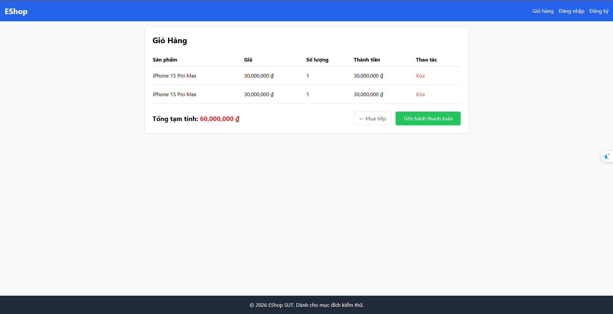

# BUG-CART-002: Thêm lại sản phẩm đã có trong giỏ tạo dòng trùng thay vì tăng số lượng

## Found by Test Case

TC-CART-002

## Requirement liên quan

FR-07 (Giỏ hàng — "Mỗi sản phẩm chỉ xuất hiện đúng 1 dòng trong giỏ; thêm trùng sản phẩm chỉ tăng Số lượng của dòng hiện có, không tạo dòng mới")

## Severity / Priority

Major / P2

## Environment

- Browser: Chromium (Desktop Chrome)
- OS: Windows 11
- URL: http://localhost:5173 (frontend-web)
- Build: nhánh `anh-khoa`, commit `fdf93ff`

## Steps to reproduce

1. Đăng nhập vào tài khoản khách hàng (hoặc dùng khách chưa đăng nhập, không yêu cầu auth)
2. Mở trang chi tiết sản phẩm "iPhone 15 Pro Max"
3. Bấm "Thêm vào giỏ hàng"
4. Quay lại trang chi tiết cùng sản phẩm "iPhone 15 Pro Max"
5. Bấm "Thêm vào giỏ hàng" lần thứ hai
6. Vào trang Giỏ hàng

## Expected result

Giỏ hàng chỉ có đúng 1 dòng cho "iPhone 15 Pro Max", Số lượng = 2, Thành tiền = 60,000,000 ₫ (theo TC-CART-002).

## Actual result

Giỏ hàng hiển thị **2 dòng riêng biệt** cùng tên "iPhone 15 Pro Max", mỗi dòng Số lượng = 1, Thành tiền = 30,000,000 ₫/dòng. "Tổng tạm tính" = 60,000,000 ₫ (đúng về tổng số tiền, nhưng sai cấu trúc dữ liệu — vi phạm bất biến "mỗi sản phẩm đúng 1 dòng").

## Evidence

- Screenshot: 

## Notes

Nhãn "Tổng tạm tính" trên UI cũng không khớp với spec (yêu cầu nhãn đúng phải là "Tổng cộng") — đã được ghi nhận riêng trong AI audit report (entry 2026-06-28 14:20:00), không lặp lại ở đây để tránh trùng bug.
