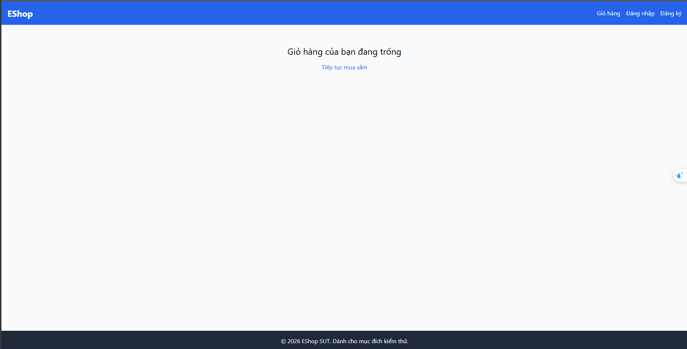

# BUG-CART-005: Empty state giỏ hàng thiếu hình minh họa (illustration/icon)

## Found by Test Case

TC-CART-009

## Requirement liên quan

FR-07 (Giỏ hàng — "Khi giỏ hàng không còn sản phẩm nào (rỗng), trang phải hiển thị hình minh họa (illustration/icon) kèm thông báo rõ ràng, thân thiện")

## Severity / Priority

Minor / P3

## Environment

- Browser: Chromium (Desktop Chrome)
- OS: Windows 11
- URL: http://localhost:5173 (frontend-web)
- Build: nhánh `anh-khoa`, commit `fdf93ff`

## Steps to reproduce

1. Đảm bảo giỏ hàng có ít nhất 1 sản phẩm.
2. Xóa hết toàn bộ sản phẩm trong giỏ (xóa đến khi giỏ rỗng).
3. Quan sát trang Giỏ hàng khi không còn sản phẩm nào.

## Expected result

Trang hiển thị empty state gồm **cả hai phần**: hình minh họa (illustration/icon) **và** thông báo rõ ràng, thân thiện về việc giỏ hàng trống.

## Actual result

Trang chỉ hiển thị phần thông báo dạng chữ ("Giỏ hàng của bạn đang trống" + link "Tiếp tục mua sắm") — **không có bất kỳ hình minh họa hay icon nào**.

## Evidence

- Screenshot: 

## Notes

Phần thông báo chữ vẫn đúng và rõ ràng — chỉ thiếu đúng phần "hình minh họa (illustration/icon)" mà Expected Result của TC-CART-009 yêu cầu riêng. Severity đặt Minor vì đây là thiếu sót về trang trí/UX, không ảnh hưởng chức năng xóa sản phẩm hay tính toán giỏ hàng.
