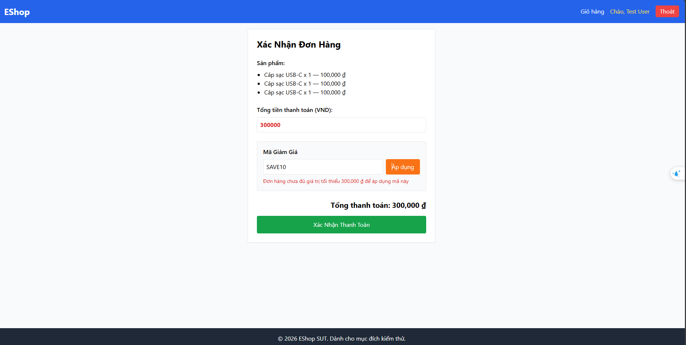
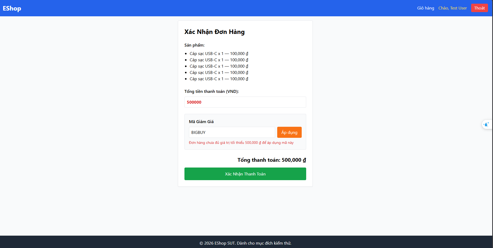

# BUG-COUPON-001: Mã giảm giá bị từ chối khi `total = min_order_amount` (sai biên `>=`)

## Found by Test Case

TC-COUPON-DTT-001, TC-COUPON-DTT-002

## Requirement liên quan

FR-09 (Mã Giảm Giá — điều kiện C3: `total >= min_order_amount`)

## Severity / Priority

Major / P2

## Environment

- Browser: Chromium (Desktop Chrome)
- OS: Windows 11
- URL: http://localhost:5173 (frontend-web) — trang "Xác Nhận Đơn Hàng" (Checkout)
- Build: nhánh `anh-khoa`, commit `c8cdab6`

## Steps to reproduce

**Kịch bản 1 — coupon `percent`, total = min (TC-COUPON-DTT-001):**

1. Đăng nhập tài khoản khách hàng (`test@eshop.com`).
2. Thêm vào giỏ: `Cáp sạc USB-C` × 3 → `total = 300.000 ₫` (đúng bằng `min_order_amount` của `SAVE10`).
3. Vào trang Checkout, nhập mã `SAVE10`.
4. Bấm "Áp dụng".

**Kịch bản 2 — coupon `fixed`, total = min (TC-COUPON-DTT-002):**

1. Đăng nhập tài khoản khách hàng (`test@eshop.com`).
2. Thêm vào giỏ: `Cáp sạc USB-C` × 5 → `total = 500.000 ₫` (đúng bằng `min_order_amount` của `BIGBUY`).
3. Vào trang Checkout, nhập mã `BIGBUY`.
4. Bấm "Áp dụng".

## Expected result

Theo spec FR-09, điều kiện C3 dùng `>=` ("Ghi chú ranh giới: C3 dùng `>=` → giá trị biên `total = min_order_amount` phải **được chấp nhận**"). Do đó:

- Kịch bản 1: Mã `SAVE10` được chấp nhận; `discount_amount = 300.000 × 10 / 100 = 30.000 ₫`; `final_amount = 270.000 ₫`; tổng thanh toán cập nhật còn **270.000 ₫**.
- Kịch bản 2: Mã `BIGBUY` được chấp nhận; `discount_amount = 50.000 ₫` (fixed); `final_amount = 450.000 ₫`; tổng thanh toán cập nhật còn **450.000 ₫**.

## Actual result

Cả 2 kịch bản đều bị **từ chối** dù `total` đúng bằng ngưỡng tối thiểu. Hệ thống hiển thị thông báo lỗi và giữ nguyên tổng tiền (không áp giảm giá):

```
Kịch bản 1: "Đơn hàng chưa đủ giá trị tối thiểu 300,000 đ để áp dụng mã này"  → Tổng thanh toán: 300,000 đ
Kịch bản 2: "Đơn hàng chưa đủ giá trị tối thiểu 500,000 đ để áp dụng mã này"  → Tổng thanh toán: 500,000 đ
```

Triệu chứng nhất quán cho thấy phép so sánh ngưỡng đang dùng **`total > min_order_amount`** (loại trừ biên) thay vì **`total >= min_order_amount`** như spec yêu cầu — lỗi off-by-one tại biên.

## Evidence

- Screenshot Kịch bản 1 (SAVE10, total = 300.000): 
- Screenshot Kịch bản 2 (BIGBUY, total = 500.000): 

## Notes

- Hai kịch bản (coupon `percent` và `fixed`) cùng **một root cause**: phép kiểm `min_order_amount` loại trừ giá trị biên. Loại coupon (percent/fixed) không liên quan vì việc từ chối xảy ra **trước** bước tính `discount_amount`. Gộp thành một bug để tránh trùng issue cho cùng một fix.
- Cần kiểm tra lại với `total = min_order_amount + 1` (kỳ vọng PASS) và `total = min_order_amount − 1` (kỳ vọng REJECT, chính là TC-COUPON-DTT-005) để khẳng định fix chỉ chạm đúng biên.
