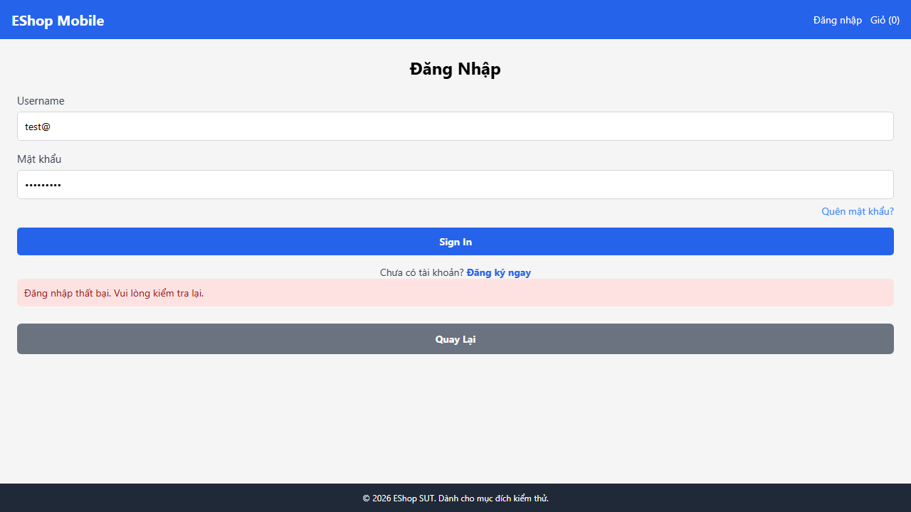

# BUG-MOBILE-001: Ứng dụng mobile không hiển thị thông báo lỗi field-specific khi validate thất bại

## Found by Test Case

TC-MOBILE_LOGIN-002, TC-MOBILE_LOGIN-003, TC-MOBILE_LOGIN-004

## Requirement liên quan

FR-20 (Đăng nhập Mobile — validate trường bắt buộc và định dạng)

## Severity / Priority

Major / P2

## Environment

- Browser: Chromium (Desktop Chrome, giả lập mobile web)
- OS: Windows 11
- URL: http://localhost:8081 (frontend-mobile — Expo Web)
- Build: nhánh `anh-khoa`, commit `a7b11fd`

## Steps to reproduce

**Kịch bản A — TC-MOBILE_LOGIN-002 (Email để trống):**

1. Mở http://localhost:8081, điều hướng đến màn hình Đăng nhập
2. Để trống trường **Email**, nhập mật khẩu hợp lệ
3. Bấm "Sign In"

**Kịch bản B — TC-MOBILE_LOGIN-003 (Email sai định dạng):**

1. Nhập email sai định dạng (vd `test@`) vào trường Email
2. Nhập mật khẩu hợp lệ
3. Bấm "Sign In"

**Kịch bản C — TC-MOBILE_LOGIN-004 (Mật khẩu để trống):**

1. Nhập email hợp lệ, để trống trường **Mật khẩu**
2. Bấm "Sign In"

## Expected result

- Kịch bản A: Hiển thị thông báo "Email là trường bắt buộc" ngay dưới trường Email (validate phía client, không gửi request API)
- Kịch bản B: Hiển thị thông báo lỗi định dạng email (vd "Email không đúng định dạng")
- Kịch bản C: Hiển thị thông báo "Mật khẩu là trường bắt buộc"

## Actual result

Cả 3 kịch bản: Ứng dụng gửi request đến `/api/login` (không validate phía client), nhận response từ server nhưng **không hiển thị thông báo lỗi field-specific**. Các phần tử chứa thông báo lỗi tương ứng không tìm thấy trong DOM.

```
TC-002: Error: element(s) not found — getByText('Email là trường bắt buộc', { exact: true })
TC-003: Error: element(s) not found — getByText(/định dạng email/i)
TC-004: Error: element(s) not found — getByText('Mật khẩu là trường bắt buộc', { exact: true })
```

## Evidence

- Screenshot TC-002: 
- Screenshot TC-003: 
- Screenshot TC-004: 
- Playwright log: `expect(locator).toBeVisible() failed — element(s) not found` (3 test cases)

## Notes

TC-MOBILE_LOGIN-005 (email chưa đăng ký → lỗi đăng nhập chung) PASS, xác nhận thông báo lỗi chung "Đăng nhập thất bại. Vui lòng kiểm tra lại." hoạt động đúng. Vấn đề nằm ở việc thiếu validate field-specific phía client.
