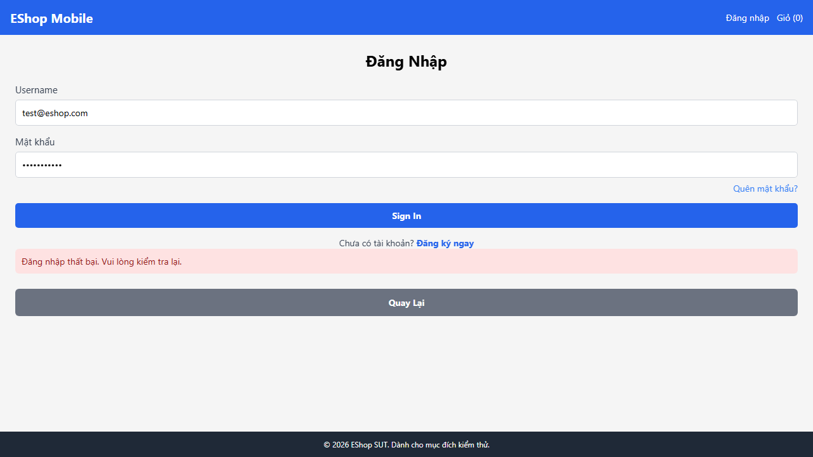

# BUG-MOBILE-002: Bộ đếm đăng nhập sai tăng +2 mỗi lần thay vì +1, gây khóa tài khoản sau 2 lần sai

## Found by Test Case

TC-MOBILE_LOGIN-006, TC-MOBILE_LOGIN-007, TC-MOBILE_LOGIN-008

## Requirement liên quan

FR-20 / FR-02 (Bộ đếm sai tăng đúng 1 đơn vị mỗi lần sai; khóa sau ≥ 3 lần sai liên tiếp)

## Severity / Priority

Critical / P1

## Environment

- Browser: Chromium (Desktop Chrome, giả lập mobile web)
- OS: Windows 11
- URL: http://localhost:8081 (frontend-mobile — Expo Web) + API http://localhost:3000
- Build: nhánh `anh-khoa`, commit `a7b11fd`

## Steps to reproduce

**Kịch bản A — TC-MOBILE_LOGIN-006 / TC-MOBILE_LOGIN-007 (Đếm +2 sau 1 lần sai):**

1. Reset trạng thái tài khoản `test@eshop.com` (login_attempts = 0)
2. Đăng nhập sai mật khẩu **1 lần** với email hợp lệ
3. Kiểm tra giá trị `login_attempts` trong database

**Kịch bản B — TC-MOBILE_LOGIN-008 (Khóa sau 2 lần sai):**

1. Reset trạng thái tài khoản
2. Đăng nhập sai **2 lần** liên tiếp
3. Kiểm tra giá trị `locked_until` trong database

## Expected result

- Kịch bản A: `login_attempts = 1` (tăng đúng 1 đơn vị)
- Kịch bản B: `locked_until = NULL` (chưa đủ ngưỡng 3 lần sai để khóa)

## Actual result

- Kịch bản A: `login_attempts = 2` (**tăng 2** sau 1 lần sai — lỗi implementation)
- Kịch bản B: `locked_until = "2026-06-28T..."` (**tài khoản bị khóa** sau chỉ 2 lần sai, do counter nhảy 2→4 ≥ 3 = ngưỡng khóa)

```
TC-006: Expected: 1 — Received: 2
TC-007: Expected: 1 — Received: 2
TC-008: expect(state?.locked_until).toBeNull() — Received: "2026-06-28T11:23:22.155Z"
```

## Evidence

- Screenshot TC-006: 
- Screenshot TC-007: 
- Screenshot TC-008: 
- Playwright log: `expect(received).toBe(1) — Received: 2`

## Notes

Lỗi này là hệ quả nghiêm trọng: thay vì khóa sau **3 lần sai** như spec quy định, hệ thống thực tế khóa tài khoản sau **2 lần sai**. Người dùng hợp lệ có thể bị khóa tài khoản quá sớm, gây ảnh hưởng đến trải nghiệm và khả năng sử dụng dịch vụ.
