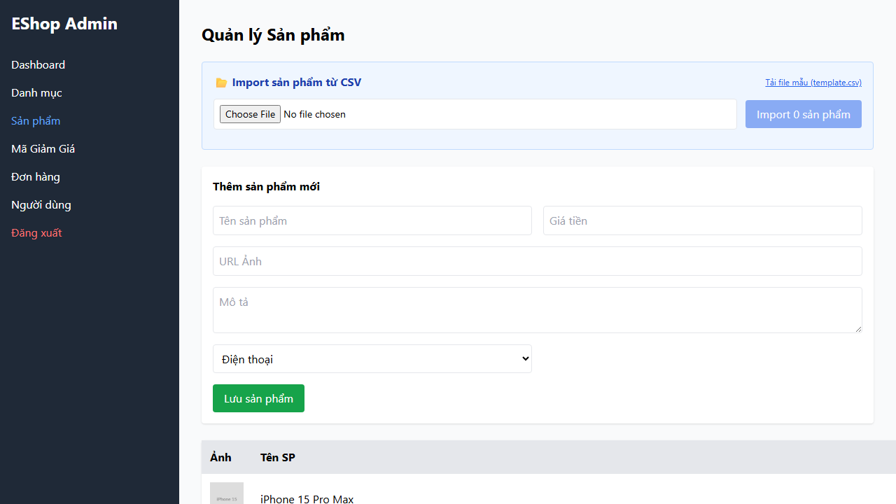

# BUG-PRODUCT-001: Admin có thể lưu sản phẩm với tên vượt quá 255 ký tự

## Found by Test Case

TC-PRODUCT-006

## Requirement liên quan

FR-15 (Quản lý Sản phẩm — tên sản phẩm tối đa 255 ký tự)

## Severity / Priority

Major / P2

## Environment

- Browser: Chromium (Desktop Chrome)
- OS: Windows 11
- URL: http://localhost:5174 (frontend-admin)
- Build: nhánh `anh-khoa`, commit `a7b11fd`

## Steps to reproduce

1. Đăng nhập vào trang Admin (http://localhost:5174)
2. Điều hướng đến trang quản lý sản phẩm
3. Bấm "Thêm sản phẩm mới"
4. Nhập tên sản phẩm có **256 ký tự trở lên** (vượt biên trên)
5. Điền các trường còn lại với giá trị hợp lệ
6. Bấm "Lưu" / "Submit"

## Expected result

Hệ thống từ chối và hiển thị thông báo lỗi "Tên sản phẩm tối đa 255 ký tự". Không tạo sản phẩm mới.

## Actual result

Hệ thống chấp nhận và lưu sản phẩm thành công dù tên vượt quá 255 ký tự. Không có validation phía client hoặc server.

`Error: Spec yêu cầu reject khi Tên > 255 ký tự`

## Evidence

- Screenshot: 
- Playwright log: `Error: Spec yêu cầu reject khi Tên > 255 ký tự`

## Notes

TC-PRODUCT-002 (tên 255 ký tự) và TC-PRODUCT-003 (tên 1 ký tự) đều PASS, xác nhận biên hợp lệ hoạt động đúng. Lỗi chỉ xảy ra khi vượt biên trên (256+ ký tự).
