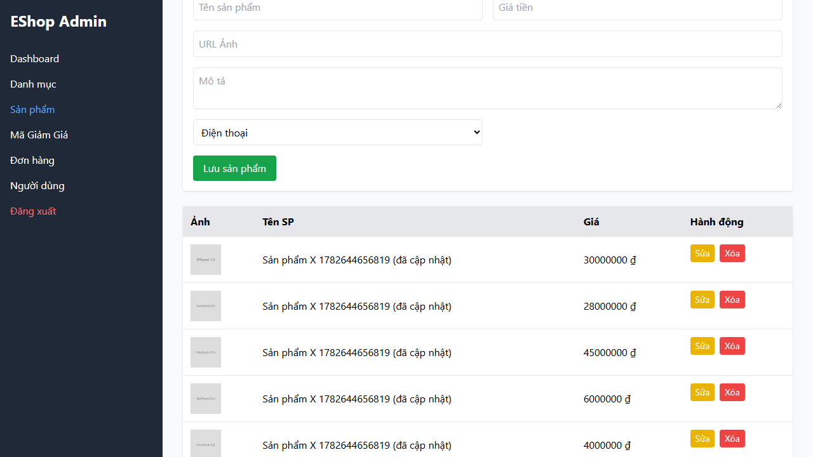

# BUG-PRODUCT-003: Chỉnh sửa sản phẩm ảnh hưởng đến sản phẩm không liên quan

## Found by Test Case

TC-PRODUCT-015

## Requirement liên quan

FR-15 (Quản lý Sản phẩm — cô lập dữ liệu khi chỉnh sửa)

## Severity / Priority

Critical / P1

## Environment

- Browser: Chromium (Desktop Chrome)
- OS: Windows 11
- URL: http://localhost:5174 (frontend-admin)
- Build: nhánh `anh-khoa`, commit `a7b11fd`

## Steps to reproduce

1. Đăng nhập trang Admin
2. Tạo hai sản phẩm: "Sản phẩm X" và "Sản phẩm Y"
3. Chỉnh sửa "Sản phẩm X": đổi tên thành "Sản phẩm X đã sửa"
4. Lưu thay đổi
5. Kiểm tra tên của "Sản phẩm Y" trong danh sách

## Expected result

"Sản phẩm Y" giữ nguyên tên, không bị ảnh hưởng bởi thao tác sửa "Sản phẩm X".

## Actual result

Tên "Sản phẩm Y" bị thay đổi hoặc biến mất. Assertion về cô lập dữ liệu thất bại với lỗi:

- `Sản phẩm Y không liên quan phải giữ nguyên tên`
- `expect(locator).toBeVisible() failed — element(s) not found`

## Evidence

- Screenshot: 
- Playwright log:
  - `Error: Sản phẩm Y không liên quan phải giữ nguyên tên`
  - `expect(locator).toBeVisible() failed`
  - `Error: element(s) not found`
