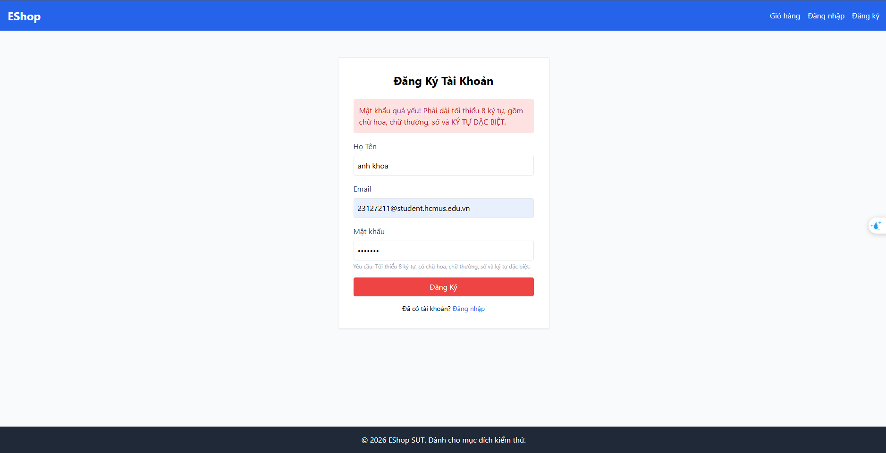

# BUG-REGISTER-005: Mật khẩu 7 ký tự bị chặn với thông báo chung, không xác nhận rõ lý do là độ dài

## Found by Test Case

TC-REGISTER-006

## Requirement liên quan

FR-01 (Đăng ký tài khoản — Mật khẩu tối thiểu 8 ký tự)

## Severity / Priority

Minor / P3

## Environment

- Browser: Chromium (Desktop Chrome)
- OS: Windows 11
- URL: http://localhost:5173 (frontend-web)
- Build: nhánh `anh-khoa`, commit `fdf93ff`

## Steps to reproduce

1. Mở trang Đăng ký.
2. Nhập Họ Tên, Email hợp lệ; Mật khẩu và Xác nhận mật khẩu đều là `Aa1!aa2` (7 ký tự — vẫn đủ chữ hoa/thường/số/ký tự đặc biệt, chỉ vi phạm độ dài).
3. Bấm nút "Đăng ký".

## Expected result

Hệ thống hiển thị lỗi định dạng mật khẩu (yêu cầu tối thiểu 8 ký tự). Không có tài khoản nào được tạo.

## Actual result

Tài khoản không được tạo (đúng một phần), nhưng thông báo hiển thị là một câu chung cho mọi loại lỗi mật khẩu: "Mật khẩu quá yếu! Phải dài tối thiểu 8 ký tự, gồm chữ hoa, chữ thường, số và KÝ TỰ ĐẶC BIỆT." — không xác nhận cụ thể nguyên nhân chặn là do thiếu ký tự (7 < 8).

## Evidence

- Screenshot: 
