# HW02 – Domain Testing on EShop

**Mã số sinh viên:** 23127211.  
**Họ và tên:** Nguyễn Lê Hồ Anh Khoa.  
**Mã bài tập:** HW02-AI.  
**Ngày nộp:** 29/06/2026.  
**Điểm tự đánh giá:** 100.

---

## Phương pháp tiếp cận kiểm thử (AI-First Methodology)

Với mỗi tính năng, AI **không** được giao một prompt hộp đen duy nhất kiểu "hãy thiết kế test case cho tính năng X". Quy trình thực tế là một pipeline 4 bước, mỗi bước dùng output đã được con người duyệt của bước trước làm input cho bước sau (toàn bộ log nguyên văn nằm tại `docs/anh-khoa/ai audit report.md`):

1. **Requirement Analysis** — AI đọc `README.md`, trích xuất Input Fields / Business Rules / Expected Outcomes thành file đặc tả riêng (`feature-specs/FR-xx ....md`).
2. **Domain Testing** — AI nhận chính file đặc tả ở bước 1 (không phải README thô) để phân vùng tương đương và sinh test case.
3. **Boundary Value Analysis** — AI nhận chính bộ test case EP ở bước 2 để đối chiếu, bắt buộc phải chỉ rõ điểm biên nào đã/chưa được cô lập, tránh sinh trùng lặp.
4. **Traceability Matrix → Bug hunting (thực thi thật)** — AI map Rule và Test Case để lộ lỗ hổng coverage trước khi script chạy thật trên code; chạy thật bằng Playwright để đối chiếu dự đoán design-time với hành vi thực tế.

**Nguyên tắc Black-box bắt buộc ở giai đoạn thực thi:** Việc chạy test và viết bug report (`tests/bug-reports/`) tuân thủ nghiêm ngặt nguyên tắc kiểm thử hộp đen — chỉ dựa trên dữ liệu nhập vào và kết quả/thông báo quan sát được trên giao diện, **không** đọc/phân tích source code để suy luận nguyên nhân gốc. Vì vậy, khi 2 test case khác nhau (input khác nhau) cho ra kết quả quan sát bề ngoài giống nhau, chúng vẫn được ghi nhận là **2 bug độc lập** — việc 2 bug có cùng nguyên nhân gốc hay không là việc của developer khi fix, không phải nhận định của QA ở bước báo cáo.

---

# 1. FR-01 — Đăng ký tài khoản

## 1.1 Domain Testing (Equivalence Partitioning)

- **Tóm tắt các biến input đã xác định:**
  - `Họ Tên`: Chuỗi bắt buộc, không giới hạn độ dài theo đặc tả.
  - `Email`: Chuỗi định dạng email, bắt buộc và phải duy nhất trong hệ thống.
  - `Mật khẩu`: Chuỗi bắt buộc, có ràng buộc độ phức tạp (độ dài, loại ký tự).
  - `Xác nhận mật khẩu`: Chuỗi bắt buộc, phải khớp với Mật khẩu.

### Quy trình áp dụng Domain Testing (EP) từng bước:

**Bước 1 — Xác định Input & Output**

- **Input:** 4 biến — Họ Tên, Email, Mật khẩu, Xác nhận mật khẩu.
- **Output:** Tạo tài khoản thành công + redirect sang trang Đăng nhập, hoặc một trong các lỗi tương ứng + không tạo tài khoản.

**Bước 2 — Phân chia miền giá trị (Equivalence Partitioning)**
Với mỗi biến input, chia thành Valid Classes (V) và Invalid Classes (I) dựa trên business rules của `FR-01`.
Tổng số partitions: 4 valid + 13 invalid = **17 partitions**.

**Bước 3 — Chọn giá trị đại diện (Representative Values)**
Mỗi Invalid Class chọn giá trị chỉ vi phạm **đúng 1 điều kiện** (Single Fault Assumption):

- `Họ Tên`: `Nguyễn Văn A` (V), `""` (I — rỗng).
- `Email`: `nguyenvana01@gmail.com` (V, mới), `nguyenvana03@` (I — sai định dạng), `test@eshop.com` (I — đã tồn tại), `""` (I — rỗng).
- `Mật khẩu`: `Abcd123!` (V, chạm biên dưới 8 ký tự), `Aa1!aa2` (I — 7 ký tự), `abcd123!` (I — thiếu hoa), `ABCD123!` (I — thiếu thường), `Abcdefg!` (I — thiếu số), `Abcd1234` (I — thiếu ký tự đặc biệt), `Abcd1234#` (I — ký tự đặc biệt ngoài tập), `""` (I — rỗng).
- `Xác nhận mật khẩu`: bằng giá trị Mật khẩu (V), khác giá trị Mật khẩu (I), `""` (I — rỗng).

**Bước 4 — Thiết kế TC theo nguyên tắc Error Isolation**
Thiết lập Valid Baseline. Tại mỗi TC, chỉ thay đổi 1 biến sang lớp invalid cần test, các biến còn lại giữ giá trị baseline.
Số TC ban đầu: **14 TCs**.

**Bước 5 — Rút gọn TC (Test Case Reduction)**
Không có TC trùng lặp sau khi review (mỗi Invalid Class chỉ có đúng 1 TC, mọi Valid Class dồn vào đúng 1 TC dương duy nhất).
Số TC sau rút gọn: **14 TCs**.

**Tổng kết EP:**

- TC từ Domain Testing (EP): 14 TCs (TC-REGISTER-001 → 014)
- TC từ BVA (Section 2): 2 TCs (TC-REGISTER-015, 016)
- TC bổ sung từ AI Gap Analysis — Design Phase (Section 3): 1 TC (TC-REGISTER-017)
- Tổng sau cùng: **17 TCs**

**Bảng EP partition:**

| Variable          | Valid Classes                                                                          | Invalid Classes                                                                                                                                                         |
| ----------------- | -------------------------------------------------------------------------------------- | ----------------------------------------------------------------------------------------------------------------------------------------------------------------------- |
| Họ Tên            | V1: Chuỗi không rỗng                                                                   | I1: Rỗng                                                                                                                                                                |
| Email             | V2: Đúng định dạng `user@domain.com` và chưa tồn tại                                   | I2: Sai định dạng · I3: Đúng định dạng nhưng đã tồn tại (trùng) · I4: Rỗng                                                                                              |
| Mật khẩu          | V3: ≥ 8 ký tự, đủ ≥1 hoa + ≥1 thường + ≥1 số + ≥1 ký tự đặc biệt thuộc `@ $ ! % * ? &` | I5: < 8 ký tự · I6: Thiếu chữ hoa · I7: Thiếu chữ thường · I8: Thiếu chữ số · I9: Không có ký tự đặc biệt · I10: Ký tự đặc biệt ngoài tập cho phép (vd `#`) · I11: Rỗng |
| Xác nhận mật khẩu | V4: Khớp chính xác với Mật khẩu                                                        | I12: Không khớp · I13: Rỗng                                                                                                                                             |

**Bảng Test Case (EP):**

| TC              | Biến đang test          | Lớp tương đương | Test Data (khác biệt so với baseline) | Kết quả mong đợi                           |
| --------------- | ----------------------- | --------------- | ------------------------------------- | ------------------------------------------ |
| TC-REGISTER-001 | Tất cả (Valid Baseline) | V1, V2, V3, V4  | — (baseline)                          | Tạo thành công → redirect `/login`         |
| TC-REGISTER-002 | Họ Tên                  | I1              | Họ Tên rỗng                           | Lỗi "Họ Tên là trường bắt buộc"            |
| TC-REGISTER-003 | Email                   | I2              | `nguyenvana03@`                       | Lỗi định dạng email                        |
| TC-REGISTER-004 | Email                   | I3              | `test@eshop.com` (đã tồn tại)         | Lỗi "Email đã tồn tại"                     |
| TC-REGISTER-005 | Email                   | I4              | Email rỗng                            | Lỗi "Email là trường bắt buộc"             |
| TC-REGISTER-006 | Mật khẩu                | I5              | `Aa1!aa2` (7 ký tự)                   | Lỗi định dạng mật khẩu                     |
| TC-REGISTER-007 | Mật khẩu                | I6              | `abcd123!` (thiếu hoa)                | Lỗi định dạng mật khẩu                     |
| TC-REGISTER-008 | Mật khẩu                | I7              | `ABCD123!` (thiếu thường)             | Lỗi định dạng mật khẩu                     |
| TC-REGISTER-009 | Mật khẩu                | I8              | `Abcdefg!` (thiếu số)                 | Lỗi định dạng mật khẩu                     |
| TC-REGISTER-010 | Mật khẩu                | I9              | `Abcd1234` (không có ký tự đặc biệt)  | Lỗi định dạng mật khẩu                     |
| TC-REGISTER-011 | Mật khẩu                | I10             | `Abcd1234#` (`#` ngoài tập cho phép)  | Lỗi định dạng mật khẩu                     |
| TC-REGISTER-012 | Mật khẩu                | I11             | Mật khẩu rỗng                         | Lỗi "Mật khẩu là trường bắt buộc"          |
| TC-REGISTER-013 | Xác nhận mật khẩu       | I12             | `Abcd123@` (khác Mật khẩu)            | Lỗi "Xác nhận mật khẩu không khớp"         |
| TC-REGISTER-014 | Xác nhận mật khẩu       | I13             | Xác nhận mật khẩu rỗng                | Lỗi "Xác nhận mật khẩu là trường bắt buộc" |

- **Valid Baseline cho Error Isolation:**
  - `Họ Tên = Nguyễn Văn A`
  - `Email = nguyenvana01@gmail.com` (chưa tồn tại)
  - `Mật khẩu = Abcd123!`
  - `Xác nhận mật khẩu = Abcd123!`

---

## 1.2 Boundary Value Analysis (BVA)

- **Các boundary đã xác định:**
  - Độ dài Mật khẩu: ngưỡng tối thiểu bằng 8 ký tự (biên một phía, không có Max trong đặc tả).
  - Số lượng ký tự mỗi nhóm (hoa/thường/số/đặc biệt) trong Mật khẩu: ngưỡng tối thiểu bằng 1 mỗi nhóm (biên một phía).

### Quy trình áp dụng BVA từng bước:

**Bước 1 — Xác định các boundary từ kết quả EP**
Chỉ **Mật khẩu** có ràng buộc định lượng. Họ Tên bị loại (không giới hạn độ dài theo đặc tả), Email bị loại (ràng buộc định dạng, không phải số lượng), Xác nhận mật khẩu bị loại (ràng buộc khớp/không khớp, không định lượng).

**Bước 2 — Chọn chiến lược BVA cho từng boundary**

- **2-Point BVA (On/Off)** cho cả 2 nhóm biên của Mật khẩu (độ dài, số lượng ký tự mỗi nhóm) vì đặc tả chỉ cho cận dưới (Min), không có cận trên (Max) — không có giá trị Max/Max+1 để kiểm bằng 3-Point.

**Bước 3 — Thiết kế BVA TC theo Error Isolation**
Giữ nguyên Valid Baseline từ Section 1. Đối chiếu ngược với 14 TC của Domain Testing để tránh sinh trùng lặp.
Số BVA TC: **2 TCs**.

- **Bảng biện luận chọn 2-Point cho từng boundary:**
  - _Độ dài mật khẩu (Off=7/On=8)_: cả 2 điểm đã được Domain Testing cover (TC-REGISTER-006 / TC-REGISTER-001) → không sinh thêm.
  - _Số chữ hoa (Off=0/On=1)_: Off cover bởi TC-007; On tình cờ trùng với TC-001 (dùng đúng 1 chữ hoa) → không sinh thêm.
  - _Số chữ thường (Off=0/On=1)_: Off cover bởi TC-008; On **chưa được cô lập đúng nghĩa** (TC-001 dùng 3 chữ thường, không chạm biên) → cần bổ sung TC mới.
  - _Số chữ số (Off=0/On=1)_: Off cover bởi TC-009; On **chưa được cô lập đúng nghĩa** (TC-001 dùng 3 chữ số) → cần bổ sung TC mới.
  - _Số ký tự đặc biệt (Off=0/On=1)_: cả 2 điểm đã cover (TC-010 / TC-001 dùng đúng 1 ký tự `!`) → không sinh thêm.

- **Bảng BVA TC:**

| BVA ID              | Giá trị test                            | Expected Output                                        |
| ------------------- | --------------------------------------- | ------------------------------------------------------ |
| **TC-REGISTER-015** | Mật khẩu `ABCD12a!` (đúng 1 chữ thường) | Tạo thành công (chạm đúng biên On=1 của số chữ thường) |
| **TC-REGISTER-016** | Mật khẩu `ABCDab1!` (đúng 1 chữ số)     | Tạo thành công (chạm đúng biên On=1 của số chữ số)     |

---

## 1.3 AI Gap Analysis — Giai đoạn Thiết kế (Design Phase)

- **Các TC bị bỏ sót phát hiện qua Human Review (Traceability Matrix):**
  - `TC-REGISTER-017`: Kiểm tra mật khẩu được lưu dưới dạng hash trong CSDL, không phải plaintext (SEC-01).

- **Root cause của từng gap:**
  - **Nguyên nhân 1 — Phạm vi prompt (Prompt scope):** Domain Testing và BVA chỉ được giao đúng nội dung file đặc tả `FR-01.md` làm input. Yêu cầu bảo mật SEC-01 (không lưu plaintext) nằm ở mục riêng của đặc tả, không thuộc phần Input Fields/Business Rules được trích cho 2 bước này, nên AI không tự mở rộng phạm vi kiểm thử sang đó nếu không được nhắc trực tiếp.
  - **Nguyên nhân 2 — Giới hạn của kỹ thuật (Technique limitation):** Domain Testing và BVA vốn là kỹ thuật kiểm thử hộp đen ở tầng nhập liệu (input/output qua UI); chúng không có cơ chế tự kiểm tra tầng lưu trữ dữ liệu (CSDL) — đây là phạm vi của kiểm thử hộp trắng, cần một bước riêng (Traceability Matrix đối chiếu toàn bộ rule) mới lộ ra.

- **Student fix đã áp dụng:**
  - Chạy lại Traceability Matrix đối chiếu toàn bộ Business Rule của FR-01 với danh sách Test Case hiện có → phát hiện SEC-01 chưa có TC nào map vào.
  - Bổ sung `TC-REGISTER-017` (kiểm tra hash mật khẩu) để lấp gap, đưa coverage từ "Warning" về "Passed".

---

## 1.4 Bug Report & AI Gap Analysis — Giai đoạn Thực thi (Execution Phase)

- **Tổng số bug tìm được:** **10 bugs**

> Lưu ý phương pháp: theo nguyên tắc Black-box (xem mục đầu báo cáo), mỗi test case có input khác nhau dẫn đến quan sát bị chặn được ghi nhận là **bug độc lập** — dù 6 bug 005→010 có thể (hoặc không) cùng một nguyên nhân gốc về sau khi developer fix, ở bước báo cáo này QA không giả định điều đó.

- **Bảng tổng hợp Bug:**

| Bug ID               | Tiêu đề                                                                                                       | Found by TC                       | Severity | Priority | GitHub Issue # |
| -------------------- | ------------------------------------------------------------------------------------------------------------- | --------------------------------- | -------- | -------- | -------------- |
| **BUG-REGISTER-001** | Đăng ký thành công nhưng không redirect đến URL mong đợi                                                      | TC-REGISTER-001, -015, -016, -017 | Critical | P1       | 94             |
| **BUG-REGISTER-002** | Cho phép đăng ký email đã tồn tại trong hệ thống                                                              | TC-REGISTER-004                   | Critical | P1       | 95             |
| **BUG-REGISTER-003** | Thiếu trường "Xác nhận mật khẩu" hoặc không validate khi trống/không khớp                                     | TC-REGISTER-013, -014             | Major    | P1       | 96             |
| **BUG-REGISTER-004** | Email sai định dạng nhưng hệ thống hiển thị lỗi mật khẩu thay vì lỗi email                                    | TC-REGISTER-003                   | Major    | P2       | 107            |
| **BUG-REGISTER-005** | Mật khẩu 7 ký tự bị chặn với thông báo chung, không xác nhận rõ lý do là độ dài                               | TC-REGISTER-006                   | Minor    | P3       | 108            |
| **BUG-REGISTER-006** | Mật khẩu thiếu chữ hoa bị chặn với thông báo chung, không xác nhận rõ lý do là thiếu chữ hoa                  | TC-REGISTER-007                   | Minor    | P3       | 110            |
| **BUG-REGISTER-007** | Mật khẩu thiếu chữ thường bị chặn với thông báo chung, không xác nhận rõ lý do là thiếu chữ thường            | TC-REGISTER-008                   | Minor    | P3       | 119            |
| **BUG-REGISTER-008** | Mật khẩu thiếu chữ số bị chặn với thông báo chung, không xác nhận rõ lý do là thiếu chữ số                    | TC-REGISTER-009                   | Minor    | P3       | 111            |
| **BUG-REGISTER-009** | Mật khẩu không có ký tự đặc biệt bị chặn với thông báo chung, không xác nhận rõ lý do là thiếu ký tự đặc biệt | TC-REGISTER-010                   | Minor    | P3       | 112            |
| **BUG-REGISTER-010** | Mật khẩu có ký tự đặc biệt ngoài tập cho phép bị chặn với thông báo chung, không xác nhận rõ lý do            | TC-REGISTER-011                   | Minor    | P3       | 113            |

**Ảnh chụp GitHub Issue (bằng chứng đã tạo issue thật trên GitHub):**

- BUG-REGISTER-001 (#94): 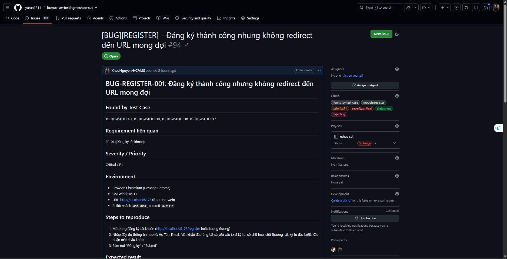
- BUG-REGISTER-002 (#95): 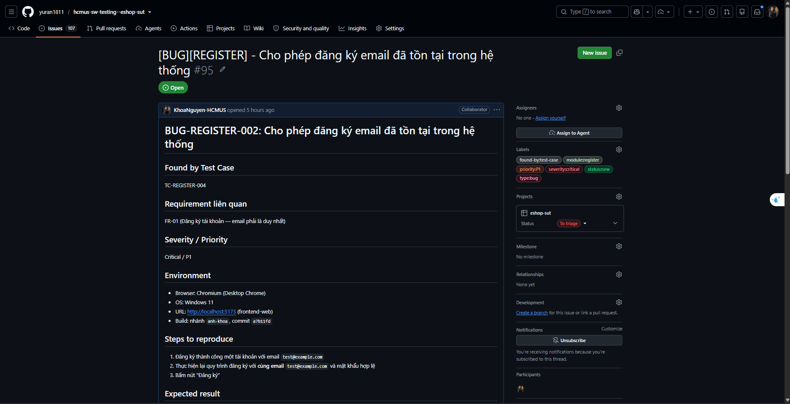
- BUG-REGISTER-003 (#96): 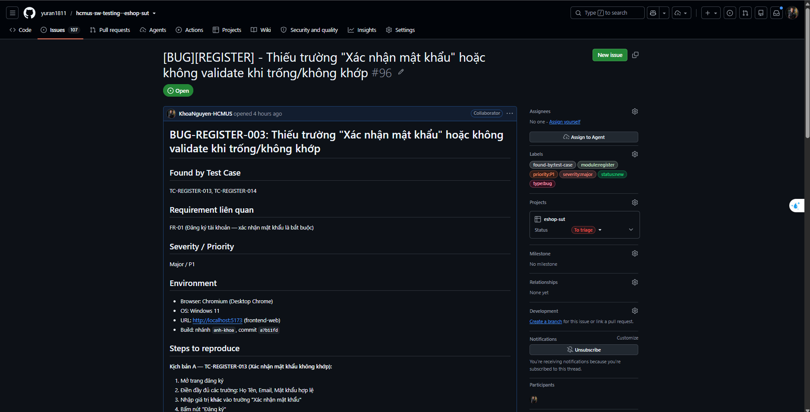
- BUG-REGISTER-004 (#107): 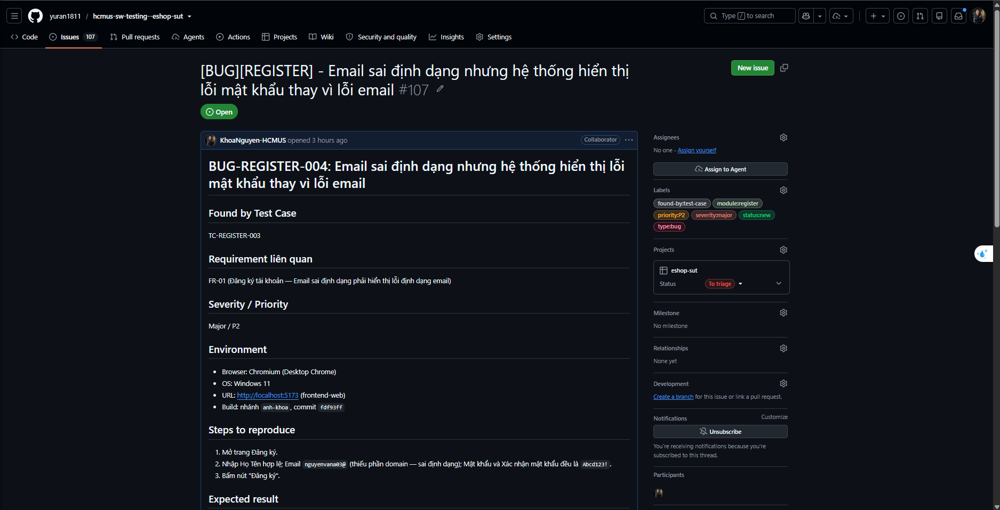
- BUG-REGISTER-005 (#108): 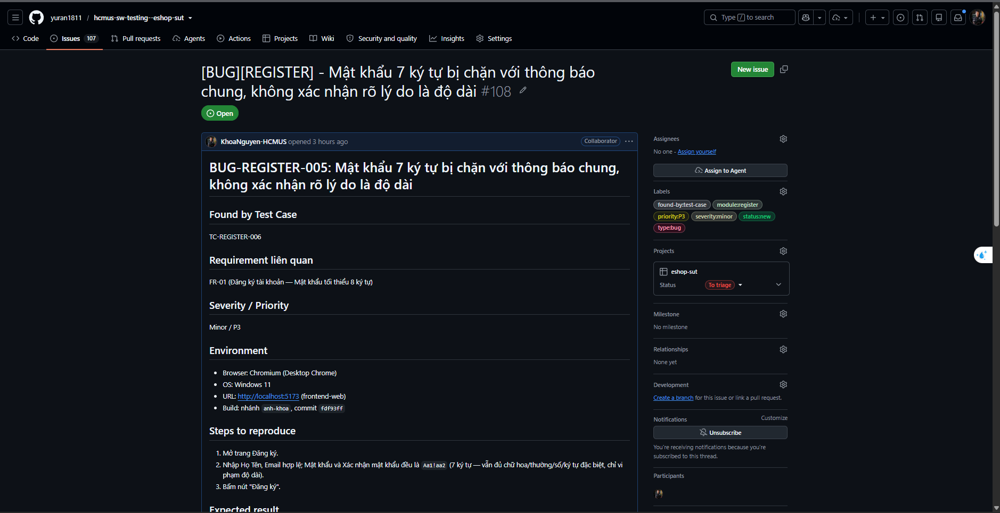
- BUG-REGISTER-006 (#110): 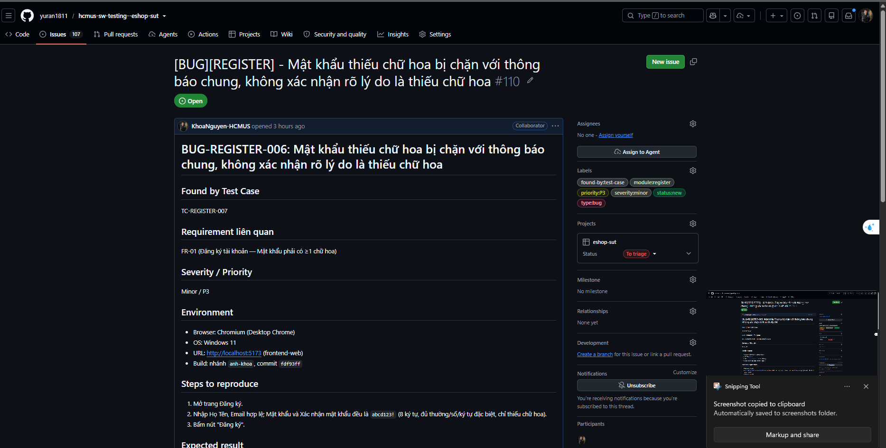
- BUG-REGISTER-007 (#119): 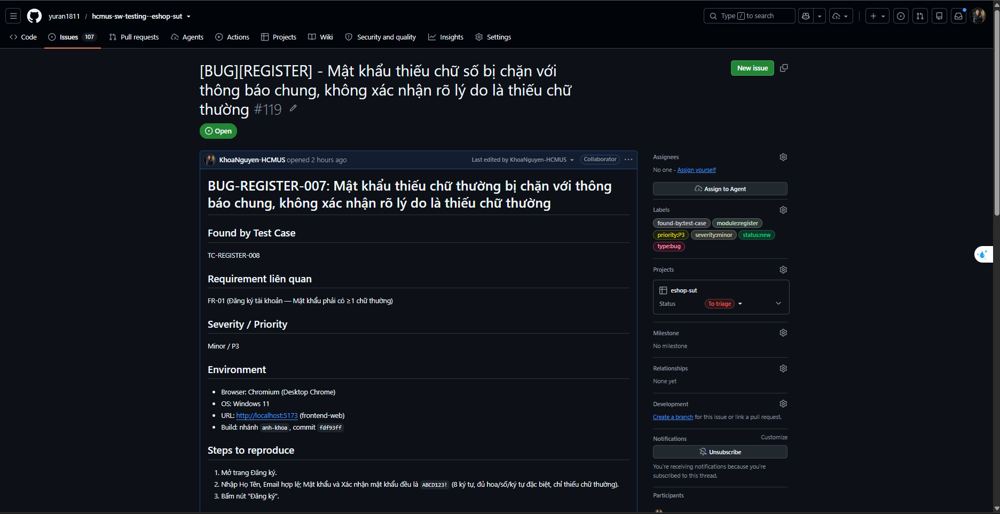
- BUG-REGISTER-008 (#111): 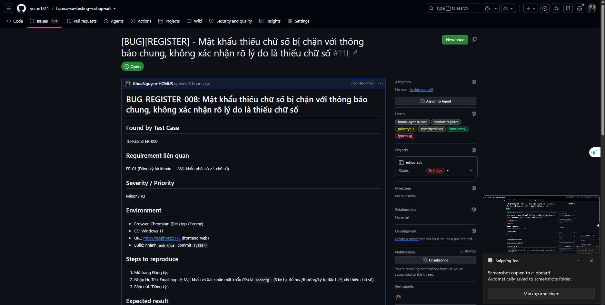
- BUG-REGISTER-009 (#112): 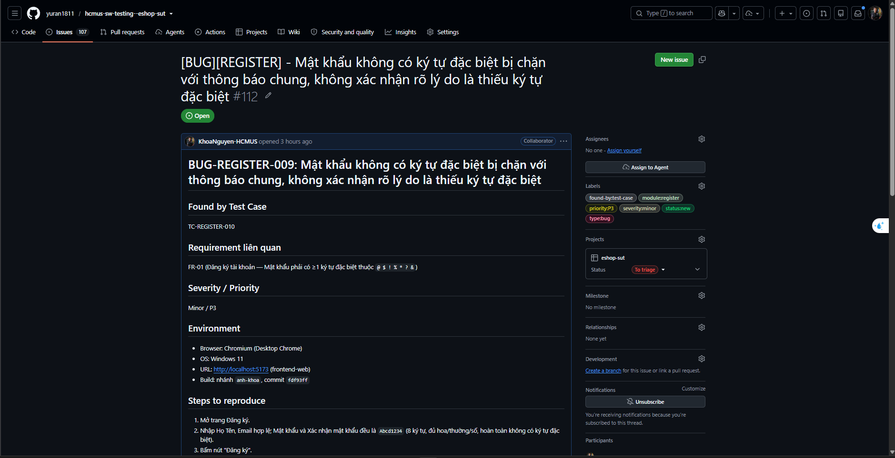
- BUG-REGISTER-010 (#113): 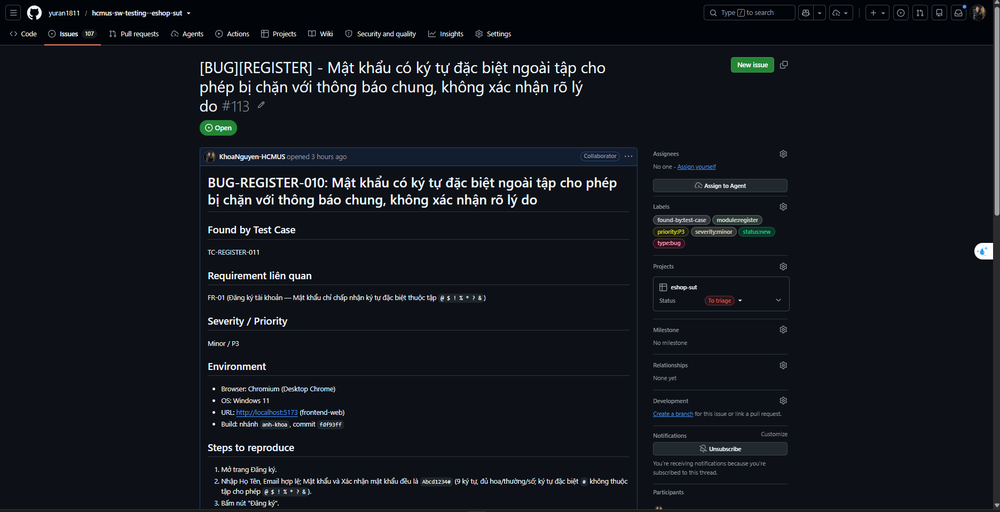

**AI Gap Analysis (Execution Phase) — 2 dạng gap thật, đối chiếu với AI Audit Report:**

- **Gap A — Domain Testing/BVA tự thân không đạt coverage đầy đủ, chỉ lộ ra khi đối chiếu bằng Traceability Matrix.**
  Đây là gap đã nêu ở mục 3 (Design Phase) — TC-REGISTER-017 (SEC-01) hoàn toàn không tồn tại sau khi chạy Domain Testing + BVA; phải chạy riêng một lượt Traceability Matrix (audit log `2026-06-27 16:16:09`) đối chiếu từng Business Rule với danh sách TC mới lộ ra dòng "⚠️ CHƯA CÓ TC". Nhắc lại ở đây vì đây cũng là một dạng gap của **giai đoạn thực thi/kiểm tra coverage**, không riêng gì lúc thiết kế.

- **Gap B — Test case/script chạy tự động không bắt được lỗi (hoặc gây hiểu lầm), phải test tay mới xác nhận được.**
  Đây là dạng gap có tiền lệ ghi nhận trong chính dự án này: audit log `2026-06-28 14:20:00` (Playwright-script-generator cho Product) ghi rõ 2 lỗi kỹ thuật của script bị phát hiện chỉ sau khi chạy thật — `TC-PRODUCT-010` (`Locator.fill('abc')` bị Playwright chặn trên `input[type=number]`, phải đổi sang `pressSequentially`) và `TC-PRODUCT-015` (locator theo tên sản phẩm bị strict-mode violation, khớp nhầm 30 dòng, phải thêm `.first()`).
  Ở FR-01, cùng dạng gap này xảy ra theo cách khác: `register.spec.ts` (sinh đúng theo skill, đủ 17/17 test khớp `TC-REGISTER-001..017`) dùng assertion dạng chung — `expect(errorBanner(page)).toBeVisible()`, `expect(page).toHaveURL(/\/register$/)` — chỉ xác nhận "có bị chặn hay không", **không** xác nhận nội dung thông báo lỗi có đúng với từng input riêng hay không. Vì vậy khi chạy script tự động, cả 7 trường hợp TC-REGISTER-003 và TC-REGISTER-006→011 đều báo "pass" (đúng kỳ vọng bị chặn) — không có lần chạy script nào tự lộ ra việc cả 7 trường hợp nhận đúng 1 câu thông báo giống nhau. Chỉ khi test tay từng trường hợp (nhập input, đọc đúng nội dung hiển thị, so sánh chéo giữa các lần chạy) mới phát hiện được BUG-REGISTER-004 → 010.

**Giải pháp đã thực hiện:**

- Giữ nguyên toàn bộ 17 test case theo đúng đặc tả (không sửa test case để né qua bug) — để bug tự lộ ra khi chạy, đúng tinh thần kiểm thử hộp đen.
- Với Gap B: test tay lại 7 trường hợp mà `register.spec.ts` không tự bắt được (TC-REGISTER-003, 006→011), chụp màn hình làm bằng chứng, viết 7 bug report riêng theo đúng từng input (BUG-REGISTER-004→010) — không gộp chung, không suy luận nguyên nhân gốc từ source code, đúng nguyên tắc Black-box của `bug-reporting` skill.

---

# 2. FR-07 — Giỏ hàng

## 2.1 Domain Testing (Equivalence Partitioning)

- **Tóm tắt các biến/trạng thái đã xác định:**
  - `Số lượng (Quantity)`: biến định lượng duy nhất, điều chỉnh qua nút +/-, tối thiểu = 1.
  - `Hành vi Thêm sản phẩm`: sản phẩm chưa có (tạo dòng mới) vs đã có (tăng số lượng dòng cũ).
  - `Hộp thoại Xóa sản phẩm`: Xác nhận (xóa) vs Hủy (giữ nguyên).
  - `Trạng thái giỏ hàng`: có hàng (hiển thị bảng) vs rỗng (empty state).

### Quy trình áp dụng Domain Testing (EP) từng bước:

**Bước 1 — Xác định Input & Output**

- **Input:** 1 biến định lượng (Số lượng) + 3 biến hành vi/trạng thái rời rạc.
- **Output:** Dòng giỏ hàng được tạo/cập nhật/xóa đúng, Thành tiền và Tổng cộng tính đúng theo thời gian thực, hoặc empty state khi giỏ rỗng.

**Bước 2 — Phân chia miền giá trị**
Khác với FR-01 (toàn bộ biến đều có Invalid Class), FR-07 chủ yếu là phân vùng **hành vi**: 3/4 biến chỉ có các nhánh Valid song song (không có lớp dữ liệu sai vì chúng là lựa chọn hành động, không phải input tự do). Chỉ "Số lượng" có 1 Invalid Class thật (cố vượt biên dưới).
Tổng số partitions: 7 valid + 1 invalid = **8 partitions**.

**Bước 3 — Chọn giá trị đại diện**

- `Số lượng`: tăng/giảm quanh giá trị 1–2 (V), cố bấm "-" tại 1 để đẩy xuống 0 (I).
- `Hành vi Thêm`: "Sản phẩm A" chưa có trong giỏ (V1) / đã có trong giỏ (V2).
- `Hộp thoại Xóa`: bấm Xác nhận (V1) / bấm Hủy (V2).
- `Trạng thái giỏ`: còn ≥1 dòng (V1) / xóa hết còn 0 dòng (V2).

**Bước 4 — Thiết kế TC theo nguyên tắc Error Isolation**
Mỗi TC chỉ thao tác đúng 1 hành vi đang test; ràng buộc liên biến quan trọng: Thành tiền/Tổng cộng là giá trị dẫn xuất từ Số lượng, nên mọi TC đổi Số lượng đều kiểm đồng thời 2 giá trị này để bắt lỗi tính toán cùng lúc.
Số TC ban đầu: **10 TCs**.

**Bước 5 — Rút gọn TC**
Không trùng lặp. Số TC sau rút gọn: **10 TCs**.

**Tổng kết EP:**

- TC từ Domain Testing (EP): 10 TCs (TC-CART-001 → 010)
- TC từ BVA (Section 2): **0 TCs** (xem lý do ở mục 2 — đây là điểm đáng chú ý, không phải thiếu sót)
- TC bổ sung từ AI Gap Analysis — Design Phase (Section 3): **0 TCs** (FR-07 đạt 100% coverage ngay từ vòng đầu)
- Tổng sau cùng: **10 TCs**

**Bảng EP partition:**

| Variable               | Valid Classes                                                             | Invalid Classes                                     |
| ---------------------- | ------------------------------------------------------------------------- | --------------------------------------------------- |
| Số lượng (qua nút +/-) | V: `≥1` (tăng bằng "+"; giảm bằng "-" khi đang `>1`)                      | I: cố đưa về `0`/âm (bấm "-" khi Số lượng = 1)      |
| Hành vi Thêm sản phẩm  | V1: chưa có → tạo dòng mới · V2: đã có → tăng Số lượng dòng cũ            | — (phân vùng hành vi, không có lớp dữ liệu invalid) |
| Hộp thoại Xóa sản phẩm | V1: Xác nhận → xóa dòng · V2: Hủy → giữ nguyên dòng                       | —                                                   |
| Trạng thái giỏ hàng    | V1: có ≥1 sản phẩm → hiển thị bảng + "Tổng cộng" · V2: rỗng → empty state | —                                                   |

**Bảng Test Case (EP):**

| TC          | Mục tiêu                                         | Kết quả mong đợi                                 |
| ----------- | ------------------------------------------------ | ------------------------------------------------ |
| TC-CART-001 | Thêm sản phẩm chưa có trong giỏ                  | Tạo dòng mới, Số lượng = 1                       |
| TC-CART-002 | Thêm lại sản phẩm đã có trong giỏ                | Không tạo dòng trùng, Số lượng tăng 1→2          |
| TC-CART-003 | Bấm "+" tại Số lượng = 1                         | Tăng lên 2; Thành tiền/Tổng cộng cập nhật        |
| TC-CART-004 | Bấm "-" tại Số lượng = 2 (On — biên dưới hợp lệ) | Giảm về 1; Thành tiền/Tổng cộng cập nhật         |
| TC-CART-005 | Bấm "-" tại Số lượng = 1 (Off — vượt biên dưới)  | Bị chặn, không cho xuống 0                       |
| TC-CART-006 | Giỏ 2 dòng, kiểm Tổng cộng                       | Tổng cộng = Σ Thành tiền; nhãn đúng "Tổng cộng"  |
| TC-CART-007 | Xóa sản phẩm, bấm Xác nhận trên dialog           | Dòng bị xóa, Tổng cộng cập nhật                  |
| TC-CART-008 | Xóa sản phẩm, bấm Hủy trên dialog                | Dòng giữ nguyên                                  |
| TC-CART-009 | Xóa hết sản phẩm                                 | Hiển thị empty state (hình minh họa + thông báo) |
| TC-CART-010 | Bấm "Tiếp tục mua sắm"                           | Điều hướng về trang chủ                          |

- **Valid Baseline cho Error Isolation:** Giỏ hàng có sẵn "Sản phẩm A" (Đơn giá 100.000 ₫), Số lượng = 1 — mỗi TC chỉ thay đổi đúng 1 hành vi/giá trị từ trạng thái này.

---

## 2.2 Boundary Value Analysis (BVA)

- **Boundary đã xác định:** chỉ **Số lượng** có biên định lượng (Min = 1, một phía — đặc tả không định nghĩa Max).

### Quy trình áp dụng BVA từng bước:

**Bước 1 — Xác định boundary từ EP:** Đơn giá/Thành tiền/Tổng cộng là giá trị read-only dẫn xuất → không phải input có biên. "Đúng 1 dòng/sản phẩm" là bất biến (đẳng thức), không phải khoảng min–max. Chỉ Số lượng còn lại đủ điều kiện BVA.

**Bước 2 — Chọn chiến lược:** 2-Point (On/Off) vì biên một phía, không có Max.

**Bước 3 — Đối chiếu trùng lặp:** On (=1) đã cover bởi TC-CART-004 (giảm 2→1, chạm đúng biên dưới); Off (=0) đã cover bởi TC-CART-005 (chặn vượt biên). Cả 2 điểm biên đã được Domain Testing tự cô lập đúng nghĩa ngay từ đầu.

**Kết quả: 0 BVA test case được sinh thêm** — đây là quyết định trung thực theo đúng quy tắc khử trùng lặp của skill, không phải thiếu sót: sinh thêm sẽ trùng lặp với TC-CART-004/005, và việc tự bịa ra một giá trị Max khi đặc tả không định nghĩa sẽ là dựng biên giả.

- **Quan sát & khuyến nghị (không phải test case):** Số lượng không có giới hạn trên trong đặc tả — rủi ro tiềm ẩn (số lượng cực lớn ảnh hưởng tồn kho/tràn số). Khi spec bổ sung Max, sẽ cần thêm đúng 2 ca BVA mới (On = Max, Off = Max+1).

---

## 2.3 AI Gap Analysis — Giai đoạn Thiết kế (Design Phase)

- **Các TC bị bỏ sót phát hiện qua Human Review (Traceability Matrix):** **Không có.** Đây là feature duy nhất trong 4 feature đạt **100% coverage ngay từ vòng đầu** (Domain Testing + BVA) — Traceability Matrix (`2026-06-27 16:16:09`) xác nhận: _"Các feature đã bao phủ đủ: FR-07 (Giỏ hàng) — 100% luật nghiệp vụ đều có ít nhất 1 Test Case."_

- **Root cause vì sao FR-07 không có gap (để đối chiếu với FR-01/15/20 có gap):**
  - Toàn bộ Business Rule của FR-07 đều là quy tắc hành vi/UI **hiển thị trực tiếp** trong bảng Input Fields/Business Rules của đặc tả (Số lượng, dialog xác nhận, nhãn "Tổng cộng", empty state) — không có yêu cầu nào "ẩn" ở mục riêng (như SEC-01 của FR-01) cần cross-check ngoài phạm vi đặc tả đang đọc.
  - FR-07 không có khái niệm "vai trò/quyền truy cập" hay "tích hợp đa client" — đây là 2 nguồn gốc gây gap ở FR-15 (quyền Admin) và FR-20 (đồng bộ Web/Mobile); FR-07 không có những trục phức tạp này nên Domain Testing 1 lượt đã đủ.

- **Kết luận:** Không cần Student fix ở giai đoạn Design — toàn bộ giá trị của bước Gap Analysis cho FR-07 nằm ở Execution Phase (mục 4).

---

## 2.4 Bug Report & AI Gap Analysis — Giai đoạn Thực thi (Execution Phase)

- **Tổng số bug tìm được:** **5 bugs**

- **Bảng tổng hợp Bug:**

| Bug ID           | Tiêu đề                                                                    | Found by TC                               | Severity | Priority | GitHub Issue # |
| ---------------- | -------------------------------------------------------------------------- | ----------------------------------------- | -------- | -------- | -------------- |
| **BUG-CART-001** | Nút tăng/giảm số lượng trong giỏ hàng không phản hồi (Timeout)             | TC-CART-003, -004, -005                   | Critical | P1       | 68             |
| **BUG-CART-002** | Thêm lại sản phẩm đã có trong giỏ tạo dòng trùng thay vì tăng số lượng     | TC-CART-002                               | Major    | P2       | 70             |
| **BUG-CART-003** | Nhãn tổng tiền giỏ hàng sai — hiển thị "Tổng tạm tính" thay vì "Tổng cộng" | TC-CART-006                               | Minor    | P3       | 71             |
| **BUG-CART-004** | Xóa sản phẩm khỏi giỏ hàng không có dialog xác nhận — xóa ngay khi bấm     | TC-CART-008, -009 (TC-CART-007 liên quan) | Major    | P2       | 74             |
| **BUG-CART-005** | Empty state giỏ hàng thiếu hình minh họa (illustration/icon)               | TC-CART-009                               | Minor    | P3       | 130            |

**Ảnh chụp GitHub Issue (bằng chứng đã tạo issue thật trên GitHub):**

- BUG-CART-001 (#68): 
- BUG-CART-002 (#70): 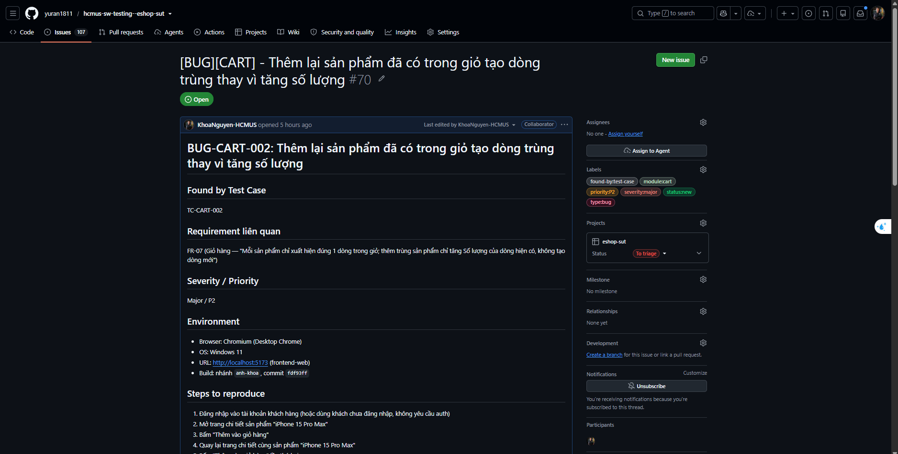
- BUG-CART-003 (#71): 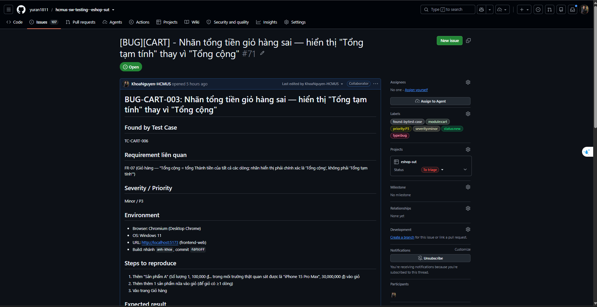
- BUG-CART-004 (#74): 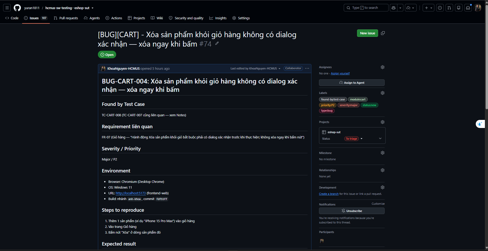
- BUG-CART-005 (#130): 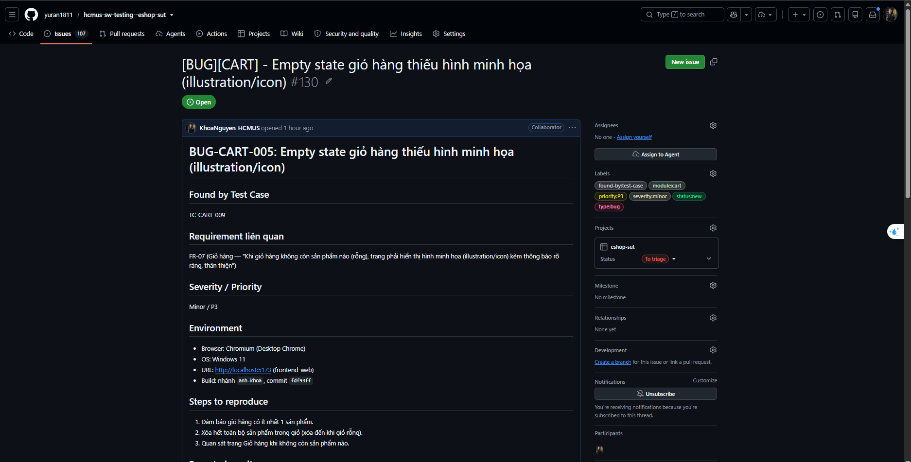

**AI Gap Analysis (Execution Phase) — đối chiếu với AI Audit Report:**

Cart là module có lịch sử thực thi dài dòng trong 4 feature, ghi nhận rõ qua 2 entry liên tiếp trong audit log:

1. **Lượt chạy tự động đầu tiên** (`2026-06-28`, phiên "kiểm thử tự động" — Đánh giá **VALID**, tuân thủ đúng Black-box) chỉ phát hiện sạch được `BUG-CART-001`. Sáu test case còn lại của Cart (TC-CART-002, 005, 006, 007, 008, 009) bị liệt vào **"Nhóm A: Lỗi Test Script (KHÔNG phải bug ứng dụng)"** — locator `.filter({ hasText: 'Sản phẩm A' })` quá rộng, khớp nhầm 5–18 phần tử cùng lúc (strict-mode violation) — tức là **chính automation không tự kiểm được các trường hợp này**, không phải vì app không có lỗi.
2. **Lượt soát lại** (entry kế tiếp, Đánh giá **INCOMPLETE**) chỉ rõ: _"Test case TC-CART-002, TC-CART-006, TC-CART-007, TC-CART-008 bug nhưng không phát hiện ra, cần test manual lại."_ Đây chính là gap thật: script tự động không đủ để khẳng định "không có bug" — phải test tay mới xác nhận được `BUG-CART-002/003/004`.
3. **TC-CART-009** (giỏ rỗng cần hình minh họa) vẫn nằm trong nhóm bị lỗi script ở bước 1 nhưng **không** được nêu lại ở bước 2 — tức gap này còn treo qua nhiều lượt, chỉ được test tay xác nhận lại sau khi rà soát report. Kết quả: xác nhận **2 triệu chứng độc lập** cùng lúc khi xóa dòng cuối — (a) không có dialog xác nhận (cùng `BUG-CART-004`, đã thêm TC-CART-009 vào Found-by) và (b) empty state thiếu hẳn hình minh họa/icon (`BUG-CART-005`, bug mới).

**Giải pháp đã thực hiện:**

- Test tay lại TC-CART-002, 006, 007/008 theo đúng chỉ dẫn của entry INCOMPLETE, chụp màn hình, viết `BUG-CART-002/003/004`.
- Test tay tiếp TC-CART-009 (gap còn treo lâu nhất) → xác nhận 2 triệu chứng độc lập, thêm TC-CART-009 vào Found-by của `BUG-CART-004` và viết mới `BUG-CART-005` (thiếu illustration).

---

# 3. FR-15 — Quản lý Sản phẩm

## 3.1 Domain Testing (Equivalence Partitioning)

- **Tóm tắt các biến input đã xác định:**
  - `Tên sản phẩm`: chuỗi bắt buộc, tối đa 255 ký tự.
  - `Giá`: số bắt buộc, phải dương (`> 0`).
  - `Danh mục`: tham chiếu `category_id`, bắt buộc và phải tồn tại.
  - `Quyền (Authorization)`: biến trạng thái xuyên suốt — JWT hợp lệ + `role = 'admin'`.

### Quy trình áp dụng Domain Testing (EP) từng bước:

**Bước 1 — Xác định Input & Output**

- **Input:** 3 trường nhập liệu của form Thêm/Sửa (Tên, Giá, Danh mục) + 1 biến trạng thái Quyền truy cập áp dụng cho mọi thao tác ghi.
- **Output:** Sản phẩm được tạo/sửa/xóa đúng và xuất hiện chính xác trong danh sách, hoặc lỗi validate/401/403 tương ứng.

**Bước 2 — Phân chia miền giá trị**
Tổng số partitions: 4 valid + 10 invalid = **14 partitions**.

**Bước 3 — Chọn giá trị đại diện**

- `Tên sản phẩm`: chuỗi 1–255 ký tự (V, biên 1 và 255), rỗng (I1), 256 ký tự (I2).
- `Giá`: số dương > 0 (V, biên dưới = giá trị dương nhỏ nhất), `= 0` (I3), âm (I4), rỗng (I5), không phải số (I6).
- `Danh mục`: `category_id` tồn tại (V), không chọn/rỗng (I7), `category_id` không tồn tại (I8).
- `Quyền`: JWT hợp lệ + admin (V), không có token (I9), token hợp lệ nhưng không phải admin (I10).

**Bước 4 — Thiết kế TC theo nguyên tắc Error Isolation**
Khi kiểm IEC của 1 trường nhập liệu, actor luôn là Admin hợp lệ (cô lập đúng lỗi đang test); khi kiểm IEC của Quyền, mọi trường khác đều hợp lệ (cô lập đúng lỗi phân quyền) — đúng Single Fault Assumption áp dụng xuyên suốt 2 lớp biến độc lập.
Số TC ban đầu: **15 TCs** (gồm 1 TC bất biến nghiệp vụ "Sửa chỉ ảnh hưởng đúng sản phẩm đó").

**Bước 5 — Rút gọn TC**
Không trùng lặp. Số TC sau rút gọn: **15 TCs**.

**Tổng kết EP:**

- TC từ Domain Testing (EP): 15 TCs (TC-PRODUCT-001 → 015)
- TC từ BVA (Section 2): 1 TC (TC-PRODUCT-016)
- TC bổ sung từ AI Gap Analysis — Design Phase (Section 3): 2 TCs (TC-PRODUCT-017, 018)
- Tổng sau cùng: **18 TCs**

**Bảng EP partition:**

| Variable              | Valid Classes                                               | Invalid Classes                                               |
| --------------------- | ----------------------------------------------------------- | ------------------------------------------------------------- |
| Tên sản phẩm          | V: chuỗi 1–255 ký tự (biên: 1 và 255)                       | I1: rỗng (0 ký tự) · I2: > 255 ký tự (256)                    |
| Giá                   | V: số dương `> 0` (biên dưới: giá trị dương nhỏ nhất, vd 1) | I3: `= 0` · I4: số âm (`< 0`) · I5: rỗng · I6: không phải số  |
| Danh mục              | V: `category_id` tồn tại trong hệ thống                     | I7: không chọn (rỗng) · I8: `category_id` không tồn tại       |
| Quyền (Authorization) | V: JWT hợp lệ + `role = 'admin'`                            | I9: không có token · I10: token hợp lệ nhưng `role ≠ 'admin'` |

**Bảng Test Case (EP) — rút gọn:**

| TC             | Biến đang test          | Test Data tóm tắt              | Kết quả mong đợi               |
| -------------- | ----------------------- | ------------------------------ | ------------------------------ |
| TC-PRODUCT-001 | Tất cả (Valid Baseline) | Tên/Giá/Danh mục hợp lệ, Admin | Tạo thành công                 |
| TC-PRODUCT-002 | Tên (biên trên V)       | 255 ký tự                      | Tạo thành công                 |
| TC-PRODUCT-003 | Tên (biên dưới V)       | 1 ký tự                        | Tạo thành công                 |
| TC-PRODUCT-004 | Giá (biên dưới V)       | Giá = 1                        | Tạo thành công                 |
| TC-PRODUCT-005 | Tên — I1                | Rỗng                           | Lỗi "Tên sản phẩm là bắt buộc" |
| TC-PRODUCT-006 | Tên — I2                | 256 ký tự                      | Lỗi validate độ dài            |
| TC-PRODUCT-007 | Giá — I3                | `= 0`                          | Lỗi "Giá phải là số dương"     |
| TC-PRODUCT-008 | Giá — I4                | `-1000`                        | Lỗi "Giá phải là số dương"     |
| TC-PRODUCT-009 | Giá — I5                | Rỗng                           | Lỗi "Giá là bắt buộc"          |
| TC-PRODUCT-010 | Giá — I6                | `abc`                          | Lỗi định dạng Giá              |
| TC-PRODUCT-011 | Danh mục — I7           | Không chọn                     | Lỗi "Danh mục là bắt buộc"     |
| TC-PRODUCT-012 | Danh mục — I8           | `category_id=999999`           | Lỗi "Danh mục không hợp lệ"    |
| TC-PRODUCT-013 | Quyền — I9              | Không có token                 | `401 Unauthorized`             |
| TC-PRODUCT-014 | Quyền — I10             | Token role=`user`              | `403 Forbidden`                |
| TC-PRODUCT-015 | Bất biến nghiệp vụ      | Sửa "Sản phẩm X"               | Chỉ X thay đổi, Y giữ nguyên   |

- **Valid Baseline cho Error Isolation:** Admin đã đăng nhập (JWT hợp lệ); Tên `Áo thun nam`; Giá `150000`; Danh mục `Thời trang` (tồn tại).

---

## 3.2 Boundary Value Analysis (BVA)

- **Boundary đã xác định:** Tên sản phẩm (Min=1, Max=255 — biên 2 phía); Giá (Min cận dưới tại 0, không có Max — biên 1 phía, **increment mơ hồ**: đặc tả không nói Giá là số nguyên hay số thực).

### Quy trình áp dụng BVA từng bước:

**Bước 1 — Xác định boundary từ EP:** Tên có đủ 2 phía (0/1/255/256); Giá chỉ có 1 phía dưới tại 0; Danh mục và Quyền không định lượng → loại khỏi BVA.

**Bước 2 — Chọn chiến lược:** Tên dùng kết hợp 2-Point cho từng phía (0/1 và 255/256). Giá dùng 2-Point nhưng phải quyết định **increment** trước: đặc tả chỉ ghi "số dương (`> 0`)", không ràng buộc số nguyên — nên xét theo hướng số thực, increment = 0.01 (chặt hơn increment = 1 mà Domain Testing đã dùng).

**Bước 3 — Đối chiếu trùng lặp:** Toàn bộ 4 điểm biên của Tên (0/1/255/256) và biên dưới Giá theo số nguyên (0/1) đã được Domain Testing cover đầy đủ. Chỉ còn 1 điểm On chưa cover: **Giá = 0.01** — vì TC-PRODUCT-004 dùng giá trị `1` (increment nguyên), bỏ sót toàn bộ khoảng `0 < giá < 1`.

- **Bảng BVA TC:**

| BVA ID             | Giá trị test                                        | Expected Output                                                                                                                                                    |
| ------------------ | --------------------------------------------------- | ------------------------------------------------------------------------------------------------------------------------------------------------------------------ |
| **TC-PRODUCT-016** | Giá `0.01` (số thực dương nhỏ nhất, increment 0.01) | Theo đặc tả (`> 0`, không ràng buộc nguyên) → tạo thành công. Nếu hệ thống từ chối/làm tròn về 0 → lộ ra mơ hồ đặc tả (Giá có ngầm định là số nguyên ₫ hay không). |

- **Quan sát & khuyến nghị (không phải test case):** (1) Giá không có giới hạn trên — rủi ro nhập giá cực lớn; (2) đặc tả không nói rõ Giá là số nguyên hay số thực — TC-PRODUCT-016 chính là ca làm rõ điểm mơ hồ này trên hệ thống thật.

---

## 3.3 AI Gap Analysis — Giai đoạn Thiết kế (Design Phase)

- **Các TC bị bỏ sót phát hiện qua Human Review (Traceability Matrix, `2026-06-27 16:16:09`):**
  - `TC-PRODUCT-017`: Thao tác Xem (Read/List) sản phẩm hiển thị đúng dữ liệu.
  - `TC-PRODUCT-018`: Thao tác Xóa (Delete) sản phẩm thành công → loại khỏi danh sách.

- **Root cause của từng gap:**
  - **Nguyên nhân 1 — Phạm vi suy luận tự đặt ra (self-scoping bias):** Domain Testing tự mô tả phạm vi của nó là _"3 trường nhập liệu của form Thêm/Sửa... cùng biến Quyền truy cập"_ — tự thu hẹp về form Create/Update ngay từ câu đầu tiên của lời giải thích, trong khi đặc tả liệt kê đủ 4 thao tác CRUD (_"Admin có đầy đủ 4 thao tác... Thêm/Xem/Sửa/Xóa"_). Read và Delete bị bỏ sót không phải vì thiếu thông tin trong đặc tả, mà vì AI tự đặt phạm vi hẹp hơn đặc tả thực có.
  - **Nguyên nhân 2 — Read/Delete không có "biên" để hấp dẫn EP/BVA:** Cả 2 thao tác này không có input cần phân vùng tương đương (Read không nhận input để tạo IEC; Delete chỉ có 1 hành động). Kỹ thuật EP/BVA tự nhiên thiên về các trường có ràng buộc dữ liệu rõ ràng (Tên/Giá/Danh mục) hơn các thao tác hành vi đơn giản — cùng dạng thiên kiến đã thấy ở FR-07 nhưng ở FR-07 thì các hành vi đó vẫn lọt vào vì được liệt kê tường minh trong bảng Input Fields, còn ở FR-15 Read/Delete chỉ nằm trong câu văn Business Rules, không có dòng riêng trong bảng.

- **Student fix đã áp dụng:** Bổ sung `TC-PRODUCT-017` (Read/List) và `TC-PRODUCT-018` (Delete) ngay sau khi Traceability Matrix cảnh báo, đưa FR-15 từ "Warning" lên "Passed".

---

## 3.4 Bug Report & AI Gap Analysis — Giai đoạn Thực thi (Execution Phase)

- **Tổng số bug tìm được:** **5 bugs**

- **Bảng tổng hợp Bug:**

| Bug ID              | Tiêu đề                                                                   | Found by TC                      | Severity | Priority | GitHub Issue # |
| ------------------- | ------------------------------------------------------------------------- | -------------------------------- | -------- | -------- | -------------- |
| **BUG-PRODUCT-001** | Admin có thể lưu sản phẩm với tên vượt quá 255 ký tự                      | TC-PRODUCT-006                   | Major    | P2       | 90             |
| **BUG-PRODUCT-002** | Không validate giá sản phẩm (chấp nhận giá = 0, âm, trống, không phải số) | TC-PRODUCT-007, -008, -009, -010 | Critical | P1       | 91             |
| **BUG-PRODUCT-003** | Chỉnh sửa sản phẩm ảnh hưởng đến sản phẩm không liên quan                 | TC-PRODUCT-015                   | Critical | P1       | 92             |
| **BUG-PRODUCT-004** | API không validate category_id (chấp nhận giá trị rỗng và không tồn tại)  | TC-PRODUCT-011, -012             | Major    | P2       | 93             |
| **BUG-PRODUCT-005** | API sản phẩm thiếu kiểm tra xác thực (401) và phân quyền (403)            | TC-PRODUCT-013, -014             | Blocker  | P0       | 131            |

**Ảnh chụp GitHub Issue (bằng chứng đã tạo issue thật trên GitHub):**

- BUG-PRODUCT-001 (#90): 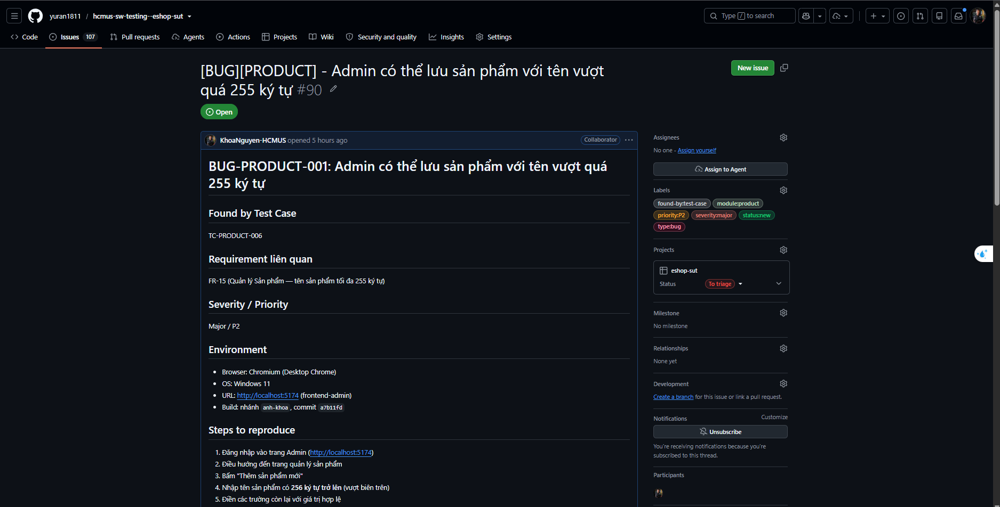
- BUG-PRODUCT-002 (#91): 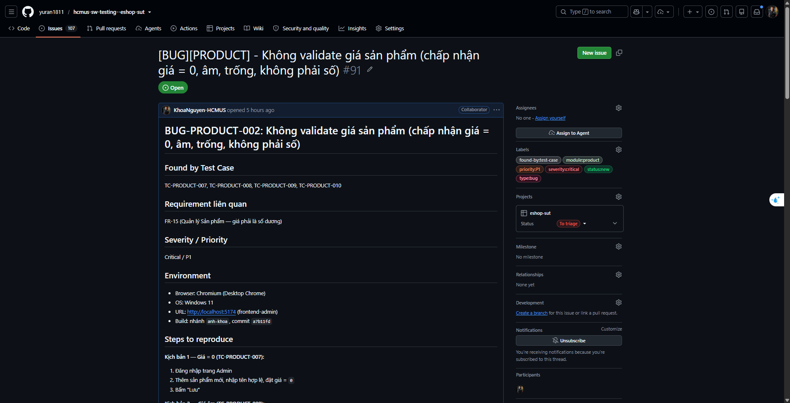
- BUG-PRODUCT-003 (#92): 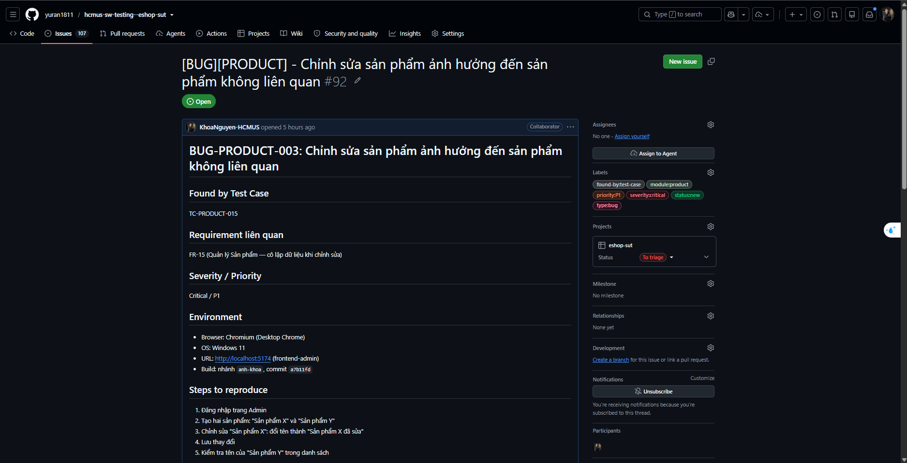
- BUG-PRODUCT-004 (#93): 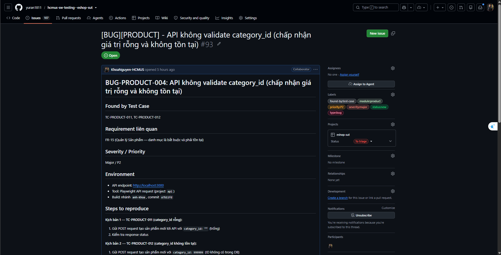
- BUG-PRODUCT-005 (#131): 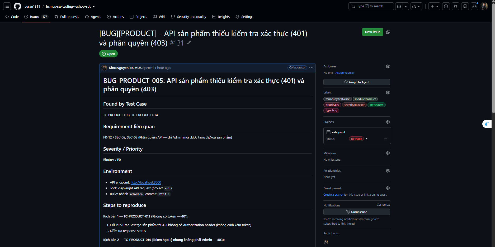

**AI Gap Analysis (Execution Phase) — đối chiếu với AI Audit Report:**

Khác với Cart, lượt chạy tự động cho Product (`2026-06-28`, entry **VALID**) không gặp lỗi script nào — cả 18 test case Product đều chạy "sạch" qua Playwright (UI cho TC-001→010/015→018, API trực tiếp cho TC-011→014), tự phân loại đúng 5 bug độc lập ngay từ lượt đầu, không cần vòng test tay bổ sung như Cart.

**Vì sao 4 TC (011→014) test API trực tiếp thay vì qua UI — 2 lý do khác nhau, không phải 1:**

1. **TC-PRODUCT-011, 012 (Danh mục) — workaround do UI không tái hiện được trạng thái cần test.** Thẻ `<select>` Danh mục trên `frontend-admin` luôn tự chọn sẵn 1 giá trị mặc định (không có option rỗng/placeholder) → không có cách nào bấm để tạo trạng thái "không chọn Danh mục" qua giao diện. Test phải gọi `POST /api/products` trực tiếp với `category_id: ""` hoặc `category_id: 999999` để mô phỏng đúng input mà UI không cho phép nhập. Đây là workaround **bất đắc dĩ**, không phải lựa chọn thiết kế ban đầu.
2. **TC-PRODUCT-013, 014 (Quyền/Authorization) — chủ đích thiết kế, không phải workaround.** Mục tiêu của 2 TC này là kiểm tra **API tự nó** có chặn truy cập trái phép hay không (401/403), bất kể request đến từ đâu — UI Admin chỉ là 1 trong nhiều client có thể gọi API này. Nếu test qua UI (đăng nhập rồi bấm nút), sẽ không kiểm được trường hợp "không có token" hay "token sai role" vì UI luôn tự đính token của người đang đăng nhập. Phải gọi API trực tiếp (không qua UI) mới cô lập đúng được lớp bảo mật ở tầng backend — đây là kiểu test bảo mật chuẩn, độc lập với UI, không phải vì UI bị thiếu chức năng.

Tóm lại: nhóm (1) test API vì **UI thiếu khả năng**; nhóm (2) test API vì **bản chất điều cần kiểm nằm ở tầng API, không thuộc phạm vi UI**. Cả 2 nhóm đều giúp tránh hẳn lớp lỗi locator/strict-mode đã làm khổ Cart, nhưng vì 2 lý do gốc khác nhau.

**Giải pháp đã thực hiện:** Không cần test tay bổ sung — toàn bộ 5 bug đã được xác nhận và viết report đúng chuẩn Black-box ngay từ đầu (không có "Root cause"/trích source code trong cả 5 file — không cần sửa lại như 3 báo cáo Cart, xem mục "Vấn đề phát hiện khi rà soát").

---

# 4. FR-20 — Đăng nhập trên Mobile

## 4.1 Domain Testing (Equivalence Partitioning)

- **Tóm tắt các biến/trạng thái đã xác định:**
  - `Email`, `Mật khẩu`: 2 trường nhập liệu của form đăng nhập.
  - `Trạng thái khóa / bộ đếm đăng nhập sai`: biến trạng thái kế thừa từ FR-02, quản lý tại backend, dùng chung Web/Mobile.

### Quy trình áp dụng Domain Testing (EP) từng bước:

**Bước 1 — Xác định Input & Output**

- **Input:** 2 biến nhập liệu (Email, Mật khẩu) + 1 biến trạng thái (bộ đếm sai/khóa).
- **Output:** Đăng nhập thành công nhận JWT + chuyển màn hình chính, hoặc lỗi tương ứng (trường bắt buộc/định dạng/lỗi đăng nhập chung/tài khoản bị khóa).

**Bước 2 — Phân chia miền giá trị**
Tổng số partitions: 3 valid + 6 invalid = **9 partitions**.

**Bước 3 — Chọn giá trị đại diện**

- `Email`: đúng định dạng + đã đăng ký (V), rỗng (I1), sai định dạng (I2), đúng định dạng nhưng chưa đăng ký (I3 — xếp vào nhóm sai thông tin đăng nhập).
- `Mật khẩu`: đúng mật khẩu tài khoản (V), rỗng (I4), sai mật khẩu (I5).
- `Trạng thái khóa`: chưa khóa, bộ đếm `< 3` (V), bộ đếm `≥ 3` → đang khóa (I6).

**Bước 4 — Thiết kế TC theo nguyên tắc Error Isolation**
Khi kiểm IEC một trường, trường còn lại và trạng thái khóa giữ hợp lệ; khi kiểm state machine (bộ đếm/khóa), dùng đúng cặp thông tin đăng nhập để cô lập đúng hành vi khóa, không lẫn với lỗi field.
Số TC ban đầu: **11 TCs**.

**Bước 5 — Rút gọn TC**
Không trùng lặp. Số TC sau rút gọn: **11 TCs**.

**Tổng kết EP:**

- TC từ Domain Testing (EP): 11 TCs (TC-MOBILE_LOGIN-001 → 011)
- TC từ BVA (Section 2): 1 TC (TC-MOBILE_LOGIN-012)
- TC bổ sung từ AI Gap Analysis — Design Phase (Section 3): 1 TC (TC-MOBILE_LOGIN-013)
- Tổng sau cùng: **13 TCs**

**Bảng EP partition:**

| Variable                     | Valid Classes                   | Invalid Classes                                                                                  |
| ---------------------------- | ------------------------------- | ------------------------------------------------------------------------------------------------ |
| Email                        | V: đúng định dạng và đã đăng ký | I1: rỗng · I2: sai định dạng · I3: đúng định dạng nhưng chưa đăng ký (→ sai thông tin đăng nhập) |
| Mật khẩu                     | V: đúng mật khẩu của tài khoản  | I4: rỗng · I5: sai mật khẩu                                                                      |
| Trạng thái khóa / bộ đếm sai | V: chưa khóa, bộ đếm `< 3`      | I6: bộ đếm `≥ 3` → tài khoản đang bị khóa                                                        |

**Bảng Test Case (EP) — rút gọn:**

| TC                  | Mục tiêu                                    | Kết quả mong đợi                   |
| ------------------- | ------------------------------------------- | ---------------------------------- |
| TC-MOBILE_LOGIN-001 | Đăng nhập thành công, thông tin hợp lệ      | Nhận JWT, chuyển màn hình chính    |
| TC-MOBILE_LOGIN-002 | Email rỗng                                  | Lỗi "Email là trường bắt buộc"     |
| TC-MOBILE_LOGIN-003 | Email sai định dạng                         | Lỗi định dạng email                |
| TC-MOBILE_LOGIN-004 | Mật khẩu rỗng                               | Lỗi "Mật khẩu là trường bắt buộc"  |
| TC-MOBILE_LOGIN-005 | Email chưa đăng ký                          | Lỗi đăng nhập chung, bộ đếm +1     |
| TC-MOBILE_LOGIN-006 | Email đúng, sai mật khẩu                    | Lỗi đăng nhập chung, bộ đếm +1     |
| TC-MOBILE_LOGIN-007 | Sai 1 lần                                   | Bộ đếm = 1, chưa khóa              |
| TC-MOBILE_LOGIN-008 | Sai 2 lần liên tiếp (Off — chưa đạt ngưỡng) | Chưa khóa; lần 3 đúng → thành công |
| TC-MOBILE_LOGIN-009 | Sai 3 lần liên tiếp (On — đạt ngưỡng)       | Khóa 30 giây                       |
| TC-MOBILE_LOGIN-010 | Đăng nhập khi đang khóa, dù đúng thông tin  | Vẫn bị từ chối                     |
| TC-MOBILE_LOGIN-011 | Sau 30 giây, đăng nhập đúng lại             | Thành công                         |

- **Valid Baseline cho Error Isolation:** `test@eshop.com` / `Test1234!` (tài khoản mặc định theo README), bộ đếm sai = 0, chưa khóa.

---

## 4.2 Boundary Value Analysis (BVA)

- **Boundary đã xác định:** Bộ đếm đăng nhập sai (ngưỡng khóa = 3 lần, một phía); Thời gian khóa (mốc = 30 giây, một phía).

### Quy trình áp dụng BVA từng bước:

**Bước 1 — Xác định boundary từ EP:** Email/Mật khẩu không có biên định lượng (chỉ ràng buộc định dạng/đúng-sai) — loại khỏi BVA. Biên định lượng thật nằm ở state machine khóa tài khoản: bộ đếm sai và thời gian khóa.

**Bước 2 — Chọn chiến lược:** Cả 2 biên đều một phía → 2-Point (On/Off).

**Bước 3 — Đối chiếu trùng lặp:** Biên bộ đếm sai (Off=2, On=3) đã được Domain Testing cover trọn (TC-008, TC-009). Biên thời gian khóa mới chỉ cover phía On (t≥30s mở khóa — TC-011) và t≈0 (đang khóa — TC-010); **chưa cover điểm Off sát mốc (t=29s, vẫn phải còn khóa)** — đây là điểm biên quan trọng để bắt lỗi "khóa hết hạn sớm" mà cả TC-010 và TC-011 đều không chạm tới.

- **Bảng BVA TC:**

| BVA ID                  | Giá trị test                                    | Expected Output                                                                                                          |
| ----------------------- | ----------------------------------------------- | ------------------------------------------------------------------------------------------------------------------------ |
| **TC-MOBILE_LOGIN-012** | Gây khóa (3 lần sai), chờ t≈29s, đăng nhập đúng | Vẫn bị từ chối (khóa chưa hết ở 29/30s). Nếu đăng nhập được ở t=29s → khóa hết hạn sớm hơn 30 giây, không tuân thủ spec. |

- **Quan sát:** Đây là ví dụ rõ nhất trong 4 feature cho việc BVA bổ sung đúng 1 điểm biên thật sự bị bỏ sót bởi Domain Testing (khác FR-07 với 0 bổ sung, và FR-01 với 2 bổ sung do trùng lệch giá trị test data).

---

## 4.3 AI Gap Analysis — Giai đoạn Thiết kế (Design Phase)

- **Các TC bị bỏ sót phát hiện qua Human Review (Traceability Matrix, `2026-06-27 16:16:09`):**
  - `TC-MOBILE_LOGIN-013`: Bộ đếm sai/trạng thái khóa dùng chung giữa Web và Mobile.

- **Root cause của gap:**
  - **Nguyên nhân — Nhận thức kiến trúc không được chuyển hóa thành test case:** Domain Testing **đã biết** và **đã viết rõ** trong phần giải thích kỹ thuật rằng _"bộ đếm đăng nhập sai/trạng thái khóa tài khoản... quản lý tại backend dùng chung Web/Mobile"_ — đây không phải kiến thức bị thiếu. Vấn đề là nhận thức đó chỉ dừng ở **lời giải thích (prose)**, không được AI tự suy ra thành một **test case cụ thể** kiểm chứng tính nhất quán xuyên client. Đây là khoảng cách giữa "AI hiểu đúng kiến trúc" và "AI tự chuyển hiểu biết đó thành hành động kiểm thử" — chỉ lộ ra khi Traceability Matrix buộc đối chiếu từng câu Business Rule với danh sách TC theo kiểu checklist tường minh.

- **Student fix đã áp dụng:** Bổ sung `TC-MOBILE_LOGIN-013` (gây khóa ở Web, kiểm trạng thái khóa thấy trên Mobile) ngay sau khi Traceability Matrix cảnh báo.

---

## 4.4 Bug Report & AI Gap Analysis — Giai đoạn Thực thi (Execution Phase)

- **Tổng số bug tìm được:** **3 bugs**

- **Bảng tổng hợp Bug:**

| Bug ID             | Tiêu đề                                                                           | Found by TC                     | Severity | Priority | GitHub Issue # |
| ------------------ | --------------------------------------------------------------------------------- | ------------------------------- | -------- | -------- | -------------- |
| **BUG-MOBILE-001** | Ứng dụng mobile không hiển thị thông báo lỗi field-specific khi validate thất bại | TC-MOBILE_LOGIN-002, -003, -004 | Major    | P2       | 87             |
| **BUG-MOBILE-002** | Bộ đếm đăng nhập sai tăng +2 mỗi lần thay vì +1, gây khóa tài khoản sau 2 lần sai | TC-MOBILE_LOGIN-006, -007, -008 | Critical | P1       | 88             |
| **BUG-MOBILE-003** | Thời gian khóa tài khoản là 180 giây thay vì 30 giây theo spec                    | TC-MOBILE_LOGIN-009, -011       | Major    | P2       | 89             |

**Ảnh chụp GitHub Issue (bằng chứng đã tạo issue thật trên GitHub):**

- BUG-MOBILE-001 (#87): 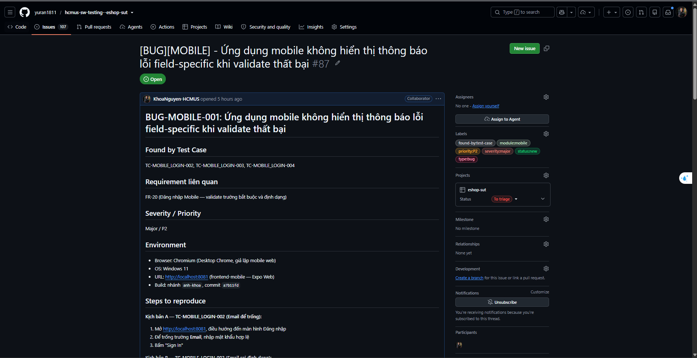
- BUG-MOBILE-002 (#88): 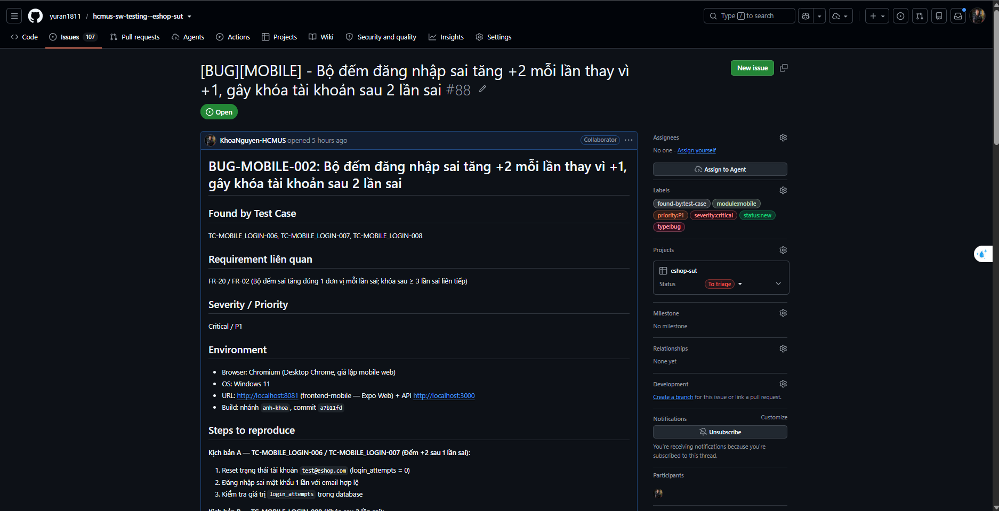
- BUG-MOBILE-003 (#89): 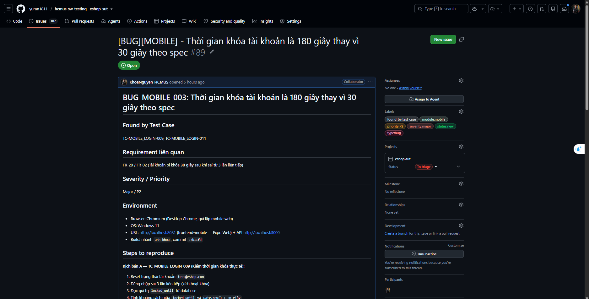

**AI Gap Analysis (Execution Phase) — đối chiếu với AI Audit Report:**

Mobile Login là ví dụ rõ nhất trong 4 feature cho thấy **cấu hình script tự động có thể che giấu phần lớn bug** dù app thực sự sai nhiều hơn báo cáo ban đầu thể hiện:

- Lượt chạy đầu tiên (entry `VALID` ngày `2026-06-28`) chỉ báo cáo **đúng 1 bug** cho cả 13 test case Mobile Login (`BUG-MOBILE-001` từ TC-002). Câu hỏi trực tiếp của người dùng — _"13 test case của tính năng mobile login chỉ tìm ra 1 bug à"_ — đã kích hoạt một lượt điều tra riêng.
- Nguyên nhân tìm được: `test.describe.configure({ mode: 'serial' })` khiến Playwright **bỏ qua toàn bộ 11 test còn lại** (003–013) ngay khi TC-002 fail đầu tiên ("11 did not run") — đây là **gap về hành vi thực thi của framework test**, không phải bug ứng dụng, nhưng hệ quả là 2 bug nghiêm trọng (`BUG-MOBILE-002`, `BUG-MOBILE-003`) suýt không được phát hiện nếu không có người đặt câu hỏi ngược lại con số "1 bug" nghe bất thường.
- Sau khi chạy lại từng test riêng bằng `-g`, phát hiện thêm **false positive** tại `TC-MOBILE_LOGIN-012`: test pass đúng như assertion yêu cầu ("vẫn khóa tại t=29s"), nhưng pass **vì lý do sai** — khóa thật kéo dài 180 giây (do BUG-MOBILE-003) nên tại 29s chắc chắn vẫn khóa, không phải vì hệ thống tuân thủ đúng ngưỡng 30 giây như BVA dự định kiểm. Bản thân audit log tự ghi nhận rõ điều này, không cần suy luận thêm.

**Giải pháp đã thực hiện:**

- Chạy lại từng test case riêng lẻ (`-g "TC-MOBILE_LOGIN-XXX"`) để bypass serial bail, thu được kết quả đầy đủ 13/13 (5 passed / 8 failed).
- Viết bổ sung `BUG-MOBILE-002`, `BUG-MOBILE-003`; mở rộng `BUG-MOBILE-001` với TC-003/004.
- Khắc phục sự cố mất screenshot (Playwright tự xóa `test-results/` giữa các lần chạy `-g` riêng lẻ) bằng cách copy ảnh ngay sau mỗi lệnh chạy, trước khi lệnh kế tiếp dọn thư mục.

---

# 5. Agent Skills & Settings

## 5.1 Chi tiết 8 Skill (`.agents/skills/`)

### 5.1.1 `requirement-analysis` — QA Analyst Expert

- **Vai trò:** Đóng vai QA Analyst, đọc mô tả tính năng thô (README) và chuẩn hóa thành đặc tả có cấu trúc. **Tuyệt đối không sinh test case ở bước này** ("Do not generate test cases at this step" — quy định cứng trong skill, ngăn AI nhảy cóc sang bước sau).
- **Nguyên tắc cốt lõi (theo đúng `SKILL.md`):**
  1. Xác định Input Fields / State Variables.
  2. Trích data type, constraints, limit cho **từng** field (không bỏ sót field nào).
  3. Xác định Business Rules liên quan.
  4. Nêu Expected Outcomes cho cả 2 nhánh success/failure.
  5. Đặt tên `Module` (viết HOA, sẽ thành tên thư mục viết thường `tests/test-cases/[module]/`) và `Requirement ID` theo convention `FR-[NN]`.
  - Nội dung viết tiếng Việt, nhưng **giữ nguyên tên cột/header tiếng Anh** để khớp convention dự án.
- **Input → Output:** Mô tả tính năng trong `README.md` → `feature-specs/FR-xx ....md` (bảng Input Fields, bullet Business Rules, bullet Expected Outcomes).
- **Ví dụ thực tế trong dự án:** Gọi 4 lần (FR-01/07/15/20, `2026-06-26`). **2/4 lần bị đánh giá INCOMPLETE** — đúng kiểu lỗi mà bước 1–5 trên không cấm rõ nhưng vẫn xảy ra: FR-15 tự thêm 2 field "Mô tả"/"Ảnh" vào bảng Input Fields dù README không có ràng buộc nào cho chúng (suy diễn từ FR-06/FR-16 — vượt phạm vi tài liệu được giao); FR-20 chèn thuật ngữ implementation cụ thể của React Native (`secureTextEntry`) — vi phạm trực tiếp vì đặc tả phải trung lập nền tảng.

### 5.1.2 `domain-testing` — Domain Testing Expert

- **Vai trò:** Nhận **chính output đã qua duyệt** của bước 1 (không phải README thô) làm input, áp dụng kỹ thuật Equivalence Partitioning.
- **Nguyên tắc cốt lõi:**
  - Phân tích biến theo **cả 2 chiều** đồng thời: giới hạn kiểu dữ liệu (độ dài cực biên, ký tự đặc biệt, rỗng/null) **và** ràng buộc nghiệp vụ — chỉ xét 1 chiều là sai yêu cầu skill.
  - Phải phân tích **Cross-Variable Constraint** — biến này có giới hạn miền giá trị hợp lệ của biến khác hay không (vd Xác nhận mật khẩu phụ thuộc giá trị Mật khẩu).
  - Bắt buộc giải thích step-by-step lý do phân vùng bằng văn xuôi **trước khi** đưa bảng.
  - Quy tắc tổ hợp Test Case: mọi Valid Class gộp vào càng ít TC dương càng tốt; mỗi Invalid Class kiểm **riêng lẻ** theo Single Fault Assumption — mọi biến khác phải giữ giá trị hợp lệ để tránh 1 lỗi che lấp lỗi khác.
  - TC ID theo convention `TC-[MODULE]-[NNN]`.
- **Input → Output:** `feature-specs/FR-xx.md` → bảng VEC/IEC + bộ Test Case (đúng template Preconditions/Test Data/Test Steps/Expected Result).
- **Ví dụ thực tế:** FR-01 → 14 TC. Đáng chú ý: AI tự thêm hẳn 1 Invalid Class không bị skill bắt buộc rõ ràng — "ký tự đặc biệt nằm ngoài tập cho phép" (vd `#`) cho biến Mật khẩu — với lý do tự giải thích "đây là biên dễ bị implementation làm sai do regex nới lỏng nhận mọi ký tự đặc biệt". Đánh giá **VALID**, được khen vì chủ động suy luận thêm trong phạm vi hợp lý.

### 5.1.3 `boundary-value-analysis` — Boundary Value Analysis Expert

- **Vai trò:** Khác biệt lớn nhất với (2): nhận **cả** feature spec **và** bộ TC Domain Testing đã sinh (để đối chiếu, không phải chỉ nhận spec).
- **Nguyên tắc cốt lõi:**
  1. **Filter & xác định Increment (bắt buộc là bước đầu):** chỉ giữ biến có ràng buộc **định lượng** (length/range/count); loại thẳng biến chỉ ràng buộc định dạng/logic. Increment = `1` cho số nguyên, `0.01` cho số thực.
  2. Tính chính xác điểm `Min-1`/`Min`/`Max`/`Max+1` (hoặc cặp `On`/`Off` nếu biên 1 phía).
  3. **Deduplication Rule (bắt buộc cứng):** KHÔNG sinh TC cho giá trị `In`/`Out` đại diện chung (đã là equivalence class tổng quát) — chỉ sinh đúng điểm biên **còn thiếu** so với Domain Testing.
  4. Single Fault Assumption áp dụng y hệt (2) khi test 1 biên invalid.
- **Input → Output:** spec + TC Domain Testing → bảng điểm biên (Variable/Boundary Type/Target Value) + TC bổ sung **chỉ** cho điểm chưa cô lập.
- **Ví dụ thực tế:** FR-07 (Giỏ hàng) là minh chứng rõ nhất cho Deduplication Rule — BVA tự kết luận **"0 test case bổ sung"** vì cả 2 điểm biên (`On=1`/`Off=0`) đã được Domain Testing cô lập đúng nghĩa sẵn, và **từ chối tự bịa biên Max** khi đặc tả không định nghĩa ("sinh một con số Max tự nghĩ ra sẽ là bịa biên không có trong spec, nên tôi không làm"). Đánh giá VALID, khen "trung thực".

### 5.1.4 `traceability-matrix` — Traceability Matrix & Coverage Expert

- **Vai trò:** Đóng vai QA Lead review — **không sinh test case mới**, chỉ map lại toàn bộ rule đã trích ở (1) với toàn bộ TC đã có ở (2)+(3).
- **Nguyên tắc cốt lõi:**
  - Trích lại **nguyên văn** từng Business Rule/constraint từ output (1), không diễn giải lại.
  - Map N–N: 1 rule có thể có nhiều TC; 1 TC có thể cover nhiều rule.
  - **Coverage Check là bước CRITICAL:** nếu 1 rule không có TC nào map vào, phải cảnh báo rõ (⚠️ Warning) — cấm im lặng bỏ qua.
  - Format cố định: bảng `Requirement ID | Business Rule | Test Case IDs | Result | Bug Issue | Status`, luôn set `Result = Not Run`, `Status = Open` (đây là snapshot **trước khi chạy thật**, không phải kết quả thực thi).
- **Input → Output:** spec + TC Domain Testing + TC BVA → Ma trận Requirement↔TC + 1 trong 2 trạng thái: ✅ Passed hoặc ⚠️ Warning kèm danh sách rule thiếu.
- **Ví dụ thực tế:** Lần chạy đầu (`2026-06-27 16:16`) phát hiện đúng **4 gap thật** (SEC-01 hash mật khẩu của FR-01; Read/Delete của FR-15; đồng bộ Web/Mobile của FR-20) — đây chính là nguồn gốc của toàn bộ mục "AI Gap Analysis — Design Phase" ở 4 feature phía trên.

### 5.1.5 `playwright-script-generator` — QA Automation Architect (Playwright)

- **Vai trò:** Chuyển TC dạng Markdown đọc-được-bởi-người thành script Playwright thật thi hành được.
- **Nguyên tắc cốt lõi:**
  - **Bắt buộc 2 Phase tách biệt, cấm sinh code ngay:** Phase 1 chỉ là draft chiến lược (định nghĩa locator dự kiến + điều kiện pass/fail cụ thể) rồi **dừng lại hỏi xác nhận**; chỉ sang Phase 2 (code thật) sau khi được duyệt.
  - Nếu thiếu `data-testid`/UI text cụ thể, phải tự nêu rõ giả định locator — không được im lặng đoán.
  - **Cấm `page.waitForTimeout()`** (app là CSR) — phải dùng Web-First Assertion (`expect().toBeVisible()`) hoặc chờ đúng network response (`page.waitForResponse`).
  - Phải chèn comment hỗ trợ tự debug nếu test fail về sau (self-healing prep).
- **Input → Output:** file TC Markdown → Phase 1 (chiến lược, chờ duyệt) → Phase 2: file `.spec.ts` thật.
- **Ví dụ thực tế:** Đây là skill **vi phạm nghiêm trọng nhất** trong toàn bộ pipeline — bị đánh giá lại **INVALID 2 lần** (`2026-06-28 14:20` và `15:10`). Cả 2 lần AI đọc thẳng source code frontend/backend để **tự liệt kê bug dự kiến ngay từ Phase 1** (mục A/B/C/D) — vượt xa phạm vi "định nghĩa locator + assertion" mà skill cho phép, đi thẳng vào việc dự đoán bug từ source code dù prompt không yêu cầu.

### 5.1.6 `test-runner` — Playwright Execution & Self-Healing Expert

- **Vai trò:** Chạy thật script đã sinh (dry-run qua MCP terminal) và phân tích kết quả.
- **Nguyên tắc cốt lõi:**
  - **Strict Black-box Testing là điều kiện cứng:** tuyệt đối không đọc/tìm/phân tích source code SUT (React/Express/DB) — chỉ được dùng Playwright log/stderr/DOM/network response.
  - Phải tự nhận diện khi 1 TC chứa **nhiều lỗi độc lập** (qua `expect.soft()` hoặc lỗi chồng chéo) — không gộp mơ hồ thành 1.
  - Self-healing: **chỉ** đề xuất sửa code khi lỗi do chính script viết sai (không phải bug app), kèm đúng đoạn code TypeScript đã sửa.
  - Khi app thật có bug: phải tự trigger chụp ảnh, move từ thư mục tạm sang `tests/bug-reports/screenshots/`, đặt tên file phân biệt rõ từng bug.
- **Input → Output:** lệnh `pnpm exec playwright test [file] -g "[Test Title]"` → báo cáo Pass/Fail, Self-Healing (nếu lỗi script) hoặc bug thật + screenshot + GitHub Issue nháp.
- **Ví dụ thực tế:** Lượt chạy `2026-06-28` ("phiên kiểm thử tự động") tự phân loại đúng **"Nhóm A: lỗi test script"** (6 TC Cart bị strict-mode violation, không phải bug app) khác với **"Nhóm B: bug ứng dụng thật"** (18 TC → 10 bug) — đánh giá VALID. Cùng ngày có 1 lượt bị đánh giá **INCOMPLETE** vì `test.describe.configure({mode:'serial'})` khiến 11/13 TC Mobile bị bỏ qua mà tự skill không phát hiện ra.

### 5.1.7 `bug-reporting` — Bug Reporting Specialist

- **Vai trò:** Chuẩn hóa 1 defect đã quan sát được (từ TC fail) thành bug report đúng format dự án.
- **Nguyên tắc cốt lõi:**
  - Field phải khớp **chính xác** với `.github/ISSUE_TEMPLATE/bug_report.md` (kể cả tên field tiếng Việt "Requirement liên quan") để copy thẳng vào GitHub Issue.
  - Bug ID theo convention `BUG-[MODULE]-[NNN]` (3 số, zero-pad), `MODULE` lấy theo đúng TC liên quan.
  - Luôn sinh **2 output**: (a) GitHub Issue body kèm title gợi ý `[BUG][FEAT] - mô tả ngắn`, (b) file Markdown tại `tests/bug-reports/[module]/BUG-[MODULE]-[NNN].md`.
  - Nhắc cập nhật cột Bug Issue trong ma trận truy vết sau khi issue thật được tạo.
- **Input → Output:** defect quan sát được (từ TC fail thật) → GitHub Issue body + file `.md`.
- **Ví dụ thực tế:** Vi phạm bị bắt **muộn nhất** trong session — 3 bug report đầu của Cart (`002`/`003`/`004`) từng có thêm mục "Root cause" trích source code (`CartContext.jsx`, `Cart.jsx`) trước khi bị phát hiện và phải viết lại thuần quan sát, đúng tinh thần Black-box mà `test-runner` đã đặt ra.

### 5.1.8 `ai-audit-logger` — Audit Compliance Assistant

- **Vai trò:** **Không phải 1 bước trong chuỗi** — là 1 lớp ghi log chạy kèm **bất kỳ** skill nào ở trên (chính skill tự ghi: "runs concurrently alongside other primary skills").
- **Nguyên tắc cốt lõi:**
  - Luôn hoàn thành tác vụ chính (skill khác) **trước**, rồi mới log.
  - **CRITICAL:** copy-paste **nguyên văn, đầy đủ** output Markdown gốc vào field "AI output" — cấm tóm tắt/diễn giải lại/cắt ngắn.
  - Format cố định: `Công cụ AI` / `Thời gian` / `Nội dung prompt` / `AI output`, append vào cuối `docs/anh-khoa/ai audit report.md`.
- **Input → Output:** prompt + output gốc của bước vừa chạy → 1 entry mới trong `ai audit report.md`.
- **Ví dụ thực tế:** Toàn bộ phần "AI Gap Analysis" của báo cáo này (cả 4 feature) chỉ viết được vì log này tồn tại nguyên văn — không có `ai-audit-logger`, không thể chứng minh AI đã đọc source code ở bước nào, vi phạm ở đâu, hay tự sửa lúc nào.

## 5.2 Workflow — Sequence Diagram liên kết các Skill

Các skill không độc lập — mỗi skill (trừ `ai-audit-logger`) là 1 mắt xích, nhận output **đã qua người dùng duyệt** của mắt xích trước làm input, đúng tinh thần AI-First đã nêu ở đầu báo cáo. `ai-audit-logger` không nằm trong chuỗi chính mà chạy kèm sau mỗi lệnh gọi.

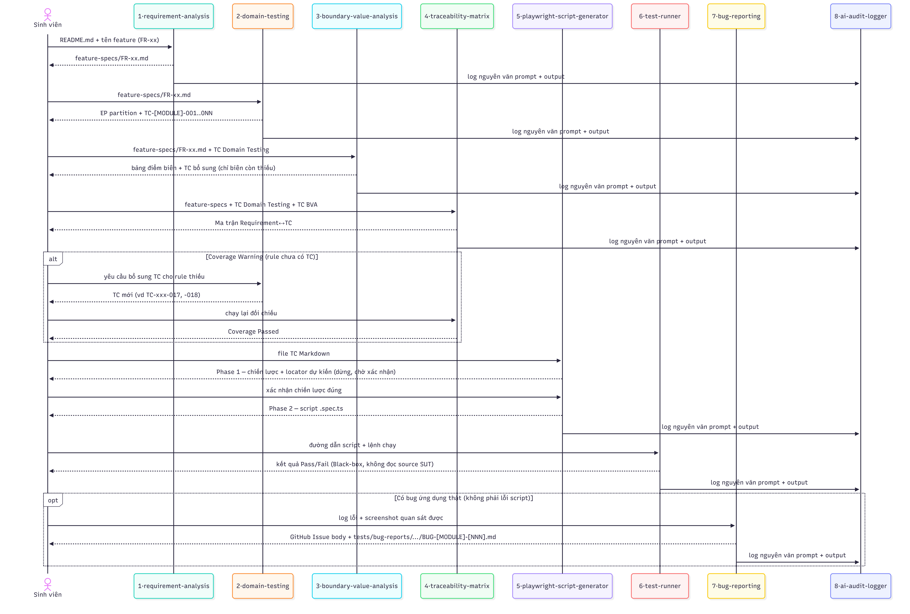

Hệ quả thiết kế quan trọng: vì (3) luôn nhận lại TC của (2) để đối chiếu, và (4) luôn đối chiếu lại cả (2)+(3) với đặc tả gốc, pipeline có **2 lớp tự-kiểm-tra trước khi chạy thật**. Đây là lý do FR-07 đạt 100% coverage ngay từ vòng đầu (mục 2.3), còn FR-01/15/20 đều bị (4) bắt được ít nhất 1 gap thật trước khi kịp lan sang giai đoạn script/chạy thật.

## 5.3 Con người Verify ở đâu

Verify không nằm ở 1 bước cuối duy nhất, mà là một lớp giám sát xuyên suốt toàn bộ pipeline — mỗi mắt xích đều từng bị lệch khỏi đúng vai trò của nó, và mỗi lần lệch đều bị bắt bằng cách đối chiếu **output thật** với chính chỉ dẫn của skill đó, không phải bằng cách tin AI tự báo cáo đúng:

- **Ở (1) `requirement-analysis`:** con người bắt 2 lần AI tự vượt phạm vi đặc tả — FR-15 tự thêm 2 field "Mô tả"/"Ảnh" vào bảng Input Fields dù README không có ràng buộc nào cho chúng; FR-20 chèn thuật ngữ implementation cụ thể của React Native (`secureTextEntry`) không có trong mô tả gốc. Cả 2 đều bị đánh giá **INCOMPLETE** và yêu cầu sửa lại đúng phạm vi.
- **Ở (5) `playwright-script-generator`:** con người bắt 2 lần AI đọc source code SUT để tự liệt kê bug dự kiến **trước khi** script chạy thật — vi phạm trực tiếp yêu cầu của prompt. Cả 2 entry bị đánh giá lại **INVALID**, yêu cầu xóa script sinh ra từ việc đọc source đó.
- **Ở (6) `test-runner`:** tự đánh giá **VALID** khi đúng Black-box (chỉ đọc log/DOM/network), nhưng **INCOMPLETE** khi để sót: `test.describe.configure({mode:'serial'})` khiến 11/13 test Mobile Login không chạy mà không ai để ý, cho đến khi con người chủ động hỏi ngược "13 test case chỉ ra 1 bug à" mới lộ ra.
- **Ở (7) `bug-reporting`:** con người phát hiện AI lén đưa "Root cause" trích dẫn source code (file/dòng cụ thể) vào 3 bug report của Cart — đi ngược nguyên tắc Black-box mà `test-runner` đã quy định — yêu cầu viết lại thuần theo quan sát.
- **Ngoài automation:** con người tự tay test lại nhiều TC mà Playwright không (hoặc không thể) tự xác nhận — `TC-CART-009`, `TC-REGISTER-003`/`006`→`011` — chụp màn hình làm bằng chứng trực tiếp thay cho script.

## 5.4 Settings (`.claude/settings.json`)

- **Permission allow/deny-list:** allowlist giới hạn rõ các lệnh Bash được chạy không cần hỏi (`git`, `grep`, `find`, `pnpm`/`npm`/`npx`/`node`, `sed`, `awk`,...); denylist chặn cứng các lệnh phá hoại (`rm -rf`, `sudo`, `git reset --hard`, `git push -f`, `git clean`) — đảm bảo AI có quyền tự chạy lệnh nhanh nhưng không thể tự ý thực hiện hành động không thể hoàn tác.
- **`Bash(rtk:*)`:** allowlist riêng cho `rtk` — công cụ dùng để **giảm dung lượng output log** khi chạy lệnh (lọc/cắt output dài trước khi đưa vào context), tránh các lệnh build/test/log dài làm tốn token và chậm phiên làm việc không cần thiết.
- **`enabledPlugins.claude-mem`:** plugin lưu trí nhớ giữa các phiên làm việc, giúp AI giữ lại context của các phiên trước.

---

# 6. Phụ lục — Quy tắc gộp nhiều kịch bản vào 1 Bug ID

Nhiều bug report trong dự án gộp ≥2 test case vào 1 Bug ID (vd `BUG-CART-001`, `BUG-PRODUCT-002`, `BUG-MOBILE-001/002/003`). Quy tắc áp dụng nhất quán: **chỉ gộp khi mỗi kịch bản tự nó trực tiếp quan sát được (không cần suy luận) một phần của cùng một triệu chứng** — không gộp khi việc gộp đòi hỏi giả định nhiều test case chia sẻ 1 nguyên nhân ẩn mà không test case nào tự chứng minh được điều đó (đây chính là lỗi đã xảy ra và được sửa ở Register TC-006→011 — xem mục FR-01, Execution Phase).

| Bug ID (gộp)     | Số kịch bản                                                         | Lý do được gộp hợp lệ                                                                                                                                                                                                                                    |
| ---------------- | ------------------------------------------------------------------- | -------------------------------------------------------------------------------------------------------------------------------------------------------------------------------------------------------------------------------------------------------- |
| BUG-REGISTER-001 | 4 (TC-001, -015, -016, -017)                                        | Mỗi TC dùng mật khẩu khác nhau nhưng đều "đúng theo spec" — mỗi TC tự quan sát trực tiếp cùng 1 sự thật: trang không chuyển sang `/login` sau submit.                                                                                                    |
| BUG-REGISTER-003 | 2 (TC-013, -014)                                                    | Cả 2 đều trực tiếp quan sát "trường Xác nhận mật khẩu không hoạt động đúng" — 1 qua timeout tìm field, 1 qua thiếu validate khi trống.                                                                                                                   |
| BUG-CART-001     | 3 (TC-003, -004, -005)                                              | Cả 3 đều trực tiếp quan sát "nút +/- không tồn tại" (Timeout) — chỉ khác nút bấm và giá trị Số lượng ban đầu.                                                                                                                                            |
| BUG-CART-004     | 2 chính (TC-008, -009) + 1 liên quan (TC-007 ghi riêng trong Notes) | TC-008 và TC-009 đều trực tiếp quan sát cùng 1 sự thật (xóa ngay, không qua dialog) ở 2 thời điểm khác nhau (còn nhiều dòng / xóa dòng cuối). TC-007 **không** dùng làm "Found by" vì nó pass do false positive (giả lập dialog không bao giờ được gọi). |
| BUG-PRODUCT-002  | 4 (TC-007…010)                                                      | Mỗi TC trực tiếp quan sát "giá trị này được lưu thành công" với 1 input invalid khác nhau (0/âm/trống/`abc`) — hợp thành đúng 1 claim: trường Giá không có validation.                                                                                   |
| BUG-PRODUCT-004  | 2 (TC-011, -012)                                                    | Tương tự — mỗi TC trực tiếp quan sát `category_id` invalid vẫn được chấp nhận.                                                                                                                                                                           |
| BUG-PRODUCT-005  | 2 (TC-013, -014)                                                    | Biên hơn 1 chút (auth vs authz là 2 lớp kiểm tra khác nhau), nhưng cùng 1 loại triệu chứng quan sát trực tiếp: API cho phép truy cập trái phép (status code sai).                                                                                        |
| BUG-MOBILE-001   | 3 (TC-002, -003, -004)                                              | Mỗi TC trực tiếp quan sát "không tìm thấy message lỗi cụ thể" cho 1 field/điều kiện khác nhau.                                                                                                                                                           |
| BUG-MOBILE-002   | 3 (TC-006, -007, -008)                                              | TC-006/007 cùng đo trực tiếp 1 giá trị (`login_attempts=2` sau 1 lần sai — TC-007 là lần đo lại để xác nhận); TC-008 đo trực tiếp hệ quả (`locked_until` được set sau 2 lần sai) — đều là quan sát trực tiếp trên cùng 1 biến trạng thái.                |
| BUG-MOBILE-003   | 2 (TC-009, -011)                                                    | Cùng 1 sự thật duy nhất (khóa ≈180s) đo bằng 2 cách độc lập: số học trên DB (TC-009) và chờ thật 30s rồi thử đăng nhập (TC-011).                                                                                                                         |
