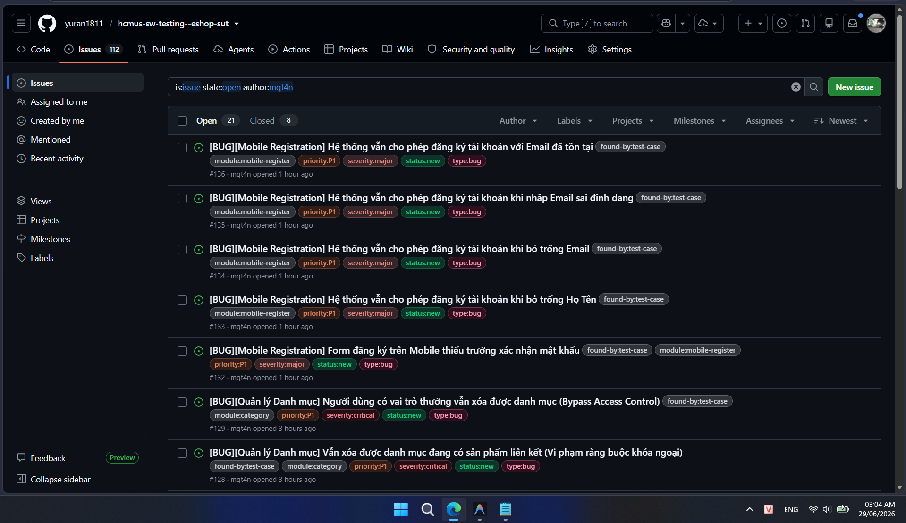
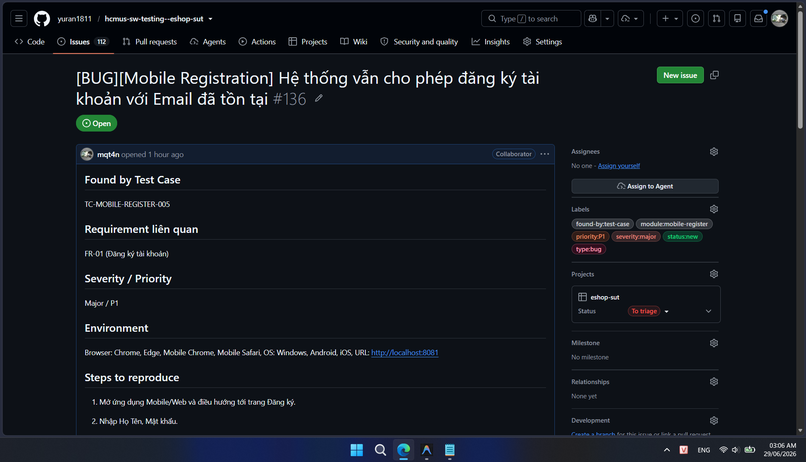

# BÁO CÁO (MAIN REPORT) — HW04

## THÔNG TIN SINH VIÊN

- **Họ và tên:** MẠCH QUỐC TẤN
- **Mã số sinh viên:** 23127115
- **Lớp:** 23KTPM3
- **Môn học:** CS423 / CSC15003 – Kiểm thử Phần mềm (Tích hợp AI · 2026)
- **Học kỳ:** Học kỳ 3 (Năm 3) – Năm học 2025-2026
- **Bài tập:** Homework 04 - Automation Testing
- **Hệ thống kiểm thử (SUT):** EShop (https://github.com/ttbhanh/eshop-sut)
- **Ngày hoàn thành:** 29/06/2026

---

## MỤC LỤC

1. [Phần I: Tổng quan về hoạt động kiểm thử (Test Overview & Execution Summary)](#phần-i-tổng-quan-về-hoạt-động-kiểm-thử-test-overview--execution-summary)
2. [Phần II: Áp dụng kỹ thuật kiểm thử Phân hoạch tương đương (Domain Testing)](#phần-ii-áp-dụng-kỹ-thuật-kiểm-thử-phân-hoạch-tương-đương-domain-testing)
3. [Phần III: Áp dụng kỹ thuật kiểm thử Phân tích giá trị biên (Boundary Value Analysis)](#phần-iii-áp-dụng-kỹ-thuật-kiểm-thử-phân-tích-giá-trị-biên-boundary-value-analysis)
4. [Phần IV: Báo cáo lỗi chi tiết (Bug Report & GitHub Issues)](#phần-iv-báo-cáo-lỗi-chi-tiết-bug-report--github-issues)
5. [Phần V: Phân tích khoảng chênh lệch của AI và Đánh giá (AI Gap Analysis & Critique)](#phần-v-phân-tích-khoảng-chênh-lệch-của-ai-và-đánh-giá-ai-gap-analysis--critique)

---

## Phần I: Tổng quan về hoạt động kiểm thử (Test Overview & Execution Summary)

### 1.1. Các tính năng được lựa chọn kiểm thử

- **Feature A (Pool A - Product):** Product list and search (FR-05) - Xem danh sách & Tìm kiếm sản phẩm
- **Feature B (Pool B - Checkout):** Checkout (FR-08) - Thanh toán đơn hàng
- **Feature C (Pool C - Web Admin):** Category management (CRUD) (FR-14) - Quản lý Danh mục

### 1.2. Thống kê số liệu kiểm thử

- **Tổng số Test Cases thiết kế:** 32
- **Tổng số Test Cases đã chạy:** 32 (tỷ lệ 100%)
- **Số lượng Pass:** 8 (tỷ lệ 25.0%)
- **Số lượng Fail:** 24 (tỷ lệ 75.0%)
- **Tổng số lỗi phát hiện:** 16 lỗi (bao gồm 5 lỗi ở Category, 4 lỗi ở Checkout và 7 lỗi ở Product List & Search).

### 1.3. Thống kê chi tiết theo tính năng

| Tính năng                          | Yêu cầu      | Tổng TC | Pass | Fail | Tỷ lệ Pass | Số lỗi |
| ---------------------------------- | ------------ | ------- | ---- | ---- | ---------- | ------ |
| **Quản lý Danh mục (Category)**    | FR-14        | 13      | 7    | 6    | 53.8%      | 5      |
| **Thanh toán (Checkout)**          | FR-08        | 7       | 1    | 6    | 14.3%      | 4      |
| **Xem & Tìm kiếm sản phẩm (PLAS)** | FR-05        | 12      | 0    | 12   | 0.0%       | 7      |

---

## Phần II: Áp dụng kỹ thuật kiểm thử Phân hoạch tương đương (Domain Testing)

## Feature: Xem danh sách & Tìm kiếm sản phẩm (FR-05)

### B1: Identify Input & Output Variables — Xem danh sách & Tìm kiếm sản phẩm

#### Input Variables

| #   | Variable Name               | Data Type | Constraints                                                     | Source                                          |
| --- | --------------------------- | --------- | --------------------------------------------------------------- | ----------------------------------------------- |
| 1   | search                      | String    | Optional. Tìm kiếm theo tên sản phẩm. Tiêu đề hiển thị an toàn. | UI Search bar / API parameter `?search=keyword` |
| 2   | Product Count (DB State)    | Integer   | Implicit. Số lượng sản phẩm có trong CSDL (>= 0).               | Database (`products` table)                     |
| 3   | API Latency (Network State) | String    | Implicit. Trạng thái tải dữ liệu (loading / loaded).            | Network / API endpoint latency                  |

#### Output Variables

| #   | Variable Name         | Data Type    | Description                                                                               |
| --- | --------------------- | ------------ | ----------------------------------------------------------------------------------------- |
| 1   | Response Status       | Integer      | HTTP status code (200, 500, etc.)                                                         |
| 2   | Product Grid          | HTML Layout  | Lưới hiển thị các thẻ sản phẩm (ảnh tỉ lệ chuẩn có alt text, tên, giá dạng `x.xxx.xxx ₫`) |
| 3   | Query Text Rendered   | String       | Tiêu đề hiển thị từ khóa đã tìm kiếm, phải hiển thị dạng plain text an toàn               |
| 4   | Loading State Display | HTML Element | Trạng thái hiển thị vòng xoay hoặc chữ thông báo đang tải                                 |
| 5   | Empty State Display   | HTML Element | Thông báo khi danh sách sản phẩm trống hoặc không tìm thấy                                |
| 6   | H1 Tag Count          | Integer      | Số lượng thẻ `<h1>` xuất hiện trên trang chủ (bắt buộc đúng 1)                            |

---

### B2: Identify Value Domains — Xem danh sách & Tìm kiếm sản phẩm

#### Input Variable: search

| #   | Domain Type   | Equivalence Class             | Value Range / Description                | Expected                                    |
| --- | ------------- | ----------------------------- | ---------------------------------------- | ------------------------------------------- |
| EC1 | Valid         | Normal valid search term      | Alphanumeric, matches existing products  | Accept & Display matching products          |
| EC2 | Valid         | Empty string                  | `""` or omitted                          | Accept & Display all products               |
| EC3 | Valid         | No matching results           | Alphanumeric, does not match any product | Accept & Display empty state                |
| EC4 | Valid         | Special characters & Unicode  | e.g., "bàn phím @2026"                   | Accept & Display matching products or empty |
| EC5 | Valid         | HTML / Script injection (XSS) | e.g., ``        | Accept & Display safely as plain text       |
| EC6 | Valid/Extreme | Extremely long string         | 255+ characters                          | Accept & Handle gracefully (no crash)       |

#### Input Variable: Product Count (DB State)

| #   | Domain Type | Equivalence Class        | Value Range / Description | Expected                         |
| --- | ----------- | ------------------------ | ------------------------- | -------------------------------- |
| EC7 | Valid       | Multiple products exist  | DB has >= 2 products      | Display products in grid layout  |
| EC8 | Valid       | Exactly 1 product exists | DB has exactly 1 product  | Display 1 product in grid layout |
| EC9 | Valid       | No products exist in DB  | DB is empty               | Display empty state message      |

#### Input Variable: API Latency (Network State)

| #    | Domain Type | Equivalence Class              | Value Range / Description | Expected                                         |
| ---- | ----------- | ------------------------------ | ------------------------- | ------------------------------------------------ |
| EC10 | Valid       | API is fetching data (loading) | Request is pending        | Display loading status/indicator                 |
| EC11 | Valid       | API finished fetching          | Request is completed      | Hide loading status, display grid or empty state |

#### Output Variables (Expected Output Domains)

| #   | Domain Type | Equivalence Class          | Value Range / Description                                    | Triggered By                               |
| --- | ----------- | -------------------------- | ------------------------------------------------------------ | ------------------------------------------ |
| OC1 | Valid       | Full product details shown | Displays standard ratio Image with alt text, Name, and Price | Product list matches & loaded successfully |
| OC2 | Valid       | Correct price format       | Price displayed with thousands separator and `₫` unit        | Price loaded (e.g., 100000 -> `100.000 ₫`) |
| OC3 | Valid       | Safely rendered query text | Rendered as text only, no HTML parsed                        | Search query contains HTML tags            |
| OC4 | Valid       | Single H1 header           | Exactly one `<h1>` tag present on the page                   | Page rendering                             |

---

### B3: Select Representative Values — Xem danh sách & Tìm kiếm sản phẩm

#### Input Variable: search

| #   | EC Reference | Representative Value              | Rationale                                          |
| --- | ------------ | --------------------------------- | -------------------------------------------------- |
| 1   | EC1          | `"MacBook Pro M3"`                | Typical alphanumeric search term                   |
| 2   | EC2          | `""` (empty string)               | Boundary: no keyword, should return all products   |
| 3   | EC3          | `"NonExistentProduct12345"`       | Query that is guaranteed not to match              |
| 4   | EC4          | `"Bàn phím"`                      | Contains Vietnamese accents                        |
| 5   | EC5          | `""` | Standard script block payload for XSS verification |
| 6   | EC6          | `"A" * 300`                       | Very long query exceeding standard limit           |

#### Input Variable: Product Count (DB State)

| #   | EC Reference | Representative Value | Rationale                    |
| --- | ------------ | -------------------- | ---------------------------- |
| 1   | EC7          | DB has 3 products    | Verify normal grid rendering |
| 2   | EC8          | DB has 1 product     | Verify grid with single card |
| 3   | EC9          | DB has 0 products    | Verify default empty state   |

#### Input Variable: API Latency

| #   | EC Reference | Representative Value         | Rationale                   |
| --- | ------------ | ---------------------------- | --------------------------- |
| 1   | EC10         | Pending request              | Slow 3G network throttling  |
| 2   | EC11         | Resolved request (completed) | Normal fast local execution |

#### Output Variables (Expected Output Verification Points)

| #   | OC Reference | Representative Value              | Rationale                               |
| --- | ------------ | --------------------------------- | --------------------------------------- |
| 1   | OC1          | Image with alt text, Name, Price  | Complete elements of product card       |
| 2   | OC2          | `45.000.000 ₫`                    | Hundreds separator and "₫" character    |
| 3   | OC3          | `""` | Rendered safely as plain text, no popup |
| 4   | OC4          | Exactly 1 `<h1>` tag              | Standard homepage SEO constraint        |

---

### B4: Enumerate Partition Scenarios — Xem danh sách & Tìm kiếm sản phẩm

Nominal values for other variables: `Product Count` = 3 (multiple products exist in DB), `API Latency` = resolved (completed), `search` = `"MacBook Pro M3"`.

#### Input Partition Scenarios

| #   | Partition | Variable Tested | Test Value                        | Other Variables                                          | Expected Output (OC)  | Expected Result                      |
| --- | --------- | --------------- | --------------------------------- | -------------------------------------------------------- | --------------------- | ------------------------------------ |
| 1   | EC2       | search          | `""`                              | Count = 3, Latency = resolved                            | OC1, OC2, OC4         | Accept & Show all 3 products         |
| 2   | EC1       | search          | `"MacBook Pro M3"`                | Count = 3, Latency = resolved                            | OC1, OC2, OC4         | Accept & Show matching products      |
| 3   | EC3       | search          | `"NonExistentProduct12345"`       | Count = 3, Latency = resolved                            | OC4, Empty State      | Accept & Show Empty State            |
| 4   | EC4       | search          | `"Bàn phím"`                      | Count = 3 (containing "Bàn phím cơ"), Latency = resolved | OC1, OC2, OC4         | Accept & Show matching products      |
| 5   | EC5       | search          | `""` | Count = 3, Latency = resolved                            | OC3, OC4, Empty State | Accept, Display safely as plain text |
| 6   | EC6       | search          | `"A" * 300`                       | Count = 3, Latency = resolved                            | OC4, Empty State      | Accept, Handle gracefully (no crash) |
| 7   | EC7       | Product Count   | 3                                 | search = `""`, Latency = resolved                        | OC1, OC2, OC4         | Accept & Show 3 products             |
| 8   | EC8       | Product Count   | 1                                 | search = `""`, Latency = resolved                        | OC1, OC2, OC4         | Accept & Show 1 product              |
| 9   | EC9       | Product Count   | 0                                 | search = `""`, Latency = resolved                        | OC4, Empty State      | Accept & Show Empty State            |
| 10  | EC10      | API Latency     | pending                           | search = `""`, Count = 3                                 | Loading State         | Show Loading spinner/text            |
| 11  | EC11      | API Latency     | resolved                          | search = `""`, Count = 3                                 | OC1, OC2, OC4         | Show product grid                    |

#### Output Partition Scenarios

| #   | Partition | Output Description                      | Triggering Input Condition                 | Same As Input Scenario                        |
| --- | --------- | --------------------------------------- | ------------------------------------------ | --------------------------------------------- |
| 1   | OC1       | Hiển thị đủ thuộc tính sản phẩm         | Tất cả dữ liệu hợp lệ (EC2, EC7, EC11)     | Scenario #1                                   |
| 2   | OC2       | Giá định dạng đúng phân cách hàng nghìn | Tất cả dữ liệu hợp lệ (EC2, EC7, EC11)     | Scenario #1                                   |
| 3   | OC3       | Tiêu đề tìm kiếm được render an toàn    | Từ khóa chứa HTML/script (EC5, EC7, EC11)  | Scenario #5                                   |
| 4   | OC4       | Đúng duy nhất 1 thẻ `<h1>`              | Mọi trường hợp render trang chủ thành công | Scenarios #1, #2, #3, #4, #5, #7, #8, #9, #11 |

---

### B5: Consolidate into Test Cases — Xem danh sách & Tìm kiếm sản phẩm

#### Consolidation Table

| Scenario(s) Merged                                         | Reason                                                              | Resulting TC                                                              |
| ---------------------------------------------------------- | ------------------------------------------------------------------- | ------------------------------------------------------------------------- |
| Scenario #1 + Scenario #7 + Scenario #11 + OC1 + OC2 + OC4 | Identical test data and output (view all products with empty query) | [TC-PLAS-001](../../tests/test-cases/product-list-and-search/TC-PLAS-001.md) |
| Scenario #2                                                | Matches specific query and filters list                             | [TC-PLAS-002](../../tests/test-cases/product-list-and-search/TC-PLAS-002.md) |
| Scenario #3                                                | Handles non-matching queries, shows empty state                     | [TC-PLAS-003](../../tests/test-cases/product-list-and-search/TC-PLAS-003.md) |
| Scenario #4                                                | Handles Vietnamese search accents                                   | [TC-PLAS-004](../../tests/test-cases/product-list-and-search/TC-PLAS-004.md) |
| Scenario #5 + OC3                                          | Handles HTML script block queries safely (XSS protection)           | [TC-PLAS-005](../../tests/test-cases/product-list-and-search/TC-PLAS-005.md) |
| Scenario #10                                               | Captures system behavior when loading data                          | [TC-PLAS-006](../../tests/test-cases/product-list-and-search/TC-PLAS-006.md) |
| OC4                                                        | Verification of single H1 tag constraints                           | [TC-PLAS-007](../../tests/test-cases/product-list-and-search/TC-PLAS-007.md) |
| Scenario #6, #8, #9                                        | These boundaries are handled under Boundary Value Analysis (BVA)    | Represented in BVA TCs                                                    |

#### Final Test Case Summary

| #   | TC ID                                                                     | Description                                                            | Technique | EC/OC Covered                 | Expected                                                           |
| --- | ------------------------------------------------------------------------- | ---------------------------------------------------------------------- | --------- | ----------------------------- | ------------------------------------------------------------------ |
| 1   | [TC-PLAS-001](../../tests/test-cases/product-list-and-search/TC-PLAS-001.md) | Xem toàn bộ danh sách sản phẩm thành công                              | DT        | EC2, EC7, EC11, OC1, OC2, OC4 | Pass - Grid displays all products with correct format and 1 H1 tag |
| 2   | [TC-PLAS-002](../../tests/test-cases/product-list-and-search/TC-PLAS-002.md) | Tìm kiếm sản phẩm bằng từ khóa hợp lệ có kết quả                       | DT        | EC1, EC7, EC11, OC1, OC2, OC4 | Pass - Grid shows only matching products                           |
| 3   | [TC-PLAS-003](../../tests/test-cases/product-list-and-search/TC-PLAS-003.md) | Tìm kiếm sản phẩm bằng từ khóa không khớp với sản phẩm nào             | DT        | EC3, EC7, EC11, OC4           | Pass - Empty state displayed                                       |
| 4   | [TC-PLAS-004](../../tests/test-cases/product-list-and-search/TC-PLAS-004.md) | Tìm kiếm sản phẩm bằng từ khóa có dấu tiếng Việt và ký tự đặc biệt     | DT        | EC4, EC7, EC11, OC1, OC2, OC4 | Pass - Correct matching for accents                                |
| 5   | [TC-PLAS-005](../../tests/test-cases/product-list-and-search/TC-PLAS-005.md) | Tìm kiếm sản phẩm bằng từ khóa chứa mã độc HTML/XSS (Hiển thị an toàn) | DT        | EC5, EC7, EC11, OC3, OC4      | Pass - Rendered safely as plain text, no script execution          |
| 6   | [TC-PLAS-006](../../tests/test-cases/product-list-and-search/TC-PLAS-006.md) | Kiểm tra trạng thái tải dữ liệu (Loading State)                        | DT        | EC10, EC7, OC4                | Pass - Loading indicator displays while fetching                   |
| 7   | [TC-PLAS-007](../../tests/test-cases/product-list-and-search/TC-PLAS-007.md) | Kiểm tra cấu trúc thẻ H1 duy nhất trên trang chủ                       | DT        | EC11, OC4                     | Pass - Exactly one H1 tag exists on page                           |

---

## Feature: Thanh toán (FR-08)

### B1: Identify Input & Output Variables — Thanh toán

#### Input Variables

| #   | Variable Name           | Data Type | Constraints                                                                 | Source                                              |
| --- | ----------------------- | --------- | --------------------------------------------------------------------------- | --------------------------------------------------- |
| 1   | Authorization           | String    | Bắt buộc. Token JWT hợp lệ từ phiên đăng nhập.                              | HTTP Request Header `Authorization: Bearer <token>` |
| 2   | total_amount            | Integer   | Bắt buộc. Phải khớp chính xác với tổng tiền giỏ hàng do server tự tính lại. | HTTP Request Body                                   |
| 3   | Cart State (DB/Session) | Object    | Bắt buộc. Giỏ hàng phải chứa ít nhất 1 sản phẩm.                            | Database / Session state                            |

#### Output Variables

| #   | Variable Name           | Data Type | Description                                                          |
| --- | ----------------------- | --------- | -------------------------------------------------------------------- |
| 1   | Response Status         | Integer   | Mã phản hồi HTTP (200, 400, 401, 500,...)                            |
| 2   | Response Message        | String    | Thông điệp phản hồi từ hệ thống (thành công hoặc chi tiết lỗi)       |
| 3   | Order Status (DB)       | String    | Trạng thái của đơn hàng vừa tạo trong DB, phải mặc định là "pending" |
| 3   | Cart State (DB/Session) | Object    | Trạng thái giỏ hàng sau thanh toán, phải được xóa sạch (trống)       |

---

### B2: Identify Value Domains — Thanh toán

#### Input Variable: Authorization

| #   | Domain Type | Equivalence Class | Value Range / Description                           | Expected |
| --- | ----------- | ----------------- | --------------------------------------------------- | -------- |
| EC1 | Valid       | Valid JWT token   | Token được ký hợp lệ và chưa hết hạn của khách hàng | Accept   |
| EC2 | Invalid     | Missing header    | Không truyền header `Authorization`                 | Reject   |
| EC3 | Invalid     | Invalid JWT token | Token sai chữ ký, hết hạn hoặc malformed            | Reject   |

#### Input Variable: Cart State

| #   | Domain Type | Equivalence Class | Value Range / Description                   | Expected |
| --- | ----------- | ----------------- | ------------------------------------------- | -------- |
| EC4 | Valid       | Cart has items    | Số lượng mặt hàng trong giỏ >= 1            | Accept   |
| EC5 | Invalid     | Empty cart        | Giỏ hàng không có sản phẩm nào (0 mặt hàng) | Reject   |

#### Input Variable: total_amount

| #   | Domain Type | Equivalence Class    | Value Range / Description                                     | Expected |
| --- | ----------- | -------------------- | ------------------------------------------------------------- | -------- |
| EC6 | Valid       | Matches Server Total | Giá trị bằng chính xác tổng tiền backend tính lại từ giỏ hàng | Accept   |
| EC7 | Invalid     | Total Mismatch       | Giá trị khác tổng tiền thực tế backend tính lại               | Reject   |

#### Output Variables (Expected Output Domains)

| #   | Domain Type | Equivalence Class | Value Range / Description                          | Triggered By                           |
| --- | ----------- | ----------------- | -------------------------------------------------- | -------------------------------------- |
| OC1 | Valid       | Success checkout  | HTTP 200, tạo đơn "pending", xóa giỏ hàng          | Mọi dữ liệu vào hợp lệ (EC1, EC4, EC6) |
| OC2 | Error       | Unauthorized      | HTTP 401, không tạo đơn hàng                       | Thiếu hoặc sai token (EC2, EC3)        |
| OC3 | Error       | Empty Cart error  | HTTP 400, không tạo đơn hàng                       | Giỏ hàng trống (EC5)                   |
| OC4 | Error       | Price Mismatch    | HTTP 400, không tạo đơn hàng hoặc sửa tiền về đúng | Gửi sai tổng tiền (EC7)                |

---

### B3: Select Representative Values — Thanh toán

#### Input Variable: Authorization

| #   | EC Reference | Representative Value                      | Rationale                         |
| --- | ------------ | ----------------------------------------- | --------------------------------- |
| 1   | EC1          | `Bearer <valid_token_for_test@eshop.com>` | Token hợp lệ từ API đăng nhập     |
| 2   | EC2          | `null` (omitted)                          | Không truyền header Authorization |
| 3   | EC3          | `Bearer invalid.token.signature`          | Token giả mạo hoặc sai định dạng  |

#### Input Variable: Cart State

| #   | EC Reference | Representative Value                   | Rationale                   |
| --- | ------------ | -------------------------------------- | --------------------------- |
| 1   | EC4          | Giỏ có 1 AirPods Pro 2 + 1 Keychron Q1 | Server total = 10.000.000 ₫ |
| 2   | EC5          | Giỏ hàng trống (0 sản phẩm)            | Server total = 0 ₫          |

#### Input Variable: total_amount

| #   | EC Reference | Representative Value | Rationale                                      |
| --- | ------------ | -------------------- | ---------------------------------------------- |
| 1   | EC6          | `10000000`           | Khớp chính xác tổng tiền 2 sản phẩm trong giỏ  |
| 2   | EC7          | `1000`               | Giá trị thấp hơn thực tế nhằm thử gian lận giá |

#### Input Variable: shipping_address

| #   | EC Reference | Representative Value   | Rationale                            |
| --- | ------------ | ---------------------- | ------------------------------------ |
| 1   | EC8          | `"123 Le Loi, TP.HCM"` | Địa chỉ hợp lệ thông thường          |
| 2   | EC9          | `""`                   | Chuỗi rỗng                           |
| 3   | EC10         | `"A" * 500`            | Độ dài cực lớn để thử tải và lưu trữ |

---

### B4: Enumerate Partition Scenarios — Thanh toán

Nominal values for other variables: `Authorization` = Valid Token, `Cart State` = 1 AirPods Pro 2 + 1 Keychron Q1 (Server Total = 10.000.000 ₫), `total_amount` = `10000000`.

#### Input Partition Scenarios

| #   | Partition | Variable Tested | Test Value             | Other Variables  | Expected Output (OC) | Expected Result           |
| --- | --------- | --------------- | ---------------------- | ---------------- | -------------------- | ------------------------- |
| 1   | EC1       | Authorization   | Valid Token            | all nominal      | OC1                  | Accept (200 OK)           |
| 2   | EC2       | Authorization   | Missing Header         | all nominal      | OC2                  | Reject (401 Unauthorized) |
| 3   | EC3       | Authorization   | Invalid Token          | all nominal      | OC2                  | Reject (401 Unauthorized) |
| 4   | EC4       | Cart State      | 1 AirPods + 1 Keychron | all nominal      | OC1                  | Accept (200 OK)           |
| 5   | EC5       | Cart State      | Empty Cart             | total_amount = 0 | OC3                  | Reject (400 Bad Request)  |
| 6   | EC6       | total_amount    | 10000000               | all nominal      | OC1                  | Accept (200 OK)           |
| 7   | EC7       | total_amount    | 1000                   | all nominal      | OC4                  | Reject (400 Bad Request)  |

#### Output Partition Scenarios

| #   | Partition | Output Description                       | Triggering Input Condition         | Same As Input Scenario |
| --- | --------- | ---------------------------------------- | ---------------------------------- | ---------------------- |
| 1   | OC1       | Đơn hàng tạo pending & giỏ hàng được xóa | Tất cả các biến hợp lệ             | Scenario #1            |
| 2   | OC2       | Lỗi chưa đăng nhập (401)                 | Token không hợp lệ hoặc thiếu      | Scenario #2, #3        |
| 3   | OC3       | Lỗi giỏ hàng trống (400)                 | Giỏ hàng không có sản phẩm nào     | Scenario #5            |
| 4   | OC4       | Lỗi sai lệch giá tiền (400)              | total_amount gửi khác máy chủ tính | Scenario #7            |

---

### B5: Consolidate into Test Cases — Thanh toán

#### Consolidation Table

| Scenario(s) Merged                            | Reason                                                          | Resulting TC                                                       |
| --------------------------------------------- | --------------------------------------------------------------- | ------------------------------------------------------------------ |
| Scenario #1 + Scenario #4 + Scenario #6 + OC1 | Trùng test data và expected output cho luồng chính hợp lệ       | [TC-CHECKOUT-001](../../tests/test-cases/checkout/TC-CHECKOUT-001.md) |
| Scenario #2 + Scenario #3 + OC2               | Kiểm thử bảo mật/phân quyền (chưa đăng nhập hoặc sai token)     | [TC-CHECKOUT-002](../../tests/test-cases/checkout/TC-CHECKOUT-002.md) |
| Scenario #5 + OC3                             | Kiểm thử nghiệp vụ ngăn chặn giỏ hàng rỗng                      | [TC-CHECKOUT-003](../../tests/test-cases/checkout/TC-CHECKOUT-003.md) |
| Scenario #7 + OC4                             | Kiểm thử tính an toàn/giá tiền không cho phép client tự sửa giá | [TC-CHECKOUT-004](../../tests/test-cases/checkout/TC-CHECKOUT-004.md) |

#### Final Test Case Summary

| #   | TC ID                                                              | Description                                                              | Technique | EC/OC Covered      | Expected                                   |
| --- | ------------------------------------------------------------------ | ------------------------------------------------------------------------ | --------- | ------------------ | ------------------------------------------ |
| 1   | [TC-CHECKOUT-001](../../tests/test-cases/checkout/TC-CHECKOUT-001.md) | Thanh toán đơn hàng thành công với thông tin hợp lệ                      | DT        | EC1, EC4, EC6, OC1 | Pass - Đơn hàng pending, giỏ hàng được xóa |
| 2   | [TC-CHECKOUT-002](../../tests/test-cases/checkout/TC-CHECKOUT-002.md) | Thanh toán đơn hàng thất bại khi chưa đăng nhập hoặc token không hợp lệ  | DT        | EC2, EC3, OC2      | Fail - Trả về mã lỗi 401                   |
| 3   | [TC-CHECKOUT-003](../../tests/test-cases/checkout/TC-CHECKOUT-003.md) | Thanh toán đơn hàng thất bại khi giỏ hàng trống                          | DT        | EC5, OC3           | Fail - Trả về mã lỗi 400                   |
| 4   | [TC-CHECKOUT-004](../../tests/test-cases/checkout/TC-CHECKOUT-004.md) | Thanh toán đơn hàng thất bại khi tổng tiền client gửi không khớp máy chủ | DT        | EC7, OC4           | Fail - Trả về mã lỗi 400                   |

---

## Feature: Quản lý Danh mục (FR-14)

### B1: Identify Input & Output Variables — Quản lý Danh mục

#### Input Variables

| #   | Variable Name | Data Type | Constraints                           | Source          |
| --- | ------------- | --------- | ------------------------------------- | --------------- |
| 1   | name          | String    | Bắt buộc, không được để trống         | UI Form / API   |
| 2   | category_id   | Integer   | ID hợp lệ của danh mục đang tồn tại   | UI Action / API |
| 3   | Token         | String    | Bắt buộc, role Admin (Bearer <token>) | HTTP Header     |

#### Output Variables

| #   | Variable Name | Data Type | Description                                         |
| --- | ------------- | --------- | --------------------------------------------------- |
| 1   | Response Code | Integer   | Trạng thái HTTP (200, 201, 204, 400, 401, 403, 404) |
| 2   | Category List | Array     | Danh sách danh mục được trả về hoặc cập nhật        |
| 3   | Error Msg     | String    | Thông báo lỗi khi thất bại                          |

### B2: Identify Value Domains — Quản lý Danh mục

#### Input Variable: name

| #   | Domain Type | Equivalence Class       | Value Range / Description             | Expected |
| --- | ----------- | ----------------------- | ------------------------------------- | -------- |
| EC1 | Valid       | Tên hợp lệ, chuỗi ký tự | >= 1 ký tự, không chỉ chứa whitespace | Accept   |
| EC2 | Invalid     | Tên rỗng (Empty string) | "" hoặc không gửi trường này          | Reject   |
| EC3 | Invalid     | Chỉ chứa whitespace     | " "                                   | Reject   |

#### Input Variable: Token

| #   | Domain Type | Equivalence Class        | Value Range / Description               | Expected |
| --- | ----------- | ------------------------ | --------------------------------------- | -------- |
| EC4 | Invalid     | Không có token / Hết hạn | Thiếu Authorization header hoặc expired | Reject   |
| EC5 | Invalid     | Token không phải Admin   | Token hợp lệ nhưng role = user          | Reject   |
| EC6 | Valid       | Token Admin hợp lệ       | Có chứa role = admin                    | Accept   |

#### Input Variable: category_id

| #   | Domain Type | Equivalence Class    | Value Range / Description            | Expected |
| --- | ----------- | -------------------- | ------------------------------------ | -------- |
| EC7 | Valid       | ID tồn tại           | ID của một danh mục đang có trong DB | Accept   |
| EC8 | Invalid     | ID không tồn tại     | ID không có trong DB (VD: 99999)     | Reject   |
| EC9 | Invalid     | Có sản phẩm liên kết | Danh mục đang chứa sản phẩm liên kết | Reject   |

#### Output Variables

| #   | Domain Type | Equivalence Class     | Value Range / Description            | Triggered By             |
| --- | ----------- | --------------------- | ------------------------------------ | ------------------------ |
| OC1 | Valid       | Thêm thành công       | HTTP 201 / 200, danh mục mới tạo     | Tạo DM hợp lệ            |
| OC2 | Error       | Validation error      | HTTP 400, tên bắt buộc/không hợp lệ  | EC2, EC3                 |
| OC3 | Valid       | Trả về danh sách DM   | HTTP 200, mảng danh mục              | Token Admin hợp lệ       |
| OC4 | Valid       | Xóa thành công        | HTTP 200 / 204, không còn trong list | Xóa với ID tồn tại       |
| OC5 | Error       | Not Found error       | HTTP 404, thông báo không tìm thấy   | Xóa với ID không tồn tại |
| OC6 | Error       | Auth Error (401/403)  | HTTP 401 hoặc 403, từ chối truy cập  | EC4, EC5                 |
| OC7 | Error       | Lỗi ràng buộc dữ liệu | HTTP 400/409/500, lỗi FK constraint  | EC9                      |

### B3: Select Representative Values — Quản lý Danh mục

#### Input Variables

| #   | EC Reference               | Representative Value | Rationale                               |
| --- | -------------------------- | -------------------- | --------------------------------------- |
| 1   | EC1 (Tên hợp lệ)           | Điện tử              | Tên phổ biến, hợp lệ                    |
| 2   | EC2 (Tên rỗng)             | "" (Rỗng)            | Boundary: không có input                |
| 3   | EC3 (Chỉ chứa whitespace)  | " "                  | Invalid data type handling              |
| 4   | EC4 (Không có token)       | Null                 | Không cung cấp header                   |
| 5   | EC5 (Token user)           | JWT (role=user)      | Kiểm tra quyền Admin                    |
| 6   | EC6 (Token Admin)          | JWT (role=admin)     | Quyền truy cập đầy đủ                   |
| 7   | EC7 (ID tồn tại)           | 1                    | ID thực tế có trong hệ thống            |
| 8   | EC8 (ID không tồn tại)     | 99999                | ID không thể có                         |
| 9   | EC9 (Có sản phẩm liên kết) | 1                    | ID danh mục đang chứa sản phẩm liên kết |

### B4: Enumerate Partition Scenarios — Quản lý Danh mục

Nominal values: name = Điện tử, Token = JWT Admin, category_id = 1 (khi cần)

#### Input Partition Scenarios

| #   | Partition | Variable Tested | Test Value  | Other Variables | Expected Output (OC) | Expected Result |
| --- | --------- | --------------- | ----------- | --------------- | -------------------- | --------------- |
| 1   | EC1       | name            | Điện tử     | all nominal     | OC1                  | Accept          |
| 2   | EC2       | name            | ""          | all nominal     | OC2                  | Reject          |
| 3   | EC3       | name            | " "         | all nominal     | OC2                  | Reject          |
| 4   | EC4       | Token           | Null        | all nominal     | OC6                  | Reject          |
| 5   | EC5       | Token           | JWT (user)  | all nominal     | OC6                  | Reject          |
| 6   | EC6       | Token           | JWT (admin) | all nominal     | OC3                  | Accept          |
| 7   | EC7       | category_id     | 1           | all nominal     | OC4                  | Accept          |
| 8   | EC8       | category_id     | 99999       | all nominal     | OC5                  | Reject          |
| 9   | EC9       | category_id     | 1 (có SP)   | all nominal     | OC7                  | Reject          |

### B5: Consolidate into Test Cases — Quản lý Danh mục

#### Final Test Case Summary

| #   | TC ID                                                              | Description                 | Technique | EC/OC Covered | Expected |
| --- | ------------------------------------------------------------------ | --------------------------- | --------- | ------------- | -------- |
| 1   | [TC-CATEGORY-001](../../tests/test-cases/category/TC-CATEGORY-001.md) | Thêm danh mục thành công    | DT        | EC1, OC1      | Pass     |
| 2   | [TC-CATEGORY-002](../../tests/test-cases/category/TC-CATEGORY-002.md) | Thêm thất bại (tên rỗng)    | DT        | EC2, OC2      | Fail     |
| 3   | [TC-CATEGORY-003](../../tests/test-cases/category/TC-CATEGORY-003.md) | Thêm thất bại (whitespace)  | DT        | EC3, OC2      | Fail     |
| 4   | [TC-CATEGORY-004](../../tests/test-cases/category/TC-CATEGORY-004.md) | Xem danh sách danh mục      | DT        | EC6, OC3      | Pass     |
| 5   | [TC-CATEGORY-005](../../tests/test-cases/category/TC-CATEGORY-005.md) | Xóa danh mục thành công     | DT        | EC7, OC4      | Pass     |
| 6   | [TC-CATEGORY-006](../../tests/test-cases/category/TC-CATEGORY-006.md) | Xóa danh mục (ID sai)       | DT        | EC8, OC5      | Fail     |
| 7   | [TC-CATEGORY-007](../../tests/test-cases/category/TC-CATEGORY-007.md) | Lỗi xác thực (Auth missing) | DT        | EC4, OC6      | Fail     |
| 8   | [TC-CATEGORY-008](../../tests/test-cases/category/TC-CATEGORY-008.md) | Lỗi phân quyền (User token) | DT        | EC5, OC6      | Fail     |
| 9   | [TC-CATEGORY-009](../../tests/test-cases/category/TC-CATEGORY-009.md) | Xóa danh mục có sản phẩm    | DT        | EC9, OC7      | Fail     |
| 10  | [TC-CATEGORY-010](../../tests/test-cases/category/TC-CATEGORY-010.md) | Xóa không có token (401)    | DT        | EC4, OC6      | Fail     |
| 11  | [TC-CATEGORY-011](../../tests/test-cases/category/TC-CATEGORY-011.md) | Xóa dùng token user (403)   | DT        | EC5, OC6      | Fail     |

---

## Phần III: Áp dụng kỹ thuật kiểm thử Phân tích giá trị biên (Boundary Value Analysis)

## Feature: Xem danh sách & Tìm kiếm sản phẩm (FR-05)

### BVA Step 1: Identify Boundary Points — Xem danh sách & Tìm kiếm sản phẩm

| #   | Variable                | Boundary Description    | Boundary Value (B) | Valid Side                           | Invalid Side                        |
| --- | ----------------------- | ----------------------- | -----------------: | ------------------------------------ | ----------------------------------- |
| 1   | Độ dài từ khóa tìm kiếm | Minimum length boundary |                  0 | B (0 ký tự) = valid                  | B-1 (không khả thi / null)          |
| 2   | Độ dài từ khóa tìm kiếm | Maximum length boundary |                255 | B (255 ký tự) = valid                | B+1 (256 ký tự) = invalid/truncated |
| 3   | Số sản phẩm trong CSDL  | Minimum count boundary  |                  0 | B (0 sản phẩm) = valid (empty state) | B-1 (không khả thi)                 |

---

### BVA Step 2: 3-Point BVA Scenarios — Xem danh sách & Tìm kiếm sản phẩm

Nominal values for other variables: `Product Count` = 3, `search` = `"MacBook Pro M3"`.

| #   | Boundary                  | Test Point | Variable Tested | Test Value         | Other Variables | Expected Result                             |
| --- | ------------------------- | ---------- | --------------- | ------------------ | --------------- | ------------------------------------------- |
| 1   | Độ dài tìm kiếm Min = 0   | B-1        | search          | N/A (Null/Omitted) | Count = 3       | Accept (Hiển thị tất cả 3 sản phẩm)         |
| 2   | Độ dài tìm kiếm Min = 0   | B          | search          | `""` (0 ký tự)     | Count = 3       | Accept (Hiển thị tất cả 3 sản phẩm)         |
| 3   | Độ dài tìm kiếm Min = 0   | B+1        | search          | `"M"` (1 ký tự)    | Count = 3       | Accept (Hiển thị các sản phẩm khớp chữ "m") |
| 4   | Độ dài tìm kiếm Max = 255 | B-1        | search          | `"A" * 254`        | Count = 3       | Accept (Hiển thị empty state)               |
| 5   | Độ dài tìm kiếm Max = 255 | B          | search          | `"A" * 255`        | Count = 3       | Accept (Hiển thị empty state)               |
| 6   | Độ dài tìm kiếm Max = 255 | B+1        | search          | `"A" * 256`        | Count = 3       | Giới hạn hoặc cắt về 255 ký tự / Báo lỗi    |
| 7   | Số sản phẩm DB Min = 0    | B-1        | Product Count   | N/A (Không âm)     | search = `""`   | N/A                                         |
| 8   | Số sản phẩm DB Min = 0    | B          | Product Count   | 0                  | search = `""`   | Accept (Hiển thị empty state)               |
| 9   | Số sản phẩm DB Min = 0    | B+1        | Product Count   | 1                  | search = `""`   | Accept (Hiển thị đúng 1 sản phẩm)           |

---

### BVA Step 3: 2-Point BVA Scenarios — Xem danh sách & Tìm kiếm sản phẩm

Nominal values for other variables: `Product Count` = 3, `search` = `"MacBook Pro M3"`.

| #   | Boundary                  | Test Point    | Variable Tested | Test Value         | Other Variables | Expected Result                     |
| --- | ------------------------- | ------------- | --------------- | ------------------ | --------------- | ----------------------------------- |
| 1   | Độ dài tìm kiếm Min = 0   | B (valid)     | search          | `""` (0 ký tự)     | Count = 3       | Accept (Hiển thị tất cả 3 sản phẩm) |
| 2   | Độ dài tìm kiếm Min = 0   | B-1 (invalid) | search          | N/A (Null/Omitted) | Count = 3       | Accept (Hiển thị tất cả 3 sản phẩm) |
| 3   | Độ dài tìm kiếm Max = 255 | B (valid)     | search          | `"A" * 255`        | Count = 3       | Accept (Hiển thị empty state)       |
| 4   | Độ dài tìm kiếm Max = 255 | B+1 (invalid) | search          | `"A" * 256`        | Count = 3       | Giới hạn hoặc báo lỗi               |
| 5   | Số sản phẩm DB Min = 0    | B (valid)     | Product Count   | 0                  | search = `""`   | Accept (Hiển thị empty state)       |
| 6   | Số sản phẩm DB Min = 0    | B-1 (invalid) | Product Count   | N/A                | search = `""`   | N/A                                 |

---

### BVA Step 4: Consolidate BVA Test Cases — Xem danh sách & Tìm kiếm sản phẩm

#### Overlap Between 3-Point and 2-Point

| 3-Point Scenario #     | 2-Point Scenario #          | Variable      | Test Value    | Overlap Reason                                                     |
| ---------------------- | --------------------------- | ------------- | ------------- | ------------------------------------------------------------------ |
| #2 (B at min length)   | #1 (B valid min length)     | search        | `""`          | Trùng giá trị thử nghiệm và cùng mong đợi hiển thị tất cả sản phẩm |
| #1 (B-1 at min length) | #2 (B-1 invalid min length) | search        | N/A (Omitted) | Cùng mong đợi hiển thị tất cả sản phẩm                             |
| #5 (B at max length)   | #3 (B valid max length)     | search        | `"A" * 255`   | Trùng giá trị thử nghiệm và kết quả (Empty State)                  |
| #6 (B+1 at max length) | #4 (B+1 invalid max length) | search        | `"A" * 256`   | Trùng giá trị thử nghiệm và cách hệ thống xử lý giới hạn           |
| #8 (B at min DB count) | #5 (B valid min DB count)   | Product Count | 0             | Trùng điều kiện số lượng sản phẩm trong DB bằng 0                  |

#### Overlap with Domain Testing TCs

| BVA Scenario #          | DT Test Case                                                              | Variable | Test Value    | Overlap Reason                                                   |
| ----------------------- | ------------------------------------------------------------------------- | -------- | ------------- | ---------------------------------------------------------------- |
| 3-Point #2 / 2-Point #1 | [TC-PLAS-001](../../tests/test-cases/product-list-and-search/TC-PLAS-001.md) | search   | `""`          | Trùng dữ liệu kiểm thử xem tất cả sản phẩm                       |
| 3-Point #1 / 2-Point #2 | [TC-PLAS-001](../../tests/test-cases/product-list-and-search/TC-PLAS-001.md) | search   | N/A (Omitted) | Bản chất giống với truyền query trống hoặc bỏ qua tham số search |

Các kịch bản BVA còn lại không trùng lắp sẽ được chuyển thành các Test Case BVA mới.

#### Final BVA Test Case Summary

| #   | TC ID                                                                             | Description                                                      | Technique(s)      | Boundary            | Expected                                           |
| --- | --------------------------------------------------------------------------------- | ---------------------------------------------------------------- | ----------------- | ------------------- | -------------------------------------------------- |
| 1   | [TC-PLAS-BVA-001](../../tests/test-cases/product-list-and-search/TC-PLAS-BVA-001.md) | Tìm kiếm với từ khóa có độ dài tối thiểu + 1 (1 ký tự)           | 3-Point           | Min length, B + 1   | Hiển thị sản phẩm chứa chữ khớp ("MacBook Pro M3") |
| 2   | [TC-PLAS-BVA-002](../../tests/test-cases/product-list-and-search/TC-PLAS-BVA-002.md) | Tìm kiếm với từ khóa có độ dài tối đa cho phép (255 ký tự)       | 3-Point + 2-Point | Max length, B       | Không crash, hiển thị empty state                  |
| 3   | [TC-PLAS-BVA-003](../../tests/test-cases/product-list-and-search/TC-PLAS-BVA-003.md) | Tìm kiếm với từ khóa vượt quá độ dài tối đa cho phép (256 ký tự) | 3-Point + 2-Point | Max length, B + 1   | Không crash, tự động cắt chuỗi hoặc chặn nhập      |
| 4   | [TC-PLAS-BVA-004](../../tests/test-cases/product-list-and-search/TC-PLAS-BVA-004.md) | Kiểm tra hiển thị khi cơ sở dữ liệu trống (0 sản phẩm)           | 3-Point + 2-Point | Min DB count, B     | Hiển thị thông báo empty state                     |
| 5   | [TC-PLAS-BVA-005](../../tests/test-cases/product-list-and-search/TC-PLAS-BVA-005.md) | Kiểm tra hiển thị khi cơ sở dữ liệu có đúng 1 sản phẩm           | 3-Point           | Min DB count, B + 1 | Hiển thị lưới chứa đúng 1 thẻ sản phẩm             |

---

## Feature: Thanh toán (FR-08)

### BVA Step 1: Identify Boundary Points — Thanh toán

| #   | Variable                   | Boundary Description          | Boundary Value (B) | Valid Side             | Invalid Side                       |
| --- | -------------------------- | ----------------------------- | -----------------: | ---------------------- | ---------------------------------- |
| 1   | Số sản phẩm trong giỏ hàng | Số lượng sản phẩm tối thiểu   |                  1 | B (1 sản phẩm) = valid | B-1 (0 sản phẩm) = invalid         |
| 2   | Lệch dưới `total_amount`   | Lệch dưới so với giá trị thực |              $T_s$ | B ($T_s$) = valid      | B-1 ($T_s - 1$) = invalid mismatch |
| 3   | Lệch trên `total_amount`   | Lệch trên so với giá trị thực |              $T_s$ | B ($T_s$) = valid      | B+1 ($T_s + 1$) = invalid mismatch |

---

### BVA Step 2: 3-Point BVA Scenarios — Thanh toán

Nominal values for other variables: `Authorization` = Valid Token, `Cart State` = 1 AirPods Pro 2 + 1 Keychron Q1 (Server Total = 10.000.000 ₫), `total_amount` = `10000000`.

| #   | Boundary               | Test Point | Variable Tested | Test Value  | Other Variables         | Expected Result          |
| --- | ---------------------- | ---------- | --------------- | ----------- | ----------------------- | ------------------------ |
| 1   | Số sản phẩm Min = 1    | B-1        | Cart Item count | 0           | total_amount = 0        | Reject (400 Bad Request) |
| 2   | Số sản phẩm Min = 1    | B          | Cart Item count | 1 (giá 4M)  | total_amount = 4000000  | Accept (200 OK)          |
| 3   | Số sản phẩm Min = 1    | B+1        | Cart Item count | 2 (giá 10M) | total_amount = 10000000 | Accept (200 OK)          |
| 4   | Lệch dưới total_amount | B-1        | total_amount    | 9999999     | Cart Total = 10000000   | Reject (400 Bad Request) |
| 5   | Lệch dưới total_amount | B          | total_amount    | 10000000    | Cart Total = 10000000   | Accept (200 OK)          |
| 6   | Lệch dưới total_amount | B+1        | total_amount    | 10000001    | Cart Total = 10000000   | Reject (400 Bad Request) |

---

### BVA Step 3: 2-Point BVA Scenarios — Thanh toán

Nominal values for other variables: `Authorization` = Valid Token, `Cart State` = 1 AirPods Pro 2 + 1 Keychron Q1 (Server Total = 10.000.000 ₫), `total_amount` = `10000000`.

| #   | Boundary               | Test Point    | Variable Tested | Test Value | Other Variables        | Expected Result          |
| --- | ---------------------- | ------------- | --------------- | ---------- | ---------------------- | ------------------------ |
| 1   | Số sản phẩm Min = 1    | B (valid)     | Cart Item count | 1 (giá 4M) | total_amount = 4000000 | Accept (200 OK)          |
| 2   | Số sản phẩm Min = 1    | B-1 (invalid) | Cart Item count | 0          | total_amount = 0       | Reject (400 Bad Request) |
| 3   | Lệch dưới total_amount | B (valid)     | total_amount    | 10000000   | Cart Total = 10000000  | Accept (200 OK)          |
| 4   | Lệch dưới total_amount | B-1 (invalid) | total_amount    | 9999999    | Cart Total = 10000000  | Reject (400 Bad Request) |
| 5   | Lệch trên total_amount | B (valid)     | total_amount    | 10000000   | Cart Total = 10000000  | Accept (200 OK)          |
| 6   | Lệch trên total_amount | B+1 (invalid) | total_amount    | 10000001   | Cart Total = 10000000  | Reject (400 Bad Request) |

---

### BVA Step 4: Consolidate BVA Test Cases — Thanh toán

#### Overlap Between 3-Point and 2-Point

| 3-Point Scenario #      | 2-Point Scenario #           | Variable        | Test Value | Overlap Reason                                |
| ----------------------- | ---------------------------- | --------------- | ---------- | --------------------------------------------- |
| #2 (B at min count)     | #1 (B valid at min count)    | Cart Item count | 1          | Trùng giá trị thử nghiệm biên cực tiểu hợp lệ |
| #1 (B-1 at min count)   | #2 (B-1 invalid min count)   | Cart Item count | 0          | Trùng trường hợp giỏ hàng trống               |
| #4 (B-1 at lower total) | #4 (B-1 invalid lower total) | total_amount    | 9999999    | Trùng giá trị thử nghiệm lệch dưới            |
| #5 (B at lower total)   | #3 (B valid lower total)     | total_amount    | 10000000   | Trùng trường hợp khớp giá hợp lệ              |
| #6 (B+1 at lower total) | #6 (B+1 invalid total)       | total_amount    | 10000001   | Trùng giá trị thử nghiệm lệch trên            |

#### Overlap with Domain Testing TCs

| BVA Scenario #          | DT Test Case                                                       | Variable        | Test Value | Overlap Reason                                         |
| ----------------------- | ------------------------------------------------------------------ | --------------- | ---------- | ------------------------------------------------------ |
| 3-Point #1 / 2-Point #2 | [TC-CHECKOUT-003](../../tests/test-cases/checkout/TC-CHECKOUT-003.md) | Cart Item count | 0          | Đã được bao phủ trong ca kiểm thử giỏ hàng trống       |
| 3-Point #5 / 2-Point #3 | [TC-CHECKOUT-001](../../tests/test-cases/checkout/TC-CHECKOUT-001.md) | total_amount    | 10000000   | Đã được bao phủ bởi ca kiểm thử thành công luồng chính |

Các kịch bản BVA còn lại không trùng lắp sẽ được chuyển thành các Test Case BVA mới.

#### Final BVA Test Case Summary

| #   | TC ID                                                                      | Description                                                                | Technique(s)      | Boundary                   | Expected                            |
| --- | -------------------------------------------------------------------------- | -------------------------------------------------------------------------- | ----------------- | -------------------------- | ----------------------------------- |
| 1   | [TC-CHECKOUT-BVA-001](../../tests/test-cases/checkout/TC-CHECKOUT-BVA-001.md) | Thanh toán đơn hàng thành công khi giỏ hàng có đúng 1 sản phẩm             | 3-Point + 2-Point | Giỏ hàng = 1 sản phẩm (B)  | Pass - Đơn hàng được tạo thành công |
| 2   | [TC-CHECKOUT-BVA-002](../../tests/test-cases/checkout/TC-CHECKOUT-BVA-002.md) | Thanh toán đơn hàng thất bại khi tổng tiền client gửi ít hơn máy chủ 1đ    | 3-Point + 2-Point | total_amount = T - 1 (B-1) | Fail - Trả về mã lỗi 400            |
| 3   | [TC-CHECKOUT-BVA-003](../../tests/test-cases/checkout/TC-CHECKOUT-BVA-003.md) | Thanh toán đơn hàng thất bại khi tổng tiền client gửi nhiều hơn máy chủ 1đ | 3-Point + 2-Point | total_amount = T + 1 (B+1) | Fail - Trả về mã lỗi 400            |

---

## Feature: Quản lý Danh mục (FR-14)

### BVA Step 1: Identify Boundary Points

| #   | Variable            | Boundary Description | Boundary Value (B) | Valid Side          | Invalid Side            |
| --- | ------------------- | -------------------- | -----------------: | ------------------- | ----------------------- |
| 1   | Tên danh mục (name) | Chiều dài tối thiểu  |                  1 | B (1 ký tự) = valid | B-1 (0 ký tự) = invalid |

### BVA Step 2: 3-Point BVA Scenarios

Nominal values: Token = JWT Admin

| #   | Boundary     | Test Point | Variable Tested | Test Value | Other Variables | Expected Result  |
| --- | ------------ | ---------- | --------------- | ---------- | --------------- | ---------------- |
| 1   | name Min = 1 | B-1        | name            | ""         | all nominal     | Reject (400)     |
| 2   | name Min = 1 | B          | name            | "A"        | all nominal     | Accept (201/200) |
| 3   | name Min = 1 | B+1        | name            | "AB"       | all nominal     | Accept (201/200) |

### BVA Step 3: 2-Point BVA Scenarios

Nominal values: Token = JWT Admin

| #   | Boundary     | Test Point    | Variable Tested | Test Value | Other Variables | Expected Result  |
| --- | ------------ | ------------- | --------------- | ---------- | --------------- | ---------------- |
| 1   | name Min = 1 | B (valid)     | name            | "A"        | all nominal     | Accept (201/200) |
| 2   | name Min = 1 | B-1 (invalid) | name            | ""         | all nominal     | Reject (400)     |

### BVA Step 4: Consolidate BVA Test Cases

#### Overlap Between 3-Point and 2-Point

| 3-Point Scenario # | 2-Point Scenario # | Variable | Test Value | Overlap Reason                   |
| ------------------ | ------------------ | -------- | ---------- | -------------------------------- |
| #2 (B at min)      | #1 (B valid)       | name     | "A"        | Same value, same expected result |
| #1 (B-1 at min)    | #2 (B-1 invalid)   | name     | ""         | Same value, same expected result |

#### Overlap with Domain Testing TCs

| BVA Scenario #  | DT Test Case    | Variable | Test Value | Overlap Reason                                 |
| --------------- | --------------- | -------- | ---------- | ---------------------------------------------- |
| #1 (B-1 at min) | TC-CATEGORY-002 | name     | ""         | Same test data and expected result (Name rỗng) |

#### Final BVA Test Case Summary

| #   | TC ID                                                                      | Description       | Technique(s)      | Boundary | Expected |
| --- | -------------------------------------------------------------------------- | ----------------- | ----------------- | -------- | -------- |
| 1   | [TC-CATEGORY-BVA-001](../../tests/test-cases/category/TC-CATEGORY-BVA-001.md) | Name đúng 1 ký tự | 3-Point + 2-Point | Min, B   | Accept   |
| 2   | [TC-CATEGORY-BVA-002](../../tests/test-cases/category/TC-CATEGORY-BVA-002.md) | Name 2 ký tự      | 3-Point only      | Min, B+1 | Accept   |

---

## Phần IV: Báo cáo lỗi chi tiết (Bug Report & GitHub Issues)

Danh sách tổng hợp các lỗi tìm thấy trong quá trình kiểm thử:

1. **[BUG-CATEGORY-001](../../tests/bug-reports/category/BUG-CATEGORY-001.md)** - [BUG][Quản lý Danh mục] Thêm thành công danh mục có tên rỗng hoặc chỉ chứa khoảng trắng
   - **Module**: Quản lý Danh mục (Category) | **Requirement**: FR-14 (Quản lý Danh mục)
   - **Severity**: Major | **Priority**: P1 | **Status**: New
   - **Linked Test Case**: TC-CATEGORY-002, TC-CATEGORY-003
   - **GitHub Issue**: [#125](https://github.com/yuran1811/hcmus-sw-testing--eshop-sut/issues/125)

2. **[BUG-CATEGORY-002](../../tests/bug-reports/category/BUG-CATEGORY-002.md)** - [BUG][Quản lý Danh mục] Xóa danh mục không tồn tại trả về thành công thay vì lỗi 404 Not Found
   - **Module**: Quản lý Danh mục (Category) | **Requirement**: FR-14 (Quản lý Danh mục)
   - **Severity**: Minor | **Priority**: P2 | **Status**: New
   - **Linked Test Case**: TC-CATEGORY-006
   - **GitHub Issue**: [#126](https://github.com/yuran1811/hcmus-sw-testing--eshop-sut/issues/126)

3. **[BUG-CATEGORY-003](../../tests/bug-reports/category/BUG-CATEGORY-003.md)** - [BUG][Quản lý Danh mục] Người dùng có vai trò thường vẫn thêm mới được danh mục (Bypass Access Control)
   - **Module**: Quản lý Danh mục (Category) | **Requirement**: FR-12 (Kiểm soát truy cập), FR-14 (Quản lý Danh mục)
   - **Severity**: Major | **Priority**: P1 | **Status**: New
   - **Linked Test Case**: TC-CATEGORY-008
   - **GitHub Issue**: [#127](https://github.com/yuran1811/hcmus-sw-testing--eshop-sut/issues/127)

4. **[BUG-CATEGORY-004](../../tests/bug-reports/category/BUG-CATEGORY-004.md)** - [BUG][Quản lý Danh mục] Vẫn xóa được danh mục đang có sản phẩm liên kết (Vi phạm ràng buộc khóa ngoại)
   - **Module**: Quản lý Danh mục (Category) | **Requirement**: FR-14 (Quản lý Danh mục)
   - **Severity**: Critical | **Priority**: P1 | **Status**: New
   - **Linked Test Case**: TC-CATEGORY-009
   - **GitHub Issue**: [#128](https://github.com/yuran1811/hcmus-sw-testing--eshop-sut/issues/128)

5. **[BUG-CATEGORY-005](../../tests/bug-reports/category/BUG-CATEGORY-005.md)** - [BUG][Quản lý Danh mục] Người dùng có vai trò thường vẫn xóa được danh mục (Bypass Access Control)
   - **Module**: Quản lý Danh mục (Category) | **Requirement**: FR-12 (Kiểm soát truy cập), FR-14 (Quản lý Danh mục)
   - **Severity**: Critical | **Priority**: P1 | **Status**: New
   - **Linked Test Case**: TC-CATEGORY-011
   - **GitHub Issue**: [#129](https://github.com/yuran1811/hcmus-sw-testing--eshop-sut/issues/129)

6. **[BUG-CHECKOUT-001](../../tests/bug-reports/checkout/BUG-CHECKOUT-001.md)** - [BUG][Checkout] Giỏ hàng không bị xóa sau khi thanh toán thành công
   - **Module**: Checkout (Thanh toán) | **Requirement**: FR-08 (Thanh toán)
   - **Severity**: Major | **Priority**: P1 | **Status**: New
   - **Linked Test Case**: TC-CHECKOUT-001, TC-CHECKOUT-BVA-001
   - **GitHub Issue**: [#76](https://github.com/yuran1811/hcmus-sw-testing--eshop-sut/issues/76)

7. **[BUG-CHECKOUT-002](../../tests/bug-reports/checkout/BUG-CHECKOUT-002.md)** - [BUG][Checkout] Hệ thống (Frontend) không gọi API của cart
   - **Module**: Checkout (Thanh toán) | **Requirement**: FR-08 (Thanh toán)
   - **Severity**: Major | **Priority**: P2 | **Status**: New
   - **Linked Test Case**: TC-CHECKOUT-001
   - **GitHub Issue**: [#77](https://github.com/yuran1811/hcmus-sw-testing--eshop-sut/issues/77)

8. **[BUG-CHECKOUT-003](../../tests/bug-reports/checkout/BUG-CHECKOUT-003.md)** - [BUG][Checkout] Thanh toán thành công và tạo đơn hàng dù giỏ hàng đang trống
   - **Module**: Checkout (Thanh toán) | **Requirement**: FR-08 (Thanh toán)
   - **Severity**: Major | **Priority**: P1 | **Status**: New
   - **Linked Test Case**: TC-CHECKOUT-003
   - **GitHub Issue**: [#78](https://github.com/yuran1811/hcmus-sw-testing--eshop-sut/issues/78)

9. **[BUG-CHECKOUT-004](../../tests/bug-reports/checkout/BUG-CHECKOUT-004.md)** - [BUG][Checkout] Thanh toán thành công với total_amount không khớp với tổng tiền giỏ hàng
   - **Module**: Checkout (Thanh toán) | **Requirement**: FR-08 (Thanh toán)
   - **Severity**: Critical | **Priority**: P0 | **Status**: New
   - **Linked Test Case**: TC-CHECKOUT-004, TC-CHECKOUT-BVA-002, TC-CHECKOUT-BVA-003
   - **GitHub Issue**: [#79](https://github.com/yuran1811/hcmus-sw-testing--eshop-sut/issues/79)

10. **[BUG-MOBILE-REGISTER-001](../../tests/bug-reports/mobile-register/BUG-MOBILE-REGISTER-001.md)** - [BUG][Mobile Registration] Form đăng ký trên Mobile thiếu trường xác nhận mật khẩu

- **Module**: Mobile Registration (Đăng ký trên Mobile) | **Requirement**: FR-01 (Đăng ký tài khoản)
- **Severity**: Major | **Priority**: P1 | **Status**: New
- **Linked Test Case**: TC-MOBILE-REGISTER-001, TC-MOBILE-REGISTER-002, TC-MOBILE-REGISTER-003, TC-MOBILE-REGISTER-004, TC-MOBILE-REGISTER-005, TC-MOBILE-REGISTER-006, TC-MOBILE-REGISTER-007, TC-MOBILE-REGISTER-008, TC-MOBILE-REGISTER-009, TC-MOBILE-REGISTER-010, TC-MOBILE-REGISTER-011, TC-MOBILE-REGISTER-012, TC-MOBILE-REGISTER-013, TC-MOBILE-REGISTER-BVA-001, TC-MOBILE-REGISTER-BVA-002
- **GitHub Issue**: [#132](https://github.com/yuran1811/hcmus-sw-testing--eshop-sut/issues/132)

11. **[BUG-MOBILE-REGISTER-002](../../tests/bug-reports/mobile-register/BUG-MOBILE-REGISTER-002.md)** - [BUG][Mobile Registration] Hệ thống vẫn cho phép đăng ký tài khoản khi bỏ trống Họ Tên

- **Module**: Mobile Registration (Đăng ký trên Mobile) | **Requirement**: FR-01 (Đăng ký tài khoản)
- **Severity**: Major | **Priority**: P1 | **Status**: New
- **Linked Test Case**: TC-MOBILE-REGISTER-002
- **GitHub Issue**: [#133](https://github.com/yuran1811/hcmus-sw-testing--eshop-sut/issues/133)

12. **[BUG-MOBILE-REGISTER-003](../../tests/bug-reports/mobile-register/BUG-MOBILE-REGISTER-003.md)** - [BUG][Mobile Registration] Hệ thống vẫn cho phép đăng ký tài khoản khi bỏ trống Email

- **Module**: Mobile Registration (Đăng ký trên Mobile) | **Requirement**: FR-01 (Đăng ký tài khoản)
- **Severity**: Major | **Priority**: P1 | **Status**: New
- **Linked Test Case**: TC-MOBILE-REGISTER-003
- **GitHub Issue**: [#134](https://github.com/yuran1811/hcmus-sw-testing--eshop-sut/issues/134)

13. **[BUG-MOBILE-REGISTER-004](../../tests/bug-reports/mobile-register/BUG-MOBILE-REGISTER-004.md)** - [BUG][Mobile Registration] Hệ thống vẫn cho phép đăng ký tài khoản khi nhập Email sai định dạng

- **Module**: Mobile Registration (Đăng ký trên Mobile) | **Requirement**: FR-01 (Đăng ký tài khoản)
- **Severity**: Major | **Priority**: P1 | **Status**: New
- **Linked Test Case**: TC-MOBILE-REGISTER-004
- **GitHub Issue**: [#135](https://github.com/yuran1811/hcmus-sw-testing--eshop-sut/issues/135)

14. **[BUG-MOBILE-REGISTER-005](../../tests/bug-reports/mobile-register/BUG-MOBILE-REGISTER-005.md)** - [BUG][Mobile Registration] Hệ thống vẫn cho phép đăng ký tài khoản với Email đã tồn tại

- **Module**: Mobile Registration (Đăng ký trên Mobile) | **Requirement**: FR-01 (Đăng ký tài khoản)
- **Severity**: Major | **Priority**: P1 | **Status**: New
- **Linked Test Case**: TC-MOBILE-REGISTER-005
- **GitHub Issue**: [#136](https://github.com/yuran1811/hcmus-sw-testing--eshop-sut/issues/136)

15. **[BUG-PLAS-001](../../tests/bug-reports/product-list-and-search/BUG-PLAS-001.md)** - [BUG][Product List & Search] Trang chủ chứa 2 thẻ <h1>

- **Module**: Product List & Search (Xem danh sách & Tìm kiếm sản phẩm) | **Requirement**: FR-05 (Xem danh sách & Tìm kiếm sản phẩm)
- **Severity**: Minor | **Priority**: P2 | **Status**: New
- **Linked Test Case**: TC-PLAS-001, TC-PLAS-002, TC-PLAS-004, TC-PLAS-005, TC-PLAS-006, TC-PLAS-007, TC-PLAS-BVA-001, TC-PLAS-BVA-005
- **GitHub Issue**: [#80](https://github.com/yuran1811/hcmus-sw-testing--eshop-sut/issues/80)

16. **[BUG-PLAS-002](../../tests/bug-reports/product-list-and-search/BUG-PLAS-002.md)** - [BUG][Product List & Search] Hình ảnh sản phẩm thiếu thuộc tính alt mô tả

- **Module**: Product List & Search (Xem danh sách & Tìm kiếm sản phẩm) | **Requirement**: FR-05 (Xem danh sách & Tìm kiếm sản phẩm)
- **Severity**: Minor | **Priority**: P2 | **Status**: New
- **Linked Test Case**: TC-PLAS-001, TC-PLAS-002, TC-PLAS-004, TC-PLAS-BVA-001, TC-PLAS-BVA-005
- **GitHub Issue**: [#81](https://github.com/yuran1811/hcmus-sw-testing--eshop-sut/issues/81)

17. **[BUG-PLAS-003](../../tests/bug-reports/product-list-and-search/BUG-PLAS-003.md)** - [BUG][Product List & Search] Giá sản phẩm hiển thị đơn vị VND thay vì ký hiệu ₫

- **Module**: Product List & Search (Xem danh sách & Tìm kiếm sản phẩm) | **Requirement**: FR-05 (Xem danh sách & Tìm kiếm sản phẩm)
- **Severity**: Major | **Priority**: P1 | **Status**: New
- **Linked Test Case**: TC-PLAS-001, TC-PLAS-002, TC-PLAS-004, TC-PLAS-BVA-001, TC-PLAS-BVA-005
- **GitHub Issue**: [#82](https://github.com/yuran1811/hcmus-sw-testing--eshop-sut/issues/82)

18. **[BUG-PLAS-004](../../tests/bug-reports/product-list-and-search/BUG-PLAS-004.md)** - [BUG][Product List & Search] Không hiển thị thông báo empty state khi hệ thống trống hoặc tìm kiếm không khớp sản phẩm nào

- **Module**: Product List & Search (Xem danh sách & Tìm kiếm sản phẩm) | **Requirement**: FR-05 (Xem danh sách & Tìm kiếm sản phẩm)
- **Severity**: Minor | **Priority**: P2 | **Status**: New
- **Linked Test Case**: TC-PLAS-003, TC-PLAS-BVA-004
- **GitHub Issue**: [#83](https://github.com/yuran1811/hcmus-sw-testing--eshop-sut/issues/83)

19. **[BUG-PLAS-005](../../tests/bug-reports/product-list-and-search/BUG-PLAS-005.md)** - [BUG][Product List & Search] Hiển thị lỗi hệ thống thô (raw exception/stack trace) thay vì thông báo không tìm thấy sản phẩm khi tìm kiếm chuỗi đặc biệt

- **Module**: Product List & Search (Xem danh sách & Tìm kiếm sản phẩm) | **Requirement**: FR-05 (Xem danh sách & Tìm kiếm sản phẩm)
- **Severity**: Major | **Priority**: P1 | **Status**: New
- **Linked Test Case**: TC-PLAS-005
- **GitHub Issue**: [#84](https://github.com/yuran1811/hcmus-sw-testing--eshop-sut/issues/84)

20. **[BUG-PLAS-006](../../tests/bug-reports/product-list-and-search/BUG-PLAS-006.md)** - [BUG][Product List & Search] Không hiển thị chỉ báo loading (loading indicator) khi tải dữ liệu sản phẩm bị chậm

- **Module**: Product List & Search (Xem danh sách & Tìm kiếm sản phẩm) | **Requirement**: FR-05 (Xem danh sách & Tìm kiếm sản phẩm)
- **Severity**: Minor | **Priority**: P2 | **Status**: New
- **Linked Test Case**: TC-PLAS-006
- **GitHub Issue**: [#85](https://github.com/yuran1811/hcmus-sw-testing--eshop-sut/issues/85)

21. **[BUG-PLAS-007](../../tests/bug-reports/product-list-and-search/BUG-PLAS-007.md)** - [BUG][Product List & Search] Vỡ giao diện, tràn dòng và kéo dài trang chủ khi hiển thị chuỗi kết quả tìm kiếm quá dài (255 ký tự)

- **Module**: Product List & Search (Xem danh sách & Tìm kiếm sản phẩm) | **Requirement**: FR-05 (Xem danh sách & Tìm kiếm sản phẩm)
- **Severity**: Cosmetic | **Priority**: P3 | **Status**: New
- **Linked Test Case**: TC-PLAS-BVA-002, TC-PLAS-BVA-003
- **GitHub Issue**: [#86](https://github.com/yuran1811/hcmus-sw-testing--eshop-sut/issues/86)

## Hình ảnh các issue trên GitHub

Dưới đây là hình ảnh chụp danh sách các issue đã được tạo trên GitHub:

## Ví dụ chi tiết về một issue trên GitHub

Dưới đây là hình ảnh chi tiết minh họa nội dung của một issue mẫu đã tạo trên GitHub:

---

## Phần V: Phân tích khoảng chênh lệch của AI và Đánh giá (AI Gap Analysis & Critique)

### 5.1. Nhận xét về việc sử dụng AI trong bài tập

Trong bài tập lần này, với chiến lượt sử dụng AI first - Human review, em thấy khá hiệu quả trong việc khởi tạo test cases, với việc có các tài liệu hỗ trợ như README.md mô tả các chức năng, api_specifications mô tả các api, việc sử dụng AI trở nên rất tốt khi có nhiều context như vậy. Tuy nhiên, đôi khi AI cũng có những điều chưa được tốt như việc khi đọc mô tả về chức năng, AI tự suy diễn thêm (do thường có) như việc thanh toán thường có nhập địa chỉ, nhưng trong chức năng của mã nguồn này không có, dẫn đến việc AI tạo ra các test cases không phù hợp với chức năng. Các testcases AI generate ra khá tốt nhưng ở mức cơ bản, khi muốn kiểm thử ta cần phải tìm hiểu nhiều hơn, như việc kiểm tra các chức năng có sử dụng API, cần phải biết thêm các công cụ hỗ trợ như postman, việc này AI không thể tự biết được, có thể AI có thể tự kiểm nhưng trong bài tập này do muốn vận dụng nhiều nên em thường sẽ làm thủ công, và hạn chế việc phải sửa lỗi của AI. Ngoài ra có những tình huống như về tính năng CRUD danh mục, em bổ sung thêm về việc ràng buộc khóa ngoại khi xóa danh mục có sản phẩm, cái mà AI không generate ra, có thể là do AI tập trung nhiều vào mô tả, trong prompt em cũng không đề cập liên quan đến mức độ kiểm thử DB. Ở HW này thông qua việc sử dụng AI, ta nên tập tổng hợp, đóng gói và sử dụng các agent skill để không cần phải làm việc với một window để giữ context, tránh việc phải đọc lại các prompt, mặc dù vậy đôi khi AI vẫn có lỗi cần phải sửa.

### 5.2. Đánh giá chất lượng sản phẩm do AI tạo ra (AI Audit Summary)

| Sản phẩm do AI tạo ra                                            | Công cụ                                | Thời gian        | Phán quyết   | Chỉnh sửa của sinh viên                                                                                       |
| :--------------------------------------------------------------- | :------------------------------------- | :--------------- | :----------- | :------------------------------------------------------------------------------------------------------------ |
| **Sản phẩm #1:** Thiết kế TC cho FR-05 (Xem & Tìm kiếm sản phẩm) | Gemini 3.5 Flash                       | 00:21 27/06/2026 | `INCOMPLETE` | Rà soát dữ liệu đại diện, chỉnh sửa giá trị kiểm thử biên cho khớp DB thực tế, bổ sung thông tin log.         |
| **Sản phẩm #2:** Thực thi TC và báo cáo kết quả (FR-05)          | Gemini 3.5 Flash & `test-run-reporter` | 15:03 28/06/2026 | `INCOMPLETE` | Yêu cầu AI tách BUG-PLAS-005 thành 2 lỗi (H1 và SQLite), loại bỏ link BUG-PLAS-001 không chính xác ở BVA-002. |
| **Sản phẩm #3:** Thiết kế TC cho FR-08 (Thanh toán)              | Gemini 3.5 Flash                       | 15:30 28/06/2026 | `INCOMPLETE` | Loại bỏ các bước nhập địa chỉ giao hàng do AI tự suy diễn thêm (Checkout của SUT lấy thông tin mặc định).     |
| **Sản phẩm #4:** Thiết kế TC cho FR-14 (Quản lý Danh mục)        | Gemini 3.1 Pro                         | 19:25 28/06/2026 | `INCOMPLETE` | Bổ sung thêm các ca kiểm thử xóa danh mục có sản phẩm liên kết (vi phạm ràng buộc khóa ngoại DB).             |

### 5.3. Thống kê độ chính xác của AI

| Chỉ số                                            | Số lượng | Tỷ lệ |
| :------------------------------------------------ | :------- | :---- |
| **Tổng số sản phẩm do AI tạo ra được kiểm tra**   | 4        | 100%  |
| **VALID (đúng, chấp nhận nguyên bản)**            | 0        | 0%    |
| **INVALID (sai; bị từ chối)**                     | 0        | 0%    |
| **INCOMPLETE (chấp nhận được sau khi chỉnh sửa)** | 4        | 100%  |

### 5.4. Phân tích khoảng chênh lệch (AI Gap Analysis)

1. **Nguyên nhân AI bỏ sót hoặc suy diễn sai lệch:**
   - **Chất lượng prompt (Prompt Quality):** Khi prompt không đề cập chi tiết đến mức độ kiểm thử tích hợp cơ sở dữ liệu hoặc cấu trúc DB cụ thể, AI sẽ bỏ qua các kịch bản kiểm thử ràng buộc khóa ngoại (foreign key constraints), ví dụ như xóa một danh mục đang liên kết với sản phẩm.
   - **Giới hạn công cụ (Tool Limitations):** AI không tự động truy cập để kiểm chứng trực tiếp cơ sở dữ liệu thực tế trừ khi được cấu hình agent cụ thể hoặc có input context chi tiết. Điều này dẫn đến việc AI tự bịa ra dữ liệu giả (ví dụ: AirPods Pro 2 với các trường thông tin sai lệch) hoặc tự suy diễn ra các trường UI không tồn tại (trường nhập địa chỉ `shipping_address` trong form thanh toán).
   - **Độ phức tạp của tính năng (Feature Complexity):** Với các tính năng đòi hỏi phân quyền (Access Control) giữa Admin và Normal User hoặc tích hợp hệ thống (như việc gọi API từ FE sang BE), AI chỉ tạo các ca kiểm thử ở mức lý thuyết mà không thể tự cấu hình các môi trường thực tế (như port localhost khác nhau) nếu không có sự can thiệp thủ công từ con người.

2. **Bài học kinh nghiệm - Khi nào nên và không nên sử dụng AI:**
   - **Nên sử dụng AI khi:** Phác thảo khung sườn bộ test case ban đầu, phân tích phân hoạch tương đương cho các input fields cơ bản (tên, email, password), tạo template báo cáo kiểm thử tự động, chuyển đổi định dạng và dịch văn bản.
   - **Không nên sử dụng AI khi:** Thiết kế các ca kiểm thử liên quan đến logic nghiệp vụ đặc thù của dự án, kiểm thử ràng buộc DB, kiểm thử phân quyền sâu. Con người bắt buộc phải rà soát, hiệu chỉnh dữ liệu kiểm thử (test data) và bổ sung các ca kiểm thử biên đặc biệt để đảm bảo độ bao phủ thực tế là 100%.
